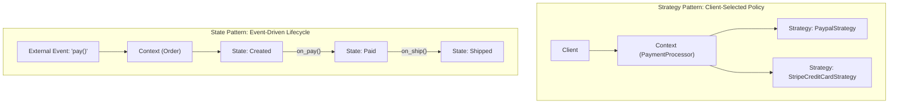
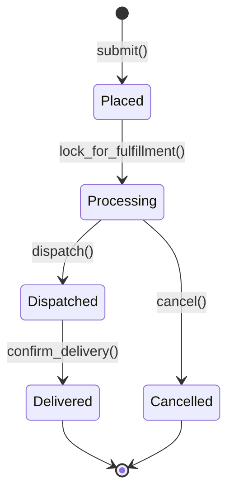

# Strategy and State Patterns: Staff-Plus Deep Dive

## 1. Overview and Core Philosophy

The **Strategy** and **State** patterns share an almost identical structural class diagram: both rely on a context class delegating operations to an interchangeable polymorphic interface.
However, their architectural intent, temporal dynamics, and state transitions are fundamentally distinct.

- **Strategy Pattern**: Encapsulates a family of interchangeable algorithms or policies behind a common interface. The client or context chooses a strategy to achieve a specific goal (for example, sorting an array, calculating a route, or computing tax). The strategy rarely changes during the execution of that specific operation.
- **State Pattern**: Allows an object to alter its behavior when its internal state changes, appearing as though its class has morphed. State transitions are dynamic and driven by external events or the states themselves.



---

## 2. Strategy Pattern: Architectural Mechanics

### 2.1 Object-Oriented vs Functional Strategies
In classical GoF, every strategy is a concrete class implementing an interface with an `execute()` method.
In modern languages supporting first-class functions (Python, Go, Modern C++, Java 8+ lambdas), simple stateless strategies do not require dedicated class boilerplate; a closure, function pointer, or callable object suffices:

```python
# Modern Functional Strategy
pricing_strategy: Callable[[float], float] = lambda base: base * 1.15
```
Dedicated strategy classes remain essential when the strategy maintains internal state, lifecycle hooks, or multi-method contracts.

### 2.2 Compilation and Performance Trade-offs
1. **Dynamic Strategy (Polymorphic vtable)**: The context stores a pointer/reference to an interface. Incurs a virtual function call overhead per invocation; allows runtime swapping.
2. **Static Strategy (C++ Policy-Based Design)**: The context takes the strategy as a template parameter (`template <typename RoutingPolicy> class Router`). Resolved entirely at compile time, eliminating vtable overhead and enabling compiler inline optimization.

---

## 3. State Pattern: Concurrency and Lifecycle Safety



### 3.1 Eliminating the Switch-Statement Anti-Pattern
Without the State pattern, stateful entities devolve into sprawling conditional ladders:
```python
# Anti-Pattern: Fragile switch-case state management
def dispatch(self):
    if self.state == "PLACED":
        raise Error("Must process first")
    elif self.state == "PROCESSING":
        self.state = "DISPATCHED"
    elif self.state == "DISPATCHED":
        raise Error("Already dispatched")
```
Every new state or transition requires editing every method in the class, directly violating the Open/Closed Principle.
The State pattern isolates state-specific behavior and transition invariants into discrete, testable classes.

### 3.2 Concurrency and Race Condition Defense
In multi-threaded enterprise services (such as e-commerce checkouts or payment states), two concurrent requests might attempt to transition state simultaneously (e.g., concurrent `cancel()` and `capture_payment()`).
Staff engineers guarantee atomic state transitions using:
1. **Compare-And-Swap (CAS)**: Atomic reference updates ensuring the state transitions from expected state $S_A$ to $S_B$ without interleaving.
2. **Synchronized Mutex Locks**: Serializing lifecycle events on the aggregate root.
3. **Explicit Transition Events**: Raising strongly typed domain exceptions if a transition is attempted from an incompatible state.

---

## 4. Architectural Comparison

| Dimension | Strategy Pattern | State Pattern |
| :--- | :--- | :--- |
| **Primary Intent** | Interchangeable algorithms or business policies. | Polymorphic behavior based on internal lifecycle state. |
| **Who Drives Transitions?** | Typically chosen once by client / configuration. | State objects or context transition dynamically as events occur. |
| **Knowledge of Other Variants**| Strategies are independent and unaware of each other. | States frequently know of and instantiate subsequent target states. |
| **Context Coupling** | Low; strategy receives input arguments. | High; state often holds reference to context to mutate its state. |
| **Typical Multiplicity** | One strategy configured per execution. | Rapidly transitions through multiple states over an entity lifetime. |

---

## 5. Complete Production-Grade Simulation in Python

The following script implements:
1. A **Dynamic Order Pricing Strategy** (Standard vs Surge vs Loyalty).
2. A **Concurrency-Safe Order State Machine** guarding against illegal transitions and race conditions.

```python
"""
Strategy and State Patterns Production Simulation.
Demonstrates:
1. Strategy Pattern: Interchangeable pricing algorithms with runtime swap.
2. State Pattern: Formally guarded e-commerce order lifecycle.
3. Concurrency Safety: Atomic transitions protecting invariant states.
"""

from abc import ABC, abstractmethod
import threading
from typing import Dict, Optional


# =====================================================================
# 1. STRATEGY PATTERN: PRICING ENGINE
# =====================================================================

class PricingStrategy(ABC):
    @abstractmethod
    def calculate_price(self, base_cost: float, distance_km: float) -> float:
        pass


class StandardPricingStrategy(PricingStrategy):
    def calculate_price(self, base_cost: float, distance_km: float) -> float:
        return round(base_cost + (distance_km * 1.20), 2)


class SurgePricingStrategy(PricingStrategy):
    def __init__(self, multiplier: float = 1.75):
        self.multiplier = multiplier

    def calculate_price(self, base_cost: float, distance_km: float) -> float:
        standard = base_cost + (distance_km * 1.20)
        return round(standard * self.multiplier, 2)


class VIPLoyaltyPricingStrategy(PricingStrategy):
    def calculate_price(self, base_cost: float, distance_km: float) -> float:
        standard = base_cost + (distance_km * 1.20)
        return round(standard * 0.85, 2)  # 15% discount


# =====================================================================
# 2. STATE PATTERN: CONCURRENT ORDER LIFECYCLE
# =====================================================================

class InvalidStateTransitionError(RuntimeError):
    pass


class OrderState(ABC):
    """Abstract State Contract."""
    @abstractmethod
    def name(self) -> str:
        pass

    @abstractmethod
    def pay(self, order: 'OrderContext') -> None:
        pass

    @abstractmethod
    def fulfill(self, order: 'OrderContext') -> None:
        pass

    @abstractmethod
    def cancel(self, order: 'OrderContext') -> None:
        pass


class CreatedState(OrderState):
    def name(self) -> str:
        return "CREATED"

    def pay(self, order: 'OrderContext') -> None:
        order.set_state(PaidState())

    def fulfill(self, order: 'OrderContext') -> None:
        raise InvalidStateTransitionError("Cannot fulfill an unpaid order.")

    def cancel(self, order: 'OrderContext') -> None:
        order.set_state(CancelledState())


class PaidState(OrderState):
    def name(self) -> str:
        return "PAID"

    def pay(self, order: 'OrderContext') -> None:
        raise InvalidStateTransitionError("Order is already paid.")

    def fulfill(self, order: 'OrderContext') -> None:
        order.set_state(FulfilledState())

    def cancel(self, order: 'OrderContext') -> None:
        # Permitted with refund
        order.set_state(CancelledState())


class FulfilledState(OrderState):
    def name(self) -> str:
        return "FULFILLED"

    def pay(self, order: 'OrderContext') -> None:
        raise InvalidStateTransitionError("Order already fulfilled.")

    def fulfill(self, order: 'OrderContext') -> None:
        raise InvalidStateTransitionError("Order already fulfilled.")

    def cancel(self, order: 'OrderContext') -> None:
        raise InvalidStateTransitionError("Cannot cancel an order that has already been fulfilled.")


class CancelledState(OrderState):
    def name(self) -> str:
        return "CANCELLED"

    def pay(self, order: 'OrderContext') -> None:
        raise InvalidStateTransitionError("Cannot pay for a cancelled order.")

    def fulfill(self, order: 'OrderContext') -> None:
        raise InvalidStateTransitionError("Cannot fulfill a cancelled order.")

    def cancel(self, order: 'OrderContext') -> None:
        raise InvalidStateTransitionError("Order is already cancelled.")


class OrderContext:
    """Context holding state and strategy references."""
    def __init__(self, order_id: str, base_cost: float, distance_km: float, pricing_strategy: PricingStrategy):
        self.order_id = order_id
        self.base_cost = base_cost
        self.distance_km = distance_km
        self._pricing_strategy = pricing_strategy
        self._state: OrderState = CreatedState()
        self._lock = threading.Lock()

    @property
    def current_state_name(self) -> str:
        with self._lock:
            return self._state.name()

    def set_state(self, new_state: OrderState) -> None:
        # Internal state transition
        self._state = new_state

    def set_pricing_strategy(self, strategy: PricingStrategy) -> None:
        with self._lock:
            self._pricing_strategy = strategy

    def calculate_total_amount(self) -> float:
        with self._lock:
            return self._pricing_strategy.calculate_price(self.base_cost, self.distance_km)

    # Thread-safe event triggers delegating to state objects
    def pay(self) -> None:
        with self._lock:
            self._state.pay(self)

    def fulfill(self) -> None:
        with self._lock:
            self._state.fulfill(self)

    def cancel(self) -> None:
        with self._lock:
            self._state.cancel(self)


# =====================================================================
# VERIFICATION SUITE
# =====================================================================

def main():
    print("Executing Strategy and State Verification Suite...")

    # 1. Strategy Verification
    order = OrderContext("ORD-77", base_cost=20.0, distance_km=10.0, pricing_strategy=StandardPricingStrategy())
    # Standard: 20 + (10 * 1.20) = 32.00
    assert order.calculate_total_amount() == 32.00

    # Swap to Surge Pricing: 32.00 * 1.75 = 56.00
    order.set_pricing_strategy(SurgePricingStrategy(multiplier=1.75))
    assert order.calculate_total_amount() == 56.00

    # Swap to VIP Pricing: 32.00 * 0.85 = 27.20
    order.set_pricing_strategy(VIPLoyaltyPricingStrategy())
    assert order.calculate_total_amount() == 27.20
    print("Strategy Algorithm Swapping: Passed.")

    # 2. State Pattern Lifecycle Verification
    assert order.current_state_name == "CREATED"

    # Illegal transition: cannot fulfill before pay
    try:
        order.fulfill()
        assert False, "Should have rejected fulfill on CREATED order"
    except InvalidStateTransitionError:
        print("Illegal State Transition Guard: Passed.")

    # Valid progression
    order.pay()
    assert order.current_state_name == "PAID"
    order.fulfill()
    assert order.current_state_name == "FULFILLED"
    print("Valid State Progression: Passed.")

    # Terminal state protection: cannot cancel fulfilled order
    try:
        order.cancel()
        assert False, "Should have rejected cancel on FULFILLED order"
    except InvalidStateTransitionError:
        print("Terminal State Protection: Passed.")

    print("All Strategy and State validations completed successfully.")


if __name__ == "__main__":
    main()
```

---

## 6. Active Recall Interview Questions

<details>
<summary>1. How do the Strategy and State patterns differ in their architectural intent?</summary>
Strategy encapsulates interchangeable algorithms or policies chosen by the client to accomplish a specific computation.
State encapsulates lifecycle-dependent behaviors where the context object dynamically alters its execution logic as internal state events trigger transitions from one state to another.
</details>

<details>
<summary>2. Why does the State pattern satisfy the Open/Closed Principle better than switch-case conditional blocks?</summary>
In switch-case designs, adding a new state requires modifying every method containing the switch statement, risking regression.
In the State pattern, adding a new state merely requires introducing a new class implementing the State interface.
Existing state classes only need modification if they transition directly to the new state.
</details>

<details>
<summary>3. Who is responsible for triggering state transitions in the State pattern: the Context or the concrete State classes?</summary>
Both approaches exist:
1. State-driven: The concrete State class knows the lifecycle graph and explicitly invokes `context.setState(new NextState())`. This decentralizes transition logic.
2. Context-driven: State objects return status codes or events, and the Context evaluates a transition table. This centralizes transition logic but couples the context to all states.
</details>

<details>
<summary>4. How does compile-time Policy-Based Design in C++ eliminate the runtime overhead of the Strategy pattern?</summary>
Policy-based design passes the strategy as a template parameter (`template <typename StrategyT> class Context`).
Method calls are resolved statically at compile time, eliminating vtable lookups and indirect function calls while allowing full compiler inlining.
</details>

<details>
<summary>5. What race condition occurs when concurrent threads access a stateful object, and how is it prevented?</summary>
Two threads can check preconditions concurrently and attempt conflicting transitions (for example, Thread A cancels an order while Thread B marks it paid).
This is prevented by acquiring a mutual exclusion lock on the context during transition evaluation or using atomic Compare-And-Swap (CAS) state machine operations.
</details>

<details>
<summary>6. Can State objects be shared across multiple Context instances as Flyweights?</summary>
Yes, provided the State objects are strictly stateless (they store zero context-specific instance variables and receive all context state via method arguments).
If states are stateless, a single static instance of each state class can be shared across millions of context objects.
</details>

<details>
<summary>7. What is a hierarchical state machine (Statecharts), and when does it improve on the classic State pattern?</summary>
A Hierarchical State Machine (HSM) organizes states into parent-child nesting trees.
Substates inherit transitions from superstates, eliminating duplicate transition handling across closely related states (for example, handling a universal `EmergencyStop` transition at the superstate level).
</details>

<details>
<summary>8. How do modern functional languages implement the Strategy pattern without classes?</summary>
By accepting first-class functions, lambdas, or closures as arguments.
A function signature `(amount: float) -> float` serves as the contract, eliminating the need to declare explicit Strategy interfaces and subclass boilerplate.
</details>

<details>
<summary>9. What is the danger of having state objects instantiate subsequent state objects directly?</summary>
It creates tight coupling between concrete state classes (State A must know the concrete class of State B).
This makes modifying the lifecycle graph difficult and prevents compiling state classes in isolation.
</details>

<details>
<summary>10. Under what condition is a simple enum and switch statement preferred over the State pattern?</summary>
When the state machine has only 2 or 3 static states that will never expand, transitions are trivial, and state-specific logic is minimal.
Introducing the State pattern for a simple binary boolean flag adds unnecessary class file bloat.
</details>
