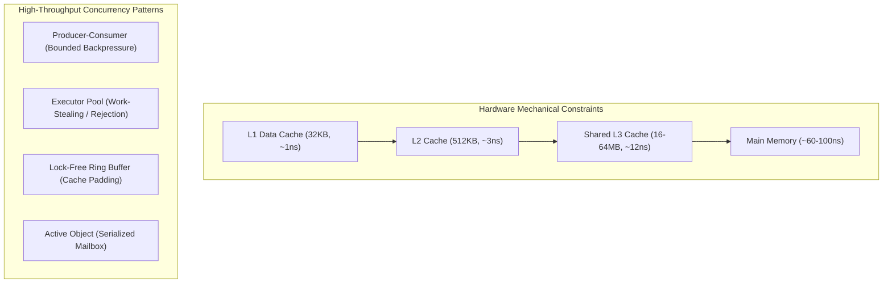
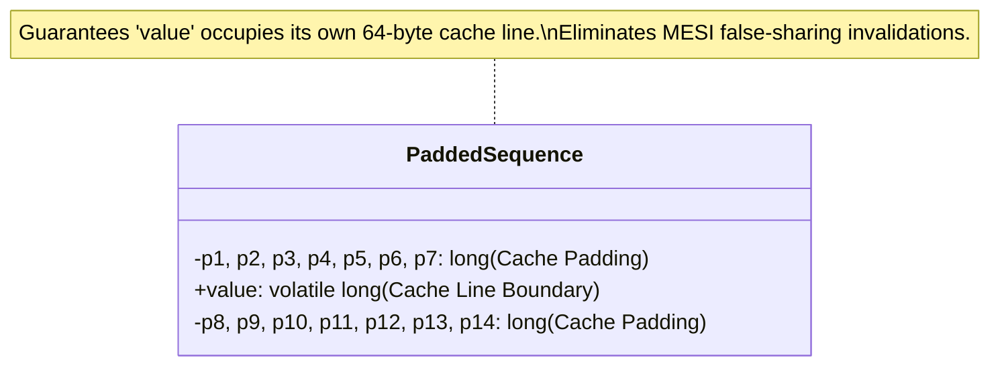

# Concurrency Patterns and Thread Safety: Staff-Plus Deep Dive

## 1. Overview and Hardware Foundations

At Staff and Distinguished levels, concurrent low-level design requires deep mechanical sympathy with modern multi-core CPU architectures.
CPUs do not execute software in a naive sequential memory space.
Instead, execution is governed by:
1. **Multi-Level Cache Hierarchies (L1/L2/L3)**: Accessing L1 cache takes ~1 nanosecond (4 cycles); accessing main RAM takes ~60-100 nanoseconds (~200 cycles).
2. **Cache Coherence Protocols (MESI/MOESI)**: Cores coordinate cache lines (64 bytes) across interconnect buses. Modifying a byte invalidates that entire 64-byte line across all other CPU cores.
3. **Memory Models and Instruction Reordering**: Out-of-order execution engines and compiler optimizations reorder memory reads and writes unless synchronized via explicit memory barriers or acquire-release semantics.

Concurrency patterns are architectural idioms designed to maximize CPU parallelism while eliminating race conditions, deadlocks, and false sharing.



---

## 2. Core Concurrency Patterns

### 2.1 Producer-Consumer with Poison Pill Shutdown
The Producer-Consumer pattern decouples task generation rate from task consumption rate using a thread-safe bounded buffer.
To guarantee graceful termination without abrupt thread interrupts or race conditions, producers push a **Poison Pill** (a sentinel object) into the queue.
When a consumer pulls the poison pill, it terminates cleanly and re-queues the pill (or emits one per worker thread) to cascade shutdown across all consumers.

### 2.2 Reader-Writer Lock and Read-Copy-Update (RCU)
When read traffic heavily outnumbers write traffic (e.g., 99:1 in routing tables or caches), mutual exclusion mutexes cause unnecessary read contention.
- **Reader-Writer Lock (`std::shared_mutex`)**: Allows concurrent shared readers, but grants exclusive access to a single writer. Writers risk starvation unless fair queuing is enforced.
- **Read-Copy-Update (RCU)**: Readers execute with zero lock acquisition. Writers allocate a copy of the structure, mutate the copy, and atomically swap the root pointer using a CAS operation. The old structure is reclaimed after a "grace period" when all pre-existing readers have finished.

### 2.3 Thread Pool / Executor Service Sizing and Rejection Policies
Determining optimal thread pool size ($N_{\text{threads}}$) follows Goetz's law:

$$N_{\text{threads}} = N_{\text{CPU}} \times U_{\text{CPU}} \times \left(1 + \frac{W}{C}\right)$$

Where:
- $N_{\text{CPU}}$ is the number of available hardware CPU cores.
- $U_{\text{CPU}}$ is targeted CPU utilization ($0 \le U_{\text{CPU}} \le 1$).
- $W/C$ is the wait-time-to-compute-time ratio ($W$ = blocking I/O time, $C$ = compute time).
For purely CPU-bound tasks, $W/C \approx 0$, yielding $N_{\text{threads}} \approx N_{\text{CPU}} + 1$.
For I/O-bound tasks where 90% of time is spent waiting on network I/O, $W/C = 9$, requiring $10 \times N_{\text{CPU}}$ threads.

#### Rejection Policies Under Queue Saturation
When a bounded work queue fills up, thread pools apply four standard rejection policies:
1. **AbortPolicy**: Throws `RejectedExecutionException`. Fails fast; forces caller to handle overload.
2. **CallerRunsPolicy**: Executes the task directly on the submitting caller's thread. Throttles upstream submission rate naturally, creating true backpressure.
3. **DiscardPolicy**: Silently drops the newly submitted task without notice.
4. **DiscardOldestPolicy**: Discards the oldest unhandled task in the queue and retries task submission.

---

## 3. The LMAX Disruptor: Lock-Free Ring Buffer Mechanics

Traditional concurrent blocking queues (`BlockingQueue`) suffer from three major bottlenecks:
1. Lock contention and kernel context switches.
2. Memory churn from allocating node wrapper objects per enqueued task.
3. False sharing across adjacent queue pointers (`head` and `tail`).

The LMAX Disruptor resolves all three through:
1. **Pre-allocated Ring Buffer**: An array of pre-allocated event objects of size $2^n$. Power-of-two sizing allows calculating slot index using ultra-fast bitwise masking (`seq & (capacity - 1)`) instead of slow integer division modulo.
2. **Cache Line Padding**: Inserting 56 to 64 bytes of unused dummy padding variables around sequence counters. This ensures that the producer sequence and consumer sequence reside on distinct 64-byte CPU cache lines, completely eliminating false sharing.
3. **Single Writer Principle**: Serializes claims using atomic sequence incrementation or single-producer dedicated assignment.



---

## 4. Architectural Comparison

| Dimension | Mutex / Synchronized | Reader-Writer Lock | Lock-Free CAS Ring Buffer |
| :--- | :--- | :--- | :--- |
| **Throughput (Ops/sec)** | $10^5 - 10^6$ ops/sec | $10^6 - 10^7$ ops/sec (Read-heavy) | $2 \times 10^7 - 10^8$ ops/sec |
| **Latency Profile** | High tail latency (Context switches) | Moderate tail latency (Writer stalls) | Predictable sub-microsecond latency |
| **Complexity** | Low | Moderate | High (Memory models, ABA hazards) |
| **Deadlock Potential** | High if holding multiple locks | High if writer upgrade deadlocks | Zero deadlock potential |
| **Ideal Use Case** | Low-frequency coarse coordination | Read-heavy caching, configuration | High-frequency trading, telemetry ingestion |

---

## 5. Complete Production-Grade Simulation in Python

The following script implements:
1. A **Bounded Thread Pool Executor** with **Caller-Runs Backpressure Rejection**.
2. A **Lock-Free Padded Ring Buffer** simulator implementing bitwise power-of-two slot mapping and circular sequence wrapping.

```python
"""
Concurrency Patterns and Thread Safety Production Simulation.
Demonstrates:
1. Bounded Worker Pool with explicit Caller-Runs Backpressure Rejection.
2. Graceful shutdown using the Poison Pill pattern.
3. Pre-allocated Ring Buffer with power-of-two bitwise indexing.
"""

from abc import ABC, abstractmethod
import queue
import threading
import time
from typing import Callable, List, Optional


# =====================================================================
# 1. BOUNDED EXECUTOR WITH CALLER-RUNS BACKPRESSURE
# =====================================================================

class PoisonPill:
    """Sentinel object signaling consumer shutdown."""
    pass


class BoundedThreadPoolExecutor:
    """ThreadPool enforcing bounded work queue and Caller-Runs rejection."""
    def __init__(self, num_workers: int, queue_capacity: int):
        self.num_workers = num_workers
        self.queue_capacity = queue_capacity
        self._work_queue: queue.Queue = queue.Queue(maxsize=queue_capacity)
        self._workers: List[threading.Thread] = []
        self._is_shutdown = False
        self._lock = threading.Lock()

        self.tasks_executed_by_pool = 0
        self.tasks_executed_by_caller = 0

        # Launch worker pool
        for i in range(num_workers):
            t = threading.Thread(target=self._worker_loop, name=f"PoolWorker-{i}", daemon=True)
            self._workers.append(t)
            t.start()

    def submit(self, task: Callable[[], None]) -> None:
        """Submits task. If queue is full, executes on caller thread (Caller-Runs)."""
        with self._lock:
            if self._is_shutdown:
                raise RuntimeError("Cannot submit task to shutdown executor.")

        try:
            self._work_queue.put_nowait(task)
        except queue.Full:
            # Caller-Runs Policy: executes immediately on submitting thread
            self.tasks_executed_by_caller += 1
            task()

    def _worker_loop(self) -> None:
        while True:
            item = self._work_queue.get()
            if isinstance(item, PoisonPill):
                self._work_queue.task_done()
                break  # Clean exit

            try:
                item()
                self.tasks_executed_by_pool += 1
            except Exception as ex:
                print(f"Worker exception: {ex}")
            finally:
                self._work_queue.task_done()

    def shutdown(self) -> None:
        """Graceful shutdown injecting poison pills per worker."""
        with self._lock:
            self._is_shutdown = True

        # Inject poison pill per worker
        for _ in range(self.num_workers):
            self._work_queue.put(PoisonPill())

        # Await thread termination
        for t in self._workers:
            t.join()


# =====================================================================
# 2. LOCK-FREE RING BUFFER SIMULATION
# =====================================================================

class RingBufferEvent:
    """Pre-allocated mutable event slot in ring buffer."""
    def __init__(self, slot_id: int):
        self.slot_id = slot_id
        self.value: Optional[str] = None


class DisruptorRingBuffer:
    """Circular buffer with power-of-two masking and pre-allocated slots."""
    def __init__(self, capacity: int = 8):
        # Enforce power-of-two capacity
        if capacity <= 0 or (capacity & (capacity - 1)) != 0:
            raise ValueError(f"RingBuffer capacity must be a power of two, got {capacity}")

        self.capacity = capacity
        self.mask = capacity - 1
        # Pre-allocate contiguous slots to eliminate runtime memory allocation
        self.ring: List[RingBufferEvent] = [RingBufferEvent(i) for i in range(capacity)]

        self._cursor = -1
        self._lock = threading.Lock()

    def claim_next_slot(self) -> int:
        """Claims next sequence number atomically."""
        with self._lock:
            self._cursor += 1
            return self._cursor

    def get_event(self, sequence: int) -> RingBufferEvent:
        """Ultra-fast bitwise masking: sequence & mask replaces sequence % capacity."""
        index = sequence & self.mask
        return self.ring[index]


# =====================================================================
# VERIFICATION SUITE
# =====================================================================

def main():
    print("Executing Concurrency Patterns Verification Suite...")

    # 1. Bounded Thread Pool and Backpressure Rejection
    pool = BoundedThreadPoolExecutor(num_workers=2, queue_capacity=2)
    processed_flag: List[int] = []
    lock = threading.Lock()

    def sample_work(item_id: int):
        time.sleep(0.01)
        with lock:
            processed_flag.append(item_id)

    # Submit 10 tasks (exceeding queue capacity 2 + workers 2)
    for i in range(10):
        val = i
        pool.submit(lambda v=val: sample_work(v))

    pool.shutdown()

    assert len(processed_flag) == 10
    assert pool.tasks_executed_by_pool > 0
    assert pool.tasks_executed_by_caller > 0
    print(f"Caller-Runs Backpressure Verified: Pool={pool.tasks_executed_by_pool}, Caller={pool.tasks_executed_by_caller}.")

    # 2. RingBuffer Power-of-Two Bitwise Verification
    ring = DisruptorRingBuffer(capacity=8)
    assert ring.mask == 7

    # Publish 20 events wrapping circular buffer multiple times
    for seq in range(20):
        claimed_seq = ring.claim_next_slot()
        event = ring.get_event(claimed_seq)
        event.value = f"Payload-{seq}"

    # Verify latest sequence 19 maps to index: 19 & 7 = 3
    assert (19 & 7) == 3
    slot_3 = ring.get_event(19)
    assert slot_3.value == "Payload-19"
    print("RingBuffer Bitwise Indexing and Circular Wrapping: Passed.")

    # 3. Non-power-of-two validation
    try:
        DisruptorRingBuffer(capacity=10)
        assert False, "Should have rejected non-power-of-two capacity"
    except ValueError:
        print("Power-of-Two Invariant Guard: Passed.")

    print("All Concurrency Pattern validations completed successfully.")


if __name__ == "__main__":
    main()
```

---

## 6. Active Recall Interview Questions

<details>
<summary>1. What is false sharing in multi-core CPU architectures, and how do lock-free data structures eliminate it?</summary>
False sharing occurs when two independent variables accessed by different CPU cores reside on the same 64-byte cache line.
When Core A modifies its variable, the CPU cache coherence protocol (MESI) invalidates the entire cache line in Core B's L1 cache, forcing Core B to re-fetch from slower L3/RAM even though it was accessing a completely different variable.
Lock-free data structures eliminate false sharing by inserting 56 to 64 bytes of dummy padding around critical sequence counters to ensure they occupy separate cache lines.
</details>

<details>
<summary>2. Why does the LMAX Disruptor require the Ring Buffer capacity to be a power of two?</summary>
Because calculating array indices using integer division (`sequence % capacity`) requires expensive CPU hardware division operations (~20-40 cycles).
If the capacity is a power of two ($2^n$), the modulo operation can be replaced by a single-cycle bitwise AND operation: `sequence & (capacity - 1)`.
</details>

<details>
<summary>3. What is the Caller-Runs rejection policy in thread pool executors, and why is it superior for backpressure?</summary>
When the bounded work queue is saturated, the `CallerRunsPolicy` executes the submitted task directly on the calling thread that invoked `submit()`.
Because the calling thread is busy executing the task, it cannot submit subsequent tasks until execution completes, naturally throttling upstream ingestion rate and preventing Out-Of-Memory (OOM) errors.
</details>

<details>
<summary>4. What is the Poison Pill pattern for thread pool shutdown?</summary>
A Poison Pill is a recognizable sentinel object placed into the work queue by the shutdown coordinator.
Worker threads process normal tasks until dequeuing the poison pill, at which point they terminate their loop cleanly.
This ensures all pre-existing queued tasks are fully processed before termination without resorting to abrupt, unsafe thread interrupts.
</details>

<details>
<summary>5. How does Read-Copy-Update (RCU) achieve zero-lock reads in read-heavy concurrent systems?</summary>
Readers read the data structure without acquiring any locks or performing atomic operations.
When a writer mutates data, it creates a copy of the structure, modifies the copy, and atomically updates the global pointer using a CAS operation.
The old version of the structure is retained until a grace period passes ensuring all pre-existing readers have completed, yielding near-infinite read scalability.
</details>

<details>
<summary>6. How does Goetz's thread pool sizing formula guide configuration for CPU-bound vs I/O-bound tasks?</summary>
$N_{\text{threads}} = N_{\text{CPU}} \times U_{\text{CPU}} \times (1 + W/C)$.
For CPU-bound tasks, wait time $W \approx 0$, so pool size should equal $N_{\text{CPU}} + 1$ to avoid excessive context switching.
For I/O-bound tasks with high wait times (e.g., $W/C = 9$), pool size should be sized to $10 \times N_{\text{CPU}}$ to ensure CPU cores remain fully utilized while threads wait on network I/O.
</details>

<details>
<summary>7. What is the difference between fail-safe and fail-fast iterators under concurrent access?</summary>
Fail-fast iterators track modification count (`modCount`) and abort with `ConcurrentModificationException` if the collection changes during iteration.
Fail-safe iterators traverse an immutable snapshot or copy-on-write buffer, allowing concurrent writes to proceed without throwing exceptions, but sacrificing real-time visibility into concurrent writes.
</details>

<details>
<summary>8. Why are pre-allocated ring buffer events preferred over dynamic object allocation in low-latency systems?</summary>
Allocating new event objects per message creates continuous heap churn, causing memory fragmentation and triggering garbage collection (GC) stop-the-world pauses.
A pre-allocated ring buffer instantiates all event objects once at startup; publishers simply overwrite mutable fields in the existing slot, achieving zero-allocation hot paths.
</details>

<details>
<summary>9. What is reader starvation in a naive Reader-Writer Lock, and how is it prevented?</summary>
In a read-preferring lock, as long as at least one reader holds the lock, incoming readers are immediately granted access.
Under continuous read traffic, a waiting writer can be starved indefinitely.
Fair Reader-Writer locks prevent starvation by queuing requests: if a writer is waiting, subsequent incoming readers are blocked until the writer completes.
</details>

<details>
<summary>10. What is the ABA problem in lock-free CAS operations, and how is it resolved?</summary>
The ABA problem occurs when Thread 1 reads value A, Thread 2 changes A to B and back to A, and Thread 1's CAS succeeds because the memory still holds value A, unaware that the underlying object graph was mutated.
It is resolved using tagged pointers or versioned references (e.g., `AtomicStampedReference` in Java or double-word CAS in C++), incrementing a version counter with every mutation.
</details>
