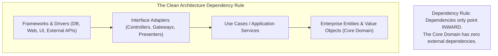
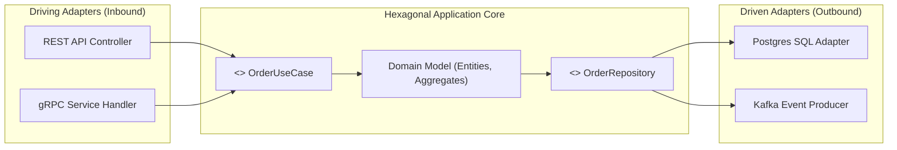
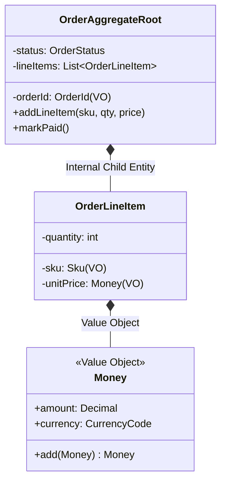
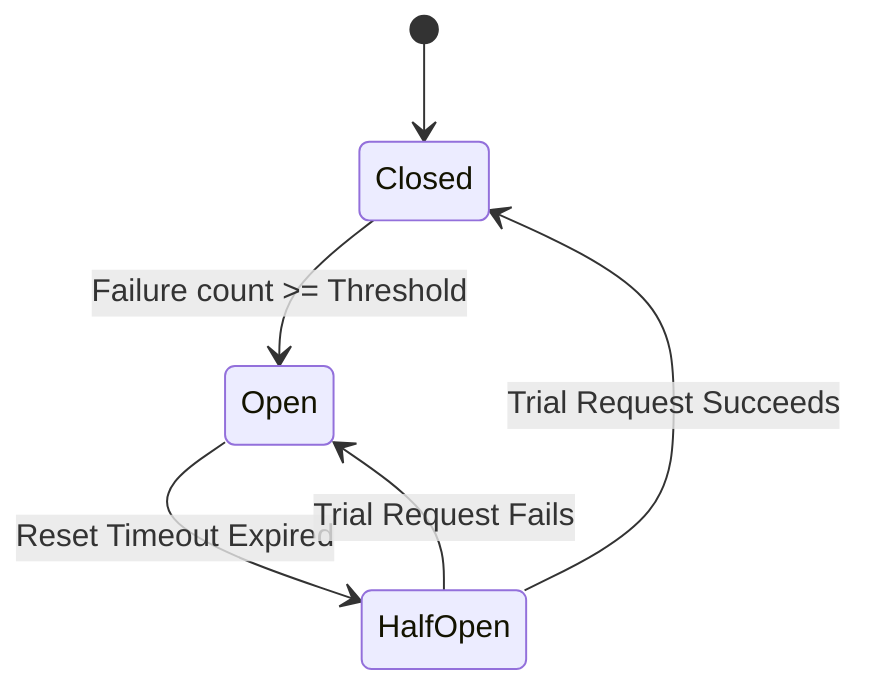

# Clean Architecture and Domain-Driven Design (DDD): Staff-Plus Deep Dive

## 1. Overview and Core Philosophy

In enterprise system design, software decay frequently accelerates when domain business logic becomes intertwined with persistence frameworks (such as SQL ORMs), web delivery protocols (such as HTTP controllers), or cloud SDKs.
When database schemas dictate business models, migrating databases, upgrading transport protocols, or writing deterministic unit tests becomes prohibitively expensive.

**Clean Architecture** (Robert C. Martin) and **Hexagonal Architecture / Ports and Adapters** (Alistair Cockburn) establish an architectural firewall around the business core.
**Domain-Driven Design (DDD)** (Eric Evans) supplies the tactical modeling building blocks to express complex business invariants cleanly inside that core.



---

## 2. Hexagonal Architecture (Ports and Adapters)

Hexagonal architecture views the application as a black box surrounded by boundary ports:
1. **Primary / Driving Ports (Inbound)**:
   Define the operations the outside world can request of the application (e.g., `OrderFulfillmentUseCase`).
   Driving Adapters (e.g., `RESTController`, `GraphQLResolver`, `CLIParser`) translate external wire requests into domain commands.
2. **Secondary / Driven Ports (Outbound)**:
   Define the capabilities the application requires from external infrastructure (e.g., `OrderRepositoryPort`, `PaymentGatewayPort`).
   Driven Adapters (e.g., `PostgresOrderRepository`, `StripeGatewayAdapter`) implement these ports using concrete databases or third-party SDKs.



---

## 3. Tactical Domain-Driven Design (DDD) Patterns

Tactical DDD structures the internal domain model into cohesive, invariant-preserving primitives:

| Tactical DDD Primitive | Formal Architectural Definition | Engineering Rules & Constraints |
| :--- | :--- | :--- |
| **Entity** | An object defined by its persistent unique identity, not its attributes. | Mutable lifecycle; maintains identity across restarts (e.g., `User` with UUID). |
| **Value Object (VO)** | An immutable object defined entirely by the equality of its attributes; no identity. | Strictly immutable; side-effect-free methods; replaces primitive obsession (e.g., `Money(10, 'USD')`). |
| **Aggregate Root** | A cluster of associated entities and value objects treated as a single transactional unit. | External objects may only hold references to the Root; all mutations must enter through Root methods. |
| **Domain Event** | A record of a past business occurrence within the domain. | Immutable past-tense event (e.g., `OrderPaidEvent`); decoupled from downstream side effects. |
| **Repository** | A driven port abstracting persistence collections as an in-memory set. | Only Aggregate Roots have repositories; never create repositories for internal child entities. |
| **Unit of Work** | Tracks dirty, new, and deleted entities in a transaction to commit atomically. | Batches database queries; guarantees all-or-nothing transaction demarcation. |



---

## 4. Component Resilience: Circuit Breaker with Exponential Backoff

In enterprise architectures, microservice boundaries are prone to cascading failures.
The **Circuit Breaker** pattern protects system stability by monitoring outbound network failures:
- **CLOSED**: Requests flow normally. If failure rate exceeds a threshold within a time window, the breaker trips to OPEN.
- **OPEN**: All requests fail immediately without invoking the external service (fail-fast), protecting downstream systems from overload.
- **HALF-OPEN**: After a sleep window, a trial request is permitted through. If successful, the breaker resets to CLOSED; if it fails, it returns to OPEN.



---

## 5. Complete Production-Grade Simulation in Python

The following script implements:
1. A **Hexagonal Order Processing Core** with immutable **Value Objects** (`Money`), an **Aggregate Root** (`Order`), and an in-memory **Unit of Work**.
2. A **Resilient Circuit Breaker** guarding external outbound payment gateways with failure thresholding and half-open trial transitions.

```python
"""
Clean Architecture and Tactical DDD Production Simulation.
Demonstrates:
1. Tactical DDD: Value Objects, Entities, and Aggregate Roots.
2. Hexagonal Architecture: Repository port and in-memory Unit of Work.
3. Production Circuit Breaker: Closed -> Open -> Half-Open state machine.
"""

from abc import ABC, abstractmethod
from decimal import Decimal
import time
from typing import Dict, List, Optional, Set
import uuid


# =====================================================================
# 1. TACTICAL DDD: VALUE OBJECTS AND AGGREGATE ROOT
# =====================================================================

class Money:
    """Immutable Value Object with structural equality."""
    def __init__(self, amount: Decimal, currency: str):
        if amount < 0:
            raise ValueError("Money amount cannot be negative")
        self._amount = amount
        self._currency = currency.upper()

    @property
    def amount(self) -> Decimal:
        return self._amount

    @property
    def currency(self) -> str:
        return self._currency

    def add(self, other: 'Money') -> 'Money':
        if self._currency != other._currency:
            raise ValueError(f"Currency mismatch: {self._currency} != {other._currency}")
        return Money(self._amount + other._amount, self._currency)

    def __eq__(self, other: object) -> bool:
        if not isinstance(other, Money):
            return False
        return self._amount == other._amount and self._currency == other._currency

    def __repr__(self) -> str:
        return f"{self._amount:.2f} {self._currency}"


class OrderItem:
    """Internal Entity owned exclusively by OrderAggregate."""
    def __init__(self, sku: str, quantity: int, unit_price: Money):
        if quantity <= 0:
            raise ValueError("Quantity must be positive")
        self.sku = sku
        self.quantity = quantity
        self.unit_price = unit_price

    def subtotal(self) -> Money:
        return Money(self.unit_price.amount * self.quantity, self.unit_price.currency)


class OrderAggregate:
    """Aggregate Root enforcing transactional consistency boundaries."""
    def __init__(self, order_id: str, customer_id: str):
        self.order_id = order_id
        self.customer_id = customer_id
        self._items: List[OrderItem] = []
        self.status = "CREATED"
        self.domain_events: List[str] = []

    def add_line_item(self, sku: str, quantity: int, unit_price: Money) -> None:
        if self.status != "CREATED":
            raise RuntimeError("Cannot modify items after order is placed.")
        self._items.append(OrderItem(sku, quantity, unit_price))

    def calculate_total(self, currency: str = "USD") -> Money:
        total = Money(Decimal("0.00"), currency)
        for item in self._items:
            total = total.add(item.subtotal())
        return total

    def mark_paid(self) -> None:
        if not self._items:
            raise RuntimeError("Cannot pay for empty order.")
        if self.status != "CREATED":
            raise RuntimeError(f"Cannot pay order in state: {self.status}")
        self.status = "PAID"
        self.domain_events.append(f"OrderPaidEvent(order_id={self.order_id})")


# =====================================================================
# 2. HEXAGONAL PORTS AND UNIT OF WORK
# =====================================================================

class OrderRepositoryPort(ABC):
    @abstractmethod
    def save(self, order: OrderAggregate) -> None:
        pass

    @abstractmethod
    def get_by_id(self, order_id: str) -> Optional[OrderAggregate]:
        pass


class UnitOfWork(OrderRepositoryPort):
    """Unit of Work tracking dirty aggregates to commit atomically."""
    def __init__(self):
        self._committed_storage: Dict[str, OrderAggregate] = {}
        self._dirty_registry: Set[OrderAggregate] = set()

    def save(self, order: OrderAggregate) -> None:
        self._dirty_registry.add(order)

    def get_by_id(self, order_id: str) -> Optional[OrderAggregate]:
        for dirty in self._dirty_registry:
            if dirty.order_id == order_id:
                return dirty
        return self._committed_storage.get(order_id)

    def commit(self) -> None:
        # Atomic persistence flush
        for order in self._dirty_registry:
            self._committed_storage[order.order_id] = order
        self._dirty_registry.clear()

    def rollback(self) -> None:
        self._dirty_registry.clear()


# =====================================================================
# 3. COMPONENT RESILIENCE: CIRCUIT BREAKER PATTERN
# =====================================================================

class CircuitBreakerOpenException(RuntimeError):
    pass


class CircuitBreaker:
    """Stateful circuit breaker protecting external service calls."""
    def __init__(self, failure_threshold: int = 3, reset_timeout_sec: float = 0.5):
        self.failure_threshold = failure_threshold
        self.reset_timeout_sec = reset_timeout_sec
        self.state = "CLOSED"  # CLOSED, OPEN, HALF_OPEN
        self.failure_count = 0
        self.last_state_change = time.time()

    def call(self, func, *args, **kwargs):
        now = time.time()

        if self.state == "OPEN":
            if now - self.last_state_change > self.reset_timeout_sec:
                self.state = "HALF_OPEN"
                self.last_state_change = now
            else:
                raise CircuitBreakerOpenException("Circuit breaker is OPEN. Call rejected immediately.")

        try:
            result = func(*args, **kwargs)
            # If call succeeds in HALF_OPEN, reset to CLOSED
            if self.state == "HALF_OPEN":
                self.state = "CLOSED"
                self.failure_count = 0
                self.last_state_change = now
            return result
        except Exception as ex:
            self.failure_count += 1
            if self.failure_count >= self.failure_threshold or self.state == "HALF_OPEN":
                self.state = "OPEN"
                self.last_state_change = now
            raise ex


# =====================================================================
# VERIFICATION SUITE
# =====================================================================

def main():
    print("Executing Clean Architecture and Tactical DDD Verification Suite...")

    # 1. Tactical DDD: Value Objects & Aggregate Root Invariants
    usd_100 = Money(Decimal("100.00"), "USD")
    usd_50 = Money(Decimal("50.00"), "USD")
    total_money = usd_100.add(usd_50)
    assert total_money == Money(Decimal("150.00"), "USD")
    print("Value Object Immutability & Equality: Passed.")

    order = OrderAggregate("ORD-881", "CUST-10")
    order.add_line_item("SKU-MOUSE", quantity=2, unit_price=Money(Decimal("25.00"), "USD"))
    order.add_line_item("SKU-KEYBOARD", quantity=1, unit_price=Money(Decimal("100.00"), "USD"))
    assert order.calculate_total() == Money(Decimal("150.00"), "USD")
    order.mark_paid()
    assert order.status == "PAID"
    assert len(order.domain_events) == 1
    print("Aggregate Root Invariant Boundaries: Passed.")

    # 2. Unit of Work Atomic Commit
    uow = UnitOfWork()
    uow.save(order)
    # Before commit, storage is empty, but UoW tracks it
    assert uow._committed_storage.get("ORD-881") is None
    assert uow.get_by_id("ORD-881") is order

    uow.commit()
    assert uow._committed_storage.get("ORD-881") is order
    assert len(uow._dirty_registry) == 0
    print("Unit of Work Transactional Demarcation: Passed.")

    # 3. Circuit Breaker Resilience Test
    cb = CircuitBreaker(failure_threshold=2, reset_timeout_sec=0.1)

    fail_counter = 0

    def faulty_remote_service():
        nonlocal fail_counter
        fail_counter += 1
        if fail_counter <= 3:
            raise ConnectionError("Remote gateway connection timeout")
        return "SUCCESS_REMOTE_RESPONSE"

    # Call 1: Fails (Count = 1, State = CLOSED)
    try:
        cb.call(faulty_remote_service)
    except ConnectionError:
        pass
    assert cb.state == "CLOSED"

    # Call 2: Fails (Count = 2 >= Threshold -> Trips to OPEN)
    try:
        cb.call(faulty_remote_service)
    except ConnectionError:
        pass
    assert cb.state == "OPEN"

    # Call 3: Immediately rejected by OPEN circuit (Fail-Fast)
    try:
        cb.call(faulty_remote_service)
        assert False, "Should have thrown CircuitBreakerOpenException immediately"
    except CircuitBreakerOpenException:
        print("Circuit Breaker Fail-Fast Rejection: Passed.")

    # Sleep to allow reset timeout to elapse
    time.sleep(0.15)

    # Call 4: Transitions to HALF_OPEN, trial fails (Count was 3) -> Trips back to OPEN
    try:
        cb.call(faulty_remote_service)
    except ConnectionError:
        pass
    assert cb.state == "OPEN"

    # Sleep again
    time.sleep(0.15)

    # Call 5: Transitions to HALF_OPEN, succeeds (Count is now 4 > 3) -> Resets to CLOSED
    result = cb.call(faulty_remote_service)
    assert result == "SUCCESS_REMOTE_RESPONSE"
    assert cb.state == "CLOSED"
    print("Circuit Breaker Half-Open Recovery: Passed.")

    print("All Clean Architecture and Tactical DDD validations completed successfully.")


if __name__ == "__main__":
    main()
```

---

## 6. Active Recall Interview Questions

<details>
<summary>1. What is the fundamental Dependency Rule in Clean Architecture?</summary>
Source code dependencies must strictly point inward, toward higher-level policies.
Entities and Use Cases at the core have zero knowledge of outer rings (database schemas, HTTP routing, UI frameworks, third-party libraries).
Outer layers depend on abstractions declared by inner layers.
</details>

<details>
<summary>2. What is the difference between an Entity and a Value Object in Tactical Domain-Driven Design?</summary>
An Entity is defined by a persistent unique identity that endures across state mutations (e.g., `Order` with `UUID`).
A Value Object has no identity, is defined entirely by its immutable attributes, and two instances with identical attributes are considered equal (e.g., `Money(10, "USD")`).
</details>

<details>
<summary>3. Why must all state mutations to an Aggregate pass exclusively through its Aggregate Root?</summary>
The Aggregate Root is the single gatekeeper of transactional consistency and business invariants for its cluster.
If external clients mutated internal child entities directly, aggregate invariants could be bypassed, leading to corrupted, inconsistent domain state.
</details>

<details>
<summary>4. What is the difference between Driving (Primary) Ports and Driven (Secondary) Ports in Hexagonal Architecture?</summary>
Driving Ports define inbound use-case interfaces through which external actors trigger application actions (e.g., `PlaceOrderUseCase`).
Driven Ports define outbound infrastructure interfaces through which the core interacts with external dependencies (e.g., `OrderRepositoryPort`, `PaymentGatewayPort`).
</details>

<details>
<summary>5. What is the Unit of Work pattern, and how does it optimize database transactions?</summary>
The Unit of Work tracks all aggregates modified (inserted, updated, deleted) during a business use case.
Instead of sending multiple separate database statements throughout execution, the Unit of Work flushes all dirty aggregates atomically in a single batched database transaction at commit time.
</details>

<details>
<summary>6. How does the Circuit Breaker pattern prevent cascading failures across microservices?</summary>
When a downstream service becomes degraded or unresponsive, repeated synchronous calls exhaust thread pools in caller services.
The Circuit Breaker trips to `OPEN` after a failure threshold, immediately failing subsequent requests locally (fail-fast) without executing network calls, protecting caller thread pools and allowing the downstream service time to recover.
</details>

<details>
<summary>7. What occurs during the `HALF-OPEN` state of a Circuit Breaker?</summary>
After a configured sleep timeout in the `OPEN` state, the breaker enters `HALF-OPEN` and permits a single trial request to pass through to the external service.
If the trial request succeeds, the breaker resets to `CLOSED`.
If the trial request fails, the breaker immediately returns to `OPEN` for another sleep duration.
</details>

<details>
<summary>8. Why should Repositories only exist for Aggregate Roots, not for child entities?</summary>
Because Aggregate Roots are the only units of transactional demarcation and persistence retrieval.
Loading or modifying an internal child entity without loading its Aggregate Root violates encapsulation and risks bypassing aggregate consistency rules.
</details>

<details>
<summary>9. What is the difference between an Application Service and a Domain Service in DDD?</summary>
An Application Service coordinates workflow orchestration, transaction demarcation, and port translation, but contains zero business rules.
A Domain Service contains pure domain logic that naturally spans multiple Aggregate Roots and cannot belong to a single entity.
</details>

<details>
<summary>10. What is a Domain Event, and why should it be immutable?</summary>
A Domain Event represents a past business occurrence within the domain (e.g., `OrderCancelledEvent`).
Because events represent facts that have already occurred in the past, they must be strictly immutable and named in the past tense.
</details>
