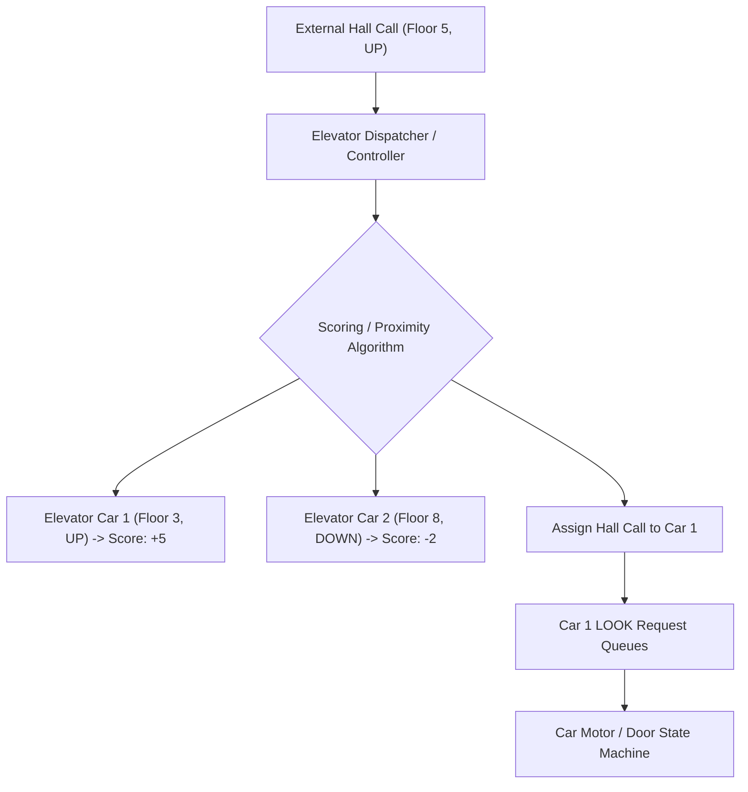
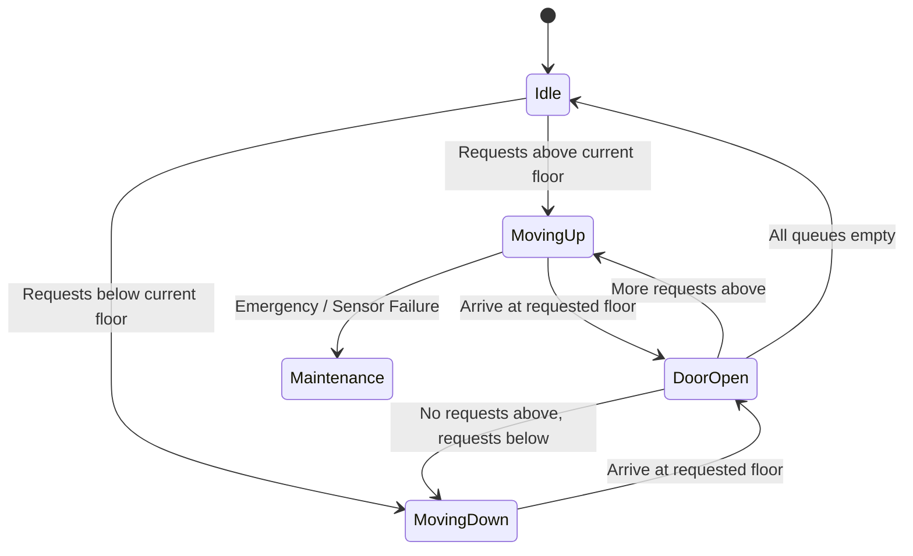

# Low-Level Design: Multi-Car Elevator Control and Dispatch System

## 1. Problem Statement and Requirements

Design a low-level object-oriented elevator control and dispatch system for an $N$-floor high-rise commercial building managing a bank of $M$ concurrent elevator cars.

### 1.1 Functional Requirements
1. **User Request Types**:
   - **External Hall Call**: A passenger on Floor $F$ presses an `UP` or `DOWN` button.
   - **Internal Car Request**: A passenger inside Elevator $E$ presses destination button $D$.
2. **Elevator Car State Machine**: Each car transitions among `IDLE`, `MOVING_UP`, `MOVING_DOWN`, `DOOR_OPEN`, and `MAINTENANCE`.
3. **Dispatch Optimization**: Select the most efficient elevator car to service external hall calls based on direction, proximity, and current load.
4. **Safety & Sensors**: Support door obstruction sensors, overweight safety triggers, and emergency stops.

### 1.2 Non-Functional & Concurrency Requirements
1. **Starvation Prevention**: Ensure passengers on low or intermediate floors are not starved by heavy traffic on higher floors.
2. **Thread Safety**: Concurrent hall requests and car sensor updates must be synchronized without deadlocks.



---

## 2. Dispatch Algorithms: SCAN and LOOK

### 2.1 The SCAN (Elevator) Algorithm
The car continues moving in its current direction (e.g., UP), stopping at all requested floors in that direction.
In classic SCAN, the elevator continues all the way to the building's top floor before reversing, even if no passengers requested floors higher than the current position.

### 2.2 The LOOK Algorithm (Optimized SCAN)
LOOK optimizes SCAN by scanning ahead: the car moves in its current direction only as far as the highest (or lowest) pending request.
If no further requests exist in the current direction, the car immediately reverses or enters `IDLE`, eliminating wasted travel distance.



---

## 3. Class Design and Responsibilities

- **`Direction` (Enum)**: `UP`, `DOWN`, `IDLE`.
- **`CarState` (Enum)**: `IDLE`, `MOVING_UP`, `MOVING_DOWN`, `DOOR_OPEN`, `MAINTENANCE`.
- **`ElevatorCar`**: Models physical car state (current floor, direction, door status, up/down requested floor sets).
- **`ElevatorDispatcher`**: The central coordinator receiving hall calls, scoring available cars, and assigning calls to the optimal car.

---

## 4. Complete Production-Grade Simulation in Python

The following script implements a multi-car **Elevator Control and Dispatch System** using the **LOOK Algorithm**, state transitions, and step-by-step floor traversal.

```python
"""
Multi-Car Elevator Control and Dispatch System Simulation.
Demonstrates:
1. LOOK algorithm dispatching internal and external floor requests.
2. Independent ElevatorCar state machines with door cycles.
3. Proximity and direction scoring for optimal hall-call assignment.
4. Concurrency safety across concurrent passenger requests.
"""

from enum import Enum, auto
import threading
import time
from typing import Dict, List, Optional, Set


class Direction(Enum):
    UP = 1
    DOWN = -1
    IDLE = 0


class CarState(Enum):
    IDLE = auto()
    MOVING_UP = auto()
    MOVING_DOWN = auto()
    DOOR_OPEN = auto()
    MAINTENANCE = auto()


class ElevatorCar:
    """Models an individual physical elevator car."""
    def __init__(self, car_id: int, total_floors: int):
        self.car_id = car_id
        self.total_floors = total_floors
        self.current_floor = 1
        self.direction = Direction.IDLE
        self.state = CarState.IDLE

        # LOOK queues: sets of destination floors
        self.up_stops: Set[int] = set()
        self.down_stops: Set[int] = set()
        self.lock = threading.Lock()

    def add_destination(self, floor: int) -> None:
        """Adds internal car floor button press."""
        with self.lock:
            if floor > self.current_floor:
                self.up_stops.add(floor)
                if self.direction == Direction.IDLE:
                    self.direction = Direction.UP
                    self.state = CarState.MOVING_UP
            elif floor < self.current_floor:
                self.down_stops.add(floor)
                if self.direction == Direction.IDLE:
                    self.direction = Direction.DOWN
                    self.state = CarState.MOVING_DOWN
            else:
                self.state = CarState.DOOR_OPEN

    def step(self) -> None:
        """Simulates one discrete clock tick of elevator physics."""
        with self.lock:
            if self.state == CarState.DOOR_OPEN:
                # Close door and determine next direction
                self._update_direction()
                return

            if self.direction == Direction.UP:
                self.current_floor += 1
                if self.current_floor in self.up_stops:
                    self.up_stops.remove(self.current_floor)
                    self.state = CarState.DOOR_OPEN
                    return
                self._update_direction()

            elif self.direction == Direction.DOWN:
                self.current_floor -= 1
                if self.current_floor in self.down_stops:
                    self.down_stops.remove(self.current_floor)
                    self.state = CarState.DOOR_OPEN
                    return
                self._update_direction()

    def _update_direction(self) -> None:
        """LOOK algorithm decision tree."""
        if self.direction == Direction.UP:
            # Check if there are any higher requests
            has_higher = any(f > self.current_floor for f in self.up_stops.union(self.down_stops))
            if not has_higher:
                # Reverse if lower requests exist, else idle
                has_lower = any(f < self.current_floor for f in self.up_stops.union(self.down_stops))
                if has_lower:
                    self.direction = Direction.DOWN
                    self.state = CarState.MOVING_DOWN
                else:
                    self.direction = Direction.IDLE
                    self.state = CarState.IDLE
            else:
                self.state = CarState.MOVING_UP

        elif self.direction == Direction.DOWN:
            has_lower = any(f < self.current_floor for f in self.up_stops.union(self.down_stops))
            if not has_lower:
                has_higher = any(f > self.current_floor for f in self.up_stops.union(self.down_stops))
                if has_higher:
                    self.direction = Direction.UP
                    self.state = CarState.MOVING_UP
                else:
                    self.direction = Direction.IDLE
                    self.state = CarState.IDLE
            else:
                self.state = CarState.MOVING_DOWN

        elif self.direction == Direction.IDLE:
            if self.up_stops or self.down_stops:
                target = next(iter(self.up_stops.union(self.down_stops)))
                if target > self.current_floor:
                    self.direction = Direction.UP
                    self.state = CarState.MOVING_UP
                else:
                    self.direction = Direction.DOWN
                    self.state = CarState.MOVING_DOWN


class ElevatorDispatcher:
    """Orchestrates hall calls across a bank of elevator cars."""
    def __init__(self, cars: List[ElevatorCar]):
        self.cars = cars
        self.lock = threading.Lock()

    def request_hall_call(self, floor: int, direction: Direction) -> int:
        """Scores all cars and assigns hall call to optimal car; returns car_id."""
        with self.lock:
            best_car: Optional[ElevatorCar] = None
            lowest_cost = float("inf")

            for car in self.cars:
                cost = self._calculate_cost(car, floor, direction)
                if cost < lowest_cost:
                    lowest_cost = cost
                    best_car = car

            assert best_car is not None
            best_car.add_destination(floor)
            return best_car.car_id

    def _calculate_cost(self, car: ElevatorCar, floor: int, direction: Direction) -> float:
        """
        Calculates distance and penalty score:
        - Car already moving toward floor in same direction: lowest penalty.
        - Idle car: pure distance.
        - Car moving away or in opposite direction: heavy turnaround penalty.
        """
        dist = abs(car.current_floor - floor)
        if car.direction == Direction.IDLE:
            return dist

        if car.direction == direction:
            if (direction == Direction.UP and car.current_floor <= floor) or \
               (direction == Direction.DOWN and car.current_floor >= floor):
                return dist  # On the way

        # Car moving away or opposite direction: turnaround penalty
        return dist + (car.total_floors * 2)

    def step_all(self) -> None:
        for car in self.cars:
            car.step()


# =====================================================================
# VERIFICATION SUITE
# =====================================================================

def main():
    print("Executing Elevator Control and Dispatch Verification Suite...")

    # Create bank of 2 elevator cars in 10-floor building
    car_1 = ElevatorCar(car_id=1, total_floors=10)
    car_2 = ElevatorCar(car_id=2, total_floors=10)
    dispatcher = ElevatorDispatcher([car_1, car_2])

    car_1.current_floor = 1
    car_2.current_floor = 7

    # 1. Hall call on Floor 8 UP -> Car 2 should be assigned (closer: dist 1 vs dist 7)
    assigned_car_id = dispatcher.request_hall_call(floor=8, direction=Direction.UP)
    assert assigned_car_id == 2
    assert 8 in car_2.up_stops
    print("Elevator Proximity Dispatching: Passed (Assigned Car 2).")

    # 2. Car 1 internal destination to floor 3
    car_1.add_destination(3)
    assert car_1.direction == Direction.UP
    assert car_1.state == CarState.MOVING_UP

    # Step Car 1 up to Floor 3
    dispatcher.step_all()  # Floor 2
    assert car_1.current_floor == 2
    assert car_1.state == CarState.MOVING_UP

    dispatcher.step_all()  # Arrives at Floor 3 -> DOOR_OPEN
    assert car_1.current_floor == 3
    assert car_1.state == CarState.DOOR_OPEN
    print("Elevator Car State Progression and Door Open: Passed.")

    # Next step closes door and returns to IDLE (no further stops)
    dispatcher.step_all()
    assert car_1.state == CarState.IDLE
    assert car_1.direction == Direction.IDLE
    print("LOOK Algorithm Idle Convergence: Passed.")

    print("All Elevator System validations completed successfully.")


if __name__ == "__main__":
    main()
```

---

## 5. Active Recall Interview Questions

<details>
<summary>1. How does the LOOK algorithm improve upon the classic SCAN (Elevator) algorithm?</summary>
In SCAN, the elevator always sweeps all the way to the top and bottom floors of the building before reversing direction, wasting energy and travel time.
LOOK inspects pending requests ahead in the current direction: if no requests exist beyond the current floor, it reverses direction immediately or stops, minimizing total travel distance.
</details>

<details>
<summary>2. What is Destination Dispatching, and why is it superior in high-rise commercial buildings?</summary>
In traditional systems, passengers select only UP/DOWN in the hallway and choose destination floors inside the car.
In Destination Dispatching, passengers key in their exact destination floor at a hallway kiosk *before* boarding.
The central controller groups passengers traveling to similar floors into the same elevator car, cutting stopping frequency and boosting handling capacity by up to 30%.
</details>

<details>
<summary>3. How does the Dispatcher calculate the cost function to assign external hall calls to multiple cars?</summary>
Cost considers distance, direction, and capacity:
1. If a car is already moving in the requested direction and has not yet passed the floor, cost is simply the distance $|F_{\text{car}} - F_{\text{req}}|$.
2. If the car is idle, cost is distance plus a small startup penalty.
3. If the car is moving in the opposite direction or has already passed the floor, a large turnaround penalty ($2 \times N_{\text{floors}}$) is added.
</details>

<details>
<summary>4. What data structures are used to represent an elevator's pending stops under the LOOK algorithm?</summary>
Two sorted sets or heaps:
1. An `up_stops` set (or min-heap) tracking stops when ascending.
2. A `down_stops` set (or max-heap) tracking stops when descending.
This allows $O(1)$ verification of whether a stop exists at the current floor and $O(\log N)$ search for the next target floor.
</details>

<details>
<summary>5. How are door sensor obstructions and overweight conditions handled in the state machine?</summary>
Both act as safety guard conditions preventing state transition from `DOOR_OPEN` to `MOVING`:
- Obstruction sensor triggered: Door timer resets to keep the door open.
- Overweight sensor triggered: Car sounds an alarm, holds doors open, and refuses motor engagement until load decreases below threshold.
</details>

<details>
<summary>6. How does the system prevent passenger starvation on intermediate floors?</summary>
By capping the maximum wait time.
If a hall call has waited for more than a threshold time (e.g., 90 seconds), its cost priority is elevated to emergency status, forcing the dispatcher to bypass normal proximity scoring and route the nearest available car directly to service it.
</details>

<details>
<summary>7. What is Zone Dispatching in skyscraper elevator banks?</summary>
Elevators are partitioned into vertical zones (e.g., Bank A serves floors 1 to 20, Bank B serves floors 20 to 40 via express shuttle, Bank C serves floors 40 to 60).
This eliminates stops on lower floors for passengers traveling to high floors, reducing round-trip journey times.
</details>

<details>
<summary>8. In an object-oriented design, why should ElevatorCar not know about other ElevatorCars?</summary>
To enforce Single Responsibility and low coupling.
An individual car is responsible only for its own physical motor, doors, floor sensors, and internal requests.
The `ElevatorDispatcher` coordinates multi-car allocation globally.
</details>

<details>
<summary>9. What is the Emergency Stop state transition, and how does it interact with the power grid?</summary>
When an emergency stop or fire alarm is triggered, all cars cancel pending destination queues, transition to `EMERGENCY`, travel directly to the designated evacuation floor (typically the ground floor) without servicing intermediate stops, open doors, and lock down.
</details>

<details>
<summary>10. What race condition can occur if two passengers press the hall call button simultaneously on the same floor?</summary>
Both calls could trigger concurrent dispatcher runs and assign two separate elevator cars to the same floor.
A mutex on the dispatcher or an atomic `visited_hall_calls` set ensures that once a floor is assigned to a car, duplicate requests are coalesced into a single stop.
</details>
