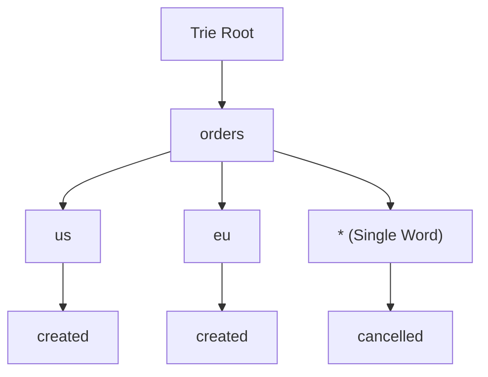

# Low-Level Design: In-Memory Event Bus and Pub-Sub Broker

## 1. Problem Statement and Requirements

Design a production-grade, in-memory **Event Bus / Message Broker** (similar to Guava EventBus or Spring ApplicationEventMulticaster) supporting decoupled publish-subscribe communication across application components.

### 1.1 Functional Requirements
1. **Topic Hierarchy and Pattern Matching**: Support hierarchical topic routing and wildcards:
   - Single-word wildcard `*` (e.g., `orders.*.created` matches `orders.us.created`).
   - Multi-word wildcard `#` (e.g., `orders.#` matches `orders.us.west.created`).
2. **Synchronous and Asynchronous Delivery**: Support both synchronous in-thread dispatch and decoupled thread-pool asynchronous dispatch.
3. **Dead Letter Queue (DLQ)**: Automatically divert events that repeatedly fail consumer execution to a Dead Letter Queue for audit and replay.
4. **Subscriber Exception Isolation**: An uncaught exception in Subscriber A must never abort or delay delivery to Subscriber B.

### 1.2 Non-Functional & Concurrency Requirements
1. **Thread Safety**: Concurrent publications and dynamic subscriber registrations/deregistrations must operate safely without deadlocks.
2. **Bounded Resource Consumption**: Consumer mailboxes must be bounded to prevent Out-Of-Memory errors during consumer lag.

```mermaid
flowchart TD
    Publisher["Publisher"] -->|publish(topic, event)| Bus["EventBus Core"]
    Bus --> Router["Trie-Based Topic Router (Wildcards *, #)"]
    Router --> MatchingSubs["Matching Subscribers"]
    MatchingSubs --> SyncSub["Synchronous Handler (Direct Call)"]
    MatchingSubs --> AsyncSub["Asynchronous Handler (ThreadPool Dispatch)"]
    AsyncSub --> RetryEngine{"Handler Fails?"}
    RetryEngine -- "Retries Exceeded" --> DLQ["Dead Letter Queue (DLQ Sink)"]
```

---

## 2. Topic Matching Architecture: Trie Routing Table

A naive flat map of strings requires iterating over all registered topic regexes on every published event, resulting in $O(S)$ complexity where $S$ is the number of subscribers.
Staff engineers organize topic patterns into a **Trie (Prefix Tree)** where each node represents a dot-delimited segment (e.g., `orders` $\rightarrow$ `us` $\rightarrow$ `created`).
Wildcard matching executes in $O(K)$ where $K$ is the segment depth of the published topic (typically 2 to 5 levels), completely independent of the subscriber count.



---

## 3. Complete Production-Grade Simulation in Python

The following script implements:
1. A **Trie-Based Topic Router** supporting exact matches and single-token wildcards (`*`).
2. A **Concurrent Asynchronous Event Bus** with worker thread pool dispatch.
3. **Exception Isolation** and automatic **Dead Letter Queue (DLQ)** retry routing.

```python
"""
In-Memory Event Bus and Pub-Sub Broker Production Simulation.
Demonstrates:
1. Trie-based hierarchical topic routing with wildcard '*' matching.
2. Asynchronous thread-pool event dispatch with subscriber isolation.
3. Retry policy with Dead Letter Queue (DLQ) diversion upon exhaustion.
"""

from abc import ABC, abstractmethod
import queue
import threading
import time
from typing import Callable, Dict, List, Optional, Set


# =====================================================================
# 1. TOPIC TRIE ROUTER
# =====================================================================

class SubscriberCallback:
    def __init__(self, sub_id: str, handler: Callable[[str, dict], None], is_async: bool = True):
        self.sub_id = sub_id
        self.handler = handler
        self.is_async = is_async


class TrieNode:
    def __init__(self):
        self.children: Dict[str, 'TrieNode'] = {}
        self.subscribers: List[SubscriberCallback] = []


class TopicRouter:
    """Trie-based router matching dot-delimited topics and '*' wildcards."""
    def __init__(self):
        self.root = TrieNode()
        self.lock = threading.Lock()

    def subscribe(self, pattern: str, callback: SubscriberCallback) -> None:
        segments = pattern.split(".")
        with self.lock:
            curr = self.root
            for seg in segments:
                if seg not in curr.children:
                    curr.children[seg] = TrieNode()
                curr = curr.children[seg]
            curr.subscribers.append(callback)

    def find_matching_subscribers(self, topic: str) -> List[SubscriberCallback]:
        segments = topic.split(".")
        matches: List[SubscriberCallback] = []

        with self.lock:
            def _traverse(node: TrieNode, depth: int):
                if depth == len(segments):
                    matches.extend(node.subscribers)
                    return

                seg = segments[depth]
                # 1. Exact match
                if seg in node.children:
                    _traverse(node.children[seg], depth + 1)
                # 2. Wildcard '*' match
                if "*" in node.children:
                    _traverse(node.children["*"], depth + 1)

            _traverse(self.root, 0)

        return matches


# =====================================================================
# 2. EVENT BUS WITH DEAD LETTER QUEUE (DLQ)
# =====================================================================

class DeadLetterMessage:
    def __init__(self, topic: str, payload: dict, error_message: str):
        self.topic = topic
        self.payload = payload
        self.error_message = error_message
        self.timestamp = time.time()


class EventBus:
    """Production-grade in-memory Event Bus."""
    def __init__(self, num_workers: int = 4, max_retries: int = 2):
        self.max_retries = max_retries
        self._router = TopicRouter()
        self._dispatch_queue: queue.Queue = queue.Queue(maxsize=1000)
        self.dead_letter_queue: List[DeadLetterMessage] = []
        self._dlq_lock = threading.Lock()

        self._running = True
        self._workers: List[threading.Thread] = []
        for i in range(num_workers):
            t = threading.Thread(target=self._worker_loop, name=f"BusWorker-{i}", daemon=True)
            self._workers.append(t)
            t.start()

    def subscribe(self, pattern: str, sub_id: str, handler: Callable[[str, dict], None], is_async: bool = True) -> None:
        cb = SubscriberCallback(sub_id, handler, is_async)
        self._router.subscribe(pattern, cb)

    def publish(self, topic: str, payload: dict) -> None:
        subscribers = self._router.find_matching_subscribers(topic)
        for sub in subscribers:
            if sub.is_async:
                # Enqueue for asynchronous thread pool execution
                self._dispatch_queue.put((sub, topic, payload, 0))
            else:
                # Synchronous in-thread execution with exception isolation
                self._invoke_handler_safely(sub, topic, payload)

    def _invoke_handler_safely(self, sub: SubscriberCallback, topic: str, payload: dict) -> bool:
        try:
            sub.handler(topic, payload)
            return True
        except Exception as ex:
            with self._dlq_lock:
                self.dead_letter_queue.append(DeadLetterMessage(topic, payload, str(ex)))
            return False

    def _worker_loop(self) -> None:
        while self._running:
            try:
                task = self._dispatch_queue.get(timeout=0.1)
            except queue.Empty:
                continue

            sub, topic, payload, retry_count = task
            try:
                sub.handler(topic, payload)
            except Exception as ex:
                if retry_count < self.max_retries:
                    # Re-enqueue for retry
                    self._dispatch_queue.put((sub, topic, payload, retry_count + 1))
                else:
                    # Max retries exceeded -> divert to Dead Letter Queue
                    with self._dlq_lock:
                        self.dead_letter_queue.append(DeadLetterMessage(topic, payload, f"{sub.sub_id}: {str(ex)}"))
            finally:
                self._dispatch_queue.task_done()

    def shutdown(self) -> None:
        self._dispatch_queue.join()
        self._running = False
        for t in self._workers:
            t.join()


# =====================================================================
# VERIFICATION SUITE
# =====================================================================

def main():
    print("Executing In-Memory Event Bus Verification Suite...")

    bus = EventBus(num_workers=2, max_retries=2)
    received_events: List[str] = []
    lock = threading.Lock()

    def handle_orders_all(topic: str, payload: dict):
        with lock:
            received_events.append(f"ALL:{topic}:{payload['id']}")

    def handle_orders_us(topic: str, payload: dict):
        with lock:
            received_events.append(f"US:{topic}:{payload['id']}")

    def faulty_handler(topic: str, payload: dict):
        raise RuntimeError("Database connection timeout simulation")

    # 1. Subscribe with wildcards
    bus.subscribe("orders.*.created", "AllOrdersSub", handle_orders_all)
    bus.subscribe("orders.us.created", "USOrdersSub", handle_orders_us)
    bus.subscribe("orders.fail.created", "FaultySub", faulty_handler)

    # 2. Publish matching events
    bus.publish("orders.us.created", {"id": "101"})
    bus.publish("orders.eu.created", {"id": "102"})
    bus.publish("orders.fail.created", {"id": "999"})

    # Graceful shutdown draining queue
    bus.shutdown()

    # Verify routing:
    # 'orders.us.created' matches BOTH 'orders.*.created' and 'orders.us.created'
    assert "ALL:orders.us.created:101" in received_events
    assert "US:orders.us.created:101" in received_events

    # 'orders.eu.created' matches ONLY 'orders.*.created'
    assert "ALL:orders.eu.created:102" in received_events
    assert "US:orders.eu.created:102" not in received_events
    print("Trie Wildcard Matching: Passed.")

    # 3. Verify DLQ Diversion
    assert len(bus.dead_letter_queue) == 1
    dlq_msg = bus.dead_letter_queue[0]
    assert dlq_msg.topic == "orders.fail.created"
    assert "FaultySub" in dlq_msg.error_message
    print("Dead Letter Queue (DLQ) Retry & Diversion: Passed.")

    print("All In-Memory Event Bus validations completed successfully.")


if __name__ == "__main__":
    main()
```

---

## 4. Active Recall Interview Questions

<details>
<summary>1. Why is a Trie data structure preferred over Regex matching for topic pattern routing in Pub-Sub brokers?</summary>
Regex matching requires iterating linearly through every registered subscriber pattern on every published event ($O(S)$ where $S$ is subscriber count).
A Trie parses the topic into dot-delimited tokens and walks the tree in $O(K)$ time (where $K$ is the segment depth of the topic, usually 2 to 5 levels), scaling efficiently to hundreds of thousands of registered subscribers.
</details>

<details>
<summary>2. How does an Event Bus achieve subscriber exception isolation?</summary>
By wrapping individual subscriber handler invocations in a `try-catch` boundary.
If a subscriber throws an unexpected runtime exception, the bus intercepts it, records telemetry or diverts the message to a Dead Letter Queue, and continues dispatching to remaining matching subscribers without halting the pipeline.
</details>

<details>
<summary>3. What is the Dead Letter Queue (DLQ), and what conditions trigger routing a message into it?</summary>
A Dead Letter Queue is an auxiliary storage destination for messages that cannot be successfully processed.
Conditions triggering DLQ routing include:
1. A subscriber handler repeatedly throws exceptions and exhausts its maximum retry threshold.
2. The message schema fails deserialization or validation.
3. The subscriber mailbox is permanently full and drops the event.
</details>

<details>
<summary>4. What is the difference between single-word wildcard (`*`) and multi-word wildcard (`#`) in AMQP/MQTT topic trees?</summary>
The single-word wildcard `*` matches exactly one delimited token (e.g., `sensor.*.temp` matches `sensor.kitchen.temp`, but not `sensor.firstfloor.kitchen.temp`).
The multi-word wildcard `#` matches zero or more delimited tokens (e.g., `sensor.#` matches any topic beginning with `sensor.`, regardless of depth).
</details>

<details>
<summary>5. How does synchronous in-thread event delivery compare to asynchronous thread-pool delivery?</summary>
Synchronous delivery executes handlers directly on the publisher's thread: zero thread-switching latency, shares the publisher's database transaction, but blocks the publisher if handlers perform slow operations.
Asynchronous delivery places tasks onto a work queue for pool workers: unblocks the publisher immediately, but introduces context switching, queue memory pressure, and out-of-order execution risks.
</details>

<details>
<summary>6. How can an in-memory Event Bus guarantee message delivery order for a specific partition or key?</summary>
By using Keyed Execution (or Hash-Based Worker Partitioning).
The bus hashes the message key (`hash(key) % num_workers`) and routes all messages sharing that key into the same dedicated single-threaded worker queue, guaranteeing strict sequential processing for that entity without global serialization.
</details>

<details>
<summary>7. What race condition can occur when a subscriber unregisters from an Event Bus during active publication?</summary>
A publisher thread can retrieve a reference to the subscriber list, and before it invokes the callback, another thread unregisters and destroys the subscriber instance.
This is prevented by making the subscriber list copy-on-write (`CopyOnWriteArrayList` in Java) or holding weak references, ensuring active dispatch loops finish safely over stable snapshots.
</details>

<details>
<summary>8. What is the 'slow consumer' hazard in an asynchronous Event Bus, and how is it mitigated?</summary>
A slow consumer fails to drain its mailbox as fast as events arrive, causing its queue to grow indefinitely and consume RAM until the process crashes with Out-Of-Memory.
Mitigated by enforcing bounded mailboxes, backpressure signaling, and drop policies (Drop Oldest / Drop Latest / DLQ).
</details>

<details>
<summary>9. Why should you avoid using an in-memory Event Bus for multi-node distributed microservices?</summary>
In-memory event buses store state strictly in the local process memory space.
If the host process crashes, all enqueued unconsumed events are permanently lost.
Distributed systems require durable, replicated append-only logs (e.g., Apache Kafka or RabbitMQ) across network boundaries.
</details>

<details>
<summary>10. How does Guava's `@Subscribe` annotation use reflection and method handles in Java EventBus?</summary>
At registration time, the EventBus inspects subscriber class metadata via reflection, caching all methods annotated with `@Subscribe` into an event-type subscriber registry.
When an event of class $T$ is published, it looks up all registered methods accepting type $T$ (or its superclasses) and dispatches the event via fast MethodHandles.
</details>
