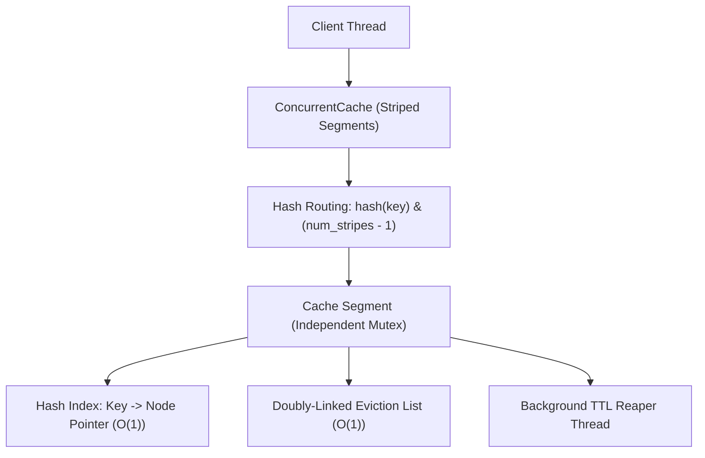

# Low-Level Design: High-Throughput Concurrent In-Memory Cache

## 1. Problem Statement and Requirements

Design a high-throughput, thread-safe in-memory cache (similar to Caffeine or Guava Cache) capable of serving millions of reads and writes per second with strict eviction policies and TTL-based expiration.

### 1.1 Functional Requirements
1. **Core Operations**: `get(key)`, `put(key, value, ttl_seconds)`, and `evict(key)` in $O(1)$ amortized time complexity.
2. **Pluggable Eviction Policies**: Support Least Recently Used (LRU), Least Frequently Used (LFU), and First-In First-Out (FIFO) strategies.
3. **Time-To-Live (TTL) Expiration**: Support per-entry TTL with a dual expiration mechanism (lazy eviction on access + active background reaper thread).
4. **Eviction Listener Callbacks**: Notify registered observers when an entry is evicted, specifying the eviction reason (SIZE, EXPIRED, REPLACED, EXPLICIT).

### 1.2 Non-Functional & Concurrency Requirements
1. **High Concurrency**: Eliminate global mutex bottlenecks using **Lock Striping** (segmented locks across hash buckets) or read-write locks.
2. **Memory Boundedness**: Enforce strict capacity limits to prevent Out-Of-Memory (OOM) failures.



---

## 2. Core Data Structures: LRU and LFU Mechanics

### 2.1 Least Recently Used (LRU)
- **Hash Table**: Maps `key` to `Node(key, value, expiry)`.
- **Doubly-Linked List**:
  - `head`: Points to the most recently used (MRU) node.
  - `tail`: Points to the least recently used (LRU) node.
  - On `get()` or `put()`: Node is detached and spliced to `head` in $O(1)$ pointer operations.
  - On overflow: Node at `tail` is popped in $O(1)$.

### 2.2 Least Frequently Used (LFU)
LFU evicts the entry with the lowest access frequency. In case of ties, it evicts the least recently used among them.
- **Node Hash Table**: Maps `key` to `Node(key, value, frequency)`.
- **Frequency Hash Table**: Maps integer `frequency` to an independent Doubly-Linked List of nodes with that frequency.
- **`min_frequency` Pointer**: Tracks the smallest active frequency counter in the cache. When a node's frequency increments from $F$ to $F+1$, it moves to list $F+1$; if list $F$ becomes empty and $F == \text{min\_frequency}$, $\text{min\_frequency}$ increments to $F+1$.

---

## 3. High-Concurrency Architecture: Lock Striping

A single global mutex causes severe lock contention under multi-core workloads: every CPU core attempts to acquire the same lock cache line, triggering expensive cache invalidations.
**Lock Striping** partitions the key space into $N$ independent segments (where $N$ is typically a power of two, such as 16 or 64).
Each segment maintains its own independent lock, hash table, and eviction list:

$$\text{segment\_index} = \text{hash}(\text{key}) \ \& \ (N - 1)$$

Threads operating on different keys access different segments concurrently without lock contention.

---

## 4. Complete Production-Grade Simulation in Python

The following script implements a concurrent, lock-striped **In-Memory Cache** with LRU eviction, dual TTL expiration, and eviction event listeners.

```python
"""
High-Throughput Concurrent In-Memory Cache Simulation.
Demonstrates:
1. O(1) LRU eviction engine using Doubly-Linked List and Hash Map.
2. Dual TTL expiration: Lazy evaluation on get() + background reaper thread.
3. Lock Striping architecture eliminating global lock contention.
4. Eviction listener callbacks with typed eviction causes.
"""

from abc import ABC, abstractmethod
from enum import Enum, auto
import threading
import time
from typing import Callable, Dict, List, Optional


# =====================================================================
# 1. MODELS AND DATA STRUCTURES
# =====================================================================

class EvictionCause(Enum):
    SIZE = auto()
    EXPIRED = auto()
    EXPLICIT = auto()


class CacheNode:
    """Doubly-linked list node storing key, payload, and expiry timestamp."""
    def __init__(self, key: str, value: str, expiry_timestamp: Optional[float] = None):
        self.key = key
        self.value = value
        self.expiry_timestamp = expiry_timestamp
        self.prev: Optional['CacheNode'] = None
        self.next: Optional['CacheNode'] = None

    def is_expired(self) -> bool:
        if self.expiry_timestamp is None:
            return False
        return time.time() > self.expiry_timestamp


class DoublyLinkedList:
    """O(1) pointer manipulation list for LRU ordering."""
    def __init__(self):
        self.head = CacheNode("__HEAD__", "")
        self.tail = CacheNode("__TAIL__", "")
        self.head.next = self.tail
        self.tail.prev = self.head

    def add_first(self, node: CacheNode) -> None:
        """Splice node directly after head (MRU position)."""
        node.next = self.head.next
        node.prev = self.head
        self.head.next.prev = node  # type: ignore
        self.head.next = node

    def remove(self, node: CacheNode) -> None:
        """Unlink node from list in O(1)."""
        prev_node = node.prev
        next_node = node.next
        if prev_node:
            prev_node.next = next_node
        if next_node:
            next_node.prev = prev_node
        node.prev = None
        node.next = None

    def remove_last(self) -> Optional[CacheNode]:
        """Pop node directly before tail (LRU position)."""
        if self.head.next is self.tail:
            return None
        last_node = self.tail.prev
        assert last_node is not None
        self.remove(last_node)
        return last_node


# =====================================================================
# 2. CACHE SEGMENT (STRIPED SLICE)
# =====================================================================

class CacheSegment:
    """Isolated cache partition guarded by its own independent lock."""
    def __init__(self, capacity: int, eviction_listener: Optional[Callable[[str, EvictionCause], None]] = None):
        self.capacity = capacity
        self.eviction_listener = eviction_listener
        self._table: Dict[str, CacheNode] = {}
        self._lru_list = DoublyLinkedList()
        self._lock = threading.Lock()

    def get(self, key: str) -> Optional[str]:
        with self._lock:
            node = self._table.get(key)
            if not node:
                return None

            # Lazy TTL expiration check
            if node.is_expired():
                self._evict_internal(node, EvictionCause.EXPIRED)
                return None

            # Refresh LRU: move to head
            self._lru_list.remove(node)
            self._lru_list.add_first(node)
            return node.value

    def put(self, key: str, value: str, ttl_seconds: Optional[float] = None) -> None:
        expiry = time.time() + ttl_seconds if ttl_seconds else None

        with self._lock:
            if key in self._table:
                # Update existing node
                existing = self._table[key]
                existing.value = value
                existing.expiry_timestamp = expiry
                self._lru_list.remove(existing)
                self._lru_list.add_first(existing)
                return

            # Check capacity limit
            if len(self._table) >= self.capacity:
                lru_node = self._lru_list.remove_last()
                if lru_node:
                    del self._table[lru_node.key]
                    if self.eviction_listener:
                        self.eviction_listener(lru_node.key, EvictionCause.SIZE)

            # Insert new node
            new_node = CacheNode(key, value, expiry)
            self._table[key] = new_node
            self._lru_list.add_first(new_node)

    def evict(self, key: str) -> bool:
        with self._lock:
            node = self._table.get(key)
            if node:
                self._evict_internal(node, EvictionCause.EXPLICIT)
                return True
            return False

    def clean_expired_entries(self) -> int:
        """Active reaper scan for expired TTL nodes."""
        evicted_count = 0
        with self._lock:
            # Create snapshot list of nodes to safely evaluate expiry
            expired_nodes = [node for node in self._table.values() if node.is_expired()]
            for node in expired_nodes:
                self._evict_internal(node, EvictionCause.EXPIRED)
                evicted_count += 1
        return evicted_count

    def _evict_internal(self, node: CacheNode, cause: EvictionCause) -> None:
        self._lru_list.remove(node)
        del self._table[node.key]
        if self.eviction_listener:
            self.eviction_listener(node.key, cause)

    def size(self) -> int:
        with self._lock:
            return len(self._table)


# =====================================================================
# 3. HIGH-CONCURRENCY STRIPED CACHE CONTAINER
# =====================================================================

class ConcurrentCache:
    """Lock-striped concurrent cache orchestrating multiple independent segments."""
    def __init__(self, total_capacity: int, num_stripes: int = 4, eviction_listener: Optional[Callable] = None):
        assert (num_stripes & (num_stripes - 1)) == 0, "num_stripes must be power of two"
        self.num_stripes = num_stripes
        self.mask = num_stripes - 1
        segment_capacity = max(1, total_capacity // num_stripes)

        self._segments: List[CacheSegment] = [
            CacheSegment(segment_capacity, eviction_listener) for _ in range(num_stripes)
        ]

        # Background active TTL reaper thread
        self._running = True
        self._reaper_thread = threading.Thread(target=self._reaper_loop, daemon=True)
        self._reaper_thread.start()

    def _get_segment(self, key: str) -> CacheSegment:
        stripe_idx = hash(key) & self.mask
        return self._segments[stripe_idx]

    def get(self, key: str) -> Optional[str]:
        return self._get_segment(key).get(key)

    def put(self, key: str, value: str, ttl_seconds: Optional[float] = None) -> None:
        self._get_segment(key).put(key, value, ttl_seconds)

    def evict(self, key: str) -> bool:
        return self._get_segment(key).evict(key)

    def size(self) -> int:
        return sum(seg.size() for seg in self._segments)

    def _reaper_loop(self) -> None:
        while self._running:
            time.sleep(0.05)
            for seg in self._segments:
                seg.clean_expired_entries()

    def shutdown(self) -> None:
        self._running = False
        self._reaper_thread.join()


# =====================================================================
# VERIFICATION SUITE
# =====================================================================

def main():
    print("Executing Concurrent In-Memory Cache Verification Suite...")

    eviction_log: List[tuple] = []

    def log_eviction(k: str, cause: EvictionCause):
        eviction_log.append((k, cause))

    # Single segment LRU verification (capacity = 2)
    segment = CacheSegment(capacity=2, eviction_listener=log_eviction)
    segment.put("k1", "v1")
    segment.put("k2", "v2")
    assert segment.get("k1") == "v1"  # Access k1 -> k2 becomes LRU

    segment.put("k3", "v3")  # Exceeds capacity -> evicts k2
    assert segment.get("k2") is None
    assert segment.get("k1") == "v1"
    assert segment.get("k3") == "v3"
    assert eviction_log[-1] == ("k2", EvictionCause.SIZE)
    print("O(1) LRU Eviction: Passed.")

    # Lazy TTL Expiration verification
    segment.put("temp_key", "temp_val", ttl_seconds=0.05)
    time.sleep(0.08)
    assert segment.get("temp_key") is None  # Lazy eviction triggered on get()
    assert ("temp_key", EvictionCause.EXPIRED) in eviction_log
    print("Lazy TTL Expiration: Passed.")

    # High-Concurrency Lock-Striped Cache
    cache = ConcurrentCache(total_capacity=100, num_stripes=4)

    def worker_thread(thread_id: int):
        for i in range(50):
            cache.put(f"key-{thread_id}-{i}", f"val-{i}")
            val = cache.get(f"key-{thread_id}-{i}")
            assert val == f"val-{i}"

    threads = [threading.Thread(target=worker_thread, args=(tid,)) for tid in range(4)]
    for t in threads:
        t.start()
    for t in threads:
        t.join()

    cache.shutdown()
    print("Multi-Threaded Striped Concurrency: Passed.")

    print("All In-Memory Cache validations completed successfully.")


if __name__ == "__main__":
    main()
```

---

## 5. Active Recall Interview Questions

<details>
<summary>1. How does the combination of a Hash Map and Doubly-Linked List achieve O(1) for both get and put operations in an LRU cache?</summary>
The Hash Map provides $O(1)$ lookup mapping keys directly to pointers of Doubly-Linked List nodes.
The Doubly-Linked List provides $O(1)$ node detachment and insertion at the head (MRU) or tail (LRU) without requiring array shifting.
Combining both ensures that accessing, moving, or evicting any node requires zero $O(N)$ scanning.
</details>

<details>
<summary>2. What is Lock Striping in high-concurrency caches, and how does it prevent thread contention?</summary>
Lock Striping partitions the cache into multiple independent segments (stripes), each protected by its own mutex lock.
Keys are mapped to stripes using a hash function (`hash(key) & (stripes - 1)`).
Threads operating on different stripes execute completely in parallel without contending for the same lock, dramatically scaling throughput on multi-core processors.
</details>

<details>
<summary>3. What are the dual mechanisms used for Time-To-Live (TTL) expiration in enterprise caches?</summary>
1. **Lazy Eviction**: When a key is requested via `get()`, the cache inspects its expiry timestamp. If expired, it deletes the node and returns a cache miss without waiting for background cleanup.
2. **Active Reaper Thread**: A background daemon thread periodically samples or scans segments, evicting expired entries that are never read again to reclaim memory.
</details>

<details>
<summary>4. What is the algorithmic difference between LRU and LFU cache eviction?</summary>
LRU evicts the entry accessed longest ago in chronological time, prioritizing temporal recency.
LFU evicts the entry with the lowest cumulative access count (frequency), prioritizing popularity.
LFU requires frequency buckets or min-heaps to track frequency counts, and typically falls back to LRU to break ties between items with identical frequency.
</details>

<details>
<summary>5. What is the 'cache pollution' vulnerability of simple LRU caches, and how does LFU or W-TinyLFU address it?</summary>
In a simple LRU cache, a batch scan or one-off query that iterates over millions of records flushes out all hot, frequently accessed items from memory, replacing them with cold data that will never be read again.
LFU or Window-TinyLFU (used by Caffeine) maintains frequency sketches to protect frequently accessed historical data against eviction by one-off transient bursts.
</details>

<details>
<summary>6. How does a Read-Write Lock improve caching throughput compared to a standard Mutex?</summary>
A Read-Write Lock (`std::shared_mutex` or `ReentrantReadWriteLock`) allows multiple concurrent reader threads to execute simultaneously without blocking each other.
Only `put()` or eviction writes require an exclusive write lock.
In read-heavy workloads (e.g., 95% reads), this drastically reduces contention.
</details>

<details>
<summary>7. What is the difference between Write-Through, Write-Back, and Write-Around caching strategies?</summary>
- **Write-Through**: The cache updates its in-memory entry and synchronously writes through to the backing database before returning success.
- **Write-Back (Write-Behind)**: The cache writes to memory immediately and acknowledges success, deferring asynchronous batched writes to the database (high write performance, risk of data loss on crash).
- **Write-Around**: Writes bypass the cache entirely and go straight to the database; the cache is populated only on subsequent read misses.
</details>

<details>
<summary>8. In Java Caffeine cache, why are eviction operations executed on a dedicated maintenance thread rather than on the caller thread?</summary>
Caffeine uses lock-free read buffers: readers record access events onto a ring buffer without acquiring locks.
A background maintenance thread periodically drains read and write buffers, updating eviction lists asynchronously.
This keeps the read hot-path purely non-blocking with zero lock contention.
</details>

<details>
<summary>9. Why should you avoid storing memory addresses directly in LRU cache nodes in languages with manual memory management?</summary>
Because when an entry is evicted, its memory must be safely reclaimed without creating dangling pointers.
Smart pointers (`std::shared_ptr` / `std::unique_ptr`) or custom memory arenas prevent use-after-free bugs if an external caller still holds a reference to an evicted value.
</details>

<details>
<summary>10. What is the Thundering Herd (or Cache Stampede) problem, and how is it mitigated at the LLD level?</summary>
When a popular cache key expires, hundreds of concurrent threads simultaneously experience a cache miss and rush to query the database, overloading it.
It is mitigated using Mutex Locking on Cache Miss (single-flight / coalescing): only the first thread acquires a lock to query the database and populate the cache; other threads wait for the lock and read the newly populated cache value.
</details>
