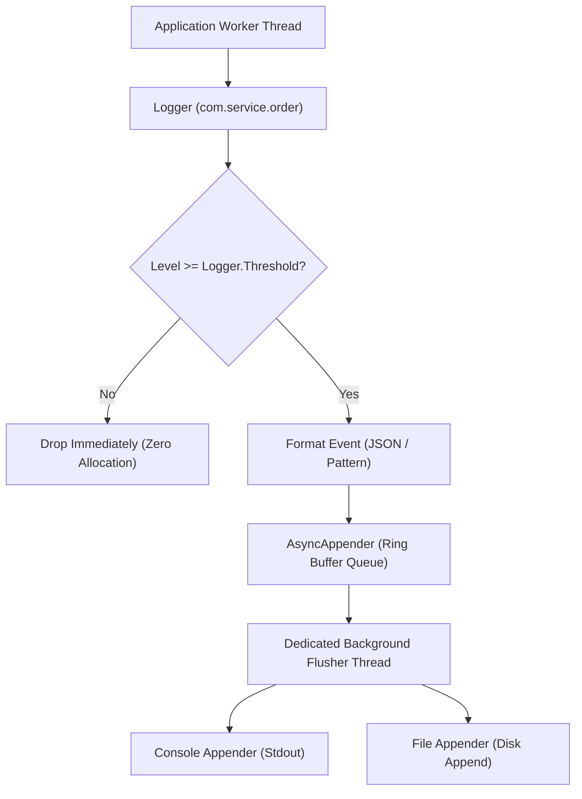

# Low-Level Design: High-Performance Asynchronous Logging Framework

## 1. Problem Statement and Requirements

Design a high-throughput, low-latency, thread-safe **Logging Framework** (comparable to Log4j2, Logback, or Uber's Zap in Go) capable of logging hundreds of thousands of events per second with sub-microsecond caller latency.

### 1.1 Functional Requirements
1. **Log Level Hierarchy**: Support standard ordered levels: `DEBUG < INFO < WARN < ERROR < FATAL`.
2. **Hierarchical Logger Tree**: Support dot-delimited namespaces (e.g., `com.company.auth` inherits log level and appenders from `com.company`, which inherits from `root`).
3. **Pluggable Appenders / Sinks**: Support Console Appender, File Appender, and Asynchronous Buffered Appenders.
4. **Flexible Formatters**: Support both human-readable text pattern formatters and structured JSON layouts.

### 1.2 Non-Functional & Concurrency Requirements
1. **Zero Caller Blocking (Asynchronous Hot Path)**: Application worker threads must never block on disk I/O, network sockets, or filesystem locks.
2. **Minimal Heap Allocation**: Logging statements that evaluate below the active log level must incur zero string concatenation or allocation cost.



---

## 2. Core Architectural Subsystems

### 2.1 The Namespace Hierarchy Tree
Loggers are organized into a tree where dot separators define ancestry:
- If `root` has level `INFO`, and `com.service` has no explicit level configured, `com.service` automatically inherits `INFO` from `root`.
- Appender Additivity: By default, a log event dispatched to a child logger is also emitted by all ancestor appenders up to `root`, unless `additivity = false` is configured.

### 2.2 Asynchronous Ring Buffer vs Synchronous Appender
Synchronous logging issues a blocking write (`write()`, `fsync()`) directly on the caller thread.
Under sudden traffic bursts or slow disk I/O, application threads stall, causing catastrophic API latency spikes.
Asynchronous logging uses an in-memory bounded ring buffer: the caller thread performs an ultra-fast atomic enqueue operation and immediately continues; a dedicated background thread drains the buffer and flushes to disk in batched writes.

---

## 3. Complete Production-Grade Simulation in Python

The following script implements:
1. An ordered **LogLevel** hierarchy and **JSON Formatter**.
2. A **Hierarchical Logger Tree** supporting level inheritance.
3. An **Asynchronous Bounded Appender** with a background worker thread flushing to simulated console and file sinks.

```python
"""
High-Performance Asynchronous Logging Framework Simulation.
Demonstrates:
1. LogLevel enumeration with hierarchical filtering.
2. Namespace logger tree with parent level and appender inheritance.
3. Asynchronous bounded queue appender with dedicated background flusher.
4. Structured JSON formatting.
"""

from abc import ABC, abstractmethod
from enum import IntEnum
import json
import queue
import threading
import time
from typing import Dict, List, Optional


# =====================================================================
# 1. LOG LEVELS AND LOG EVENT
# =====================================================================

class LogLevel(IntEnum):
    DEBUG = 10
    INFO = 20
    WARN = 30
    ERROR = 40
    FATAL = 50


class LogEvent:
    """Immutable event payload captured at the logging callsite."""
    def __init__(self, logger_name: str, level: LogLevel, message: str):
        self.logger_name = logger_name
        self.level = level
        self.message = message
        self.timestamp = time.time()
        self.thread_name = threading.current_thread().name


# =====================================================================
# 2. FORMATTERS
# =====================================================================

class LogFormatter(ABC):
    @abstractmethod
    def format(self, event: LogEvent) -> str:
        pass


class JsonLogFormatter(LogFormatter):
    def format(self, event: LogEvent) -> str:
        data = {
            "timestamp": event.timestamp,
            "level": event.level.name,
            "logger": event.logger_name,
            "thread": event.thread_name,
            "message": event.message
        }
        return json.dumps(data)


# =====================================================================
# 3. APPENDERS (SINKS)
# =====================================================================

class LogAppender(ABC):
    def __init__(self, formatter: LogFormatter):
        self.formatter = formatter

    @abstractmethod
    def append(self, event: LogEvent) -> None:
        pass

    def close(self) -> None:
        pass


class InMemoryFileAppender(LogAppender):
    """Simulates physical file append."""
    def __init__(self, formatter: LogFormatter):
        super().__init__(formatter)
        self.written_lines: List[str] = []
        self._lock = threading.Lock()

    def append(self, event: LogEvent) -> None:
        formatted = self.formatter.format(event)
        with self._lock:
            self.written_lines.append(formatted)


class AsyncBufferedAppender(LogAppender):
    """Asynchronous wrapper decoupling caller threads via bounded queue."""
    def __init__(self, target_appender: LogAppender, buffer_size: int = 500):
        super().__init__(target_appender.formatter)
        self._target = target_appender
        self._queue: queue.Queue[Optional[LogEvent]] = queue.Queue(maxsize=buffer_size)
        self._running = True
        self._worker = threading.Thread(target=self._flusher_loop, name="AsyncLogFlusher", daemon=True)
        self._worker.start()

    def append(self, event: LogEvent) -> None:
        try:
            self._queue.put_nowait(event)
        except queue.Full:
            # Overload policy: drop or record dropped telemetry
            pass

    def _flusher_loop(self) -> None:
        while self._running or not self._queue.empty():
            try:
                event = self._queue.get(timeout=0.05)
            except queue.Empty:
                continue

            if event is None:  # Poison pill
                self._queue.task_done()
                break

            self._target.append(event)
            self._queue.task_done()

    def close(self) -> None:
        self._running = False
        self._queue.put(None)  # Inject poison pill
        self._worker.join()
        self._target.close()


# =====================================================================
# 4. HIERARCHICAL LOGGER AND CONTEXT
# =====================================================================

class Logger:
    """Namespace logger with parent level inheritance and appender additivity."""
    def __init__(self, name: str, level: Optional[LogLevel] = None, parent: Optional['Logger'] = None):
        self.name = name
        self._explicit_level = level
        self.parent = parent
        self.appenders: List[LogAppender] = []
        self.additivity = True

    @property
    def effective_level(self) -> LogLevel:
        if self._explicit_level is not None:
            return self._explicit_level
        if self.parent is not None:
            return self.parent.effective_level
        return LogLevel.INFO  # Root default fallback

    def set_level(self, level: LogLevel) -> None:
        self._explicit_level = level

    def add_appender(self, appender: LogAppender) -> None:
        self.appenders.append(appender)

    def log(self, level: LogLevel, message: str) -> None:
        # Hot-path level gate: Drop immediately if below effective threshold
        if level < self.effective_level:
            return

        event = LogEvent(self.name, level, message)
        self._dispatch(event)

    def _dispatch(self, event: LogEvent) -> None:
        for appender in self.appenders:
            appender.append(event)

        # Bubble up to parents if additivity is enabled
        if self.additivity and self.parent is not None:
            self.parent._dispatch(event)

    def debug(self, msg: str) -> None:
        self.log(LogLevel.DEBUG, msg)

    def info(self, msg: str) -> None:
        self.log(LogLevel.INFO, msg)

    def warn(self, msg: str) -> None:
        self.log(LogLevel.WARN, msg)

    def error(self, msg: str) -> None:
        self.log(LogLevel.ERROR, msg)


class LogManager:
    """Registry maintaining hierarchical logger tree."""
    _loggers: Dict[str, Logger] = {}
    _root: Logger = Logger("root", level=LogLevel.INFO)

    @classmethod
    def get_logger(cls, name: str) -> Logger:
        if name in cls._loggers:
            return cls._loggers[name]

        # Build parent hierarchy
        parts = name.split(".")
        parent = cls._root
        accumulated = ""
        for part in parts:
            accumulated = f"{accumulated}.{part}" if accumulated else part
            if accumulated not in cls._loggers:
                logger = Logger(accumulated, parent=parent)
                cls._loggers[accumulated] = logger
            parent = cls._loggers[accumulated]

        return cls._loggers[name]

    @classmethod
    def get_root_logger(cls) -> Logger:
        return cls._root


# =====================================================================
# VERIFICATION SUITE
# =====================================================================

def main():
    print("Executing Logging Framework Verification Suite...")

    file_sink = InMemoryFileAppender(JsonLogFormatter())
    async_appender = AsyncBufferedAppender(file_sink, buffer_size=100)

    # Configure root logger with async appender
    root = LogManager.get_root_logger()
    root.set_level(LogLevel.WARN)
    root.add_appender(async_appender)

    # Create child loggers
    auth_logger = LogManager.get_logger("com.service.auth")
    db_logger = LogManager.get_logger("com.service.db")
    db_logger.set_level(LogLevel.DEBUG)  # Override parent level

    # 1. Effective Level Inheritance Check
    assert auth_logger.effective_level == LogLevel.WARN  # Inherited from root
    assert db_logger.effective_level == LogLevel.DEBUG    # Explicit override
    print("Logger Level Hierarchy Inheritance: Passed.")

    # 2. Level Filtering Verification
    auth_logger.info("This info message should be dropped by effective WARN level")
    auth_logger.error("Authentication failed for user 44")
    db_logger.debug("Executing SQL query SELECT 1")

    # Flush async appender
    async_appender.close()

    # 3. Verify sink received only matching events
    lines = file_sink.written_lines
    assert len(lines) == 2  # auth_logger.error and db_logger.debug

    parsed_1 = json.loads(lines[0])
    parsed_2 = json.loads(lines[1])

    assert parsed_1["message"] == "Authentication failed for user 44"
    assert parsed_1["level"] == "ERROR"
    assert parsed_2["message"] == "Executing SQL query SELECT 1"
    assert parsed_2["level"] == "DEBUG"
    print("Async Ring Buffer Log Flushing and JSON Layout: Passed.")

    print("All Logging Framework validations completed successfully.")


if __name__ == "__main__":
    main()
```

---

## 4. Active Recall Interview Questions

<details>
<summary>1. Why is asynchronous logging with a ring buffer dramatically faster than synchronous logging?</summary>
Synchronous logging forces the application worker thread to execute system calls (`write()`, `fsync()`) and wait on disk or network I/O, stalling the request.
Asynchronous logging writes the event pointer to an in-memory ring buffer in nanoseconds without blocking, allowing a separate background thread to batch and write events to storage asynchronously.
</details>

<details>
<summary>2. What is logger level inheritance and how does it propagate down a dot-delimited namespace tree?</summary>
Loggers are arranged hierarchically (e.g., `com.company.service`).
If a logger has no explicit log level assigned, it traverses up its ancestor chain until it finds an ancestor with an explicit level (falling back to `root`).
Setting `root` to `WARN` automatically restricts all unconfigured child loggers to `WARN`.
</details>

<details>
<summary>3. What is appender additivity in loggers?</summary>
Appender additivity specifies that a log event dispatched to a child logger is automatically forwarded to all appenders attached to its ancestor loggers.
If `com.company` has a FileAppender and `root` has a ConsoleAppender, logging to `com.company` writes to both the file and console unless `additivity = false` is explicitly set.
</details>

<details>
<summary>4. How does lazy string evaluation prevent performance penalties for disabled log levels?</summary>
Writing `logger.debug(f"User: {user.expensive_computation()}")` evaluates the f-string and method call even if `DEBUG` is disabled, wasting CPU.
Modern frameworks use lambdas or parameterized formatting (`logger.debug("User: {}", user::expensive_computation)`) so the message string is only formatted if the logger's level check passes.
</details>

<details>
<summary>5. What are the trade-offs of the 'drop newest' vs 'block' policies when an asynchronous logging queue is full?</summary>
- **Drop Newest**: Preserves application throughput and prevents API latency spikes during disk stalls, but drops log audit entries.
- **Block**: Guarantees zero log loss, but transfers downstream disk lag directly onto user-facing application threads, potentially crashing API response SLAs.
</details>

<details>
<summary>6. How does Uber's Zap logging library in Go achieve 'zero allocations'?</summary>
Zap avoids runtime reflection, interface boxing, and dynamic string allocations by using strongly typed fields (e.g., `zap.Int("count", 42)`), pre-allocating byte buffers in an object pool, and directly serializing fields into the buffer as bytes.
</details>

<details>
<summary>7. What is a Mapped Diagnostic Context (MDC), and how does it work across threads?</summary>
MDC stores contextual key-value pairs (such as `trace_id`, `user_id`, or `session_id`) in a `ThreadLocal` map.
When log statements are executed, the formatter automatically injects the active MDC fields into the log output, enabling distributed tracing correlation across services.
</details>

<details>
<summary>8. Why is Log4j2's garbage-free mode critical for financial and low-latency systems?</summary>
Standard logging creates millions of short-lived `LogEvent`, `String`, and `Object[]` instances per minute, triggering frequent JVM Young Generation Garbage Collection pauses.
Garbage-free mode reuses pre-allocated `RingBufferLogEvent` instances in a Disruptor ring buffer, eliminating heap allocations on the hot logging path.
</details>

<details>
<summary>9. What is rolling file policy, and what are its two primary trigger conditions?</summary>
A rolling file policy archives the active log file and opens a fresh one when:
1. **Size-based**: The active file reaches a size limit (e.g., 100 MB).
2. **Time-based**: A time boundary rolls over (e.g., daily at midnight `yyyy-MM-dd`).
Old logs are typically compressed (`.gz`) and pruned after a retention threshold.
</details>

<details>
<summary>10. What vulnerability caused the infamous 'Log4Shell' (CVE-2021-44228) exploit?</summary>
Log4j enabled JNDI (Java Naming and Directory Interface) message lookup interpolation by default inside log message strings (`${jndi:ldap://...}`).
When untrusted user input containing JNDI syntax was logged, Log4j evaluated the lookup, reached out to an attacker-controlled LDAP server, and deserialized arbitrary remote code.
</details>
