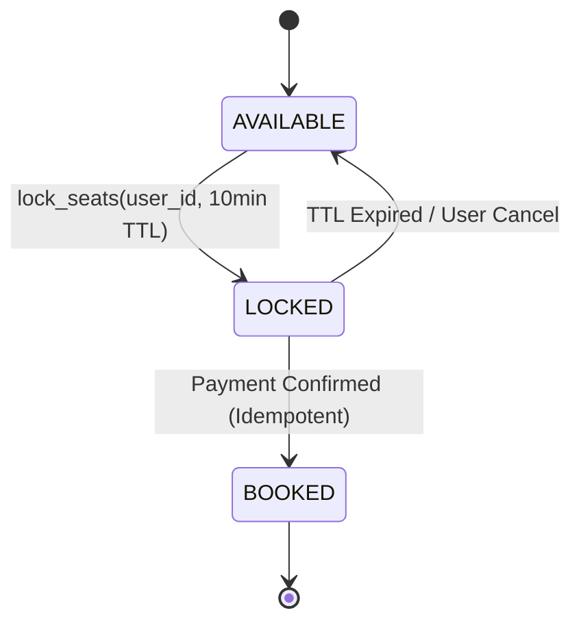

# Low-Level Design: High-Concurrency Movie Ticket and Seat Booking System

## 1. Problem Statement and Requirements

Design a high-concurrency **Movie Ticket / Seat Booking System** (comparable to BookMyShow or Ticketmaster) capable of handling millions of concurrent users booking popular showtimes with zero double-booking errors.

### 1.1 Functional Requirements
1. **Cinema and Catalog Model**: Hierarchical entity structure: `Cinema` $\rightarrow$ `Screen` $\rightarrow$ `Show` $\rightarrow$ `ShowSeat`.
2. **Seat State Lifecycle**:
   - `AVAILABLE`: Open for selection.
   - `LOCKED`: Temporarily reserved for a specific user session for a 10-minute payment window.
   - `BOOKED`: Permanently sold upon successful payment confirmation.
3. **Automatic TTL Expiration**: If payment is not completed within the 10-minute window, locked seats automatically revert to `AVAILABLE`.
4. **Idempotent Payment Confirmation**: Double-submitted payment webhooks or duplicate network callbacks must not double-charge or corrupt booking records.

### 1.2 Non-Functional & Concurrency Requirements
1. **Zero Double-Booking Guarantee**: Strict linearizability when multiple users click "Book" on the exact same seat simultaneously.
2. **High Throughput**: Seat status reads must be non-blocking.



---

## 2. Concurrency Mechanics: Temporary Locks and Race Conditions

### 2.1 The Two-Phase Reservation Pattern
Directly jumping from `AVAILABLE` to `BOOKED` during payment creates severe database bottlenecks: payment gateways take 3 to 10 seconds to authorize, during which seats must be held.
The system implements a Two-Phase Reservation:
1. **Phase 1 (Soft Lock)**: Seats are atomically marked `LOCKED` with an expiration timestamp (`locked_until = now() + 600s`) and associated `user_id`.
2. **Phase 2 (Hard Commit)**: Upon receiving payment confirmation, the seats transition to `BOOKED`.

### 2.2 Concurrency Defense Strategies
- **Database Optimistic Locking**:
  ```sql
  UPDATE show_seats 
  SET status = 'LOCKED', user_id = 'user_1', locked_until = NOW() + INTERVAL '10 MINUTE', version = version + 1
  WHERE seat_id = 'A12' AND (status = 'AVAILABLE' OR (status = 'LOCKED' AND locked_until < NOW()))
    AND version = 5;
  ```
  If zero rows are updated, another user acquired the lock first; the transaction immediately aborts.
- **In-Memory Distributed Lock (Redis Redlock / Lua)**:
  Atomically check if keys exist and set lease token with 10-minute TTL in a single atomic script.

---

## 3. Complete Production-Grade Simulation in Python

The following script implements:
1. A **Movie Show and Seat Domain Model** with typed seat tiers (Silver, Gold).
2. A **Temporary Seat Lock Engine** with TTL auto-expiration and background reclamation.
3. High-concurrency race condition testing proving zero double-booking under multi-threaded contention.

```python
"""
Movie Ticket and Seat Booking System Production Simulation.
Demonstrates:
1. Two-phase seat reservation with temporary 10-minute TTL locks.
2. Atomic multi-seat acquisition eliminating partial locking deadlocks.
3. Lazy and active TTL expiration reverting abandoned seats to AVAILABLE.
4. Idempotent payment confirmation.
"""

from enum import Enum, auto
import threading
import time
from typing import Dict, List, Optional, Set
import uuid


class SeatStatus(Enum):
    AVAILABLE = auto()
    LOCKED = auto()
    BOOKED = auto()


class SeatTier(Enum):
    SILVER = 10.0
    GOLD = 15.0
    PLATINUM = 20.0


class ShowSeat:
    """Individual seat within a specific movie showtime."""
    def __init__(self, seat_id: str, row: str, number: int, tier: SeatTier):
        self.seat_id = seat_id
        self.row = row
        self.number = number
        self.tier = tier
        self.status = SeatStatus.AVAILABLE
        self.locked_by_user: Optional[str] = None
        self.lock_expiry: Optional[float] = None
        self.lock = threading.Lock()

    def is_available(self, current_time: float) -> bool:
        with self.lock:
            if self.status == SeatStatus.AVAILABLE:
                return True
            if self.status == SeatStatus.LOCKED and self.lock_expiry and current_time > self.lock_expiry:
                # Expired lock -> treat as available
                return True
            return False

    def try_lock(self, user_id: str, ttl_seconds: float, current_time: float) -> bool:
        """Atomically locks seat if available or if prior lock has expired."""
        with self.lock:
            if self.status == SeatStatus.AVAILABLE or (
                self.status == SeatStatus.LOCKED and self.lock_expiry and current_time > self.lock_expiry
            ):
                self.status = SeatStatus.LOCKED
                self.locked_by_user = user_id
                self.lock_expiry = current_time + ttl_seconds
                return True
            return False

    def confirm_booking(self, user_id: str) -> bool:
        """Commits lock into permanent booking."""
        with self.lock:
            if self.status == SeatStatus.LOCKED and self.locked_by_user == user_id:
                self.status = SeatStatus.BOOKED
                self.locked_by_user = None
                self.lock_expiry = None
                return True
            return False

    def release_lock(self, user_id: str) -> None:
        with self.lock:
            if self.status == SeatStatus.LOCKED and self.locked_by_user == user_id:
                self.status = SeatStatus.AVAILABLE
                self.locked_by_user = None
                self.lock_expiry = None


class MovieShowBookingEngine:
    """Orchestrates concurrent seat reservations and payment commits."""
    def __init__(self, show_id: str, seats: List[ShowSeat], default_lock_ttl_sec: float = 600.0):
        self.show_id = show_id
        self.seats: Dict[str, ShowSeat] = {s.seat_id: s for s in seats}
        self.default_lock_ttl_sec = default_lock_ttl_sec
        self._booking_records: Dict[str, dict] = {}
        self.global_lock = threading.Lock()

    def lock_seats(self, user_id: str, seat_ids: List[str], ttl_seconds: Optional[float] = None) -> str:
        """
        Atomically locks ALL requested seats.
        If any single seat fails, all previously locked seats in the batch are rolled back.
        """
        ttl = ttl_seconds if ttl_seconds is not None else self.default_lock_ttl_sec
        now = time.time()

        # Sort seat IDs to prevent deadlocks when locking multiple resources
        sorted_seat_ids = sorted(seat_ids)
        locked_so_far: List[ShowSeat] = []

        for sid in sorted_seat_ids:
            seat = self.seats.get(sid)
            if not seat or not seat.try_lock(user_id, ttl, now):
                # Rollback all seats locked in this batch
                for locked_seat in locked_so_far:
                    locked_seat.release_lock(user_id)
                raise RuntimeError(f"Seat {sid} is unavailable. Reservation aborted.")
            locked_so_far.append(seat)

        booking_id = f"RES-{uuid.uuid4().hex[:8]}"
        with self.global_lock:
            self._booking_records[booking_id] = {
                "user_id": user_id,
                "seat_ids": seat_ids,
                "status": "LOCKED",
                "created_at": now
            }
        return booking_id

    def confirm_payment(self, booking_id: str, user_id: str) -> bool:
        """Idempotently confirms payment and permanently books seats."""
        with self.global_lock:
            record = self._booking_records.get(booking_id)
            if not record:
                raise KeyError(f"Invalid booking ID: {booking_id}")
            if record["status"] == "BOOKED":
                return True  # Idempotent replay

            if record["user_id"] != user_id:
                raise PermissionError("User mismatch on booking confirmation.")

            record_seats = record["seat_ids"]

        # Commit all seats
        for sid in record_seats:
            seat = self.seats[sid]
            if not seat.confirm_booking(user_id):
                raise RuntimeError(f"Lock expired before payment for seat {sid}.")

        with self.global_lock:
            record["status"] = "BOOKED"
        return True


# =====================================================================
# VERIFICATION SUITE
# =====================================================================

def main():
    print("Executing Movie Ticket Booking Verification Suite...")

    # Build screen with 4 seats
    sample_seats = [
        ShowSeat("A1", "A", 1, SeatTier.GOLD),
        ShowSeat("A2", "A", 2, SeatTier.GOLD),
        ShowSeat("A3", "A", 3, SeatTier.SILVER),
        ShowSeat("A4", "A", 4, SeatTier.SILVER),
    ]
    engine = MovieShowBookingEngine("SHOW-AVATAR-7PM", sample_seats, default_lock_ttl_sec=0.1)

    # 1. Successful Lock and Idempotent Confirmation
    booking_id = engine.lock_seats("USER_ALICE", ["A1", "A2"], ttl_seconds=5.0)
    assert sample_seats[0].status == SeatStatus.LOCKED
    assert sample_seats[1].status == SeatStatus.LOCKED

    # Confirm Payment
    assert engine.confirm_payment(booking_id, "USER_ALICE") is True
    assert sample_seats[0].status == SeatStatus.BOOKED
    assert sample_seats[1].status == SeatStatus.BOOKED

    # Idempotent retry of confirmed payment
    assert engine.confirm_payment(booking_id, "USER_ALICE") is True
    print("Two-Phase Booking and Idempotent Confirmation: Passed.")

    # 2. TTL Expiration Auto-Revert Verification
    # Lock A3 with ultra-short 0.05s TTL
    temp_booking = engine.lock_seats("USER_BOB", ["A3"], ttl_seconds=0.05)
    assert sample_seats[2].status == SeatStatus.LOCKED

    # Sleep past TTL
    time.sleep(0.08)

    # Seat A3 should now be re-lockable by USER_CHARLIE because BOB's lock expired
    charlie_booking = engine.lock_seats("USER_CHARLIE", ["A3"], ttl_seconds=5.0)
    assert sample_seats[2].locked_by_user == "USER_CHARLIE"
    print("Lock TTL Expiration Auto-Release: Passed.")

    # 3. High-Concurrency Contention Race (Zero Double-Booking)
    seat_a4 = sample_seats[3]
    winners = []
    lock = threading.Lock()

    def booking_racer(uid: str):
        try:
            bid = engine.lock_seats(uid, ["A4"], ttl_seconds=5.0)
            with lock:
                winners.append((uid, bid))
        except RuntimeError:
            pass  # Expected rejection for losers

    threads = [threading.Thread(target=booking_racer, args=(f"Racer-{i}",)) for i in range(10)]
    for t in threads:
        t.start()
    for t in threads:
        t.join()

    # Exactly ONE winner must have locked A4
    assert len(winners) == 1
    winner_uid, winner_bid = winners[0]
    assert seat_a4.locked_by_user == winner_uid
    print(f"Concurrent Seat Contention Safety: Exactly 1 winner ({winner_uid}) out of 10 racers.")

    print("All Movie Ticket Booking validations completed successfully.")


if __name__ == "__main__":
    main()
```

---

## 4. Active Recall Interview Questions

<details>
<summary>1. Why is a Two-Phase Reservation pattern essential for movie and concert ticket booking?</summary>
Payment gateway authorization takes 3 to 10 seconds.
If seats remained unreserved during this window, another user could book them, resulting in double-booking after the first user pays.
If seats were immediately marked permanently BOOKED before payment, users abandoning the payment screen would permanently lock seats from sale.
Two-Phase Reservation uses temporary 10-minute soft locks that auto-revert if unpaid.
</details>

<details>
<summary>2. How does sorting seat IDs prior to acquisition eliminate multi-seat deadlocks?</summary>
If User 1 requests seats `[A1, A2]` and User 2 requests `[A2, A1]` concurrently, User 1 could lock A1 while User 2 locks A2, causing a circular wait deadlock.
By sorting seat IDs canonically before acquiring locks, all threads request seats in the exact same global order (`A1` then `A2`), preventing circular wait conditions.
</details>

<details>
<summary>3. What is the difference between Database Optimistic Locking and Distributed Redis Locks for seat locking?</summary>
- **Database Optimistic Locking**: Uses an integer `version` column in SQL. Zero infrastructure overhead, but incurs database CPU contention and rollback overhead under high concurrency.
- **Distributed Redis Locks**: Uses an in-memory key-value store with atomic Lua scripts. Offloads high-frequency lock attempts from the database, scaling to hundreds of thousands of operations per second with minimal latency.
</details>

<details>
<summary>4. How does the system handle a payment confirmation webhook arriving after the 10-minute TTL has expired?</summary>
The booking confirmation checks if the seat was already reclaimed and booked by someone else.
If the seat is already taken, the system marks the transaction as `EXPIRED_REFUND_REQUIRED`, cancels the ticket, and automatically issues a 100% refund via the payment gateway without creating a double-booking.
</details>

<details>
<summary>5. What makes a payment webhook confirmation endpoint idempotent?</summary>
Network retries often deliver the same payment confirmation webhook multiple times.
The endpoint checks the booking record: if status is already `BOOKED`, it returns HTTP 200 OK immediately without re-processing tickets, deducting inventory, or emitting duplicate confirmation emails.
</details>

<details>
<summary>6. How do cinema seat reservation systems handle 'orphan seats' (e.g., leaving a single isolated empty seat)?</summary>
By applying an anti-orphan validation rule in the selection algorithm.
The reservation engine checks adjacent seats: if reserving seats $[S_1, S_2]$ leaves a solitary gap of exactly 1 seat between an aisle or already booked seat, the reservation is rejected, forcing users to pack seats together.
</details>

<details>
<summary>7. What is the difference between lazy TTL expiration and active reaper expiration for locked seats?</summary>
- **Lazy Expiration**: Checked on demand when another user attempts to inspect or lock the seat. Costs zero background CPU, but expired seats appear unavailable in static UI maps until queried.
- **Active Reaper**: A background cron/scheduler thread periodically scans expired locks, deletes expired leases, and publishes real-time WebSocket events to update user seat maps immediately.
</details>

<details>
<summary>8. How do virtual waiting rooms (like Queue-it) protect booking engines during flash concert ticket sales?</summary>
They throttle ingress traffic at the edge (CDN/DNS level).
Instead of allowing 500,000 users to hit the core seat booking database simultaneously, users enter a prioritized virtual waiting room, and are released to the booking application in controlled batches of 1,000 users per minute.
</details>

<details>
<summary>9. Why should seat status reads be served from an in-memory cache rather than the primary transactional database?</summary>
During high-demand flash sales, 99.9% of user traffic consists of repeated read requests refreshing the seat map.
Serving seat maps from in-memory caches (Redis/Memcached) protects the relational database's connection pool, preserving it exclusively for transactional checkout commits.
</details>

<details>
<summary>10. What design pattern is used to handle different seat pricing tiers (Silver, Gold, VIP, Wheelchair accessible)?</summary>
The Strategy or Value Object pattern.
Seats reference a `SeatTier` containing pricing strategies, base fees, and accessibility rules, allowing showtime managers to adjust tier multipliers dynamically per showtime.
</details>
