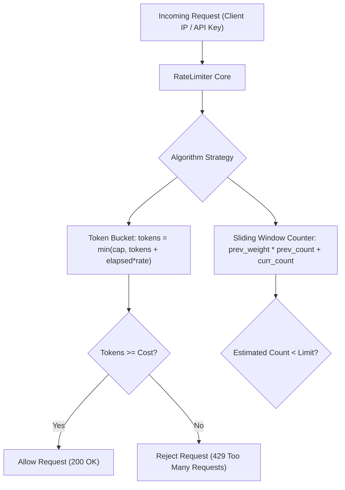

# Low-Level Design: High-Throughput Concurrent Rate Limiter

## 1. Problem Statement and Requirements

Design a production-grade, thread-safe Rate Limiter library to protect backend APIs and microservices from traffic surges, brute-force attacks, and noisy-neighbor resource starvation.

### 1.1 Functional Requirements
1. **Decision API**: `allow_request(client_id: str, cost: int = 1) -> bool` evaluated in sub-millisecond latency.
2. **Pluggable Algorithms**: Support Token Bucket, Leaky Bucket, and Sliding Window Counter.
3. **Multi-Tier Limits**: Support configurable thresholds per client tier (e.g., Free: 10 req/min, Premium: 1000 req/min).
4. **Header Telemetry**: Supply rate limit metadata headers (`X-RateLimit-Limit`, `X-RateLimit-Remaining`, `X-RateLimit-Reset`).

### 1.2 Non-Functional & Concurrency Requirements
1. **Low Memory Footprint**: Algorithms must store compact state per client ($O(1)$ memory).
2. **Thread Safety**: Concurrent requests from the same client must not exceed the configured threshold under race conditions.



---

## 2. Algorithmic Trade-offs and Comparison

| Algorithm | Mechanism | Time Complexity | Memory per Client | Burst Tolerance | Boundary Flaw |
| :--- | :--- | :--- | :--- | :--- | :--- |
| **Token Bucket** | Tokens refill at steady rate; request consumes tokens. | $O(1)$ | $O(1)$ (2 numbers: tokens, last_refill) | High; absorbs bursts up to capacity. | None. Standard industry default. |
| **Leaky Bucket** | FIFO queue processes requests at fixed drain rate. | $O(1)$ | $O(\text{Queue Size})$ | Low; smooths traffic into uniform stream. | Queue can drop requests on sudden bursts. |
| **Fixed Window** | Counter increments in fixed time intervals (e.g., 1 min). | $O(1)$ | $O(1)$ (1 counter, 1 timestamp) | Poor; allows $2\times$ burst at window boundaries. | Critical boundary surge vulnerability. |
| **Sliding Window Log** | Stores timestamp of every request in sorted set. | $O(\log N)$ | $O(N)$ (Grows with request volume) | High accuracy; strict rate enforcement. | High memory consumption under heavy traffic. |
| **Sliding Window Counter** | Interpolates count using weighted previous window overlap. | $O(1)$ | $O(1)$ (2 integer counters) | Moderate; balances memory and precision. | Slight approximation error ($< 0.05\%$). |

---

## 3. The Fixed Window Boundary Flaw vs Sliding Window Counter

In a Fixed Window counter allowing 100 requests per minute:
- A client sends 100 requests at 00:59.
- The window resets at 01:00.
- The client sends another 100 requests at 01:01.
The server receives 200 requests within a two-second window without violating the fixed-window rule, potentially crashing downstream databases.

The **Sliding Window Counter** eliminates this boundary surge using weighted interpolation:

$$\text{Current Estimate} = \text{Current Window Count} + \text{Previous Window Count} \times \left(1 - \frac{\text{Elapsed Time in Current Window}}{\text{Window Size}}\right)$$

If the estimate is below the limit, the request is permitted.

---

## 4. Complete Production-Grade Simulation in Python

The following script implements:
1. A **Thread-Safe Token Bucket Rate Limiter** with lazy token regeneration.
2. A **Sliding Window Counter Rate Limiter** with weighted sub-window interpolation.
3. Multi-threaded burst verification testing both algorithms under high concurrency.

```python
"""
Concurrent Rate Limiter Production Simulation.
Demonstrates:
1. Token Bucket Rate Limiter with lazy mathematical refill.
2. Sliding Window Counter Rate Limiter with weighted overlap interpolation.
3. High-concurrency race condition testing across worker threads.
"""

from abc import ABC, abstractmethod
import math
import threading
import time
from typing import Dict, Optional, Tuple


# =====================================================================
# 1. ABSTRACT RATE LIMITER STRATEGY
# =====================================================================

class RateLimiterStrategy(ABC):
    @abstractmethod
    def allow_request(self, client_id: str, cost: int = 1) -> Tuple[bool, Dict[str, str]]:
        """Returns (is_allowed, headers)."""
        pass


# =====================================================================
# 2. TOKEN BUCKET RATE LIMITER
# =====================================================================

class TokenBucketState:
    def __init__(self, capacity: float, refill_rate_per_sec: float):
        self.capacity = capacity
        self.refill_rate = refill_rate_per_sec
        self.tokens = capacity
        self.last_refill_time = time.time()
        self.lock = threading.Lock()

    def consume(self, cost: int) -> Tuple[bool, int, float]:
        with self.lock:
            now = time.time()
            elapsed = now - self.last_refill_time
            # Refill tokens lazily based on elapsed duration
            self.tokens = min(self.capacity, self.tokens + (elapsed * self.refill_rate))
            self.last_refill_time = now

            if self.tokens >= cost:
                self.tokens -= cost
                remaining = int(self.tokens)
                reset_sec = (self.capacity - self.tokens) / self.refill_rate if self.refill_rate > 0 else 0
                return True, remaining, reset_sec
            else:
                remaining = int(self.tokens)
                wait_needed = (cost - self.tokens) / self.refill_rate if self.refill_rate > 0 else 1.0
                return False, remaining, wait_needed


class TokenBucketRateLimiter(RateLimiterStrategy):
    """Token Bucket algorithm: allows traffic bursts up to capacity."""
    def __init__(self, capacity: int, refill_rate_per_sec: float):
        self.capacity = capacity
        self.refill_rate = refill_rate_per_sec
        self._clients: Dict[str, TokenBucketState] = {}
        self._lock = threading.Lock()

    def _get_client_state(self, client_id: str) -> TokenBucketState:
        with self._lock:
            if client_id not in self._clients:
                self._clients[client_id] = TokenBucketState(self.capacity, self.refill_rate)
            return self._clients[client_id]

    def allow_request(self, client_id: str, cost: int = 1) -> Tuple[bool, Dict[str, str]]:
        state = self._get_client_state(client_id)
        allowed, remaining, reset_time = state.consume(cost)

        headers = {
            "X-RateLimit-Limit": str(self.capacity),
            "X-RateLimit-Remaining": str(remaining),
            "X-RateLimit-Reset": f"{reset_time:.2f}"
        }
        return allowed, headers


# =====================================================================
# 3. SLIDING WINDOW COUNTER RATE LIMITER
# =====================================================================

class SlidingWindowCounterState:
    def __init__(self, window_size_sec: float):
        self.window_size_sec = window_size_sec
        self.current_window_start = time.time()
        self.prev_window_count = 0
        self.curr_window_count = 0
        self.lock = threading.Lock()

    def increment(self, limit: int, cost: int) -> Tuple[bool, int]:
        with self.lock:
            now = time.time()
            # Check if window has rolled over
            elapsed_since_start = now - self.current_window_start

            if elapsed_since_start >= self.window_size_sec * 2:
                # Two or more windows passed: reset both
                self.prev_window_count = 0
                self.curr_window_count = 0
                self.current_window_start = now
                elapsed_since_start = 0
            elif elapsed_since_start >= self.window_size_sec:
                # Exactly one window passed: shift current to previous
                self.prev_window_count = self.curr_window_count
                self.curr_window_count = 0
                self.current_window_start += self.window_size_sec
                elapsed_since_start = now - self.current_window_start

            # Calculate weighted estimate
            weight = 1.0 - (elapsed_since_start / self.window_size_sec)
            estimated_count = (self.prev_window_count * weight) + self.curr_window_count

            if estimated_count + cost <= limit:
                self.curr_window_count += cost
                remaining = max(0, int(limit - (estimated_count + cost)))
                return True, remaining
            else:
                remaining = max(0, int(limit - estimated_count))
                return False, remaining


class SlidingWindowRateLimiter(RateLimiterStrategy):
    """Sliding Window Counter: Memory-efficient interpolated rate limiter."""
    def __init__(self, limit: int, window_size_sec: float):
        self.limit = limit
        self.window_size_sec = window_size_sec
        self._clients: Dict[str, SlidingWindowCounterState] = {}
        self._lock = threading.Lock()

    def _get_client_state(self, client_id: str) -> SlidingWindowCounterState:
        with self._lock:
            if client_id not in self._clients:
                self._clients[client_id] = SlidingWindowCounterState(self.window_size_sec)
            return self._clients[client_id]

    def allow_request(self, client_id: str, cost: int = 1) -> Tuple[bool, Dict[str, str]]:
        state = self._get_client_state(client_id)
        allowed, remaining = state.increment(self.limit, cost)

        headers = {
            "X-RateLimit-Limit": str(self.limit),
            "X-RateLimit-Remaining": str(remaining)
        }
        return allowed, headers


# =====================================================================
# VERIFICATION SUITE
# =====================================================================

def main():
    print("Executing Concurrent Rate Limiter Verification Suite...")

    # 1. Token Bucket Burst and Refill Verification
    tb = TokenBucketRateLimiter(capacity=5, refill_rate_per_sec=10.0)

    # Consume all 5 tokens immediately (Burst)
    for _ in range(5):
        allowed, _ = tb.allow_request("client_alpha")
        assert allowed is True

    # 6th request rejected immediately
    rejected, headers = tb.allow_request("client_alpha")
    assert rejected is False
    assert headers["X-RateLimit-Remaining"] == "0"
    print("Token Bucket Capacity Burst Guard: Passed.")

    # Sleep 0.2s -> should refill 2 tokens (10 tokens/sec * 0.2s)
    time.sleep(0.22)
    allowed_again, _ = tb.allow_request("client_alpha")
    assert allowed_again is True
    print("Token Bucket Lazy Refill Verification: Passed.")

    # 2. Sliding Window Counter Verification
    sw = SlidingWindowRateLimiter(limit=4, window_size_sec=0.5)
    for _ in range(4):
        ok, _ = sw.allow_request("client_beta")
        assert ok is True

    over_limit, _ = sw.allow_request("client_beta")
    assert over_limit is False
    print("Sliding Window Boundary Enforcement: Passed.")

    # 3. High-Concurrency Multithreaded Test
    concurrent_limiter = TokenBucketRateLimiter(capacity=100, refill_rate_per_sec=0)
    allowed_count = 0
    denied_count = 0
    stats_lock = threading.Lock()

    def flood_worker():
        nonlocal allowed_count, denied_count
        for _ in range(25):
            res, _ = concurrent_limiter.allow_request("shared_target")
            with stats_lock:
                if res:
                    allowed_count += 1
                else:
                    denied_count += 1

    # Spawn 8 threads sending 25 requests each (Total = 200 requests for capacity 100)
    threads = [threading.Thread(target=flood_worker) for _ in range(8)]
    for t in threads:
        t.start()
    for t in threads:
        t.join()

    assert allowed_count == 100
    assert denied_count == 100
    print(f"Concurrent Race Condition Safety: Passed (Allowed={allowed_count}, Denied={denied_count}).")

    print("All Rate Limiter validations completed successfully.")


if __name__ == "__main__":
    main()
```

---

## 5. Active Recall Interview Questions

<details>
<summary>1. What is the boundary burst vulnerability in the Fixed Window Counter algorithm?</summary>
In a Fixed Window counter, requests are grouped into static discrete time intervals.
A client can send their full quota at the very end of window $T$ (e.g., 00:59) and send another full quota at the start of window $T+1$ (e.g., 01:00).
This allows twice the configured rate of traffic to hit the backend within a tiny window (e.g., 200 requests in 2 seconds for a 100 req/min limit).
</details>

<details>
<summary>2. How does the Sliding Window Counter algorithm eliminate the boundary surge while using O(1) memory?</summary>
Instead of logging timestamps for every individual request ($O(N)$ memory), it maintains only two integer counts: previous window count and current window count.
It approximates the rate using a linear weight:
$\text{Count} = \text{Current Count} + \text{Previous Count} \times (1 - \text{elapsed} / \text{window})$.
This yields $O(1)$ memory with an error rate under $0.05\%$.
</details>

<details>
<summary>3. What is the fundamental behavioral difference between the Token Bucket and Leaky Bucket algorithms?</summary>
Token Bucket permits bursts of traffic up to its bucket capacity, making it ideal for standard web APIs where bursty user behavior is normal.
Leaky Bucket processes or outputs requests at a strictly constant, uniform drain rate, smoothing out traffic spikes at the expense of queuing latency or dropped bursts.
</details>

<details>
<summary>4. Why is lazy token refill preferred over a background timer thread in the Token Bucket algorithm?</summary>
Running a background timer thread to increment tokens for millions of client keys creates severe CPU scheduling overhead and lock contention.
Lazy refill computes tokens dynamically on each incoming request based on elapsed time:
$\text{tokens} = \min(\text{capacity}, \text{tokens} + \text{elapsed} \times \text{rate})$,
costing only one timestamp subtraction and multiplication with zero background CPU overhead.
</details>

<details>
<summary>5. How is a distributed Rate Limiter implemented across a cluster of API Gateway nodes using Redis?</summary>
By executing atomic Redis Lua scripts.
Because Redis executes Lua scripts as a single atomic transaction on its single-threaded event loop, all operations (calculating elapsed time, refilling tokens, checking balance, and decrementing) run atomically without distributed lock contention.
</details>

<details>
<summary>6. What are the three standard HTTP headers returned by a production Rate Limiter?</summary>
1. `X-RateLimit-Limit`: The maximum number of allowed requests in the current period.
2. `X-RateLimit-Remaining`: The remaining number of permitted requests in the current period.
3. `X-RateLimit-Reset`: The number of seconds (or Unix epoch) until the limit resets.
When rejecting, it returns HTTP 429 Too Many Requests with a `Retry-After` header.
</details>

<details>
<summary>7. What is multi-tiered rate limiting, and why is it essential for SaaS platforms?</summary>
Multi-tiered rate limiting applies multiple simultaneous constraints across different dimensions and client identities:
For example: a client IP limit (protecting against DDoS), an API Key limit (tier-based billing: Free vs Enterprise), and a global endpoint limit (protecting expensive database search endpoints).
</details>

<details>
<summary>8. In high-concurrency C++ or Java rate limiters, how can atomic CAS operations eliminate mutex locks?</summary>
By packing both the current token count and the last refill timestamp into a single 64-bit integer or atomic struct.
Threads read the atomic value, compute the updated state locally, and commit using `compare_exchange_weak` (CAS).
If another thread updates first, the loop retries, achieving lock-free thread safety.
</details>

<details>
<summary>9. What is the 'noisy neighbor' problem, and how does Rate Limiting solve it?</summary>
In a multi-tenant shared infrastructure, one tenant generating an abnormally large volume of traffic consumes all worker threads or database connections, degrading performance for all other tenants.
Rate limiting enforces per-tenant quotas, isolating tenant traffic and ensuring fair resource allocation.
</details>

<details>
<summary>10. Under what condition would you choose Sliding Window Log despite its high memory usage?</summary>
When absolute, zero-tolerance precision is mandatory (such as financial transaction limits or credit card fraud attempt detection), where even a minor $0.05\%$ approximation error from a Sliding Window Counter could permit an illegal transaction.
</details>
