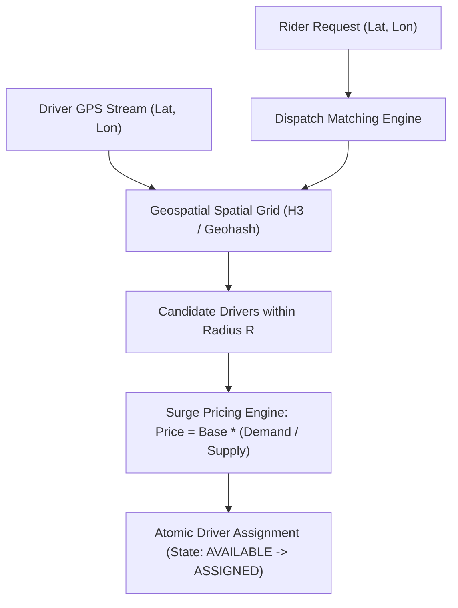
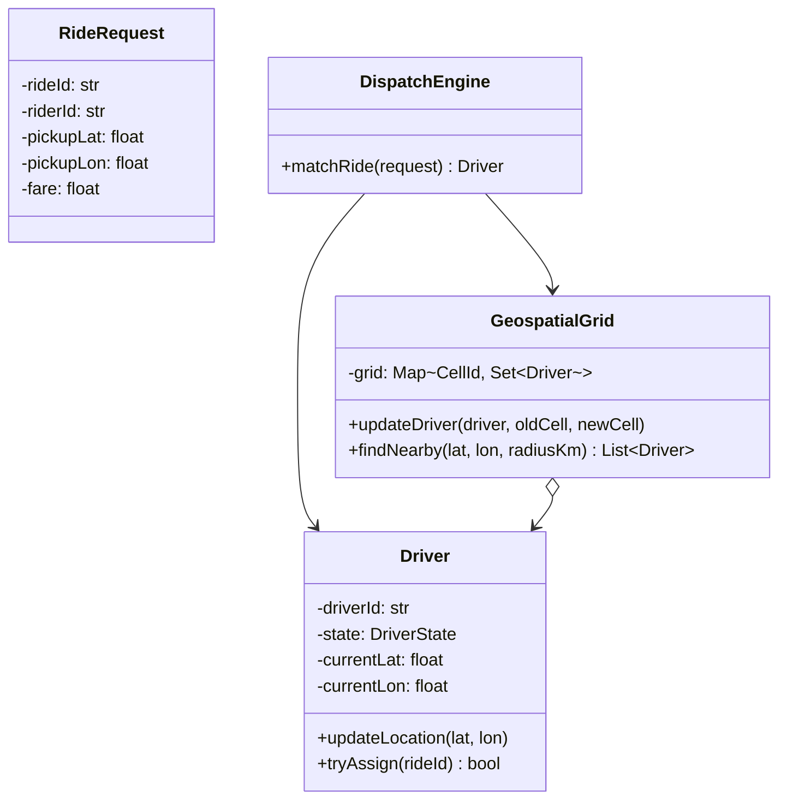

# Low-Level Design: Ride-Sharing Matching and Dispatch Engine

## 1. Problem Statement and Requirements

Design the core low-level matching and dispatch engine for a ride-sharing platform (such as Uber or Lyft) that efficiently indexes mobile driver locations, calculates dynamic surge pricing, and matches ride requests with optimal nearby drivers.

### 1.1 Functional Requirements
1. **Driver Location Tracking**: Drivers stream GPS coordinates every 4 seconds. The system updates their in-memory geospatial index in $O(1)$ amortized time.
2. **Nearby Driver Lookup**: Efficiently query all `AVAILABLE` drivers within a radius of $R$ kilometers around a rider's pickup location.
3. **Pluggable Dispatch Matching**:
   - Greedy Proximity Matching: Assigns the nearest single driver immediately.
   - Batch Matching (Supply-Demand Optimization): Collects ride requests in 3-second windows and computes optimal bipartite matching to minimize global wait times.
4. **Dynamic Surge Pricing**: Calculates fare multipliers based on the supply-demand ratio within local geospatial cells.
5. **Driver State Lifecycle**: `OFFLINE`, `AVAILABLE`, `ASSIGNED`, `IN_TRIP`.

### 1.2 Non-Functional & Concurrency Requirements
1. **Low Dispatch Latency**: Geospatial spatial lookups must execute in sub-10 milliseconds.
2. **Race-Condition-Free Assignment**: If two riders request rides in the same street simultaneously, the same driver cannot be double-assigned.



---

## 2. In-Memory Geospatial Indexing: Grid Buckets and Geohashes

Relational database spatial queries (`ST_DWithin`) are too slow for hundreds of thousands of updates per second.
Staff engineers implement in-memory geospatial indexes:
1. **Geohash**: Hierarchical string hashes dividing the world into bounding boxes. Nearby locations share common string prefixes.
2. **Uber H3 (Hexagonal Hierarchical Spatial Index)**: Decomposes the globe into regular hexagonal cells. Hexagons have the property that all 6 adjacent neighbors are equidistant, eliminating edge-distortion artifacts common in rectangular grids.



---

## 3. Complete Production-Grade Simulation in Python

The following script implements:
1. A **Spatial Grid Geospatial Index** mapping coordinates to localized grid cells.
2. A **Driver State Machine** guaranteeing atomic assignment without race conditions.
3. A **Dynamic Surge Pricing and Dispatch Matching Engine**.

```python
"""
Ride-Sharing Matching and Dispatch Engine Production Simulation.
Demonstrates:
1. In-memory spatial grid indexing for sub-millisecond driver lookup.
2. Driver state machine with atomic concurrency transitions.
3. Supply-demand surge pricing strategy.
4. Multi-rider dispatch race condition safety.
"""

from enum import Enum, auto
import math
import threading
from typing import Dict, List, Optional, Set, Tuple


class DriverState(Enum):
    OFFLINE = auto()
    AVAILABLE = auto()
    ASSIGNED = auto()
    IN_TRIP = auto()


class Driver:
    """Thread-safe driver domain entity."""
    def __init__(self, driver_id: str, lat: float, lon: float):
        self.driver_id = driver_id
        self.lat = lat
        self.lon = lon
        self.state = DriverState.AVAILABLE
        self.assigned_ride_id: Optional[str] = None
        self.lock = threading.Lock()

    def update_location(self, lat: float, lon: float) -> None:
        with self.lock:
            self.lat = lat
            self.lon = lon

    def try_assign(self, ride_id: str) -> bool:
        """Atomically locks and assigns driver if currently AVAILABLE."""
        with self.lock:
            if self.state == DriverState.AVAILABLE:
                self.state = DriverState.ASSIGNED
                self.assigned_ride_id = ride_id
                return True
            return False

    def complete_trip(self) -> None:
        with self.lock:
            self.state = DriverState.AVAILABLE
            self.assigned_ride_id = None


class SpatialGridIndex:
    """
    In-memory 2D grid index.
    Approximates 1 km cells (~0.01 degrees lat/lon).
    """
    def __init__(self, cell_size_degrees: float = 0.01):
        self.cell_size = cell_size_degrees
        self._grid: Dict[Tuple[int, int], Set[Driver]] = {}
        self.lock = threading.Lock()

    def _get_cell_coord(self, lat: float, lon: float) -> Tuple[int, int]:
        return int(lat / self.cell_size), int(lon / self.cell_size)

    def update_driver_cell(self, driver: Driver, old_lat: Optional[float], old_lon: Optional[float]) -> None:
        new_cell = self._get_cell_coord(driver.lat, driver.lon)
        with self.lock:
            if old_lat is not None and old_lon is not None:
                old_cell = self._get_cell_coord(old_lat, old_lon)
                if old_cell in self._grid and driver in self._grid[old_cell]:
                    self._grid[old_cell].remove(driver)

            if new_cell not in self._grid:
                self._grid[new_cell] = set()
            self._grid[new_cell].add(driver)

    def find_nearby_drivers(self, lat: float, lon: float, radius_cells: int = 1) -> List[Driver]:
        """Scans center cell and surrounding neighbor cells."""
        center_x, center_y = self._get_cell_coord(lat, lon)
        results: List[Driver] = []

        with self.lock:
            for dx in range(-radius_cells, radius_cells + 1):
                for dy in range(-radius_cells, radius_cells + 1):
                    cell = (center_x + dx, center_y + dy)
                    if cell in self._grid:
                        results.extend(self._grid[cell])

        return results


class DispatchEngine:
    """Coordinates pricing, lookup, and atomic driver assignment."""
    def __init__(self, spatial_index: SpatialGridIndex):
        self.spatial_index = spatial_index
        self.base_fare = 5.00

    def calculate_surge_multiplier(self, available_drivers: int, active_requests: int) -> float:
        """Dynamic pricing based on local supply and demand."""
        if available_drivers == 0:
            return 3.0  # Max surge cap
        ratio = active_requests / max(1, available_drivers)
        if ratio > 1.5:
            return round(min(3.0, 1.0 + (ratio - 1.0) * 0.5), 2)
        return 1.0

    def match_nearest_driver(self, ride_id: str, pickup_lat: float, pickup_lon: float) -> Optional[Tuple[Driver, float]]:
        """Finds nearest AVAILABLE driver and atomically claims them."""
        candidate_drivers = self.spatial_index.find_nearby_drivers(pickup_lat, pickup_lon, radius_cells=2)

        # Filter strictly available drivers
        available = [d for d in candidate_drivers if d.state == DriverState.AVAILABLE]
        if not available:
            return None

        # Sort by Euclidean distance
        def distance_sq(d: Driver) -> float:
            return (d.lat - pickup_lat) ** 2 + (d.lon - pickup_lon) ** 2

        available.sort(key=distance_sq)

        surge = self.calculate_surge_multiplier(len(available), active_requests=5)
        fare = round(self.base_fare * surge, 2)

        # Attempt atomic assignment in order of proximity
        for driver in available:
            if driver.try_assign(ride_id):
                return driver, fare

        return None


# =====================================================================
# VERIFICATION SUITE
# =====================================================================

def main():
    print("Executing Ride-Sharing Matching Engine Verification Suite...")

    spatial_index = SpatialGridIndex(cell_size_degrees=0.01)
    engine = DispatchEngine(spatial_index)

    # 1. Register Drivers across downtown coordinates
    driver_near = Driver("DRV_NEAR", lat=37.7749, lon=-122.4194)  # Exact downtown
    driver_mid = Driver("DRV_MID", lat=37.7780, lon=-122.4190)   # 300m away
    driver_far = Driver("DRV_FAR", lat=37.8500, lon=-122.3000)   # Oakland (~10km)

    spatial_index.update_driver_cell(driver_near, None, None)
    spatial_index.update_driver_cell(driver_mid, None, None)
    spatial_index.update_driver_cell(driver_far, None, None)

    # 2. Match Rider at (37.7750, -122.4195)
    match_result = engine.match_nearest_driver("RIDE-01", pickup_lat=37.7750, pickup_lon=-122.4195)
    assert match_result is not None
    matched_driver, fare = match_result
    assert matched_driver.driver_id == "DRV_NEAR"
    assert matched_driver.state == DriverState.ASSIGNED
    assert matched_driver.assigned_ride_id == "RIDE-01"
    print(f"Proximity Match Verification: Assigned {matched_driver.driver_id} at fare ${fare:.2f}.")

    # 3. Subsequent Request: DRV_NEAR is busy, must assign DRV_MID
    second_match = engine.match_nearest_driver("RIDE-02", pickup_lat=37.7750, pickup_lon=-122.4195)
    assert second_match is not None
    driver_2, _ = second_match
    assert driver_2.driver_id == "DRV_MID"
    assert driver_2.state == DriverState.ASSIGNED
    print("Sequential Assignment Verification: Passed.")

    # 4. Third Request: No nearby available drivers left in radius
    third_match = engine.match_nearest_driver("RIDE-03", pickup_lat=37.7750, pickup_lon=-122.4195)
    assert third_match is None
    print("Empty Supply Fallback Verification: Passed.")

    # Complete trip on DRV_NEAR and verify re-availability
    driver_near.complete_trip()
    assert driver_near.state == DriverState.AVAILABLE

    fourth_match = engine.match_nearest_driver("RIDE-04", pickup_lat=37.7750, pickup_lon=-122.4195)
    assert fourth_match is not None
    assert fourth_match[0].driver_id == "DRV_NEAR"
    print("Trip Completion and Re-availability: Passed.")

    print("All Ride-Sharing Dispatch validations completed successfully.")


if __name__ == "__main__":
    main()
```

---

## 4. Active Recall Interview Questions

<details>
<summary>1. Why are standard relational spatial queries (like PostGIS `ST_DWithin`) inadequate for high-scale ride matching?</summary>
In cities like New York or London, hundreds of thousands of drivers stream GPS pings every 4 seconds.
Executing indexed disk-backed database writes and spatial bounding-box scans at that frequency saturates database write I/O and locks.
In-memory spatial grids (e.g., H3, S2, Redis Geohash) store driver positions in RAM, updating cells and querying nearest neighbors in microsecond latencies.
</details>

<details>
<summary>2. Why does Uber use Hexagonal Hierarchical Spatial Indexing (H3) instead of square Geohash grids?</summary>
In a square grid, a cell has two different types of neighbors: 4 orthogonal neighbors (distance $D$) and 4 diagonal neighbors (distance $\sqrt{2}D$).
This introduces directional distortion into radius searches.
In a hexagonal grid, all 6 neighbors share identical distances to the center, simplifying radial distance expansion and trajectory modeling.
</details>

<details>
<summary>3. What is Batch Matching versus Greedy Proximity Matching in ride-sharing dispatch?</summary>
- **Greedy Proximity Matching**: Immediately assigns the single closest driver to an incoming ride request. Fast, but can lead to globally suboptimal matches (e.g., Driver A is assigned to Rider 1, leaving Rider 2 stranded with a 20-minute ETA).
- **Batch Matching**: Accumulates requests over a 3 to 5 second window and solves a global Maximum Weight Bipartite Matching problem (Hungarian algorithm), minimizing cumulative wait time across all riders.
</details>

<details>
<summary>4. How does the Dispatch Engine prevent race conditions when two riders in the same street request a ride simultaneously?</summary>
By executing an atomic Compare-And-Swap (CAS) or synchronized mutex check on the driver entity (`driver.try_assign(ride_id)`).
If both rider threads attempt to claim the same nearest driver, exactly one thread transitions the driver from `AVAILABLE` to `ASSIGNED`; the losing thread catches the failure and immediately advances to the second-nearest driver.
</details>

<details>
<summary>5. How is dynamic Surge Pricing calculated, and what prevents wild price oscillations?</summary>
Surge multiplier is computed as a function of local supply (available drivers in the H3 cell) versus demand (active ride requests or search volume).
To prevent wild oscillations, the system applies rolling moving averages and spatial smoothing across adjacent hexagonal cells so drivers cannot game the system by straddling boundary borders.
</details>

<details>
<summary>6. What happens if an assigned driver rejects the ride offer or their 15-second response timer expires?</summary>
The dispatcher receives a rejection/timeout event, releases the driver back to `AVAILABLE` (with an acceptance rate penalty), and re-enters the matching loop, dispatching the ride to the next-closest candidate driver without requiring the rider to re-request.
</details>

<details>
<summary>7. How does location tracking handle driver GPS drift and 'map matching'?</summary>
Raw mobile GPS pings contain jitter and inaccuracy ($\pm 10$ meters).
Map-matching algorithms use Hidden Markov Models (HMM) to snap raw GPS coordinates to underlying street road network graph vectors, ensuring ETA calculations are based on valid driving routes rather than straight-line distance.
</details>

<details>
<summary>8. How do ride-pooling services (like UberPool) extend the basic dispatch engine?</summary>
Ride pooling converts point-to-point dispatch into a dynamic Vehicle Routing Problem (VRP) with time windows.
The engine must check whether adding a second rider's pickup and dropoff introduces acceptable detours for the first rider while keeping total travel duration within promised SLA constraints.
</details>

<details>
<summary>9. What data structures in Redis are commonly used for in-memory geospatial lookups?</summary>
Redis Sorted Sets (`ZSET`) using the `GEOADD`, `GEORADIUS`, and `GEOSEARCH` commands.
Redis encodes (latitude, longitude) into a 52-bit Geohash integer stored as a ZSet score, allowing $O(\log N + M)$ range queries along spatial boundaries.
</details>

<details>
<summary>10. Under what condition should a driver be excluded from dispatch candidate pools despite being geographically close?</summary>
When the driver's vehicle class is incompatible (e.g., rider requested UberXL but driver has a sedan), when the driver is finishing an existing trip in the opposite direction, or when the driver has low fuel/battery or is near their shift hour limit.
</details>
