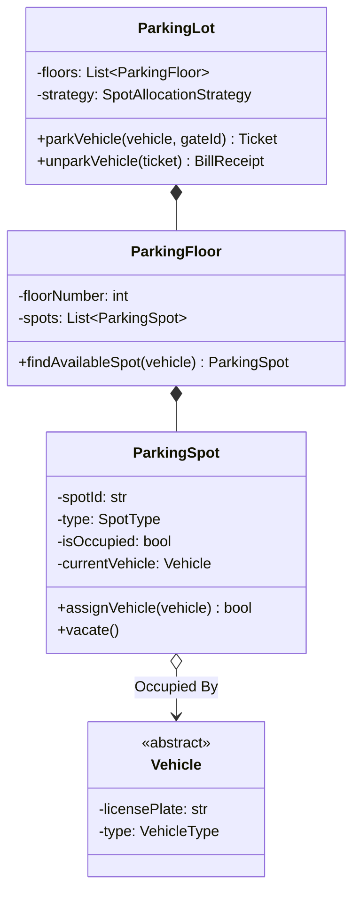
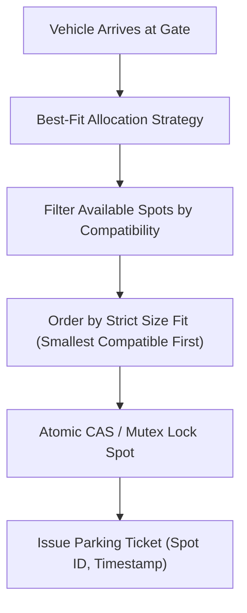

# Low-Level Design: Smart Multi-Floor Parking Lot System

## 1. Problem Statement and Requirements

Design a low-level object-oriented system for a modern multi-floor, multi-gate **Smart Parking Lot** facility capable of managing polymorphic vehicles, automated spot allocation, dynamic fee calculation, and concurrent gate entry.

### 1.1 Functional Requirements
1. **Vehicle Polymorphism & Spot Fitting**:
   - Vehicles: `Motorcycle`, `Car`, `Van`, `ElectricVehicle`.
   - Spots: `MotorcycleSpot`, `CompactSpot`, `LargeSpot`, `ElectricSpot`.
   - Compatibility: A motorcycle fits in any spot; a compact car fits in compact or large spots; an electric vehicle prefers electric charging spots.
2. **Automated Spot Allocation**: Support pluggable spot assignment strategies:
   - Nearest to entrance gate.
   - Best-Fit (allocates the smallest compatible spot to preserve larger spots).
3. **Ticket Issuance and Payment**: Entry terminal issues a timestamped ticket; exit terminal computes fees based on duration and vehicle type.
4. **Real-Time Display Boards**: Display available spot counts per floor and vehicle type.

### 1.2 Non-Functional & Concurrency Requirements
1. **Double-Booking Prevention**: When multiple vehicles enter concurrent gates simultaneously, the system must atomically reserve spots without race conditions.
2. **High Availability**: Gate terminals must process entry decisions in sub-10ms latency.



---

## 2. Spot Compatibility and Allocation Mechanics

### 2.1 The Best-Fit Allocation Rule
If a Motorcycle takes a LargeSpot while MotorcycleSpots are available, an incoming Truck is rejected because the large spot was squandered.
The **Best-Fit Strategy** enforces a strict spot priority order per vehicle type:
- **Motorcycle**: MotorcycleSpot $\rightarrow$ CompactSpot $\rightarrow$ LargeSpot.
- **Car**: CompactSpot $\rightarrow$ LargeSpot.
- **ElectricVehicle**: ElectricSpot $\rightarrow$ CompactSpot $\rightarrow$ LargeSpot.
- **Van / Truck**: LargeSpot only.



---

## 3. Complete Production-Grade Simulation in Python

The following script implements:
1. Polymorphic **Vehicles** and typed **ParkingSpots**.
2. A **Best-Fit Spot Allocation Engine** across multi-floor inventory.
3. Thread-safe entry gates preventing double-booking during concurrent ingress.

```python
"""
Smart Multi-Floor Parking Lot System Production Simulation.
Demonstrates:
1. Polymorphic vehicle and parking spot compatibility matrix.
2. Best-Fit allocation strategy preserving large capacity spots.
3. Thread-safe atomic spot reservation under concurrent gate traffic.
4. Dynamic duration-based rate card billing.
"""

from abc import ABC, abstractmethod
from enum import Enum, auto
import threading
import time
from typing import Dict, List, Optional
import uuid


# =====================================================================
# 1. ENUMS AND VEHICLE HIERARCHY
# =====================================================================

class VehicleType(Enum):
    MOTORCYCLE = auto()
    CAR = auto()
    ELECTRIC = auto()
    VAN = auto()


class SpotType(Enum):
    MOTORCYCLE = 1
    COMPACT = 2
    ELECTRIC = 3
    LARGE = 4


class Vehicle(ABC):
    def __init__(self, license_plate: str, vehicle_type: VehicleType):
        self.license_plate = license_plate
        self.vehicle_type = vehicle_type


class Motorcycle(Vehicle):
    def __init__(self, license_plate: str):
        super().__init__(license_plate, VehicleType.MOTORCYCLE)


class Car(Vehicle):
    def __init__(self, license_plate: str):
        super().__init__(license_plate, VehicleType.CAR)


class ElectricCar(Vehicle):
    def __init__(self, license_plate: str):
        super().__init__(license_plate, VehicleType.ELECTRIC)


class Van(Vehicle):
    def __init__(self, license_plate: str):
        super().__init__(license_plate, VehicleType.VAN)


# =====================================================================
# 2. PARKING SPOT AND FLOOR
# =====================================================================

class ParkingSpot:
    """Thread-safe individual parking spot."""
    def __init__(self, spot_id: str, floor_num: int, spot_type: SpotType):
        self.spot_id = spot_id
        self.floor_num = floor_num
        self.spot_type = spot_type
        self.is_occupied = False
        self.occupied_vehicle: Optional[Vehicle] = None
        self.lock = threading.Lock()

    def can_fit_vehicle(self, vehicle: Vehicle) -> bool:
        v_type = vehicle.vehicle_type
        if v_type == VehicleType.MOTORCYCLE:
            return True  # Fits anywhere
        elif v_type == VehicleType.CAR:
            return self.spot_type in {SpotType.COMPACT, SpotType.LARGE}
        elif v_type == VehicleType.ELECTRIC:
            return self.spot_type in {SpotType.ELECTRIC, SpotType.COMPACT, SpotType.LARGE}
        elif v_type == VehicleType.VAN:
            return self.spot_type == SpotType.LARGE
        return False

    def try_occupy(self, vehicle: Vehicle) -> bool:
        """Atomically occupies spot if vacant and compatible."""
        with self.lock:
            if not self.is_occupied and self.can_fit_vehicle(vehicle):
                self.is_occupied = True
                self.occupied_vehicle = vehicle
                return True
            return False

    def vacate(self) -> Optional[Vehicle]:
        with self.lock:
            if not self.is_occupied:
                return None
            veh = self.occupied_vehicle
            self.is_occupied = False
            self.occupied_vehicle = None
            return veh


# =====================================================================
# 3. TICKET AND BILLING ENGINE
# =====================================================================

class ParkingTicket:
    def __init__(self, ticket_id: str, vehicle: Vehicle, spot: ParkingSpot):
        self.ticket_id = ticket_id
        self.vehicle = vehicle
        self.spot = spot
        self.entry_time = time.time()
        self.exit_time: Optional[float] = None
        self.amount_paid = 0.0


class RateCard:
    """Calculates fee based on duration and vehicle type."""
    HOURLY_RATES = {
        VehicleType.MOTORCYCLE: 2.00,
        VehicleType.CAR: 5.00,
        VehicleType.ELECTRIC: 7.50,  # Includes EV charging fee
        VehicleType.VAN: 10.00
    }

    @classmethod
    def calculate_fee(cls, ticket: ParkingTicket) -> float:
        duration_hours = max(1.0, (ticket.exit_time - ticket.entry_time) / 3600.0)  # type: ignore
        hourly = cls.HOURLY_RATES.get(ticket.vehicle.vehicle_type, 5.00)
        return round(hourly * duration_hours, 2)


# =====================================================================
# 4. PARKING LOT SYSTEM
# =====================================================================

class ParkingLot:
    """Coordinates multi-floor inventory and concurrent gate access."""
    def __init__(self, name: str):
        self.name = name
        self.floors: Dict[int, List[ParkingSpot]] = {}
        self.active_tickets: Dict[str, ParkingTicket] = {}
        self.lock = threading.Lock()

    def add_floor(self, floor_num: int, spots: List[ParkingSpot]) -> None:
        self.floors[floor_num] = spots

    def park_vehicle(self, vehicle: Vehicle) -> ParkingTicket:
        """Finds Best-Fit spot and issues ticket atomically."""
        # Preference order: lowest spot type weight compatible with vehicle
        for floor_num in sorted(self.floors.keys()):
            # Sort available spots by smallest compatible type (Best-Fit)
            available_spots = [
                s for s in self.floors[floor_num]
                if not s.is_occupied and s.can_fit_vehicle(vehicle)
            ]
            available_spots.sort(key=lambda s: s.spot_type.value)

            for spot in available_spots:
                if spot.try_occupy(vehicle):
                    ticket_id = f"TICK-{uuid.uuid4().hex[:8]}"
                    ticket = ParkingTicket(ticket_id, vehicle, spot)
                    with self.lock:
                        self.active_tickets[ticket_id] = ticket
                    return ticket

        raise RuntimeError(f"No available compatible spot for {vehicle.vehicle_type.name} [{vehicle.license_plate}]")

    def unpark_vehicle(self, ticket_id: str) -> float:
        """Processes ticket exit, vacates spot, and returns charged fee."""
        with self.lock:
            ticket = self.active_tickets.get(ticket_id)
            if not ticket:
                raise KeyError(f"Ticket {ticket_id} is invalid or expired.")
            del self.active_tickets[ticket_id]

        ticket.exit_time = time.time()
        ticket.spot.vacate()
        fee = RateCard.calculate_fee(ticket)
        ticket.amount_paid = fee
        return fee


# =====================================================================
# VERIFICATION SUITE
# =====================================================================

def main():
    print("Executing Smart Parking Lot Verification Suite...")

    lot = ParkingLot("Downtown Smart Garage")

    # Floor 1 spots: 1 Motorcycle, 1 Compact, 1 Large
    f1_spots = [
        ParkingSpot("F1-M1", floor_num=1, spot_type=SpotType.MOTORCYCLE),
        ParkingSpot("F1-C1", floor_num=1, spot_type=SpotType.COMPACT),
        ParkingSpot("F1-L1", floor_num=1, spot_type=SpotType.LARGE),
    ]
    lot.add_floor(1, f1_spots)

    # 1. Best-Fit Allocation Check
    moto = Motorcycle("MOTO-101")
    car = Car("CAR-202")
    van = Van("VAN-303")

    # Motorcycle must pick MotorcycleSpot (F1-M1), saving Compact and Large
    t_moto = lot.park_vehicle(moto)
    assert t_moto.spot.spot_id == "F1-M1"

    # Car must pick CompactSpot (F1-C1), saving Large for Van
    t_car = lot.park_vehicle(car)
    assert t_car.spot.spot_id == "F1-C1"

    # Van must pick LargeSpot (F1-L1)
    t_van = lot.park_vehicle(van)
    assert t_van.spot.spot_id == "F1-L1"
    print("Best-Fit Spot Allocation Priority: Passed.")

    # 2. Lot Full Rejection
    overflow_car = Car("CAR-999")
    try:
        lot.park_vehicle(overflow_car)
        assert False, "Should have thrown RuntimeError for full lot"
    except RuntimeError:
        print("Lot Capacity Guard: Passed.")

    # 3. Unpark and Billing Verification
    fee = lot.unpark_vehicle(t_car.ticket_id)
    assert fee == 5.00  # 1 hour minimum for Car
    assert not f1_spots[1].is_occupied  # Compact spot vacated
    print(f"Vehicle Unpark & Fee Calculation: Passed (Charged ${fee:.2f}).")

    # 4. Re-parking in vacated spot
    t_new_car = lot.park_vehicle(overflow_car)
    assert t_new_car.spot.spot_id == "F1-C1"
    print("Vacated Spot Reassignment: Passed.")

    print("All Smart Parking Lot validations completed successfully.")


if __name__ == "__main__":
    main()
```

---

## 4. Active Recall Interview Questions

<details>
<summary>1. Why is the 'Best-Fit' spot allocation strategy superior to First-Available in a parking lot?</summary>
First-Available might assign a Large spot to a small Motorcycle simply because the Large spot appeared first in the array.
If a Van or Bus arrives later, it must be rejected because no large spots remain.
Best-Fit matches vehicles to the smallest compatible spot size (Motorcycle to MotorcycleSpot, Compact to CompactSpot), preserving large and specialized spots for vehicles that strictly require them.
</details>

<details>
<summary>2. How do you prevent double-booking race conditions when vehicles enter through concurrent entrance gates?</summary>
By synchronizing spot acquisition atomically.
Each `ParkingSpot` holds a fine-grained mutex lock (or atomic boolean flag).
When an entrance gate identifies a candidate spot, it attempts `spot.try_occupy(vehicle)`.
If two gates select the same spot simultaneously, one gate's lock/CAS succeeds and the other immediately fails and advances to the next candidate spot.
</details>

<details>
<summary>3. In an object-oriented model, should a ParkingSpot hold a reference to a Vehicle, or should a Vehicle hold a reference to a ParkingSpot?</summary>
`ParkingSpot` should hold a reference to the `Vehicle` occupying it (aggregation/association).
A Vehicle can exist independently outside the parking lot (in transit, at home), whereas a ParkingSpot's occupancy state is intrinsically defined by whether a vehicle is currently assigned to it.
</details>

<details>
<summary>4. How does the Strategy pattern decouple spot allocation algorithms in a Parking Lot?</summary>
By defining an interface `SpotAllocationStrategy` with method `find_spot(vehicle, floors)`.
Concrete implementations (`NearestToEntranceStrategy`, `BestFitStrategy`, `FloorBalancedStrategy`) can be swapped at runtime without modifying the core `ParkingLot` or `ParkingSpot` domain classes.
</details>

<details>
<summary>5. What is the difference between Hourly billing and Tiered bracket billing in parking rate cards?</summary>
- **Hourly Billing**: Multiplies duration by a flat rate per hour (e.g., $5/hour).
- **Tiered Bracket Billing**: Implements variable rates (e.g., first 2 hours: $3/hr, next 4 hours: $5/hr, full-day cap: $30), designed to encourage turnover in high-density downtown facilities.
</details>

<details>
<summary>6. How do Electric Vehicle (EV) spots affect rate card calculation and parking rules?</summary>
EV spots require tracking charging duration in addition to parking duration.
Modern rate cards charge standard parking fees plus an energy surcharge per kilowatt-hour (kWh), and often apply an idle penalty fee (e.g., $10/hour) if an EV remains parked after battery charging completes.
</details>

<details>
<summary>7. What role does License Plate Recognition (LPR) play in ticketless smart parking?</summary>
LPR cameras capture the license plate at entry, storing a virtual ticket record in the database.
At exit, cameras re-read the plate, calculate the elapsed time, charge the driver's registered payment profile, and raise the barrier without requiring physical paper tickets.
</details>

<details>
<summary>8. How should display boards showing available spots per floor be updated without locking the entire parking lot?</summary>
Using the Observer pattern with atomic counters per floor.
When a spot on Floor $K$ is occupied or vacated, it emits an event that atomically increments or decrements the floor's counter (`AtomicInteger availableSpots`), updating the display board asynchronously without holding the main lot lock.
</details>

<details>
<summary>9. What is a valet parking overflow strategy in low-level parking design?</summary>
When standard marked spots are full, valet mode permits double-parking vehicles in driving aisles.
The system records dependent obstruction links (Car B blocks Car A) so that when Car A requests retrieval, the dispatch system automatically issues retrieval tasks to move Car B first.
</details>

<details>
<summary>10. What design pattern is used to handle multiple concurrent entrance and exit terminals?</summary>
The Facade and Controller patterns.
Terminal hardware drivers interact with an `EntranceTerminalController`, which delegates to the `ParkingLot` domain model, hiding internal floor and spot pointer traversals behind clean ticket operations.
</details>
