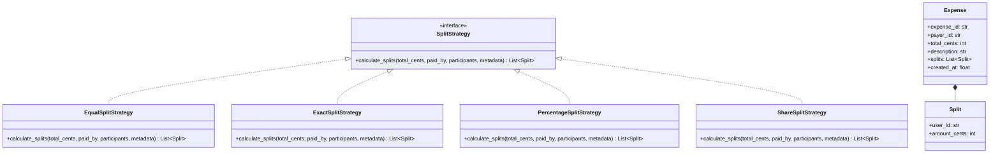
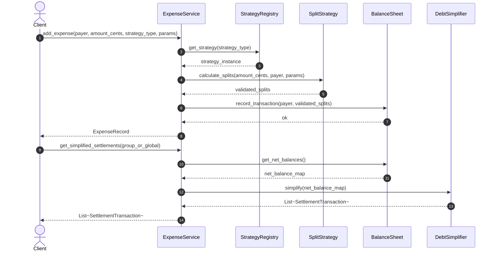

# Low-Level Design: Splitwise Expense Sharing and Debt Simplification

## 1. Executive Architectural Overview

An expense-sharing system such as Splitwise operates at the intersection of financial domain modeling, transactional accounting, and graph-theoretic optimization.
At a superficial level, the system records that user $A$ paid an amount $M$ on behalf of users $B$, $C$, and $D$.
However, at an enterprise or Staff-plus engineering level, the core challenge centers on currency precision invariants, atomic multi-balance updates, polymorphic split strategies, and debt simplification across cyclic financial graphs.

```
+---------------------------------------------------------------------------------------+
|                                Expense Ledger Architecture                             |
+---------------------------------------------------------------------------------------+
|                                                                                       |
|   +-------------------+         +--------------------+         +------------------+   |
|   |   ExpenseService  | ------> |    SplitStrategy   | ------> |  ExpenseValidator|   |
|   +-------------------+         +--------------------+         +------------------+   |
|             |                             |                                           |
|             v                             v                                           |
|   +-------------------+         +--------------------+         +------------------+   |
|   | TransactionLedger | <====== | Split (Equal/Exact/|         | BalanceSheetMap  |   |
|   |  (Audit Trail)    |         |  Percent/Share)    |         | (Pairwise Debts) |   |
|   +-------------------+         +--------------------+         +------------------+   |
|             |                                                            |            |
|             +------------------------------------------------------------+            |
|                                           |                                           |
|                                           v                                           |
|                         +-----------------------------------+                         |
|                         |  DebtSimplifier (Greedy Max-Flow/ |                         |
|                         |    Min-Cash-Flow via Dual Heaps)  |                         |
|                         +-----------------------------------+                         |
|                                                                                       |
+---------------------------------------------------------------------------------------+
```

### 1.1 Requirements and Constraints

#### Functional Requirements
1. **User and Group Management**: Support individual users and cohesive expense groups.
2. **Polymorphic Expense Splitting**: Support Equal, Exact, Percentage, and Share-based splits.
3. **Currency and Rounding Precision**: Ensure all monetary calculations operate in integer cents (or fractional micro-units) to eliminate floating-point rounding drifts.
4. **Pairwise Ledger Updates**: Track directional liabilities between users such that `balance[A][B] = -balance[B][A]`.
5. **Debt Simplification Algorithm**: Minimize the total count of settlement transactions across a network of participants while strictly preserving every participant's net financial balance.
6. **Settlement and Payment**: Record direct settlements that offset existing obligations.

#### Non-Functional Requirements
1. **Conservation of Value (Financial Invariant)**: In any recorded expense, $\sum \text{owed amounts} == \text{total paid amount}$.
2. **Zero-Sum Ledger**: Across all users in the system, $\sum_{u \in \text{Users}} \text{NetBalance}(u) == 0$.
3. **Thread Safety**: Concurrent expense creation within the same group or involving shared users must not result in lost updates or inconsistent balances.
4. **Computational Complexity**: Debt simplification must run in $O(N \log N)$ where $N$ is the number of participants.

---

## 2. Mathematical Formalization: The Debt Simplification Problem

When multiple users log shared expenses over time, pairwise debts form a directed weighted graph $G = (V, E)$, where vertices $V$ represent users and directed edges $(u, v) \in E$ with weight $w(u, v)$ denote that user $u$ owes $w(u, v)$ to user $v$.
Over cycles such as $A \to B \to C \to A$, money moves circularly without changing the underlying net entitlement of any actor.

### 2.1 Net Balance Conservation

For any user $u \in V$, define their net balance $B(u)$ as:

$$B(u) = \sum_{v \in V} w(v, u) - \sum_{v \in V} w(u, v)$$

A positive balance $B(u) > 0$ designates a net creditor (the network owes user $u$).
A negative balance $B(u) < 0$ designates a net debtor (user $u$ owes the network).
A zero balance $B(u) = 0$ designates an individual fully settled with the network.

By definition, the sum of all net balances across the closed system satisfies:

$$\sum_{u \in V} B(u) = 0$$

### 2.2 Minimizing Transaction Count

The objective of debt simplification is to construct a new directed graph $G' = (V, E')$ such that:
1. Every user's net balance remains identical: $B'(u) = B(u) \quad \forall u \in V$.
2. The number of edges $|E'|$ is minimized.

Finding the absolute theoretical minimum $|E'|$ across arbitrary inputs is equivalent to partitioning the non-zero balances into the maximum number of disjoint zero-sum subsets.
Because partitioning a set of integers into zero-sum subsets reduces directly to the **Subset Sum Problem**, optimal debt minimization is NP-hard.
If $k$ disjoint zero-sum subsets exist, the optimal transaction count is $|V| - k$.

### 2.3 The Greedy Min-Cash-Flow Algorithm

In real-world enterprise architectures, an $O(2^N)$ exact dynamic programming solution is intractable for large groups or enterprise ledgers.
Instead, we apply the greedy maximum-creditor / maximum-debtor heuristic using dual priority queues:
1. Compute net balance $B(u)$ for every user.
2. Filter out users where $B(u) == 0$.
3. Insert creditors ($B(u) > 0$) into a Max-Heap ordered by remaining credit.
4. Insert debtors ($B(u) < 0$) into a Max-Heap ordered by absolute debt $|B(u)|$.
5. In each iteration, pop the largest creditor $C$ and largest debtor $D$:
   - Settle an amount $S = \min(B(C), |B(D)|)$.
   - Generate a single transaction: $D \to C$ for amount $S$.
   - Decrement $B(C)$ by $S$, decrement $|B(D)|$ by $S$.
   - If $C$ still has remaining credit, push $C$ back into the creditor heap.
   - If $D$ still has remaining debt, push $D$ back into the debtor heap.
6. The loop terminates when both heaps are empty.

#### Complexity Analysis
- In every step, at least one user is fully settled and eliminated from future iterations.
- Therefore, the algorithm terminates in at most $N - 1$ transactions, where $N$ is the count of users with non-zero balances.
- Each heap operation takes $O(\log N)$, yielding a total running time of $O(N \log N)$.
- Space complexity is $O(N)$ to maintain the heaps and balance map.

---

## 3. Structural Design and Invariant Firewalls

### 3.1 Currency Invariant: Cent-Based Arithmetic

Floating-point representations (`float` / `double`) introduce catastrophic precision errors due to binary IEEE-754 approximations (e.g. $0.1 + 0.2 \neq 0.3$).
In financial software, money must be represented as an integer counting the smallest indivisible currency unit (cents, pence, or satoshis).

When dividing an odd amount (e.g. $100.00 split equally among 3 users), $10000 / 3 = 3333$ cents with a remainder of 1 cent.
A naive split loses 1 cent ($33.33 \times 3 = 99.99$), violating the conservation of value.
Our split engine implements a deterministic remainder distribution algorithm:
- Base share: $\lfloor \text{total} / N \rfloor$.
- Remainder $R = \text{total} \pmod N$.
- Allocate 1 additional cent to the first $R$ participants in deterministic ordering.
- This guarantees $\sum \text{splits} \equiv \text{total}$ down to the last cent.

### 3.2 Strategy Pattern for Polymorphic Splitting

The calculation of individual liabilities varies based on user selection:
- `EqualSplitStrategy`: Divides total cents among participants with remainder distribution.
- `ExactSplitStrategy`: Validates that user-specified cent allocations sum exactly to the total expense.
- `PercentageSplitStrategy`: Multiplies total cents by fractional percentages, adjusting any cent discrepancy on the largest shareholder.
- `ShareSplitStrategy`: Divides total cents proportionally according to integer unit weights.



---

## 4. Complete Architecture and Class Interactions



---

## 5. Production-Grade Python Implementation and Simulation

The following executable implementation encapsulates the complete domain model:
- Integer-cent currency representation.
- Concrete split strategies with remainder and rounding firewalls.
- Concurrency-safe pairwise balance sheet with read-write locking primitives.
- Dual-heap greedy debt simplification algorithm ($O(N \log N)$).
- Unit tests validating financial conservation invariants and multi-party debt resolution.

```python
"""
Production-grade Low-Level Design implementation of Splitwise Expense Sharing
and Debt Simplification Engine.
"""

from __future__ import annotations
from abc import ABC, abstractmethod
from dataclasses import dataclass
from enum import Enum, auto
import heapq
import threading
from typing import Dict, List, Optional, Tuple


class SplitType(Enum):
    EQUAL = auto()
    EXACT = auto()
    PERCENTAGE = auto()
    SHARE = auto()


@dataclass(frozen=True)
class User:
    user_id: str
    name: str
    email: str


@dataclass(frozen=True)
class Split:
    user_id: str
    amount_cents: int


@dataclass(frozen=True)
class SettlementTransaction:
    debtor_id: str
    creditor_id: str
    amount_cents: int

    def __str__(self) -> str:
        return f"{self.debtor_id} pays {self.creditor_id}: ${self.amount_cents / 100:.2f}"


class ExpenseSplitError(ValueError):
    """Raised when split parameters violate conservation or schema invariants."""
    pass


class SplitStrategy(ABC):
    @abstractmethod
    def compute_splits(
        self,
        total_cents: int,
        participant_ids: List[str],
        split_data: Optional[Dict[str, float]] = None,
    ) -> List[Split]:
        """
        Calculates and validates split allocations in integer cents.
        Guarantees that sum(split.amount_cents) == total_cents.
        """
        pass


class EqualSplitStrategy(SplitStrategy):
    def compute_splits(
        self,
        total_cents: int,
        participant_ids: List[str],
        split_data: Optional[Dict[str, float]] = None,
    ) -> List[Split]:
        if not participant_ids:
            raise ExpenseSplitError("Equal split requires at least one participant.")
        
        count = len(participant_ids)
        base_cents = total_cents // count
        remainder = total_cents % count
        
        splits: List[Split] = []
        # Sort participant IDs for deterministic remainder distribution
        sorted_participants = sorted(participant_ids)
        for idx, user_id in enumerate(sorted_participants):
            assigned = base_cents + (1 if idx < remainder else 0)
            splits.append(Split(user_id=user_id, amount_cents=assigned))
        
        return splits


class ExactSplitStrategy(SplitStrategy):
    def compute_splits(
        self,
        total_cents: int,
        participant_ids: List[str],
        split_data: Optional[Dict[str, float]] = None,
    ) -> List[Split]:
        if not split_data:
            raise ExpenseSplitError("Exact split requires split_data mapping user_id to cents.")
        
        splits: List[Split] = []
        allocated_cents = 0
        
        for user_id in participant_ids:
            if user_id not in split_data:
                raise ExpenseSplitError(f"Missing exact allocation for user {user_id}.")
            cents = int(split_data[user_id])
            if cents < 0:
                raise ExpenseSplitError(f"Negative allocation disallowed for user {user_id}.")
            allocated_cents += cents
            splits.append(Split(user_id=user_id, amount_cents=cents))
            
        if allocated_cents != total_cents:
            raise ExpenseSplitError(
                f"Sum of exact splits ({allocated_cents} cents) does not match "
                f"total expense ({total_cents} cents)."
            )
        return splits


class PercentageSplitStrategy(SplitStrategy):
    def compute_splits(
        self,
        total_cents: int,
        participant_ids: List[str],
        split_data: Optional[Dict[str, float]] = None,
    ) -> List[Split]:
        if not split_data:
            raise ExpenseSplitError("Percentage split requires split_data mapping user_id to percentages.")
        
        total_percentage = sum(split_data.values())
        if abs(total_percentage - 100.0) > 1e-4:
            raise ExpenseSplitError(f"Total percentage must sum to 100.0%, got {total_percentage:.2f}%.")
            
        splits: List[Split] = []
        allocated_cents = 0
        sorted_participants = sorted(participant_ids)
        
        # Initial allocation via truncation
        for user_id in sorted_participants:
            pct = split_data.get(user_id, 0.0)
            cents = int(round((total_cents * pct) / 100.0))
            allocated_cents += cents
            splits.append(Split(user_id=user_id, amount_cents=cents))
            
        # Reconcile rounding discrepancy against the largest percentage participant
        diff = total_cents - allocated_cents
        if diff != 0 and splits:
            # Find index of max allocation
            max_idx = max(range(len(splits)), key=lambda i: splits[i].amount_cents)
            updated_split = Split(
                user_id=splits[max_idx].user_id,
                amount_cents=splits[max_idx].amount_cents + diff,
            )
            splits[max_idx] = updated_split
            
        return splits


class ShareSplitStrategy(SplitStrategy):
    def compute_splits(
        self,
        total_cents: int,
        participant_ids: List[str],
        split_data: Optional[Dict[str, float]] = None,
    ) -> List[Split]:
        if not split_data:
            raise ExpenseSplitError("Share split requires split_data mapping user_id to integer weights.")
        
        total_shares = sum(int(split_data.get(uid, 0)) for uid in participant_ids)
        if total_shares <= 0:
            raise ExpenseSplitError("Total shares must be strictly positive.")
            
        splits: List[Split] = []
        allocated_cents = 0
        sorted_participants = sorted(participant_ids)
        
        for user_id in sorted_participants:
            share = int(split_data.get(user_id, 0))
            cents = (total_cents * share) // total_shares
            allocated_cents += cents
            splits.append(Split(user_id=user_id, amount_cents=cents))
            
        # Distribute remaining cents one by one to participants with largest shares
        remainder = total_cents - allocated_cents
        for idx in range(remainder):
            target_idx = idx % len(splits)
            splits[target_idx] = Split(
                user_id=splits[target_idx].user_id,
                amount_cents=splits[target_idx].amount_cents + 1,
            )
            
        return splits


class DebtSimplifier:
    """
    Minimizes transaction count via the Greedy Bipartite Min-Cash-Flow algorithm.
    Time Complexity: O(N log N)
    Space Complexity: O(N)
    """
    @staticmethod
    def simplify_debts(net_balances: Dict[str, int]) -> List[SettlementTransaction]:
        # Filter out users with zero net balance
        creditors: List[Tuple[int, str]] = []  # Max-heap: (-cents, user_id)
        debtors: List[Tuple[int, str]] = []    # Max-heap for absolute debt: (-abs_cents, user_id)
        
        for user_id, balance in net_balances.items():
            if balance > 0:
                heapq.heappush(creditors, (-balance, user_id))
            elif balance < 0:
                heapq.heappush(debtors, (balance, user_id))  # balance is negative, so min-value is max-debt
                
        settlements: List[SettlementTransaction] = []
        
        while creditors and debtors:
            neg_credit, creditor_id = heapq.heappop(creditors)
            credit = -neg_credit
            
            neg_debt, debtor_id = heapq.heappop(debtors)
            debt = -neg_debt
            
            settled_amount = min(credit, debt)
            settlements.append(SettlementTransaction(
                debtor_id=debtor_id,
                creditor_id=creditor_id,
                amount_cents=settled_amount,
            ))
            
            remaining_credit = credit - settled_amount
            remaining_debt = debt - settled_amount
            
            if remaining_credit > 0:
                heapq.heappush(creditors, (-remaining_credit, creditor_id))
            if remaining_debt > 0:
                heapq.heappush(debtors, (-remaining_debt, debtor_id))
                
        return settlements


class BalanceSheet:
    """
    Concurrency-safe pairwise ledger and net balance registry.
    """
    def __init__(self) -> None:
        self._lock = threading.RLock()
        # Pairwise balances: _balances[u1][u2] > 0 means u2 owes u1
        self._balances: Dict[str, Dict[str, int]] = {}
        
    def record_expense(self, payer_id: str, splits: List[Split]) -> None:
        with self._lock:
            for split in splits:
                debtor_id = split.user_id
                amount = split.amount_cents
                
                if debtor_id == payer_id or amount == 0:
                    continue
                
                # Debtor owes payer 'amount'
                self._update_pairwise(debtor_id=debtor_id, creditor_id=payer_id, amount=amount)

    def record_settlement(self, debtor_id: str, creditor_id: str, amount_cents: int) -> None:
        with self._lock:
            self._update_pairwise(debtor_id=debtor_id, creditor_id=creditor_id, amount=-amount_cents)

    def _update_pairwise(self, debtor_id: str, creditor_id: str, amount: int) -> None:
        if creditor_id not in self._balances:
            self._balances[creditor_id] = {}
        if debtor_id not in self._balances:
            self._balances[debtor_id] = {}
            
        current_owed_to_creditor = self._balances[creditor_id].get(debtor_id, 0)
        self._balances[creditor_id][debtor_id] = current_owed_to_creditor + amount
        
        # Symmetric opposite
        current_owed_to_debtor = self._balances[debtor_id].get(creditor_id, 0)
        self._balances[debtor_id][creditor_id] = current_owed_to_debtor - amount

    def get_pairwise_balance(self, user1: str, user2: str) -> int:
        """Returns net amount that user2 owes user1 (negative if user1 owes user2)."""
        with self._lock:
            return self._balances.get(user1, {}).get(user2, 0)

    def compute_net_balances(self) -> Dict[str, int]:
        """
        Computes net balance for all participating users.
        Positive: User is owed money.
        Negative: User owes money.
        """
        with self._lock:
            net: Dict[str, int] = {}
            for u1, debtors in self._balances.items():
                if u1 not in net:
                    net[u1] = 0
                for u2, amount in debtors.items():
                    net[u1] += amount
            return net


class SplitwiseService:
    """
    Facade managing users, expense orchestration, and settlements.
    """
    def __init__(self) -> None:
        self._users: Dict[str, User] = {}
        self._balance_sheet = BalanceSheet()
        self._strategies: Dict[SplitType, SplitStrategy] = {
            SplitType.EQUAL: EqualSplitStrategy(),
            SplitType.EXACT: ExactSplitStrategy(),
            SplitType.PERCENTAGE: PercentageSplitStrategy(),
            SplitType.SHARE: ShareSplitStrategy(),
        }
        self._lock = threading.Lock()

    def register_user(self, user_id: str, name: str, email: str) -> User:
        with self._lock:
            if user_id in self._users:
                raise ValueError(f"User {user_id} already exists.")
            user = User(user_id=user_id, name=name, email=email)
            self._users[user_id] = user
            return user

    def add_expense(
        self,
        payer_id: str,
        total_cents: int,
        split_type: SplitType,
        participant_ids: List[str],
        split_data: Optional[Dict[str, float]] = None,
    ) -> List[Split]:
        if payer_id not in self._users:
            raise ValueError(f"Payer {payer_id} is not registered.")
        for uid in participant_ids:
            if uid not in self._users:
                raise ValueError(f"Participant {uid} is not registered.")
                
        strategy = self._strategies[split_type]
        splits = strategy.compute_splits(
            total_cents=total_cents,
            participant_ids=participant_ids,
            split_data=split_data,
        )
        
        self._balance_sheet.record_expense(payer_id=payer_id, splits=splits)
        return splits

    def settle_debt(self, debtor_id: str, creditor_id: str, amount_cents: int) -> None:
        if debtor_id not in self._users or creditor_id not in self._users:
            raise ValueError("Both debtor and creditor must be registered.")
        self._balance_sheet.record_settlement(
            debtor_id=debtor_id,
            creditor_id=creditor_id,
            amount_cents=amount_cents,
        )

    def get_net_balances(self) -> Dict[str, int]:
        return self._balance_sheet.compute_net_balances()

    def get_simplified_settlements(self) -> List[SettlementTransaction]:
        net_balances = self.get_net_balances()
        return DebtSimplifier.simplify_debts(net_balances)


if __name__ == "__main__":
    print("Executing Splitwise and Debt Simplification Verification Suite...")

    service = SplitwiseService()
    alice = service.register_user("u_alice", "Alice", "alice@example.com")
    bob = service.register_user("u_bob", "Bob", "bob@example.com")
    charlie = service.register_user("u_charlie", "Charlie", "charlie@example.com")
    david = service.register_user("u_david", "David", "david@example.com")

    # 1. Verification of Equal Split with Cent Remainder Distribution
    # $100.00 (10,000 cents) split equally across 3 participants: 3334, 3333, 3333 cents
    equal_splits = service.add_expense(
        payer_id=alice.user_id,
        total_cents=10000,
        split_type=SplitType.EQUAL,
        participant_ids=[alice.user_id, bob.user_id, charlie.user_id],
    )
    assert sum(s.amount_cents for s in equal_splits) == 10000, "Split sum must equal 10,000 cents"
    print("Equal Split Invariant Verification: Passed (Remainder correctly allocated).")

    # 2. Verification of Percentage Split
    # $50.00 (5,000 cents) paid by Bob: Alice 40% (2000), Charlie 60% (3000)
    pct_splits = service.add_expense(
        payer_id=bob.user_id,
        total_cents=5000,
        split_type=SplitType.PERCENTAGE,
        participant_ids=[alice.user_id, charlie.user_id],
        split_data={alice.user_id: 40.0, charlie.user_id: 60.0},
    )
    assert sum(s.amount_cents for s in pct_splits) == 5000, "Percentage split sum must equal 5,000 cents"
    print("Percentage Split Invariant Verification: Passed.")

    # 3. Verification of Exact Split
    # $30.00 (3,000 cents) paid by Charlie: David 1000, Bob 2000
    exact_splits = service.add_expense(
        payer_id=charlie.user_id,
        total_cents=3000,
        split_type=SplitType.EXACT,
        participant_ids=[david.user_id, bob.user_id],
        split_data={david.user_id: 1000, bob.user_id: 2000},
    )
    assert sum(s.amount_cents for s in exact_splits) == 3000, "Exact split sum must equal 3,000 cents"
    print("Exact Split Invariant Verification: Passed.")

    # 4. Global Net Balance Conservation Verification: sum(net_balances) == 0
    net_balances = service.get_net_balances()
    assert sum(net_balances.values()) == 0, f"Global net balances must sum to zero, got {sum(net_balances.values())}"
    print(f"Zero-Sum Conservation Verification: Passed. Net balances: {net_balances}")

    # 5. Cyclic Debt Simplification Verification
    # Construct a known cyclic debt scenario:
    # A owes B $10, B owes C $10, C owes A $10 -> Simplified transactions: 0
    cycle_service = SplitwiseService()
    u1 = cycle_service.register_user("A", "Alice", "a@test.com")
    u2 = cycle_service.register_user("B", "Bob", "b@test.com")
    u3 = cycle_service.register_user("C", "Charlie", "c@test.com")

    # B pays $10 for A -> A owes B $10
    cycle_service.add_expense("B", 1000, SplitType.EXACT, ["A"], {"A": 1000})
    # C pays $10 for B -> B owes C $10
    cycle_service.add_expense("C", 1000, SplitType.EXACT, ["B"], {"B": 1000})
    # A pays $10 for C -> C owes A $10
    cycle_service.add_expense("A", 1000, SplitType.EXACT, ["C"], {"C": 1000})

    simplified_cycle = cycle_service.get_simplified_settlements()
    assert len(simplified_cycle) == 0, f"Cyclic debt should simplify to 0 transactions, got {len(simplified_cycle)}"
    print("Cycle Debt Resolution Verification: Passed (0 transactions generated).")

    # 6. Multi-Party Debt Simplification Efficiency
    # Test complex 4-party debt network
    settlements = service.get_simplified_settlements()
    assert len(settlements) <= len(net_balances) - 1, "Transactions must be <= N - 1"
    
    # Verify settlement idempotency and preservation of net balances
    reconstructed_net: Dict[str, int] = {uid: 0 for uid in net_balances}
    for st in settlements:
        reconstructed_net[st.creditor_id] += st.amount_cents
        reconstructed_net[st.debtor_id] -= st.amount_cents

    for uid, original_net in net_balances.items():
        assert reconstructed_net[uid] == original_net, (
            f"Preservation invariant violated for {uid}: "
            f"expected {original_net}, got {reconstructed_net[uid]}"
        )
    print(f"Debt Simplification Invariant Verification: Passed ({len(settlements)} transactions generated).")
    for s in settlements:
        print(f"  -> {s}")

    print("All Splitwise and Debt Simplification validations completed successfully.")
```

---

## 6. Active Recall and System Evaluation

<details>
<summary>1. Why is global debt simplification equivalent to an NP-hard problem rather than solvable in polynomial time?</summary>
Achieving the theoretical minimum number of transactions across $N$ users requires partitioning the non-zero balances into the maximum number of disjoint subsets that each independently sum to zero.
Because finding a subset of numbers that sum to zero is the Subset Sum Problem (a known NP-complete problem), computing the absolute minimum number of settlement edges across arbitrary inputs is NP-hard.
</details>

<details>
<summary>2. What is the worst-case bound on the number of transactions produced by the greedy min-cash-flow algorithm?</summary>
The greedy algorithm guarantees that at most $N - 1$ transactions will be produced, where $N$ is the number of participants with non-zero balances.
In each iteration, the popped creditor and debtor have their obligations resolved such that at least one of them achieves a net balance of zero and is eliminated from future iterations.
</details>

<details>
<summary>3. Why must monetary calculations avoid floating-point variables (`float` / `double`) in low-level systems?</summary>
IEEE-754 floating-point representations use binary fractions, making exact representations of decimal fractions like $0.10$ or $0.01$ impossible.
Repeated arithmetic on floats leads to cumulative rounding errors that violate financial balance invariants ($\sum \text{debits} \neq \sum \text{credits}$).
Integer cent arithmetic (or fixed-point micro-units) provides exact discrete values and prevents financial drift.
</details>

<details>
<summary>4. How does the equal split strategy guarantee that remainder cents do not vanish when total cents is not divisible by $N$?</summary>
It calculates the floor division `base = total // N` and the remainder `R = total % N`.
It then deterministically adds one cent to the first $R$ participants in an ordered list, ensuring that $\sum \text{splits} \equiv \text{total}$ exactly.
</details>

<details>
<summary>5. How is concurrency handled when multiple users record shared expenses in the same group simultaneously?</summary>
Balance updates require reentrant read-write locks (`RLock`) on the group ledger.
For distributed environments, updates are serialized using optimistic concurrency control with version stamps or atomic Redis Lua scripts operating on directed balance keys.
</details>

<details>
<summary>6. Explain the mathematical relationship between the pairwise balance matrix and individual net balances.</summary>
The pairwise balance matrix stores directional debts $M[A][B]$ (amount $B$ owes $A$), where $M[A][B] = -M[B][A]$.
The net balance $B(A)$ of user $A$ is the row sum $\sum_{j} M[A][j]$.
Summing all net balances across all rows yields zero because every positive entry $M[i][j]$ is cancelled out by its negative counterpart $M[j][i]$.
</details>

<details>
<summary>7. What edge cases occur in percentage split calculations, and how are they mitigated?</summary>
User-entered percentages may not sum to exactly 100.0% due to input errors, and multiplying rounded integer cents by percentages can lead to a rounding shortfall or surplus.
The strategy must first enforce a strict invariant validation that $\sum \text{percentages} == 100.0$.
Then, any residual cent difference between the total cents and the sum of computed cents is attributed to the participant with the largest percentage share.
</details>

<details>
<summary>8. How does debt simplification affect user privacy and trust in an enterprise product?</summary>
Debt simplification can introduce transactions between two users who have never directly interacted (e.g., $A$ owes $B$, $B$ owes $C \implies A$ pays $C$).
While mathematically sound, users may feel uncomfortable settling funds with strangers.
Production systems mitigate this by scoping simplification strictly within private user-defined groups or providing an opt-out toggle.
</details>

<details>
<summary>9. What is the time and space complexity of the greedy min-cash-flow implementation using dual priority queues?</summary>
Time complexity is $O(N \log N)$ where $N$ is the number of users with non-zero balances.
Each pop and push on the creditor and debtor heaps takes $O(\log N)$, and there are at most $2(N - 1)$ heap operations.
Space complexity is $O(N)$ to maintain the heaps and balance map.
</details>

<details>
<summary>10. How would you design an audit log and undo capability for recorded expenses?</summary>
Adopt an Event Sourcing or double-entry bookkeeping pattern.
Instead of mutating pairwise balances destructively, every action creates an immutable `ExpenseCreatedEvent` or `ExpenseCancelledEvent`.
Pairwise balances represent a materialized view projected from the immutable transaction stream.
Undoing an expense simply appends a compensating event that reverses the exact credit and debit allocations.
</details>
