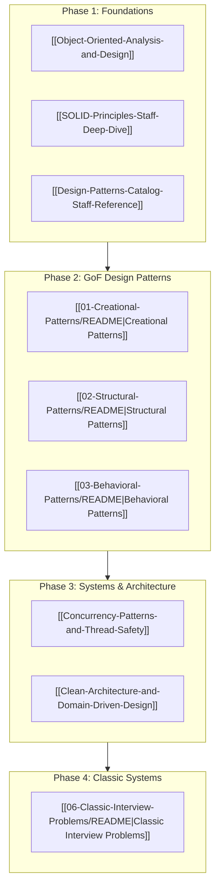

# Low-Level Design (LLD) Curriculum for Distinguished Engineers

Low-level design defines the architecture of a single process: types, object boundaries, concurrency invariants, memory layouts, and thread safety.
While high-level system design in [[Distinguished-Design-Path]] focuses on inter-process coordination across distributed nodes, low-level design guarantees correctness, performance, and maintainability within the process memory boundary.
At Staff and Principal engineering levels, an object-oriented design is incomplete without an explicit thread-safety model, memory layout awareness, and deterministic error handling.

---

## 1. Foundations of Software Architecture

Start with these core architectural notes before exploring specific design patterns.
They establish the formal vocabulary, package metrics, and invariant verification rules used throughout the curriculum.

- [[Object-Oriented-Analysis-and-Design]]: BCE (Boundary-Control-Entity) decomposition, CRC cards, Robert C. Martin package metrics (Instability $I$, Abstractness $A$, Distance from Main Sequence $D$), and the Law of Demeter.
- [[SOLID-Principles-Staff-Deep-Dive]]: LCOM4 cohesion computation, behavioral subtyping (Liskov Substitution Principle preconditions, postconditions, and history constraints), Open-Closed Principle registries, and Dependency Inversion.
- [[Design-Patterns-Catalog-Staff-Reference]]: Master architectural reference and systems taxonomy across all 23 Gang of Four patterns, concurrency patterns, and domain-driven design structures with CPU cache and dynamic dispatch trade-offs.

---

## 2. Creational Design Patterns

Creational patterns decouple object construction from callers, enforcing lifetime policies, object pooling, and invariant validation during initialization.

- [[Factory-and-Abstract-Factory]]: Type-safe self-registering factory registries and multi-cloud abstract product family factories without conditional branching.
- [[Builder-and-Prototype]]: Staged type-safe builders with compile-time state transitions, invariant firewalls, and deep prototype cloning with cycle detection.
- [[Singleton-and-Object-Pool]]: Concurrency hazards of Double-Checked Locking, acquire/release memory barriers, and bounded object pools with health checks and idle leak reapers.

---

## 3. Structural Design Patterns

Structural patterns compose classes and objects into larger subsystems while maintaining loose coupling, uniform interfaces, and minimal memory overhead.

- [[Adapter-Bridge-and-Facade]]: Legacy interface adaptation, cross-platform graphics renderer bridge ($M \times N \to M + N$), and unified subsystem facades.
- [[Decorator-and-Proxy]]: Transparent runtime behavior enhancement via chained streaming decorators, Role-Based Access Control (RBAC) protection proxies, and virtual lazy-loading proxies.
- [[Composite-and-Flyweight]]: Hierarchical tree aggregation with recursive visitors, and glyph rendering pools optimizing 90,000 document characters into fewer than 35 shared memory allocations.

---

## 4. Behavioral Design Patterns

Behavioral patterns manage algorithms, control flows, state machines, and event coordination between independent software components.

- [[Strategy-and-State]]: Dynamic algorithm swapping, volatile pricing engines, and thread-safe Order lifecycle state machines with guarded transitions.
- [[Observer-and-Pub-Sub]]: Weak-reference event notification preventing memory leaks (lapsed listener problem), and asynchronous multi-topic pub-sub event buses with backpressure.
- [[Command-and-Chain-of-Responsibility]]: Encapsulated transactional commands with reversible Undo/Redo ledgers, and HTTP middleware pipelines with early short-circuiting.
- [[Iterator-Visitor-and-Mediator]]: Snapshot iterators with concurrent modification resilience, double-dispatch AST expression evaluation visitors, and multi-party coordination mediators.

---

## 5. Concurrency and Enterprise Architectural Patterns

High-performance in-process engineering requires mastery of thread coordination, non-blocking synchronization, and clean domain isolation.

- [[Concurrency-Patterns-and-Thread-Safety]]: Bounded thread pools with Caller-Runs backpressure, Poison Pill graceful shutdowns, memory fences, and lock-free LMAX Disruptor ring buffers with power-of-two bitwise masking.
- [[Clean-Architecture-and-Domain-Driven-Design]]: Hexagonal / Onion architecture, Value Objects (`Money`), Aggregate Roots (`Order`), Unit of Work transactional boundaries, and dynamic Circuit Breakers.

---

## 6. Canonical Enterprise Interview Problems

Ten comprehensive, production-grade low-level system designs.
Each problem includes mathematical invariants, concurrency models, thread-safe synchronization, complete standalone runnable Python simulations, and 10 active recall interview questions.

### Infrastructure & Core Services
- [[Design-In-Memory-Cache]]: $O(1)$ LRU doubly-linked list with lock-striped hash tables and dual lazy/active TTL background eviction.
- [[Design-Rate-Limiter]]: Token Bucket with lazy mathematical replenishment and Sliding Window Counter with weighted sub-window interpolation.
- [[Design-Event-Bus-Pub-Sub]]: Trie-based hierarchical topic router with single-word wildcards, worker thread dispatch, and Dead Letter Queues (DLQ).
- [[Design-Logging-Framework]]: Hierarchical logger tree with level inheritance, asynchronous ring buffer appender, and dedicated background flush thread.
- [[Design-Task-Scheduler]]: Min-heap priority queue delayed task execution, condition variable synchronization, recurring intervals, and cooperative cancellation tokens.

### Domain & Product Systems
- [[Design-Elevator-System]]: Multi-car elevator bank dispatcher with LOOK scan scheduling, directional request queues, and door cycle state machines.
- [[Design-Smart-Parking-Lot]]: Multi-floor parking facility with vehicle polymorphism, Best-Fit spot allocation algorithm, and atomic spot reservations.
- [[Design-Movie-Ticket-Booking-System]]: High-concurrency seat reservation engine with two-phase TTL soft locks, deadlock-free sorted lock acquisition, and idempotent payments.
- [[Design-Ride-Sharing-Dispatch-Engine]]: Location-based driver dispatch system featuring spatial grid indexing, atomic driver state transitions, and dynamic surge pricing.
- [[Design-Splitwise-Expense-Sharing]]: Multi-party expense ledger featuring polymorphic split strategies (Equal, Exact, Percentage, Share) and greedy dual-heap debt simplification ($O(N \log N)$).

---

## 7. Language-Specific Catalogs and Codebases

For runnable implementations in compiled and scripting languages:
- [[04-System-Design/design-patterns-cpp/README|C++ Design Patterns Catalog]]: Complete GoF catalog implemented with modern C++ idiom (RAII, smart pointers, templates, and concurrency primitives).
- [[04-System-Design/design-patterns-python/Ultimate-Python-Design-Patterns|Python Design Patterns Guide]]: Idiomatic Python design patterns, ABCs, dataclasses, and metaprogramming patterns.

<!-- moc:start (generated by tools/build_mocs.py; edits inside are overwritten) -->
## Also in this folder

**Sections**

- [Foundations](00-Foundations/README.md)
- [Creational Patterns](01-Creational-Patterns/README.md)
- [Structural Patterns](02-Structural-Patterns/README.md)
- [Behavioral Patterns](03-Behavioral-Patterns/README.md)
- [Classic Interview Problems](06-Classic-Interview-Problems/README.md)

<!-- moc:end -->
