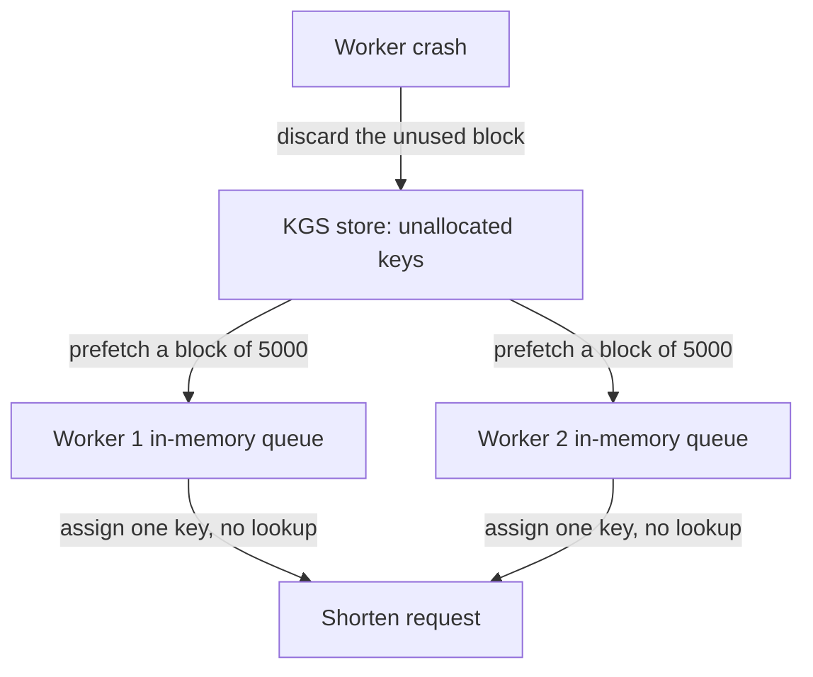

# Design a URL Shortener (TinyURL / Bitly)

## 1. TL;DR

A URL shortener maps arbitrary long URLs to compact, uniform aliases (e.g., `https://tiny.url/s7xK2b9`) and performs sub-millisecond HTTP redirects upon lookup.
The system is heavily read-dominant with an estimated read-to-write ratio exceeding 100:1.
At a scale of 100 million writes per month, the platform ingests approximately 38.6 new URLs per second while serving 3,860 redirection requests per second.
Key architectural challenges center on collision-free alias generation, minimal redirection latency, high cache hit rates, analytics ingestion without impacting the hot read path, and persistent storage capacity planning over a multi-year horizon.
The optimal architectural design combines a distributed Key Generation Service (KGS) or 64-bit integer ID generator (Snowflake) with Base62 encoding, fronted by a Redis distributed cache cluster and an append-friendly partitioned NoSQL or relational database.

---

## 2. Mental Model

A URL shortener operates across two primary decoupled workflows: the write path (creation) and the read path (redirection).

```mermaid
flowchart TD
    subgraph WritePath["Write Path (Creation)"]
        ClientWrite["Client / API Consumer"] -->|POST /api/v1/shorten| LBWrite["Load Balancer"]
        LBWrite --> GatewayWrite["API Gateway / App Server"]
        GatewayWrite --> KGS["Key Generation Service (KGS) / Snowflake"]
        KGS -->|Pre-allocated Key / ID| GatewayWrite
        GatewayWrite -->|Write Record| DB[(Primary Database: DynamoDB / PostgreSQL)]
        GatewayWrite -->|Warm Cache| Cache[(Redis Cache Cluster)]
        GatewayWrite -->|Publish Event| KafkaQ[Kafka / Message Queue]
        KafkaQ --> AnalyticsWorker["Analytics Aggregator Worker"]
        AnalyticsWorker --> AnalyticsDB[(ClickHouse / Analytics Store)]
    end

    subgraph ReadPath["Read Path (Redirection)"]
        ClientRead["End User Browser"] -->|GET /:shortCode| LBRead["Global Anycast DNS / CDN / LB"]
        LBRead --> EdgeServer["Edge Proxy / App Server"]
        EdgeServer -->|Check Cache| Cache
        Cache -->|Cache Hit (301/302 Redirect)| ClientRead
        Cache -.->|Cache Miss| EdgeServer
        EdgeServer -.->|Query Index| DB
        DB -.->|Populate Cache| Cache
        EdgeServer -->|Asynchronous Click Log| KafkaQ
    end
```

---

## 3. Architectural Internals and Deep Dive

### 3.1 Short Code Generation Strategies

Generating a 7-character alias from a large alphanumeric alphabet is the core algorithmic challenge.
Using Base62 (`[0-9, a-z, A-Z]`), a 7-character string yields $62^7 = 3,521,614,606,208$ (approximately 3.52 trillion) unique permutations, sufficient for decades of operation at 100 million writes per month.

#### Strategy A: Cryptographic Hashing with Collision Resolution
The application hashes the long URL using MD5 or SHA-256 and takes the first 7 characters of the Base62-encoded digest.
Because different input URLs can produce identical 7-character prefixes (hash collisions), the service must query the database to verify existence.
If a collision occurs, the service appends a predefined salt or sequence number to the input URL and re-hashes until an unused token is found.
This approach introduces variable write latency and creates database read contention during high write spikes.

#### Strategy B: Auto-Incrementing Counter with Base62 Encoding
A centralized counter generates a monotonically increasing 64-bit integer, which is directly converted to Base62.
For example, ID `11,157` converts to Base62 string `2TX`.
While collision-free and computationally light, standard single-node counters create a single point of failure and bottleneck horizontal scalability.
Furthermore, strictly sequential IDs expose business metrics to competitors who can infer total URL creation volumes by inspecting consecutive tokens.

#### Strategy C: Key Generation Service (KGS) Pre-Allocation (Recommended)
A standalone Key Generation Service generates random or sequential 7-character Base62 keys offline and maintains two tables: `available_keys` and `allocated_keys`.
To achieve extreme throughput, KGS loads blocks of keys (e.g., 5,000 keys at a time) into memory across multiple distributed web workers.
When a worker receives a shorten request, it assigns an in-memory key instantaneously without running hash computations or executing database uniqueness lookups.
If a worker crashes, its unused in-memory block is discarded; given 3.52 trillion available keys, losing thousands of keys during node restarts has negligible impact on key space exhaustion.



### 3.2 HTTP 301 vs. HTTP 302 Redirection

When responding to an incoming short code request, the service must choose between two redirection status codes:
1. **HTTP 301 (Moved Permanently)**: The browser caches the redirection target locally in its HTTP cache.
Subsequent visits to the short URL bypass the shortener service entirely and navigate directly to the target URL.
This minimizes latency and server load but prevents the shortener platform from capturing click analytics, geo-tracking, and referrer headers.
2. **HTTP 302 (Found / Temporary Redirect)**: The browser executes an HTTP request to the shortener service on every single click.
This allows the shortener to capture exact click counts, real-time analytics, user-agent details, and geo-ip metadata.
However, it routes all traffic through the shortener cluster, increasing infrastructure load and slightly raising redirection latency.
Enterprise URL shorteners typically implement HTTP 302 by default to preserve analytics tracking, while offering HTTP 301 as a configurable option for latency-critical API integrations.

### 3.3 Storage Layer and Data Model

The schema requires minimal relational complexity and high primary-key lookup efficiency.

```sql
-- Relational Schema (PostgreSQL)
CREATE TABLE url_mappings (
    id BIGSERIAL PRIMARY KEY,
    short_code VARCHAR(7) NOT NULL,
    long_url TEXT NOT NULL,
    user_id UUID NULL,
    created_at TIMESTAMP WITH TIME ZONE DEFAULT NOW(),
    expires_at TIMESTAMP WITH TIME ZONE NULL,
    click_count BIGINT DEFAULT 0
);

CREATE UNIQUE INDEX idx_url_mappings_short_code ON url_mappings (short_code);
CREATE INDEX idx_url_mappings_user_id ON url_mappings (user_id) WHERE user_id IS NOT NULL;
```

For ultra-high scale, a distributed NoSQL key-value store (Amazon DynamoDB or Apache Cassandra) provides superior linear scalability and partition management.
In DynamoDB:
- **Partition Key (PK)**: `short_code` (String, e.g., `s7xK2b9`)
- **Attributes**: `long_url`, `created_at`, `expires_at`, `user_id`
- **Global Secondary Index (GSI)**: `user_id` (PK) and `created_at` (SK) for user dashboard queries.

### 3.4 Custom Aliases and Collision Handling

When users supply custom short aliases (e.g., `tiny.url/launch2026`):
1. The service bypasses the KGS pre-allocated key pool.
2. The service performs an atomic conditional write directly against the database:
   - In SQL: `INSERT INTO url_mappings (short_code, long_url) VALUES ('launch2026', 'https://...') ON CONFLICT (short_code) DO NOTHING;`
   - In DynamoDB: `PutItem` with `attribute_not_exists(short_code)` condition expression.
3. If the insert returns a conflict error, the API returns an `HTTP 409 Conflict` indicating that the custom alias is already reserved.

### 3.5 Expiration and Eviction Pipeline

URLs with explicit expiration timestamps (`expires_at`) should not be deleted via synchronous scans of the live table.
Instead, two eviction strategies are employed:
1. **Lazy Expiration on Read**: When a client requests an expired short URL, the service checks `expires_at < current_timestamp`.
If expired, it returns `HTTP 404 Not Found`, enqueues a background deletion task, and evicts the key from Redis.
2. **Asynchronous Batch Sweeper**: A scheduled cron job runs during off-peak hours scanning small partitions, or a DynamoDB Time to Live (TTL) policy automatically drops expired items and streams deleted records to DynamoDB Streams for cold storage archival.

---

## 4. Trade-offs and Comparisons

| Dimension | Strategy A: Hash + Truncate | Strategy B: Auto-Increment + Base62 | Strategy C: Key Generation Service (KGS) | Strategy D: Snowflake 64-bit ID + Base62 |
|---|---|---|---|---|
| Collision Probability | High (requires database lookup + salt retry) | Zero (strictly unique counters) | Zero (keys pre-generated and allocated) | Zero (strictly unique 64-bit integers) |
| Write Latency | Variable ($O(1)$ to $O(k)$ roundtrips on collision) | Predictable, low ($O(1)$) | Ultra-low ($O(1)$ memory pop) | Ultra-low ($O(1)$ local generation) |
| Coordinate Bottleneck | None (stateless app servers) | High (centralized counter/ticket server) | Low (coordination only during batch lease) | Zero (independent worker IDs) |
| Security / Predictability | High randomness | Poor (sequential IDs expose metrics) | High (randomized key generation) | Medium (timestamps exposed in high bits) |
| Implementation Complexity | Moderate | Low | Moderate to High | Moderate |

---

## 5. Failure Modes and Mitigations

### 5.1 KGS Master Failure and Lease Expiration
- **Failure Mode**: The primary KGS instance fails, preventing app servers from obtaining new batches of pre-generated tokens.
- **Mitigation**: Deploy KGS as an active-passive cluster coordinated by Apache ZooKeeper or Raft consensus.
App workers maintain local queues holding up to 10 minutes of anticipated write volume.
If the KGS connection drops, app workers continue issuing tokens from local memory while the secondary KGS node promotes to primary.

### 5.2 Cache Stampede on Viral URL Expiration
- **Failure Mode**: A viral short link (e.g., product release link receiving 50,000 requests/sec) expires from the Redis cache, causing hundreds of concurrent edge workers to hit the database simultaneously.
- **Mitigation**: Implement probabilistic early expiration (XFetch algorithm) or distributed mutex locking using Redis `SET key value NX PX`.
Only one worker acquires the lock to fetch from the database and repopulate the cache, while remaining workers receive stale data or await lock release.

### 5.3 Write Amplification from Malicious Link Generation
- **Failure Mode**: Malicious actors script millions of random long URL generation requests, rapidly exhausting the 7-character key space and overwhelming write partitions.
- **Mitigation**: Enforce multi-tier rate limiting via IP and API key at the API Gateway.
Deploy Bloom filters at the ingestion layer to detect duplicate long URLs submitted by the same client.
Run automated URL threat classification (e.g., Google Safe Browsing API) asynchronously before activating redirection routes.

---

## 6. Hands-On Verification

The following standalone Python implementation demonstrates Base62 encoding, decoding, atomic collision checking, and local LRU caching with TTL.

```python
#!/usr/bin/env python3
"""
Production-grade demonstration of URL Shortener core components:
- Base62 encoding and decoding
- In-memory Key Generation Service (KGS) simulator
- URL Shortener engine with LRU cache and TTL eviction
"""

import time
import string
import threading
from typing import Optional, Dict, Tuple

BASE62_ALPHABET = string.digits + string.ascii_lowercase + string.ascii_uppercase
BASE = len(BASE62_ALPHABET)  # 62


def encode_base62(num: int) -> str:
    """Encode an unsigned integer into a Base62 string."""
    if num == 0:
        return BASE62_ALPHABET[0]
    digits = []
    while num > 0:
        num, rem = divmod(num, BASE)
        digits.append(BASE62_ALPHABET[rem])
    return "".join(reversed(digits))


def decode_base62(token: str) -> int:
    """Decode a Base62 string back into an integer."""
    result = 0
    for char in token:
        val = BASE62_ALPHABET.index(char)
        result = result * BASE + val
    return result


class InMemoryKGS:
    """Simulates a Key Generation Service pre-allocating batches of IDs."""
    def __init__(self, start_id: int = 1000000000, batch_size: int = 1000):
        self._current_id = start_id
        self._batch_size = batch_size
        self._lock = threading.Lock()

    def get_batch(self) -> Tuple[int, int]:
        """Returns range [start, end) of reserved numeric IDs."""
        with self._lock:
            start = self._current_id
            self._current_id += self._batch_size
            return start, self._current_id


class URLShortenerService:
    def __init__(self, kgs: InMemoryKGS):
        self._kgs = kgs
        self._db: Dict[str, Dict] = {}  # short_code -> metadata
        self._cache: Dict[str, Tuple[str, float]] = {}  # short_code -> (long_url, expire_timestamp)
        self._local_keys: list[str] = []
        self._lock = threading.Lock()

    def _refill_local_keys(self):
        start, end = self._kgs.get_batch()
        for num in range(start, end):
            self._local_keys.append(encode_base62(num))

    def shorten_url(self, long_url: str, custom_alias: Optional[str] = None, ttl_seconds: Optional[int] = None) -> str:
        with self._lock:
            if custom_alias:
                if custom_alias in self._db:
                    raise ValueError(f"Alias '{custom_alias}' already in use.")
                short_code = custom_alias
            else:
                if not self._local_keys:
                    self._refill_local_keys()
                short_code = self._local_keys.pop()

            expires_at = (time.time() + ttl_seconds) if ttl_seconds else None
            record = {
                "long_url": long_url,
                "created_at": time.time(),
                "expires_at": expires_at,
                "clicks": 0
            }
            self._db[short_code] = record
            
            # Populate cache
            cache_ttl = expires_at if expires_at else (time.time() + 86400)
            self._cache[short_code] = (long_url, cache_ttl)
            return short_code

    def resolve_url(self, short_code: str) -> Optional[str]:
        now = time.time()
        # 1. Check cache
        if short_code in self._cache:
            long_url, exp = self._cache[short_code]
            if exp is None or exp > now:
                self._db[short_code]["clicks"] += 1
                return long_url
            else:
                del self._cache[short_code]

        # 2. Check Database
        if short_code in self._db:
            record = self._db[short_code]
            if record["expires_at"] and record["expires_at"] <= now:
                return None  # Expired
            record["clicks"] += 1
            # Repopulate cache
            exp = record["expires_at"] if record["expires_at"] else (now + 86400)
            self._cache[short_code] = (record["long_url"], exp)
            return record["long_url"]

        return None


if __name__ == "__main__":
    kgs = InMemoryKGS(start_id=125000000, batch_size=5)
    service = URLShortenerService(kgs)

    # 1. Test URL Generation
    long_target = "https://www.example.com/deep/resource?user=42&session=xyz"
    short_code = service.shorten_url(long_target, ttl_seconds=3600)
    print(f"Generated Short Code: {short_code}")
    print(f"Decoded Numeric ID:   {decode_base62(short_code)}")

    # 2. Test Resolution
    resolved = service.resolve_url(short_code)
    assert resolved == long_target, "Resolution mismatch!"
    print(f"Resolved Target:       {resolved}")

    # 3. Test Custom Alias
    custom = service.shorten_url("https://antigravity.internal/docs", custom_alias="staff-design")
    assert service.resolve_url("staff-design") == "https://antigravity.internal/docs"
    print(f"Custom Alias Resolved: {custom}")

    # 4. Verify duplicate alias rejection
    try:
        service.shorten_url("https://other.com", custom_alias="staff-design")
        assert False, "Duplicate alias should have raised ValueError"
    except ValueError as e:
        print(f"Successfully caught collision: {e}")
```

### CLI Verification

Execute standard HTTP assertions across platforms:

```bash
# Linux / macOS: Create short URL via curl
curl -X POST https://api.tinyurl.com/v1/shorten \
  -H "Content-Type: application/json" \
  -H "Authorization: Bearer test_token" \
  -d '{"long_url": "https://example.com/system-design", "custom_alias": "sysdes2026"}'

# Linux / macOS: Test HTTP 302 Redirection response headers
curl -I https://tiny.url/sysdes2026

# Windows PowerShell: Test Redirection
Invoke-WebRequest -Uri "https://tiny.url/sysdes2026" -MaximumRedirection 0 -ErrorAction SilentlyContinue | Select-Object -ExpandProperty Headers
```

---

## 7. Performance Characteristics and Capacity Planning

### 7.1 Traffic Calculations
- **New URL Creations (Write Traffic)**:
  - 100 million writes/month.
  - Average Write QPS = $\frac{100,000,000}{30 \times 86,400} \approx 38.6 \text{ writes/sec}$.
  - Peak Write QPS (assuming $3\times$ peak factor) $\approx 115 \text{ writes/sec}$.
- **Redirection Requests (Read Traffic)**:
  - Assume a 100:1 read-to-write ratio.
  - Average Read QPS = $38.6 \times 100 \approx 3,860 \text{ reads/sec}$.
  - Peak Read QPS (assuming $2.5\times$ peak factor) $\approx 9,650 \text{ reads/sec}$.

### 7.2 Storage Calculations
- **Per-Record Size Breakdown**:
  - `id`: 8 bytes (64-bit integer)
  - `short_code`: 7 bytes (ASCII characters)
  - `long_url`: 500 bytes (average URL length)
  - `created_at`: 8 bytes (timestamp)
  - `expires_at`: 8 bytes (nullable timestamp)
  - `user_id`: 16 bytes (UUID)
  - Index and metadata overhead: ~50 bytes
  - Total per record $\approx 550 \text{ bytes}$.
- **Storage Growth Over Time**:
  - Monthly storage: $100,000,000 \times 550 \text{ bytes} = 55 \text{ GB/month}$.
  - Yearly storage: $55 \text{ GB} \times 12 = 660 \text{ GB/year}$.
  - 5-Year capacity requirement: $660 \text{ GB} \times 5 = 3.3 \text{ TB}$.
  - 3.3 TB fits comfortably on modern distributed storage systems with multi-AZ replication.

### 7.3 Cache Memory Calculations (80-20 Rule)
- 80% of daily redirection traffic originates from 20% of active URLs.
- Daily read requests = $3,860 \text{ reads/sec} \times 86,400 \text{ sec} \approx 333.5 \text{ million reads/day}$.
- Daily active URLs accessed = $20\% \times 333.5 \text{ million} \approx 66.7 \text{ million entries}$.
- Total memory required to cache the top 20% URLs:
  - $66.7 \text{ million} \times 500 \text{ bytes} \approx 33.35 \text{ GB}$.
  - Adding Redis hash table pointers and buffer overhead ($1.5\times$), the cluster requires approximately $50 \text{ GB}$ of RAM.
  - A 3-node Redis cluster with 32 GB RAM per node (64 GB usable after replication) easily accommodates this requirement.

---

## 8. In Production: Real-World Architecture (Bitly)

Bitly processes billions of clicks monthly using a globally distributed architecture:
1. **Edge Routing**: Anycast routing directs clients to the geographically closest Point of Presence (PoP).
2. **Hybrid Storage**: Bitly originally utilized a customized MySQL shard topology before migrating primary key lookups to distributed key-value storage.
3. **Analytics Pipeline**: Clicks stream through Apache Kafka into real-time stream processors (Apache Flink / Spark Streaming) which update user dashboards and write aggregated hourly and daily rollups into Apache Cassandra and ClickHouse.
4. **Branded Short Domains**: Bitly allows enterprise customers to bring custom domain names (CNAME records pointing to Bitly edge servers).
The edge router inspects the incoming `Host` header to resolve the mapping in the appropriate organization tenant scope.

---

## 9. Interview Questions and Deep Dives

> [!question] Question 1: Why is Base62 preferred over Base64 for URL shortener short codes?
> [!success]- Answer
> Base64 utilizes the characters `+` and `/` (or `-` and `_` in URL-safe Base64).
> In standard HTTP URLs, characters like `+` and `/` carry reserved syntactic meanings (e.g., query delimiters, path segment separators) and are often percent-encoded by web browsers into `%2B` and `%2F`, lengthening the short link.
> Base62 utilizes strictly alphanumeric characters (`0-9`, `a-z`, `A-Z`), which require zero percent-encoding in URLs and are safe across all HTTP clients and messaging platforms.

> [!question] Question 2: How would you prevent concurrent creation of the same custom alias by two different users?
> [!success]- Answer
> To prevent race conditions, the system must enforce atomicity at the data store layer rather than relying on application-level locks across stateless web servers.
> In a relational database, this is achieved via a `UNIQUE` constraint on the `short_code` column combined with an atomic `INSERT ... ON CONFLICT DO NOTHING` statement.
> In DynamoDB, this is achieved by executing a `PutItem` operation with a conditional expression `attribute_not_exists(short_code)`.
> The transaction that loses the race receives an error and the application immediately returns an `HTTP 409 Conflict` to the client.

> [!question] Question 3: Should the redirection endpoint return HTTP 301 or HTTP 302, and what are the architectural consequences?
> [!success]- Answer
> HTTP 301 (Moved Permanently) instructs the browser to cache the target URL indefinitely.
> Subsequent clicks navigate directly to the target URL from the browser's local cache without querying the shortener server.
> This reduces server load and redirection latency, but makes real-time click tracking, geolocation monitoring, and link decommissioning impossible.
> HTTP 302 (Found / Temporary Redirect) forces every click to hit the shortener server, enabling accurate analytics and dynamic link modification at the expense of higher infrastructure traffic and slight network overhead.

> [!question] Question 4: How does the Key Generation Service (KGS) prevent duplicate keys across multiple application server instances?
> [!success]- Answer
> KGS maintains an authoritative store of unallocated keys and issues non-overlapping blocks of keys (e.g., 5,000 keys per lease) to each application server using atomic database transactions or distributed lock leases.
> Once a block is leased to Server A, KGS immediately flags that range as assigned in its persistent store.
> Server A stores these keys in a local memory queue and pops them sequentially as requests arrive, requiring no cross-server synchronization.

> [!question] Question 5: What happens if an application server holding an in-memory block of 5,000 KGS keys crashes?
> [!success]- Answer
> If the application server crashes, the in-memory keys are permanently discarded and never re-issued.
> Because a 7-character Base62 namespace contains over 3.52 trillion unique combinations, losing a few thousand keys during server recycles represents less than 0.0000001% of the total key space and has zero impact on operational lifetime.
> Allowing discarded keys to lapse is strictly superior to attempting rollback recovery, which would introduce complex distributed state tracking and duplicate key risks.

> [!question] Question 6: How do you design the analytics pipeline so that high click traffic does not degrade redirection latency?
> [!success]- Answer
> Redirection handling and analytics collection must be strictly decoupled asynchronously.
> When the edge server handles a GET request, it immediately returns the HTTP 302 redirect response to the user while publishing a lightweight click event (`short_code`, `timestamp`, `ip_hash`, `user_agent`, `referrer`) to a distributed message queue (Apache Kafka).
> Downstream consumer groups ingest these events from Kafka in batches, perform IP-to-geo resolution, run fraud filtering, and write aggregated counters to an OLAP columnar database like ClickHouse or Snowflake.

> [!question] Question 7: How do you protect the shortener service against cache stampedes on viral links?
> [!success]- Answer
> When a heavily accessed cached URL expires, thousands of concurrent requests can simultaneously miss the cache and hit the database.
> To prevent this, employ two patterns:
> 1. **Probabilistic Early Expiration (XFetch)**: The caching layer computes an early refresh probability based on request rate and remaining TTL, refreshing the cache asynchronously in the background before actual expiration occurs.
> 2. **Mutex Locking**: The worker that experiences the cache miss acquires a distributed lock in Redis (`SET lock_key worker_id NX PX 2000`).
> Only that worker queries the database, while remaining requests await lock release or serve the previous value with a brief grace period.

> [!question] Question 8: How would you implement URL deletion and expiration without expensive full-table scans?
> [!success]- Answer
> Implement a two-tiered approach:
> 1. **Lazy Deletion on Read**: During lookup, the application verifies `expires_at`.
> If expired, it deletes the cache entry, returns an `HTTP 404`, and enqueues an asynchronous database deletion event.
> 2. **Storage TTL Integration**: If using DynamoDB, configure the native TTL attribute on `expires_at`, allowing DynamoDB's background scrubber to evict expired items automatically with zero read/write throughput cost.
> For relational databases, partition the table by expiration month/quarter and drop expired partitions via metadata DDL operations (`DROP TABLE partition_name`).

> [!question] Question 9: How would you prevent malicious actors from using the URL shortener for phishing or malware distribution?
> [!success]- Answer
> Apply automated security inspection across write and read paths:
> 1. **Synchronous Blacklist Verification**: Maintain a local in-memory Bloom filter of known malicious domain prefixes.
> Reject matching long URLs with `HTTP 400 Bad Request`.
> 2. **Asynchronous Sandbox Evaluation**: Send new URLs to a background worker pool that evaluates target domains against threat intelligence feeds (Google Safe Browsing, PhishTank) and scans landing pages in headless browsers.
> 3. **Interstitials for Untrusted Links**: For newly created or unverified links, present an interstitial landing page warning users that they are leaving the platform, giving them visibility into the target destination URL.

> [!question] Question 10: How does the system scale if write traffic increases by 100x to 10 billion URLs per month?
> [!success]- Answer
> At 10 billion writes/month (~3,860 writes/sec), the architecture scales via:
> 1. **Expanding Key Length**: Increase the short code length from 7 to 8 characters, expanding the address space from 3.52 trillion to $62^8 \approx 218 \text{ trillion}$ keys.
> 2. **Horizontal KGS Partitioning**: Partition the KGS key space across multiple regional clusters using hash ranges.
> 3. **Database Sharding**: Shard the database horizontally by the first two characters of the short code or hash of the short code across independent database clusters.
> 4. **Tiered Edge Caching**: Deploy CDN edge workers (Cloudflare Workers, Fastly VCL) to terminate SSL, inspect edge Redis replicas, and respond with redirects without traversing back to the origin datacenter.

---

## 10. Related Concepts and Wikilinks

- [[Consistent-Hashing]]: Partitioning cache and database nodes without re-hashing all keys during cluster resizes.
- [[Redis-Architecture]]: Memory structure, TTL eviction policies, and distributed locking via Redlock.
- [[Load-Balancing]]: Layer 4 vs Layer 7 traffic routing for high-throughput redirection endpoints.
- [[Apache-Kafka]]: Asynchronous decoupled clickstream log ingestion for real-time analytics.
- [[Apache-Cassandra]]: Distributed wide-column storage for append-heavy click analytics and time-series history.
- [[CAP-Theorem-and-PACELC]]: Evaluating Availability over Consistency in URL redirection services.

---

## 11. Further Reading

- Xu, Alex. *System Design Interview – An Insider’s Guide (Volume 1)*. Chapter 8: Design a URL Shortener.
- Kleppmann, Martin. *Designing Data-Intensive Applications*. O'Reilly Media. Chapter 3: Storage and Retrieval.
- Bitly Engineering Blog. *Scaling Bitly: Architecture and Asynchronous Processing at Scale*.
- RFC 7231: Hypertext Transfer Protocol (HTTP/1.1): Semantics and Content (Status Code 301 vs 302).
