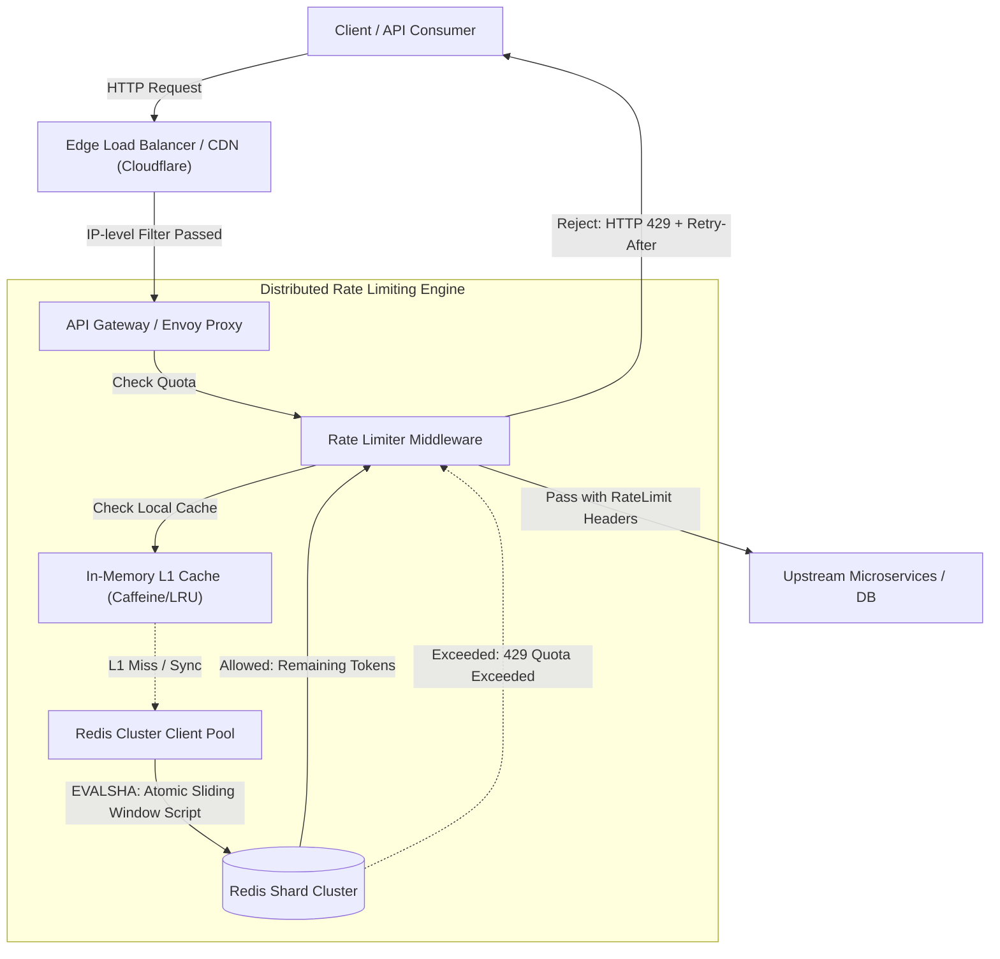

# Design a Distributed Rate Limiter

## 1. TL;DR

A distributed rate limiter controls the rate of traffic sent by clients or consumers to an API or service cluster.
It protects downstream services from Denial of Service (DoS) attacks, brute-force credential stuffing, resource starvation, and cascading failures.
When incoming request volume exceeds configured quotas (e.g., 100 requests per minute per API key), the rate limiter rejects surplus traffic with `HTTP 429 Too Many Requests` accompanied by standard retry headers (`Retry-After`, `X-RateLimit-Reset`).
At hyperscale (100,000+ requests per second across hundreds of stateless web servers), the primary architectural challenges are eliminating distributed race conditions during counter updates, minimizing serialization and network latency overhead (< 2ms per check), gracefully handling centralized cache partitions via configurable fail-open/fail-closed policies, and handling traffic bursts without excessive memory consumption.
The optimal production architecture combines multi-tier enforcement (edge, API gateway, internal service mesh) backed by a Redis cluster executing atomic Lua scripts for sliding window counters.

---

## 2. Mental Model

A distributed rate limiter operates as an inline filter or middleware service intercepting requests between ingress gateways and backend services.



---

## 3. Architectural Internals and Deep Dive

### 3.1 Rate Limiting Algorithms: In-Depth Comparison

#### 1. Token Bucket Algorithm
- **Mechanism**: A bucket maintains a capacity of $B$ tokens.
Tokens are continuously deposited into the bucket at a constant refill rate of $R$ tokens per second.
Each incoming request attempts to consume 1 token (or $k$ tokens for batch operations).
If tokens are available, the request proceeds and the token count decrements.
If the bucket is empty, the request is dropped immediately.
- **State Stored**: Two values per client: `last_refill_timestamp` (float) and `current_token_count` (float).
- **Strengths**: Allows short, controlled bursts of traffic up to capacity $B$ while bounding sustained throughput to $R$.
Extremely memory-efficient ($O(1)$ space per key).
- **Weaknesses**: Burst tuning requires careful calibration to prevent downstream database saturation.

#### 2. Leaky Bucket Algorithm
- **Mechanism**: Requests enter a First-In-First-Out (FIFO) queue of fixed capacity.
A background worker pulls requests from the queue and dispatches them to downstream services at a constant, fixed rate.
If the queue is full, newly arriving requests overflow and are rejected.
- **Strengths**: Completely smooths out outbound traffic bursts, producing a deterministic downstream request rate.
Ideal for rate-limiting calls to legacy third-party payment gateways with strict ingress thresholds.
- **Weaknesses**: Burst traffic experiences high queuing latency even when downstream systems have spare capacity.

#### 3. Fixed Window Counter Algorithm
- **Mechanism**: Time is sliced into fixed non-overlapping windows (e.g., 60 seconds).
A counter increments for every request arriving within the active window.
When the window boundary passes, the counter resets to zero.
- **Strengths**: Trivial implementation using Redis `INCR` and `EXPIRE`.
- **Weaknesses**: Severe edge-burst vulnerability.
If a client sends its entire quota of 100 requests at second 59 and another 100 requests at second 61, 200 requests pass within a 2-second interval, doubling the intended traffic threshold.

#### 4. Sliding Window Log Algorithm
- **Mechanism**: The system records the precise Unix timestamp of every individual request inside a sorted set (e.g., Redis `ZSET`).
When a new request arrives, all timestamps older than `(current_time - window_size)` are removed via `ZREMRANGEBYSCORE`.
The cardinality of the set is checked via `ZCARD`.
If the count is below the limit, the current timestamp is inserted via `ZADD` and the request passes.
- **Strengths**: 100% mathematical precision; completely eliminates window-edge spikes.
- **Weaknesses**: Memory-intensive ($O(N)$ storage where $N$ is total requests per window).
Under high-volume DDoS attacks, storing millions of timestamps per client causes rapid Redis out-of-memory (OOM) crashes.

#### 5. Sliding Window Counter Algorithm (Hybrid / Recommended)
- **Mechanism**: Combines the low memory overhead of the Fixed Window Counter with the accuracy of the Sliding Window Log.
It calculates an estimated request count by blending requests from the current window and the previous window based on time overlap:
$$\text{Estimated Count} = \text{Count}_{\text{current}} + \text{Count}_{\text{previous}} \times \left(1 - \frac{\text{Time Elapsed in Current Window}}{\text{Window Size}}\right)$$
If the estimated count is less than the limit, the request is permitted and the current window counter increments.
- **Strengths**: Requires only two numeric counters per client ($O(1)$ memory).
Bounds maximum error to under 0.05% in realistic traffic distributions.

```
+---------------------------------------------------------------+
|         Sliding Window Counter Calculation (1-Minute Window)   |
+---------------------------------------------------------------+
| Previous Window [12:00 - 12:01]: 80 requests                  |
| Current Window  [12:01 - 12:02]: 30 requests                  |
| Current Timestamp: 12:01:18 (30% through current window)      |
|                                                               |
| Overlap weight of previous window = 1.0 - 0.30 = 0.70         |
| Estimated load = 30 + (80 * 0.70) = 30 + 56 = 86 requests     |
| Limit = 100 req/min -> 86 < 100 -> Request ALLOWED            |
+---------------------------------------------------------------+
```

### 3.2 Distributed Race Conditions and Atomic Lua Execution

In a distributed environment with multiple API gateway instances querying a centralized Redis cluster, naive read-modify-write sequences fail:
1. Server 1 reads counter: `count = 9` (Limit = 10).
2. Server 2 reads counter: `count = 9`.
3. Server 1 increments: `count = 10` and allows request.
4. Server 2 increments: `count = 10` and allows request.
Both requests pass, violating the strict quota.

To achieve atomic evaluation, all checks and increments must execute inside a single **Redis Lua script**.
Redis executes Lua scripts single-threaded and atomically with respect to other scripts and commands, guaranteeing that no interleaved reads or writes can corrupt counter evaluation.

```lua
-- Redis Lua Script: Atomic Sliding Window Counter
local key_current = KEYS[1]
local key_prev = KEYS[2]
local limit = tonumber(ARGV[1])
local current_weight = tonumber(ARGV[2])

local current_count = tonumber(redis.call('get', key_current) or "0")
local prev_count = tonumber(redis.call('get', key_prev) or "0")

local estimated_count = current_count + (prev_count * current_weight)

if estimated_count < limit then
    redis.call('incr', key_current)
    if current_count == 0 then
        -- Expire current window key after 2 full window durations
        redis.call('expire', key_current, tonumber(ARGV[3]))
    end
    return {1, math.floor(limit - estimated_count - 1)} -- Allowed, Remaining
else
    return {0, 0} -- Rejected, 0 Remaining
end
```

### 3.3 Multi-Tier Enforcement Architecture

Production rate limiting must not rely on a single choke point:
1. **Tier 1 (Edge / Anycast CDN Layer)**: Coarse-grained rate limiting applied at Cloudflare or AWS CloudFront.
Blocks high-volume Layer 7 volumetric attacks and unauthenticated scraping based on client IP and CIDR blocks before traffic reaches origin infrastructure.
2. **Tier 2 (API Gateway Layer)**: Fine-grained token bucket or sliding window limiting applied at Kong, Envoy, or KrakenD.
Limits are keyed on authenticated identifiers: `account_id`, `client_id`, or `api_key`.
3. **Tier 3 (Service Mesh / Internal Resource Layer)**: Internal sidecars protect expensive downstream operations (e.g., intensive SQL report generation or AI model inferences) by enforcing concurrency limits and queue depth limits per tenant.

### 3.4 Client Communication and Standard HTTP Headers

When responding to API consumers, the rate limiter injects standard RFC 6585 and IETF draft headers:
- `X-RateLimit-Limit`: Maximum permitted request quota within the active period (e.g., `1000`).
- `X-RateLimit-Remaining`: Number of requests remaining in the active window (e.g., `42`).
- `X-RateLimit-Reset`: Unix epoch timestamp at which the active window resets (e.g., `1775520000`).
- `Retry-After`: When `HTTP 429 Too Many Requests` is returned, specifies the number of seconds the client must wait before retrying (e.g., `18`).

### 3.5 Failure Strategies: Fail-Open vs. Fail-Closed

If the centralized Redis cluster becomes unreachable due to a network partition or hardware failure, the rate limiter middleware must choose an operational mode:
- **Fail-Open (Recommended for Standard User Traffic)**: The middleware catches Redis connection timeouts, increments an error counter, and permits requests to pass downstream.
User experience and business transactions are prioritized over quota enforcement.
- **Fail-Closed (Recommended for High-Cost / Security Endpoints)**: If Redis is unavailable, requests to sensitive endpoints (e.g., payment submission, password reset, expensive batch exports) are rejected with `HTTP 503 Service Unavailable`.
- **Hybrid Local Fallback**: The middleware temporarily activates a local in-memory rate limiter (e.g., Caffeine/Guava cache) per web node.
While aggregate traffic across $M$ nodes can exceed the global limit by up to $M\times$, it provides a critical safety ceiling during central outage recovery.

---

## 4. Trade-offs and Comparisons

| Dimension | Token Bucket | Leaky Bucket | Fixed Window Counter | Sliding Window Log | Sliding Window Counter |
|---|---|---|---|---|---|
| Memory Consumption | $O(1)$ (2 numbers per key) | $O(1)$ (queue state) | $O(1)$ (1 integer per key) | $O(N)$ (proportional to request volume) | $O(1)$ (2 integers per key) |
| Burst Handling | Supports configurable bursts up to bucket size | Eliminates bursts entirely (smooth constant outflow) | Vulnerable to 2x burst at window edges | Rejects bursts exceeding quota | Accurately bounds bursts within window |
| Latency Overhead | Sub-millisecond | Sub-millisecond (unless queued) | Sub-millisecond | High under load (ZSET ops) | Sub-millisecond |
| Precision | High (continuous time) | High (continuous time) | Low (discrete window resets) | 100% exact mathematical accuracy | ~99.95% statistical accuracy |
| Typical Use Case | Public REST APIs (Stripe, GitHub) | Outbound webhooks, third-party dispatchers | Coarse daily usage quotas | Low-traffic, high-security endpoints | High-throughput API gateways |

---

## 5. Failure Modes and Mitigations

### 5.1 Hot-Key Contention on Viral API Keys
- **Failure Mode**: A single enterprise client sending 30,000 requests/sec directs all rate limiting operations to a single Redis partition, saturating that Redis node's CPU core.
- **Mitigation**: Implement local in-memory L1 batching.
The API gateway aggregates request tokens locally in memory for 100 milliseconds and flushes bulk decrement commands (`DECRBY client_id 50`) to Redis, reducing Redis operations by 98%.

### 5.2 Centralized Redis Outage and Network Partition
- **Failure Mode**: Network failure disconnects the API Gateway cluster from the central Redis instances, causing every API request to block on connection timeouts.
- **Mitigation**: Wrap Redis calls in a strict circuit breaker (e.g., resilience4j or Envoy outlier detection) with a 5ms timeout.
When the circuit trips, the gateway falls back to local in-memory token buckets with reduced thresholds.

### 5.3 Clock Skew Across Distributed Application Nodes
- **Failure Mode**: Multi-node application clusters calculate differing window intervals due to unsynchronized system clocks.
- **Mitigation**: Rely strictly on Redis server time via Redis `TIME` command or pass NTP-synchronized timestamps from edge gateways governed by Amazon Time Sync Service / Google TrueTime.

---

## 6. Hands-On Verification

The following standalone Python implementation demonstrates both an in-memory Sliding Window Counter and a simulated Redis atomic Lua execution.

```python
#!/usr/bin/env python3
"""
Production-grade demonstration of Distributed Rate Limiter:
- Sliding Window Counter algorithm
- Atomic evaluation simulating Redis Lua script execution
- Header generation and retry-after calculation
"""

import time
import math
import threading
from typing import Dict, Tuple


class SlidingWindowRateLimiter:
    def __init__(self, limit: int, window_seconds: int = 60):
        self.limit = limit
        self.window_seconds = window_seconds
        # Simulating Redis key-value storage: key -> count
        self._redis_storage: Dict[str, int] = {}
        self._lock = threading.Lock()

    def _get_window_keys(self, client_id: str, current_time: float) -> Tuple[str, str, float]:
        window_idx = math.floor(current_time / self.window_seconds)
        current_key = f"rate:{client_id}:{window_idx}"
        prev_key = f"rate:{client_id}:{window_idx - 1}"
        
        # Calculate how far we are into the current window (0.0 to 1.0)
        time_into_current = current_time - (window_idx * self.window_seconds)
        weight_prev = 1.0 - (time_into_current / self.window_seconds)
        return current_key, prev_key, weight_prev

    def is_allowed(self, client_id: str) -> Tuple[bool, Dict[str, str]]:
        now = time.time()
        with self._lock:
            current_key, prev_key, weight_prev = self._get_window_keys(client_id, now)
            
            current_count = self._redis_storage.get(current_key, 0)
            prev_count = self._redis_storage.get(prev_key, 0)

            # Sliding window estimation formula
            estimated_count = current_count + (prev_count * weight_prev)

            reset_timestamp = math.floor((math.floor(now / self.window_seconds) + 1) * self.window_seconds)

            if estimated_count < self.limit:
                # Increment current window counter
                self._redis_storage[current_key] = current_count + 1
                remaining = max(0, math.floor(self.limit - estimated_count - 1))
                headers = {
                    "X-RateLimit-Limit": str(self.limit),
                    "X-RateLimit-Remaining": str(remaining),
                    "X-RateLimit-Reset": str(reset_timestamp),
                }
                return True, headers
            else:
                retry_after = max(1, math.ceil(reset_timestamp - now))
                headers = {
                    "X-RateLimit-Limit": str(self.limit),
                    "X-RateLimit-Remaining": "0",
                    "X-RateLimit-Reset": str(reset_timestamp),
                    "Retry-After": str(retry_after),
                }
                return False, headers


if __name__ == "__main__":
    # Test: Limit to 5 requests per 2-second window
    limiter = SlidingWindowRateLimiter(limit=5, window_seconds=2)
    client = "client_enterprise_99"

    print("--- Executing 7 Rapid Requests ---")
    for i in range(1, 8):
        allowed, headers = limiter.is_allowed(client)
        status = "200 OK" if allowed else "429 TOO MANY REQUESTS"
        print(f"Req {i}: {status} | Remaining: {headers['X-RateLimit-Remaining']} | Headers: {headers}")
        time.sleep(0.1)

    print("\n--- Sleeping 2.1 seconds for window progression ---")
    time.sleep(2.1)

    allowed, headers = limiter.is_allowed(client)
    status = "200 OK" if allowed else "429 TOO MANY REQUESTS"
    print(f"Post-wait Req: {status} | Remaining: {headers['X-RateLimit-Remaining']}")
    assert allowed is True, "Request should be allowed after window reset!"
```

### CLI Verification

Test rate limiting headers and status codes across platforms:

```bash
# Linux / macOS: Inspect response headers and 429 status code via curl
curl -i -X GET https://api.example.com/v1/resource \
  -H "Authorization: Bearer test_api_key"

# Linux / macOS: Stress test rate limiter endpoint with 10 parallel requests
for i in {1..10}; do
  curl -s -o /dev/null -w "%{http_code}\n" https://api.example.com/v1/resource -H "Authorization: Bearer test_key"
done

# Windows PowerShell: Inspect Rate Limit headers
$response = Invoke-WebRequest -Uri "https://api.example.com/v1/resource" -Headers @{"Authorization"="Bearer test_key"}
$response.Headers["X-RateLimit-Remaining"]
$response.Headers["X-RateLimit-Reset"]
```

---

## 7. Performance Characteristics and Capacity Planning

### 7.1 Throughput and Latency Budget
- Incoming platform load: 100,000 requests per second.
- Target rate limiter overhead: $\le 2 \text{ ms}$ at 99th percentile ($p99$).
- Redis single-node throughput using Lua scripts: ~40,000 to 60,000 ops/sec per core.
- Required Redis instances: A 6-shard Redis Cluster (3 primary shards + 3 replicas) provides over 150,000 ops/sec capacity with headroom.

### 7.2 Storage Calculations
- Stored data per client:
  - `client_id` key: `rate:usr_abc123:window_idx` $\approx 32 \text{ bytes}$.
  - Counter value: 8 bytes (64-bit integer).
  - Redis dict entry overhead: ~48 bytes.
  - Total per key $\approx 88 \text{ bytes}$.
- Each client maintains at most 2 active keys simultaneously (current window and previous window):
  - $88 \text{ bytes} \times 2 = 176 \text{ bytes per active user}$.
- For 10 million Daily Active Users (DAU):
  - Total RAM required: $10,000,000 \times 176 \text{ bytes} \approx 1.76 \text{ GB}$.
  - Even with 100 million active keys, memory consumption is under 18 GB, easily fitting into a standard Redis cache tier.

---

## 8. In Production: Real-World Architecture (Stripe)

Stripe protects its public financial API using a 4-tier rate limiting architecture:
1. **Request Rate Limiter**: Enforces global API key quotas (e.g., 100 req/sec for test keys, 500 req/sec for production keys) using a Redis-backed token bucket.
2. **Concurrent Request Limiter**: Prevents resource starvation caused by heavy analytical queries (e.g., restricting a merchant to 25 concurrent long-running report requests).
3. **Fleet Usage Limiter**: Automatically downscales non-critical background integrations (e.g., batch reconciliation jobs) when the primary API cluster experiences latency degradation.
4. **Credential Authentication Limiter**: Hard limits on login endpoints (e.g., 5 failed attempts per IP per minute) to thwart credential stuffing attacks.

---

## 9. Interview Questions and Deep Dives

> [!question] Question 1: Why does the Fixed Window Counter algorithm fail under sudden edge bursts?
> [!success]- Answer
> If a client has a quota of 100 requests per minute and sends 100 requests at 11:59:59 (the tail of the first window), the counter resets at 12:00:00.
> The client immediately sends another 100 requests at 12:00:01.
> The system allowed 200 requests within a 2-second interval, creating a $2\times$ burst that violates the 100-req/min invariant and can crash downstream databases.

> [!question] Question 2: Why are Redis Lua scripts preferred over Redis transactions (`MULTI`/`EXEC`) for rate limiting?
> [!success]- Answer
> Redis transactions (`MULTI`/`EXEC`) queue commands and execute them atomically, but they cannot perform conditional evaluations based on the result of an earlier command inside the transaction.
> For example, you cannot inspect the counter value retrieved by `GET` to conditionally execute an `INCR` inside the same transaction block without using `WATCH` (optimistic locking), which causes high retry overhead under contention.
> A Lua script runs directly on the Redis server engine, allowing arbitrary conditional branching, mathematical blending, and counter updates in a single atomic roundtrip.

> [!question] Question 3: How do you handle rate limiting when your Redis cluster experiences a multi-second network partition?
> [!success]- Answer
> Deploy a circuit breaker in front of the Redis client pool.
> If Redis latency exceeds 5ms or failure rate exceeds 10%, the circuit trips open.
> Depending on service criticality, the gateway activates:
> 1. **Fail-Open**: Allows traffic to pass to prevent user checkout disruptions.
> 2. **Local Memory Rate Limiting**: Falls back to an in-memory token bucket on each gateway node with a scaled-down local quota.
> Once Redis connectivity recovers, the circuit closes and global coordination resumes.

> [!question] Question 4: How can an enterprise client sending 50,000 requests/sec cause hot-key issues in Redis, and how do you resolve it?
> [!success]- Answer
> Because all requests for that client share the same Redis key (`rate:client_id`), consistent hashing routes 100% of that client's traffic to a single Redis shard, saturating its single-threaded CPU core.
> Mitigations:
> 1. **In-Memory Local Buffering**: API gateways accumulate decrements locally and flush aggregated batches to Redis once every 50ms.
> 2. **Sub-Key Sharding**: Split the client key into $K$ sub-keys (`rate:client_id:1`, `rate:client_id:2`, ... `rate:client_id:K`), allocating a fraction ($1/K$) of the quota to each sub-key.
> Requests hash randomly to a sub-key, distributing load across multiple Redis shards.

> [!question] Question 5: When would you use a Leaky Bucket algorithm over a Token Bucket algorithm?
> [!success]- Answer
> A Token Bucket allows bursts of traffic up to its maximum capacity, making it suitable for standard web and mobile applications where user requests are naturally bursty.
> A Leaky Bucket enforces a strictly constant, smoothed egress rate, dropping any surplus.
> You use a Leaky Bucket when feeding traffic into systems that have strict hard ceilings and zero burst tolerance, such as legacy third-party partner APIs, hardware payment terminals, or disk-bound ingestion queues.

> [!question] Question 6: What headers must a compliant rate limiter return on an `HTTP 429` response?
> [!success]- Answer
> The response must include:
> 1. `Retry-After`: The number of seconds the client must wait before sending another request.
> 2. `X-RateLimit-Limit`: The total permitted quota in the current window.
> 3. `X-RateLimit-Remaining`: Set to `0`.
> 4. `X-RateLimit-Reset`: The Unix epoch timestamp when the current quota window resets.

> [!question] Question 7: How do you rate limit unauthenticated users versus authenticated users?
> [!success]- Answer
> Use different rate limiting key dimensions across authentication tiers:
> - **Unauthenticated Requests**: Keyed by client IP address (`rate:ip:<client_ip>`) with restrictive limits (e.g., 20 req/min) to prevent scraping and credential stuffing.
> - **Authenticated Requests**: Keyed by unique user ID, account ID, or API key (`rate:uid:<user_id>`) with tier-based quotas (e.g., Free: 100 req/min, Enterprise: 10,000 req/min), ignoring client IP to prevent shared corporate NAT gateways from penalizing multiple users.

> [!question] Question 8: How do you prevent clients behind a shared corporate NAT IP from being penalized by IP-based rate limiting?
> [!success]- Answer
> For unauthenticated traffic behind shared NAT gateways, inspecting only `client_ip` penalizes hundreds of legitimate users sharing the same public egress IP.
> To mitigate:
> 1. Combine IP with user-agent, accept-language, and TLS fingerprinting (JA3) to form a composite client fingerprint.
> 2. Rapidly challenge suspected IPs with transparent proof-of-work puzzles or CAPTCHAs rather than outright dropping traffic with `429`.
> 3. Provide prompt login redirection to transition users to account-based quotas.

> [!question] Question 9: What is the sliding window counter mathematical error bound, and why is it acceptable?
> [!success]- Answer
> The sliding window counter assumes a uniform distribution of traffic across the previous window.
> The maximum possible error occurs when 100% of the previous window's requests occurred at the very end of that window, and 100% of the current window's requests occur at the very beginning.
> Under this worst-case scenario, the algorithm can permit up to $1.3\times$ the configured limit.
> In real-world internet traffic, requests are distributed across time, keeping the actual observed error rate under 0.05%, which is an excellent trade-off for eliminating the massive memory footprint of Sorted Set timestamp logs.

> [!question] Question 10: How do you enforce rate limits across globally distributed datacenters without high cross-region latency?
> [!success]- Answer
> Synchronizing every request synchronously across transatlantic datacenters adds 100ms+ of network latency.
> Mitigations:
> 1. **Partitioned Quotas**: Allocate a percentage of the user's total quota to each region based on traffic weight (e.g., 60% US-East, 40% EU-West).
> Each region evaluates limits independently against local Redis clusters.
> 2. **Asynchronous Sync**: Regions evaluate limits locally and periodically synchronize consumptiondeltas asynchronously via Kafka or WAN replication.
> A slight temporary over-quota condition during inter-region failover is acceptable in exchange for sub-millisecond local evaluation latency.

---

## 10. Related Concepts and Wikilinks

- [[Redis-Architecture]]: In-memory data structures, single-threaded event loop, and Lua script execution.
- [[Load-Balancing]]: Reverse proxies and API gateway filters for traffic throttling.
- [[Consistent-Hashing]]: Distributing client keys across Redis cluster shards without cross-node coordination.
- [[Concurrency-Synchronization-and-CAS]]: Distributed atomic operations and mutual exclusion semantics.
- [[CAP-Theorem-and-PACELC]]: Trade-offs in distributed caching between latency and consistency during network splits.

---

## 11. Further Reading

- Xu, Alex. *System Design Interview – An Insider’s Guide (Volume 1)*. Chapter 4: Design a Rate Limiter.
- Stripe Engineering. *Scaling your API with rate limiters*. Stripe Technical Blog.
- IETF RFC 6585: Additional HTTP Status Codes (Section 4: Status Code 429 Too Many Requests).
- Redis Documentation: *EVAL - Redis Lua scripting and atomicity guarantees*.
