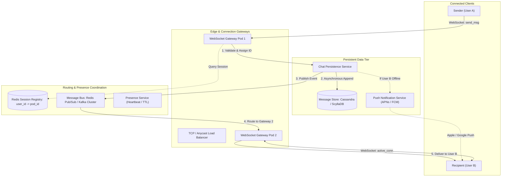

# Design a Real-Time Chat System (WhatsApp / Discord / Slack)

## 1. TL;DR

A real-time chat platform facilitates instant, bidirectional text, media, and status exchanges across 1-on-1 conversations and large group channels.
At modern enterprise scale (e.g., WhatsApp or Discord), the system sustains over 500 million Daily Active Users (DAU) transmitting upwards of 50 billion messages daily, peaking at over 1.15 million messages per second.
The core architectural requirement is ultra-low message delivery latency (< 100ms globally) coupled with high availability, strict message ordering within a conversation, durable offline persistence, read/delivery receipts, and scalable user presence tracking.
The state-of-the-art architecture separates stateless HTTP services (authentication, profile management) from stateful WebSocket connection gateways.
Inter-gateway routing is coordinated via a low-latency pub/sub message bus (Redis Pub/Sub or Apache Kafka), backed by wide-column distributed storage (Apache Cassandra or ScyllaDB) optimized for append-only, time-series sequential reads.

---

## 2. Mental Model

The system decouples stateful client connection management from stateless business logic and persistent distributed storage.



---

## 3. Architectural Internals and Deep Dive

### 3.1 Network Protocols: Why WebSockets Wins

Real-time communication requires selecting the appropriate transport layer:
1. **HTTP Short Polling**: Client sends an HTTP request every 1-2 seconds.
Massively inefficient; 95%+ of requests return empty responses, saturating server CPU and bandwidth with TLS handshake and HTTP header overhead.
2. **HTTP Long Polling**: Client initiates a request; the server holds the connection open until a new message arrives or a timeout occurs.
While reducing empty responses, connection re-establishment on every message still incurs latency and state teardown costs.
3. **Server-Sent Events (SSE)**: Efficient, unidirectional HTTP streaming from server to client.
However, client-to-server messaging still requires separate outbound HTTP POST requests, creating connection management duality.
4. **WebSockets (Selected Standard)**: Full-duplex, bidirectional persistent TCP connection initiated via an initial HTTP/1.1 or HTTP/2 handshake (`Upgrade: websocket`).
After the handshake, messages exchange as lightweight binary or UTF-8 frames with minimal 2 to 10-byte framing overhead.
Provides the lowest roundtrip latency and minimal server resource consumption.

### 3.2 Stateful Gateway Management and Session Registry

Unlike stateless web applications where any server can handle any request, WebSocket servers maintain open, persistent socket descriptors in the operating system kernel:
- **Connection Capacity**: Using Linux `epoll` and optimized socket buffers (`tcp_rmem`, `tcp_wmem`), a single 16-core, 32GB RAM gateway node can comfortably maintain 100,000 to 200,000 concurrent idle WebSocket connections.
- **Session Registry**: A centralized in-memory datastore (Redis Cluster) tracks which gateway instance hosts which user:
  - Redis Key: `session:<user_id>` -> Value: `{"gateway_id": "ws-node-42", "connected_at": 1775521000}`
  - TTL: 60 seconds (periodically refreshed by gateway heartbeat pings).
- **Inter-Gateway Routing Flow**:
  1. User A (connected to `ws-node-12`) sends a message destined for User B.
  2. `ws-node-12` checks the session registry for `session:UserB`.
  3. Registry reports User B is active on `ws-node-42`.
  4. `ws-node-12` publishes the message payload to the internal message channel `channel:ws-node-42`.
  5. `ws-node-42` receives the frame via local subscription, identifies User B's socket descriptor, and pushes the frame immediately.

### 3.3 Message Storage Model: Why Wide-Column Distributed Stores?

Chat platforms exhibit distinct storage access patterns:
- Ingestion is 99% append-only writes.
- Updates are rare (message edits or reaction additions).
- Reads are sequentially clustered by conversation: fetching the most recent $N$ messages of a specific chat channel or pagination backwards in time.
- Random reads across arbitrary historical messages are rare.

Relational databases (MySQL/PostgreSQL) suffer performance degradation at petabyte scale due to index re-balancing, locking, and expensive sharding logic.
**Apache Cassandra / ScyllaDB** provides the optimal write-optimized Log-Structured Merge (LSM) tree architecture:

```sql
-- Cassandra Table Schema
CREATE KEYSPACE chat_system WITH replication = {
    'class': 'NetworkTopologyStrategy', 
    'us-east': 3, 
    'eu-west': 3
};

CREATE TABLE chat_system.messages (
    channel_id UUID,
    message_id BIGINT, -- Time-sortable Snowflake ID
    sender_id UUID,
    content TEXT,
    media_url TEXT,
    created_at TIMESTAMP,
    PRIMARY KEY ((channel_id), message_id)
) WITH CLUSTERING ORDER BY (message_id DESC);
```

- **Partition Key**: `channel_id` (1-on-1 private conversation ID or group channel ID).
All messages belonging to a given conversation reside on the same cluster nodes and disk blocks.
- **Clustering Key**: `message_id` (64-bit time-sortable Snowflake ID).
Guarantees strict chronological ordering on disk and enables lightning-fast range queries:
`SELECT * FROM messages WHERE channel_id = ? AND message_id < ? LIMIT 50;`

### 3.4 Message Ordering and Distributed ID Generation

Relying on client-side timestamps causes ordering chaos due to clock skew, unsynchronized mobile devices, and malicious client manipulation.
Relying on centralized database auto-incrementing IDs creates a severe write bottleneck.
The platform uses **Twitter Snowflake IDs** (or ULIDs):
- 41 bits: Millisecond timestamp from custom epoch (covers ~69 years).
- 10 bits: Machine / Worker ID (supports up to 1,024 gateway nodes).
- 12 bits: Sequence counter (supports up to 4,096 unique IDs per millisecond per node).
Because the timestamp resides in the most significant bits, sorting by `message_id` inherently sorts by time, guaranteeing consistent message ordering across distributed nodes.

### 3.5 Group Chat Architecture: Fan-Out on Write vs. Fan-Out on Read

Group message distribution depends heavily on group size:

#### Small to Medium Groups (< 500 Members, e.g., WhatsApp / Telegram)
- **Fan-Out on Write**: When a member sends a message, the server creates a message pointer or notification for every individual member's inbox queue.
- **Trade-off**: Write amplification is linear ($O(K)$ writes for $K$ members), but read latency for members is instantaneous ($O(1)$ read from local inbox).

#### Massive Channels (> 1,000 Members up to 100,000 Members, e.g., Discord / Slack)
- **Fan-Out on Read**: The server appends the message exactly once to the channel's single shared message log (`channel_id`).
- When members open or view the channel, their clients fetch directly from the shared channel log.
- For active real-time updates, the gateway publishes the message to a channel-specific pub/sub topic (`channel:<channel_id>`).
Only gateways hosting currently active viewers of that channel subscribe to the topic, completely preventing write amplification for idle members.

```
+---------------------------------------------------------------+
|         Small Group (Fan-Out Write) vs Massive (Fan-Out Read)  |
+---------------------------------------------------------------+
| Small Group (5 Users):                                        |
| Msg -> [Inbox 1] [Inbox 2] [Inbox 3] [Inbox 4] [Inbox 5]      |
|                                                               |
| Massive Channel (50,000 Users):                               |
| Msg -> [Channel Shared Log] (1 Write)                         |
|    |--> Pub/Sub Topic -> Only pushes to active online viewers |
+---------------------------------------------------------------+
```

### 3.6 Presence and Heartbeat Architecture

Tracking online status across hundreds of millions of users without saturating network bandwidth:
1. **Heartbeat Protocol**: Active WebSocket clients transmit a lightweight ping every 5 seconds.
2. The gateway records the heartbeat in Redis using an ephemeral key with an 15-second TTL:
   `SET presence:<user_id> "online" EX 15`
3. If the user disconnects abruptly or loses cellular connectivity, the Redis key automatically expires within 15 seconds, transitioning the status to offline.
4. **Presence Fan-Out**: When a user goes online or offline, broadcasting their status to thousands of friends can crash the system.
Instead of broadcast push, status is evaluated on-demand: when User A opens their chat list, their client queries the presence of only the 20 visible friends currently displayed on screen via a batch `MGET` against Redis.

---

## 4. Trade-offs and Comparisons

| Dimension | HTTP Long Polling | Server-Sent Events (SSE) | WebSockets | gRPC Streaming |
|---|---|---|---|---|
| Communication Direction | Half-Duplex (simulated) | Unidirectional (Server -> Client) | Full-Duplex (Bidirectional) | Full-Duplex (Bidirectional) |
| Protocol Overhead | High (full HTTP headers on each poll) | Moderate (HTTP streaming chunk headers) | Ultra-low (2-10 byte frame headers) | Low (HTTP/2 framing + Protobuf binary) |
| Mobile Battery Impact | Severe (frequent radio wakeups) | Moderate | Minimal (single socket keepalive) | Minimal |
| Browser Compatibility | 100% | High (no IE) | High (98%+) | Requires gRPC-Web bridge for browsers |
| Best For | Legacy fallback | Stock tickers, news feeds | Interactive chat, gaming | Service-to-service internal RPC |

---

## 5. Failure Modes and Mitigations

### 5.1 Gateway Node Crash and Thundering Herd
- **Failure Mode**: A gateway node hosting 150,000 active WebSocket connections crashes.
150,000 mobile clients immediately attempt to reconnect simultaneously to remaining gateway nodes, creating a massive reconnection thundering herd that knocks down the remaining nodes in a cascading failure.
- **Mitigation**: Implement randomized client-side exponential backoff with full jitter:
$$T_{\text{sleep}} = \text{random}(0, \min(M, B \times 2^{\text{attempt}}))$$
Deploy ingress rate limiting at the load balancer to meter new TLS handshakes, prioritizing active reconnecting sessions over idle connections.

### 5.2 Network Partitions and Split-Brain in Group Chats
- **Failure Mode**: A regional network split isolates datacenter US-East from EU-West.
Users in different regions continue posting to the same group chat, risking divergent message sequences.
- **Mitigation**: Cassandra uses tunable consistency.
For message writes, require quorum write (`LOCAL_QUORUM`) within the primary datacenter, allowing immediate local progress.
Messages are assigned global Snowflake IDs; when the inter-region WAN heals, Cassandra's read repair and background anti-entropy nodetool repairs reconcile the log deterministically using the monotonically ordered Snowflake IDs.

### 5.3 Offline Message Queue Overflow
- **Failure Mode**: A user remains offline for 6 months.
Accumulating billions of offline notifications for dormant accounts exhausts storage and causes long query latencies on user login.
- **Mitigation**: Set hard limits on offline push queues (e.g., maximum 100 most recent unread messages retained in fast cache).
Historical backlog is retained in cold Cassandra partitions and paginated on-demand when the user scrolls back.

---

## 6. Hands-On Verification

The following standalone Python script implements a complete multi-gateway routing simulator with session registration, pub/sub message dispatching, and time-ordered message pagination.

```python
#!/usr/bin/env python3
"""
Production-grade demonstration of Real-Time Chat Architecture:
- Multi-Gateway session tracking
- Inter-gateway message routing via simulated Pub/Sub
- Time-sortable ID generation (Snowflake simulation)
- Cassandra-style partitioned message storage with pagination
"""

import time
import threading
from typing import Dict, List, Optional


class SnowflakeIDGenerator:
    """Simulates a 64-bit time-sortable ID generator."""
    def __init__(self, worker_id: int):
        self.worker_id = worker_id
        self.sequence = 0
        self.last_ts = -1
        self._lock = threading.Lock()

    def generate_id(self) -> int:
        with self._lock:
            ts = int(time.time() * 1000)
            if ts == self.last_ts:
                self.sequence = (self.sequence + 1) & 0xFFF
                if self.sequence == 0:
                    time.sleep(0.001)
                    ts = int(time.time() * 1000)
            else:
                self.sequence = 0
            self.last_ts = ts
            # (Timestamp << 22) | (WorkerID << 12) | Sequence
            return (ts << 22) | (self.worker_id << 12) | self.sequence


class ChatMessage:
    def __init__(self, msg_id: int, channel_id: str, sender_id: str, content: str):
        self.msg_id = msg_id
        self.channel_id = channel_id
        self.sender_id = sender_id
        self.content = content
        self.created_at = time.time()


class MessageStore:
    """Simulates Apache Cassandra wide-column partitioned storage."""
    def __init__(self):
        # channel_id -> list of ChatMessage ordered by msg_id DESC
        self._partitions: Dict[str, List[ChatMessage]] = {}
        self._lock = threading.Lock()

    def append_message(self, msg: ChatMessage):
        with self._lock:
            if msg.channel_id not in self._partitions:
                self._partitions[msg.channel_id] = []
            # Insert at beginning for DESC order
            self._partitions[msg.channel_id].insert(0, msg)

    def fetch_history(self, channel_id: str, limit: int = 20, max_id: Optional[int] = None) -> List[ChatMessage]:
        with self._lock:
            if channel_id not in self._partitions:
                return []
            msgs = self._partitions[channel_id]
            if max_id:
                msgs = [m for m in msgs if m.msg_id < max_id]
            return msgs[:limit]


class MockWebSocketGateway:
    def __init__(self, gateway_id: str, router: "MessageRouter"):
        self.gateway_id = gateway_id
        self.router = router
        self.active_sockets: Dict[str, List[str]] = {}  # user_id -> received_messages
        router.register_gateway(self)

    def connect_user(self, user_id: str):
        self.active_sockets[user_id] = []
        self.router.session_registry[user_id] = self.gateway_id

    def disconnect_user(self, user_id: str):
        if user_id in self.active_sockets:
            del self.active_sockets[user_id]
        if self.router.session_registry.get(user_id) == self.gateway_id:
            del self.router.session_registry[user_id]

    def deliver_frame(self, user_id: str, payload: str):
        if user_id in self.active_sockets:
            self.active_sockets[user_id].append(payload)
            print(f"[{self.gateway_id}] Pushed to user {user_id}: {payload}")


class MessageRouter:
    def __init__(self, store: MessageStore, id_gen: SnowflakeIDGenerator):
        self.store = store
        self.id_gen = id_gen
        self.gateways: Dict[str, MockWebSocketGateway] = {}
        self.session_registry: Dict[str, str] = {}  # user_id -> gateway_id

    def register_gateway(self, gw: MockWebSocketGateway):
        self.gateways[gw.gateway_id] = gw

    def send_message(self, sender_id: str, recipient_id: str, channel_id: str, content: str):
        msg_id = self.id_gen.generate_id()
        msg = ChatMessage(msg_id, channel_id, sender_id, content)
        
        # 1. Persist to storage
        self.store.append_message(msg)

        # 2. Check session registry
        target_gw_id = self.session_registry.get(recipient_id)
        if target_gw_id and target_gw_id in self.gateways:
            # Deliver via active gateway
            payload = f"[MsgID:{msg_id}] {sender_id}: {content}"
            self.gateways[target_gw_id].deliver_frame(recipient_id, payload)
        else:
            print(f"[Router] User {recipient_id} offline. Queued for APNs/FCM Push.")


if __name__ == "__main__":
    store = MessageStore()
    id_gen = SnowflakeIDGenerator(worker_id=1)
    router = MessageRouter(store, id_gen)

    gw_east = MockWebSocketGateway("gw-us-east-1", router)
    gw_west = MockWebSocketGateway("gw-us-west-1", router)

    # User A connects to US-East, User B connects to US-West
    gw_east.connect_user("alice")
    gw_west.connect_user("bob")

    print("--- 1. Testing Cross-Gateway Message Delivery ---")
    router.send_message("alice", "bob", "channel_alice_bob", "Hello Bob across regions!")
    assert len(gw_west.active_sockets["bob"]) == 1

    print("\n--- 2. Testing Offline Message Handling ---")
    router.send_message("alice", "charlie", "channel_alice_charlie", "Hey Charlie are you there?")

    print("\n--- 3. Testing Time-Ordered Pagination ---")
    for i in range(5):
        router.send_message("alice", "bob", "channel_alice_bob", f"Chat stream packet {i}")

    # Fetch top 3 latest messages
    page1 = store.fetch_history("channel_alice_bob", limit=3)
    print("Page 1 (Top 3 Latest):")
    for m in page1:
        print(f"  ID: {m.msg_id} | Content: {m.content}")

    # Fetch next page using cursor (pagination by max_id)
    oldest_id_on_page = page1[-1].msg_id
    page2 = store.fetch_history("channel_alice_bob", limit=3, max_id=oldest_id_on_page)
    print(f"\nPage 2 (Paginated before ID {oldest_id_on_page}):")
    for m in page2:
        print(f"  ID: {m.msg_id} | Content: {m.content}")
```

### CLI Verification

Test WebSocket connectivity and health checks across environments:

```bash
# Linux / macOS: Connect to WebSocket Gateway using wscat
wscat -c wss://chat.example.com/ws/v1?token=bearer_user_token

# Linux / macOS: Query message history pagination via curl
curl -X GET "https://api.example.com/v1/channels/ch_9988/messages?limit=50&before=1775529000123" \
  -H "Authorization: Bearer test_token"

# Windows PowerShell: Inspect WebSocket service health
Invoke-RestMethod -Uri "https://chat.example.com/health" -Method Get
```

---

## 7. Performance Characteristics and Capacity Planning

### 7.1 Traffic and Connection Math
- **User Base**: 500 million Daily Active Users (DAU).
- **Concurrency**: Assume 10% concurrent users during peak hours = $50,000,000$ concurrent WebSocket connections.
- **Gateway Capacity**:
  - Each Linux gateway node sustains 100,000 open connections.
  - Required gateway fleet = $\frac{50,000,000}{100,000} = 500 \text{ gateway instances}$.
  - With $N+2$ redundancy for failover: ~650 instances globally.
- **Message Throughput**:
  - 50 billion messages per day.
  - Average QPS = $\frac{50,000,000,000}{86,400} \approx 578,700 \text{ messages/sec}$.
  - Peak QPS ($2\times$ peak factor) $\approx 1,157,400 \text{ messages/sec}$.

### 7.2 Storage Calculations
- **Average Message Size**:
  - `channel_id`: 16 bytes (UUID)
  - `message_id`: 8 bytes (64-bit integer)
  - `sender_id`: 16 bytes (UUID)
  - `content`: 100 bytes (average text message)
  - `created_at`: 8 bytes
  - Internal indexing and replication metadata: ~50 bytes
  - Total per record $\approx 200 \text{ bytes}$.
- **Storage Velocity**:
  - Daily storage = $50,000,000,000 \times 200 \text{ bytes} = 10 \text{ TB/day}$.
  - Yearly raw storage = $10 \text{ TB} \times 365 = 3.65 \text{ PB/year}$.
  - With $3\times$ replication factor = $10.95 \text{ PB/year}$.
  - Media attachments (photos, videos, voice notes) are stored directly in Amazon S3 / Object Storage, with only the CDN URL metadata stored in Cassandra.

---

## 8. In Production: Real-World Architecture (Discord)

Discord handles billions of messages daily and scaled its storage engine through three iterations:
1. **Phase 1 (MongoDB)**: Reached limits rapidly due to memory constraints and data fragmentation across single replica sets.
2. **Phase 2 (Apache Cassandra)**: Migrated to a 177-node Cassandra cluster.
Handled petabytes of data, but experienced latency spikes caused by JVM garbage collection pauses (GC pauses up to 2 seconds) and expensive compaction sweeps.
3. **Phase 3 (ScyllaDB)**: Replaced Cassandra with ScyllaDB (a C++ rewrite of Cassandra).
Eliminated garbage collection entirely, achieving consistent sub-15ms $p99$ latencies on 4 billion daily message reads and reduced cluster size by 70%.

---

## 9. Interview Questions and Deep Dives

> [!question] Question 1: Why are WebSockets preferred over HTTP Long Polling for real-time chat?
> [!success]- Answer
> WebSockets provide a true full-duplex, persistent connection over a single TCP socket.
> After the initial HTTP handshake upgrade, data exchanges in compact binary or UTF-8 frames with only 2 to 10 bytes of framing overhead.
> HTTP Long Polling requires terminating and re-establishing an HTTP connection on every single message, incurring repeated TLS negotiation, HTTP header serialization (500+ bytes per request), and high server context-switching overhead.

> [!question] Question 2: How does a WebSocket gateway route an incoming message to a recipient connected to a different gateway instance?
> [!success]- Answer
> Gateways use a centralized Session Registry (Redis Cluster) combined with an inter-node message bus (Redis Pub/Sub or Kafka).
> When Gateway 1 receives a message for User B, it queries Redis for `session:UserB`, which returns `Gateway 42`.
> Gateway 1 publishes the message payload to a Redis Pub/Sub topic dedicated to Gateway 42.
> Gateway 42, which subscribes to its own topic, receives the payload, looks up User B's active socket descriptor in its local memory table, and transmits the frame to User B.

> [!question] Question 3: Why is Cassandra/ScyllaDB better suited for chat messages than MySQL?
> [!success]- Answer
> Chat message workloads are 99% append-heavy sequential writes followed by sequential reads by conversation ID.
> Cassandra uses Log-Structured Merge (LSM) trees, appending writes sequentially to commit logs and in-memory Memtables, achieving orders-of-magnitude higher write throughput than relational databases that must update B+ tree disk structures.
> Furthermore, Cassandra partitions naturally by `channel_id` and clusters physically on disk by `message_id`, enabling single-seek retrieval of conversation history.

> [!question] Question 4: How do you guarantee message ordering when messages are generated concurrently across distributed mobile clients?
> [!success]- Answer
> Never rely on client device system clocks, which suffer from clock drift and time zone inconsistencies.
> Instead, generate 64-bit time-sortable Snowflake IDs at the gateway or persistence service upon message arrival.
> Because the most significant 41 bits encode millisecond timestamps, sorting by `message_id` inherently enforces chronological order.
> The database schema clusters by `message_id`, guaranteeing consistent order across all readers.

> [!question] Question 5: How does the system handle presence tracking for 500 million users without overwhelming infrastructure?
> [!success]- Answer
> 1. Use heartbeat pings with an active TTL: clients send a heartbeat every 5 seconds, writing to Redis with an expiration of 15 seconds (`SET presence:uid "online" EX 15`).
> 2. Avoid broadcast fan-out on presence changes.
> Instead of broadcasting a user's online transition to 1,000 contacts, status is evaluated on-demand when a user opens their chat list by executing an `MGET` against Redis for visible contacts only.

> [!question] Question 6: What is the difference between Fan-Out on Write and Fan-Out on Read in group messaging?
> [!success]- Answer
> - **Fan-Out on Write**: The sender's message is duplicated into the individual inbox of every group member at write time.
> Efficient for small groups (< 100 members) because member inbox reads are instantaneous.
> - **Fan-Out on Read**: The message is written exactly once to a single shared channel log.
> Members fetch from the shared log when viewing the channel.
> Essential for massive channels (10,000+ members, such as public Slack or Discord channels) to prevent write multiplication from crippling the database.

> [!question] Question 7: How do you implement reliable read receipts (Sent, Delivered, Read) without doubling write traffic?
> [!success]- Answer
> Treat read receipts as watermark pointers rather than individual per-message acknowledgments.
> Instead of emitting a read receipt for each of the 50 unread messages in a chat, the client sends a single event: `last_read_message_id = 1775529000456`.
> All messages with ID $\le \text{last\_read\_message\_id}$ are marked as read.
> Watermark updates are aggregated and flushed in background batches to Redis and Cassandra.

> [!question] Question 8: How do you prevent duplicate messages when a mobile client experiences intermittent connectivity and retries sends?
> [!success]- Answer
> The client generates a unique idempotency key (`client_message_id` or UUIDv4) for each outbound message and caches it locally before transmitting.
> When the gateway receives a message, it checks a deduplication filter (Redis or Cassandra unique constraint on `(channel_id, client_message_id)`).
> If the ID already exists, the server acknowledges the existing message without re-appending to the conversation log.

> [!question] Question 9: What happens when a gateway node holding 100,000 connections crashes, and how do you protect the fleet from cascading failure?
> [!success]- Answer
> A sudden disconnect forces 100,000 clients to reconnect simultaneously.
> To prevent cascading collapse of the remaining gateways:
> 1. Clients apply exponential backoff with full jitter before attempting reconnection.
> 2. The load balancer enforces connection rate limiting, accepting new TLS sessions in controlled batches.
> 3. The session registry automatically clears stale gateway entries via heartbeat TTL expiration.

> [!question] Question 10: How do you design end-to-end encryption (E2EE) in this chat architecture?
> [!success]- Answer
> Using the Signal Protocol (Double Ratchet Algorithm):
> 1. Clients generate long-term identity keys, signed pre-keys, and a pool of one-time pre-keys uploaded to a central Key Distribution Center (KDC).
> 2. When User A initiates a chat with User B, User A fetches User B's public keys from the KDC and computes a shared secret locally using Elliptic Curve Diffie-Hellman (ECDH).
> 3. Message payloads are encrypted on the client device before transmission; gateways and Cassandra store only opaque ciphertexts.
> The server cannot inspect or decrypt message contents.

---

## 10. Related Concepts and Wikilinks

- [[Apache-Cassandra]]: Wide-column distributed storage, LSM compaction, and clustering key sorting.
- [[Redis-Architecture]]: In-memory session tracking, presence TTLs, and pub/sub routing.
- [[Pub-Sub-Architecture]]: Decoupled message distribution patterns across distributed systems.
- [[Load-Balancing]]: Layer 4 TCP connection balancing and sticky session management.
- [[Synchronous-vs-Asynchronous-Communication]]: Decoupled delivery pipelines and offline notification queues.

---

## 11. Further Reading

- Xu, Alex. *System Design Interview – An Insider’s Guide (Volume 1)*. Chapter 12: Design a Chat System.
- Discord Engineering. *How Discord Stores Billions of Messages*. Discord Technical Blog.
- ScyllaDB Case Studies: *Migrating from Apache Cassandra to ScyllaDB for Real-Time Messaging*.
- Signal Protocol Documentation: *The Double Ratchet Algorithm (Marlinspike & Perrin)*.
