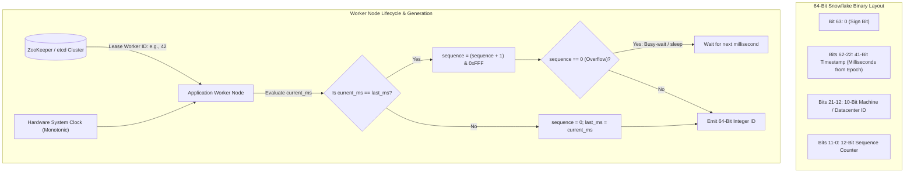

# Design a Distributed Unique ID Generator (Twitter Snowflake)

## 1. TL;DR

Modern distributed systems require unique, time-sortable 64-bit integer identifiers generated concurrently across thousands of nodes without centralized database bottlenecks.
Standard alternatives such as 128-bit UUIDv4 suffer from severe drawbacks: random distribution ruins B+ tree index spatial locality (causing rampant page splits and disk I/O thrashing), and their large footprint wastes memory and storage.
Conversely, database auto-increment ticket servers introduce single points of failure and cross-datacenter latency bottlenecks.
The industry standard solution, pioneered by Twitter Snowflake, encodes 64-bit integers partitioned into four distinct bit fields: a 1-bit sign, 41 bits of millisecond timestamp (covering ~69.7 years from a custom epoch), 10 bits of node identifier (supporting 1,024 independent worker nodes), and 12 bits of local sequence counter (permitting 4,096 IDs per millisecond per node).
This architecture allows an individual worker to generate up to 4,096,000 unique IDs per second purely in local memory with zero inter-node network communication during the hot generation path.

---

## 2. Mental Model

A Snowflake generator operates entirely within local worker memory, requiring distributed coordination (via Apache ZooKeeper or etcd) only during startup for machine ID leasing.



---

## 3. Architectural Internals and Deep Dive

### 3.1 ID Generation Alternatives: Why Snowflake Dominates

| Strategy | Size | Time-Sortable? | Generation Latency | Scalability Bottleneck | Major Failure Mode |
|---|---|---|---|---|---|
| **Multi-Master DB Auto-Increment** | 64-bit | No (gaps & skew) | Moderate (DB roundtrip) | Fixed $k$ master step limits horizontal scaling | Hard to scale past cluster size $k$ |
| **UUIDv4 (Random)** | 128-bit | No (purely random) | Instant ($O(1)$ local) | None | Destroys B+ tree index locality; high write I/O |
| **UUIDv7 (Time-Ordered)** | 128-bit | Yes | Instant ($O(1)$ local) | None | 128 bits double index memory footprint |
| **Ticket Server (Flickr)** | 64-bit | Yes | High (network RPC) | Centralized DB throughput ceiling | Single Point of Failure (SPOF) |
| **Twitter Snowflake** | 64-bit | Yes (Millisecond) | Ultra-low ($< 1\mu s$ local memory) | Zero (independent workers) | Clock skew / NTP backward steps |

### 3.2 Anatomy of the 64-Bit Snowflake Layout

The 64 bits of a Snowflake ID are allocated across four functional segments:

```
+---------------------------------------------------------------------------------+
| 1 bit  | 41 bits (Timestamp)       | 10 bits (Machine ID)  | 12 bits (Sequence) |
| Unused | Milliseconds from custom  | 5 bits Datacenter     | 0 to 4095 counter  |
| Sign=0 | epoch (e.g., 2026-01-01)  | 5 bits Worker Node    | per millisecond    |
+---------------------------------------------------------------------------------+
```

1. **Sign Bit (1 bit)**: Always set to `0` to ensure the generated integer remains positive across signed 64-bit language primitives (Java `long`, C++ `int64_t`).
2. **Timestamp (41 bits)**:
   - $2^{41} = 2,199,023,255,552 \text{ milliseconds} \approx 69.73 \text{ years}$.
   - Measured relative to a custom project epoch (e.g., `1767225600000` for January 1, 2026), extending the operational lifespan through the year 2095.
3. **Machine / Datacenter Identifier (10 bits)**:
   - Supports $2^{10} = 1,024$ distinct worker instances.
   - Often partitioned into 5 bits Datacenter ID ($2^5 = 32$ datacenters) and 5 bits Worker ID ($2^5 = 32$ servers per datacenter).
4. **Sequence Number (12 bits)**:
   - $2^{12} = 4,096$ values (0 to 4,095).
   - Increments monotonically for each ID generated within the same millisecond on the same node.
   - Resets to 0 whenever the millisecond advances.

### 3.3 The Clock Skew Problem and NTP Drift

Because Snowflake places timestamp bits in the most significant positions, hardware clock accuracy is paramount.
In distributed computing, server clocks periodically synchronize using the Network Time Protocol (NTP).
If an NTP synchronization abruptly adjusts the system time backwards (a backward clock step), the generator will re-enter a millisecond range it has already processed, generating **duplicate IDs**.

#### Clock Drift Mitigations:
1. **NTP Slewing vs. Stepping**:
   - Configure server daemons (such as `chrony` or `ntpd`) with strict slewing mode (`-x`).
   - Slewing gradually accelerates or slows down the clock tick rate by up to 0.5 milliseconds per second rather than executing sudden discrete backwards steps.
2. **Monotonic Verification inside Generator**:
   - The generator caches `last_timestamp`.
   - If `current_timestamp < last_timestamp`:
     - **Small Skew ($\le 5\text{ms}$)**: The thread executes a busy-wait spin or sleeps until `current_timestamp >= last_timestamp`.
     - **Large Skew ($> 5\text{ms}$)**: The generator immediately throws a critical runtime exception, trips an alert, and refuses to issue IDs to prevent data corruption.
3. **Leap Second Handling**:
   - Leap seconds that insert a duplicate second are absorbed seamlessly by cloud time sync providers (Amazon Time Sync Service, Google TrueTime) through leap second smearing over a 24-hour window.

### 3.4 Worker ID Allocation and Lease Management

Manually hardcoding worker IDs (`0` through `1023`) in configuration files is prone to human error and container deployment collisions.
Production systems automate worker ID assignment using a coordination service:
1. **ZooKeeper / etcd Ephemeral Leases**:
   - When a microservice container boots, it connects to ZooKeeper and creates an ephemeral sequential znode under `/snowflake/nodes`.
   - The returned sequence modulo 1,024 becomes the worker's unique `worker_id`.
   - When the container terminates, ZooKeeper drops the ephemeral node, making that worker ID eligible for reuse after a safety grace period.
2. **Kubernetes StatefulSets**:
   - StatefulSets provide deterministic, ordinal pod indices (`pod-0`, `pod-1`, ... `pod-N`).
   - The application parses the ordinal suffix at startup to derive its `worker_id` with zero external dependencies.

---

## 4. Trade-offs and Comparisons

| Dimension | UUIDv4 | UUIDv7 | Flickr Ticket Server | Snowflake ID |
|---|---|---|---|---|
| Bit Length | 128 bits | 128 bits | 64 bits | 64 bits |
| B+ Tree Clustered Index Impact | Severe random fragmentation | Low fragmentation | Zero fragmentation | Zero fragmentation |
| Coordination Overhead | Zero | Zero | High (central DB network hop) | Minimal (startup lease only) |
| Max Throughput / Node | High (~10M/sec) | High (~5M/sec) | Low (~10,000/sec DB bound) | Ultra-high (4.096M/sec) |
| Information Leakage | Zero | Exposes timestamp | Exposes total counts | Exposes timestamp + node ID |
| JavaScript Precision Safe? | No (string only) | No (string only) | Yes (up to $2^{53}-1$) | Requires string formatting ($> 2^{53}$) |

---

## 5. Failure Modes and Mitigations

### 5.1 Sequence Counter Exhaustion Within 1 Millisecond
- **Failure Mode**: A burst of traffic requests more than 4,096 IDs within a single millisecond on a single worker node.
- **Mitigation**: When `sequence` exceeds 4,095, the sequence counter wraps to 0.
The generator detects the rollover, enters a tight spin-wait loop, and halts thread progress until the system clock advances to the next millisecond (`current_timestamp > last_timestamp`).

### 5.2 Network Partition from Coordination Cluster
- **Failure Mode**: Network isolation prevents a running worker from renewing its ZooKeeper lease.
- **Mitigation**: Once a worker successfully acquires a `worker_id` at boot, it retains that ID as long as it remains running.
If the container restarts while disconnected from ZooKeeper, it refuses to start and fails its health check rather than risking an ID collision.

### 5.3 JavaScript 53-Bit Integer Truncation Hazard
- **Failure Mode**: JavaScript `Number` represents IEEE-754 double-precision floats, which only maintain exact integer precision up to $2^{53} - 1 = 9,007,199,254,740,991$.
A 64-bit integer exceeding 53 bits gets rounded in client-side JavaScript, corrupting ID values.
- **Mitigation**: API gateways serialize 64-bit Snowflake IDs as **strings** in JSON responses (`"id": "177552912345678912"`) rather than raw numbers.

---

## 6. Hands-On Verification

The following standalone Python implementation demonstrates a production-grade Snowflake ID generator with monotonic clock verification, thread synchronization, and sequence overflow protection.

```python
#!/usr/bin/env python3
"""
Production-grade demonstration of Twitter Snowflake ID Generator:
- 41-bit timestamp from custom epoch
- 10-bit worker ID
- 12-bit sequence counter
- Monotonic clock drift defense and sequence rollover wait
"""

import time
import threading
from typing import Set

# Custom Epoch: 2026-01-01 00:00:00 UTC in milliseconds
CUSTOM_EPOCH = 1767225600000

WORKER_ID_BITS = 10
SEQUENCE_BITS = 12

MAX_WORKER_ID = (1 << WORKER_ID_BITS) - 1  # 1023
MAX_SEQUENCE = (1 << SEQUENCE_BITS) - 1    # 4095

WORKER_ID_SHIFT = SEQUENCE_BITS             # 12
TIMESTAMP_SHIFT = SEQUENCE_BITS + WORKER_ID_BITS  # 22


class SnowflakeGenerator:
    def __init__(self, worker_id: int):
        if not (0 <= worker_id <= MAX_WORKER_ID):
            raise ValueError(f"worker_id must be between 0 and {MAX_WORKER_ID}")
        
        self.worker_id = worker_id
        self.sequence = 0
        self.last_timestamp = -1
        self._lock = threading.Lock()

    def _get_current_ms(self) -> int:
        return int(time.time() * 1000)

    def _wait_next_millis(self, last_ts: int) -> int:
        ts = self._get_current_ms()
        while ts <= last_ts:
            time.sleep(0.0001)  # 100 microsecond sleep
            ts = self._get_current_ms()
        return ts

    def next_id(self) -> int:
        with self._lock:
            ts = self._get_current_ms()

            # Clock moved backwards defense
            if ts < self.last_timestamp:
                drift_ms = self.last_timestamp - ts
                if drift_ms <= 5:
                    # Small drift: spin wait
                    ts = self._wait_next_millis(self.last_timestamp)
                else:
                    raise RuntimeError(f"Clock moved backwards by {drift_ms}ms! Generation aborted.")

            if ts == self.last_timestamp:
                self.sequence = (self.sequence + 1) & MAX_SEQUENCE
                if self.sequence == 0:
                    # Sequence exhausted for this millisecond: wait for next
                    ts = self._wait_next_millis(self.last_timestamp)
            else:
                self.sequence = 0

            self.last_timestamp = ts

            # Bitwise assembly of the 64-bit integer
            id_value = (
                ((ts - CUSTOM_EPOCH) << TIMESTAMP_SHIFT) |
                (self.worker_id << WORKER_ID_SHIFT) |
                self.sequence
            )
            return id_value


if __name__ == "__main__":
    generator = SnowflakeGenerator(worker_id=42)

    print("--- 1. Generating Sample Snowflake IDs ---")
    sample_ids = [generator.next_id() for _ in range(5)]
    for sid in sample_ids:
        # Deconstruct bits
        extracted_seq = sid & MAX_SEQUENCE
        extracted_worker = (sid >> WORKER_ID_SHIFT) & MAX_WORKER_ID
        extracted_ts = (sid >> TIMESTAMP_SHIFT) + CUSTOM_EPOCH
        print(f"ID: {sid} | Worker: {extracted_worker} | Seq: {extracted_seq} | Time: {time.ctime(extracted_ts/1000)}")

    print("\n--- 2. High-Concurrency Stress Test (100,000 Unique IDs across 4 Threads) ---")
    generated_set: Set[int] = set()
    set_lock = threading.Lock()

    def worker_task(count: int):
        local_ids = []
        for _ in range(count):
            local_ids.append(generator.next_id())
        with set_lock:
            generated_set.update(local_ids)

    threads = []
    start_time = time.time()
    for _ in range(4):
        t = threading.Thread(target=worker_task, args=(25000,))
        threads.append(t)
        t.start()

    for t in threads:
        t.join()

    duration = time.time() - start_time
    print(f"Generated {len(generated_set)} unique IDs in {duration:.3f} seconds.")
    print(f"Throughput: {len(generated_set) / duration:,.0f} IDs/sec.")
    assert len(generated_set) == 100000, "Collision detected in Snowflake generation!"
    print("Verification Passed: Zero collisions detected!")
```

### CLI Verification

Inspect generated Snowflake IDs and bit allocations:

```bash
# Compile and run Java Snowflake generator
javac SnowflakeIdGenerator.java && java SnowflakeIdGenerator

# Deconstruct 64-bit integer via Python one-liner in bash
python3 -c "
sid = 177552912345678912
print('Worker ID:', (sid >> 12) & 0x3FF)
print('Sequence:', sid & 0xFFF)
print('Timestamp offset (ms):', sid >> 22)
"
```

---

## 7. Performance Characteristics and Capacity Planning

### 7.1 Throughput Limits
- Max generation capacity per worker node:
  $$4,096 \text{ sequence IDs} \times 1,000 \text{ milliseconds/sec} = 4,096,000 \text{ IDs/sec/node}$$
- Cluster capacity across 1,024 worker nodes:
  $$1,024 \times 4,096,000 \approx 4.19 \text{ billion IDs/sec}$$
- At enterprise scale (e.g., 500,000 writes/sec), a small cluster of 5 generator pods operates at less than 3% capacity.

### 7.2 Storage and Index Efficiency
- B+ tree index comparison:
  - 64-bit Integer: 8 bytes per index pointer.
  - 128-bit UUIDv4 string: 36 bytes (formatted) or 16 bytes (raw binary).
  - Storing 1 billion IDs in a database index:
    - Snowflake (8 bytes): $\approx 8 \text{ GB}$ index size (fits completely in memory buffer pool).
    - UUID string (36 bytes): $\approx 36 \text{ GB}$ index size (causes heavy disk swapping and cache evictions).

---

## 8. In Production: Real-World Architecture (Instagram & Discord)

1. **Instagram Sharded ID Generator (PostgreSQL)**:
   - Instagram adapted the Snowflake model directly inside PostgreSQL using stored procedures.
   - 64-bit ID layout: 41 bits timestamp, 13 bits logical shard ID (8,192 shards), and 10 bits auto-increment sequence modulo 1,024.
   - Allowed Instagram to generate primary keys directly inside database shards without an external application coordination layer.
2. **Discord Snowflake**:
   - Discord uses Snowflake IDs for all messages, channels, servers, and users.
   - Custom epoch set to the first second of 2015 (`1420070400000`).
   - Enables Discord's client and server applications to extract creation dates directly from message IDs without executing separate database lookups.

---

## 9. Interview Questions and Deep Dives

> [!question] Question 1: Why does a 64-bit Snowflake ID perform better in a database index than a 128-bit UUIDv4?
> [!success]- Answer
> 1. **Index Size**: A 64-bit integer consumes 8 bytes versus 16 bytes (binary UUID) or 36 bytes (string UUID), reducing index leaf page size and fitting more index nodes in RAM.
> 2. **B+ Tree Locality**: UUIDv4 is completely random, causing inserts to scatter across random index leaf pages, triggering continuous page splits and heavy random disk I/O.
> Snowflake IDs are monotonically increasing, appending sequentially to the rightmost leaf of the B+ tree, achieving near $100\%$ page fill factor and zero page splits.

> [!question] Question 2: What happens when the system clock moves backwards due to an NTP adjustment?
> [!success]- Answer
> If the clock steps backward, the generator risks producing timestamps it already issued, causing duplicate IDs.
> Production generators track `last_timestamp`.
> If `current_timestamp < last_timestamp`, the generator inspects the drift:
> If small ($\le 5\text{ms}$), it pauses execution until the clock catches up.
> If large ($> 5\text{ms}$), it fails fast with a runtime exception to prevent data corruption.
> To prevent stepping, production systems configure NTP with slewing mode (`chrony` or `ntpd -x`).

> [!question] Question 3: How does the generator handle more than 4,096 ID requests within a single millisecond?
> [!success]- Answer
> The 12-bit sequence counter supports values from 0 to 4,095.
> When the 4,097th request arrives in the same millisecond, the counter overflows back to 0.
> The generator detects this condition and enters a spin-wait loop, blocking the calling thread until the system clock advances to the next millisecond, at which point generation resumes with `sequence = 0`.

> [!question] Question 4: How are worker IDs assigned to containers dynamically without collisions in Kubernetes?
> [!success]- Answer
> Deploy the ID generator service as a **Kubernetes StatefulSet**.
> StatefulSets guarantee unique, stable ordinal indices (`id-gen-0`, `id-gen-1`, `id-gen-2`).
> The application inspects its hostname at container boot, parses the ordinal integer, and uses it as its `worker_id`.
> Alternatively, nodes can acquire a lease from ZooKeeper or etcd using ephemeral sequential znodes.

> [!question] Question 5: Why must Snowflake IDs be converted to strings when returned in JSON API responses to web browsers?
> [!success]- Answer
> Standard JavaScript numbers are 64-bit IEEE-754 floating-point values, which only maintain safe integer precision up to $2^{53} - 1$ (`Number.MAX_SAFE_INTEGER` = 9,007,199,254,740,991).
> A 64-bit Snowflake ID uses up to 63 bits (e.g., values $> 10^{18}$), meaning JavaScript will silently truncate and round the least significant bits, corrupting the ID.
> Serializing the ID as a string (`"id": "177552912345678912"`) ensures bit-exact preservation.

> [!question] Question 6: What is the operational lifespan of a 41-bit timestamp, and what happens when it expires?
> [!success]- Answer
> 41 bits provides $2^{41} = 2,199,023,255,552 \text{ milliseconds} \approx 69.73 \text{ years}$.
> With a custom epoch set to January 1, 2026, the 41-bit timestamp will not overflow until the year 2095.
> When exhaustion approaches, the system can migrate to a 42-bit timestamp (borrowing 1 bit from the worker ID or sequence field) or transition to 128-bit UUIDv7.

> [!question] Question 7: Can a client deduce business metrics by observing Snowflake IDs?
> [!success]- Answer
> Yes.
> Because the most significant 41 bits encode millisecond timestamps, anyone inspecting consecutive IDs can determine the exact creation time of a resource.
> Furthermore, by tracking the sequence field across consecutive IDs within the same millisecond, an attacker can estimate platform write velocity.
> If business confidentiality is required, randomize the sequence starting offset or encrypt the public ID using a Feistel cipher before exposing it to clients.

> [!question] Question 8: How does the Sonyflake variant differ from Twitter Snowflake?
> [!success]- Answer
> Sonyflake adjusts the bit allocation to prioritize operational lifespan and worker scale over extreme per-millisecond bursts:
> - Timestamp: 39 bits with a **10-millisecond** resolution (covers ~174 years).
> - Worker ID: 16 bits (supports up to 65,536 worker nodes).
> - Sequence: 8 bits (supports 256 IDs per 10ms = 25,600 IDs/sec/node).

> [!question] Question 9: Why is high lock contention a concern in multithreaded Snowflake generators, and how is it optimized?
> [!success]- Answer
> Multiple threads calling `next_id()` compete for the synchronization lock guarding `last_timestamp` and `sequence`.
> Under heavy thread contention, mutex locking causes CPU context-switching overhead.
> Optimization: Use lock-free Atomic CAS operations (`AtomicLong` packing timestamp and sequence into a single 64-bit variable) or allocate independent generator instances per CPU core without cross-thread lock sharing.

> [!question] Question 10: How does ULID (Universally Unique Lexicographically Sortable Identifier) compare to Snowflake?
> [!success]- Answer
> ULID is a 128-bit identifier consisting of a 48-bit timestamp (millisecond precision, covering 10,889 years) and 80 bits of cryptographic randomness.
> It requires zero worker ID coordination, encodes as a 26-character Base32 string, and maintains monotonic ordering within the same millisecond.
> However, its 128-bit footprint consumes twice the storage of a 64-bit Snowflake ID in database indexes.

---

## 10. Related Concepts and Wikilinks

- [[Concurrency-Synchronization-and-CAS]]: Lock-free atomic synchronization and memory barriers.
- [[Apache-ZooKeeper]]: Ephemeral sequential znodes for distributed worker ID coordination.
- [[Consistent-Hashing]]: Partitioning ID generator requests across stateless cluster nodes.
- [[MySQL-and-InnoDB]]: Clustered B+ tree index organization and sequential insert optimization.
- [[Consistency-Models]]: Monotonic clock guarantees across distributed systems.

---

## 11. Further Reading

- Twitter Engineering. *Announcing Snowflake*. Twitter Technical Blog.
- Instagram Engineering. *Sharding & IDs at Instagram*. Instagram Engineering Blog.
- Discord Engineering. *How Discord Uses Snowflake IDs*. Discord Documentation.
- IETF RFC 9562: *Universally Unique IDentifiers (UUID)* - UUIDv7 Specification.
