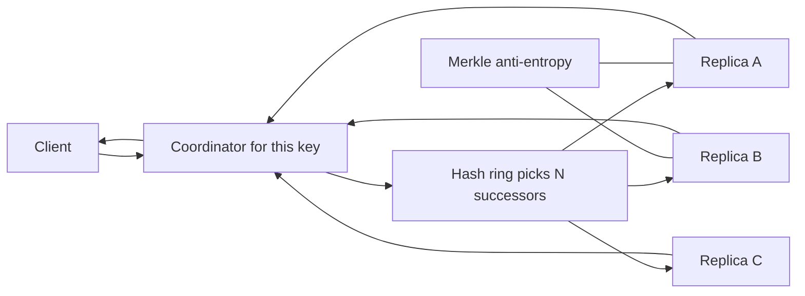

# Design a Distributed Key-Value Store

## 1. TL;DR

The store maps an opaque key to an opaque value and stays available when a minority of replicas are unreachable.
It partitions the keyspace with consistent hashing, replicates each key to N successors, and lets the client choose R and W.
The contract is eventual consistency with version reconciliation, not serializability.
If the product needs serializability, build [[CockroachDB-Distributed-SQL]], not Dynamo.

## 2. Mental Model



A put hashes the key, walks the ring in [[Consistent-Hashing]], and writes to the first N healthy nodes.
A get reads R of those nodes and returns the newest version the client can see, or all concurrent versions if they conflict.
Sloppy quorum may write to nodes that are not the preferred N, and hinted handoff repairs that later.
[[Replication-and-Quorums]] is the rule.
This note is the system around the rule.

## 3. Internals

The version is a vector clock, one slot per writer that has touched the key.
If two puts race, the get returns both siblings and the client supplies a merged value.
Last-write-wins is what you get when you refuse to build that client.
[[Time-Clocks-and-Ordering]] explains why a wall clock is a bad merge.
The coordinator is any node.
It is not a Raft leader.
There is no total order across keys, which is why a multi-key transaction does not belong here.

Anti-entropy walks Merkle trees of each key range.
Unequal trees mean a replica missed a put.
The transfer is the missing keys, not the whole dataset.
Read repair does the same job on the hot path when the R replies disagree.

## 4. Trade-offs

| Knob | What you gain | What you pay |
|---|---|---|
| W = N | A put is on every preferred replica | The put fails if one replica is down |
| W = 1 | The put almost always succeeds | A single disk can lose an acked put |
| Sloppy quorum | Availability during a partition | A strict reader can miss the put until handoff |
| Vector clocks | Conflicts are visible | Clients must merge, and clocks must be trimmed |

## 5. Failure modes

A replica that pauses and then returns will serve stale values until Merkle or read repair catches it.
A client that never resolves siblings stores both copies forever and grows the value without bound.
A hash ring with too few virtual nodes piles a range onto one machine.
Prefer many virtual nodes, and move them slowly.
Membership changes are gossiped.
Gossip is not consensus.
Do not use it to decide a leader for a payment.

## 6. Hands-on check

```python
def visible_to_quorum_read(n: int, r: int, w: int, sloppy: bool) -> bool:
    """Whether a preferred-replica read must overlap a preferred-replica write."""
    if sloppy:
        return False
    return r + w > n
```

`visible_to_quorum_read(3, 2, 2, sloppy=False)` is true.
The same numbers with `sloppy=True` are not a proof that the reader saw the write.

## 7. Capacity

At 100,000 puts per second, a 1 KB value, and N = 3, the cluster ingests about 300 MB/s of replica bytes before compaction or index overhead.
One coordinator that waits for W = 2 must have a timeout below the client timeout, or it holds sockets for dead peers.
The disk plan is an LSM, because the workload is blind puts.
[[LSM-Tree]] and [[Apache-Cassandra]] are the storage engine and the closest production cousin.

## 8. In production

Dynamo's paper is the blueprint: shopping-cart availability over consistency, with client-side merge.
Cassandra kept the ring and the quorums and replaced the client merge with timestamps in the common configuration.
Riak kept vector clocks longer.
When you cite any of them, say which conflict policy you mean.

## 9. Interview questions

1. Why does R + W > N fail to guarantee a fresh read under sloppy quorum.
2. What does the client do with two siblings.
3. Why is there no cross-key transaction in this design.
4. How do Merkle trees avoid copying every key during repair.

## 10. Related

- [[Replication-and-Quorums]]
- [[Consistent-Hashing]]
- [[Time-Clocks-and-Ordering]]
- [[Apache-Cassandra]]
- [[Consensus-and-Failure-Detection]]

## 11. Further reading

- Dynamo, SOSP 2007.
- Cassandra's documentation on consistency levels, read as a descendant with different defaults.
