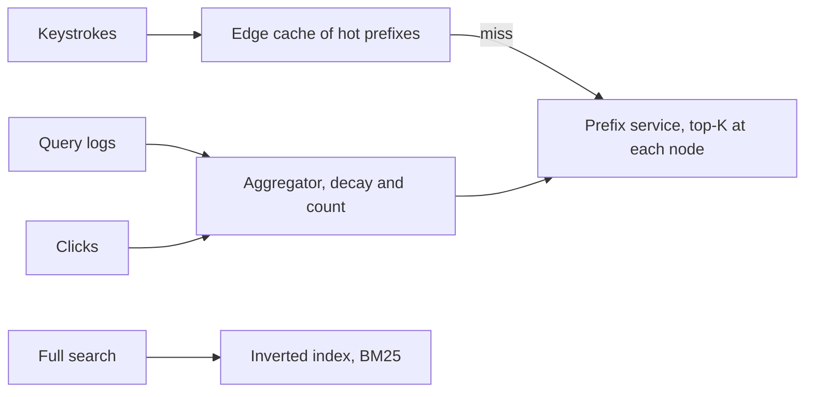

# Design Typeahead and Search Suggestions

## 1. TL;DR

Typeahead returns the top suggestions for a prefix in a few milliseconds while the user is still typing.
That path is a precomputed prefix structure, not a query against the inverted index.
The inverted index is a second system, for the full search results page, and it is allowed to be slower and fresher on a different SLO.

## 2. Mental Model



The trie node for `"sys"` stores the ten queries the product wants to show, already sorted.
It does not store every query that starts with those letters.
The aggregator writes those ten from counters of recent searches, with a decay so yesterday's spike does not own the box forever.
[[Probabilistic-Structures]] can hold the heavy hitters when the keyspace is too large for an exact map.

## 3. Internals

Partition the prefix service by the first two characters, or by a hash of the prefix if one language would otherwise melt `th` or `zh`.
A partition owns its slice of the trie in memory.
Replication of a hot partition is read replicas, because the write rate is the aggregator, not the users.
Users only read.

Ranking inside a node is a score, not a pure count.
A reasonable score is recent count, times a click-through weight, times a language match.
Personalization is a second stage on a short list, not a walk of the whole trie per user.
If you personalize by rewriting every node, you have built one trie per user and you will not fit it.

The full search path tokenizes, looks up postings, intersects them, and scores with BM25.
[[Elasticsearch-and-Apache-Solr]] and [[Indexing-and-Access-Paths]] are that path.
Do not put it on the keystroke. A keystroke budget is about 50 ms including the network.

## 4. Trade-offs

Updating the top-K on every search makes suggestions fresh and makes the trie a write hotspot.
Updating every minute makes the trie a read-only snapshot and makes suggestions lag.
Ship the snapshot.
The search page can be fresher than the suggestion box.
Users forgive a suggestion that is a minute old.
They do not forgive a dropped keystroke.

## 5. Failure modes

A celebrity query can make one prefix hotter than the partition plan assumed.
Cache that prefix at the edge, as in [[Caching-and-Invalidation]] and [[DNS-and-CDN]].
A trie built from raw logs will suggest offensive or private strings.
The aggregator needs a filter before the snapshot is published, and the filter is a product decision you should mention.
Rebuilding a trie from a corrupt snapshot should fall back to the previous snapshot, not to an empty box.

## 6. Hands-on check

```python
def top_k(counts: dict[str, int], k: int) -> list[str]:
    return sorted(counts, key=lambda q: (-counts[q], q))[:k]
```

Sort by descending count, then by the string, so ties are stable.
The production node stores this list, not `counts`.

## 7. Capacity

At 50,000 keystrokes per second, a 95 percent edge hit rate leaves 2,500 trie reads per second.
That is easy if the trie is in memory and the hot prefixes are cached.
The hard number is memory.
A million prefixes with ten suggestions of 64 bytes is under a gigabyte of payload.
The long tail of rare prefixes should not be materialized.
Materialize a prefix only after it crosses a count.

## 8. In production

Web search boxes separate suggest from retrieve.
The suggest fleet is closer to a cache of strings.
The retrieve fleet is an inverted index with its own ranking.
Mixing them into one "Elasticsearch cluster" on the whiteboard is the usual L4 answer, and it misses the latency split.

## 9. Interview questions

1. Why is the keystroke path not an inverted-index query.
2. How do you keep one prefix from melting one partition.
3. Where does personalization sit so you do not build a trie per user.
4. What do you serve while a new snapshot is publishing.

## 10. Related

- [[Indexing-and-Access-Paths]]
- [[Probabilistic-Structures]]
- [[Caching-and-Invalidation]]
- [[Elasticsearch-and-Apache-Solr]]
- [[07-Distributed-Web-Crawler/design|The crawler that fills a search index]]

## 11. Further reading

- Brin and Page, 1998, for the retrieve path these suggestions sit in front of.
- [[Capacity-Estimation]] for the keystroke math.
