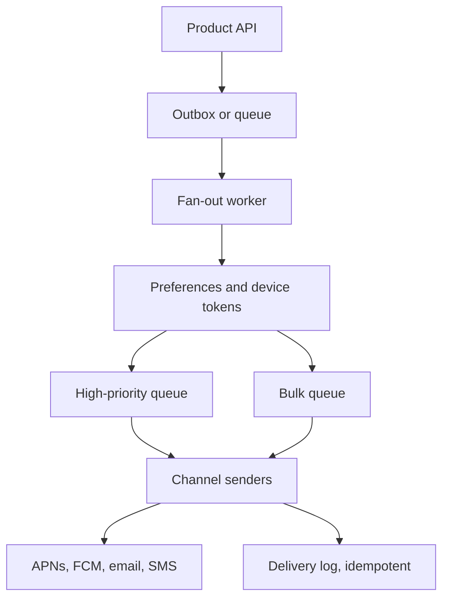

# Design a Notification System

## 1. TL;DR

A notification system accepts one event and delivers it to the channels a user still wants, without blocking the product request on a push provider.
Delivery is at least once.
The user-visible promise is that a retry will not page them twice, and a provider outage will not take down the API that created the event.

## 2. Mental Model



The product API writes the business row and an outbox row.
[[Outbox-CDC-and-Event-Sourcing]] is why those are one transaction.
The fan-out worker expands one event into per-device attempts.
A security alert and a marketing blast do not share a queue.
If they do, a blast will delay a password reset.

## 3. Internals

Each attempt has an idempotency key: event id plus channel plus device.
The sender records "accepted by provider" under that key before it returns.
[[Idempotency-and-Delivery]] is the whole send path.
Provider rate limits are a property of the channel, so the sender has its own token bucket.
[[Backpressure-and-Tail-Latency]] applies between the fan-out worker and the sender.
When the provider returns a permanent error, delete the token.
When it returns a temporary error, retry with jitter and then dead-letter.
Do not retry a 400 forever.

Preferences are a read on the fan-out path.
Cache them, and invalidate on the settings write.
A stale cache that sends one extra email is a product bug.
A missing cache that makes the worker call the user service for every device is an incident.
[[Caching-and-Invalidation]] with a short TTL is the compromise.

## 4. Trade-offs

Pull notifications (the app polls an inbox) are simpler and slower to the lock screen.
Push notifications are faster and depend on a vendor.
A durable inbox plus a push is the design that still shows the message after APNs dropped it.
The inbox is the source of truth.
The push is a hint.

## 5. Failure modes

A thundering herd of retries after a provider blip will extend the blip.
Cap concurrency and honor `Retry-After`.
A fan-out of a million devices in one process will OOM.
Page through the device list and checkpoint the cursor.
A template bug will send the wrong string a million times.
Render, then require a second commit for a new template, and keep the previous template available.

## 6. Hands-on check

```python
def attempt_key(event_id: str, channel: str, device_id: str) -> str:
    return f"{event_id}:{channel}:{device_id}"
```

The provider call uses that string as its dedupe key when the provider supports one.
The delivery log uses it as the primary key either way.

## 7. Capacity

A product event that fans out to 5 devices, at 2,000 events per second, is 10,000 provider calls per second.
Those calls are slow and variable.
They belong in the sender fleet, not in the API process.
The API SLO stays the SLO of a database commit.
[[SLOs-and-Observability]] should page on "password-reset delivery older than 30 seconds", not on "marketing blast is behind".

## 8. In production

Separate transactional and marketing from day one.
Store the inbox.
Treat vendor tokens as untrusted data that expires.
The systems that fail this design fail by coupling the user request to the vendor HTTP call.

## 9. Interview questions

1. Why is the push a hint and the inbox the record.
2. What is the idempotency key for one device attempt.
3. How do you stop a marketing blast from delaying a security alert.
4. What do you do with a permanent provider error versus a timeout.

## 10. Related

- [[Outbox-CDC-and-Event-Sourcing]]
- [[Idempotency-and-Delivery]]
- [[Backpressure-and-Tail-Latency]]
- [[Caching-and-Invalidation]]
- [[02-Rate-Limiter/design|Rate limiting, including provider limits]]

## 11. Further reading

- [[Pub-Sub-Architecture]] for the bus between product and fan-out.
- [[Apache-Kafka]] when the outbox relay needs a retained log rather than a transient queue.
