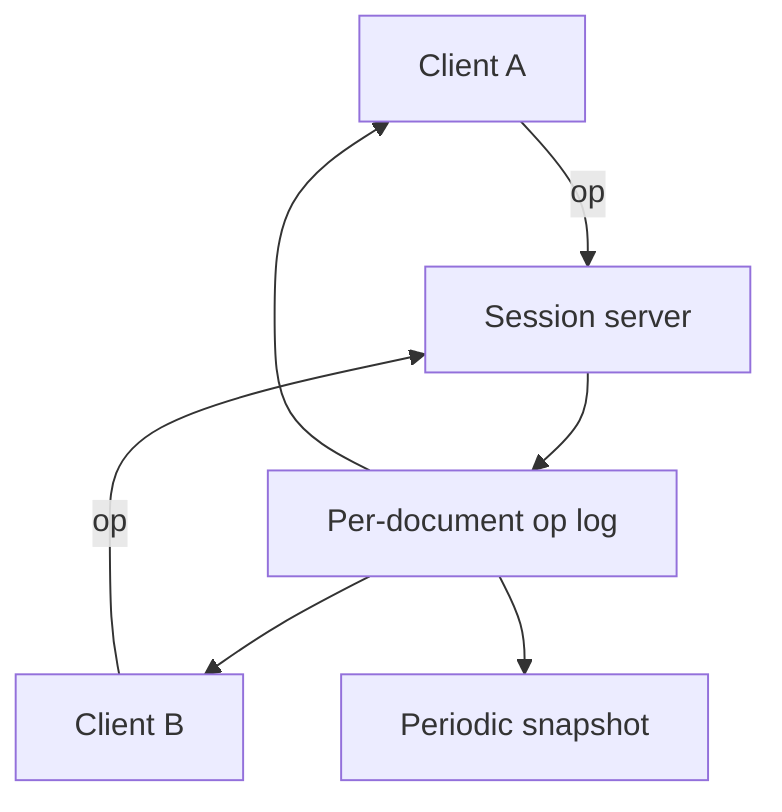

# Design a Collaborative Document

## 1. TL;DR

Several people edit one document at the same time, and each of them must converge to the same document without a lock on every keystroke.
Operational transformation rewrites an operation against the operations it had not seen.
A CRDT makes the merge commutative so the replicas can apply operations in different orders and still match.
Both need a durable log.
Neither is "last write wins on the whole file".

## 2. Mental Model



The session server orders ops for clients that are connected to it.
That order is a convenience.
A client that was offline, or a second region, will still merge.
[[Multi-Region-Active-Active]] shows up the moment two regions accept edits.
If you require one region to own the document, say so, and the merge problem shrinks to a single log.

## 3. Internals

Operational transformation assigns each op a position in a server sequence.
A client sends an op that was composed against version N.
The server transforms it through N+1..current and then appends it.
The math has to cover insert and delete, including two inserts at the same place.
Rich text, marks, and trees are where textbook OT gets incomplete.
Say that limit out loud.

A CRDT assigns each inserted character a stable identifier.
Delete sets a tombstone or adds the id to a delete set.
Replicas union the inserts and the deletes.
RGA, Yjs (a YATA relative to other items), and Automerge are different identifier schemes with the same convergence goal.
The state grows with tombstones until you can prove no replica still needs them.
That garbage collection is a consensus about "everyone has seen this", which is [[Consensus-and-Failure-Detection]] in disguise.

Presence, cursors, and typing indicators are ephemeral.
Do not put them in the document CRDT.
Ship them on a side channel with a 10-second expiry.

## 4. Trade-offs

A single-leader log is easier and puts a region on the write path.
A CRDT is harder and lets a laptop edit on a plane.
OT with one server is a reasonable interview answer for an online-only editor.
CRDT is the answer when offline editors are in the requirements.
Do not claim they have the same metadata cost.

## 5. Failure modes

Two users insert at the same index.
The algorithm must pick a deterministic winner that both sides compute.
A snapshot that is not a pure function of the log will diverge after restore.
A permission change has to apply to the session before the next op.
Merging an op from a user who lost access is an authorization bug, not a CRDT feature.

## 6. Hands-on check

```python
def sort_inserts(inserts: list[tuple[str, str]]) -> str:
    """Order (position-id, character) pairs the same way on every replica."""
    ordered = sorted(inserts, key=lambda item: item[0])
    return "".join(char for _pos, char in ordered)
```

Real CRDT positions are not raw integers.
They are identifiers that stay ordered between their neighbors.
The snippet only shows the property you need: every replica sorts the same way.

## 7. Capacity

A busy document might take 20 ops per second from a handful of editors.
That is a tiny write rate and a brutal correctness rate.
The disk is the log plus snapshots.
The CPU is transform or CRDT merge on the session server.
Fan-out is the number of viewers, which can be much larger than the number of editors.
Viewers should subscribe to a stream, not poll the snapshot.
[[03-Real-Time-Chat/design|The chat study]] is the connection layer you can reuse.

## 8. In production

Google Docs historically used OT with a server sequence.
Figma has described a CRDT-like model for its properties.
Yjs is a widely used CRDT for rich text.
Cite the one you are designing, and name offline as in or out of scope.

## 9. Interview questions

1. Why is last-write-wins on the document the wrong merge.
2. What extra problem appears when a client edits offline for an hour.
3. Why do tombstones grow, and what agreement lets you drop them.
4. Where do cursors live, and why not in the document state.

## 10. Related

- [[Time-Clocks-and-Ordering]]
- [[Multi-Region-Active-Active]]
- [[Consensus-and-Failure-Detection]]
- [[Idempotency-and-Delivery]]
- [[03-Real-Time-Chat/design|Realtime fan-out]]

## 11. Further reading

- Shapiro et al., Conflict-free Replicated Data Types, 2011.
- Ellis and Gibbs, 1989, for the OT origin.
