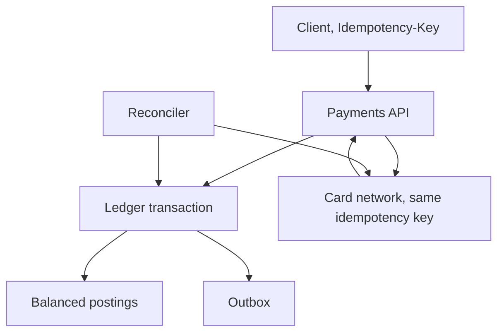

# Design a Payment Ledger

## 1. TL;DR

A payment system records that value moved, exactly once, from one account to another, in integer minor units.
The ledger is append-only.
A correction is a new pair of postings, not an update.
The external card network is not a participant in your database transaction.
Idempotency and reconciliation close the gap.

## 2. Mental Model



Authorize first if the product captures later.
Capture posts the ledger.
A timeout calling the network resumes on the same key.
It does not create a second authorization.
[[Idempotency-and-Delivery]] is mandatory here, not a refinement.

## 3. Internals

Every posting names an account, a direction, and an amount in minor units.
A transaction's postings sum to zero.
That invariant is enforced in the database, not in a comment.
Store currency on the transaction and refuse to mix currencies inside one transaction.
Foreign exchange is an explicit pair of postings plus a rate record, so you can explain the numbers later.

The balance is a fold of postings, or a cached sum updated in the same transaction as the insert.
The fold is the source of truth.
The cache is [[Caching-and-Invalidation]] with a zero TTL for correctness: update it synchronously or recompute it.
Do not use a floating-point type.
`0.1` is not a dime in binary floating point.

Cross-account moves that span shards use a saga: post a hold on the source, call the network, post the destination, release the hold.
[[saga_pattern]] is the compensation story.
A hold that outlives the saga is a bug the reconciler must see.
[[09-Ticket-Booking-System/design|The ticket study]] uses the same hold shape for seats.

## 4. Trade-offs

A single-region ledger is simpler and makes a far-away user wait.
A home-region ledger keeps a user's accounts in one place and makes a cross-region transfer a saga.
An active-active ledger on the same account is how you double-spend.
[[Multi-Region-Active-Active]] should end with "one writer per account".

## 5. Failure modes

The network captured the money and you crashed before the ledger post.
The reconciler sees the network record, finds no posting, and posts it under the original idempotency key.
The opposite case, a posting without a network capture, becomes a reversal.
You will have both cases.
Design the reconciler on day one.
A unique constraint on the idempotency key is what makes the reconciler safe to rerun.

## 6. Hands-on check

```python
def is_balanced(postings: list[tuple[str, int]]) -> bool:
    """Each posting is (direction, amount_minor). Amounts are positive integers."""
    signed = 0
    for direction, amount in postings:
        if amount <= 0:
            return False
        if direction == "debit":
            signed += amount
        elif direction == "credit":
            signed -= amount
        else:
            return False
    return signed == 0
```

`is_balanced([("debit", 500), ("credit", 500)])` is true.
A single-sided posting is false.
This is the invariant a transaction must commit.

## 7. Capacity

Payments are rarely the highest QPS in a company.
They are the lowest tolerance for a duplicate.
Size the ledger for the audit retention, often years, with three replicas, using [[Capacity-Estimation]].
Size the idempotency table for the retry window plus the reconciler lag, not for five minutes because that was convenient.
A hot merchant account is a single row that every posting wants to lock.
Fold that merchant's balance asynchronously, or stripe the account into sub-accounts and sum them, the way [[10-E-Commerce-Flash-Sale/design|flash sale]] stripes stock.

## 8. In production

Double-entry is old because it detects a missing leg.
Payment service providers retry.
Your system will see duplicates.
The teams that lose money skip the reconciler or store money as a float.

## 9. Interview questions

1. Why is a balance column, updated in place, not enough of a record.
2. The card network timed out. Walk the retry without a second charge.
3. How do you move money between two accounts that live in different regions.
4. What does the reconciler do when the network has a capture and you do not.

## 10. Related

- [[Idempotency-and-Delivery]]
- [[Outbox-CDC-and-Event-Sourcing]]
- [[saga_pattern]]
- [[Multi-Region-Active-Active]]
- [[ACID-vs-BASE]]

## 11. Further reading

- Helland, CIDR 2007, on not spreading one transaction across the network.
- [[Schema-Evolution-and-Migration]] before you rewrite a ledger table in place.
