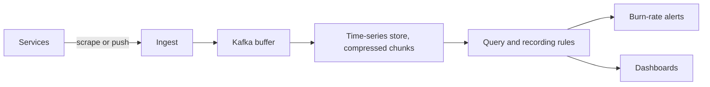

# Design a Metrics Platform

## 1. TL;DR

The platform ingests counters, gauges, and histograms and answers "what is the error rate and the latency tail for this service".
The write path is a high-rate append of numbers.
The read path is an aggregation over a time range.
Cardinality of labels is the resource that kills the cluster, not the raw sample rate.

## 2. Mental Model



Pull (a scraper reads `/metrics`) keeps the database from trusting every process to push, and it loses samples when the scraper cannot connect.
Push fits short-lived batch jobs that will be gone before the next scrape.
Many production systems do both.
[[Apache-Kafka]] between ingest and storage absorbs a scraper restart.

## 3. Internals

A series is a metric name plus a sorted label set.
Store it as an id, not as a repeated string.
Gorilla's compression delta-encodes timestamps and XOR-encodes floating values inside a time chunk.
That is why a time series of slowly changing numbers is cheap, and a time series of random numbers is not.
Histograms should be stored as buckets.
Computing a percentile from an average is impossible.
[[SLOs-and-Observability]] depends on those buckets.

Recording rules precompute expensive queries, such as a 30-day burn rate, so the alert path does not scan the raw chunks every minute.
Downsample old data.
Keep raw samples for days and one-minute rollups for a year, and say so, because the SLO window has to fit in the retention you kept.

## 4. Trade-offs

A pull system has a discovery problem: the scraper must know the targets, which is a service-discovery problem next to [[Consensus-and-Failure-Detection]] if the target list itself must be consistent.
A push system has a flooding problem: a bad deploy can stamp a unique label and create millions of series.
Reject new series past a budget.
That rejection is [[Backpressure-and-Tail-Latency]] for metadata.

## 5. Failure modes

A label like `user_id` or `request_id` will create a series per request.
The fix is to drop the label at ingest, not to scale the disk.
Clock skew on the writers makes samples land in the future or the past.
Bound the accepted timestamp window.
A query that scans every series for a dashboard will take down the read path at the moment you need it.
Recording rules and a limit on query fan-out are the mitigation.

## 6. Hands-on check

```python
def series_id(name: str, labels: dict[str, str]) -> str:
    body = ",".join(f"{k}={labels[k]}" for k in sorted(labels))
    return f"{name}|{body}"
```

Sorting the labels makes `method,path` and `path,method` one series.
The production id is a hash of this string, with the string kept in a dictionary so the hash is reversible for the UI.

## 7. Capacity

One million series, one sample every 15 seconds, is about 67,000 samples per second.
At 16 bytes uncompressed that is about 1 MB/s before replication, and several times less after Gorilla-style compression if the values are smooth.
The metadata index for a reckless label set can exceed the sample store.
Estimate series count first.
[[Capacity-Estimation]] is the arithmetic.

## 8. In production

Prometheus is the pull model with a local store.
A long-term store (Cortex, Thanos, Mimir, or a custom Gorilla-style tier) takes the samples Prometheus cannot keep.
The alerting that matters is the burn rate in [[SLOs-and-Observability]], evaluated against this store.

## 9. Interview questions

1. Why can you not compute a p99 from an average and a count.
2. What happens when a client adds `user_id` as a label.
3. Why put a log between scrape and the long-term store.
4. How long do you keep raw samples if the SLO window is 30 days.

## 10. Related

- [[SLOs-and-Observability]]
- [[Backpressure-and-Tail-Latency]]
- [[Probabilistic-Structures]]
- [[Apache-Kafka]]
- [[Indexing-and-Access-Paths]]

## 11. Further reading

- Pelkonen et al., Gorilla, VLDB 2015.
- The SRE workbook, for the burn-rate queries this store must answer quickly.
