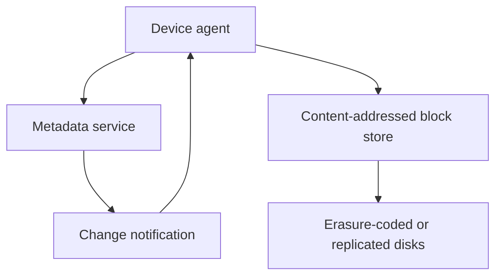

# Design File Sync

## 1. TL;DR

File sync keeps a folder on many devices equal to a folder in a durable store, and it uploads only the chunks that changed.
The metadata service is the source of truth for names, versions, and which chunks exist.
The block store is a content-addressed pile.
Conflicts are visible copies, or a merge, and they are never a silent overwrite of the larger file.

## 2. Mental Model



The agent splits a file into chunks, hashes each chunk, and asks the metadata service which hashes it does not have.
It uploads those blocks, then commits a new file version that points at the full hash list.
A crash before the commit leaves orphan blocks, which a garbage collector reclaims after no version references them.
[[Amazon-S3-and-Object-Storage]] is a reasonable block store.
It is the wrong place to put the rename and the access-control list, because those need a conditional update.

## 3. Internals

Fixed-size chunks reshuffle every hash when the user inserts one byte near the start.
Content-defined chunking cuts on a rolling hash, so an insert moves the boundary locally.
LBFS used Rabin fingerprints for this.
FastCDC is a later alternative.
The interview point is the boundary rule, not the brand.

The commit is a compare-and-swap on the file's version.
Two devices that edit offline both fail the second commit, and the loser becomes `notes (conflict).md` or a merged CRDT if the file type has one.
[[14-Collaborative-Editor/design|The collaborative editor]] is the merge you offer for rich text.
A spreadsheet usually gets a conflict copy.
Say which.

Notifications to other devices are [[13-Notification-System/design|a hint]].
The device still lists the metadata on reconnect, or it will miss an update when the socket was down.

## 4. Trade-offs

Server-side encryption is operable and lets the server dedupe across users, which is also a leak if an attacker can probe hashes.
Client-side encryption with per-user keys stops cross-user dedupe and makes sharing a key-distribution problem.
Name the choice.
Deduping identical chunks inside one user is the safe middle.

## 5. Failure modes

A device with a wrong clock must not win the version by timestamp.
The metadata version is a number from the server, from [[Time-Clocks-and-Ordering]]'s "do not use the wall clock" rule.
A partial upload that is committed anyway creates a file whose hash list 404s.
Commit only after every hash is durable.
A delete that garbage-collects blocks still referenced by an older version the user can restore is data loss.
GC walks reachable hashes from the versions you still promise to restore.

## 6. Hands-on check

```python
def blocks_to_upload(have: set[bytes], need: list[bytes]) -> list[bytes]:
    seen: set[bytes] = set()
    missing = []
    for digest in need:
        if digest in have or digest in seen:
            continue
        seen.add(digest)
        missing.append(digest)
    return missing
```

The server is `have`.
The file is `need`, in order.
Order stays in the metadata.
The block store does not know the file.

## 7. Capacity

A 10 GB video that changes one chunk should upload one chunk.
The metadata row stores the list of hashes.
A 10 GB file in 4 MB chunks is 2,560 hashes, which is a small row.
A 10 GB file in 4 KB chunks is 2.5 million hashes, which is a metadata incident.
Pick the average chunk size on purpose.
Bandwidth, not request rate, sizes the block store.
[[Capacity-Estimation]] with the change rate, not the library size, is the right input.

## 8. In production

Dropbox, Drive, and Sync all split metadata from blocks.
The products differ in sharing, conflict policy, and whether the client holds the keys.
The architecture on the board should too.

## 9. Interview questions

1. Why does inserting a byte at the start of a fixed-chunk file reupload the whole file.
2. What is the compare-and-swap on commit protecting.
3. When can the garbage collector delete a block.
4. Why is the notification socket not the source of truth.

## 10. Related

- [[Amazon-S3-and-Object-Storage]]
- [[Time-Clocks-and-Ordering]]
- [[Idempotency-and-Delivery]]
- [[14-Collaborative-Editor/design|Collaborative merge]]
- [[Caching-and-Invalidation]]

## 11. Further reading

- Muthitacharoen, Chen, and Mazieres, LBFS, SOSP 2001, for content-defined chunks.
- [[Replication-and-Quorums]] for the block store's durability target.
