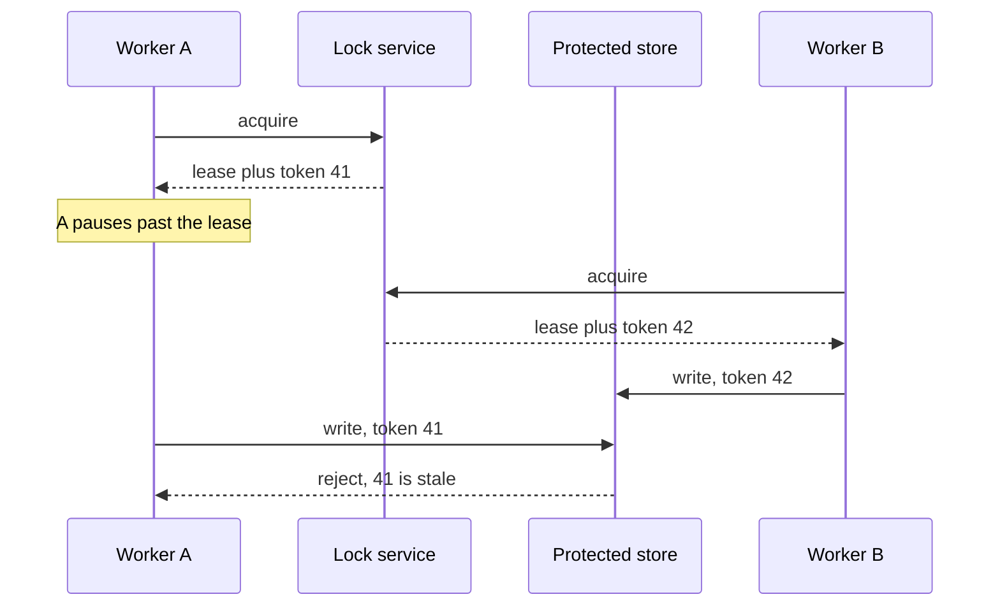

# Design a Distributed Lock and Leader Election

## 1. TL;DR

A distributed lock is a lease with a name, plus a fencing token that the protected resource checks.
The lease stops a dead holder from owning the name forever.
The fencing token stops a paused holder from acting after the lease moved on.
A lock that is only a key in Redis with a TTL is a lease without the check, and it will split-brain under a pause.

## 2. Mental Model



Chubby and ZooKeeper exist because a group of workers needs one of them to be the scheduler, the collector, or the writer.
[[Apache-ZooKeeper]] does this with an ephemeral sequential node.
etcd does it with a lease and a key revision.
The revision is the fencing token.
[[Consensus-and-Failure-Detection]] is the agreement underneath the service.
Do not build that agreement yourself on top of an unordered cache.

## 3. Internals

The acquire writes "holder, expiry, token" only if the key is absent or expired, and it does so atomically.
The token increases on every successful acquire.
The holder renews the lease before it expires, using its token so a former holder cannot renew.
The protected database stores the highest token it has accepted and rejects anything lower.
That check is the lock.
The cache key is only a hint that reduces how often two workers try.

Redlock, which locks on a majority of independent Redis nodes, still depends on clocks and on assumptions about pauses.
Kleppmann's critique is that those assumptions do not hold in the failure you care about.
If you cite Redlock, cite the fencing gap.
Prefer a consensus service when the resource must have one writer.

Most designs should not take this lock on the user request path.
A conditional write (`UPDATE ... WHERE version = ?`) gives you the same exclusion for one row without a second system.
Use the lock service to elect a leader for a job.
Use the row version for the data.

## 4. Trade-offs

A short lease detects failure quickly and flapps when garbage collection exceeds it.
A long lease is stable and slow to recover.
Pick the lease from the holder's pause budget, not from a round number.
A consensus lock is slower to acquire and safer.
A cache lock is faster and incomplete unless the resource checks a token.

## 5. Failure modes

The holder dies holding the lock.
Wait for expiry, then acquire.
Do not build a "break lock" button that skips the token.
The lock service itself partitions.
A majority-based service refuses the side that lost the quorum, which is the behavior you want.
A single Redis primary that fails over without fsync can hand the same lease to two writers.
That is a durability setting, and it belongs in the answer.

## 6. Hands-on check

```python
def store_accepts(last_accepted: int, token: int) -> bool:
    return token > last_accepted
```

Equality is not enough if a retry of the current holder must be allowed.
In that case the store accepts `token >= last_accepted` only when the request is idempotent, and it still rejects a strictly older token.
The snippet is the safety check for a new generation.

## 7. Capacity

Leader election is a handful of operations per minute per shard, plus renewals.
If you have a million locks churning on the request path, you have put coordination in the wrong place.
The capacity plan is the number of groups that need a leader, not the user QPS.
[[Capacity-Estimation]] still applies to the renewal storm after a lock-service restart.
Clients will all try to reacquire.
Jitter them.

## 8. In production

Chubby's paper is the operational lesson: coarse-grained locks, leases, and a service that is itself highly available.
ZooKeeper and etcd are the systems you will actually run.
Redis is a fine cache beside them.
It is a poor sole source of mutual exclusion.

## 9. Interview questions

1. A worker pauses for 30 seconds. The lease is 10 seconds. How can two workers write, and what check stops the old one.
2. Why is Redlock not a complete answer.
3. When is a row version better than a distributed lock.
4. What happens to holders when the lock service restarts and they all renew at once.

## 10. Related

- [[Consensus-and-Failure-Detection]]
- [[Time-Clocks-and-Ordering]]
- [[Apache-ZooKeeper]]
- [[Idempotency-and-Delivery]]
- [[Optimistic-vs-Pessimistic-Locking]]

## 11. Further reading

- Burrows, Chubby, OSDI 2006.
- Kleppmann, How to do distributed locking, 2016.
- [[Raft-Consensus]] for the log inside the lock service you should prefer.
