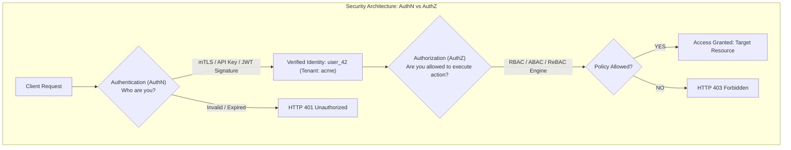
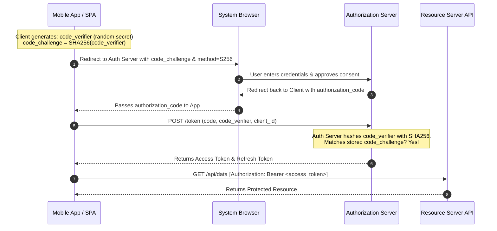
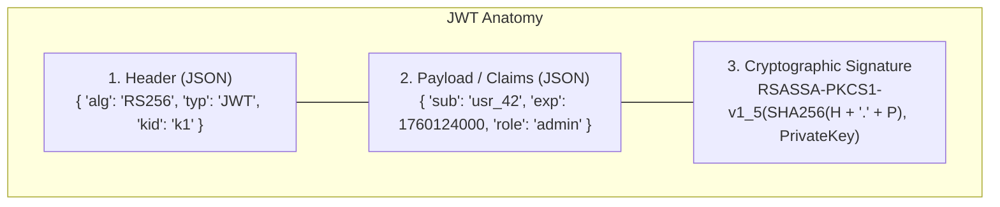
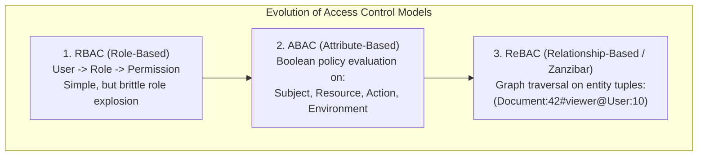

# API Authentication and Authorization: API Keys, OAuth 2.0, OIDC, JWTs, mTLS, and Access Control

## TL;DR
Authentication (AuthN) verifies who a client is, while Authorization (AuthZ) verifies what an authenticated identity is permitted to do.
API security spans multiple protocol layers: simple API Keys for public developer attribution, Mutual TLS (mTLS) for zero-trust microservice-to-microservice cryptographic handshakes, and OAuth 2.0 / OpenID Connect (OIDC) for delegated user authorization.
Modern public and mobile authentication relies on the Authorization Code Flow with PKCE (Proof Key for Code Exchange), which prevents authorization code interception on public clients.
Stateless authorization tokens rely on JSON Web Tokens (JWT) signed via asymmetric cryptographic key pairs (RS256 / ES256), while fine-grained permission evaluation has evolved from coarse Role-Based Access Control (RBAC) to Attribute-Based Access Control (ABAC) and graph-based Relationship-Based Access Control (ReBAC / Zanzibar).
For cryptographic primitives, hashing algorithms, and vulnerability mitigations, see [[11-Security-And-Cryptography/README.md|Security and Cryptography]].

## Mental Model
Think of Authentication as presenting your government passport at an airport border checkpoint.
The border agent verifies the hologram, checks your photo, and stamps your entry: your identity is verified.
Think of OAuth 2.0 Authorization as handing your car key to a valet parking attendant.
You do not give the valet your house keys or your banking password; you hand them a specialized "valet key" that only unlocks the driver's door and starts the engine, but cannot open the trunk or glove box.
Think of a JWT Access Token as a wristband at a music festival.
The gate security guards do not call the main box office computer every time you walk into a concert tent; they look at the tamper-evident holographic seal on your wristband and wave you through.
Think of ReBAC (Zanzibar) as Google Docs permission evaluation: you can edit the document not because you are an "Admin", but because you belong to Team A, which owns Folder B, which contains Document C.



## How It Works (Internals)

### 1. API Authentication Mechanisms

| Mechanism | Credential Format | Verification Location | Best Use Case |
| :--- | :--- | :--- | :--- |
| **API Keys** | High-entropy string (`sk_live_9a8f...`) | Gateway checks against hashed DB/Redis lookup | Developer attribution, public third-party meters |
| **Session Cookies** | Random opaque session token in cookie | Server lookups in distributed session cache (Redis) | Traditional server-rendered web applications |
| **JSON Web Tokens (JWT)** | Cryptographically signed compact string | Stateless signature verification using public key | Single Page Apps (SPAs), mobile apps, microservices |
| **Mutual TLS (mTLS)** | X.509 client certificate negotiated at TLS handshake | Hardware/kernel TLS termination at Layer 4/7 gateway | Zero-trust internal service-to-service microservices |

#### Mutual TLS (mTLS) Zero-Trust Handshake
In standard TLS, only the server proves its identity via an X.509 certificate.
In mTLS, both client and server exchange and cryptographically verify certificates against a shared internal Certificate Authority (CA):
- Establishes authenticated, encrypted communication at Layer 4 before any application code executes.
- Neutralizes credential leakage: even if an attacker intercepts HTTP headers, they lack the client's private cryptographic key.
- Standard protocol for service meshes (Istio, Linkerd, Envoy).

### 2. OAuth 2.0 and OpenID Connect (OIDC)

#### A. The Four OAuth 2.0 Roles (RFC 6749)
1. **Resource Owner**: The human user who owns the data (such as Alice).
2. **Client**: The application requesting access on behalf of the user (such as Spotify).
3. **Authorization Server**: The identity provider that authenticates the user and issues tokens (such as Google Accounts).
4. **Resource Server**: The API hosting protected resources (such as Google Calendar API).

#### B. Authorization Code Flow with PKCE (RFC 7636)
Legacy OAuth flows (like the Implicit Grant) returned access tokens directly in browser URL fragments, creating severe token leakage vulnerabilities.
Modern standards mandate Authorization Code Flow with PKCE for all public clients (Single Page Apps, iOS, Android):



PKCE eliminates authorization code interception: even if a malicious app intercepts the `authorization_code` on the mobile device, it cannot exchange it for an access token because it lacks the original `code_verifier` secret held in memory by the legitimate client.

#### C. OpenID Connect (OIDC) Identity Layer
OAuth 2.0 is strictly an Authorization protocol (it issues access tokens, but provides zero standard user profile information).
OpenID Connect (OIDC) adds an Authentication layer on top of OAuth 2.0:
- Issues an ID Token: a signed JWT containing identity claims (`sub`, `email`, `name`, `iss`, `aud`).
- Provides a standard `/userinfo` endpoint and discovery metadata (`/.well-known/openid-configuration`).

### 3. JSON Web Tokens (JWT) Deep Dive (RFC 7519)
A JWT consists of three Base64URL-encoded segments separated by periods:
$$\text{JWT} = \text{Header} \mathbin{\Vert} "." \mathbin{\Vert} \text{Payload} \mathbin{\Vert} "." \mathbin{\Vert} \text{Signature}$$



#### Verification: Symmetric vs Asymmetric Signing
- **Symmetric (HS256)**: Both token issuer and all verifying microservices share the identical secret key.
*Security Risk*: Any microservice that can verify tokens can also forge tokens!
- **Asymmetric (RS256 / ES256)**: The Authorization Server signs tokens using a private RSA/ECDSA key.
All downstream microservices verify signatures using the publicly published JSON Web Key Set (JWKS) endpoint.
Microservices verify tokens statelessly in memory without contacting the central auth server.

### 4. Authorization Models (AuthZ)



1. **Role-Based Access Control (RBAC)**:
   Users are assigned static roles (`Admin`, `Editor`, `Viewer`).
   Roles grant permissions (`read:documents`, `delete:users`).
   *Limitation*: Causes Role Explosion (such as creating `RegionalEditorWestCoastTier2` roles).
2. **Attribute-Based Access Control (ABAC)**:
   Evaluates dynamic boolean rules using attributes of the subject, resource, action, and environment:
   `ALLOW IF (user.department == resource.department AND request.time >= 09:00 AND request.ip IN office_ips)`.
3. **Relationship-Based Access Control (ReBAC - Google Zanzibar)**:
   Models permissions as directed graphs of relation tuples:
   $$\langle \text{object} \rangle \# \langle \text{relation} \rangle @ \langle \text{user / object\#relation} \rangle$$
   *Example*: `doc:budget_2026#viewer@group:finance#member`.
   Permission checks evaluate graph reachability across the distributed relation graph.

## Trade-offs and When to Use

| Dimension | API Keys | Stateful Sessions | Asymmetric JWTs (RS256) | mTLS |
| :--- | :--- | :--- | :--- | :--- |
| **Verification Latency** | $< 1\text{ ms}$ (Cache lookup) | $1\text{ - }2\text{ ms}$ (Redis lookup) | $< 0.1\text{ ms}$ (In-memory crypto) | $0\text{ ms}$ (Handled at TLS layer) |
| **Instant Revocation** | Trivial (Delete key in DB) | Trivial (Delete session) | Extremely Difficult (Token is valid until `exp`) | Requires CRL / OCSP stapling |
| **Decoupling / Statelessness** | Low | Low (Central DB dependent) | High (Zero central DB calls) | High |
| **Credential Ingress Exposure** | Vulnerable to logging leaks | Susceptible to CSRF | Susceptible to XSS in local storage | Immune to application-layer leaks |

## Failure Modes and Pitfalls

### 1. The JWT Instant Revocation Problem
- *Failure*: An employee is terminated, or an access token is compromised.
Because JWT verification is completely stateless, the compromised token remains valid until its expiration timestamp (`exp`), granting the attacker hours of unauthorized access.
- *Mitigation*:
  1. Enforce Ultra-Short Access Token Lifetimes (such as 5 to 15 minutes), paired with long-lived Refresh Tokens stored in a revocable database.
  2. Implement an in-memory distributed Revocation Blacklist (Blocklist) in Redis containing revoked token IDs (`jti`).

### 2. The Alg: "none" Signature Bypass Attack
- *Failure*: A flawed JWT library inspects the unverified header `{"alg": "none"}`.
An attacker modifies the payload to `{"role": "superuser"}`, sets `alg: "none"`, strips the signature, and submits the token.
The vulnerable library skips cryptographic verification and accepts the forged payload.
- *Mitigation*: Hardcode and enforce expected signature algorithms in verification middleware (`algorithms=['RS256']`), completely rejecting tokens with `none` or unexpected algorithms.

### 3. Storing Tokens in Browser `localStorage` (XSS Exposure)
- *Failure*: A single-page application stores JWT access tokens in `window.localStorage`.
A third-party npm dependency contains a Cross-Site Scripting (XSS) payload that reads `localStorage.getItem('token')` and transmits it to an attacker's command-and-control server.
- *Mitigation*: Store sensitive session and refresh tokens exclusively in `HttpOnly`, `Secure`, `SameSite=Strict` cookies, which are completely inaccessible to browser JavaScript.

## Hands-On

### 1. Standalone Python Simulation: PKCE, JWTs, and Access Control Models
Run this self-contained script demonstrating PKCE RFC 7636 hashing, stateless JWT creation and verification with signature defense, and access control evaluation across RBAC, ABAC, and ReBAC:

```python
#!/usr/bin/env python3
"""
Standalone API Authentication and Authorization Simulation.
Demonstrates:
1. OAuth 2.0 PKCE code verifier and SHA-256 challenge generation and verification (RFC 7636).
2. Stateless JWT encoding, HMAC-SHA256 signature verification, and expiry checks.
3. Signature stripping ("alg: none") attack prevention.
4. Access Control comparison: RBAC role check vs ABAC attribute policy vs ReBAC relation tuple graph traversal (Zanzibar style).
"""

import base64
import hashlib
import hmac
import json
import secrets
import time
from typing import Any, Dict, List, Optional, Set, Tuple


class PKCECodec:
    @staticmethod
    def generate() -> Tuple[str, str]:
        verifier_bytes = secrets.token_bytes(48)
        verifier = base64.urlsafe_b64encode(verifier_bytes).decode("utf-8").rstrip("=")
        digest = hashlib.sha256(verifier.encode("utf-8")).digest()
        challenge = base64.urlsafe_b64encode(digest).decode("utf-8").rstrip("=")
        return verifier, challenge

    @staticmethod
    def verify(verifier: str, expected_challenge: str) -> bool:
        digest = hashlib.sha256(verifier.encode("utf-8")).digest()
        computed = base64.urlsafe_b64encode(digest).decode("utf-8").rstrip("=")
        return secrets.compare_digest(computed, expected_challenge)


class JWTCodec:
    def __init__(self, secret: str):
        self.secret = secret.encode("utf-8")

    def encode(self, claims: Dict[str, Any], exp_delta_seconds: int = 300) -> str:
        header = {"alg": "HS256", "typ": "JWT"}
        payload = dict(claims)
        payload["exp"] = int(time.time()) + exp_delta_seconds

        h_b64 = base64.urlsafe_b64encode(json.dumps(header).encode()).decode().rstrip("=")
        p_b64 = base64.urlsafe_b64encode(json.dumps(payload).encode()).decode().rstrip("=")

        signing_input = f"{h_b64}.{p_b64}".encode("utf-8")
        sig = hmac.new(self.secret, signing_input, hashlib.sha256).digest()
        s_b64 = base64.urlsafe_b64encode(sig).decode().rstrip("=")

        return f"{h_b64}.{p_b64}.{s_b64}"

    def decode(self, token: str, allowed_algs: Tuple[str, ...] = ("HS256",)) -> Dict[str, Any]:
        parts = token.split(".")
        if len(parts) != 3:
            raise ValueError("Invalid JWT token format")

        h_bytes = base64.urlsafe_b64decode(parts[0] + "==")
        header = json.loads(h_bytes.decode("utf-8"))

        if header.get("alg") not in allowed_algs:
            raise ValueError(f"Disallowed algorithm: {header.get('alg')}")

        signing_input = f"{parts[0]}.{parts[1]}".encode("utf-8")
        expected_sig = hmac.new(self.secret, signing_input, hashlib.sha256).digest()
        actual_sig = base64.urlsafe_b64decode(parts[2] + "==")

        if not hmac.compare_digest(expected_sig, actual_sig):
            raise ValueError("JWT signature verification failed: Tampering detected!")

        payload_bytes = base64.urlsafe_b64decode(parts[1] + "==")
        payload = json.loads(payload_bytes.decode("utf-8"))

        if payload.get("exp", 0) < time.time():
            raise ValueError("JWT token expired")

        return payload


class AccessControlEngine:
    def __init__(self):
        self.role_permissions = {
            "admin": {"read", "write", "delete"},
            "editor": {"read", "write"},
            "viewer": {"read"},
        }
        self.tuples: Set[Tuple[str, str, str]] = set()

    def rbac_check(self, role: str, permission: str) -> bool:
        return permission in self.role_permissions.get(role, set())

    def abac_check(self, subject: Dict[str, Any], resource: Dict[str, Any], action: str, env: Dict[str, Any]) -> bool:
        if subject.get("department") != resource.get("department"):
            return False
        if action == "delete" and not subject.get("is_manager"):
            return False
        if env.get("hour", 12) < 8 or env.get("hour", 12) > 18:
            return False
        return True

    def add_rebac_tuple(self, obj: str, relation: str, user_or_set: str):
        self.tuples.add((obj, relation, user_or_set))

    def rebac_check(self, obj: str, relation: str, subject: str, visited: Optional[Set[str]] = None) -> bool:
        if visited is None:
            visited = set()
        state = f"{obj}#{relation}@{subject}"
        if state in visited:
            return False
        visited.add(state)

        if (obj, relation, subject) in self.tuples:
            return True

        for o, r, u_or_s in self.tuples:
            if o == obj and r == "parent":
                if self.rebac_check(u_or_s, relation, subject, visited):
                    return True
            if o == obj and r == relation and "#" in u_or_s:
                grp, grp_rel = u_or_s.split("#")
                if self.rebac_check(grp, grp_rel, subject, visited):
                    return True

        return False


def run_simulation():
    print("--- 1. OAuth 2.0 PKCE Code Challenge Generation & Verification ---")
    verifier, challenge = PKCECodec.generate()
    print(f"Code Verifier (in-memory client secret): {verifier[:24]}...")
    print(f"Code Challenge (sent in public redirect): {challenge}")
    assert PKCECodec.verify(verifier, challenge), "PKCE verification failed"
    print("PKCE Verification Passed: Server verified code verifier against challenge.")

    print("\n--- 2. Stateless JWT Signature & Expiry Verification ---")
    codec = JWTCodec(secret="vault-top-secret-signing-key-32b")
    token = codec.encode({"sub": "user_42", "role": "editor"}, exp_delta_seconds=300)
    print(f"Generated JWT: {token[:45]}...")

    claims = codec.decode(token)
    print(f"Successfully Decoded Claims: sub={claims['sub']}, role={claims['role']}")

    parts = token.split(".")
    fake_header = base64.urlsafe_b64encode(json.dumps({"alg": "none", "typ": "JWT"}).encode()).decode().rstrip("=")
    fake_payload = base64.urlsafe_b64encode(json.dumps({"sub": "user_42", "role": "admin"}).encode()).decode().rstrip("=")
    attack_token = f"{fake_header}.{fake_payload}."

    try:
        codec.decode(attack_token)
        assert False, "Should have rejected alg: none"
    except ValueError as e:
        print(f"Security Guard: 'alg: none' attack prevented -> {e}")

    print("\n--- 3. Authorization Models: RBAC vs ABAC vs ReBAC (Zanzibar) ---")
    engine = AccessControlEngine()

    print("RBAC check: role 'editor' -> permission 'delete':", engine.rbac_check("editor", "delete"))
    print("RBAC check: role 'admin' -> permission 'delete':", engine.rbac_check("admin", "delete"))

    sub = {"user": "alice", "department": "finance", "is_manager": True}
    res = {"id": "sheet_1", "department": "finance"}
    allowed = engine.abac_check(sub, res, "delete", {"hour": 14})
    print("ABAC check (Department match + manager + business hours):", allowed)

    engine.add_rebac_tuple("doc:101", "parent", "folder:finance")
    engine.add_rebac_tuple("folder:finance", "editor", "group:finance#member")
    engine.add_rebac_tuple("group:finance", "member", "user:bob")

    bob_can_edit = engine.rebac_check("doc:101", "editor", "user:bob")
    print("ReBAC Zanzibar Graph check: user:bob can edit doc:101 via group membership & parent folder:", bob_can_edit)
    assert bob_can_edit, "ReBAC traversal failed"


if __name__ == "__main__":
    run_simulation()
```

### 2. Live Driver Script: In-Memory Token Validator
The following script demonstrates production token validation against an in-memory key cache:

```python
import base64
import hmac
import hashlib
import json
import time


def validate_bearer_token(auth_header: str, signing_secret: str) -> dict:
    if not auth_header.startswith("Bearer "):
        raise ValueError("Missing or invalid Bearer prefix")
    token = auth_header[7:].strip()
    parts = token.split(".")
    if len(parts) != 3:
        raise ValueError("Malformed JWT structure")

    signing_input = f"{parts[0]}.{parts[1]}".encode("utf-8")
    expected_sig = hmac.new(signing_secret.encode("utf-8"), signing_input, hashlib.sha256).digest()
    actual_sig = base64.urlsafe_b64decode(parts[2] + "==")
    if not hmac.compare_digest(expected_sig, actual_sig):
        raise PermissionError("Invalid cryptographic signature")

    payload = json.loads(base64.urlsafe_b64decode(parts[1] + "==").decode("utf-8"))
    if payload.get("exp", 0) < time.time():
        raise PermissionError("Access token expired")
    return payload
```

## Performance and Capacity
- **Cryptographic Verification Overhead**:
  - Symmetric HMAC-SHA256: $\approx 1.5\text{ }\mu\text{s}$ per verification.
  - Asymmetric RSA-2048 (RS256): $\approx 45\text{ }\mu\text{s}$ per verification.
  - Asymmetric ECDSA P-256 (ES256): $\approx 70\text{ }\mu\text{s}$ per verification.
  Because signature verification executes in microseconds in CPU memory, microservices can verify tokens locally at over 15,000 verifications per second per core with zero database network calls.
- **JWKS In-Memory Caching**:
  Public keys from `/.well-known/jwks.json` change rarely.
  Caching public keys in memory with a 24-hour TTL eliminates remote HTTP round-trips to the identity provider during request validation.

## In Production
- **Google Zanzibar**: The global relationship-based authorization engine powering Google Drive, YouTube, and Cloud IAM.
Zanzibar stores billions of relation tuples across a globally distributed database, evaluating ACL permissions in under $10\text{ ms}$ at 95th percentile using Leopard indexing and consistent read snapshots.
- **Stripe**: Secures its API using secret keys prefixed with environment identifiers (`sk_live_...`, `sk_test_...`).
Stripe hashes API keys using SHA-256 before database storage to protect against internal database leaks, using constant-time comparison on ingress to prevent timing attacks.

### Operational Checklist
- [ ] Strictly reject `alg: "none"` and enforce explicit cryptographic algorithms in JWT verification libraries.
- [ ] Configure JWT access token expiration (`exp`) to no more than 15 minutes.
- [ ] Store refresh tokens in `HttpOnly`, `Secure` cookies with Path scoping.
- [ ] Deploy mTLS across all internal Kubernetes pod-to-pod communication channels via a service mesh.

## Interview Questions

> [!question]
> What is the difference between Authentication and Authorization?
> [!success]- Answer
> Authentication (AuthN) is the process of verifying who a user or system is.
> It involves identity verification, such as logging in with a password and multi-factor authentication.
> Authorization (AuthZ) is the process of determining what an authenticated entity is permitted to do.
> It involves permission verification, such as checking if user 42 has permission to delete invoice 99.

> [!question]
> Explain why PKCE (Proof Key for Code Exchange) is required for single-page and mobile applications using OAuth 2.0.
> [!success]- Answer
> Public clients cannot securely store a client secret because client code and compiled application binaries can be decompiled or inspected by end users.
> Without PKCE, if a malicious app on a device intercepts the authorization code via a registered custom redirect URI scheme, it can exchange that code for an access token.
> PKCE solves this vulnerability.
> The client generates a dynamic random `code_verifier` secret and transmits its SHA-256 hash (`code_challenge`) during the initial authorization request.
> When exchanging the code for a token, the client transmits the raw verifier.
> The authorization server verifies the hash, proving that the entity exchanging the code is the exact same instance that initiated the request.

> [!question]
> What is the difference between an ID Token and an Access Token in OpenID Connect?
> [!success]- Answer
> An ID Token is an identity assertion for the client application.
> It is a signed JWT containing user profile claims such as `sub`, `email`, and `name` intended to be parsed and displayed by the client interface.
> It must never be used to authorize API requests.
> An Access Token is an authorization credential for the resource server.
> It represents delegated permission to access protected APIs and is passed in the `Authorization: Bearer <token>` header.

> [!question]
> What are the architectural trade-offs of using stateless JWTs versus stateful database sessions?
> [!success]- Answer
> Stateless JWTs eliminate database lookups because microservices verify cryptographic signatures locally using the identity provider public key, enabling horizontal scalability and sub-millisecond latency.
> However, instant token revocation is impossible without maintaining a centralized blocklist, and token payloads add byte overhead to every HTTP request.
> Stateful sessions store session records in a central database like Redis, allowing instantaneous revocation and compact cookie sizes.
> However, every API request requires a network round-trip to the session datastore, creating a centralized bottleneck and single point of failure at high scale.

> [!question]
> Explain the "Alg: none" vulnerability in JWT implementations and how to prevent it.
> [!success]- Answer
> The JWT specification includes an algorithm value `"none"` intended for unsecured tokens.
> If a flawed verification library reads the `alg` header from an untrusted token and dynamically selects the verification algorithm based on that header, an attacker can modify the payload, set `alg: "none"`, strip the signature, and submit the token.
> The server skips cryptographic verification and accepts the forged token.
> Prevention requires strictly hardcoding allowed algorithms in verification middleware, refusing to parse tokens that request `"none"`.

> [!question]
> How would you design a token revocation architecture for stateless JWTs when an employee is terminated immediately?
> [!success]- Answer
> Implement a Hybrid Revocation Architecture across three coordinated steps.
> First, issue short-lived access tokens with a 5-minute TTL alongside long-lived refresh tokens stored in a primary database.
> Second, when an employee is terminated, revoke their refresh token in the database immediately, preventing future token generation.
> Third, for immediate 5-minute coverage, publish the user ID or revoked token ID (`jti`) to an in-memory distributed Revocation Bloom Filter or Redis Blocklist via pub-sub.
> API Gateway interceptors check the Redis blocklist before routing requests.
> Because access tokens expire in 5 minutes, blocklist entries can have an automatic 5-minute TTL, keeping the memory footprint minimal while guaranteeing instant revocation.

> [!question]
> Compare Role-Based Access Control (RBAC) and Relationship-Based Access Control (ReBAC / Zanzibar) at hyper-scale.
> [!success]- Answer
> RBAC maps users to static roles and permissions.
> It is simple to implement in relational schemas, but breaks down under fine-grained, dynamic access control, leading to Role Explosion where thousands of niche roles are created.
> ReBAC models access as a directed graph of relationship tuples where permissions are derived from relationships between entities.
> For example, User is Member of Group, Group is Editor of Folder, and Folder contains Document.
> ReBAC scales to billions of objects with fine-grained sharing, but requires a distributed graph evaluation engine with low-latency caching and consistency barriers like Zanzibar Zookies.

> [!question]
> How does Mutual TLS (mTLS) work in a service mesh, and how does it prevent Man-in-the-Middle attacks inside a Kubernetes cluster?
> [!success]- Answer
> In a service mesh, sidecar proxies intercept all inbound and outbound traffic.
> Each pod is issued a short-lived X.509 certificate with a cryptographic SPIFFE ID identity managed by an internal mesh Certificate Authority.
> When Service A calls Service B, the Envoy sidecars initiate an mTLS handshake at the transport layer, validating certificates against the internal CA.
> Both proxies establish symmetric TLS encryption, preventing packet sniffing across shared cluster worker nodes.
> Furthermore, Service B cryptographically verifies the SPIFFE identity of Service A, enforcing network authorization policies at the infrastructure layer before application code is invoked.

> [!question]
> How does OAuth 2.0 Token Exchange (RFC 8693) solve user impersonation and delegation in deep microservice call chains?
> [!success]- Answer
> In deep call chains (Client calls Service A, which calls Service B, which calls Service C), forwarding the original user access token gives downstream services carte blanche permissions.
> OAuth 2.0 Token Exchange enables Service A to exchange the user token for a downscoped delegated token tailored specifically for Service B.
> The exchanged token explicitly records both the `subject` (the end user) and the `actor` (Service A acting on the user behalf), while restricting the `audience` claim exclusively to Service B.
> This enforces the principle of least privilege, preventing a compromised downstream service from replaying the token against unrelated backend systems.

> [!question]
> How does Demonstrating Proof-of-Possession (DPoP - RFC 9449) neutralize the theft of OAuth access tokens compared to Bearer tokens?
> [!success]- Answer
> Bearer tokens are like cash: anyone who obtains the token can present it and gain access, making them vulnerable to network interception or proxy log leakage.
> DPoP cryptographically binds the access token to a public-private key pair generated by the client application.
> On every API request, the client creates and signs a short-lived DPoP proof JWT containing the HTTP method, request URI, and timestamp using its private key.
> The resource server verifies that the thumbprint in the access token matches the public key in the DPoP proof header.
> Even if an attacker steals the access token string, they cannot use it without the client private key, neutralizing token replay attacks.

## Related
- [[API-Fundamentals|API Fundamentals]]: Rate limiting and API security contracts.
- [[REST-APIs|REST APIs]]: Secure HTTP header semantics and CORS.
- [[11-Security-And-Cryptography/README.md|Security and Cryptography MOC]]: Core cryptographic algorithms and vulnerability countermeasures.

## Further Reading
- Richer, Justin, and Antonio Sanso. *OAuth 2.0 in Action*. Manning Publications, 2017.
- Hardt, Dick. "The OAuth 2.0 Authorization Framework." *RFC 6749* (2012).
- Sakimura, Nat, et al. "OpenID Connect Core 1.0." *OpenID Foundation* (2014).
- Pang, Ruoming, et al. "Zanzibar: Google’s Consistent, Global Authorization System." *2019 USENIX Annual Technical Conference (USENIX ATC 19)*. 2019.
