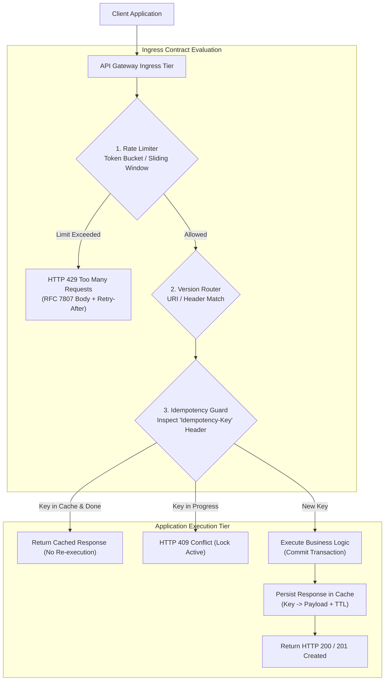
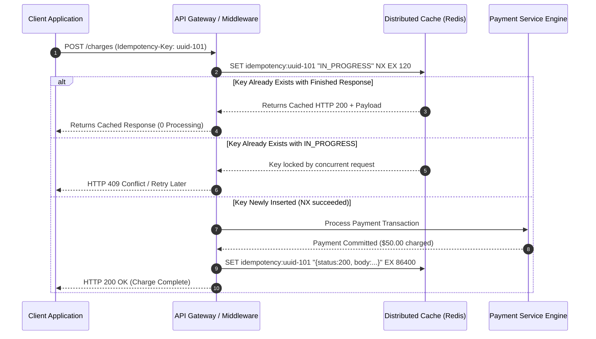
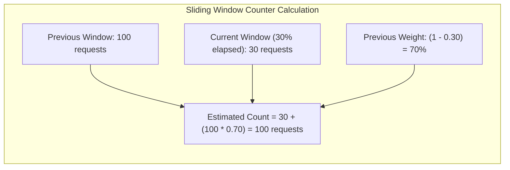

# API Fundamentals: Versioning, Idempotency, Rate Limiting, and Error Contracts

## TL;DR
Robust production APIs are governed by four foundational engineering contracts: Versioning, Idempotency, Rate Limiting, and Standardized Error Handling.
API versioning preserves backward compatibility for existing clients while enabling continuous evolution, implemented via URI path, query parameters, or content-negotiation headers.
Idempotency ensures that submitting identical mutating requests multiple times produces the exact same side-effect and response, safeguarding payments and order creations against network retry duplications via the `Idempotency-Key` header.
Rate limiting protects upstream services from denial-of-service and noisy neighbors, utilizing algorithms like Token Bucket, Leaky Bucket, and Sliding Window Counters.
Error contracts standardize failure telemetry across the organization using RFC 7807 Problem Details to eliminate ambiguous error parsing.

## Mental Model
Think of an API contract as a professional banking counter with an automated security vestibule.
Rate Limiting is the turnstile at the bank entrance: only 5 patrons per minute may pass through the glass door, preventing the lobby from being mobbed.
API Versioning is the language translation desk: forms printed in 2020 (v1) remain legally honored at Desk 1, while newly updated 2026 forms (v2) are processed at Desk 2.
Idempotency is the transaction receipt slip: when you deposit a $500 check, the teller writes your transaction UUID on the ledger; if you hand over the exact same check 10 minutes later fearing the first failed, the teller checks the UUID, notices it was already processed, and hands you a duplicate receipt without deducting funds twice.
Error Contracts are standardized banking rejection slips: instead of an informal shrug, you receive a notarized slip with an error code, human explanation, and remediation link.



## How It Works (Internals)

### 1. API Versioning Strategies

| Strategy | Example Request | Advantages | Disadvantages |
| :--- | :--- | :--- | :--- |
| **URI Path Versioning** | `GET /v1/customers/10` | Explicit, easy to inspect in access logs, cache-friendly | Violates URI purism (URI should identify resource, not schema) |
| **Query Parameter** | `GET /customers/10?v=2` | Simple for rapid testing; defaults easily to v1 | Inconsistent CDN caching if query strings are stripped |
| **Custom Header** | `X-API-Version: 2026-10-01` | Clean URIs; allows date-based versioning (Stripe model) | Difficult to test in plain web browsers; proxies may drop headers |
| **Accept Header (Content Negotiation)** | `Accept: application/vnd.app.v2+json` | Strict REST compliance; decouples version from resource URI | High client complexity; harder to route at Layer 4/Layer 7 gateways |

#### The Stripe Date-Based Backward Compatibility Engine
Stripe pioneered an advanced versioning engine:
1. All internal database models and service codes strictly execute against the latest current internal schema.
2. When an older client issues a request using an API key pinned to `2019-02-19`, the gateway intercepts the request.
3. A pipeline of backward-compatibility Request Transformers transforms the old JSON payload into the current format before reaching business logic.
4. On the return path, a chain of Response Transformers takes the modern response and strips newly added fields, renaming attributes back to the 2019 schema.
This isolates the core engineering codebase from legacy technical debt.

### 2. Idempotency Key Architecture
Defined in the IETF draft *The Idempotency-Key HTTP Header Field*.
- **The Problem**: A client submits `POST /v1/charges` with `$50.00`.
The server successfully charges the card, but a network drop terminates the TCP connection before the client receives the HTTP 200 OK.
If the client retries naively, the customer is billed twice ($100).
- **The Solution**: The client attaches a unique UUID header: `Idempotency-Key: 7b9a5e8c-3d2f-4a1e-8f90-abcdef123456`.



### 3. Rate Limiting Algorithms

#### A. Token Bucket
- **Mechanism**: A bucket holds up to $B$ tokens.
Tokens are continuously refilled at a constant rate $r$ tokens/second.
Each incoming request attempts to draw 1 token.
If tokens are available, the request proceeds; if empty, the request is rejected with HTTP 429.
- **Characteristics**: Permits controlled bursts of traffic up to size $B$, while strictly bounding long-term sustained rate to $r$.
- **Implementation**: Stored in Redis as a hash containing `(last_updated_timestamp, current_tokens)`.

#### B. Leaky Bucket
- **Mechanism**: Incoming requests enter a FIFO queue of capacity $B$.
A worker leaks (processes) requests out of the bottom at a strict constant rate $r$.
If incoming traffic exceeds the bucket capacity, excess requests overflow and drop.
- **Characteristics**: Smooths out traffic spikes into a continuous steady-state output stream; eliminates bursts entirely.

#### C. Sliding Window Counter
Combines the low memory of Fixed Window with the accuracy of Sliding Window Log:
- Approximates request count in the current sliding window $[t - W, t]$ by blending the previous window's count and the current window's count:
$$\text{Rate} = \text{Count}_{current} + \text{Count}_{previous} \times \left( 1 - \frac{t_{offset}}{W} \right)$$
- If $\text{Rate} > \text{Limit}$, reject with HTTP 429.



### 4. Standardized Error Contracts (RFC 7807 Problem Details)
Instead of returning arbitrary custom error payloads, enterprise APIs adopt RFC 7807 (`Content-Type: application/problem+json`):

```json
{
  "type": "https://api.example.com/errors/insufficient-funds",
  "title": "Insufficient Account Balance",
  "status": 422,
  "detail": "Account 'acc_9874' has a balance of $12.50, which is insufficient for transaction amount $50.00.",
  "instance": "/v1/charges/ch_55418",
  "invalid_params": [
    {
      "name": "amount",
      "reason": "Amount exceeds available balance"
    }
  ]
}
```

## Trade-offs and When to Use

| Architectural Component | Approach A | Approach B | Trade-off Analysis |
| :--- | :--- | :--- | :--- |
| **API Versioning** | URI Path (`/v1`) | Header (`X-Version`) | URI path is trivial to debug and route, but breaks URI purity; Header preserves clean URIs, but complicates Layer 4 routing and edge caching. |
| **Rate Limiter Storage** | Local In-Memory (Node Memory) | Distributed Cache (Redis) | Local is ultra-fast ($< 1\mu\text{s}$) with zero network overhead, but fails under auto-scaling; Redis enforces global cluster limits, but adds a $1\text{ms}$ network hop. |
| **Rate Limit Algorithm** | Token Bucket | Leaky Bucket | Token Bucket accommodates natural bursty user traffic; Leaky Bucket forces uniform pacing, which can increase client latency during bursts. |
| **Idempotency Persistence** | Redis Cache (TTL 24h) | Primary Relational DB Table | Redis is low-latency and ephemeral; DB table is permanent and supports strict foreign keys, but burdens primary transactional storage. |

## Failure Modes and Pitfalls

### 1. The Idempotency Collision Vulnerability
- *Failure*: A client generates a hardcoded UUID or flawed random number and submits two completely different requests using the same `Idempotency-Key` (e.g., Request 1 charges $10; Request 2 charges $500).
If the server only checks key existence, it returns the cached $10 receipt for the $500 charge without processing it.
- *Mitigation*: Payload Fingerprinting.
Hash the request payload (HTTP method, URL path, body SHA-256) and store it with the idempotency record.
If a request arrives matching an existing key but carrying a different payload hash, return HTTP 422 Unprocessable Entity with an explicit error detailing the key collision.

### 2. Distributed Rate Limiter Race Conditions
- *Failure*: In a distributed Redis-backed rate limiter, using separate `GET` and `INCR` commands introduces a Time-Of-Check to Time-Of-Use (TOCTOU) race condition.
Under concurrent requests, clients exceed configured limits.
- *Mitigation*: Execute rate-limiting checks atomically using single-threaded Redis Lua scripts or Redis cell modules (`redis-cell`).

### 3. Unbounded Idempotency Memory Leaks
- *Failure*: A financial system stores every idempotency key permanently in an in-memory Redis cluster without TTL expiration.
Memory consumption grows monotonically by gigabytes daily until Redis encounters OOM and evicts arbitrary keys.
- *Mitigation*: Always configure an explicit TTL on idempotency records (typically 24 to 72 hours), backed by permanent cold storage archiving if audit requirements mandate long-term retention.

## Hands-On

### 1. Standalone Python Simulation: Rate Limiter, Idempotency, and Versioning
Run this self-contained script demonstrating sliding window rate limiting, idempotency key tracking with SHA-256 fingerprinting, in-flight locking, and Stripe-style backward compatibility schema transformation:

```python
#!/usr/bin/env python3
"""
Standalone API Fundamentals Simulation: Rate Limiting, Idempotency, Versioning, and Error Contracts.
Demonstrates:
1. Token Bucket & Sliding Window Counter rate limiters with burst control.
2. Idempotency key tracking with SHA-256 payload fingerprinting and collision detection.
3. In-flight locking preventing concurrent duplicate executions.
4. Backward-compatible schema transformation pipeline (Stripe model).
5. RFC 7807 Problem Details compliant error envelopes.
"""

import hashlib
import json
import time
from typing import Any, Callable, Dict, Optional, Tuple


class SlidingWindowRateLimiter:
    def __init__(self, limit: int, window_sec: float):
        self.limit = limit
        self.window = window_sec
        self.prev_count = 0
        self.curr_count = 0
        self.curr_window_start = time.time()

    def allow(self) -> Tuple[bool, Dict[str, Any]]:
        now = time.time()
        elapsed = now - self.curr_window_start

        if elapsed >= self.window:
            self.prev_count = self.curr_count
            self.curr_count = 0
            self.curr_window_start = now
            elapsed = 0.0

        weight = max(0.0, 1.0 - (elapsed / self.window))
        estimated = self.curr_count + (self.prev_count * weight)

        if estimated < self.limit:
            self.curr_count += 1
            return True, {
                "X-RateLimit-Limit": self.limit,
                "X-RateLimit-Remaining": int(self.limit - estimated)
            }
        return False, {
            "Retry-After": max(1, int(self.window - elapsed)),
            "X-RateLimit-Remaining": 0
        }


class IdempotencyManager:
    def __init__(self, ttl_seconds: float = 300.0):
        self.ttl = ttl_seconds
        self.store: Dict[str, Dict[str, Any]] = {}

    def _hash_request(self, method: str, path: str, body: str) -> str:
        raw = f"{method}:{path}:{body}"
        return hashlib.sha256(raw.encode("utf-8")).hexdigest()

    def process(self, key: str, method: str, path: str, body: str, handler: Callable[[], Tuple[int, dict]]) -> Tuple[int, dict]:
        p_hash = self._hash_request(method, path, body)
        now = time.time()

        if key in self.store:
            entry = self.store[key]
            if now - entry["ts"] > self.ttl:
                del self.store[key]
            else:
                if entry["payload_hash"] != p_hash:
                    return 422, {
                        "type": "https://api.example.com/errors/idempotency-conflict",
                        "title": "Idempotency Key Payload Mismatch",
                        "status": 422,
                        "detail": "This key was previously used with a different request payload."
                    }
                if entry["status"] == "IN_PROGRESS":
                    return 409, {
                        "type": "https://api.example.com/errors/concurrent-mutation",
                        "title": "Concurrent Request In Progress",
                        "status": 409,
                        "detail": "A request with this idempotency key is currently being processed."
                    }
                return entry["code"], entry["body"]

        self.store[key] = {
            "status": "IN_PROGRESS",
            "payload_hash": p_hash,
            "code": 0,
            "body": {},
            "ts": now,
        }

        try:
            status, res = handler()
            self.store[key]["status"] = "DONE"
            self.store[key]["code"] = status
            self.store[key]["body"] = res
            return status, res
        except Exception:
            del self.store[key]
            raise


class VersioningTransformer:
    @staticmethod
    def downscope_to_v1(modern_response: Dict[str, Any]) -> Dict[str, Any]:
        v1 = dict(modern_response)
        if "first_name" in v1 and "last_name" in v1:
            v1["full_name"] = f"{v1.pop('first_name')} {v1.pop('last_name')}"
        v1.pop("tier", None)
        return v1


def run_simulation():
    print("--- 1. Sliding Window Rate Limiting ---")
    limiter = SlidingWindowRateLimiter(limit=3, window_sec=1.0)
    for req_num in range(1, 6):
        allowed, meta = limiter.allow()
        print(f"Request {req_num}: Allowed={allowed} | Meta={meta}")
    print("Rate Limiter correctly rejected requests 4 and 5.")

    print("\n--- 2. Idempotency Key Manager & Replay Protection ---")
    idemp = IdempotencyManager()
    order_id_seq = 100

    def mock_order_charge():
        nonlocal order_id_seq
        order_id_seq += 1
        return 201, {"order_id": f"ord_{order_id_seq}", "status": "PAID", "amount": 99.00}

    key = "idem_tx_uuid_99"
    s1, r1 = idemp.process(key, "POST", "/v1/orders", '{"amount": 99.0}', mock_order_charge)
    print(f"Submit 1 -> Status: {s1}, Order ID: {r1['order_id']}")

    s2, r2 = idemp.process(key, "POST", "/v1/orders", '{"amount": 99.0}', mock_order_charge)
    print(f"Submit 2 (Network Retry) -> Status: {s2}, Order ID: {r2['order_id']}")
    assert r1["order_id"] == r2["order_id"], "Idempotency failed: duplicated charge!"

    s3, r3 = idemp.process(key, "POST", "/v1/orders", '{"amount": 500.0}', mock_order_charge)
    print(f"Submit 3 (Tampered Amount) -> Status: {s3}, Detail: {r3.get('detail')}")
    assert s3 == 422, "Collision guard failed to reject altered payload"

    print("\n--- 3. Stripe-Style Versioning Transformation ---")
    modern_customer = {
        "id": "cust_42",
        "first_name": "Ada",
        "last_name": "Lovelace",
        "tier": "PLATINUM",
        "balance": 1500.0
    }
    legacy_v1_view = VersioningTransformer.downscope_to_v1(modern_customer)
    print("Modern 2026 Internal Schema:", modern_customer)
    print("Downscoped 2020 Legacy View:", legacy_v1_view)
    assert "full_name" in legacy_v1_view and "tier" not in legacy_v1_view

    print("\nVerification Passed: Rate limiting, idempotency, and versioning pipelines verified.")


if __name__ == "__main__":
    run_simulation()
```

### 2. Live Driver Script: Token Bucket with Redis Lua Script (Reference)
The following Redis Lua script demonstrates atomic token bucket rate limiting executed in a single thread on the Redis cluster:

```lua
-- KEYS[1]: Rate limiter key (e.g., "ratelimit:tenant_102")
-- ARGV[1]: Max bucket capacity (burst)
-- ARGV[2]: Refill rate per second
-- ARGV[3]: Current Unix timestamp in seconds
-- ARGV[4]: Cost of current request (e.g., 1)

local key = KEYS[1]
local capacity = tonumber(ARGV[1])
local rate = tonumber(ARGV[2])
local now = tonumber(ARGV[3])
local cost = tonumber(ARGV[4])

local data = redis.call("HMGET", key, "tokens", "last_updated")
local tokens = tonumber(data[1])
local last_updated = tonumber(data[2])

if tokens == nil then
    tokens = capacity
    last_updated = now
else
    local delta = math.max(0, now - last_updated)
    tokens = math.min(capacity, tokens + delta * rate)
    last_updated = now
end

if tokens >= cost then
    tokens = tokens - cost
    redis.call("HMSET", key, "tokens", tokens, "last_updated", last_updated)
    redis.call("EXPIRE", key, math.ceil(capacity / rate) * 2)
    return {1, tokens} -- Allowed: {1, remaining_tokens}
else
    redis.call("HMSET", key, "tokens", tokens, "last_updated", last_updated)
    return {0, tokens} -- Rejected: {0, remaining_tokens}
end
```

## Performance and Capacity
- **Rate Limiting Overhead**:
  - In-memory Sliding Window check: $< 0.1\text{ }\mu\text{s}$.
  - Distributed Redis rate-limiter check (pipelined Lua script over local VPC): $0.5\text{ - }1.5\text{ ms}$.
- **Idempotency Storage Capacity Sizing**:
  Assume an API processes $10,000,000$ mutating requests per day.
  Each idempotency cache record stores: UUID key ($36\text{ B}$), SHA-256 payload hash ($32\text{ B}$), response JSON ($500\text{ B}$), and Redis metadata ($64\text{ B}$) $\approx 632\text{ bytes}$.
  Total RAM required to sustain a 24-hour retention window:
  $$10^7 \times 632\text{ bytes} \approx 6.32\text{ GB RAM}$$

## In Production
- **Stripe**: The global standard for API idempotency.
Stripe API client SDKs automatically generate a cryptographically random V4 UUID header `Idempotency-Key` on every mutating POST request.
Stripe guarantees that if a network failure occurs, retrying the API call will return the identical charge object and will never charge a customer twice within a 24-hour window.
- **GitHub REST API**: Uses standard rate-limiting headers returned with every response:
  - `x-ratelimit-limit`: Maximum allowed requests per hour.
  - `x-ratelimit-remaining`: Remaining requests in current window.
  - `x-ratelimit-reset`: Unix epoch timestamp indicating when the current window resets.

### Operational Checklist
- [ ] Ensure all mutating endpoints (`POST`, `PATCH`) support and enforce `Idempotency-Key` headers.
- [ ] Configure standard rate limit response headers (`RateLimit-Limit`, `RateLimit-Remaining`, `RateLimit-Reset`, `Retry-After`).
- [ ] For RFC 7807 error responses, ensure internal stack traces and database credentials are fully stripped before exiting the API Gateway tier.

## Interview Questions

> [!question]
> What is an idempotent HTTP method, and which standard HTTP verbs are idempotent?
> [!success]- Answer
> An HTTP method is idempotent if executing it multiple times with identical parameters leaves the server in the exact same state as executing it a single time.
> `GET`, `HEAD`, `PUT`, and `DELETE` are defined as idempotent by the HTTP specification.
> `POST` and `PATCH` are not inherently idempotent because repeated requests create duplicate resources or re-apply deltas unless explicitly protected by an idempotency key.

> [!question]
> How does the Token Bucket rate-limiting algorithm handle bursty traffic compared to the Leaky Bucket algorithm?
> [!success]- Answer
> The Token Bucket accumulates tokens up to a maximum bucket capacity $B$ during idle periods.
> When a sudden burst of requests arrives, it can consume all $B$ accumulated tokens instantly without delay, allowing temporary bursts while bounding long-term sustained rate to the refill rate $r$.
> The Leaky Bucket forces requests into a FIFO queue and processes them at a strictly constant rate $r$, completely smoothing out bursts and delaying spikes into a uniform stream.

> [!question]
> What is RFC 7807 (Problem Details for HTTP APIs), and why is it preferred over custom JSON error responses?
> [!success]- Answer
> RFC 7807 defines a standardized JSON structure (`application/problem+json`) for conveying machine-readable error details.
> It standardizes common fields: `type` (a URI reference identifying the error category), `title` (human-readable summary), `status` (HTTP status code), `detail` (specific explanation of this occurrence), and `instance` (URI identifying the specific resource affected).
> It eliminates fragmented, ad-hoc error formats across microservices, enabling universal client-side error handling libraries.

> [!question]
> What is the Payload Fingerprinting mechanism in an idempotency key engine, and what failure does it prevent?
> [!success]- Answer
> Payload fingerprinting computes a cryptographic hash (such as SHA-256) of the request method, path, and payload body, storing it alongside the idempotency record.
> It prevents Idempotency Key Collisions and Tampering.
> If a faulty or malicious client reuses an existing idempotency key while passing completely different request data (such as changing the payment amount from $10 to $500), the server detects that the payload hash does not match the stored hash and rejects the request with HTTP 422 Unprocessable Entity, preventing accidental incorrect receipts or fraud.

> [!question]
> How do you implement a distributed rate limiter that avoids race conditions across a cluster of 50 API Gateway nodes?
> [!success]- Answer
> Store rate limit counters in a shared Redis cluster and execute the check-and-increment logic atomically within a single Redis Lua script.
> Because Redis executes Lua scripts sequentially on a single thread, the inspection of the current window and the counter increment occur as an indivisible atomic step.
> This completely eliminates Time-Of-Check to Time-Of-Use (TOCTOU) race conditions that occur when clients execute separate `GET` and `INCR` commands across multiple gateway servers.

> [!question]
> How would you design a zero-downtime, non-breaking schema evolution strategy for an API with millions of mobile app users who never update their apps?
> [!success]- Answer
> Follow the Expand and Contract pattern backed by backward-compatibility translation pipelines.
> First, never modify or delete existing fields; only add new optional fields.
> Second, if a field must be deprecated, support both old and new attributes simultaneously in payloads.
> Third, adopt the Stripe model: pin each client's API token to a specific version epoch.
> The core backend always executes against the latest domain models, while an API Gateway middleware layer executes version transformation adapters that translate modern payloads back into the client pinned legacy schema on the fly.
> Fourth, monitor usage of deprecated fields via observability telemetry to identify the long-tail drop-off before decommissioning after a multi-year deprecation window.

> [!question]
> What happens if a client submits a request with an idempotency key, and while the server is processing the database transaction, a second request arrives carrying the identical idempotency key?
> [!success]- Answer
> The idempotency engine must implement an In-Progress Lock state.
> When the first request arrives, it atomically sets the key in Redis with a status of `IN_PROGRESS` and a short lock TTL (such as 60 seconds).
> When the second concurrent request arrives, it detects that the key exists and its status is `IN_PROGRESS`.
> The server must not execute the transaction a second time.
> Instead, it immediately returns HTTP 409 Conflict, indicating that a mutation with that key is actively running and preventing double-execution race conditions.

> [!question]
> How would you architect multi-tenant hierarchical rate limiting for a SaaS platform supporting Free, Pro, and Enterprise tiers?
> [!success]- Answer
> Implement a tiered, multi-dimensional token bucket filter at the API Gateway.
> Layer 1 enforces IP-based protection to defend the edge against unauthenticated DDoS floods.
> Layer 2 enforces tenant tier limits by extracting tenant identity and plan tier from authenticated JWT claims (e.g., Free = 10 RPS, Pro = 200 RPS, Enterprise = 5,000 RPS).
> Layer 3 applies route-level cost factors to weight computationally expensive endpoints.
> Layer 4 applies concurrency limits to cap concurrent long-running requests per tenant, preventing thread pool starvation across shared clusters.

> [!question]
> How does client-side full jitter exponential backoff prevent the Thundering Herd problem during service degradation?
> [!success]- Answer
> When a backend service returns HTTP 429 or HTTP 503, clients initiate retries.
> If all clients use fixed backoff intervals (e.g., exactly 2 seconds, 4 seconds, 8 seconds), their retry spikes align in synchronized waves, repeatedly crashing the recovering server (the Thundering Herd).
> Exponential backoff with Full Jitter calculates sleep time as `sleep = random_between(0, min(max_backoff, base * 2^attempt))`.
> Randomizing the delay across the entire interval spreads retry attempts uniformly across the time domain, flattening traffic spikes and allowing recovering backend instances to clear connection backlogs.

> [!question]
> How does distributed tracing with the W3C Trace Context standard propagate request context across an API Gateway and internal microservices?
> [!success]- Answer
> The W3C Trace Context specification defines two standard HTTP headers: `traceparent` and `tracestate`.
> The `traceparent` header encodes a 4-field formatted string: version, 16-byte trace ID (identifying the entire distributed transaction), 8-byte parent ID (identifying the caller span), and 8-bit trace flags.
> When a request hits the API Gateway, the gateway generates a fresh trace ID if missing, starts an ingress span, and injects the `traceparent` header into outgoing RPCs to downstream services.
> Each downstream microservice extracts the header, logs the trace ID with all structured log events, and creates a child span before forwarding, producing an unbroken distributed waterfall trace across heterogeneous systems.

## Related
- [[REST-APIs|REST APIs]]: Architectural constraints and HTTP semantics.
- [[GraphQL|GraphQL]]: Query-based alternative to REST and its rate limiting cost models.
- [[gRPC-and-Protocol-Buffers|gRPC and Protocol Buffers]]: Binary RPC protocol contracts and error handling.
- [[API-Authentication-and-Authorization|API Authentication and Authorization]]: Securing API endpoints with OAuth 2.0 and JWTs.

## Further Reading
- Richardson, Leonard, and Mike Amundsen. *RESTful Web APIs: Services for a Changing World*. O'Reilly Media, 2013.
- Jin, Brenda, Saurabh Sahni, and Amir Shevat. *Designing Web APIs: Building APIs That Developers Love*. O'Reilly Media, 2018.
- Nottingham, Mark, and Erik Wilde. "Problem details for HTTP APIs." *RFC 7807* (2016).
- IETF. "The Idempotency-Key HTTP Header Field." *Internet-Draft draft-ietf-httpapi-idempotency-key* (2024).
