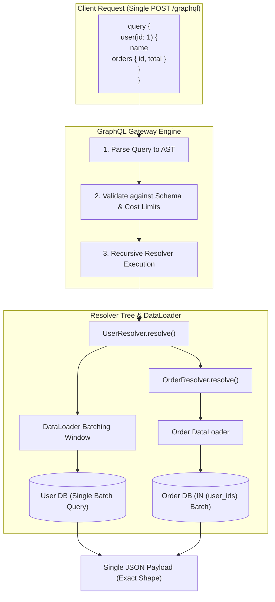
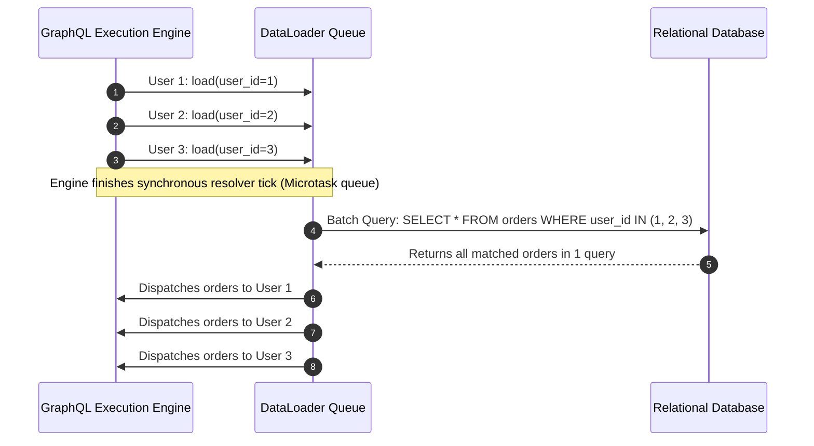
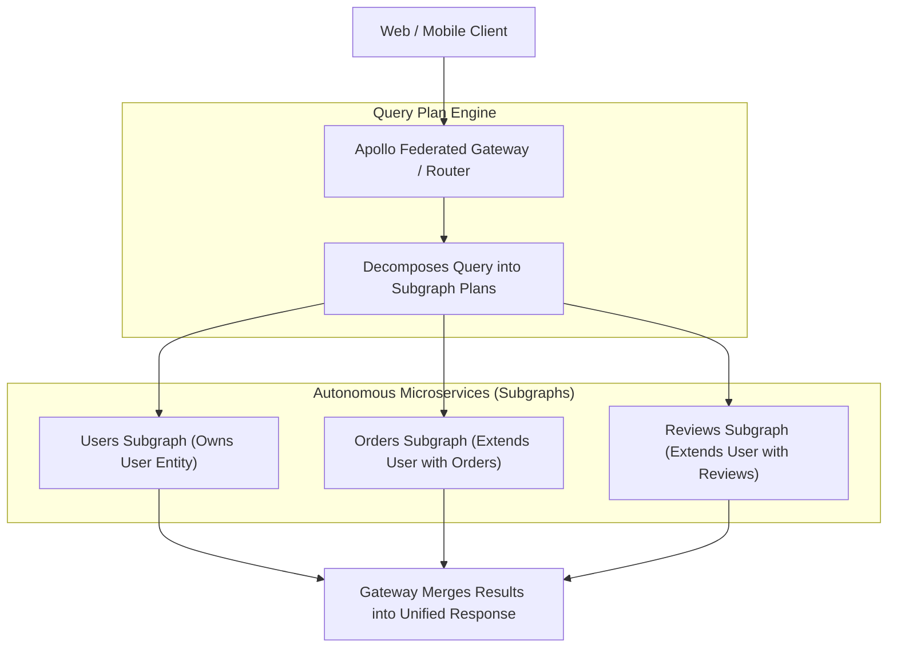

# GraphQL: Declarative Data Fetching, Resolvers, and Distributed Federation

## TL;DR
GraphQL is an open-source query language for APIs and runtime engine for executing queries against a strongly typed schema, created by Meta (Facebook) in 2012.
Unlike REST, where the server dictates response payloads across fixed endpoints, GraphQL enables clients to request the exact fields and nested relationships required in a single network round-trip.
Execution relies on a recursive Resolver Tree that evaluates fields depth-first against underlying datastores.
The primary architectural challenge of GraphQL is the N+1 Problem, where naive field resolvers trigger hundreds of independent database queries, mitigated via DataLoader batching and caching.
At enterprise scale, multiple microservices unify their schemas into a single distributed graph using Apollo Federation, where a gateway composes query plans across autonomous subgraphs.

## Mental Model
Think of REST as a collection of fixed-course meal trays at a cafeteria.
Tray A (`/users/1`) gives you a burger, fries, and a soda whether you want the soda or not (Over-fetching).
If you also want dessert, you must leave the table, wait in line at Counter B (`/orders`), and purchase a separate tray (Under-fetching / N+1 network calls).
Think of GraphQL as a personal culinary buffet with a custom order ticket.
You hand a single ticket to the chef stating: "I want only the burger patty from Counter A, and 2 cookies from Counter B."
The chef visits the internal kitchen counters, assembles exactly what you requested onto a single custom plate, and hands it back in one delivery.
However, if an unruly customer submits a ticket ordering 1,000 recursive layers of dessert, the kitchen burns down unless strict security checks limit ticket complexity.



## How It Works (Internals)

### 1. Schema Definition Language (SDL) and the Type System
GraphQL is strictly typed.
The contract is defined via SDL:
```graphql
type User {
  id: ID!
  username: String!
  email: String
  orders(limit: Int = 10): [Order!]!
}

type Order {
  id: ID!
  amount: Float!
  status: OrderStatus!
}

enum OrderStatus {
  PENDING
  PAID
  CANCELLED
}

type Query {
  user(id: ID!): User
}

type Mutation {
  cancelOrder(orderId: ID!): Order!
}
```

### 2. The Execution Engine and the Resolver Tree
When a query arrives, the engine parses the raw query string into an Abstract Syntax Tree (AST), validates it against the schema, and executes resolvers recursively.
Each field in a GraphQL query corresponds to a Resolver Function with a standardized 4-argument signature:
$$\text{resolver}(parent, args, context, info)$$
- `parent`: The result returned by the parent field resolver in the execution tree.
- `args`: Arguments supplied to the field in the query (e.g., `id: 1`).
- `context`: Shared per-request state (authentication tokens, database connection pools, DataLoaders).
- `info`: AST metadata describing the execution state and field selection set.

### 3. The N+1 Problem and DataLoader Internals
Consider querying 10 users and their recent orders:
```graphql
query {
  users {
    name
    orders { id }
  }
}
```
1. `Query.users` executes 1 SQL query: `SELECT * FROM users LIMIT 10;`.
2. For each of the 10 users, the engine invokes `User.orders(parent=user)`.
3. If implemented naively, this executes 10 separate queries: `SELECT * FROM orders WHERE user_id = ?;`.
Total database queries: $1 + 10 = 11$ (The N+1 Query Problem).
For 1,000 users, this triggers 1,001 database queries, collapsing database connection pools.



#### How DataLoader Solves N+1
Facebook created DataLoader based on two core mechanisms:
1. **Batching via Event Loop Microtasks**:
   When individual resolvers call `orderLoader.load(user.id)`, DataLoader does not execute a query immediately.
   It queues the requested ID in an internal array.
   It defers execution until the current event loop frame (or microtask tick) completes.
   At that point, it invokes the user-defined batch function with all queued keys:
   `SELECT * FROM orders WHERE user_id IN (1, 2, 3, ...);`
   Reducing $N+1$ queries to exactly 2 database round trips.
2. **Per-Request Memoization Caching**:
   If multiple parts of the resolver tree request the same user ID within the same HTTP request, DataLoader returns the cached promise, eliminating duplicate database fetches.

### 4. Enterprise Scaling: Apollo Federation
When multiple independent microservices need to contribute to a unified company-wide GraphQL graph, monolithic schemas create organizational bottlenecks.
Apollo Federation decomposes the graph into autonomous Subgraphs:



- **Entities**: Types that can be referenced and extended across subgraphs using the `@key` directive:
```graphql
# In Users Subgraph:
type User @key(fields: "id") {
  id: ID!
  name: String!
}

# In Orders Subgraph (Extends User):
extend type User @key(fields: "id") {
  id: ID! @external
  orders: [Order!]!
}
```
- The Federated Router compiles an optimized Query Plan, executing concurrent parallel fetches to subgraphs and stitching the JSON trees together automatically.

## Trade-offs and When to Use

| Dimension | GraphQL | REST | gRPC |
| :--- | :--- | :--- | :--- |
| **Over/Under-Fetching** | Completely eliminated | High (Fixed payloads) | High (Fixed protobuf schemas) |
| **HTTP Edge Caching** | Difficult (POST requests bypass CDN) | Native (`Cache-Control`, `ETag`) | None natively |
| **Server CPU Overhead** | High (AST parsing, resolver walks) | Low (Direct JSON serialization) | Minimal (Binary serialization) |
| **DoS Vulnerability** | High (Deep nested recursive queries) | Low (Bounded endpoints) | Low |
| **Network Payload Size** | Minimal (Only requested fields) | Medium to High | Minimal (Binary Protobuf) |

### Decision Guide
1. **Choose GraphQL when:**
   - Building rich web or mobile applications where frontend screens require data aggregated from multiple distinct backend services.
   - Bandwidth optimization over mobile cellular networks is critical (eliminating over-fetching).
   - Rapid UI iteration is required; frontend teams can query new field combinations without asking backend engineers to create new endpoints.
2. **Avoid GraphQL (Choose REST or gRPC) when:**
   - The workload consists of internal, low-latency microservice-to-microservice RPCs (gRPC is significantly faster).
   - The application relies heavily on public CDN edge caching (e.g., public media, static articles).
   - The engineering team lacks the operational maturity to enforce query depth limiting, cost analysis, and DataLoader instrumentation.

## Failure Modes and Pitfalls

### 1. The Query Depth / Complexity Denial-of-Service Bomb
- *Failure*: An attacker exploits circular relationships in the schema:
```graphql
query MaliciousBomb {
  author(id: 1) {
    books {
      author {
        books {
          author {
            books { ... } # 100 levels deep!
          }
        }
      }
    }
  }
}
```
The server AST parser attempts to resolve millions of nested fields, driving CPU to 100% and crashing the process with call-stack overflow or out-of-memory errors.
- *Mitigation*:
  1. Enforce Query Depth Limiting (e.g., reject any query exceeding depth 5).
  2. Implement Query Complexity / Cost Analysis: assign a numeric cost to each field and reject queries exceeding a max score (e.g., max score 1,000).

### 2. CDN Cache Invalidation Collapse
- *Failure*: A team migrates an e-commerce product catalog from REST to GraphQL.
Because GraphQL clients submit queries via `POST /graphql`, all edge CDN caching ceases to function.
Every single product page view hits the origin database, increasing origin traffic by 20x and causing a catastrophic database outage.
- *Mitigation*: Deploy Automatic Persisted Queries (APQ).
Clients compute the SHA-256 hash of the query and issue a `GET /graphql?extensions={"persistedQuery":{"sha256Hash":"..."}}`.
CDNs can cache this GET request based on URL and query hash, restoring edge caching.

### 3. Missing Field-Level Authorization
- *Failure*: Authorization checks are implemented only at the top-level query resolver (`Query.user`), but omitted on child field resolvers (`Order.creditCardNumber`).
A malicious user crafts an indirect query reaching the child object through another entity, bypassing security filters.
- *Mitigation*: Implement authorization checks within individual field resolvers or at the data-access / ORM repository layer, rather than solely at the API gateway boundary.

## Hands-On

### 1. Standalone Python Simulation: Parser, AST Guard, and DataLoader Engine
Run this self-contained script demonstrating query parsing, depth and complexity validation, naive resolver N+1 query explosion, and DataLoader microtask batching without third-party dependencies:

```python
#!/usr/bin/env python3
"""
Standalone GraphQL Simulation: Parser, Resolver Tree, DataLoader, and Cost Analyzer.
Demonstrates:
1. Lexing and recursive descent parsing of a GraphQL query string into an AST.
2. Query depth and computational complexity cost analysis (DoS defense).
3. Naive resolver execution exhibiting the N+1 query problem.
4. Batched DataLoader execution with microtask-style event loop scheduling and memoization.
"""

import asyncio
from typing import Any, Callable, Dict, List, Optional, Set, Tuple


class Token:
    def __init__(self, kind: str, value: str, line: int):
        self.kind = kind
        self.value = value
        self.line = line

    def __repr__(self):
        return f"Token({self.kind}, {self.value!r})"


def tokenize(query_str: str) -> List[Token]:
    tokens = []
    i = 0
    line = 1
    n = len(query_str)
    while i < n:
        c = query_str[i]
        if c == "\n":
            line += 1
            i += 1
        elif c.isspace() or c == ",":
            i += 1
        elif c == "#":
            while i < n and query_str[i] != "\n":
                i += 1
        elif c in "{}:()":
            tokens.append(Token(c, c, line))
            i += 1
        elif c.isalnum() or c == "_":
            start = i
            while i < n and (query_str[i].isalnum() or query_str[i] == "_"):
                i += 1
            val = query_str[start:i]
            tokens.append(Token("NAME", val, line))
        else:
            i += 1
    tokens.append(Token("EOF", "", line))
    return tokens


class ASTField:
    def __init__(self, name: str, args: Optional[Dict[str, str]] = None):
        self.name = name
        self.args: Dict[str, str] = args or {}
        self.selection_set: List["ASTField"] = []

    def __repr__(self):
        return f"ASTField({self.name}, args={self.args}, subfields={len(self.selection_set)})"


class GraphQLParser:
    def __init__(self, tokens: List[Token]):
        self.tokens = tokens
        self.pos = 0

    def peek(self) -> Token:
        return self.tokens[self.pos]

    def consume(self, expected_kind: Optional[str] = None) -> Token:
        tok = self.tokens[self.pos]
        if expected_kind and tok.kind != expected_kind:
            raise SyntaxError(f"Expected {expected_kind} but found {tok.kind} at line {tok.line}")
        self.pos += 1
        return tok

    def parse(self) -> List[ASTField]:
        if self.peek().kind == "NAME" and self.peek().value in ("query", "mutation"):
            self.consume("NAME")
            if self.peek().kind == "NAME":
                self.consume("NAME")
        return self.parse_selection_set()

    def parse_selection_set(self) -> List[ASTField]:
        fields = []
        self.consume("{")
        while self.peek().kind != "}" and self.peek().kind != "EOF":
            fields.append(self.parse_field())
        self.consume("}")
        return fields

    def parse_field(self) -> ASTField:
        name_tok = self.consume("NAME")
        args = {}
        if self.peek().kind == "(":
            self.consume("(")
            while self.peek().kind != ")":
                arg_name = self.consume("NAME").value
                self.consume(":")
                arg_val = self.consume("NAME").value
                args[arg_name] = arg_val
            self.consume(")")
        field = ASTField(name_tok.value, args)
        if self.peek().kind == "{":
            field.selection_set = self.parse_selection_set()
        return field


class QueryGuard:
    @staticmethod
    def calculate_depth(fields: List[ASTField], current_depth: int = 1) -> int:
        if not fields:
            return current_depth - 1
        max_sub = current_depth
        for f in fields:
            if f.selection_set:
                sub_depth = QueryGuard.calculate_depth(f.selection_set, current_depth + 1)
                if sub_depth > max_sub:
                    max_sub = sub_depth
        return max_sub

    @staticmethod
    def calculate_complexity(fields: List[ASTField], list_fields: Set[str], multiplier: int = 10) -> int:
        cost = 0
        for f in fields:
            if f.name in list_fields:
                inner_cost = QueryGuard.calculate_complexity(f.selection_set, list_fields, multiplier) if f.selection_set else 1
                cost += 1 + multiplier * inner_cost
            else:
                cost += 1
                if f.selection_set:
                    cost += QueryGuard.calculate_complexity(f.selection_set, list_fields, multiplier)
        return cost


class MockDatabase:
    def __init__(self):
        self.query_log: List[str] = []
        self.users = [
            {"id": "1", "name": "Alice"},
            {"id": "2", "name": "Bob"},
            {"id": "3", "name": "Charlie"},
        ]
        self.orders = {
            "1": [{"id": "ord_101", "total": 45.0}, {"id": "ord_102", "total": 80.0}],
            "2": [{"id": "ord_103", "total": 120.0}],
            "3": [{"id": "ord_104", "total": 15.0}, {"id": "ord_105", "total": 30.0}],
        }

    async def fetch_users(self) -> List[Dict[str, Any]]:
        self.query_log.append("SELECT id, name FROM users;")
        await asyncio.sleep(0.001)
        return list(self.users)

    async def fetch_orders_naive(self, user_id: str) -> List[Dict[str, Any]]:
        self.query_log.append(f"SELECT id, total FROM orders WHERE user_id = '{user_id}';")
        await asyncio.sleep(0.001)
        return list(self.orders.get(user_id, []))

    async def fetch_orders_batched(self, user_ids: List[str]) -> Dict[str, List[Dict[str, Any]]]:
        id_str = ", ".join(f"'{u}'" for u in user_ids)
        self.query_log.append(f"SELECT id, user_id, total FROM orders WHERE user_id IN ({id_str});")
        await asyncio.sleep(0.001)
        return {uid: list(self.orders.get(uid, [])) for uid in user_ids}


class DataLoader:
    def __init__(self, batch_fn: Callable[[List[str]], Any]):
        self.batch_fn = batch_fn
        self.queue: List[str] = []
        self.futures: Dict[str, asyncio.Future] = {}
        self.cache: Dict[str, Any] = {}
        self.scheduled = False

    async def load(self, key: str) -> Any:
        if key in self.cache:
            return self.cache[key]

        loop = asyncio.get_running_loop()
        if key not in self.futures:
            self.futures[key] = loop.create_future()
            self.queue.append(key)

        if not self.scheduled:
            self.scheduled = True
            asyncio.create_task(self._dispatch())

        return await self.futures[key]

    async def _dispatch(self):
        await asyncio.sleep(0)  # Microtask tick yield
        keys = list(self.queue)
        self.queue.clear()
        self.scheduled = False

        if not keys:
            return

        batch_result = await self.batch_fn(keys)
        for k in keys:
            val = batch_result.get(k, [])
            self.cache[k] = val
            if k in self.futures and not self.futures[k].done():
                self.futures[k].set_result(val)


async def execute_query_naive(fields: List[ASTField], db: MockDatabase) -> Dict[str, Any]:
    result: Dict[str, Any] = {}
    for f in fields:
        if f.name == "users":
            users = await db.fetch_users()
            user_list = []
            for u in users:
                u_obj: Dict[str, Any] = {}
                for sub in f.selection_set:
                    if sub.name == "id":
                        u_obj["id"] = u["id"]
                    elif sub.name == "name":
                        u_obj["name"] = u["name"]
                    elif sub.name == "orders":
                        orders = await db.fetch_orders_naive(u["id"])
                        u_obj["orders"] = [
                            {order_field.name: o[order_field.name] for order_field in sub.selection_set}
                            for o in orders
                        ]
                user_list.append(u_obj)
            result["users"] = user_list
    return result


async def execute_query_dataloader(fields: List[ASTField], db: MockDatabase, loader: DataLoader) -> Dict[str, Any]:
    result: Dict[str, Any] = {}
    for f in fields:
        if f.name == "users":
            users = await db.fetch_users()

            async def resolve_user(u: Dict[str, Any]) -> Dict[str, Any]:
                u_obj: Dict[str, Any] = {}
                for sub in f.selection_set:
                    if sub.name == "id":
                        u_obj["id"] = u["id"]
                    elif sub.name == "name":
                        u_obj["name"] = u["name"]
                    elif sub.name == "orders":
                        orders = await loader.load(u["id"])
                        u_obj["orders"] = [
                            {order_field.name: o[order_field.name] for order_field in sub.selection_set}
                            for o in orders
                        ]
                return u_obj

            resolved_users = await asyncio.gather(*(resolve_user(u) for u in users))
            result["users"] = list(resolved_users)
    return result


async def run_simulation():
    query_str = """
    query GetUsersWithOrders {
        users {
            id
            name
            orders {
                id
                total
            }
        }
    }
    """
    print("--- 1. Lexing and Parsing Query ---")
    tokens = tokenize(query_str)
    parser = GraphQLParser(tokens)
    ast = parser.parse()
    print(f"Parsed root fields: {[f.name for f in ast]}")
    for root in ast:
        print(f"  Field '{root.name}' contains subfields: {[s.name for s in root.selection_set]}")

    print("\n--- 2. Static Query Complexity & Depth Analysis ---")
    depth = QueryGuard.calculate_depth(ast)
    cost = QueryGuard.calculate_complexity(ast, list_fields={"users", "orders"}, multiplier=10)
    print(f"Calculated Query Depth: {depth} (Max allowed: 5)")
    print(f"Calculated Complexity Score: {cost} (Max budget: 500)")

    bomb_str = """
    query DepthBomb {
        users {
            orders {
                users {
                    orders {
                        users {
                            orders {
                                id
                            }
                        }
                    }
                }
            }
        }
    }
    """
    bomb_tokens = tokenize(bomb_str)
    bomb_ast = GraphQLParser(bomb_tokens).parse()
    bomb_depth = QueryGuard.calculate_depth(bomb_ast)
    bomb_cost = QueryGuard.calculate_complexity(bomb_ast, list_fields={"users", "orders"}, multiplier=10)
    print(f"Malicious Query Depth: {bomb_depth} | Complexity: {bomb_cost}")
    assert bomb_depth > 5, "Depth bomb should exceed safe limit"
    print("Security Guard: Malicious query rejected before resolver execution.")

    print("\n--- 3. Naive Resolver Execution (N+1 Query Explosion) ---")
    db_naive = MockDatabase()
    res_naive = await execute_query_naive(ast, db_naive)
    print(f"Naive execution returned {len(res_naive['users'])} users.")
    print(f"Total SQL queries issued: {len(db_naive.query_log)}")
    for q in db_naive.query_log:
        print(f"  -> {q}")

    print("\n--- 4. DataLoader Resolver Execution (Batched & Memoized) ---")
    db_batched = MockDatabase()
    loader = DataLoader(db_batched.fetch_orders_batched)
    res_batched = await execute_query_dataloader(ast, db_batched, loader)
    print(f"Batched execution returned {len(res_batched['users'])} users.")
    print(f"Total SQL queries issued: {len(db_batched.query_log)}")
    for q in db_batched.query_log:
        print(f"  -> {q}")

    assert len(db_batched.query_log) == 2, "DataLoader failed to reduce queries to exactly 2"
    print("\nDataLoader Verification Succeeded: N+1 queries collapsed to exactly 2 round-trips.")


if __name__ == "__main__":
    asyncio.run(run_simulation())
```

### 2. Live Driver Script: Automatic Persisted Queries (APQ) Client
The following client snippet shows how production clients compute query SHA-256 digests and send GET requests to preserve edge CDN caching:

```python
import hashlib
import json
import urllib.parse
import urllib.request


def execute_persisted_query(endpoint: str, query: str):
    query_hash = hashlib.sha256(query.encode("utf-8")).hexdigest()
    extensions = {
        "persistedQuery": {
            "version": 1,
            "sha256Hash": query_hash,
        }
    }
    params = urllib.parse.urlencode({"extensions": json.dumps(extensions)})
    url = f"{endpoint}?{params}"

    req = urllib.request.Request(url, headers={"Accept": "application/json"})
    try:
        with urllib.request.urlopen(req) as resp:
            return json.loads(resp.read().decode("utf-8"))
    except urllib.error.HTTPError as e:
        if e.code == 400:
            # Query not found on server cache: fallback to POST with query definition
            payload = json.dumps({"query": query, "extensions": extensions}).encode("utf-8")
            post_req = urllib.request.Request(
                endpoint,
                data=payload,
                headers={"Content-Type": "application/json", "Accept": "application/json"},
                method="POST"
            )
            with urllib.request.urlopen(post_req) as post_resp:
                return json.loads(post_resp.read().decode("utf-8"))
        raise
```

## Performance and Capacity
- **GraphQL Engine Execution Tax**:
  A REST API serializing an in-memory dictionary directly to JSON takes approximately $0.1\text{ ms}$.
  A GraphQL engine parsing the AST, checking schema types, and traversing the recursive resolver tree takes approximately $1.5\text{ - }4.0\text{ ms}$ of CPU time per request, requiring larger compute clusters for high-throughput APIs.
- **Payload Size Savings**:
  For complex mobile applications, GraphQL typically achieves a 60% to 80% reduction in network response payload size compared to standard REST endpoints by stripping unused metadata fields.

## In Production
- **Meta (Facebook)**: Originated GraphQL in 2012 to power the Facebook iOS and Android mobile apps.
Meta processes billions of GraphQL queries per day across thousands of engineers, maintaining a single unified schema that describes the entire Facebook social graph.
- **Netflix**: Deployed Apollo Federation to transition from a monolithic backend-for-frontend (BFF) layer to a distributed GraphQL architecture.
Over 70 independent backend microservices publish subgraphs, which the federated gateway unifies into a single graph powering Netflix TV, mobile, and web applications.

### Operational Checklist
- [ ] Enforce a strict Query Depth limit (max depth 5 to 7) at the gateway tier.
- [ ] Implement query cost analysis (e.g., max complexity score 1,000) and reject expensive un-paginated queries.
- [ ] Wrap all database and external RPC calls in DataLoaders to eliminate the N+1 query problem.

## Interview Questions

> [!question]
> What is the core problem that GraphQL solves compared to traditional REST APIs?
> [!success]- Answer
> GraphQL solves over-fetching and under-fetching.
> Over-fetching occurs when a client receives unnecessary fields that waste mobile bandwidth.
> Under-fetching occurs when a client must execute multiple sequential HTTP round-trips to different endpoints to assemble related data for a single screen.
> With GraphQL, the client defines the exact shape of the response it needs, and the server returns all requested data in a single network round-trip.

> [!question]
> Explain the N+1 problem in GraphQL and how DataLoader resolves it.
> [!success]- Answer
> The N+1 problem occurs when a query fetches a list of $N$ parent objects, and the GraphQL engine invokes a separate child field resolver for each parent object, resulting in 1 initial database query followed by $N$ separate queries for the children.
> DataLoader resolves this using event-loop microtask batching and per-request memoization.
> It queues individual ID lookups during the synchronous resolver pass, defers execution until the microtask tick, and executes a single batched database query (`IN (...)`), reducing $N+1$ queries to 2.

> [!question]
> Why is HTTP caching difficult in GraphQL, and how do Automatic Persisted Queries (APQ) fix it?
> [!success]- Answer
> In traditional REST, each resource has a distinct URL, and responses carry `Cache-Control` headers cached natively by edge CDNs and browsers via HTTP GET.
> In GraphQL, nearly all requests are submitted via HTTP POST to a single `/graphql` endpoint, which CDNs cannot cache by default.
> Automatic Persisted Queries (APQ) fixes this by having clients send the SHA-256 hash of the query via HTTP GET (`/graphql?extensions={"persistedQuery":{"sha256Hash":"..."}}`).
> CDNs can cache this GET request based on the URL and query hash, restoring edge caching.

> [!question]
> What is a Query Complexity or Cost Analysis system, and why is it mandatory for public GraphQL APIs?
> [!success]- Answer
> Query Complexity Analysis assigns a numeric score or cost to every field in the schema.
> Scalar fields typically cost 1, whereas paginated lists cost a multiplier of the requested page size.
> Before executing the query, the gateway parses the AST and calculates the total cost.
> If the cost exceeds a configured limit (such as 1,000 points), the request is rejected immediately before hitting resolvers.
> It is mandatory because malicious actors can craft deeply nested circular queries that exhaust server CPU and database connections, causing Denial-of-Service outages.

> [!question]
> Explain how Apollo Federation differs from legacy Schema Stitching for building distributed GraphQL architectures.
> [!success]- Answer
> Schema Stitching is an imperative, centralized approach where a gateway imports multiple independent GraphQL schemas and uses custom glue code to merge them and forward queries.
> It creates tight coupling and requires modifying the gateway whenever a service changes.
> Apollo Federation is a declarative, decentralized approach where individual subgraphs define and extend shared Entities using standardized directives like `@key`, `@extends`, and `@external`.
> The federated gateway automatically inspects subgraph metadata, compiles query plans across services, and merges results without custom gateway glue code.

> [!question]
> How would you implement field-level rate limiting in GraphQL where different fields consume vastly different backend resources?
> [!success]- Answer
> Implement a Cost-Based Token Bucket Rate Limiter.
> First, assign a computational cost to each schema field, such as 1 point for basic attributes and 50 points for heavy algorithmic aggregations.
> Second, when a client submits a query, calculate the total query cost from the AST before execution.
> Third, deduct the calculated cost from the client token bucket stored in Redis.
> Fourth, if the client has insufficient tokens, reject the query with HTTP 429 and return a `RateLimit-Remaining` header showing available budget.
> This prevents clients from executing a small number of catastrophically expensive queries that circumvent simple request-count rate limiters.

> [!question]
> How do GraphQL Subscriptions work over WebSockets, and what are the scalability bottlenecks of maintaining 1,000,000 concurrent subscriptions?
> [!success]- Answer
> GraphQL Subscriptions allow clients to receive real-time event updates over persistent WebSocket connections.
> When a mutation occurs, the server emits an event to a pub-sub broker (such as Redis or Kafka), which routes the event to GraphQL server instances, executing the subscription resolver and pushing JSON frames down active WebSockets.
> Scalability bottlenecks at 1,000,000 connections include three factors.
> First, the memory footprint of idle WebSocket sockets in OS kernel RAM consumes 10 to 50 KB per connection.
> Second, CPU serialization storms occur on broadcast when an event affects 100,000 clients with distinct field selection sets, requiring 100,000 independent resolver pipelines.
> Third, broker fan-out saturation occurs when managing millions of subscription topics across clustered nodes.

> [!question]
> How would you design an authorization system in GraphQL that prevents data leakage across multi-tenant boundaries?
> [!success]- Answer
> Implement Defense-in-Depth Authorization across three distinct tiers.
> First, at the Gateway layer, validate incoming JWT signatures, extracting tenant identity and user roles into the GraphQL context object.
> Second, at the Schema layer, attach field-level authorization directives like `@auth(role: ADMIN)` to reject unauthorized field traversals before resolver invocation.
> Third, at the Data Access and DataLoader layer, enforce tenant scoping directly on all database query parameters (`WHERE tenant_id = :ctx_tenant_id`).
> Never rely solely on GraphQL resolvers for tenant isolation, ensuring that even if a developer writes an erroneous resolver allowing indirect traversal, the database layer strictly isolates data.

> [!question]
> How do incremental delivery directives `@defer` and `@stream` improve perceived user latency over HTTP?
> [!success]- Answer
> Incremental delivery allows a GraphQL server to return an initial payload immediately while streaming slower nested fields as they resolve.
> The `@defer` directive marks slow fragments, allowing the initial above-the-fold content to reach the client immediately without waiting for expensive secondary calculations.
> The `@stream` directive streams items in a large list individually or in small chunks rather than blocking the entire query until all items are fetched.
> Under the hood, the server sends these payloads over a single HTTP connection using `multipart/mixed` content-type boundaries or HTTP/2 and HTTP/3 streaming chunks, drastically reducing time-to-first-paint on client applications.

> [!question]
> How do you safely evolve and deprecate fields in a large GraphQL schema without breaking legacy mobile clients?
> [!success]- Answer
> In GraphQL, schemas evolve without URL versioning by adding new fields and marking old ones with the `@deprecated(reason: "...")` directive.
> Because clients explicitly specify their selection sets, the server can safely add new fields without increasing payload sizes for existing clients.
> To safely remove a deprecated field, ingest query field usage telemetry at the gateway tier using tools like Apollo Studio or custom Prometheus counters.
> Validate in CI/CD using schema validation linters that compare proposed schema changes against actual client query traffic over the past 30 to 90 days.
> Only remove a deprecated field from SDL after field usage metrics reach zero across all supported client versions in the wild.

## Related
- [[REST-APIs|REST APIs]]: Traditional resource-oriented alternative.
- [[API-Fundamentals|API Fundamentals]]: Rate limiting, versioning, and idempotency.
- [[gRPC-and-Protocol-Buffers|gRPC and Protocol Buffers]]: High-performance binary RPC protocol.

## Further Reading
- GraphQL Foundation. "GraphQL: A query language for APIs." *Official Specification* (2021).
- Porcello, Eve, and Alex Banks. *Learning GraphQL: Declarative Data Fetching for Modern Web Apps*. O'Reilly Media, 2018.
- Apollo GraphQL. "Apollo Federation Specification and Architecture." *Apollo Docs* (2023).
- Facebook. "DataLoader: Batched Data-Fetching Utility." *GitHub Repository Documentation* (2020).
