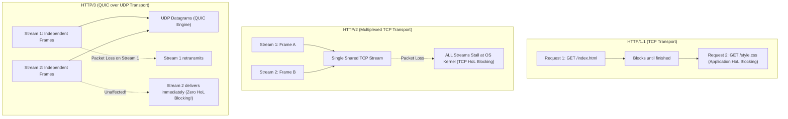
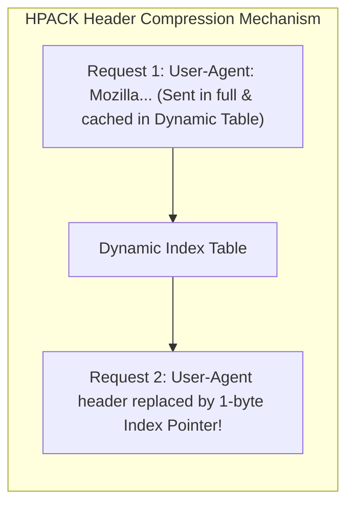
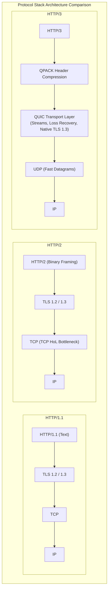
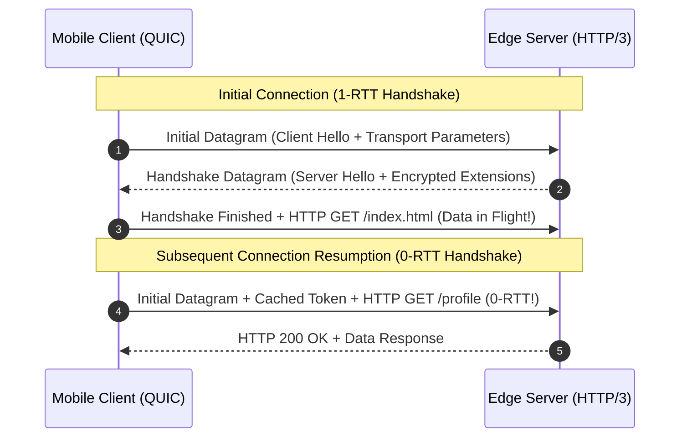

# HTTP Evolution: HTTP/1.1, HTTP/2, and HTTP/3 (QUIC)

## TL;DR
The evolution of the Hypertext Transfer Protocol represents a continuous battle against latency and Head-of-Line (HoL) blocking across physical networks.
HTTP/1.1 introduced persistent TCP connections, but was crippled by application-layer HoL blocking: requests over a single TCP connection had to be processed serially.
HTTP/2 solved application-layer HoL blocking by introducing a binary framing layer that multiplexes hundreds of concurrent requests over a single persistent TCP connection, complemented by HPACK header compression.
However, HTTP/2 introduced Transport-Layer (TCP) HoL Blocking: if a single TCP packet drops on a lossy cellular network, the kernel TCP stack halts all multiplexed streams until retransmission succeeds.
HTTP/3 discards TCP entirely in favor of QUIC over UDP, providing true independent stream multiplexing, 0-RTT connection establishment, QPACK compression, and seamless connection migration across mobile networks.
For network socket fundamentals, see [[01-CS-Foundations/Computer-Networks/notes/02-application-layer.md|Computer Networks Application Layer]].

## Mental Model
Think of HTTP/1.1 as a single-lane country road with a toll booth.
Only one car can drive through at a time.
If a slow truck (`large_image.png`) gets a flat tire, every car behind it (`app.js`, `style.css`) is stuck waiting in an endless traffic jam.
To work around this, builders paved 6 parallel single-lane roads (browsers opening 6 separate TCP connections).
Think of HTTP/2 as a modern 8-lane superhighway built on a single bridge.
Cars drive simultaneously side-by-side in distinct lanes (Stream Multiplexing).
However, the bridge sits on a single foundation (TCP).
If one boulder lands on the bridge, the highway patrol halts all 8 lanes of traffic until that single boulder is removed.
Think of HTTP/3 (QUIC) as a fleet of autonomous transport drones flying through open airspace (UDP).
Each drone flies on its own independent trajectory.
If one drone encounters a gust of wind and delays, all other drones continue flying to their destination at full speed without stopping.



## How It Works (Internals)

### 1. HTTP/1.1 (RFC 9112): Text-Based Transport and Workarounds
- **Text-Based Framing**: Requests and responses are formatted in human-readable ASCII text strings separated by CRLF (`\r\n`).
Headers are repeated in full on every request, consuming significant bandwidth.
- **Persistent Connections (`Keep-Alive`)**: Reuses the underlying TCP connection across requests rather than executing a new three-way handshake for every file.
- **Application-Layer Head-of-Line (HoL) Blocking**:
HTTP/1.1 mandates that responses must be delivered in the exact sequential order that requests were sent.
If a client requests `index.html`, followed by `slow_report.pdf`, followed by `logo.png`, the server cannot transmit `logo.png` until `slow_report.pdf` finishes generating.
- **Client-Side Workarounds**:
  - *Connection Pooling*: Browsers open up to 6 concurrent TCP connections per origin domain.
  - *Domain Sharding*: Serving static assets across multiple subdomains (`assets1.cdn.com`, `assets2.cdn.com`) to bypass the 6-connection browser limit.
  - *Image Spriting and CSS Concatenation*: Merging hundreds of icons into a single image to minimize request counts.

### 2. HTTP/2 (RFC 9113): Binary Framing and Multiplexing
HTTP/2 leaves HTTP semantics (methods, status codes, headers) unchanged, replacing the physical transport layer with a binary framing protocol.

#### A. The Binary Framing Layer
Messages are decomposed into binary frames:
- **Length (24 bits)**, **Type (8 bits)**, **Flags (8 bits)**, **Stream Identifier (31 bits)**, and **Payload**.
- **Frame Types**: `HEADERS` (carries metadata), `DATA` (carries body payload), `SETTINGS`, `RST_STREAM`, `PING`, `GOAWAY`.

#### B. Stream Multiplexing
- A single TCP connection carries multiple bidirectional Streams.
- Streams are identified by an integer: client-initiated streams use odd IDs (1, 3, 5), server-initiated use even IDs.
- Frames from different streams are interleaved on the wire without blocking one another.
A large image download on Stream 1 does not block a fast JSON API call on Stream 3.

#### C. HPACK Header Compression
- Headers represent over 70% of request payload sizes in microservices.
- HPACK compresses headers using:
  1. *Static Table*: 61 common pre-defined headers (such as index 2 = `GET /`, index 28 = `200 OK`) encoded in a single byte.
  2. *Dynamic Table*: Caches previously observed headers across the lifetime of the connection.
  3. *Huffman Encoding*: Compresses novel strings into compact bit patterns.



### 3. The Fatal Flaw of HTTP/2: TCP Head-of-Line Blocking
Despite multiplexing streams at Layer 7, HTTP/2 still runs over a single TCP stream at Layer 4:
- TCP guarantees strictly in-order byte delivery.
- If a single IP packet is dropped on a lossy network (such as 2% packet loss on a mobile cellular tower), the receiver operating system kernel holds all subsequent arrived packets in the TCP receive buffer until the lost packet is retransmitted.
- Even though the dropped packet belonged exclusively to Stream 1, all concurrent streams (Stream 2, Stream 3, Stream 4) are completely frozen by the operating system kernel.
On lossy connections ($> 2\%$ packet drop), HTTP/2 performs worse than HTTP/1.1 because HTTP/1.1's 6 separate TCP connections isolate packet loss to a single connection.

### 4. HTTP/3 and QUIC (RFC 9000 / RFC 9114)
To eliminate TCP HoL blocking, the IETF developed QUIC, which replaces TCP and TLS with a new transport protocol built directly on top of UDP.



#### A. True Independent Stream Multiplexing
- QUIC implements streams natively inside the transport layer.
- If a UDP packet carrying data for Stream 1 is lost, the kernel delivers UDP packets for Stream 2 and Stream 3 immediately to the application.
- Only Stream 1 experiences retransmission delay; other streams experience zero transport-layer HoL blocking.

#### B. 0-RTT and 1-RTT Handshake Latency
- In HTTP/1.1 and HTTP/2 over TLS 1.2:
$\text{TCP 3-Way Handshake (1 RTT)} + \text{TLS Handshake (2 RTT)} = 3\text{ RTTs}$ before application data can be sent.
- In HTTP/3:
QUIC embeds TLS 1.3 directly into the initial transport handshake.
  - *First Connection (1-RTT)*: Cryptographic keys and transport parameters are negotiated in a single round-trip.
  - *Reconnection (0-RTT)*: If the client previously communicated with the server, it uses cached cryptographic keys to transmit HTTP request payloads in the very first packet, eliminating handshake latency entirely.



#### C. Connection Migration (Surviving Mobile Network Transitions)
- In TCP, a connection is identified by the 4-tuple: `(Src IP, Src Port, Dst IP, Dst Port)`.
When a user walks out of their house, their phone disconnects from Wi-Fi (IP `192.168.1.45`) and switches to 5G cellular (IP `172.56.21.9`).
Because the source IP changes, every active TCP connection breaks instantly, forcing full reconnections.
- In QUIC, connections are identified by a 64-bit random Connection ID (CID) independent of IP address.
When the client transitions to 5G, it transmits the next UDP packet with the same Connection ID from its new IP address.
The server verifies the cryptographic CID and resumes streaming with zero disruption.

#### D. QPACK Header Compression
Because HPACK required strictly in-order frame delivery to keep dynamic tables synchronized (impossible over out-of-order UDP datagrams), HTTP/3 uses QPACK.
QPACK uses two dedicated unidirectional control streams to synchronize dynamic tables asynchronously between client and server, preventing compression stalls.

## Trade-offs and When to Use

| Architectural Metric | HTTP/1.1 | HTTP/2 | HTTP/3 (QUIC) |
| :--- | :--- | :--- | :--- |
| **Transport Protocol** | TCP | TCP | UDP (QUIC) |
| **Handshake Latency (Cold)** | 2 - 3 RTTs | 2 - 3 RTTs (TLS 1.2) / 2 RTTs (TLS 1.3) | 1 RTT |
| **Connection Resumption** | 1 - 2 RTTs | 1 RTT | 0-RTT |
| **Head-of-Line Blocking** | Application Layer (Severe) | Transport Layer (on lossy networks) | Completely Eliminated |
| **Header Compression** | None | HPACK | QPACK |
| **Network Transition Handling** | Connection drops and reconnects | Connection drops and reconnects | Seamless Connection Migration |
| **Server CPU Utilization** | Low | Medium | High (User-space UDP processing) |

## Failure Modes and Pitfalls

### 1. Enterprise Middlebox UDP Blocking
- *Failure*: Many corporate firewalls, enterprise proxies, and hotel networks block all outgoing UDP traffic on port 443, assuming UDP represents DNS amplification DDoS attacks or gaming traffic.
A client attempting pure HTTP/3 fails to connect entirely.
- *Mitigation*: Alt-Svc Fallback Negotiation.
Clients always connect to servers initially via standard HTTP/2 over TCP.
The server returns an `Alt-Svc: h3=":443"; ma=86400` header, informing the client that HTTP/3 is supported.
The client attempts an asynchronous background QUIC upgrade; if UDP is blocked, it seamlessly remains on HTTP/2 without failing user requests.

### 2. High CPU Utilization of User-Space UDP
- *Failure*: Linux kernels are heavily optimized for TCP offloading in physical network interface hardware (TSO, LRO).
Because QUIC operates over UDP in user space, every packet requires user-kernel context transitions, increasing server CPU usage by 2x to 3x compared to optimized HTTP/2 TCP stacks.
- *Mitigation*: Enable Linux eBPF/XDP socket offloading, Generic Segmentation Offload (GSO) for UDP, and compile against optimized cryptographic implementations (BoringSSL).

### 3. HPACK / QPACK State De-synchronization
- *Failure*: In an asynchronous QPACK implementation, a client references an index in the dynamic table that has not yet been acknowledged by the server.
The decoder fails, forcing an unrecoverable stream reset (`QPACK_DECOMPRESSION_FAILED`).
- *Mitigation*: Adhere to strict QPACK blocked stream limits (`SETTINGS_QPACK_BLOCKED_STREAMS`) to bound dependency chains.

## Hands-On

### 1. Standalone Python Simulation: HoL Blocking and QPACK Compression
Run this self-contained script demonstrating application-layer HoL blocking in HTTP/1.1, TCP transport HoL blocking in HTTP/2, stream isolation in HTTP/3, and QPACK table compression:

```python
#!/usr/bin/env python3
"""
Standalone HTTP Evolution Simulation: HTTP/1.1 vs HTTP/2 vs HTTP/3 (QUIC) and QPACK.
Demonstrates:
1. HTTP/1.1 Application-Layer Head-of-Line (HoL) blocking on serialized TCP connections.
2. HTTP/2 Binary Multiplexing and Transport-Layer (Layer 4 TCP) HoL blocking under packet loss.
3. HTTP/3 QUIC independent UDP datagram streams with isolated packet loss recovery.
4. QPACK dynamic table header compression and control stream synchronization.
"""

import random
from collections import deque
from typing import List, Optional, Tuple


class HTTP11Connection:
    def __init__(self, conn_id: int):
        self.conn_id = conn_id
        self.queue = deque()
        self.active_request: Optional[Tuple[str, int]] = None

    def enqueue(self, name: str, cost: int):
        self.queue.append((name, cost))

    def tick(self) -> Optional[str]:
        if not self.active_request:
            if self.queue:
                self.active_request = self.queue.popleft()
            else:
                return None

        name, remaining = self.active_request
        remaining -= 1
        if remaining <= 0:
            self.active_request = None
            return name
        else:
            self.active_request = (name, remaining)
            return None


class HTTP2TCPSimulator:
    def __init__(self, num_streams: int, packets_per_stream: int, loss_rate: float):
        self.num_streams = num_streams
        self.packets_per_stream = packets_per_stream
        self.loss_rate = loss_rate

    def run(self) -> Tuple[int, int]:
        frames = [s for s in range(self.num_streams) for _ in range(self.packets_per_stream)]
        random.shuffle(frames)

        lost_packets = 0
        first_loss: Optional[int] = None
        for pos in range(len(frames)):
            if random.random() < self.loss_rate:
                lost_packets += 1
                if first_loss is None:
                    first_loss = pos

        if first_loss is None:
            return lost_packets, 0
        delayed_streams = set(frames[first_loss:])
        return lost_packets, len(delayed_streams)


class HTTP3QUICSimulator:
    def __init__(self, num_streams: int, packets_per_stream: int, loss_rate: float):
        self.num_streams = num_streams
        self.packets_per_stream = packets_per_stream
        self.loss_rate = loss_rate

    def run(self) -> Tuple[int, int]:
        lost_packets = 0
        delayed_streams = 0

        for _ in range(self.num_streams):
            stream_loss = False
            for _ in range(self.packets_per_stream):
                if random.random() < self.loss_rate:
                    lost_packets += 1
                    stream_loss = True
            if stream_loss:
                delayed_streams += 1

        return lost_packets, delayed_streams


class QPACKCodec:
    def __init__(self, max_entries: int = 10):
        self.static_table = {
            ":authority": 1,
            ":path": 2,
            ":method": 3,
            ":scheme": 4,
            ":status": 5,
        }
        self.dynamic_table: List[Tuple[str, str]] = []
        self.max_entries = max_entries
        self.acknowledged_entries = 0

    def encode(self, name: str, value: str) -> Tuple[str, Optional[int]]:
        if name in self.static_table and value == "GET":
            return f"[StaticIndex:{self.static_table[name]}]", None

        for idx, (k, v) in enumerate(reversed(self.dynamic_table)):
            if k == name and v == value:
                return f"[DynamicIndex:{idx}]", None

        self.dynamic_table.append((name, value))
        if len(self.dynamic_table) > self.max_entries:
            self.dynamic_table.pop(0)

        new_idx = len(self.dynamic_table) - 1
        return f"[LiteralWithIndexing:{name}={value}]", new_idx

    def acknowledge_entry(self):
        if self.acknowledged_entries < len(self.dynamic_table):
            self.acknowledged_entries += 1


def run_simulation():
    print("--- 1. HTTP/1.1 Application-Layer Head-of-Line (HoL) Blocking ---")
    conn1 = HTTP11Connection(1)
    conn1.enqueue("large_hero_image.png", 5)
    conn1.enqueue("main.css", 1)
    conn1.enqueue("bundle.js", 1)

    completed = []
    for tick in range(10):
        res = conn1.tick()
        if res:
            completed.append((tick, res))

    print("HTTP/1.1 Single Connection Completion Timeline:")
    for t, item in completed:
        print(f"  Tick {t}: {item} finished (Note: CSS and JS blocked behind slow image)")

    print("\n--- 2. HTTP/2 vs HTTP/3 Under 5% Cellular Packet Loss ---")
    trials = 500
    h2_drops_total, h2_stalls_total = 0, 0
    h3_drops_total, h3_stalls_total = 0, 0

    for _ in range(trials):
        h2 = HTTP2TCPSimulator(num_streams=10, packets_per_stream=10, loss_rate=0.05)
        d2, s2 = h2.run()
        h2_drops_total += d2
        h2_stalls_total += s2

        h3 = HTTP3QUICSimulator(num_streams=10, packets_per_stream=10, loss_rate=0.05)
        d3, s3 = h3.run()
        h3_drops_total += d3
        h3_stalls_total += s3

    print(f"HTTP/2 (Shared TCP): Avg {h2_drops_total / trials:.1f} lost packets, "
          f"{h2_stalls_total / trials:.1f} of 10 streams delayed (every stream behind the first loss in TCP order)")
    print(f"HTTP/3 (QUIC/UDP):   Avg {h3_drops_total / trials:.1f} lost packets, "
          f"{h3_stalls_total / trials:.1f} of 10 streams delayed (only streams that own a lost packet)")
    assert h3_stalls_total < h2_stalls_total, "QUIC should delay fewer streams than shared TCP"
    print("Multiplexing Isolation: HTTP/3 confines each loss to its own stream, eliminating cross-stream head-of-line freezes.")

    print("\n--- 3. QPACK Dynamic Table Compression Simulation ---")
    codec = QPACKCodec(max_entries=5)
    enc1, idx1 = codec.encode("user-agent", "Mozilla/5.0")
    print(f"Request 1 Header: 'user-agent: Mozilla/5.0' -> Encoded: {enc1}")
    codec.acknowledge_entry()

    enc2, idx2 = codec.encode("user-agent", "Mozilla/5.0")
    print(f"Request 2 Header: 'user-agent: Mozilla/5.0' -> Encoded: {enc2}")
    assert "DynamicIndex" in enc2, "QPACK dynamic compression failed"
    print("QPACK Verification Passed: Repeated header compressed to dynamic table index pointer.")


if __name__ == "__main__":
    run_simulation()
```

### 2. Live Shell Commands: Inspecting Protocol Handshakes via `curl`
Test live server protocol support across versions:

```bash
# 1. Test HTTP/1.1 with explicit protocol enforcement
curl -Iv --http1.1 https://www.google.com

# 2. Test HTTP/2 with ALPN negotiation
curl -Iv --http2 https://www.google.com

# 3. Test HTTP/3 (Requires curl compiled with ngtcp2 or quiche)
curl -Iv --http3 https://cloudflare.com

# 4. Inspect Alt-Svc advertisement on standard HTTP/2
curl -sI https://www.cloudflare.com | grep -i alt-svc
```

## Performance and Capacity
- **Latency Benchmarks Across Latency Bands**:
  - *High-Bandwidth, Low-RTT (Local Fiber, RTT $< 10\text{ ms}$)*:
    HTTP/2 and HTTP/3 perform comparably; HTTP/2 occasionally wins slightly due to kernel TCP offload efficiency.
  - *High-Loss, High-RTT (Mobile 5G / Transcontinental, RTT $> 100\text{ ms}$, Loss $> 2\%$)*:
    HTTP/3 delivers 30% to 50% faster page load times (LCP) due to the elimination of transport-layer HoL blocking and 0-RTT reconnection.
- **Header Bandwidth Reduction**:
  HPACK and QPACK reduce request header bandwidth consumption from an average of $800\text{ bytes}$ per request in HTTP/1.1 down to $20\text{ bytes}$ in steady-state HTTP/2 and HTTP/3 streams.

## In Production
- **Cloudflare**: Enabled HTTP/3 across its entire global edge network.
Over 30% of global web traffic routed through Cloudflare runs over QUIC, delivering sub-second speedups for mobile users across developing regions with unstable cellular connectivity.
- **YouTube / Google Video**: Migrated video streaming infrastructure to QUIC.
Google reported an 18% reduction in video buffering rebuffers and a 3.6% reduction in search latency on desktop web browsers.

### Operational Checklist
- [ ] Ensure edge load balancers (Envoy, NGINX) advertise `Alt-Svc: h3=":443"` to allow opportunistic client HTTP/3 upgrades.
- [ ] Configure network security groups and cloud firewalls to allow inbound UDP traffic on port 443 alongside TCP port 443.
- [ ] Disable domain sharding and asset inlining optimizations, which are active anti-patterns under HTTP/2 and HTTP/3.

## Interview Questions

> [!question]
> What was the primary limitation of HTTP/1.1 that HTTP/2 was designed to solve?
> [!success]- Answer
> The primary limitation was Application-Layer Head-of-Line (HoL) Blocking.
> In HTTP/1.1, pipelined requests over a single TCP connection had to be answered in the exact sequential order they were received.
> A slow or heavy request blocked all subsequent requests queued behind it on that connection.
> HTTP/2 solved this by introducing binary stream multiplexing, allowing multiple concurrent requests and responses to be interleaved as independent frames over a single TCP connection simultaneously.

> [!question]
> If HTTP/2 multiplexes streams over a single connection, why does it perform worse than HTTP/1.1 on lossy networks?
> [!success]- Answer
> Because HTTP/2 runs on top of a single TCP connection, which enforces strict in-order byte delivery at Layer 4.
> If a single packet drops on a lossy network, the operating system TCP receive buffer halts delivery of all subsequent arrived packets until the dropped packet is retransmitted.
> Even though the lost packet belonged to only one stream, all multiplexed streams are frozen at the OS kernel level (Transport-Layer HoL Blocking).
> HTTP/1.1, which opens 6 independent TCP connections, isolates packet loss to only one connection, leaving the other 5 unaffected.

> [!question]
> What is QUIC, and what transport protocol does it use?
> [!success]- Answer
> QUIC is a transport layer protocol originally designed by Google and standardized by the IETF in RFC 9000.
> It runs on top of UDP rather than TCP.
> QUIC implements connection establishment, reliability, congestion control, stream multiplexing, and TLS 1.3 encryption natively inside its own protocol in user space, serving as the foundational transport engine for HTTP/3.

> [!question]
> Explain how Connection Migration works in HTTP/3 and why it is impossible in HTTP/2.
> [!success]- Answer
> In HTTP/2, a connection is identified by the standard TCP 4-tuple: source IP, source port, destination IP, and destination port.
> When a mobile device switches from Wi-Fi to cellular data, its source IP changes, instantly breaking the TCP connection and forcing a new handshake.
> In HTTP/3, QUIC identifies connections using a 64-bit random Connection ID (CID) independent of IP address.
> When the network interface changes, the client transmits UDP packets carrying the existing CID from its new IP address.
> The server validates the cryptographic CID and seamlessly continues the session with zero connection disruption.

> [!question]
> What is 0-RTT connection resumption in HTTP/3, and what security vulnerability must engineers defend against?
> [!success]- Answer
> In 0-RTT resumption, a client that previously connected to a server caches the server session parameters and pre-shared keys.
> Upon reconnecting, the client encrypts and transmits the HTTP request in the very first UDP packet before receiving any response from the server, eliminating handshake latency.
> The critical security vulnerability is Replay Attacks.
> Because 0-RTT data is sent before cryptographic forward secrecy keys are negotiated, an eavesdropper can intercept and re-transmit that packet.
> Servers must strictly forbid 0-RTT on non-idempotent mutations like `POST /payment`, permitting 0-RTT only on safe, idempotent `GET` requests.

> [!question]
> Why did HTTP/2 Server Push largely fail in production and get deprecated in major browser engines?
> [!success]- Answer
> HTTP/2 Server Push allowed the server to speculatively push resources to the client before the client requested them.
> It failed in production due to three architectural flaws.
> First, Cache Blindness: the server could not determine whether the client already had the resource in its local browser cache, often pushing duplicate data and wasting mobile bandwidth.
> Second, Bandwidth Competition: pushed assets competed with critical HTML and render-blocking scripts on the shared TCP connection, worsening Core Web Vitals like Largest Contentful Paint.
> Third, Implementation Complexity: servers struggled to accurately predict asset dependency trees.
> It was superseded by the `103 Early Hints` status code.

> [!question]
> How does QPACK solve the compression dependency deadlock that prevented HPACK from being used in HTTP/3?
> [!success]- Answer
> HPACK relies on strictly sequential in-order packet arrival because every header frame modifies a shared dynamic table state.
> Over UDP, datagrams can arrive out of order or be lost.
> If Stream 2 arrives before Stream 1, and Stream 2 references a dynamic table entry created by Stream 1, HPACK decompressors dead-lock.
> QPACK solves this by decoupling header compression from stream data.
> It uses two dedicated unidirectional control streams (Encoder Stream and Decoder Stream) to manage dynamic table updates and send acknowledgments.
> It also provides an instruction set that allows literal emission without blocking when dynamic entries are unconfirmed.

> [!question]
> How would you architect an enterprise edge ingress infrastructure to support HTTP/3 without risking outages from corporate firewalls that block UDP?
> [!success]- Answer
> Deploy a dual-protocol ingress architecture with Alt-Svc Negotiation.
> First, bind the edge reverse proxy (Envoy or Cloudflare) to both TCP:443 and UDP:443 on the same virtual IP.
> Second, when a client connects via standard HTTPS (HTTP/2 over TCP), return the header `Alt-Svc: h3=":443"; ma=86400`.
> Third, the client browser caches this hint and attempts an opportunistic background QUIC handshake on subsequent requests.
> Fourth, if the corporate firewall blocks UDP, the QUIC probe times out silently, and the client continues using HTTP/2 over TCP with zero user-facing error or latency penalty.
> Fifth, terminate both HTTP/2 and HTTP/3 at the edge proxy, forwarding traffic to internal microservices over persistent gRPC or HTTP/2 connections.

> [!question]
> What is the HTTP/2 Rapid Reset DDoS attack (CVE-2023-44487), and how do reverse proxies mitigate it?
> [!success]- Answer
> The HTTP/2 Rapid Reset vulnerability exploits the protocol stream cancellation mechanism.
> An attacker transmits a stream `HEADERS` frame immediately followed by a `RST_STREAM` frame in rapid succession over a single multiplexed TCP connection.
> The server allocates request processing structures and initiates backend execution before receiving the reset.
> Because the client immediately cancels the stream, it never hits the client-side concurrent stream limit (`SETTINGS_MAX_CONCURRENT_STREAMS`), enabling millions of requests per second that exhaust server CPU and memory.
> Edge proxies mitigate this by enforcing rate limits on `RST_STREAM` frame frequency and closing TCP connections when the ratio of resets to total streams exceeds normal operational thresholds.

> [!question]
> How does the `103 Early Hints` informational status code optimize the critical rendering path compared to legacy HTTP/2 Server Push?
> [!success]- Answer
> When a client requests a page, the origin server often spends 100 to 500 milliseconds executing database queries and rendering HTML templates before emitting HTTP 200 OK.
> With `103 Early Hints`, the edge proxy or origin emits an immediate provisional response containing `Link: </style.css>; rel=preload` headers while backend processing continues.
> The client browser receives these hints and initiates parallel subresource fetches immediately, filling the idle network window.
> Unlike Server Push, the browser checks its local disk and memory cache before requesting the asset, eliminating duplicate downloads and accelerating First Contentful Paint without cache blindness.

## Related
- [[REST-APIs|REST APIs]]: High-level application semantics over HTTP.
- [[gRPC-and-Protocol-Buffers|gRPC and Protocol Buffers]]: Binary RPC framework utilizing HTTP/2 transport.
- [[01-CS-Foundations/Computer-Networks/notes/02-application-layer.md|Computer Networks Application Layer]]: Academic networking foundations.

## Further Reading
- Grigorik, Ilya. *High Performance Browser Networking*. O'Reilly Media, 2013.
- Iyengar, Jana, and Martin Thomson. "QUIC: A UDP-Based Multiplexed and Secure Transport." *RFC 9000* (2021).
- Bishop, Mike. "HTTP/3." *RFC 9114* (2022).
- Langley, Adam, et al. "The QUIC transport protocol: Design and Internet-scale deployment." *Proceedings of the conference of the ACM special interest group on data communication (SIGCOMM)*. 2017.
