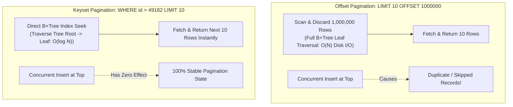
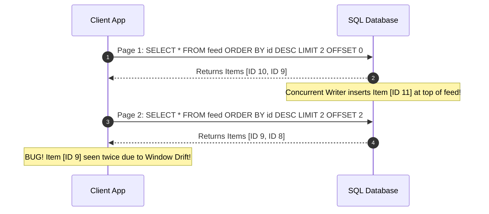
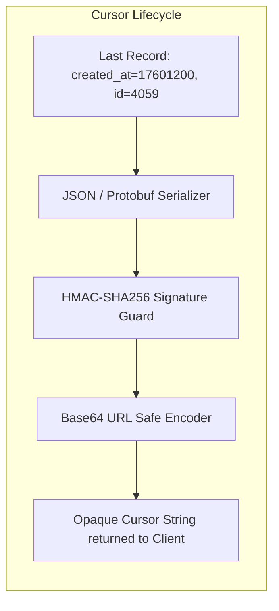

# Pagination Strategies: Offset, Keyset, and Cursor-Based Pagination

## TL;DR
Pagination breaks massive database result sets into manageable discrete pages, preserving server memory, network bandwidth, and client rendering performance.
Offset Pagination (`OFFSET N LIMIT M`) is simple and permits jumping to arbitrary page numbers, but suffers from two catastrophic flaws: $O(N)$ database query degradation on deep offsets, and Window Drift (duplicate or skipped items caused by concurrent inserts or deletes).
Keyset Pagination (Seek Method) uses the value of the last seen record's indexed attributes (`WHERE id > :last_id LIMIT M`), transforming queries into constant-time $O(\log N)$ B+Tree index seeks regardless of dataset size.
Cursor-Based Pagination serializes and encodes the keyset into an opaque, client-facing token (often Base64 with HMAC tamper-proofing), decoupling client applications from internal database schemas while guaranteeing deterministic page transitions under concurrent writes.

## Mental Model
Imagine searching for a specific chapter in an encyclopedic 1,000-page book.
Offset Pagination is like a reader who, to reach page 500, opens the front cover and manually flips through every single page from 1 to 499, counting them one by one, before finally reading page 500.
If someone tears out page 50 while you are reading page 100, your count shifts, and you read page 101 twice.
Keyset and Cursor Pagination is like placing a physical bookmark between the pages.
To resume reading, you immediately flip the book open directly to your bookmark in half a second, regardless of whether your bookmark is on page 10 or page 999.
Even if someone inserts 5 new pages at the beginning of the book, your bookmark remains anchored to its exact contextual position.



## How It Works (Internals)

### 1. Strategy 1: Offset-Based Pagination (`OFFSET / LIMIT`)
The traditional approach supported by all SQL databases:
```sql
SELECT id, title, created_at
FROM articles
ORDER BY created_at DESC
LIMIT 20 OFFSET 40; -- Page 3
```

#### A. Database Engine Execution Plan
A database engine cannot jump directly to row 1,000,000 in a B+Tree.
Rows are not stored at fixed physical byte offsets because rows have variable-length attributes (`VARCHAR`, `TEXT`).
When executing `OFFSET 1000000 LIMIT 20`:
1. The storage engine locates the start of the index.
2. It sequentially traverses the leaf nodes of the B+Tree, reading, processing, and discarding 1,000,000 rows.
3. It retains only the final 20 rows and returns them to the query executor.
4. Execution time scales linearly as $O(N)$ with offset depth, consuming vast disk I/O and buffer pool memory.

#### B. The Window Drift (Data Drift) Flaw
When records are added or removed concurrently, offset pagination corrupts results:
- **Duplicate Records**:
  1. User loads Page 1 (`LIMIT 10 OFFSET 0`), viewing items 1 to 10.
  2. While the user is reading, a new item is inserted at the top of the feed (becoming item 1).
  3. The previous item 10 shifts down to position 11.
  4. User clicks Page 2 (`LIMIT 10 OFFSET 10`).
  5. The server returns items 11 through 20.
  6. The user observes item 10 a second time on Page 2.
- **Skipped Records**:
  If an item on Page 1 is deleted, items shift upward, causing the original item 11 to slide into position 10, completely disappearing from the user's view when they navigate to Page 2.



### 2. Strategy 2: Keyset (Seek) Pagination
Instead of telling the database how many rows to skip, Keyset pagination tells the database where to resume scanning using the indexed attributes of the last seen record:
```sql
-- Fetch Page 1:
SELECT id, title, created_at
FROM articles
ORDER BY id DESC
LIMIT 20;

-- Fetch Page 2:
SELECT id, title, created_at
FROM articles
WHERE id < 4059
ORDER BY id DESC
LIMIT 20;
```

#### A. Database Engine Execution Plan
The query planner converts `WHERE id < 4059` into an Index Seek:
1. The B+Tree is traversed from root to leaf in $O(\log N)$ steps (typically 3 to 4 page lookups).
2. The engine lands directly on index record `4058`.
3. It reads the next 20 contiguous leaf rows and halts execution immediately.
4. Execution time for page 50,000 is identical to page 1 ($< 1\text{ ms}$).

#### B. Handling Multi-Column Sorting
When sorting by non-unique attributes (such as `created_at`), ties must be deterministically broken using the primary key `id`:
```sql
-- Sort by created_at DESC, id DESC:
SELECT id, title, created_at
FROM articles
WHERE (created_at, id) < ('2026-10-06 14:00:00', 4059)
ORDER BY created_at DESC, id DESC
LIMIT 20;
```
Using SQL row-value comparison `(created_at, id) < (:last_date, :last_id)` allows the database engine to perform a composite index seek over a multi-column index `(created_at, id)`.

### 3. Strategy 3: Cursor-Based Pagination
Exposing internal database column values (`created_at`, `id`) directly to external REST clients tightly couples clients to database implementation and invites client tampering.
Cursor-Based Pagination encapsulates the keyset values inside an opaque, encoded token:
1. The server serializes the last record's keyset tuple into a structured format (JSON or Protobuf).
2. The server signs the payload using an HMAC secret to prevent client tampering.
3. The server Base64-encodes the string and returns it as a cursor:
`"cursor": "eyJjcmVhdGVkX2F0IjoxNzYwMTIwMCwiaWQiOjQwNTl9.a7f9b2..."`
4. The client supplies the cursor on the next request:
`GET /v1/articles?limit=20&after=eyJjcmVhdGVkX2F0IjoxNzYwMT...`
5. The server decodes, verifies HMAC signature, extracts the keyset values, and executes the keyset SQL seek.



## Trade-offs and When to Use

| Characteristic | Offset Pagination (`OFFSET N`) | Keyset / Cursor Pagination (`WHERE id > K`) |
| :--- | :--- | :--- |
| **Performance on Deep Pages** | Collapses to $O(N)$ (High disk I/O, slow) | Constant $O(\log N)$ (Sub-millisecond index seek) |
| **Data Drift Resistance** | Vulnerable (Duplicate / skipped records) | Immune (100% stable under concurrent writes) |
| **Random Page Navigation** | Native (Jump directly to Page 42) | Impossible (Must traverse sequentially) |
| **Complex Multi-Column Sort** | Trivial (`ORDER BY a, b, c`) | Complex (Requires composite keyset tuples) |
| **Bidirectional Traversal** | Trivial (`OFFSET = (page - 1) * limit`) | Requires reversing sort direction (`ORDER BY ASC`) |
| **Best Application** | Internal admin tables with $< 1,000$ rows | Infinite scroll feeds, public APIs, big datasets |

### Decision Rules
1. **Choose Keyset / Cursor Pagination when:**
   - Building mobile feeds, activity streams, e-commerce catalog infinite scroll, or public high-scale REST APIs (such as Stripe, Twitter, GitHub).
   - Datasets exceed 100,000 rows where users traverse past page 5.
   - Real-time inserts and deletes occur frequently, making duplicate or skipped items unacceptable to the user experience.
2. **Choose Offset Pagination when:**
   - Building internal back-office admin portals where human operators demand a specific page selector ("Jump to page 18 of 50").
   - The total dataset is strictly bounded (such as $< 1,000$ rows) where $O(N)$ scanning latency is imperceptible ($< 2\text{ ms}$).

## Failure Modes and Pitfalls

### 1. The Non-Unique Sort Key Pitfall in Keyset Pagination
- *Failure*: A developer orders by `created_at`:
`WHERE created_at < :last_seen_date ORDER BY created_at DESC LIMIT 20;`
If 50 articles were published in a batch with the exact same millisecond timestamp, the keyset query skips all remaining articles sharing that timestamp, permanently losing data from the user's view.
- *Mitigation*: Mandate a Unique Tie-Breaker Column.
Always append the unique primary key to the order clause:
`ORDER BY created_at DESC, id DESC`.

### 2. Cursor Tampering and Internal Schema Leakage
- *Failure*: An API Base64-encodes an internal SQL snippet into the cursor without cryptographic signatures.
An attacker decodes the cursor, injects SQL parameters or alters their tenant ID, and submits the tampered cursor to access other tenants' private data.
- *Mitigation*: Sign all opaque cursor strings with an HMAC signature (`HMAC-SHA256`), and validate tenant ownership at the database query layer.

### 3. Missing Composite Indexes
- *Failure*: A query uses keyset pagination on `WHERE (status = 'ACTIVE' AND created_at < :t AND id < :id)`, but the database only holds an index on `id`.
The query planner cannot perform an index seek on `(created_at, id)`, falling back to a full sequential table scan that performs worse than offset pagination.
- *Mitigation*: Create an explicit composite index matching the keyset predicate:
`CREATE INDEX idx_articles_status_created_id ON articles (status, created_at DESC, id DESC);`.

## Hands-On

### 1. Standalone Python Simulation: Offset vs Keyset and Secure Cursors
Run this self-contained script demonstrating algorithmic scan costs, window drift reproduction, and cryptographically signed cursor encoding:

```python
#!/usr/bin/env python3
"""
Standalone Pagination Strategy Simulation: Offset vs Keyset vs Secure Cursor.
Demonstrates:
1. Algorithmic scan cost comparison: Offset O(N) scan & discard vs Keyset O(log N) binary search seek.
2. Window Drift demonstration: Concurrent inserts causing duplicate records in Offset vs immunity in Keyset.
3. Cryptographically signed opaque cursors (HMAC-SHA256) preventing tampering and schema leakage.
"""

import base64
import bisect
import hashlib
import hmac
import json
import time
from typing import Any, Dict, List, Optional, Tuple

SECRET_KEY = b"vault-pagination-hmac-secret-32b"


class Item:
    def __init__(self, record_id: int, created_at: int, title: str):
        self.record_id = record_id
        self.created_at = created_at
        self.title = title

    def __lt__(self, other: "Item"):
        if self.created_at != other.created_at:
            return self.created_at > other.created_at
        return self.record_id > other.record_id

    def to_dict(self):
        return {"id": self.record_id, "t": self.created_at, "title": self.title}


class MockDatabase:
    def __init__(self, count: int = 100_000):
        self.items: List[Item] = []
        base_time = 1760000000
        for i in range(count, 0, -1):
            self.items.append(Item(i, base_time + i, f"Article {i}"))

    def query_offset(self, limit: int, offset: int) -> Tuple[List[Item], int]:
        scanned_rows = 0
        total_to_read = min(len(self.items), offset + limit)
        for idx in range(total_to_read):
            scanned_rows += 1
        results = self.items[offset:offset + limit]
        return results, scanned_rows

    def query_keyset(self, limit: int, last_time: Optional[int] = None, last_id: Optional[int] = None) -> Tuple[List[Item], int]:
        if last_time is None or last_id is None:
            return self.items[:limit], 1

        dummy = Item(last_id, last_time, "")
        idx = bisect.bisect_right(self.items, dummy)
        results = self.items[idx:idx + limit]
        scanned_rows = len(results)
        return results, scanned_rows

    def insert_top(self, record_id: int, created_at: int, title: str):
        item = Item(record_id, created_at, title)
        self.items.insert(0, item)


class CursorCodec:
    @staticmethod
    def encode(created_at: int, record_id: int) -> str:
        payload = json.dumps({"t": created_at, "id": record_id}, separators=(",", ":")).encode("utf-8")
        sig = hmac.new(SECRET_KEY, payload, hashlib.sha256).digest()
        token = base64.urlsafe_b64encode(payload).decode("utf-8") + "." + base64.urlsafe_b64encode(sig).decode("utf-8")
        return token

    @staticmethod
    def decode(token: str) -> Tuple[int, int]:
        parts = token.split(".")
        if len(parts) != 2:
            raise ValueError("Malformed cursor token structure")
        payload = base64.urlsafe_b64decode(parts[0])
        sig = base64.urlsafe_b64decode(parts[1])
        expected_sig = hmac.new(SECRET_KEY, payload, hashlib.sha256).digest()
        if not hmac.compare_digest(sig, expected_sig):
            raise ValueError("HMAC signature verification failed: Tampering detected!")
        data = json.loads(payload.decode("utf-8"))
        return data["t"], data["id"]


def run_simulation():
    print("--- 1. Algorithmic Cost: Deep Page Scan (Offset vs Keyset) ---")
    db = MockDatabase(count=100_000)
    limit = 20
    deep_offset = 80_000

    offset_items, offset_scanned = db.query_offset(limit=limit, offset=deep_offset)
    print(f"Offset Pagination (Page 4,000): Scanned and traversed {offset_scanned:,} rows to return {len(offset_items)} rows")

    last_item_before_page = db.items[deep_offset - 1]
    keyset_items, keyset_scanned = db.query_keyset(limit=limit, last_time=last_item_before_page.created_at, last_id=last_item_before_page.record_id)
    print(f"Keyset Pagination (Page 4,000): B+Tree seek directly retrieved {keyset_scanned} rows")
    assert [x.record_id for x in offset_items] == [x.record_id for x in keyset_items], "Results mismatch"
    print(f"I/O Efficiency: Keyset eliminated {offset_scanned - keyset_scanned:,} discarded row scans.")

    print("\n--- 2. Window Drift Under Concurrent Writes ---")
    small_db = MockDatabase(count=10)
    p1_offset, _ = small_db.query_offset(limit=2, offset=0)
    p1_keyset, _ = small_db.query_keyset(limit=2)
    print(f"Page 1 (Both): {[x.record_id for x in p1_offset]}")

    small_db.insert_top(record_id=11, created_at=1760000000 + 11, title="Article 11")
    print("Concurrent Writer: Inserted Article 11 at top of feed!")

    p2_offset, _ = small_db.query_offset(limit=2, offset=2)
    print(f"Page 2 (Offset): {[x.record_id for x in p2_offset]} (Notice ID 9 is duplicated!)")
    assert p1_offset[1].record_id == p2_offset[0].record_id, "Window drift duplicate not observed"

    last_p1 = p1_keyset[-1]
    p2_keyset, _ = small_db.query_keyset(limit=2, last_time=last_p1.created_at, last_id=last_p1.record_id)
    print(f"Page 2 (Keyset): {[x.record_id for x in p2_keyset]} (Correct IDs 8 and 7, zero drift!)")
    assert p2_keyset[0].record_id == 8 and p2_keyset[1].record_id == 7, "Keyset failed to maintain stability"

    print("\n--- 3. Cryptographically Signed Cursors ---")
    cursor = CursorCodec.encode(created_at=1760124800, record_id=90842)
    print(f"Generated Opaque Client Cursor: '{cursor}'")
    t, rec_id = CursorCodec.decode(cursor)
    print(f"Decoded Parameters: created_at={t}, id={rec_id}")

    tampered = cursor[:-4] + "FFFF"
    try:
        CursorCodec.decode(tampered)
        assert False, "Should have failed verification"
    except ValueError as e:
        print(f"Tamper Verification Passed: {e}")


if __name__ == "__main__":
    run_simulation()
```

### 2. SQL Schema: Demonstrating Window Drift vs Keyset Stability
```sql
-- Setup test table
CREATE TABLE feed (
    id SERIAL PRIMARY KEY,
    content TEXT
);
INSERT INTO feed (content) VALUES ('Item 1'), ('Item 2'), ('Item 3'), ('Item 4');

-- Client fetches Page 1 (IDs 4 and 3)
SELECT * FROM feed ORDER BY id DESC LIMIT 2 OFFSET 0;

-- Concurrent process inserts a new record at the top
INSERT INTO feed (content) VALUES ('Item 5');

-- Client fetches Page 2 using OFFSET (Returns IDs 3 and 2! ID 3 is read twice!)
SELECT * FROM feed ORDER BY id DESC LIMIT 2 OFFSET 2;

-- In contrast, Keyset Pagination using last seen ID (ID 3):
-- (Correctly returns IDs 2 and 1 with zero duplicates, unaffected by Item 5!)
SELECT * FROM feed WHERE id < 3 ORDER BY id DESC LIMIT 2;
```

## Performance and Capacity
- **Latency Comparison at Depth**:
  Benchmarking a PostgreSQL table with 10,000,000 rows on an indexed `(created_at, id)`:
  - Page 1 (`LIMIT 20 OFFSET 0`): Execution time $\approx 0.08\text{ ms}$.
  - Page 1,000 (`LIMIT 20 OFFSET 20,000`): Execution time $\approx 8.4\text{ ms}$.
  - Page 50,000 (`LIMIT 20 OFFSET 1,000,000`): Execution time $\approx 420.0\text{ ms}$ (Scans and drops 1M rows).
  - Keyset Query at Page 50,000 (`WHERE (created_at, id) < (:t, :id) LIMIT 20`):
    Execution time $\approx 0.12\text{ ms}$ (3,500x faster).

## In Production
- **Stripe API**: Standardized cursor pagination across all endpoints.
List responses return `"has_more": true`, `"data": [...]`.
Clients paginate using `starting_after: "ch_1Nq..."` or `ending_before: "ch_1Nq..."`.
Stripe explicitly rejects offset parameters to protect database infrastructure from deep-scan queries.
- **Slack Real-Time Messaging API**: Uses cursor-based pagination for conversation history (`conversations.history`).
Because active channels receive hundreds of messages per minute, offset pagination would constantly shift results; Slack cursors guarantee deterministic chronological reads.

### Operational Checklist
- [ ] For all public REST APIs, deprecate `offset` parameters and replace them with opaque `cursor` tokens.
- [ ] Verify that every keyset query includes a unique tie-breaker attribute in the `ORDER BY` clause.
- [ ] Create composite indexes matching the exact order and direction of keyset sorting.

## Interview Questions

> [!question]
> Why does `LIMIT 20 OFFSET 1000000` perform poorly in a relational database?
> [!success]- Answer
> Relational databases do not store variable-length rows at fixed physical byte offsets.
> To evaluate `OFFSET 1000000 LIMIT 20`, the database engine must sequentially scan, read, and discard 1,000,000 rows from the index or table before retaining the final 20 rows.
> Execution time scales linearly ($O(N)$) with offset depth, saturating disk I/O, buffer pools, and CPU cycles.

> [!question]
> Explain the Window Drift bug in offset pagination and how it affects end users.
> [!success]- Answer
> Window Drift occurs when rows are inserted or deleted while a user is paginating through a dataset.
> If a new row is inserted at the beginning of the table while the user is reading Page 1, all existing rows shift down by one position.
> When the user requests Page 2 (`OFFSET 10`), the row that was originally at position 10 now sits at position 11, causing that item to be displayed a second time on Page 2.
> Conversely, deletions cause rows to shift upward, skipping items entirely.

> [!question]
> How does Keyset Pagination achieve constant-time $O(\log N)$ query execution regardless of page depth?
> [!success]- Answer
> Instead of scanning and discarding $N$ rows, Keyset pagination uses the attributes of the last seen record in a `WHERE` clause: `WHERE id < :last_seen_id ORDER BY id DESC LIMIT 20`.
> The database query engine converts this condition into an Index Seek.
> It navigates the B+Tree index from root to leaf in $O(\log N)$ steps, lands directly on the target record, and reads the next 20 contiguous rows, resulting in sub-millisecond execution times even on page 100,000.

> [!question]
> How do you handle pagination when sorting by a non-unique column like `created_at` or `view_count`?
> [!success]- Answer
> If the sorting attribute is non-unique, multiple records may share the exact same value.
> If keyset pagination only filters by that column (`WHERE created_at < :last_time`), all records sharing that timestamp after the limit boundary are skipped and lost from view.
> To fix this, you must append a unique column (such as `id`) as a deterministic tie-breaker.
> Sort by `ORDER BY created_at DESC, id DESC`, and filter using composite row-value comparisons: `WHERE (created_at, id) < (:last_time, :last_id)`.

> [!question]
> What is the difference between Keyset Pagination and Cursor-Based Pagination?
> [!success]- Answer
> Keyset pagination is the underlying database query technique that uses indexed values in a `WHERE` clause instead of `OFFSET`.
> Cursor-based pagination is the API design pattern that encapsulates the keyset values into an opaque, client-facing token (typically Base64-encoded and HMAC-signed).
> Cursors decouple the client application from internal database column names and prevent clients from tampering with pagination state.

> [!question]
> How would you design a bidirectional cursor pagination system supporting both forward and backward navigation?
> [!success]- Answer
> The API supports two query parameters: `after` (fetch next page) and `before` (fetch previous page).
> For `after=<cursor>`, decode the cursor tuple `(:t, :id)` and execute `WHERE (created_at, id) < (:t, :id) ORDER BY created_at DESC, id DESC LIMIT :limit + 1`.
> Fetching `limit + 1` allows the server to verify whether another page exists (`has_next_page = true`).
> For `before=<cursor>`, reverse the comparison and sort direction in SQL: `WHERE (created_at, id) > (:t, :id) ORDER BY created_at ASC, id ASC LIMIT :limit + 1`.
> Before returning to the client, reverse the resulting list in application memory so it returns in normal descending chronological order.

> [!question]
> What are the trade-offs of using SQL Row-Value Comparison `(col1, col2) < (:v1, :v2)` versus expanded Boolean logic in distributed databases?
> [!success]- Answer
> SQL Row-Value comparison `(a, b) < (:va, :vb)` is clean and standardized, but older database engines or distributed NewSQL query planners often fail to optimize tuple syntax into an index seek, falling back to a full table scan.
> The expanded Boolean equivalent is `WHERE a < :va OR (a = :va AND b < :vb)`.
> While mathematically identical, the `OR` clause can prevent query optimizers from using a composite B+Tree index effectively.
> For maximum performance across diverse engines (PostgreSQL, MySQL, CockroachDB), verify execution plans via `EXPLAIN` to ensure the optimizer executes an Index Condition seek rather than a Filter scan.

> [!question]
> How would you satisfy a product requirement for Jump to Page N in a multi-million-row database where offset pagination causes outages?
> [!success]- Answer
> Direct page jumps are fundamentally incompatible with keyset pagination.
> To satisfy the product requirement safely, implement one of three architectural patterns.
> First, enforce a hard upper bound on offsets, permitting offset pagination only up to Page 50 or 1,000 rows, which keeps scan latency under 20 milliseconds.
> Second, maintain a Sparse Checkpoint Index via a background job that records the keyset cursor for every 100th page, allowing small bounded scans from the nearest checkpoint.
> Third, replace arbitrary page numbers with search and filter facets such as date ranges or alphabetical groupings that naturally partition data into small result sets.

> [!question]
> How does the GraphQL Relay Cursor Connections specification standardize pagination across modern frontend clients?
> [!success]- Answer
> The Relay Connection specification standardizes list pagination using four primary types: Connection, Edge, Node, and PageInfo.
> A Connection represents the paginated collection, containing a list of `edges` where each edge wraps a `node` (the entity) and an opaque `cursor` string.
> Crucially, the connection embeds a `pageInfo` object with boolean flags `hasNextPage` and `hasPreviousPage`, alongside `startCursor` and `endCursor`.
> This structure allows frontend client libraries (such as Relay and Apollo Client) to automate cache merging, optimistic UI updates, and bidirectional infinite scrolling without custom pagination code.

> [!question]
> How do distributed databases use Time-UUIDs or Snowflake IDs to implement globally ordered keyset pagination without coordinate clock skew?
> [!success]- Answer
> Distributed databases like Apache Cassandra, CockroachDB, and DynamoDB cannot rely on auto-incrementing serial integers across distributed leaderless nodes.
> Instead, they generate 64-bit or 128-bit monotonically increasing identifiers (such as Twitter Snowflake IDs or UUIDv7) that embed a 48-bit millisecond timestamp followed by machine ID and sequence numbers.
> Because the timestamp occupies the most significant bits, sorting by ID naturally produces chronological order without requiring a secondary tie-breaker column.
> If minor physical clock skew occurs across nodes, the ID ordering provides total causal ordering for keyset seeks (`WHERE id < :cursor_id`), eliminating window drift without distributed coordination locks.

## Related
- [[API-Fundamentals|API Fundamentals]]: Contract design and rate limiting.
- [[REST-APIs|REST APIs]]: HATEOAS link headers for pagination (`rel="next"`).
- [[PostgreSQL-Architecture|PostgreSQL Architecture]]: B+Tree indexing and execution plans.
- [[MySQL-and-InnoDB|MySQL and InnoDB]]: Clustered index traversal mechanics.

## Further Reading
- Winand, Markus. "Use The Index, Luke!: Paging Through Results." *use-the-index-luke.com* (2012).
- Kleppmann, Martin. "Designing Data-Intensive Applications." *O'Reilly Media* (2017).
- Richardson, Leonard, and Mike Amundsen. *RESTful Web APIs*. O'Reilly Media, 2013.
- Slack Engineering. "Evolving API Pagination at Slack." *Slack Engineering Blog* (2019).
