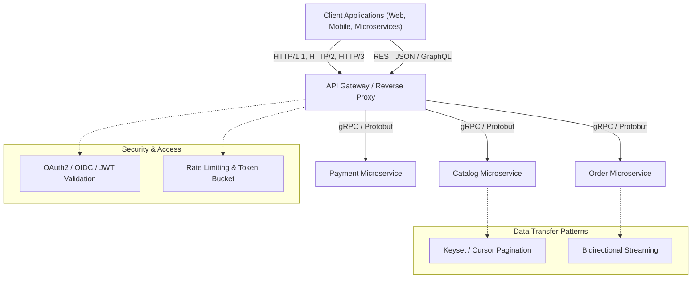

# APIs and Network Communication Protocols

## Map of Content

Modern distributed systems rely on heterogeneous communication paradigms spanning synchronous RPCs, resource-oriented RESTful interfaces, flexible GraphQL query graphs, and high-performance binary framing protocols.
This module covers the architectural design, wire protocols, serialization mechanisms, security boundaries, and scaling patterns required to engineer fault-tolerant, high-throughput APIs.

## Core Knowledge Areas

### 1. Interface Paradigms
- [[API-Fundamentals]]: Structural API styles, contract design, idempotency invariants, versioning lifecycles, and backward compatibility.
- [[REST-APIs]]: Richardson Maturity Model, HATEOAS, RESTful constraints, HTTP verbs, and caching headers.
- [[GraphQL]]: Schema definition language (SDL), abstract syntax tree execution, resolver lifecycles, DataLoader pattern, and solving N+1 query cascades.
- [[gRPC-and-Protocol-Buffers]]: Protocol Buffers encoding, varints, zigzag encoding, HTTP/2 multiplexing, and bidirectional streaming RPCs.

### 2. Transport and Serialization Protocols
- [[HTTP-Evolution-HTTP1-HTTP2-HTTP3]]: Evolution from text framing and head-of-line blocking in HTTP/1.1, to binary HPACK multiplexing in HTTP/2, to QUIC UDP transport and 0-RTT handshakes in HTTP/3.

### 3. API Patterns and Invariants
- [[Pagination-Strategies]]: Comparative analysis of offset/limit paging, seek-based keyset pagination, and cursor encoding with performance benchmarks over large datasets.

### 4. Edge Security and Identity
- [[API-Authentication-and-Authorization]]: Mutual TLS (mTLS), API keys, OAuth 2.0 grant flows, OpenID Connect (OIDC), stateless JSON Web Tokens (JWT), token revocation, and RBAC/ABAC enforcement.

## Comparative Decision Matrix

| Dimension | REST | GraphQL | gRPC |
| :--- | :--- | :--- | :--- |
| **Transport Protocol** | HTTP/1.1, HTTP/2 | HTTP/1.1, HTTP/2 | HTTP/2 exclusively |
| **Payload Format** | JSON, XML, Form-encoded | JSON | Protocol Buffers (Binary) |
| **Contract Definition** | OpenAPI / Swagger (optional) | GraphQL SDL (mandatory) | `.proto` IDL (mandatory) |
| **Streaming Support** | SSE, Chunked transfer | Subscriptions (WebSocket/SSE) | Native 4-mode streaming |
| **Network Overhead** | Moderate to High (text headers, verbose JSON) | Moderate (text JSON, large query strings) | Minimal (compressed binary framing, HPACK) |
| **Best Used For** | Public developer APIs, web CRUD | Complex frontend data graphs, mobile clients | Internal east-west service-to-service communication |

## Study and Interview Roadmap

1. Understand the exact trade-off between REST and gRPC for internal service communication versus public egress.
2. Master how HTTP/2 multiplexing differs from HTTP/1.1 pipelining and how QUIC addresses transport head-of-line blocking.
3. Be prepared to implement cursor pagination schemas and explain why `OFFSET` degrades linearly with offset depth at scale.
4. Practice drawing complete OAuth 2.0 authorization code flows with PKCE and explaining JWT revocation strategies.
