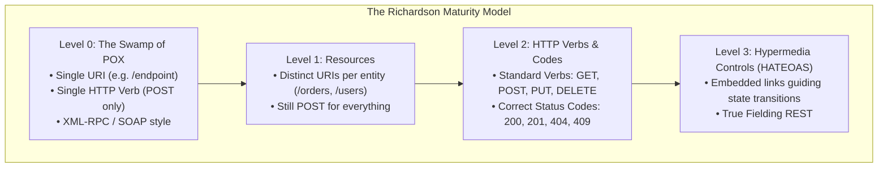
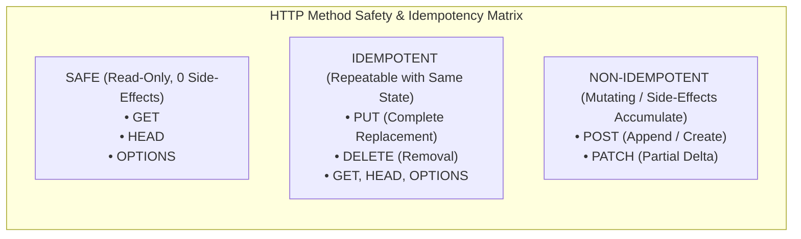
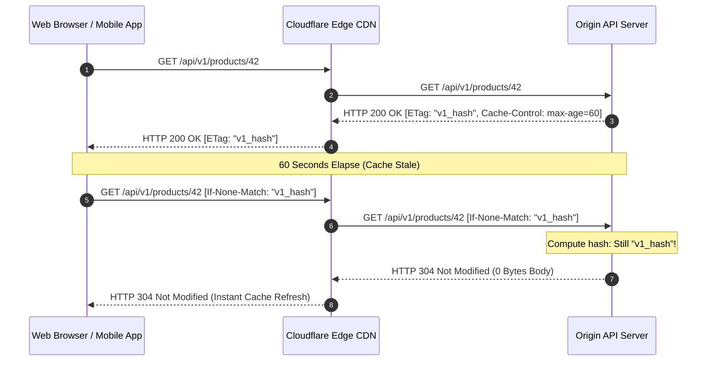

# REST APIs: Principles, Richardson Maturity Model, and Real-World Design

## TL;DR
Representational State Transfer (REST) is an architectural style for distributed hypermedia systems, formulated by Roy Fielding in his 2000 doctoral dissertation.
REST treats all entities as addressable Resources identified by Uniform Resource Identifiers (URIs), manipulated through representations (such as JSON or XML) using standardized HTTP verbs.
The architecture is governed by six strict constraints: Client-Server, Statelessness, Cacheability, Layered System, Code-on-Demand, and the Uniform Interface.
Leonard Richardson categorized API maturity into four tiers (Levels 0 through 3), culminating in HATEOAS (Hypermedia As The Engine Of Application State), where servers dynamically advertise valid workflow transitions via hypermedia links.
For hands-on Python backend frameworks and interview implementation recipes, see [[05-REST-API-Design|Python REST API Design]].

## Mental Model
Think of a non-RESTful Remote Procedure Call (RPC) system as an automated telephone directory.
You call a single number, listen to a robotic operator, and dial extensions like "Press 1 for transferFunds, Press 2 for cancelOrder".
If the bank adds a new service, you must reprogram your phone script.
Think of a mature REST API as navigating the World Wide Web in a web browser.
You start at the bank's home page (`/`).
The page displays your balance along with clickable hyperlinks: `[Transfer Funds]`, `[View Statements]`, and `[Close Account]`.
If your balance is negative, the `[Transfer Funds]` link is missing and a new link `[Deposit Overdraft]` appears.
The client does not hardcode workflow rules; the client simply inspects the returned hypermedia representation to determine valid next transitions.



## How It Works (Internals)

### 1. The Six Guiding Constraints of REST (Roy Fielding)

1. **Client-Server Architecture**: Separates user interface concerns from data persistence concerns.
Allows client applications (web, iOS, Android) and server systems to scale, evolve, and be deployed independently.
2. **Statelessness**: Every request from client to server must contain all contextual information necessary to understand and process the request.
The server must not store session state on local disk or memory between requests; session state resides entirely on the client (e.g., via cryptographic JWTs).
3. **Cacheability**: Data within a response must be implicitly or explicitly labeled as cacheable or non-cacheable.
Enforces edge and intermediary caching (`Cache-Control`, `ETag`, `Last-Modified`) to eliminate redundant server execution.
4. **Layered System**: A client cannot determine whether it is connected directly to the origin server, or to an intermediary proxy, load balancer, API gateway, or CDN.
Enables transparent horizontal scaling, security inspection, and caching layers.
5. **Code on Demand (Optional)**: Servers can extend client functionality by transmitting executable code (such as JavaScript or WebAssembly).
6. **Uniform Interface**: The defining constraint that distinguishes REST from all other network styles:
   - *Identification of Resources*: Resources are conceptually separate from representations; identified via stable URIs (`/api/v1/orders/102`).
   - *Manipulation through Representations*: Clients holding a resource representation (JSON) possess sufficient information to modify or delete the resource.
   - *Self-Descriptive Messages*: Each message includes its MIME type (`Content-Type: application/json`), cache headers, and character encoding.
   - *HATEOAS*: The client transitions between application states exclusively through hypermedia links supplied dynamically in response payloads.

### 2. HTTP Verbs and Semantic Invariants



| HTTP Method | Safe? | Idempotent? | RFC 9110 Primary Semantic | Typical Status Codes |
| :--- | :--- | :--- | :--- | :--- |
| **GET** | Yes | Yes | Retrieve representation of resource | 200 OK, 304 Not Modified, 404 Not Found |
| **HEAD** | Yes | Yes | Retrieve headers only (identical to GET minus body) | 200 OK, 304 Not Modified |
| **OPTIONS** | Yes | Yes | Query allowed communication options (CORS preflight) | 200 OK, 204 No Content |
| **POST** | No | No | Process entity / Create subordinate resource | 201 Created (`Location:` header), 200 OK |
| **PUT** | No | Yes | Replace target resource entirely with payload | 200 OK, 204 No Content |
| **PATCH** | No | No* | Apply partial modifications / delta to resource | 200 OK, 204 No Content |
| **DELETE** | No | Yes | Delete target resource | 200 OK, 204 No Content, 404 Not Found |

*\*Note: While a naive PATCH is non-idempotent (such as `{"op": "increment", "val": 5}`), idempotent PATCH documents (such as JSON Merge Patch setting explicit values) achieve idempotency in practice.*

### 3. HATEOAS: Level 3 Maturity in Practice
Under HATEOAS, a client fetching an order receives not only attributes, but relational links (`_links`) describing available state transitions:

```json
{
  "order_id": "ord_9845",
  "status": "AWAITING_PAYMENT",
  "amount": 149.50,
  "currency": "USD",
  "_links": {
    "self": { "href": "/v1/orders/ord_9845", "method": "GET" },
    "payment": { "href": "/v1/orders/ord_9845/payments", "method": "POST" },
    "cancel": { "href": "/v1/orders/ord_9845", "method": "DELETE" }
  }
}
```
If the payment is completed, a subsequent `GET` returns `status: "PAID"`.
The `payment` and `cancel` links vanish dynamically, replaced by:
```json
"_links": {
  "self": { "href": "/v1/orders/ord_9845", "method": "GET" },
  "tracking": { "href": "/v1/orders/ord_9845/shipment", "method": "GET" },
  "invoice": { "href": "/v1/orders/ord_9845/invoice.pdf", "method": "GET" }
}
```
The client never hardcodes business transition logic (`if status == 'PAID' show tracking`); the presence of the hypermedia link drives the UI state machine.

### 4. HTTP Caching Mechanics: Conditional Validation
Intermediary CDNs and client browsers leverage two primary mechanisms:
1. **Freshness Tracking (`Cache-Control`)**:
   `Cache-Control: public, max-age=3600, stale-while-revalidate=60`
   Informs caches that the response is fresh for 1 hour.
2. **Conditional Validation (`ETag` and `If-None-Match`)**:
   Server returns an entity tag hash: `ETag: "w_9a8f2e4"`.
   When cached max-age expires, the client sends a validation request:
   `GET /v1/products/42`
   `If-None-Match: "w_9a8f2e4"`
   If the server's record has not changed, the server returns **HTTP 304 Not Modified** with zero payload body, saving network transit.



## Trade-offs and When to Use

| Architectural Attribute | REST (JSON / HTTP) | GraphQL | gRPC (Protobuf / HTTP/2) |
| :--- | :--- | :--- | :--- |
| **Network Efficiency** | Low to Medium (JSON verbosity, over/under-fetching) | High (Client queries exact fields required) | Highest (Compact binary Protobuf wire format) |
| **Caching Support** | Native, universal (CDNs, browser cache, HTTP 304) | Poor (All requests POST to `/graphql`; bypasses CDNs) | None natively (Requires application-level caching) |
| **Tooling & Ubiquity** | Universal (Every language, browser, and curl) | Requires complex client libraries (Apollo, Relay) | Requires code generation (protoc compiler) |
| **Type Safety** | Weak (Schema documentation via OpenAPI/Swagger) | Strong (Strict schema system, runtime validation) | Strongest (Compile-time code generation) |
| **Best Use Case** | Public developer APIs, content-driven web apps | Frontend aggregations, complex mobile UIs | Internal microservice-to-microservice RPCs |

## Failure Modes and Pitfalls

### 1. Over-Fetching and Under-Fetching (The Chatty Mobile App)
- *Failure*: A mobile screen requires displaying a user's name, their last order date, and unread notification count.
Under REST, the mobile app must execute three distinct HTTP calls: `GET /users/me`, `GET /orders`, and `GET /notifications`.
Over cellular networks, three sequential round-trips add $600\text{ ms}$ of latency.
Conversely, `GET /users/me` returns 80 fields of profile metadata when the client only needed `name` (Over-fetching).
- *Mitigation*: Adopt Sparse Fieldsets (`GET /users/me?fields=name`) and Resource Expansion (`GET /users/me?embed=orders,notifications`), or deploy a Backend-For-Frontend (BFF) proxy.

### 2. The HTTP 200 OK Error Anti-Pattern
- *Failure*: An API catches an unhandled database exception and returns:
`HTTP/1.1 200 OK`
`{ "success": false, "error": "Internal Database Connection Timeout" }`
Monitoring tools (DataDog, Prometheus) and CDN edge proxies observe an HTTP 200 status code and record the transaction as successful, masking critical outages and breaking standard HTTP error retries.
- *Mitigation*: Strictly map server failures to semantic 5xx status codes (such as HTTP 500 or 503) and client validation errors to 4xx status codes.

### 3. Conflating PUT and PATCH
- *Failure*: A developer uses `PUT /users/42` with `{ "email": "new@example.com" }` intending to update only the email.
Per RFC 9110, `PUT` is a complete replacement.
The server replaces the entire user entity with the payload, wiping out the user's `name`, `password_hash`, and `creation_date`.
- *Mitigation*: Enforce `PATCH` for partial attribute updates and validate that `PUT` payloads provide the full entity definition.

## Hands-On

### 1. Standalone Python Simulation: Richardson Model, Idempotency, and Concurrency
Run this pure Python standard-library simulation demonstrating Level 0 POX vs Level 3 REST, conditional ETag validation, idempotency key tracking, and optimistic concurrency locking:

```python
#!/usr/bin/env python3
"""
Standalone REST API Engine Simulation: Richardson Maturity Model, Idempotency, and Concurrency.
Demonstrates:
1. Richardson Maturity Model Levels 0 to 3 (POX RPC vs Resources vs Verbs vs HATEOAS links).
2. Distributed Idempotency Key manager with in-flight locking and response replay.
3. ETag generation and conditional validation (If-None-Match -> 304 Not Modified).
4. Optimistic locking concurrency control (If-Match -> 412 Precondition Failed).
"""

import hashlib
import json
import time
from typing import Any, Dict, Optional, Tuple


class SimulatedHTTPRequest:
    def __init__(self, method: str, path: str, headers: Optional[Dict[str, str]] = None, body: Optional[Dict[str, Any]] = None):
        self.method = method.upper()
        self.path = path
        self.headers = {k.lower(): v for k, v in (headers or {}).items()}
        self.body = body or {}


class SimulatedHTTPResponse:
    def __init__(self, status_code: int, headers: Optional[Dict[str, str]] = None, body: Optional[Any] = None):
        self.status_code = status_code
        self.headers = headers or {}
        self.body = body

    def __repr__(self):
        return f"HTTP {self.status_code} | Headers: {self.headers} | Body: {json.dumps(self.body) if self.body else '<empty>'}"


class IdempotencyStore:
    def __init__(self, ttl_seconds: float = 60.0):
        self.ttl_seconds = ttl_seconds
        self.store: Dict[str, Dict[str, Any]] = {}

    def acquire(self, key: str) -> Tuple[bool, Optional[SimulatedHTTPResponse]]:
        now = time.time()
        if key in self.store:
            entry = self.store[key]
            if now - entry["ts"] > self.ttl_seconds:
                del self.store[key]
            elif entry["status"] == "COMPLETED":
                return False, entry["response"]
            elif entry["status"] == "IN_PROGRESS":
                conflict_resp = SimulatedHTTPResponse(409, {"Content-Type": "application/json"}, {"error": "Concurrent request in progress for idempotency key"})
                return False, conflict_resp
        self.store[key] = {"status": "IN_PROGRESS", "response": None, "ts": now}
        return True, None

    def complete(self, key: str, response: SimulatedHTTPResponse):
        if key in self.store:
            self.store[key]["status"] = "COMPLETED"
            self.store[key]["response"] = response


class Level3RESTServer:
    def __init__(self):
        self.orders: Dict[str, Dict[str, Any]] = {
            "ord_101": {
                "id": "ord_101",
                "customer_id": "cust_1",
                "item": "Mechanical Keyboard",
                "amount": 120.00,
                "status": "PENDING",
                "version": 1,
            }
        }
        self.idempotency_store = IdempotencyStore()

    def _generate_etag(self, order: Dict[str, Any]) -> str:
        serialized = json.dumps(order, sort_keys=True)
        return f'"{hashlib.sha256(serialized.encode("utf-8")).hexdigest()[:16]}"'

    def handle_level0_pox(self, req: SimulatedHTTPRequest) -> SimulatedHTTPResponse:
        action = req.body.get("action")
        if action == "payOrder":
            order_id = req.body.get("orderId")
            if order_id in self.orders:
                self.orders[order_id]["status"] = "PAID"
                return SimulatedHTTPResponse(200, {}, {"success": True, "result": "Order paid"})
            return SimulatedHTTPResponse(200, {}, {"success": False, "error": "Order not found"})
        return SimulatedHTTPResponse(200, {}, {"success": False, "error": "Unknown action"})

    def handle_request(self, req: SimulatedHTTPRequest) -> SimulatedHTTPResponse:
        idem_key = req.headers.get("idempotency-key")
        if idem_key and req.method in ("POST", "PATCH"):
            acquired, cached_resp = self.idempotency_store.acquire(idem_key)
            if not acquired:
                return cached_resp

        resp = self._dispatch(req)

        if idem_key and req.method in ("POST", "PATCH") and resp.status_code < 500:
            self.idempotency_store.complete(idem_key, resp)

        return resp

    def _dispatch(self, req: SimulatedHTTPRequest) -> SimulatedHTTPResponse:
        parts = req.path.strip("/").split("/")
        if len(parts) == 3 and parts[0] == "v1" and parts[1] == "orders":
            order_id = parts[2]
            return self._handle_order_by_id(req, order_id)
        elif len(parts) == 4 and parts[0] == "v1" and parts[1] == "orders" and parts[3] == "payments":
            order_id = parts[2]
            return self._handle_order_payment(req, order_id)
        return SimulatedHTTPResponse(404, {"Content-Type": "application/json"}, {"error": "Resource not found"})

    def _handle_order_by_id(self, req: SimulatedHTTPRequest, order_id: str) -> SimulatedHTTPResponse:
        order = self.orders.get(order_id)
        if not order:
            return SimulatedHTTPResponse(404, {"Content-Type": "application/json"}, {"error": "Order not found"})

        etag = self._generate_etag(order)

        if req.method == "GET":
            client_etag = req.headers.get("if-none-match")
            if client_etag == etag:
                return SimulatedHTTPResponse(304, {"ETag": etag, "Cache-Control": "max-age=60"}, None)

            representation = dict(order)
            links = {
                "self": {"href": f"/v1/orders/{order_id}", "method": "GET"}
            }
            if order["status"] == "PENDING":
                links["payment"] = {"href": f"/v1/orders/{order_id}/payments", "method": "POST"}
                links["cancel"] = {"href": f"/v1/orders/{order_id}", "method": "DELETE"}
            elif order["status"] == "PAID":
                links["shipment"] = {"href": f"/v1/orders/{order_id}/shipment", "method": "GET"}
                links["invoice"] = {"href": f"/v1/orders/{order_id}/invoice.pdf", "method": "GET"}
            representation["_links"] = links

            return SimulatedHTTPResponse(
                200,
                {"Content-Type": "application/json", "ETag": etag, "Cache-Control": "max-age=60"},
                representation
            )

        elif req.method == "PUT":
            client_etag = req.headers.get("if-match")
            if client_etag and client_etag != etag:
                return SimulatedHTTPResponse(412, {}, {"error": "Precondition Failed: Resource modified concurrently"})

            new_order = {
                "id": order_id,
                "customer_id": req.body.get("customer_id", order["customer_id"]),
                "item": req.body.get("item", "Default Item"),
                "amount": req.body.get("amount", 0.0),
                "status": req.body.get("status", "PENDING"),
                "version": order["version"] + 1,
            }
            self.orders[order_id] = new_order
            new_etag = self._generate_etag(new_order)
            return SimulatedHTTPResponse(200, {"ETag": new_etag}, new_order)

        elif req.method == "DELETE":
            del self.orders[order_id]
            return SimulatedHTTPResponse(204, {}, None)

        return SimulatedHTTPResponse(405, {"Allow": "GET, PUT, DELETE"}, {"error": "Method Not Allowed"})

    def _handle_order_payment(self, req: SimulatedHTTPRequest, order_id: str) -> SimulatedHTTPResponse:
        if req.method != "POST":
            return SimulatedHTTPResponse(405, {"Allow": "POST"}, {"error": "Method Not Allowed"})

        order = self.orders.get(order_id)
        if not order:
            return SimulatedHTTPResponse(404, {}, {"error": "Order not found"})

        if order["status"] == "PAID":
            return SimulatedHTTPResponse(409, {}, {"error": "Order already paid"})

        order["status"] = "PAID"
        order["version"] += 1
        return SimulatedHTTPResponse(201, {"Location": f"/v1/orders/{order_id}/payments/pay_1"}, {"status": "PAID", "order_id": order_id})


def run_simulation():
    server = Level3RESTServer()

    print("--- 1. Level 0 (The Swamp of POX / RPC) ---")
    pox_req = SimulatedHTTPRequest("POST", "/api", body={"action": "payOrder", "orderId": "ord_101"})
    pox_resp = server.handle_level0_pox(pox_req)
    print(f"POX Request -> {pox_resp}")

    server.orders["ord_101"]["status"] = "PENDING"

    print("\n--- 2. Level 3 (HATEOAS and Conditional ETag Caching) ---")
    get_req_1 = SimulatedHTTPRequest("GET", "/v1/orders/ord_101")
    resp_1 = server.handle_request(get_req_1)
    etag_1 = resp_1.headers["ETag"]
    print(f"Fetch 1 (200 OK) -> ETag: {etag_1}")
    print(f"Available HATEOAS transitions: {list(resp_1.body['_links'].keys())}")

    get_req_2 = SimulatedHTTPRequest("GET", "/v1/orders/ord_101", headers={"if-none-match": etag_1})
    resp_2 = server.handle_request(get_req_2)
    print(f"Fetch 2 (If-None-Match) -> Status: {resp_2.status_code} (Payload: {resp_2.body})")
    assert resp_2.status_code == 304, "Conditional GET failed to return 304"

    print("\n--- 3. Distributed Idempotency Key Handling ---")
    pay_req = SimulatedHTTPRequest("POST", "/v1/orders/ord_101/payments", headers={"idempotency-key": "idem_tok_999"})
    pay_resp_1 = server.handle_request(pay_req)
    print(f"Payment 1 -> Status: {pay_resp_1.status_code} | Body: {pay_resp_1.body}")

    pay_resp_2 = server.handle_request(pay_req)
    print(f"Payment 2 (Retry) -> Status: {pay_resp_2.status_code} | Body: {pay_resp_2.body}")
    assert pay_resp_1.status_code == pay_resp_2.status_code == 201, "Idempotency replay failed"
    print("Idempotency Verification Passed: Retry returned identical cached response without duplicate execution.")

    print("\n--- 4. HATEOAS State Machine Transition Check ---")
    resp_3 = server.handle_request(SimulatedHTTPRequest("GET", "/v1/orders/ord_101"))
    print(f"Fetch 3 (Post-Payment) -> Status: {resp_3.status_code}")
    print(f"Updated HATEOAS transitions: {list(resp_3.body['_links'].keys())}")
    assert "payment" not in resp_3.body["_links"]
    assert "shipment" in resp_3.body["_links"]

    print("\n--- 5. Optimistic Concurrency Control (If-Match) ---")
    stale_put = SimulatedHTTPRequest(
        "PUT",
        "/v1/orders/ord_101",
        headers={"if-match": etag_1},
        body={"item": "Tampered Keyboard", "amount": 10.0}
    )
    stale_resp = server.handle_request(stale_put)
    print(f"Stale PUT with outdated ETag -> Status: {stale_resp.status_code} | Body: {stale_resp.body}")
    assert stale_resp.status_code == 412, "Optimistic locking failed to catch concurrent modification"
    print("Optimistic Concurrency Passed: Stale update rejected with 412 Precondition Failed.")


if __name__ == "__main__":
    run_simulation()
```

### 2. Live HTTP Driver Script: Level 3 REST with ETag Validation
The following script launches an HTTP server and executes live HTTP requests against it:

```python
import hashlib
import json
import threading
import time
import urllib.request
from http.server import BaseHTTPRequestHandler, HTTPServer


DATABASE = {
    "ord_101": {
        "id": "ord_101",
        "item": "Mechanical Keyboard",
        "status": "PENDING",
        "amount": 120.00
    }
}


class RestHandler(BaseHTTPRequestHandler):
    def _send_json(self, status: int, data: dict, headers: dict = None):
        body = json.dumps(data, indent=2).encode("utf-8")
        self.send_response(status)
        self.send_header("Content-Type", "application/json")
        self.send_header("Content-Length", str(len(body)))
        if headers:
            for k, v in headers.items():
                self.send_header(k, v)
        self.end_headers()
        self.wfile.write(body)

    def do_GET(self):
        if self.path == "/v1/orders/ord_101":
            order = DATABASE.get("ord_101")
            representation = dict(order)
            representation["_links"] = {
                "self": {"href": "/v1/orders/ord_101", "method": "GET"}
            }
            if order["status"] == "PENDING":
                representation["_links"]["pay"] = {"href": "/v1/orders/ord_101/pay", "method": "POST"}
                representation["_links"]["cancel"] = {"href": "/v1/orders/ord_101", "method": "DELETE"}

            body_json = json.dumps(representation, sort_keys=True)
            etag = f'"{hashlib.sha256(body_json.encode()).hexdigest()[:16]}"'

            client_etag = self.headers.get("If-None-Match")
            if client_etag == etag:
                self.send_response(304)
                self.send_header("ETag", etag)
                self.end_headers()
                return

            self._send_json(200, representation, headers={"ETag": etag, "Cache-Control": "max-age=60"})
        else:
            self._send_json(404, {"title": "Not Found", "status": 404})


def run_demo():
    server = HTTPServer(("127.0.0.1", 8889), RestHandler)
    t = threading.Thread(target=server.handle_request, daemon=True)
    t.start()
    time.sleep(0.05)

    req = urllib.request.Request("http://127.0.0.1:8889/v1/orders/ord_101")
    with urllib.request.urlopen(req) as resp:
        etag = resp.headers.get("ETag")
        data = json.loads(resp.read().decode())
        print(f"Live Client Request 1 -> Status: {resp.status}, ETag: {etag}")
        print("HATEOAS Links Received:", list(data["_links"].keys()))


if __name__ == "__main__":
    run_demo()
```

## Performance and Capacity
- **HTTP/1.1 vs HTTP/2 Keep-Alive**:
  Establishing a fresh TLS 1.3 connection requires 1 to 2 round trips ($30\text{ - }100\text{ ms}$).
  Reusing keep-alive connection pools across REST API endpoints cuts p99 latency by over 60%.
- **JSON Serialization Overhead**:
  JSON is human-readable UTF-8 text.
  Serializing and deserializing large JSON documents consumes 3x to 8x more CPU cycles and produces 4x to 6x larger byte payloads than equivalent binary Protocol Buffers.

## In Production
- **GitHub REST API (v3)**: One of the most widely adopted enterprise REST APIs.
Extensively leverages hypermedia links (HATEOAS) for pagination (`Link: <...page=2>; rel="next"`), conditional requests (`ETag` and `Last-Modified`), and consistent resource modeling.
- **Stripe API**: Universally praised for predictable RESTful resource modeling, consistent snake_case attributes, rich error envelopes, and seamless date-based version migrations.

### Operational Checklist
- [ ] Ensure all GET endpoints return an explicit `ETag` and `Cache-Control` header.
- [ ] For collection endpoints, mandate pagination (never permit unbounded `GET /orders`).
- [ ] Use plural nouns for collection resources (`/orders`, `/customers`) and reserve verbs for action sub-resources (`/orders/12/cancel`).

## Interview Questions

> [!question]
> What is the difference between `PUT` and `PATCH` in REST API design?
> [!success]- Answer
> `PUT` represents a complete replacement of the target resource.
> The client transmits the entire resource representation, and any fields omitted from the payload are cleared or reset to defaults.
> Per RFC 9110, `PUT` is idempotent.
> `PATCH` represents a partial update.
> The client transmits only the specific fields or delta operations intended to be altered, leaving omitted fields untouched.
> `PATCH` is not inherently idempotent unless implemented with idempotent merge semantics.

> [!question]
> Explain the four levels of the Richardson Maturity Model.
> [!success]- Answer
> Level 0 (The Swamp of POX) uses HTTP as a raw transport tunnel where all operations target a single URI using a single verb, typically `POST`.
> Level 1 (Resources) introduces distinct URIs for individual entities such as `/orders` and `/users`, but continues using a single verb for all actions.
> Level 2 (HTTP Verbs and Status Codes) adopts standardized HTTP methods like `GET`, `POST`, `PUT`, and `DELETE` with semantic status codes like `200`, `201`, `404`, and `409`.
> Level 3 (Hypermedia Controls / HATEOAS) embeds discoverable hypermedia links inside response representations, dynamically guiding the client regarding valid next state transitions.

> [!question]
> What is HATEOAS, and what architectural benefit does it provide to API clients?
> [!success]- Answer
> HATEOAS stands for Hypermedia As The Engine Of Application State.
> It mandates that API responses include hypermedia links pointing to related resources and permissible actions based on the entity current state.
> The primary architectural benefit is Decoupled Workflow Evolution.
> Clients do not hardcode complex business state rules or URI construction logic.
> The server dynamically advertises available actions, allowing backend business workflows to change without breaking client code.

> [!question]
> What is the difference between a Safe HTTP method and an Idempotent HTTP method?
> [!success]- Answer
> A Safe method is strictly read-only, producing zero server-side state mutation.
> Examples include `GET`, `HEAD`, and `OPTIONS`.
> All safe methods are inherently idempotent.
> An Idempotent method may mutate server state, but executing it multiple times with identical parameters leaves the server in the exact same state as executing it once.
> Examples include `PUT` and `DELETE`.
> `POST` and generic `PATCH` operations are neither safe nor inherently idempotent.

> [!question]
> How does conditional HTTP validation using `ETag` and `If-None-Match` save server and network resources?
> [!success]- Answer
> The server attaches a fingerprint hash of the resource representation in the `ETag` header.
> When the client local cache TTL expires, instead of re-fetching the full payload, it issues a conditional request with `If-None-Match: "<etag>"`.
> If the resource has not changed, the server returns HTTP 304 Not Modified with zero payload body.
> This saves network bandwidth, eliminates serialization CPU cycles, and allows edge CDNs to refresh cached content instantaneously.

> [!question]
> How would you design a REST API to support atomic bulk updates while preserving RESTful resource modeling?
> [!success]- Answer
> Model the batch operation as a first-class controller resource: `POST /v1/order-batches`.
> The client submits a manifest describing the list of order mutations to be executed.
> The server validates the request, executes the transaction atomically, and returns HTTP 201 Created with a batch status URI like `/v1/order-batches/batch_991`.
> Alternatively, support `PATCH /v1/orders` using RFC 6902 JSON Patch documents, where the payload is an array of atomic operation descriptors executed within a single database transaction.

> [!question]
> Why do many hyper-scale microservice architectures use REST for public edge APIs but replace it with gRPC for internal service-to-service communication?
> [!success]- Answer
> REST over JSON is universally accessible, easy to test, and natively supported by web browsers and edge CDNs, making it optimal for external third-party developers.
> Inside internal datacenters, JSON text serialization consumes excessive CPU cycles and produces bloated payloads.
> Furthermore, lack of strict compile-time interface contracts leads to subtle schema incompatibilities.
> gRPC uses compact binary Protocol Buffers with significantly faster serialization, runs over HTTP/2 multiplexed streams, and enforces strictly typed stubs, maximizing throughput and minimizing latency between internal services.

> [!question]
> How would you resolve the N+1 network call problem in a mobile application consuming a REST API without migrating the backend to GraphQL?
> [!success]- Answer
> Implement two complementary REST patterns.
> First, support Resource Expansion using query parameters like `GET /v1/orders?expand=customer,line_items,shipping_address`.
> The server database layer performs an optimized relational join and returns the complete graph in a single response payload.
> Second, adopt the Backend-For-Frontend (BFF) pattern.
> Deploy a lightweight gateway service tailored specifically for the mobile application.
> The mobile client makes a single call to the BFF, which executes concurrent asynchronous RPCs across internal microservices and returns a consolidated mobile payload.

> [!question]
> How do you implement robust Idempotency Key tracking at scale for financial mutations in a REST API?
> [!success]- Answer
> Clients generate a unique UUID v4 and supply it in the `Idempotency-Key` HTTP header on mutating requests.
> The API Gateway or application service attempts an atomic reservation in a fast distributed store like Redis using `SET key IN_PROGRESS NX EX 120`.
> If the key already exists with status `COMPLETED`, the server returns the cached response status and payload immediately without re-executing business logic.
> If the key exists with status `IN_PROGRESS`, the server returns HTTP 409 Conflict or HTTP 425 Too Early to prevent concurrent double-processing.
> Once the database transaction commits, the server updates the key state to `COMPLETED` along with the serialized HTTP response body and status code.

> [!question]
> How does Optimistic Concurrency Control using `ETag` and `If-Match` prevent lost updates in distributed REST systems?
> [!success]- Answer
> When a client reads a resource via `GET`, the server returns the current entity representation along with an `ETag` derived from its version or content hash.
> When the client issues a mutating `PUT` or `PATCH`, it includes the received header `If-Match: "<etag>"`.
> Before modifying the resource, the server verifies that the current entity ETag matches the client supplied value.
> If another client updated the resource in the interim, the hashes differ, and the server rejects the mutation with HTTP 412 Precondition Failed.
> The client must fetch the latest state, resolve any business conflicts, and retry the update, eliminating lost updates without expensive pessimistic database row locks.

## Related
- [[API-Fundamentals|API Fundamentals]]: Versioning, rate limiting, and idempotency.
- [[GraphQL|GraphQL]]: Client-driven query language addressing REST over-fetching.
- [[gRPC-and-Protocol-Buffers|gRPC and Protocol Buffers]]: High-performance binary RPC alternative.
- [[HTTP-Evolution-HTTP1-HTTP2-HTTP3|HTTP Evolution]]: Transport protocols underlying REST APIs.
- [[05-REST-API-Design|Python REST API Design]]: Vault backend implementation recipes.

## Further Reading
- Fielding, Roy Thomas. "Architectural styles and the design of network-based software architectures." *Doctoral dissertation, University of California, Irvine* (2000).
- Richardson, Leonard, and Mike Amundsen. *RESTful Web APIs*. O'Reilly Media, 2013.
- Nottingham, Mark, and Julian Reschke. "RFC 9110: HTTP Semantics." *Internet Engineering Task Force (IETF)* (2022).
- Webber, Jim, Savas Parastatidis, and Ian Robinson. *REST in Practice: Hypermedia and Systems Architecture*. O'Reilly Media, 2010.
