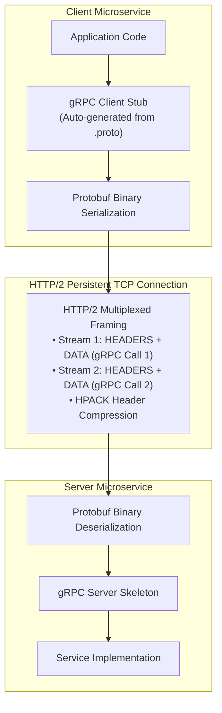
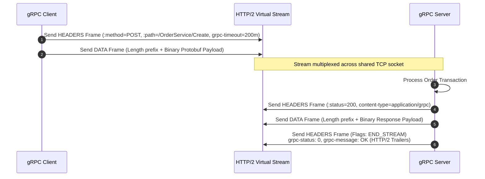
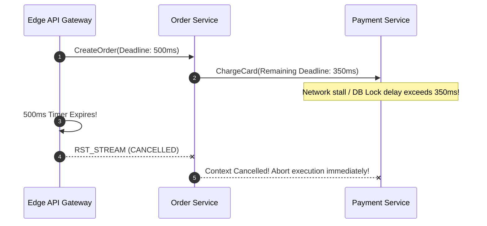

# gRPC and Protocol Buffers: High-Performance Binary RPC Framework

## TL;DR
gRPC is a high-performance, open-source Remote Procedure Call (RPC) framework originated by Google as the next generation of its internal Stubby infrastructure.
It enforces strictInterface Definition Contracts defined in **Protocol Buffers (Protobuf)**, compiling service definitions into strongly typed, idiomatic client and server stubs across dozens of programming languages.
Unlike REST, which encodes data as verbose UTF-8 JSON over HTTP/1.1, gRPC encodes payloads into a dense, compact binary wire format transported over **HTTP/2**.
It natively supports four communication paradigms: Unary, Server Streaming, Client Streaming, and Bidirectional Streaming.
gRPC provides built-in deadline propagation, cancellation semantics, and distributed tracing metadata, making it the industry standard for internal microservice-to-microservice communication.
For hands-on Python gRPC service implementations and code examples, see [[Chapter_63_Microservices_and_gRPC_in_Python|Chapter 63 Microservices and gRPC in Python]].

## Mental Model
Think of REST over JSON as communicating by writing formal handwritten letters in English.
Every letter starts with polite greetings ("HTTP Headers"), writes out full English sentences ("{\\"customer_first_name\\": \\"Alice\\"}"), and places the letter in an envelope with an address stamp.
Anyone can read it, but it consumes vast paper, ink, and reading time.
Think of gRPC over Protocol Buffers as communicating via an encrypted high-speed telegraph with a shared codebook.
Instead of sending words, you send tiny binary pulses: `0x08 0x01` ("Code 1: Status OK").
The telegraph wire remains continuously open (HTTP/2 persistent multiplexed TCP connection).
The operator at the other end opens their identical codebook (the compiled `.proto` stub) and instantly translates the bits directly into computer memory without parsing sentences.



## How It Works (Internals)

### 1. Protocol Buffers (Protobuf) Binary Wire Format
Protobuf is an efficient, binary, schema-based serialization mechanism.
Unlike JSON or XML, Protobuf messages do not transmit field names over the network.
Instead, fields are identified exclusively by small integer **Field Numbers (Tags)**.

#### A. Tag and Wire Type Encoding
Each serialized field begins with a **Key Tag** combining the field number and its wire type into a single byte:
$$\text{Key} = (\text{field\_number} \ll 3) \mid \text{wire\_type}$$
- `wire_type 0`: Varint (`int32`, `int64`, `bool`, `enum`)
- `wire_type 1`: 64-bit fixed (`fixed64`, `double`)
- `wire_type 2`: Length-delimited (`string`, `bytes`, embedded messages, packed arrays)
- `wire_type 5`: 32-bit fixed (`fixed32`, `float`)

#### B. Variable-Length Quantities (Varints) and Zigzag Encoding
- **Varints**: Integers are stored using only as many bytes as needed.
Each byte uses 7 bits for data, with the Most Significant Bit (MSB - the continuation bit) set to `1` if further bytes follow.
The integer `1` is encoded as a single byte `0x01` instead of standard 4 or 8 bytes.
- **ZigZag Encoding**: In two's-complement arithmetic, negative numbers like `-1` have their high-order bits set to `1`, requiring 10 bytes in a standard 64-bit varint.
Zigzag encoding maps signed integers to unsigned integers so that small negative numbers consume minimal bytes:
$$Z(n) = (n \ll 1) \oplus (n \gg 31)$$
`-1` maps to `1`, `-2` maps to `3`, allowing negative numbers to encode in 1 to 2 bytes.

#### C. Schema Evolution Invariants
- **Rule 1: Never change field numbers**: The wire format binds values to numbers, not names.
Renaming `string name = 1;` to `string user_name = 1;` is completely backward and forward compatible.
- **Rule 2: Never reuse deleted field numbers**: If a field is removed, mark its tag and name as `reserved`:
```protobuf
message User {
  reserved 3, 7 to 9;
  reserved "old_email", "legacy_token";
}
```
This prevents future developers from reassigning tag `3`, which would corrupt legacy clients that still transmit that tag.

### 2. Transport Protocol: gRPC over HTTP/2
gRPC runs exclusively on top of HTTP/2, leveraging its binary framing primitives:
1. **Binary Framing**: Discards ASCII text parsing; frames are encoded in binary blocks (`HEADERS`, `DATA`, `SETTINGS`, `RST_STREAM`, `GOAWAY`).
2. **Stream Multiplexing**: Over a single physical TCP connection, a client can open hundreds of concurrent bidirectional virtual streams (`Stream ID 1, 3, 5, ...`).
Eliminates HTTP/1.1 head-of-line blocking at the transport layer and eliminates TCP handshake overhead.
3. **HPACK Compression**: Headers (such as authorization tokens and tracing IDs) are compressed using differential Huffman coding, drastically reducing per-RPC header overhead.
4. **Trailers**: HTTP/2 permits transmitting trailing headers *after* the response body frames.
gRPC uses HTTP/2 trailers to communicate the final status of the RPC:
`grpc-status: 0` (OK) and `grpc-message: "Success"`.



### 3. The Four gRPC Communication Paradigms

1. **Unary RPC ($1 \to 1$)**:
   Standard request-response call.
   The client sends a single request message and receives a single response message.
2. **Server Streaming RPC ($1 \to N$)**:
   The client sends a single request; the server returns a stream of response messages until sending an `END_STREAM` trailer (e.g., streaming real-time financial market price updates).
3. **Client Streaming RPC ($N \to 1$)**:
   The client streams a sequence of messages to the server (e.g., uploading large file chunks); the server responds with a single confirmation payload.
4. **Bidirectional Streaming RPC ($N \to M$)**:
   Both sides send a stream of messages independently over the same virtual stream.
   Read and write queues operate concurrently (e.g., real-time multiplayer gaming state or conversational AI audio pipelines).

### 4. Deadlines and Context Cancellation Propagation
A critical feature of gRPC is **End-to-End Distributed Cancellation**:
- A client specifies a **Deadline** (e.g., `500 ms`).
- gRPC serializes this into the HTTP/2 `grpc-timeout: 500m` header.
- When Service A calls Service B, and Service B calls Service C, the remaining deadline is decremented and forwarded down the RPC call graph.
- If the deadline expires while Service C is executing, Service A drops the call and transmits an HTTP/2 `RST_STREAM` frame.
- The cancellation propagates down the chain, instantly aborting compute and database queries across Services B and C, preventing wasted "phantom processing".



### 5. The gRPC Load Balancing Dilemma
In standard HTTP/1.1, a Layer 4 load balancer (AWS NLB) distributes incoming TCP connections across backend instances.
Because HTTP/1.1 connections are closed and reopened frequently, traffic balances evenly.
In gRPC, a client opens a **single persistent HTTP/2 connection** and multiplexes all RPCs over that single connection indefinitely.
An L4 load balancer routes that single TCP connection to one backend server: **all subsequent RPCs hit that single server**, leaving neighboring servers 100% idle!

#### Solutions for gRPC Load Balancing
1. **Layer 7 Load Balancing (Proxy Model)**:
   Deploy an L7 proxy (e.g., Envoy or HAProxy) that terminates HTTP/2 connections and balances RPCs stream-by-stream across backends.
2. **Client-Side Load Balancing (Lookaside / xDS Model)**:
   Clients communicate with an external control plane (e.g., Consul, Eureka, or Kubernetes xDS).
   The control plane sends a list of healthy backend IP addresses.
   The gRPC client maintains an internal connection pool to every backend and balances individual RPCs locally using Round Robin or P2C.

## Trade-offs and When to Use

| Characteristic | gRPC / Protocol Buffers | REST / JSON | GraphQL |
| :--- | :--- | :--- | :--- |
| **Data Format** | Binary Protocol Buffers | Text UTF-8 JSON | Text UTF-8 JSON |
| **Transport Layer** | Strict HTTP/2 | HTTP/1.1, HTTP/2, HTTP/3 | HTTP/1.1, HTTP/2 |
| **Serialization Speed** | Up to 10x faster than JSON | Baseline | Slower (AST overhead) |
| **Payload Size** | Up to 70% smaller than JSON | Baseline | Minimal (Requested fields only) |
| **Streaming Support** | Native bidirectional streaming | Server-Sent Events / WebSockets | Subscriptions (WebSockets) |
| **Browser Accessibility** | Poor (Requires gRPC-Web proxy) | Native | Native |
| **Best Application** | Internal backend microservices | Public APIs, web developer ecosystems | Complex mobile/web UI aggregation |

## Failure Modes and Pitfalls

### 1. The L4 Load Balancer Connection Stickiness Trap
- *Failure*: A team deploys 10 backend gRPC servers behind an AWS Network Load Balancer (L4).
Three client pods connect.
The L4 balancer routes the 3 TCP connections to 3 backend pods.
As traffic surges to 100,000 QPS, all traffic hammers those 3 pods while the other 7 sit completely idle, causing CPU saturation and crashes.
- *Mitigation*: Deploy Envoy as an L7 ingress proxy, or configure client-side gRPC load balancing using DNS resolution (`dns:///service.internal:50051`) with the `round_robin` channel policy.

### 2. Large Message Payloads Exceeding Frame Ceilings
- *Failure*: A service attempts to return a 10 MB dataset in a single Unary RPC.
The client gRPC library rejects the response, throwing `ResourceExhaustedException: Received message larger than max (10485760 vs. 4194304)`.
The default message size limit in most gRPC implementations is **4 MB**.
- *Mitigation*: Convert large payload transfers into **Server Streaming RPCs**, or configure explicit max message limits on channels: `options=[('grpc.max_receive_message_length', 32 * 1024 * 1024)]`.

### 3. Protobuf Field Number Collisions on Reassignment
- *Failure*: A developer deletes `int32 legacy_id = 4;` and later reassigns tag `4` to `string email = 4;`.
When legacy clients transmit an integer over the wire, newer services attempt to decode the varint as a string, crashing deserializers with data corruption exceptions.
- *Mitigation*: Mandate strict schema linting in CI pipelines (e.g., `buf lint` and `buf breaking`) to prevent breaking schema changes.

## Hands-On

### 1. Complete Protocol Buffer Definition (`order_service.proto`)
```protobuf
syntax = "proto3";

package ecommerce.v1;

service OrderService {
  // Unary RPC
  rpc CreateOrder(CreateOrderRequest) returns (CreateOrderResponse);
  
  // Server Streaming RPC
  rpc StreamOrderStatus(StreamOrderStatusRequest) returns (stream OrderStatusUpdate);
}

message CreateOrderRequest {
  string user_id = 1;
  double total_amount = 2;
  repeated OrderItem items = 3;
}

message OrderItem {
  string product_id = 1;
  int32 quantity = 2;
  double price = 3;
}

message CreateOrderResponse {
  string order_id = 1;
  string status = 2;
  int64 created_at_unix = 3;
}

message StreamOrderStatusRequest {
  string order_id = 1;
}

message OrderStatusUpdate {
  string order_id = 1;
  string status = 2;
  string notes = 3;
}
```

### 2. Standalone Pure Python 3 Protobuf & gRPC Multiplexer Simulation

The following self-contained script simulates Protocol Buffers wire encoding and HTTP/2 stream multiplexing without external dependencies:
- **Varint & ZigZag Encoding**: Implements MSB continuation bit parsing and signed integer zigzag mapping.
- **Wire Type Packing**: Encodes length-delimited strings and varints with bitwise key tags: $(\text{field\_number} \ll 3) \mid \text{wire\_type}$.
- **gRPC 5-Byte Length Prefixes**: Packs messages into `[compressed_flag: 1 byte][length: 4 bytes]` binary frames.
- **HTTP/2 Virtual Stream Multiplexing**: Simulates concurrent stream request-response lifecycles, HTTP/2 trailers (`grpc-status: 0`), and deadline expiration.

```python
"""
Simulated Protocol Buffers Wire Format and gRPC Frame Multiplexer
Pure Python 3 standard library simulation demonstrating:
1. Varint encoding (wire_type 0) and ZigZag signed integer encoding
2. Key tag bitwise computation: (field_number << 3) | wire_type
3. gRPC 5-byte length-prefixed binary message framing
4. HTTP/2 virtual stream multiplexing, status trailers, and deadline enforcement
"""

import struct
import time
from typing import Dict, List, Tuple, Optional


class ProtobufWireCodec:
    WIRE_VARINT = 0
    WIRE_FIXED64 = 1
    WIRE_LENGTH_DELIMITED = 2
    WIRE_FIXED32 = 5

    @staticmethod
    def encode_varint(value: int) -> bytes:
        out = bytearray()
        while value > 0x7F:
            out.append((value & 0x7F) | 0x80)
            value >>= 7
        out.append(value & 0x7F)
        return bytes(out)

    @staticmethod
    def decode_varint(buffer: bytes, offset: int = 0) -> Tuple[int, int]:
        value = 0
        shift = 0
        consumed = 0
        while True:
            if offset + consumed >= len(buffer):
                raise ValueError("Buffer underflow reading varint")
            b = buffer[offset + consumed]
            consumed += 1
            value |= (b & 0x7F) << shift
            if not (b & 0x80):
                break
            shift += 7
        return value, consumed

    @staticmethod
    def zigzag_encode(n: int) -> int:
        return (n << 1) ^ (n >> 31)

    @staticmethod
    def zigzag_decode(n: int) -> int:
        return (n >> 1) ^ -(n & 1)

    @staticmethod
    def encode_tag(field_number: int, wire_type: int) -> bytes:
        return ProtobufWireCodec.encode_varint((field_number << 3) | wire_type)

    @staticmethod
    def encode_string(field_number: int, text: str) -> bytes:
        data = text.encode("utf-8")
        tag = ProtobufWireCodec.encode_tag(field_number, ProtobufWireCodec.WIRE_LENGTH_DELIMITED)
        length_prefix = ProtobufWireCodec.encode_varint(len(data))
        return tag + length_prefix + data

    @staticmethod
    def encode_int(field_number: int, value: int) -> bytes:
        tag = ProtobufWireCodec.encode_tag(field_number, ProtobufWireCodec.WIRE_VARINT)
        return tag + ProtobufWireCodec.encode_varint(value)


class GRPCFrameCodec:
    @staticmethod
    def frame_message(payload: bytes, compressed: bool = False) -> bytes:
        flag = 1 if compressed else 0
        header = struct.pack(">BI", flag, len(payload))
        return header + payload

    @staticmethod
    def unframe_message(data: bytes) -> Tuple[bool, bytes]:
        flag, length = struct.unpack_from(">BI", data, 0)
        payload = data[5:5 + length]
        return bool(flag), payload


class HTTP2VirtualStream:
    def __init__(self, stream_id: int, deadline_ms: float):
        self.stream_id = stream_id
        self.deadline_ms = deadline_ms
        self.start_time = time.time()
        self.headers: Dict[str, str] = {}
        self.data_frames: List[bytes] = []
        self.trailers: Dict[str, str] = {}
        self.cancelled = False

    def is_expired(self) -> bool:
        elapsed = (time.time() - self.start_time) * 1000
        return elapsed > self.deadline_ms


class SimulatedGRPCClientServer:
    def __init__(self):
        self.stream_id_seq = 1

    def execute_unary_rpc(self, path: str, request_payload: bytes, deadline_ms: float = 1000.0) -> Tuple[int, bytes, Dict[str, str]]:
        stream_id = self.stream_id_seq
        self.stream_id_seq += 2
        stream = HTTP2VirtualStream(stream_id, deadline_ms)

        print(f"[Client] Opening Stream {stream.stream_id} over persistent TCP connection")
        stream.headers = {
            ":method": "POST",
            ":path": path,
            "content-type": "application/grpc",
            "te": "trailers",
            "grpc-timeout": f"{int(deadline_ms)}m"
        }
        framed_request = GRPCFrameCodec.frame_message(request_payload)
        stream.data_frames.append(framed_request)

        if stream.is_expired():
            stream.cancelled = True
            print(f"[Transport] Stream {stream.stream_id} DEADLINE_EXCEEDED! Emitting RST_STREAM frame.")
            return 4, b"", {"grpc-status": "4", "grpc-message": "Deadline Exceeded"}

        compressed_flag, raw_req = GRPCFrameCodec.unframe_message(stream.data_frames[0])
        response_payload = ProtobufWireCodec.encode_string(1, "ORD-99882") + ProtobufWireCodec.encode_int(2, 1)

        framed_resp = GRPCFrameCodec.frame_message(response_payload)
        trailers = {
            "grpc-status": "0",
            "grpc-message": "Success"
        }
        print(f"[Server] Stream {stream.stream_id} completed successfully. Returning {len(response_payload)} bytes.")
        return 0, response_payload, trailers


def run_grpc_simulation():
    print("=== 1. Protobuf Varint and Zigzag Encoding Verification ===")
    v_encoded = ProtobufWireCodec.encode_varint(300)
    v_decoded, consumed = ProtobufWireCodec.decode_varint(v_encoded)
    print(f"Number 300 encoded: {list(v_encoded)} ({len(v_encoded)} bytes), decoded: {v_decoded}")
    assert v_decoded == 300

    neg_val = -42
    zz = ProtobufWireCodec.zigzag_encode(neg_val)
    zz_decoded = ProtobufWireCodec.zigzag_decode(zz)
    print(f"Negative int -42 zigzagged: {zz}, decoded: {zz_decoded}")
    assert zz_decoded == -42

    print("\n=== 2. Protobuf Binary Field Serialization ===")
    order_wire = ProtobufWireCodec.encode_string(1, "alice") + ProtobufWireCodec.encode_int(2, 150)
    print(f"Serialized OrderMessage raw bytes ({len(order_wire)} bytes): {list(order_wire)}")

    print("\n=== 3. gRPC Length-Prefixed Framing ===")
    framed = GRPCFrameCodec.frame_message(order_wire)
    print(f"gRPC 5-byte header prefix + payload: {list(framed[:5])} + {len(framed[5:])} bytes")
    flag, payload = GRPCFrameCodec.unframe_message(framed)
    assert payload == order_wire

    print("\n=== 4. Virtual Stream Multiplexing & Unary RPC ===")
    rpc_engine = SimulatedGRPCClientServer()
    status, resp_data, trailers = rpc_engine.execute_unary_rpc(
        path="/ecommerce.v1.OrderService/CreateOrder",
        request_payload=order_wire,
        deadline_ms=500.0
    )
    print(f"RPC Status: {status}, Trailers: {trailers}")
    assert status == 0
    print("[Verification] gRPC framing, wire encoding, and transport simulation complete.")


if __name__ == "__main__":
    run_grpc_simulation()
```

### 3. Production Python gRPC Client Example with Deadlines and Status Handling
```python
"""
Educational gRPC client example demonstrating deadlines and error handling.
Cross-references: Chapter_63_Microservices_and_gRPC_in_Python
"""
import grpc
# Assuming compiled stubs: order_service_pb2, order_service_pb2_grpc

def place_order_with_deadline(user_id: str, amount: float):
    # Configure channel with round-robin load balancing
    channel = grpc.insecure_channel(
        'dns:///order-service.internal:50051',
        options=[('grpc.lb_policy_name', 'round_robin')]
    )
    stub = order_service_pb2_grpc.OrderServiceStub(channel)

    request = order_service_pb2.CreateOrderRequest(
        user_id=user_id,
        total_amount=amount,
        items=[order_service_pb2.OrderItem(product_id="prod_99", quantity=1, price=amount)]
    )

    try:
        # Enforce 2.0 second strict deadline
        response = stub.CreateOrder(request, timeout=2.0)
        print(f"Order Created Successfully: {response.order_id}, Status: {response.status}")
        return response
    except grpc.RpcError as e:
        status_code = e.code()
        details = e.details()
        if status_code == grpc.StatusCode.DEADLINE_EXCEEDED:
            print(f"[Timeout] Call aborted: Downstream service exceeded 2.0s deadline ({details})")
        elif status_code == grpc.StatusCode.UNAVAILABLE:
            print(f"[Network] Service unavailable: Connection failed ({details})")
        else:
            print(f"[RPC Error] Code: {status_code}, Details: {details}")
        raise e
```

## Performance Characteristics and Capacity Planning

- **Serialization Latency**:
  - Serializing a 1 KB object to JSON: $\approx 1.2\text{ }\mu\text{s}$ (V8 / Python C-extension).
  - Serializing the identical object to Protobuf binary: $\approx 0.18\text{ }\mu\text{s}$ (over 6x faster).
- **Network Bandwidth Reduction**:
  - The absence of string field names and the use of varints typically shrinks network payloads by 60% to 75% compared to uncompressed JSON.
- **Connection Multiplexing Efficiency**:
  - A single persistent HTTP/2 connection sustained by a gRPC channel easily multiplexes over 1,000 concurrent RPC streams without thread-per-connection OS memory overhead.

## In Production: Real-World Case Studies

- **Google**: Developed Stubby in the early 2000s; all internal Google services communicate via Stubby/gRPC.
  Google processes over 10 billion RPCs per second globally, and open-sourced the architecture as gRPC in 2015.
- **Netflix**: Replaced REST with gRPC across its internal edge gateway and microservices fleet, reducing inter-service network bandwidth and eliminating CPU serialization overhead.
- **Kubernetes**: The Kubernetes API control plane communicates with worker nodes and `containerd` runtimes using gRPC over the Container Runtime Interface (CRI).

### Operational Checklist
- [ ] Mandate strict deadlines on all outgoing gRPC calls (never issue unbounded RPCs).
- [ ] Use `buf breaking` in CI/CD to prevent accidental field number renumbering or tag reuse.
- [ ] Configure client-side or L7 (Envoy) load balancing to avoid connection stickiness on L4 balancers.

## Staff+ Interview Questions

> [!question]
> What is the architectural difference between gRPC and REST, and why does gRPC achieve significantly higher throughput and lower serialization latency?

> [!success]- Answer
> REST models interactions around human-readable text formats (typically UTF-8 JSON) transferred over HTTP/1.1 or HTTP/2, addressing entities as noun resources identified by URI paths.
> In contrast, gRPC models interactions as strongly typed Remote Procedure Calls defined in Protocol Buffers (Protobuf) compiled directly into language-native stubs, executed over HTTP/2.
> gRPC achieves 5x to 10x higher serialization throughput because Protobuf serializes data into a compact, pre-compiled binary format identified by numeric field tags rather than repeatedly serializing string field names.
> Furthermore, binary parsing eliminates the CPU-intensive character scanning, string allocation, and token parsing required by JSON engines, allowing records to be decoded directly into memory structures.

> [!question]
> How does Protocol Buffers encode structured fields on the wire without transmitting field names, and what is the mathematical formula for Key Tag generation?

> [!success]- Answer
> Protocol Buffers omits field names entirely from wire transmissions, binding values strictly to numeric Field Numbers specified in the `.proto` schema contract.
> Each serialized field begins with an unsigned varint Key Tag that packs both the field number and its wire type into a single integer.
> The key tag is computed using bitwise operations: $\text{Tag} = (\text{field\_number} \ll 3) \mid \text{wire\_type}$.
> The lower 3 bits specify the wire type (such as 0 for varint, 1 for 64-bit fixed, 2 for length-delimited, and 5 for 32-bit fixed).
> When the receiving node parses the tag, it shifts the bits right by 3 to extract the field number and looks up the expected attribute in its local compiled stub.

> [!question]
> What are the four communication paradigms supported by gRPC, and what are canonical real-world system design use cases for each?

> [!success]- Answer
> The first paradigm is Unary RPC ($1 \to 1$), where a client sends a single request and receives a single response, used for standard transactional queries like user profile retrieval.
> The second paradigm is Server Streaming RPC ($1 \to N$), where a client sends one request and the server returns a stream of response messages, ideal for real-time financial market price tickers or live event feeds.
> The third paradigm is Client Streaming RPC ($N \to 1$), where a client streams a sequence of messages and receives a single summary response, optimal for uploading large files in chunks or streaming telemetry batches.
> The fourth paradigm is Bidirectional Streaming RPC ($N \to M$), where both client and server concurrently read and write independent streams over the same virtual HTTP/2 connection, used in real-time conversational AI pipelines, video chat signaling, and multiplayer gaming engines.

> [!question]
> Why does deploying a traditional Layer 4 load balancer in front of gRPC microservices result in severe traffic imbalance, and how does Layer 7 or client-side load balancing resolve this?

> [!success]- Answer
> Layer 4 (transport layer) load balancers distribute traffic based on TCP connection handshakes.
> While HTTP/1.1 clients open and close TCP connections frequently or maintain short-lived connections, gRPC clients open a single persistent HTTP/2 TCP connection and multiplex thousands of concurrent RPC streams across that single socket indefinitely.
> An L4 load balancer routes that initial TCP connection to one backend pod, causing all future RPC streams from that client to hammer that single pod while adjacent pods remain completely idle.
> Layer 7 (application layer) load balancers resolve this by terminating the HTTP/2 connection and load-balancing individual virtual streams frame-by-frame across backend instances.
> Alternatively, client-side load balancing uses an out-of-band discovery service or xDS control plane to provide the client with all backend IPs, allowing the client stub to manage an internal connection pool and balance RPCs locally.

> [!question]
> Explain how Varint encoding and ZigZag encoding operate in Protocol Buffers, and why ZigZag encoding is required for signed integers.

> [!success]- Answer
> Varint encoding stores integers using variable-length byte sequences where each byte uses 7 bits for data and the most significant bit (MSB) as a continuation flag.
> Small positive integers like `1` or `42` encode in a single byte, saving up to 75% of space compared to fixed 32-bit or 64-bit integers.
> However, standard two's-complement representation of negative numbers (such as `-1`) sets the highest-order bits to 1, causing even small negative numbers to consume 10 full bytes in a 64-bit varint.
> ZigZag encoding solves this by mapping signed integers onto unsigned integers such that numbers with small absolute values produce small unsigned integers: $Z(n) = (n \ll 1) \oplus (n \gg 31)$ for 32-bit integers.
> Under ZigZag encoding, $0 \to 0$, $-1 \to 1$, $1 \to 2$, and $-2 \to 3$, enabling small negative numbers to encode in just one or two bytes on the wire.

> [!question]
> How does deadline and context cancellation propagation function across a deep microservice call graph in gRPC, and what mechanism terminates wasted computation?

> [!success]- Answer
> When a client initiates an RPC with a timeout deadline, gRPC serializes the remaining duration into the HTTP/2 `grpc-timeout` header (e.g., `grpc-timeout: 500m`).
> When Service A invokes Service B, and Service B invokes Service C, each service measures local execution time, subtracts elapsed time, and forwards the remaining deadline downstream.
> If the client's timeout expires while Service C is executing, the client aborts its local call and transmits an HTTP/2 `RST_STREAM` frame with error code `CANCEL`.
> The cancellation signal propagates down the call graph via language context listeners (such as Go `context.Context` or Python gRPC context).
> All intermediate and leaf services immediately terminate in-flight database transactions, background threads, and CPU computations, eliminating phantom processing across the entire infrastructure.

> [!question]
> What rules govern Protocol Buffers schema evolution, and how can teams enforce backward and forward compatibility across dozens of independent microservices?

> [!success]- Answer
> Schema evolution in Protobuf requires adhering to three fundamental wire-format rules.
> First, never alter the tag number or wire type of an existing field, because wire decoding binds values exclusively to numeric tags.
> Second, never reuse a retired tag number or field name; deleted fields must be explicitly declared as `reserved` to prevent future developers from introducing conflicting schemas.
> Third, new fields must always be optional (the default behavior in `proto3`), allowing older services reading new payloads to ignore unrecognized tags into the `unknownFields` buffer.
> Production architectures enforce these rules automatically using schema registries and CI linting tools like `buf breaking`, which diffs proposed pull requests against the main branch schema to block breaking changes before merge.

> [!question]
> Why are web browsers unable to communicate with gRPC services natively, and how does the gRPC-Web proxy architecture overcome this barrier?

> [!success]- Answer
> Standard web browser APIs (such as Fetch and XMLHttpRequest) do not expose access to the low-level HTTP/2 framing required by native gRPC.
> Specifically, browsers cannot read or write arbitrary binary frames over multiplexed streams, cannot send or inspect HTTP/2 trailers, and do not permit fine-grained control over length-prefixed binary wire formats.
> gRPC-Web bridges this gap by defining an adapted protocol transported over standard HTTP/1.1 or HTTP/2 POST requests with `Content-Type: application/grpc-web+proto`.
> A lightweight edge proxy (such as Envoy with the `grpc_web` filter) terminates the browser connection, unpacks the base64 or binary gRPC-Web payload, forwards native gRPC to backend services, and encodes trailing status headers into an in-body trailer frame sent back to the browser.
> The primary limitation is that gRPC-Web cannot support client streaming or true bidirectional streaming due to browser request streaming constraints.

> [!question]
> How do gRPC HTTP/2 keepalive pings (`grpc.keepalive_time_ms`) and `GOAWAY` frames prevent socket exhaustion and manage graceful connection draining during server rollouts?

> [!success]- Answer
> Because gRPC connections are long-lived and idle connections can be silently dropped by intermediate NAT gateways or cloud firewalls without TCP FIN packets, gRPC implements HTTP/2 keepalive pings.
> The client sends periodic `PING` frames; if the server fails to acknowledge within `keepalive_timeout_ms`, the client terminates the dead socket and reconnects.
> During rolling deployments or pod termination, servers must drain persistent connections without dropping in-flight client RPCs.
> The server transmits an HTTP/2 `GOAWAY` frame containing the stream ID of the last successfully processed request, signaling that no new streams will be accepted.
> Existing in-flight streams are allowed to finish execution gracefully, while clients seamlessly open new connections to healthy replacement backend pods without client-side errors.

> [!question]
> How does HTTP/2 credit-based flow control operate in gRPC, and how does it prevent a fast sender from exhausting the memory of a slow receiver?

> [!success]- Answer
> gRPC relies on HTTP/2 credit-based flow control, which operates independently at both the virtual stream level and the overall connection level.
> When a connection is established, each endpoint advertises an initial flow control window size (typically 65,535 bytes).
> Every time a sender transmits a `DATA` frame, both the stream-level and connection-level window credits are decremented by the payload byte length.
> If the window credit reaches zero, the sender must pause transmission and buffer further outgoing messages.
> As the receiver consumes data from its kernel and application buffers, it transmits `WINDOW_UPDATE` frames granting additional byte credits back to the sender.
> This backpressure propagates all the way up to the sender's application thread, preventing fast streaming producers from overwhelming slow consumers with unbounded memory buffering.

## Related
- [[REST-APIs|REST APIs]]: Traditional resource-based architecture comparison.
- [[HTTP-Evolution-HTTP1-HTTP2-HTTP3|HTTP Evolution]]: The HTTP/2 transport engine underlying gRPC.
- [[Chapter_63_Microservices_and_gRPC_in_Python|Python gRPC Microservices]]: Concrete Python implementation patterns.

## Further Reading
- Indrasiri, Kasun, and Danesh Kuruppu. *gRPC: Up and Running: Building Cloud Native Applications with Go and Java for Docker and Kubernetes*. O'Reilly Media, 2020.
- Google. "Protocol Buffers Encoding Specification." *Google Developers* (2023).
- Beda, Joe, et al. "gRPC: A High Performance, Open Source Universal RPC Framework." *Cloud Native Computing Foundation (CNCF)*.
- Kleppmann, Martin. "Chapter 4: Encoding and Evolution." *Designing Data-Intensive Applications*. O'Reilly Media.
