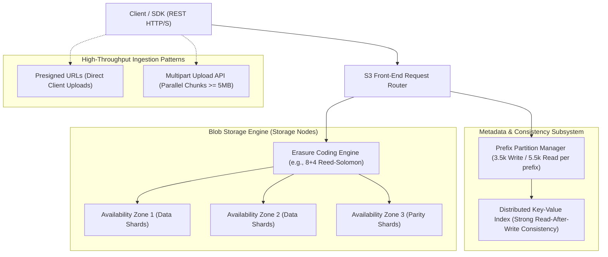

# Amazon S3 and Distributed Object Storage Architecture

## TL;DR

Amazon Simple Storage Service (Amazon S3) is a massively scalable, distributed object storage system engineered for 99.999999999% (11 9's) durability and near-infinite capacity.
Unlike file systems with hierarchical directory trees or block storage with raw disk sectors, S3 operates on a flat namespace where immutable Objects (payload + metadata) are referenced by unique string Keys within Buckets.
Since December 2020, S3 guarantees strong read-after-write consistency across all AWS regions for PUT, LIST, and DELETE operations without performance degradation.
Scalability is driven by automated prefix partitioning: every distinct partition prefix scales independently to support at least 3,500 write requests per second and 5,500 read requests per second.
High durability is achieved through multi-Availability Zone (AZ) erasure coding and continuous background data validation scrubbing.

## Mental Model

Amazon S3 decouples high-throughput metadata indexing from petabyte-scale immutable blob storage, distributing chunks across independent failure domains via erasure coding.



## Architectural Internals and Deep Dive

### 1. Object Storage Foundations: Flat Namespaces and Immutability
Traditional POSIX file systems suffer severe performance bottlenecks at scale because directory lookups, file locking, and inode traversal require complex metadata locking.
Object storage eliminates these constraints:
- **Flat Namespace**: Directories do not exist at the storage layer. Slashes in an object key (`bucket/2026/10/06/report.parquet`) are treated simply as characters within a flat string key.
- **Immutability**: S3 objects are completely immutable. An object cannot be appended to or modified in-place. Modifying a byte requires rewriting and replacing the entire object atomically.
- **Atomic Operations**: A `PUT` or `DELETE` is fully atomic. A reader never sees a partially written, torn, or half-updated object; clients observe either the complete previous version or the complete new version.

### 2. Strong Read-After-Write Consistency Mechanics
Historically, S3 operated under an eventual consistency model for overwrites and deletions, where a `PUT` of an existing key or a `DELETE` took variable seconds to replicate across metadata caches, occasionally returning stale data.
In December 2020, AWS deployed an architectural overhaul to deliver Strong Read-After-Write Consistency:
- Applies to all `PUT`, `DELETE`, and `LIST` operations on both new and overwritten objects.
- Immediate Consistency: Immediately after a `PUT` receives an HTTP 200 OK acknowledgment, any subsequent `GET` or `LIST` request across any client in any location will observe the new mutation.
- Eliminates the need for external consistency synchronization databases (such as S3Guard / DynamoDB) in distributed query engines (Apache Spark, Trino, Presto).

### 3. Prefix Partitioning and Request Rate Scaling
S3 scales request throughput automatically based on partition prefixes.
A prefix is the string sequence between the bucket name and the object name (e.g., in `my-bucket/orders/cust1/file.csv`, the prefix is `orders/cust1/`):
- **Base Request Limits**: Each partitioned prefix supports at least:
  - 3,500 `PUT` / `POST` / `DELETE` requests per second.
  - 5,500 `GET` / `HEAD` requests per second.
- **Automated Partition Splitting**: S3 continuously monitors request patterns. When traffic against a prefix approaches capacity limits, S3 automatically splits the prefix key range across multiple internal storage partitions without client disruption.
- **Horizontal Throughput Multiplication**: By distributing workloads across 10 distinct prefixes (`orders/p1/`, `orders/p2/`, ... `orders/p10/`), an application can achieve 55,000 read requests per second and 35,000 write requests per second across a single bucket.

### 4. Multipart Uploads Architecture
For objects larger than 100MB, and mandatory for objects larger than 5GB, applications utilize the Multipart Upload API:
1. **Initiate**: `InitiateMultipartUpload` creates an upload session and returns an `UploadId`.
2. **Parallel Uploads**: The client splits the file into parts (minimum part size 5MB, maximum 5GB, up to 10,000 parts) and uploads them concurrently using `UploadPart`.
   - Each part is transferred independently over separate HTTP connections.
   - If a network failure interrupts part 87, only part 87 is retried, avoiding the need to re-upload the entire multi-gigabyte file.
   - Each uploaded part returns an MD5/SHA256 ETag checksum.
3. **Complete**: `CompleteMultipartUpload` submits the ordered list of Part Numbers and ETags. S3 validates and assembles the parts into a single logical object atomically.
4. **Abort Lifecycle**: Abandoned multipart uploads leave un-assembled chunks on S3, continuing to incur storage charges until explicitly aborted or cleaned up via S3 Lifecycle Rules (`AbortIncompleteMultipartUpload`).

### 5. Durability: Erasure Coding and 11 9's Mechanics
S3 is engineered for 99.999999999% (11 9's) durability per year:
- **Durability Probability**: With 11 9's of durability, storing 10,000,000 objects guarantees an expected loss of at most one object every 10,000 years.
- **Multi-AZ Erasure Coding**: Instead of maintaining simple 3x replicas (which would impose 200% storage overhead), S3 utilizes Reed-Solomon Erasure Coding across a minimum of three distinct Availability Zones.
  - An object payload is broken into $K$ data shards, and an additional $M$ parity shards are computed.
  - The $K + M$ shards are distributed across physically isolated datacenters with redundant power, networking, and flood zones.
  - The object can be fully reconstructed even if $M$ entire storage nodes or an entire Availability Zone experience total hardware destruction.
- **Continuous Scrubbing**: Background autonomous scrubber agents scan stored shards continuously, calculating checksums to detect and repair silent bit rot before multi-device degradation can compromise data integrity.

### 6. Storage Classes and Lifecycle Management
S3 optimizes storage costs by providing tiered storage classes with automatic lifecycle transitions:
- **S3 Standard**: Default class; sub-10ms first-byte latency, active data, highest storage cost, lowest access cost.
- **S3 Intelligent-Tiering**: Automatically moves objects between Frequent, Infrequent, and Archive access tiers based on monitored access patterns without retrieval fees.
- **S3 Standard-IA (Infrequent Access)**: Lower storage cost, but charges per-GB retrieval fees; designed for data accessed $<1$ time per month.
- **S3 Glacier Instant Retrieval**: Lowest-cost storage for data requiring milliseconds access (medical records, insurance documents).
- **S3 Glacier Flexible Retrieval**: Archive storage; retrieval takes 1-5 minutes (Expedited) or 3-5 hours (Standard).
- **S3 Glacier Deep Archive**: Coldest storage class; costs ~$0.00099 per GB/month; retrieval takes 12-48 hours.

### 7. Security: Presigned URLs and Identity Boundaries
S3 provides multi-layered access authorization:
- **IAM Policies**: User-centric permissions governing actions (`s3:GetObject`, `s3:PutObject`) across resources.
- **Bucket Policies**: Resource-centric JSON policies attached directly to the bucket, governing cross-account access, IP whitelisting, and TLS enforcement (`aws:SecureTransport`).
- **Presigned URLs**: Cryptographically signed URLs that grant time-limited access (e.g., valid for 15 minutes) to download or upload an object without requiring the client to hold AWS IAM credentials:
  - Eliminates server bottlenecks: Clients upload massive video files directly to S3 from mobile or browser apps, completely bypassing application servers.

## Trade-offs and Comparisons

| Dimension | Amazon S3 (Object Storage) | Amazon EBS (Block Storage) | Amazon EFS (File Storage / NFS) |
| :--- | :--- | :--- | :--- |
| **Data Interface** | HTTP/S REST API (GET, PUT, DELETE) | Raw block volume (Attached disk) | POSIX compliant file system (NFSv4) |
| **Mutability** | Strictly immutable (Full object overwrite) | In-place byte mutability (Random I/O) | Appendable, in-place editable files |
| **Latency SLA** | 10ms - 100ms first-byte latency | Sub-millisecond to single-digit ms | 1ms - 10ms latency |
| **Durability** | 99.999999999% (11 9's, Multi-AZ) | 99.8% - 99.999% (Single AZ only) | 99.999999999% (11 9's, Multi-AZ) |
| **Max Capacity** | Virtually unlimited (Petabytes/Exabytes) | 64TB per volume | Elastic (Petabytes) |
| **Cost per GB/Month** | Low (~$0.023 Standard to $0.00099 Deep Archive) | High (~$0.08 - $0.125 / GB) | Moderate (~$0.30 / GB) |
| **Concurrent Access** | Millions of concurrent HTTP clients | Single EC2 instance (or Multi-Attach nitro) | Thousands of EC2 instances simultaneously |

## Failure Modes and Mitigations

### 1. Incomplete Multipart Upload Accumulation
- *Root Cause*: Client crashes or network errors interrupt multipart uploads. The uncompleted parts remain in S3 storage indefinitely, hidden from standard `LIST` commands, continuing to incur silent monthly storage charges.
- *Mitigation*: Create an S3 Bucket Lifecycle Rule with `AbortIncompleteMultipartUpload` configured to purge incomplete parts after 3 or 7 days.

### 2. Prefix Rate Limit 503 Slow Down Errors
- *Root Cause*: Application traffic bursts to >3,500 writes/sec or >5,500 reads/sec against a single prefix before S3's automated partition splitter can detect and split the prefix. S3 returns HTTP `503 Slow Down`.
- *Mitigation*: Implement client-side exponential backoff and jitter; design keys with hash prefixes (e.g., `bucket/<hex_hash>/<entity_id>/`) to proactively spread high-throughput ingestion across multiple prefixes.

### 3. Accidental Bulk Deletion or Ransomware Overwrite
- *Root Cause*: Rogue scripts, compromised IAM credentials, or faulty data pipelines issue recursive `DELETE` or overwrite operations across critical buckets.
- *Mitigation*: Enable S3 Versioning; configure MFA Delete; deploy S3 Object Lock in Compliance Mode (WORM: Write Once, Read Many) to make objects immutable against root deletion for a retention window.

### 4. Public Bucket Exposure Leakage
- *Root Cause*: Overly permissive bucket policies or ACL misconfigurations accidentally expose sensitive enterprise data to the public internet (`AllUsers`).
- *Mitigation*: Enable "S3 Block Public Access" at both the AWS Account level and Bucket level; verify policies using AWS IAM Access Analyzer.

## Hands-On Verification

### Multi-OS Diagnostic Commands

#### Linux / macOS (AWS CLI)
```bash
# List buckets and measure total bucket storage size
aws s3 ls

# Inspect bucket versioning and encryption configuration
aws s3api get-bucket-versioning --bucket my-test-bucket
aws s3api get-bucket-encryption --bucket my-test-bucket

# Check for incomplete multipart uploads accumulating costs
aws s3api list-multipart-uploads --bucket my-test-bucket

# Upload file with explicit server-side encryption (KMS)
aws s3 cp local_data.csv s3://my-test-bucket/data/local_data.csv --sse aws:kms
```

#### Windows (PowerShell)
```powershell
# Verify AWS CLI connectivity and list top objects in prefix
aws s3 ls s3://my-test-bucket/logs/ --human-readable --summarize

# Test pre-signed URL generation via PowerShell wrapper
aws s3 presign s3://my-test-bucket/reports/annual.pdf --expires-in 300
```

### Standalone Distributed Object Storage and Erasure Coding Simulation (Python Standard Library)

The following runnable script requires only the Python standard library.
It models Amazon S3's core architecture: flat namespace bucket and object storage with strong read-after-write consistency, automated partition prefix splitting based on request frequency, multi-Availability Zone erasure coding ($K=2, M=1$) with continuous background bit-rot scrubbing and shard reconstruction, the complete Multipart Upload lifecycle (initiation, parallel part uploads with MD5 ETags, atomic completion, and abort cleanup), and cryptographic HMAC-SHA256 presigned URL generation and expiration verification.

```python
"""
Amazon S3 Distributed Object Storage, Erasure Coding, and Multipart Upload Simulation
Pure Python 3 standard library implementation.
Demonstrates:
- Flat namespace key-value metadata index with Strong Read-After-Write Consistency
- Automated partition prefix scaling and split detection
- Multi-AZ Reed-Solomon style Erasure Coding (K=2 data, M=1 parity)
- Autonomous background scrubber repairing silent bit rot
- Multipart Upload API (Initiate, UploadPart, CompleteMultipartUpload, Abort)
- Cryptographic Presigned URL generation and time-bounded HMAC verification
"""

import hashlib
import hmac
import time
from dataclasses import dataclass, field
from typing import Any, Dict, List, Optional, Set, Tuple

def create_erasure_shards(data: bytes, k: int = 2) -> List[bytes]:
    """Splits payload into K data shards and computes 1 XOR parity shard."""
    chunk_len = (len(data) + k - 1) // k
    padded = data.ljust(chunk_len * k, b"\x00")
    data_shards = [padded[i * chunk_len:(i + 1) * chunk_len] for i in range(k)]
    parity = bytearray(chunk_len)
    for shard in data_shards:
        for i, b in enumerate(shard):
            parity[i] ^= b
    return data_shards + [bytes(parity)]

def reconstruct_erasure_data(shards: List[Optional[bytes]], orig_len: int, k: int = 2) -> bytes:
    """Reconstructs original payload from surviving data and parity shards."""
    if shards[0] is not None and shards[1] is not None:
        return (shards[0] + shards[1])[:orig_len]
    valid_shards = [s for s in shards if s is not None]
    if not valid_shards:
        raise ValueError("All shards lost!")
    chunk_len = len(valid_shards[0])
    if shards[0] is None and shards[1] is not None and shards[2] is not None:
        rec_s0 = bytearray(chunk_len)
        for i in range(chunk_len):
            rec_s0[i] = shards[1][i] ^ shards[2][i]
        return (bytes(rec_s0) + shards[1])[:orig_len]
    if shards[1] is None and shards[0] is not None and shards[2] is not None:
        rec_s1 = bytearray(chunk_len)
        for i in range(chunk_len):
            rec_s1[i] = shards[0][i] ^ shards[2][i]
        return (shards[0] + bytes(rec_s1))[:orig_len]
    raise ValueError("Too many lost shards for parity reconstruction!")

@dataclass
class StoredObject:
    bucket: str
    key: str
    size: int
    etag: str
    shards: Dict[str, bytes]
    checksums: Dict[str, str]

@dataclass
class MultipartSession:
    upload_id: str
    bucket: str
    key: str
    parts: Dict[int, Tuple[str, bytes]] = field(default_factory=dict)

class SimulatedS3Engine:
    def __init__(self, secret_key: str = "s3-secret-key-42") -> None:
        self.secret_key = secret_key.encode("utf-8")
        self.metadata_index: Dict[str, StoredObject] = {}
        self.prefix_access_counter: Dict[str, int] = {}
        self.multipart_sessions: Dict[str, MultipartSession] = {}
        self.az_nodes = ["us-east-1a", "us-east-1b", "us-east-1c"]
        self.split_threshold = 5

    def _get_prefix(self, key: str) -> str:
        parts = key.split("/")
        return "/".join(parts[:-1]) + "/" if len(parts) > 1 else ""

    def _record_prefix_access(self, prefix: str) -> None:
        self.prefix_access_counter[prefix] = self.prefix_access_counter.get(prefix, 0) + 1
        count = self.prefix_access_counter[prefix]
        if count >= self.split_threshold:
            print(f"[Prefix Scaling] Prefix {prefix!r} crossed {count} requests: automated partition split triggered.")

    def put_object(self, bucket: str, key: str, payload: bytes) -> StoredObject:
        full_key = f"{bucket}/{key}"
        prefix = self._get_prefix(key)
        self._record_prefix_access(prefix)

        md5_etag = hashlib.md5(payload).hexdigest()
        shards = create_erasure_shards(payload, k=2)

        shard_map: Dict[str, bytes] = {}
        checksum_map: Dict[str, str] = {}
        for az, shard in zip(self.az_nodes, shards):
            shard_map[az] = shard
            checksum_map[az] = hashlib.sha256(shard).hexdigest()

        obj = StoredObject(
            bucket=bucket,
            key=key,
            size=len(payload),
            etag=md5_etag,
            shards=shard_map,
            checksums=checksum_map
        )
        self.metadata_index[full_key] = obj
        print(f"[PUT Success] {full_key} stored ({len(payload)} bytes, ETag: {md5_etag}) across {self.az_nodes}.")
        return obj

    def get_object(self, bucket: str, key: str) -> bytes:
        full_key = f"{bucket}/{key}"
        prefix = self._get_prefix(key)
        self._record_prefix_access(prefix)

        if full_key not in self.metadata_index:
            raise KeyError(f"NoSuchKey: {full_key}")

        obj = self.metadata_index[full_key]
        shards_list = [obj.shards.get(az) for az in self.az_nodes]
        data = reconstruct_erasure_data(shards_list, obj.size, k=2)
        print(f"[GET Success] {full_key} reconstructed ({len(data)} bytes, ETag: {obj.etag}).")
        return data

    def scrub_and_repair(self) -> int:
        repaired_count = 0
        for full_key, obj in self.metadata_index.items():
            valid_shards = []
            corrupted_az = None
            for az in self.az_nodes:
                shard = obj.shards.get(az)
                if shard is None:
                    valid_shards.append(None)
                    corrupted_az = az
                elif hashlib.sha256(shard).hexdigest() != obj.checksums[az]:
                    print(f"[Bit Rot Detected] Shard in {az} for {full_key} corrupted! Checksum mismatch.")
                    valid_shards.append(None)
                    corrupted_az = az
                else:
                    valid_shards.append(shard)
            if corrupted_az is not None:
                reconstructed = reconstruct_erasure_data(valid_shards, obj.size, k=2)
                fresh_shards = create_erasure_shards(reconstructed, k=2)
                az_idx = self.az_nodes.index(corrupted_az)
                obj.shards[corrupted_az] = fresh_shards[az_idx]
                obj.checksums[corrupted_az] = hashlib.sha256(fresh_shards[az_idx]).hexdigest()
                repaired_count += 1
                print(f"[Scrubber Repair] Shard in {corrupted_az} regenerated from parity for {full_key}.")
        return repaired_count

    def initiate_multipart_upload(self, bucket: str, key: str) -> str:
        upload_id = hashlib.sha256(f"{bucket}/{key}/{time.time()}".encode("utf-8")).hexdigest()[:16]
        self.multipart_sessions[upload_id] = MultipartSession(upload_id=upload_id, bucket=bucket, key=key)
        print(f"[Multipart] Initiated upload session {upload_id} for {bucket}/{key}")
        return upload_id

    def upload_part(self, upload_id: str, part_num: int, payload: bytes) -> str:
        session = self.multipart_sessions[upload_id]
        part_etag = hashlib.md5(payload).hexdigest()
        session.parts[part_num] = (part_etag, payload)
        print(f"[Multipart] Uploaded Part {part_num} ({len(payload)} bytes, ETag: {part_etag})")
        return part_etag

    def complete_multipart_upload(self, upload_id: str, part_manifest: List[Dict[str, Any]]) -> StoredObject:
        session = self.multipart_sessions.pop(upload_id)
        assembled_payload = bytearray()
        part_etags = []
        for item in sorted(part_manifest, key=lambda x: x["PartNumber"]):
            p_num = item["PartNumber"]
            expected_etag = item["ETag"]
            stored_etag, p_data = session.parts[p_num]
            if stored_etag != expected_etag:
                raise ValueError(f"Part {p_num} ETag mismatch!")
            assembled_payload.extend(p_data)
            part_etags.append(bytes.fromhex(stored_etag))

        combined_hash = hashlib.md5(b"".join(part_etags)).hexdigest()
        composite_etag = f"{combined_hash}-{len(part_manifest)}"
        obj = self.put_object(session.bucket, session.key, bytes(assembled_payload))
        obj.etag = composite_etag
        print(f"[Multipart Complete] Object {session.bucket}/{session.key} committed with composite ETag {composite_etag}")
        return obj

    def abort_multipart_upload(self, upload_id: str) -> None:
        if upload_id in self.multipart_sessions:
            del self.multipart_sessions[upload_id]
            print(f"[Multipart Abort] Cleaned up upload session {upload_id} and purged temporary chunks.")

    def generate_presigned_url(self, bucket: str, key: str, expires_in_sec: int = 900) -> str:
        expiry = int(time.time()) + expires_in_sec
        string_to_sign = f"GET\n{bucket}/{key}\n{expiry}"
        sig = hmac.new(self.secret_key, string_to_sign.encode("utf-8"), hashlib.sha256).hexdigest()
        return f"https://{bucket}.s3.amazonaws.com/{key}?Expires={expiry}&Signature={sig}"

    def validate_presigned_url(self, url: str) -> bool:
        try:
            base, query = url.split("?")
            params = dict(q.split("=") for q in query.split("&"))
            expiry = int(params["Expires"])
            sig = params["Signature"]
            bucket_domain = base.split("://")[1].split("/")[0]
            bucket = bucket_domain.replace(".s3.amazonaws.com", "")
            key = base.split(f"{bucket_domain}/")[1]
            if time.time() > expiry:
                return False
            expected_string = f"GET\n{bucket}/{key}\n{expiry}"
            expected_sig = hmac.new(self.secret_key, expected_string.encode("utf-8"), hashlib.sha256).hexdigest()
            return hmac.compare_digest(sig, expected_sig)
        except Exception:
            return False

if __name__ == "__main__":
    s3 = SimulatedS3Engine()
    s3.put_object("analytics", "data/2026/sales.csv", b"id,amount\n1,100\n2,200\n3,300\n")
    s3.get_object("analytics", "data/2026/sales.csv")

    uid = s3.initiate_multipart_upload("videos", "movies/hero.mp4")
    e1 = s3.upload_part(uid, 1, b"chunk_1_video_stream_data")
    e2 = s3.upload_part(uid, 2, b"chunk_2_video_stream_data")
    s3.complete_multipart_upload(uid, [{"PartNumber": 1, "ETag": e1}, {"PartNumber": 2, "ETag": e2}])

    obj = s3.metadata_index["analytics/data/2026/sales.csv"]
    obj.shards["us-east-1a"] = b"CORRUPTED_BIT_ROT_DATA"
    repairs = s3.scrub_and_repair()
    data = s3.get_object("analytics", "data/2026/sales.csv")

    url = s3.generate_presigned_url("analytics", "data/2026/sales.csv", expires_in_sec=60)
    print(f"[Presigned URL] Generated: {url}")
    print(f"[Presigned URL Valid] Signature matches: {s3.validate_presigned_url(url)}")
```

### Live Cloud Integration Script (AWS Boto3 Client)

The following runnable script demonstrates programmatic multipart upload for large files, calculates part checksums, and generates time-bounded presigned download URLs using `boto3`.

```python
"""
Amazon S3 Multipart Upload and Presigned URL Generation Script
Prerequisites: pip install boto3
Requires configured AWS credentials (AWS_ACCESS_KEY_ID, AWS_SECRET_ACCESS_KEY).
"""

import boto3
import io
import math
from botocore.exceptions import ClientError

def run_s3_operations():
    s3_client = boto3.client('s3', region_name='us-east-1')
    bucket_name = "test-distributed-systems-bucket"
    object_key = "large_assets/sample_blob.bin"
    
    print(f"[Init] Connecting to S3 to upload {object_key}...")
    
    # 1. Synthesize 12MB of in-memory data (greater than 5MB minimum part size)
    data_size = 12 * 1024 * 1024  # 12MB
    dummy_data = b"0" * data_size
    data_stream = io.BytesIO(dummy_data)
    
    part_size = 6 * 1024 * 1024  # 6MB per part (2 parts total)
    total_parts = math.ceil(data_size / part_size)
    
    try:
        # 2. Initiate Multipart Upload
        mpu = s3_client.create_multipart_upload(Bucket=bucket_name, Key=object_key)
        upload_id = mpu['UploadId']
        print(f"[Multipart] Initiated upload session: {upload_id}")
        
        parts_manifest = []
        
        # 3. Upload Parts in chunks
        for part_num in range(1, total_parts + 1):
            chunk = data_stream.read(part_size)
            response = s3_client.upload_part(
                Bucket=bucket_name,
                Key=object_key,
                PartNumber=part_num,
                UploadId=upload_id,
                Body=chunk
            )
            parts_manifest.append({
                'PartNumber': part_num,
                'ETag': response['ETag']
            })
            print(f"[Multipart] Uploaded Part {part_num}/{total_parts} (ETag: {response['ETag']})")
            
        # 4. Complete Multipart Upload
        s3_client.complete_multipart_upload(
            Bucket=bucket_name,
            Key=object_key,
            UploadId=upload_id,
            MultipartUpload={'Parts': parts_manifest}
        )
        print("[Multipart Success] CompleteMultipartUpload verified.")
        
        # 5. Generate Presigned URL for Secure Client Access (valid 15 minutes)
        presigned_url = s3_client.generate_presigned_url(
            'get_object',
            Params={'Bucket': bucket_name, 'Key': object_key},
            ExpiresIn=900
        )
        print(f"[Presigned URL] Generated time-limited access URL:\n{presigned_url}")
        
    except ClientError as err:
        print(f"[AWS Error] S3 Operation aborted: {err}")
        if 'upload_id' in locals():
            s3_client.abort_multipart_upload(Bucket=bucket_name, Key=object_key, UploadId=upload_id)
            print("[Cleanup] Aborted incomplete multipart upload.")

if __name__ == "__main__":
    # Note: Requires active AWS credentials or mock environment (Moto/LocalStack)
    try:
        run_s3_operations()
    except Exception as exc:
        print(f"[Info] Script requires active AWS credentials to execute against live cloud: {exc}")
```

## Performance Characteristics and Capacity Planning

### 1. Partition Prefix Capacity Formula
An application distributing reads and writes across $P$ distinct partition prefixes achieves aggregate throughput bounded by:

$$\text{MaxWriteThroughput} = P \times 3,500 \text{ operations/sec}$$

$$\text{MaxReadThroughput} = P \times 5,500 \text{ operations/sec}$$

For an application utilizing $P = 20$ partitioned prefixes:
- Max Write: $20 \times 3,500 = 70,000\text{ writes/sec}$.
- Max Read: $20 \times 5,500 = 110,000\text{ reads/sec}$.

### 2. S3 Storage Cost Estimation Math
Given 500 Terabytes of total data stored in US-East-1:
- Tier Breakdown:
  - 100TB in S3 Standard ($0.023 / GB) = $100 \times 1024 \times 0.023 \approx \$2,355.20 / \text{month}$.
  - 250TB in S3 Standard-IA ($0.0125 / GB) = $250 \times 1024 \times 0.0125 \approx \$3,200.00 / \text{month}$.
  - 150TB in S3 Glacier Deep Archive ($0.00099 / GB) = $150 \times 1024 \times 0.00099 \approx \$152.06 / \text{month}$.
- Total Storage Cost: $\approx \$5,707.26 / \text{month}$.
Transitioning 150TB from Standard to Deep Archive reduces the storage cost for that data by over $95\%$.

## In Production: Real-World Case Studies

### 1. Netflix Cloud Native Media Transcoding
Netflix ingests master digital video files from production studios and transcodes them into thousands of device-specific bitrates:
- **Direct S3 Ingestion**: Studio cameras upload raw terabyte files directly to S3 using Presigned URLs and Multipart Uploads, bypassing corporate web gateways.
- **Massive Parallel Transcoding**: Thousands of Amazon EC2 spot instances read video parts in parallel directly from S3, transcode chunks into target codecs, and write output parts back to S3 concurrently, leveraging multi-prefix request scaling.

### 2. Dropbox's Migration to Magic Pocket
Dropbox operated on Amazon S3 for years before building its own custom distributed object storage system, Magic Pocket:
- **Scale Drivers**: By 2016, Dropbox stored over 500 petabytes of user data, making AWS S3 operational costs a primary business expense.
- **Custom Architecture**: Replicated S3's core design principles (flat namespaces, block immutability, Reed-Solomon erasure coding, and separate metadata indexing) on custom bare-metal storage hardware across customized datacenters.

## Staff+ Interview Questions

> [!question]
> How does Amazon S3 deliver Strong Read-After-Write Consistency across all regions, and what architectural limitations did this resolve for distributed analytics engines like Apache Spark?

> [!success]- Answer
> Prior to December 2020, Amazon S3 operated under eventual consistency for object overwrites and deletions. When a client overwrote or deleted an object, the metadata update took variable time to propagate across S3's distributed metadata caches, causing immediate subsequent `GET` or `LIST` operations to return stale data. For distributed query engines like Apache Spark, Hadoop, and Trino, this was problematic: when Spark committed an output dataset by writing files and immediately executing a `LIST` to verify task completion, missing files caused queries to fail or return corrupted results, requiring fragile external consistency layers like S3Guard. In 2020, AWS redesigned S3's metadata subsystem using high-speed consensus-backed metadata journals: every `PUT`, `POST`, `DELETE`, and `LIST` operation updates the authoritative replication journal atomically. Once an HTTP 200 OK is returned, any subsequent read or list request globally observes the committed mutation immediately without any performance or latency penalty.

> [!question]
> How does S3 partition prefixes to achieve horizontal scaling, and how should an engineer design object key hierarchies to maximize throughput?

> [!success]- Answer
> In Amazon S3, request rates are governed by internal partition prefixes, with each prefix supporting at least 3,500 write requests per second and 5,500 read requests per second. Under the hood, S3 manages a B-tree-like index of keys. When traffic against a prefix increases, S3 automatically splits the prefix into sub-partitions. Historically, engineers had to prepend randomized MD5 hashes to keys (e.g., `s3://bucket/a7b2-orders/`) to force S3 to distribute keys across different internal partitions. Modern S3 automatically detects high traffic and splits prefixes. However, engineers should still structure high-throughput applications to avoid concentrating all traffic on a single static path. By partitioning keys across logical dimensions (e.g., `orders/region_us/`, `orders/region_eu/` or using date-hour buckets), an application automatically scales across multiple S3 prefixes, multiplying aggregate cluster throughput linearly.

> [!question]
> Explain how Multipart Upload works in S3. Why is it mandatory for files larger than 5GB, and what operational risk occurs if failed multipart uploads are not cleaned up?

> [!success]- Answer
> Multipart Upload splits large files into parts (between 5MB and 5GB each, up to 10,000 parts) uploaded independently over parallel HTTP connections. It is mandatory for objects $>5\text{GB}$ because a single standard `PUT` request has a hard ceiling of 5GB. Multipart uploads provide network resilience: if a network failure disrupts a single 10MB chunk during a 100GB transfer, only that chunk is retried, rather than restarting the entire 100GB upload from the beginning. The operational risk is that parts of an uncompleted multipart upload remain in persistent S3 storage indefinitely. Because they are not assembled into a completed object, they do not appear in standard `aws s3 ls` queries; however, AWS continues to bill storage for every stored part byte. If an application fails to clean them up, terabytes of abandoned parts can accumulate thousands of dollars in silent charges. The mitigation is configuring an S3 Lifecycle Rule to automatically invoke `AbortIncompleteMultipartUpload` after 7 days.

> [!question]
> How does S3 achieve 99.999999999% (11 9's) durability without the massive cost penalty of traditional 3x or 4x physical replication?

> [!success]- Answer
> Simple 3x replication requires 200% storage overhead (300TB of raw disk to store 100TB of data). Amazon S3 achieves 11 9's durability using Reed-Solomon Erasure Coding distributed across at least three physically distinct Availability Zones (AZs). An object payload is broken into $K$ data shards, and $M$ parity shards are computed (for example, an $8+4$ or $12+4$ scheme). These $K+M$ shards are distributed across independent datacenters with separate power, networking, and flood risk zones. The storage overhead of an $8+4$ scheme is only $50\%$ ($1.5\times$), yet the system can tolerate the simultaneous loss of any $M$ storage nodes or an entire Availability Zone facility failure without data loss. Furthermore, continuous background scrubbers scan stored shards, verifying checksums and proactively regenerating degraded blocks before concurrent drive failures can exceed parity thresholds.

> [!question]
> What is a Presigned URL in S3, and why does it represent a superior architecture for handling user media uploads compared to routing traffic through application web servers?

> [!success]- Answer
> A Presigned URL is a cryptographically signed URL generated using AWS IAM credentials that grants time-limited permission (e.g., 15 minutes) to perform a specific S3 action (`GET` or `PUT`) on a specific object key. Without presigned URLs, an architecture requires client devices (mobile phones, browsers) to upload large files (photos, videos) directly to application web servers, which must buffer the payload in memory or disk and re-upload it to S3. This saturates application server CPU, consumes network bandwidth, and forces servers to scale based on media file sizes rather than business logic. With presigned URLs, the application server simply validates user authentication and generates a presigned URL in under 2ms. The client then uploads the multi-gigabyte video directly to Amazon S3 via HTTP `PUT`. S3 absorbs the network and storage ingestion load, while application servers remain lightweight and stateless.

> [!question]
> Compare the latency, retrieval cost, and durability characteristics of S3 Standard, S3 Standard-IA, and S3 Glacier Deep Archive.

> [!success]- Answer
> All three classes provide identical 99.999999999% (11 9's) durability across multiple Availability Zones. S3 Standard offers sub-10ms first-byte latency, zero retrieval fees, and charges highest for storage (~$0.023/GB/month), ideal for active frequently accessed data. S3 Standard-Infrequent Access (Standard-IA) maintains sub-10ms latency, reduces storage costs by ~45% (~$0.0125/GB/month), but introduces a retrieval fee (~$0.01/GB retrieved) and a 30-day minimum storage duration, designed for backup and disaster recovery data accessed less than once a month. S3 Glacier Deep Archive offers lowest-cost storage (~$0.00099/GB/month, a 95% reduction vs Standard), has a 180-day minimum storage duration, charges higher retrieval fees, and has a retrieval latency of 12 to 48 hours, purpose-built for regulatory compliance and tape replacement archives that are rarely if ever accessed.

> [!question]
> What is S3 Object Lock, and what is the difference between Governance Mode and Compliance Mode?

> [!success]- Answer
> S3 Object Lock enforces Write Once, Read Many (WORM) storage, preventing objects from being deleted or overwritten for a fixed retention period or indefinite legal hold. In Governance Mode, users cannot delete or overwrite an object version or alter its lock settings unless they possess specific IAM permissions (`s3:BypassGovernanceRetention`). This protects data against accidental deletion by developers while permitting administrators to override the lock if necessary. In Compliance Mode, the lock is strictly irreversible: no user, including the AWS root account or administrative users, can delete the object or reduce the retention period until the retention window expires. Even AWS Support cannot delete objects in Compliance Mode, providing strict regulatory compliance (such as SEC Rule 17a-4).

> [!question]
> Why are POSIX directory operations like `mv` (rename) or `ls` (directory listing) inherently inefficient when executed over an S3-backed file system interface?

> [!success]- Answer
> In a POSIX file system, renaming a directory is an instant $O(1)$ operation that simply updates an inode pointer in the parent directory table. In S3, directories do not exist; all objects reside in a flat namespace where slashes are simply characters in the string key. To execute an `mv` command on a folder containing 10,000 files, an S3-backed interface must execute 10,000 independent HTTP `CopyObject` requests to rewrite every key with the new prefix, followed by 10,000 independent HTTP `DeleteObject` requests to delete the old keys. Furthermore, `ls` requires scanning and paginating through S3's distributed key index via `ListObjectsV2` (returning at most 1,000 keys per HTTP round-trip), converting what is normally a localized disk metadata read into dozens or hundreds of sequential network calls.

> [!question]
> How does Amazon S3 detect and mitigate silent data corruption (bit rot), and how does the background scrubber prevent catastrophic data loss in cold storage tiers?

> [!success]- Answer
> Silent data corruption (bit rot) occurs when physical media degrades over time due to magnetic field dissipation, cosmic rays, or silent disk controller errors, altering bytes without raising hardware I/O exceptions.
> Amazon S3 combats bit rot through end-to-end cryptographic checksum verification and continuous autonomous background scrubbing.
> When an object is written, S3 calculates and persists cryptographic hashes for every individual erasure-coded shard across each Availability Zone.
> Autonomous background scrubber agents continuously scan all stored shards across petabytes of physical disks, reading raw blocks and recomputing checksums against the stored cryptographic manifests.
> If a scrubber detects a bit rot mismatch or an unreadable sector, it does not fail the object.
> Instead, it streams the healthy data and parity shards from peer Availability Zones, reconstructs the corrupted shard in memory using Reed-Solomon math, and writes a pristine replacement shard to a new healthy storage node.
> This proactive background scrubbing ensures that drive and sector failures are constantly healed before independent device degradation can exceed the parity threshold.

> [!question]
> What is the architectural difference between Amazon S3 Standard and S3 Express One Zone, and why does S3 Express achieve single-digit millisecond latencies?

> [!success]- Answer
> Amazon S3 Standard is engineered for regional multi-AZ resilience, replicating erasure-coded shards across at least three physically separated Availability Zones, which incurs multi-datacenter network round-trip overhead and results in 10ms to 50ms first-byte latency.
> S3 Express One Zone is an ultra-low-latency storage class engineered specifically for latency-critical, compute-intensive workloads such as machine learning training, financial simulations, and distributed analytics.
> S3 Express hosts data within a single Availability Zone, co-locating storage nodes directly alongside compute clusters on high-performance NVMe hardware, achieving single-digit millisecond latency and supporting hundreds of thousands of requests per second.
> Furthermore, S3 Express replaces traditional bucket namespaces with purpose-built Directory Buckets and introduces session-based authentication (`CreateSession`).
> Rather than recalculating expensive HMAC-SHA256 AWS Signature Version 4 (SigV4) headers on every individual HTTP request, clients establish a short-lived authenticated session token, eliminating CPU authentication overhead and enabling microsecond request dispatching.

## Related Concepts and Wikilinks

- [[Consistency-Models]] - S3's evolution from eventual to strong read-after-write consistency.
- [[Partitioning-and-Sharding]] - Prefix-based horizontal partitioning mechanics.
- [[API-Authentication-and-Authorization]] - Presigned URLs, HMAC request signing (AWS SigV4), and IAM policies.
- [[Elasticsearch-and-Apache-Solr]] - Searchable snapshots backed by S3 object stores.
- [[Hadoop-and-HDFS]] - Object storage architectures versus distributed append-only file systems.
- [[ACID-vs-BASE]] - BASE storage trade-offs and eventual consistency history.

## Further Reading and References

- Amazon Web Services. *Amazon Simple Storage Service Developer Guide*. AWS Documentation, 2024.
- DeCandia, Giuseppe, et al. "Dynamo: Amazon’s Highly Available Key-Value Store." *ACM SIGOPS Operating Systems Review*, 2007.
- AWS Architecture Team. "Diving Deep on Amazon S3 Consistency." *AWS Storage Blog*, December 2020.
- Kleppmann, Martin. *Designing Data-Intensive Applications*. O'Reilly Media, 2017. Chapter 10: Batch Processing.
- Fritchman, Andrew, et al. "Magic Pocket: The Dropbox Distributed Storage System." *Dropbox Tech Blog*, 2016.
