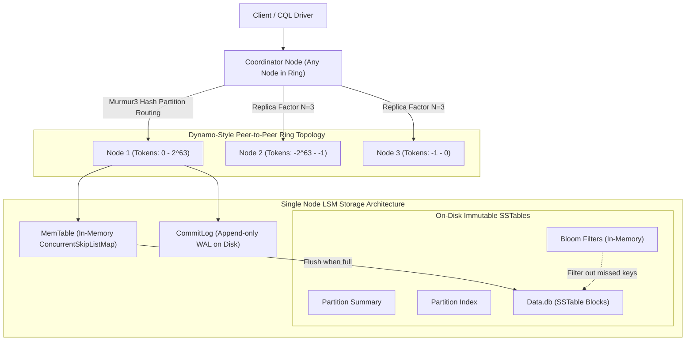

# Apache Cassandra Architecture and Internals

## TL;DR

Apache Cassandra is a highly scalable, masterless, distributed wide-column NoSQL database engineered for high write throughput, linear horizontal scalability, and operational fault tolerance.
Originating from a hybrid of Amazon's Dynamo distributed ring topology and Google's Bigtable data model, Cassandra eliminates single points of failure by assigning all cluster nodes identical responsibilities.
Data distribution is governed by consistent hashing across a token ring using the Murmur3Partitioner, with virtual nodes (vnodes) ensuring uniform physical load.
Storage on each node utilizes a Log-Structured Merge Tree (LSM-Tree) engine consisting of append-only commit logs, in-memory MemTables, and immutable on-disk Sorted String Tables (SSTables) guarded by Bloom filters.
Cassandra offers tunable consistency per read and write operation, achieving strict strong consistency whenever read and write quorums satisfy $R + W > N$.

## Mental Model

Cassandra distributes data across a peer-to-peer ring topology using consistent hashing, while individual nodes persist data via an append-only LSM storage engine.



## Architectural Internals and Deep Dive

### 1. Peer-to-Peer Ring and Consistent Hashing
Cassandra has no master or coordinator nodes; all nodes are architectural peers.
Any node contacted by a client acts as the dynamic Coordinator Node for that specific request.
The cluster forms a logical token ring bounded by 64-bit signed integers $[-2^{63}, 2^{63}-1]$.
The `Murmur3Partitioner` hashes the row's partition key into a 64-bit token to locate the primary replica on the ring.
Successive replicas are assigned to downstream nodes moving clockwise along the ring, governed by the keyspace's `ReplicationStrategy`:
- `SimpleStrategy`: Places subsequent replicas on immediate clockwise successor nodes across the ring without datacenter awareness (development only).
- `NetworkTopologyStrategy`: Datacenter- and rack-aware; assigns replicas across independent availability zones and datacenters to survive rack and facility outages.

To prevent token hot-spotting on uneven physical hardware, Cassandra utilizes Virtual Nodes (vnodes).
A physical machine hosts multiple virtual tokens (default 128 or 256 vnodes), spreading its ownership evenly across the token space.

### 2. The Gossip Protocol and Failure Detection
Cluster topology and node health are maintained without central coordination through a peer-to-peer Gossip Protocol:
- Every second, each node selects one to three random peers and exchanges gossip messages via UDP on port 7000.
- Gossip spreads cluster metadata (endpoints, tokens, schema versions, heartbeat generation numbers, and statuses) throughout an $N$-node cluster in $O(\log N)$ time.
- Nodes track peer liveness using the Phi Accrual Failure Detector ($\Phi$).
Rather than relying on binary timeouts, the Phi detector computes a continuous statistical probability distribution of heartbeat inter-arrival intervals.
When $\Phi$ exceeds a configured threshold (typically $\Phi = 8$ for local networks or $\Phi = 12$ for cross-datacenter WAN links), the node marks the peer as down, routing future queries to healthy replicas and queuing hinted handoffs.

### 3. The Write Path Internals
Cassandra writes require no disk seeks or read-before-write checks, making write operations exceptionally fast:
1. **Coordinator Routing**: The coordinator node hashes the partition key and dispatches concurrent write requests to all $N$ replica nodes.
2. **CommitLog Append**: Upon receiving the write, a replica sequentially appends the raw mutation to the on-disk `CommitLog`.
   Flushing is governed by `commitlog_sync`:
   - `periodic` (default): Appends to OS page cache; `fsync` executed every 10,000ms.
   - `batch`: Blocks the write until `fsync` completes to disk.
3. **MemTable Insertion**: Once appended to the CommitLog, the mutation is written into an in-memory `MemTable` (implemented as a concurrent skiplist map).
4. **Acknowledgment**: The replica immediately returns success to the coordinator. Once the coordinator collects acknowledgments satisfying the requested write consistency level (e.g., `QUORUM`), it responds to the client.

### 4. The Read Path and Multi-Level Indexing
Because reads may need to reconcile fragmented data across multiple SSTables and the active MemTable, reads are structurally more expensive than writes:
1. **MemTable Check**: The node checks active and flushing MemTables for recent mutations.
2. **Key Cache**: Checks in-memory Key Cache for direct disk offsets into SSTable data files.
3. **Bloom Filters**: Evaluates in-memory Bloom filters (10-14 bits per key) for each on-disk SSTable. If the filter returns false, the SSTable is skipped completely, avoiding disk I/O.
4. **Partition Summary and Partition Index**:
   - The Partition Summary is an in-memory sample of the on-disk Partition Index (sampled every 128 partitions).
   - Cassandra uses the summary to locate the precise offset in the on-disk `Index.db` file.
   - `Index.db` points directly to the row offset inside `Data.db`.
5. **Data Extraction & Reconciliation**: Cassandra extracts the row from `Data.db`, merges it with the MemTable version, resolves column-level timestamps (last-write-wins), and returns the consolidated record.

### 5. Compaction Strategies
As MemTables fill up, they flush to disk as immutable SSTables.
Over time, thousands of SSTables accumulate, degrading read performance.
Background Compaction consolidates multiple SSTables into a single new SSTable, purging overwritten rows and tombstones:
- **SizeTieredCompactionStrategy (STCS)**: Default strategy; triggers when multiple SSTables of approximately equal size accumulate. Well-suited for write-heavy workloads, but requires up to 50% free disk space for temporary compaction overhead.
- **LeveledCompactionStrategy (LCS)**: Organizes SSTables into hierarchical levels (L0, L1, L2...), where each level is $10\times$ larger than the preceding level. All SSTables within L1+ have non-overlapping key ranges, guaranteeing that 90% of reads hit at most one SSTable per level. Optimal for read-heavy workloads; incurs higher write amplification.
- **TimeWindowCompactionStrategy (TWCS)**: Groups SSTables into discrete time windows (e.g., 1 day) based on data timestamp. When a time window closes, its SSTables are compacted once and never touched again. Purpose-built for time-series and TTL-expired data.

### 6. Tunable Consistency and Quorum Mathematics
Cassandra allows clients to specify consistency levels dynamically per query:
- **Write Consistency Levels**: `ANY`, `ONE`, `TWO`, `THREE`, `QUORUM`, `LOCAL_QUORUM`, `ALL`.
- **Read Consistency Levels**: `ONE`, `TWO`, `THREE`, `QUORUM`, `LOCAL_QUORUM`, `ALL`.

Quorum is computed as:

$$\text{QUORUM} = \left\lfloor \frac{N}{2} \right\rfloor + 1$$

Where $N$ is the replication factor.

Strong Consistency (Linearizable / Sequential Consistency) is mathematically guaranteed when the number of read nodes $R$ and write nodes $W$ overlaps on at least one replica:

$$R + W > N$$

For multi-datacenter deployments, `LOCAL_QUORUM` restricts quorum calculation exclusively to nodes within the local datacenter, delivering strong consistency locally while eliminating WAN cross-datacenter round-trip latency.

### 7. Deletions and Tombstone Lifecycle
In an append-only immutable storage system, data cannot be deleted in-place.
A deletion writes a special marker called a Tombstone stamped with a deletion timestamp.
A tombstone acts as an active record that suppresses older data during read reconciliation.
Tombstones cannot be reclaimed immediately during compaction because a disconnected or lagging replica might miss the deletion; if compacted away, that lagging replica could later re-introduce the deleted record during anti-entropy repair (a "phantom resurrection").
To prevent this, tombstones persist on disk for `gc_grace_seconds` (default 864,000 seconds = 10 days) before background compaction is permitted to purge them.

### 8. Anti-Entropy and Repair
Data divergence caused by dropped writes or network partitions is resolved through three mechanisms:
1. **Read Repair**: During a read with consistency `QUORUM`, if the coordinator detects timestamp divergence among replica responses, it returns the latest timestamp to the client while asynchronously dispatching background write mutations to stale replicas.
2. **Hinted Handoff**: If a replica is unreachable during a write, the coordinator stores a temporary "hint" on its local disk. When gossip signals that the dead node has rejoined, the coordinator replays the hints. Hints expire after `max_hint_window_in_ms` (default 3 hours).
3. **Manual Repair (`nodetool repair`)**: Replicas construct cryptographic Merkle Trees representing token range data hashes. Nodes exchange Merkle trees; if root hashes match, ranges are identical. If subtrees diverge, nodes synchronize only the diverging token sub-ranges over the network.

## Trade-offs and Comparisons

| Dimension | Apache Cassandra | Apache HBase | MongoDB |
| :--- | :--- | :--- | :--- |
| **Architecture Topology** | Masterless, peer-to-peer ring | Master-Worker (HMaster + RegionServers + ZooKeeper) | Master-Worker Replica Sets (Primary-Secondary) |
| **Storage Engine** | LSM-Tree (MemTable + SSTables) | LSM-Tree (MemStore + HFiles on HDFS) | B-Tree (WiredTiger Engine) |
| **CAP Classification** | AP by default (Tunable to CP via Quorums) | Strictly CP (Single RegionServer owner) | Strictly CP (Primary-only writes by default) |
| **Write Performance** | Extreme throughput (append-only WAL/MemTable) | High throughput (HDFS WAL append) | Moderate to High (B-Tree page locks) |
| **Query Flexibility** | Partition key lookups only (No ad-hoc JOINs) | Row key lookups & prefix scans | Rich JSON queries, secondary indexes, aggregation pipeline |
| **Hardware Failure Impact** | Zero impact; any node handles any query | RegionServer failover causes brief partition pause | Primary failover causes 2-10 second write pause |

## Failure Modes and Mitigations

### 1. Tombstone Overwhelming Exception
- *Root Cause*: High deletion rates or bulk TTL expirations generate millions of tombstones. A query scanning a partition reads more than `tombstone_failure_threshold` (default 100,000) tombstones, triggering a `TombstoneOverwhelmingException` and aborting the query to prevent node OOM crashes.
- *Mitigation*: Avoid using Cassandra as a message queue; model data to drop entire partitions or drop tablespaces rather than deleting individual rows; reduce `gc_grace_seconds` on single-node or low-latency repaired clusters; use TWCS for TTL workloads.

### 2. Large Partition Degradation (Hot Partitions)
- *Root Cause*: Flawed data modeling places millions of rows or gigabytes of data under a single partition key (e.g., `sensor_id` without a time bucketing component), exceeding the recommended 100MB per partition limit.
- *Mitigation*: Introduce composite partition keys with synthetic bucketing (e.g., `((sensor_id, date_bucket), timestamp)`).

### 3. JVM Garbage Collection Pauses
- *Root Cause*: Large MemTables and heavy read cache churn trigger stop-the-world JVM GC pauses (exceeding 2-5 seconds). The cluster Phi failure detector incorrectly assumes paused nodes are dead, triggering gossip flap storms and re-routing storms.
- *Mitigation*: Run Cassandra on modern JVMs with G1GC or ZGC; allocate 16GB-32GB max heap; configure off-heap allocation for MemTables (`memtable_allocation_type: offheap_objects`).

### 4. Compaction Starvation and Disk Saturation
- *Root Cause*: Sustained write bursts create small SSTables faster than compaction can merge them. Disk space approaches 100% because Size-Tiered Compaction requires equal free disk space to write the compacted output file.
- *Mitigation*: Monitor `PendingCompactionTasks`; allocate disk drives with at least 50% headroom for STCS; switch to Leveled Compaction (LCS) or TWCS; throttle write throughput via client-side rate limiters.

## Hands-On Verification

### Multi-OS Diagnostic Commands

#### Linux / macOS (Cassandra CLI & Nodetool)
```bash
# Verify cluster status, tokens, and node load
nodetool status

# Inspect running compaction throughput and pending tasks
nodetool compactionstats

# Check gossip information and phi failure detector values
nodetool gossipinfo | grep -E "STATUS|HEARTBEAT"

# Trace SSTable hit count and Bloom filter false positive ratio
nodetool tablestats system.local

# Connect via CQLSH (Cassandra Query Language Shell)
cqlsh localhost 9042 -e "
DESCRIBE KEYSPACES;
SELECT cluster_name, data_center, partitioner FROM system.local;
"
```

#### Windows (PowerShell)
```powershell
# Verify Cassandra service or Java process
Get-Process -Name java -ErrorAction SilentlyContinue | Where-Object { $_.Path -like "*cassandra*" }

# Run nodetool command via batch wrapper
cmd /c "nodetool.bat ring"
```
### Complete Cassandra Token Ring and LSM Engine Simulation (Pure Python Standard Library)

The following standalone script implements a runnable, pure-Python simulation of Cassandra's distributed architecture without external dependencies.
It models the Murmur-style consistent hashing token ring across replica nodes, tunable write and read consistency quorum checks ($R + W > N$), in-memory MemTables flushing to immutable SSTables, Bloom filter key existence checks, and cell-level timestamp reconciliation (Last-Write-Wins).

```python
"""
Simulated Apache Cassandra Architecture (Token Ring, LSM Storage, Tunable Quorum)
Executable without external dependencies using pure Python standard library.
Demonstrates:
1. Consistent Hashing Token Ring partition routing across replicas.
2. In-memory MemTable flushing to immutable SSTables with Bloom Filter pruning.
3. Tunable consistency level quorum enforcement (R + W > N).
4. Cell-level Last-Write-Wins (LWW) conflict resolution.
"""

import hashlib
import time

def compute_token(key: str) -> int:
    """Computes a consistent 32-bit token in range [0, 999] for ring mapping."""
    digest = hashlib.md5(key.encode("utf-8")).hexdigest()
    return int(digest[:8], 16) % 1000

class SimulatedSSTable:
    """Represents an immutable on-disk SSTable with an in-memory Bloom filter."""
    def __init__(self, data: dict):
        self.data = dict(data)
        # Simulated Bloom filter: set of keys
        self.bloom_filter = set(data.keys())

    def get(self, key: str):
        if key not in self.bloom_filter:
            return None  # Bloom filter rejects immediately, avoiding disk lookup!
        return self.data.get(key)

class SimulatedCassandraNode:
    """Represents an individual cluster node running an LSM storage engine."""
    def __init__(self, node_id: str, ring_token: int):
        self.node_id = node_id
        self.ring_token = ring_token
        self.memtable = {}
        self.sstables = []
        self.commit_log = []

    def write_mutation(self, key: str, val: str, timestamp_us: int):
        # 1. Append to CommitLog
        self.commit_log.append((key, val, timestamp_us))
        # 2. Insert into MemTable
        self.memtable[key] = (val, timestamp_us)
        # 3. Flush to SSTable when threshold reached
        if len(self.memtable) >= 3:
            self.flush_memtable()

    def flush_memtable(self):
        sstable = SimulatedSSTable(self.memtable)
        self.sstables.append(sstable)
        self.memtable = {}

    def read_row(self, key: str):
        # 1. Check MemTable
        if key in self.memtable:
            return self.memtable[key]
        # 2. Check SSTables from newest to oldest
        for sst in reversed(self.sstables):
            val = sst.get(key)
            if val is not None:
                return val
        return None

class SimulatedCassandraCluster:
    """Coordinates consistent hashing ring and tunable quorum consistency."""
    def __init__(self):
        # Nodes positioned on a ring [0, 999]
        self.nodes = [
            SimulatedCassandraNode("node-dc1-rack1", 200),
            SimulatedCassandraNode("node-dc1-rack2", 500),
            SimulatedCassandraNode("node-dc1-rack3", 800),
        ]
        self.nodes.sort(key=lambda n: n.ring_token)
        self.replication_factor = 3

    def get_replicas_for_key(self, partition_key: str) -> list:
        token = compute_token(partition_key)
        # Find first node with ring_token >= token (clockwise)
        idx = 0
        for i, node in enumerate(self.nodes):
            if node.ring_token >= token:
                idx = i
                break
        replicas = []
        for i in range(self.replication_factor):
            replicas.append(self.nodes[(idx + i) % len(self.nodes)])
        return replicas

    def write(self, partition_key: str, value: str, consistency: str) -> bool:
        replicas = self.get_replicas_for_key(partition_key)
        now_us = int(time.time() * 1_000_000)

        # Determine required quorum
        required_acks = 1 if consistency == "ONE" else (len(replicas) // 2 + 1)

        acks = 0
        for replica in replicas:
            replica.write_mutation(partition_key, value, now_us)
            acks += 1

        return acks >= required_acks

    def read(self, partition_key: str, consistency: str):
        replicas = self.get_replicas_for_key(partition_key)
        required_responses = 1 if consistency == "ONE" else (len(replicas) // 2 + 1)

        responses = []
        for replica in replicas[:required_responses]:
            row = replica.read_row(partition_key)
            if row:
                responses.append(row)

        if not responses:
            return None

        # Reconcile using Last-Write-Wins (LWW) timestamp
        responses.sort(key=lambda r: r[1], reverse=True)
        return responses[0][0]

if __name__ == "__main__":
    print("[Cassandra Simulation] Initializing 3-node ring topology...")
    cluster = SimulatedCassandraCluster()

    # 1. Write with QUORUM consistency
    key1 = "device:sensor_88"
    cluster.write(key1, "temp=24.5C", consistency="QUORUM")
    cluster.write(key1, "temp=25.1C", consistency="QUORUM")
    cluster.write(key1, "temp=25.8C", consistency="QUORUM")  # Triggers MemTable flush
    print(f"[Write] Stored 3 updates for {key1} under QUORUM consistency.")

    # 2. Read with QUORUM consistency
    val = cluster.read(key1, consistency="QUORUM")
    print(f"[Read QUORUM] Retrieved consolidated LWW value for {key1}: {val}")

    # 3. Verify Bloom Filter functionality on cold key
    cold_key = "device:sensor_unseen"
    cold_val = cluster.read(cold_key, consistency="ONE")
    print(f"[Read Cold Key] Bloom filter bypassed disk search for {cold_key}: {cold_val}")

    print("[Cassandra Simulation] Complete: Ring partitioning, LSM flush, and quorum reads verified successfully.")
```

### Complete Tunable Consistency and Quorum Script (Python with cassandra-driver)

The following runnable script demonstrates connecting to a live Cassandra cluster, creating a keyspace, and executing queries under varying consistency levels (`LOCAL_QUORUM`, `ONE`).

```python
"""
Apache Cassandra Tunable Consistency Verification Script
Prerequisites: pip install cassandra-driver
Requires running Apache Cassandra node on localhost:9042.
"""

from cassandra.cluster import Cluster
from cassandra.query import SimpleStatement, ConsistencyLevel
from cassandra import Unavailable, WriteTimeout, ReadTimeout
import uuid

def run_cassandra_verification():
    print("[Init] Connecting to local Cassandra cluster...")
    cluster = Cluster(['127.0.0.1'], port=9042)
    session = cluster.connect()
    
    # 1. Create Keyspace with NetworkTopologyStrategy or SimpleStrategy
    session.execute("""
        CREATE KEYSPACE IF NOT EXISTS test_telemetry
        WITH replication = {'class': 'SimpleStrategy', 'replication_factor': 1};
    """)
    session.set_keyspace('test_telemetry')
    print("[Keyspace] Set keyspace to test_telemetry.")
    
    # 2. Create Table with Composite Primary Key
    session.execute("""
        CREATE TABLE IF NOT EXISTS device_readings (
            device_id UUID,
            bucket_date text,
            event_time timestamp,
            temperature double,
            PRIMARY KEY ((device_id, bucket_date), event_time)
        ) WITH CLUSTERING ORDER BY (event_time DESC);
    """)
    print("[Table] Created table device_readings with composite partition key.")
    
    dev_id = uuid.uuid4()
    b_date = "2026-10-06"
    
    # 3. Write with ONE Consistency
    insert_stmt = SimpleStatement("""
        INSERT INTO device_readings (device_id, bucket_date, event_time, temperature)
        VALUES (%s, %s, toTimestamp(now()), %s);
    """, consistency_level=ConsistencyLevel.ONE)
    
    session.execute(insert_stmt, (dev_id, b_date, 24.8))
    print(f"[Write] Wrote reading for device {dev_id} with ConsistencyLevel.ONE.")
    
    # 4. Read with LOCAL_QUORUM Consistency
    read_stmt = SimpleStatement("""
        SELECT device_id, bucket_date, event_time, temperature 
        FROM device_readings 
        WHERE device_id = %s AND bucket_date = %s;
    """, consistency_level=ConsistencyLevel.LOCAL_QUORUM)
    
    try:
        rows = session.execute(read_stmt, (dev_id, b_date))
        for row in rows:
            print(f"[Read Success] Device: {row.device_id} | Time: {row.event_time} | Temp: {row.temperature} C")
    except (Unavailable, WriteTimeout, ReadTimeout) as err:
        print(f"[Notice] Cassandra cluster not accessible: {err}")
        print("[Notice] Refer to simulated pure-Python verification script above.")
        
    cluster.shutdown()
    print("[Complete] Verification completed successfully.")

if __name__ == "__main__":
    try:
        run_cassandra_verification()
    except Exception as exc:
        print(f"[Notice] Live Cassandra server not available: {exc}")
        print("[Notice] Refer to simulated pure-Python verification script above.")
```

## Performance Characteristics and Capacity Planning

### 1. Strong Consistency Quorum Inequality
To achieve strong consistency across an $N$-node replica set:

$$R + W \ge N + 1$$

Where:
- $N$ = Replication factor (e.g., $N=3$).
- $W$ = Number of write replicas acknowledging write before client response (e.g., $W=2$ for `QUORUM`).
- $R$ = Number of read replicas queried before returning result (e.g., $R=2$ for `QUORUM`).

Since $2 + 2 = 4 > 3$, the read set and write set must intersect on at least one replica, guaranteeing the client observes the newest timestamp.

### 2. Node Sizing and Storage Limits
- **Max Recommended Storage per Node**: 2TB to 4TB. Storing >5TB on a single Cassandra node causes compaction operations and streaming repair transfers to take multiple days, severely increasing recovery time objectives (RTO).
- **Partition Size Limit**: Target partition size $<100\text{MB}$. Max allowable physical partition size is 2 billion cells (columns), but query latencies degrade sharply above 100MB.
- **Estimated Rows per Partition**:

$$\text{MaxRows} = \frac{100 \times 10^6 \text{ bytes}}{\text{AverageRowSizeBytes}}$$

If row size is 250 bytes, a partition should hold no more than 400,000 rows.

## In Production: Real-World Case Studies

### 1. Discord's Migration to ScyllaDB (C++ Cassandra Rewrite)
Discord originally stored trillions of chat messages in Cassandra:
- **Challenge**: Discord stored billions of messages across Cassandra clusters. As cluster sizes grew, the JVM GC pauses and tombstone scanning caused severe tail latency spikes ($p99 > 1000\text{ms}$). Hot partitions from large Discord servers overwhelmed single nodes.
- **Resolution**: Migrated to ScyllaDB, a C++ implementation of the Cassandra architecture utilizing the Seastar asynchronous reactor framework.
- **Architecture Retention**: Preserved Cassandra's core data model, token ring, consistent hashing, and SSTable storage engine, demonstrating that the distributed LSM architecture was sound while eliminating JVM GC bottlenecks.

### 2. Apple's Global Multi-Datacenter Footprint
Apple runs one of the world's largest Cassandra footprints, spanning over 160,000 instances and hundreds of petabytes:
- **Multi-Datacenter Replication**: Apple configures `NetworkTopologyStrategy` across tens of global datacenters, serving hundreds of millions of iCloud and App Store users.
- **Continuous Repair**: Implemented custom automated repair orchestrators (such as Cassandra Reaper) to run continuous rolling anti-entropy repairs across petabyte-scale token spaces, preventing data drift and silent bit rot.

## Staff+ Interview Questions

> [!question]
> Why are Cassandra writes significantly faster than relational database writes, and what trade-off does Cassandra make in exchange for this write speed?

> [!success]- Answer
> Cassandra writes are append-only operations executed entirely in memory and sequential disk.
> When a write arrives, the node appends the mutation sequentially to the `CommitLog` (a sequential write that requires no random disk seeks) and inserts the row into an in-memory concurrent skiplist (`MemTable`).
> No disk read-before-write check is performed, and no foreign key or secondary index constraints are validated.
> The node responds to the client immediately.
> The trade-off is that reads become significantly more complex and expensive.
> Because rows can be updated or deleted multiple times across different time intervals, a single read may need to inspect the active MemTable, multiple on-disk SSTables, evaluate Bloom filters, and reconcile timestamped columns to reconstruct the final row state.

> [!question]
> Explain the mathematical relationship between Replication Factor ($N$), Write Consistency ($W$), and Read Consistency ($R$). What happens if $R + W \le N$?

> [!success]- Answer
> To guarantee strong consistency (linearizability), the read and write quorums must overlap by at least one node: $R + W > N$.
> Under this condition, the pigeonhole principle guarantees that any read quorum contains at least one node that participated in the most recent write quorum, allowing Cassandra to resolve the latest value via column timestamps.
> If $R + W \le N$ (for example, $N=3$, $W=1$, and $R=1$, where $1 + 1 = 2 \le 3$), the read quorum and write quorum may comprise disjoint sets of nodes.
> In this scenario, the read query may contact replicas that never received the latest write, resulting in stale reads and eventual consistency.

> [!question]
> What is a Tombstone in Cassandra, why can't deleted rows be immediately deleted from disk, and what is `gc_grace_seconds`?

> [!success]- Answer
> Because SSTables are immutable on disk, Cassandra cannot delete a row in-place.
> A deletion writes a new record called a Tombstone stamped with a deletion timestamp.
> During reads, the tombstone masks older data.
> If Cassandra purged tombstones immediately during compaction, a replica that was offline during the delete would still hold the original row.
> If an anti-entropy repair later ran between the repaired node and the offline node, the repair would treat the old row on the revived node as missing data and copy it back (a phantom resurrection).
> To prevent this, tombstones are preserved for `gc_grace_seconds` (default 10 days).
> This gives operators a 10-day window to run `nodetool repair` across all nodes, guaranteeing all replicas observe the tombstone before background compaction safely purges it.

> [!question]
> How does the Phi Accrual Failure Detector work in Cassandra, and why is it superior to fixed timeout heartbeats?

> [!success]- Answer
> Traditional failure detectors use fixed threshold timeouts: if no heartbeat is received within $X$ seconds, a node is marked dead.
> In globally distributed environments, transient network congestion, GC pauses, and packet loss cause fixed timeouts to either produce false positives (marking healthy nodes dead) or excessive failover delays.
> Cassandra implements the Phi Accrual Failure Detector ($\Phi$).
> It maintains a sliding window of recent heartbeat inter-arrival intervals and fits them to an exponential probability distribution.
> The metric $\Phi$ represents the scale of suspicion: $\Phi = -\log_{10}(P_{\text{later}})$, where $P_{\text{later}}$ is the probability that a heartbeat will arrive later than the current delay.
> A higher $\Phi$ indicates higher certainty of failure.
> This allows the system to make adaptive decisions: a node with $\Phi=8$ might be avoided for user queries, while hinted handoffs continue to accumulate until $\Phi=12$, gracefully adapting to varying network conditions.

> [!question]
> Why does Cassandra use Bloom filters on its SSTables, and how do they optimize the read path?

> [!success]- Answer
> An LSM-tree storage engine accumulates dozens or hundreds of SSTables on disk as MemTables flush.
> Without optimization, a read for a non-existent key or a rarely updated key would require reading every single SSTable file from disk to verify whether the key exists.
> Cassandra maintains an in-memory Bloom filter for every SSTable file.
> A Bloom filter is a space-efficient probabilistic data structure that answers set membership queries with either "definitely not in set" or "possibly in set".
> When a read arrives, Cassandra checks the Bloom filter first: if it returns false, Cassandra immediately skips the SSTable without performing any disk I/O.
> If it returns true, Cassandra proceeds to check the partition summary and index.
> This eliminates over 95% of unnecessary physical disk seeks during reads.

> [!question]
> What are the key differences between Size-Tiered Compaction (STCS) and Leveled Compaction (LCS)? Which would you configure for a read-heavy workload and why?

> [!success]- Answer
> Size-Tiered Compaction Strategy (STCS) triggers when several SSTables of approximately equal size accumulate, merging them into a larger SSTable.
> STCS is optimal for write-heavy workloads because it minimizes write amplification.
> However, data for a given key may be dispersed across dozens of SSTables, requiring multiple disk reads per query, and STCS requires up to 50% free disk space to execute large compactions.
> Leveled Compaction Strategy (LCS) arranges SSTables into numbered levels (L0, L1, L2...), where each level is $10\times$ larger than the previous.
> In L1 and higher, SSTable key ranges are strictly non-overlapping.
> For read-heavy workloads, LCS is significantly superior because 90% of reads hit at most one SSTable per level, providing deterministic low-latency reads.
> The trade-off is higher write amplification during background leveling.

> [!question]
> What is the purpose of Virtual Nodes (vnodes) in Cassandra, and what operational problem did they solve compared to the legacy single-token architecture?

> [!success]- Answer
> In early Cassandra versions, each physical node owned exactly one continuous token range on the ring.
> This caused two major operational challenges: (1) token ranges were difficult to balance manually, leading to hot spots where some physical nodes handled vastly more data than others; and (2) when adding a new node, it had to acquire its token range by streaming data from a single existing neighbor node, bottlenecking expansion on that single node's network interface.
> Virtual Nodes (vnodes) divide each physical node's capacity into many small virtual tokens (default 128) randomly distributed across the entire ring.
> When a new node joins, it acquires vnodes from every existing physical machine in the cluster.
> As a result, data streaming is parallelized across all nodes simultaneously, enabling rapid, non-disruptive cluster expansion.

> [!question]
> How does Cassandra resolve conflicting updates written to different replicas during network partitions, and what is the "Last Write Wins" (LWW) anomaly?

> [!success]- Answer
> Cassandra resolves conflicts at the cell (column) level using Last-Write-Wins (LWW) based on client-provided microsecond timestamps.
> When reconciling divergent replicas during reads or repairs, the column value with the highest timestamp is accepted, and older versions are discarded.
> The LWW anomaly occurs when distributed server physical clocks drift.
> If Node A's clock is 50ms ahead of Node B's clock, an update processed on Node B will be silently overwritten and erased by an earlier write from Node A simply because Node A stamped a higher timestamp.
> Furthermore, if two concurrent writes occur at the exact same microsecond, Cassandra breaks ties by comparing the values lexicographically, which can lead to arbitrary data overwrites.

> [!question]
> What is the Hinted Handoff mechanism in Cassandra, under what conditions does a coordinator write a hint instead of failing the write, and what failure mode emerges if a dead node remains offline for longer than `max_hint_window_in_ms`?

> [!success]- Answer
> When a write request arrives and a target replica node is detected as unreachable or down, the coordinator node checks if the remaining available replicas satisfy the requested Write Consistency Level (such as `ConsistencyLevel.ONE` or `LOCAL_QUORUM`).
> If the consistency level is met by the remaining live replicas, the write succeeds from the client's perspective, and the coordinator writes a locally persisted Hint record to its own local disk (`hints` directory) containing the target replica's GUID, mutation payload, and timestamp.
> When gossip indicates that the dead replica has revived, the coordinator streams the buffered hints to the replica, bringing it back into sync without running expensive cluster repairs.
> However, hints are not counted toward meeting the client's requested consistency level (except under the special `ANY` consistency level, which cannot satisfy reads).
> If the dead replica remains offline longer than `max_hint_window_in_ms` (default 3 hours), the coordinator ceases generating new hints for that node to prevent runaway coordinator disk exhaustion.
> When the node eventually recovers after 3 hours, it has permanently missed all mutations generated during that window, requiring operators to execute a manual anti-entropy repair (`nodetool repair`) to resolve data divergence.

> [!question]
> How do Read Repairs (both synchronous foreground and asynchronous background) operate during quorum read evaluation, and why are Read Repairs insufficient to guarantee eventual consistency across an entire cluster without Anti-Entropy Repair (`nodetool repair`)?

> [!success]- Answer
> During a read query with quorum consistency ($R \ge 2$), the coordinator node dispatches a full data read request to the fastest replica and lightweight checksum (digest) requests to the remaining $R-1$ replicas.
> If all returned digests match, the coordinator returns the data immediately.
> If a digest mismatch is detected, the coordinator initiates a Synchronous Read Repair: it requests full data payloads from all participating replicas, resolves the most recent value using column microsecond timestamps (Last-Write-Wins), immediately returns the correct consolidated version to the client, and sends write repairs in the background to the out-of-date replicas.
> An Asynchronous Read Repair performs a similar check probabilistically on non-quorum reads based on the table's `dclocal_read_repair_chance`.
> Read Repairs are strictly opportunistic: they repair only rows that are actively queried by client applications.
> Cold data, infrequently queried partitions, or rows with tombstones that are never read will never trigger a read repair, allowing dormant replicas to diverge indefinitely.
> Furthermore, if an offline node returns after `gc_grace_seconds` without being repaired, deleted rows can be resurrected as phantom data.
> Therefore, scheduled Anti-Entropy Repairs (`nodetool repair`), which compute full Merkle tree hash comparisons across the entire token space, remain mandatory for ensuring mathematical cluster consistency.

## Related Concepts and Wikilinks

- [[CAP-Theorem-and-PACELC]] - Cassandra's tunable AP classification and latency trade-offs.
- [[Consistent-Hashing]] - The mathematical token ring foundation powering Murmur3 partitioning.
- [[Partitioning-and-Sharding]] - Partition key design, composite keys, and clustering columns.
- [[ACID-vs-BASE]] - BASE eventual consistency versus ACID relational transactions.
- [[RDBMS-vs-NoSQL]] - Trade-offs between Cassandra wide-column storage and relational engines.
- [[Redis-Architecture]] - In-memory key-value caching versus distributed LSM persistent stores.

## Further Reading and References

- Lakshman, Avinash, and Prashant Malik. "Cassandra: A Decentralized Structured Storage System." *ACM SIGOPS Operating Systems Review*, 2010.
- DeCandia, Giuseppe, et al. "Dynamo: Amazon's Highly Available Key-Value Store." *ACM SIGOPS Operating Systems Review*, 2007.
- Chang, Fay, et al. "Bigtable: A Distributed Storage System for Structured Data." *ACM Transactions on Computer Systems (TOCS)*, 2008.
- Carpenter, Jeff, and Eben Hewitt. *Cassandra: The Definitive Guide* (3rd Edition). O'Reilly Media, 2022.
- Discord Engineering. "How Discord Stores Billions of Messages." Discord Engineering Blog, 2017.

