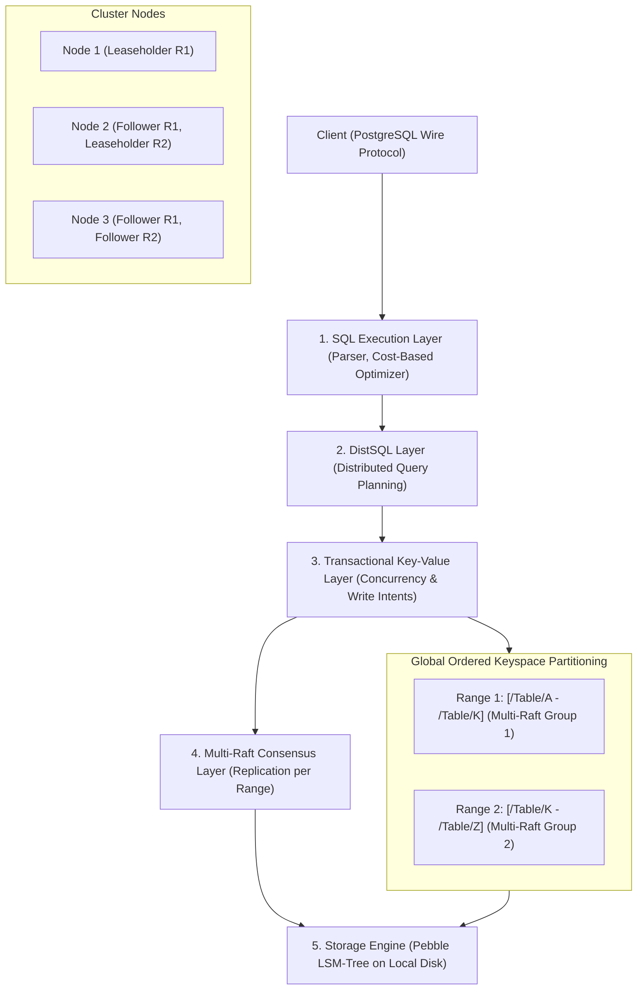

# CockroachDB and Distributed SQL Architecture

## TL;DR

CockroachDB is an open-source, cloud-native distributed NewSQL database designed for global scalability, automated survivability, and strict serializable ACID transactions.
It exposes a PostgreSQL-wire-compatible relational SQL dialect layered over a distributed, ordered monolithic key-value keyspace.
The global keyspace is sliced into contiguous chunks called Ranges (default 64MB to 512MB), each replicated across an odd number of nodes via independent Raft consensus groups (Multi-Raft).
To decouple reads from consensus overhead, CockroachDB separates Raft leadership from Range Leaseholders, enabling consistent local reads directly from the leaseholder without network round-trips.
Causality and transactional ordering across unsynchronized commodity servers are governed by Hybrid Logical Clocks (HLC), avoiding the proprietary GPS and atomic clock hardware required by Google Spanner's TrueTime API.

## Mental Model

CockroachDB structures database operations across a layered architecture translating high-level SQL queries down to distributed multi-Raft key-value consensus storage.



## Architectural Internals and Deep Dive

### 1. The Monolithic Ordered Key-Value Mapping
To the underlying storage engine, an entire CockroachDB cluster is a single, continuously sorted key-value keyspace:
- System metadata, user tables, and secondary indexes are encoded as binary keys in this global keyspace.
- SQL table rows are converted into keys formatted as:
  `/Table/<TableID>/<IndexID>/<PrimaryKeyColumns>/<ColumnID> -> <ColumnValue>`
- Secondary indexes are encoded as:
  `/Table/<TableID>/<SecondaryIndexID>/<SecondaryKeyColumns>/<PrimaryKeyColumns> -> nil`

Because all keys are sorted lexicographically, range queries translate directly to efficient range scans over the ordered keyspace.

### 2. Ranges, Range Splits, and Multi-Raft
The global keyspace is partitioned into contiguous chunks called Ranges (default size 64MB, configurable up to 512MB).
Each Range is replicated across a configurable number of cluster nodes (typically 3 or 5 replicas) governed by an independent Raft consensus group.
When a Range grows beyond its maximum size threshold through successive inserts, it executes an atomic Range Split:
1. The leaseholder initiates an internal Raft command marking the split key boundary.
2. The split creates a new Range metadata entry in the cluster's two-level Range Index (similar to a B-tree structure stored in Ranges 1 and 2).
3. The newly formed Range begins operating as its own independent Raft consensus group.

This Multi-Raft design permits thousands of independent Raft groups to run concurrently across a cluster, localizing consensus overhead strictly to the nodes hosting the target Range.

### 3. Range Leases vs Raft Leadership
Standard Raft requires reading from the Raft leader and verifying with a majority of followers (via heartbeats or read-index protocols) to ensure the leader has not been partitioned and replaced by a stale split-brain leader.
CockroachDB eliminates this network read penalty using Range Leases:
- Each Range has exactly one Leaseholder at any given moment, elected via a time-bounded lease granted through a Raft log entry.
- The Leaseholder is authorized to serve all reads and coordinates all writes for its Range without consulting other nodes for reads.
- Reads are evaluated directly against the leaseholder's local storage engine, achieving single-digit millisecond read latencies.
- If a client contacts a non-leaseholder node, that node proxies the request or redirects the client directly to the active leaseholder.

### 4. Hybrid Logical Clocks (HLC)
Google Spanner guarantees strict external consistency using TrueTime, which bounds physical clock skew within $[-\epsilon, +\epsilon]$ (typically $\approx 7\text{ms}$) via dedicated GPS receivers and atomic clocks.
CockroachDB operates on commodity cloud infrastructure where physical clock drift can be hundreds of milliseconds.
To establish causal ordering without special hardware, CockroachDB implements Hybrid Logical Clocks (HLC):
An HLC timestamp consists of a tuple:

$$\text{HLC} = (l, c)$$

Where $l$ is a physical timestamp tracking wall-clock time, and $c$ is a logical counter used to order causally related events occurring within the same physical tick.

When a node receives a message with timestamp $(l_{msg}, c_{msg})$, it updates its clock:
- If $l_{msg} > l_{local}$, it sets $l = l_{msg}$ and $c = c_{msg} + 1$.
- If $l_{msg} == l_{local}$, it sets $c = \max(c, c_{msg}) + 1$.
- Physical time $l$ is checked against the OS physical clock; if local physical time is ahead, $c$ is reset to $0$.

CockroachDB enforces a strict maximum physical clock offset threshold (`--max-offset`, default 500ms).
If a node detects that its physical clock diverges from any peer node by more than this threshold, the node immediately crashes itself via an intentional panic to protect against consistency violations.

### 5. Distributed ACID Transactions: Concurrency and Parallel Commits
CockroachDB defaults to the highest SQL isolation level: `SERIALIZABLE`.
Distributed transactions follow a multi-step pipeline coordinated by a Transaction Coordinator:
1. **Transaction Record Creation**: A transaction begins in a `PENDING` state, represented by a record written to the Range hosting the transaction's first key.
2. **Write Intents**: When modifying rows, the coordinator writes temporary provisional values called Write Intents across the respective Range leaseholders. A write intent is an MVCC record pointing back to the transaction record, acting as an in-flight exclusive lock.
3. **Conflict Resolution**: If another transaction encounters a write intent, it checks the transaction record's status. If the transaction is active, it waits or attempts to push the transaction's timestamp using a decentralized priority queuing mechanism.
4. **Parallel Commit (1-RTT Commit)**: Rather than requiring two full network round-trips to prepare and commit, CockroachDB writes the transaction record in a `STAGING` state alongside a list of all participating keys. As soon as all write intents are acknowledged by their respective Raft majorities, the coordinator returns success to the client immediately.
5. **Intent Resolution**: In the background, write intents are converted into permanent MVCC records, and the transaction record transitions to `COMMITTED`.

### 6. Storage Engine: Pebble (LSM-Tree)
At the local storage layer, CockroachDB previously used RocksDB (C++), but migrated to Pebble, an internal open-source Log-Structured Merge Tree (LSM) written in Go.
Pebble is purpose-built for CockroachDB workloads, optimizing range deletions, eliminating CGO cross-compilation overhead, reducing memory allocations, and providing deterministic flush and compaction throttling under heavy write pipelines.

## Trade-offs and Comparisons

| Dimension | CockroachDB | Google Cloud Spanner | Traditional Sharded RDBMS (e.g., Vitess / Citus) |
| :--- | :--- | :--- | :--- |
| **SQL Isolation Level** | Strict Serializable by default | Strict Serializable (External Consistency) | Typically Read Committed or Repeatable Read per shard |
| **Clock Synchronization** | Software HLC (Hybrid Logical Clocks) with panic on skew | Hardware TrueTime (GPS receivers + Atomic clocks) | Standard NTP (No cross-shard causal clock guarantees) |
| **Consensus Granularity** | Multi-Raft per 64MB Range | Multi-Paxos per Split | Raft/Paxos per Shard/Instance (or Primary-Replica binlog) |
| **Hosting Model** | Cloud-agnostic (AWS, GCP, Azure, Bare-metal) | Proprietary Google Cloud only | Cloud-agnostic |
| **Cross-Range Transactions** | Distributed 2PC with Parallel Commit | Distributed 2PC with TrueTime commit-wait | Two-Phase Commit coordinator; often discouraged or slow |
| **Operational Overhead** | Low (Single static binary, auto-rebalancing) | Zero (Fully managed service) | High (Requires proxy routing tiers, shard rebalancers) |

## Failure Modes and Mitigations

### 1. Clock Desynchronization Panics
- *Root Cause*: Virtual machine hypervisor clock stalls or NTP service outages cause a node's physical clock to drift past `--max-offset` (500ms) relative to its cluster peers.
- *Mitigation*: Deploy chrony or AWS Time Sync / Google NTP daemons configured with high-frequency synchronization; monitor `clock_offset_me_nanos` metrics; never run CockroachDB without dedicated time synchronization.

### 2. Transaction Contention and Read Restarts
- *Root Cause*: High concurrent write updates targeting the identical row or primary key range cause transactions to encounter write intents. The coordinator detects serialization conflicts and forces transaction restarts (`40001: serialization_failure`).
- *Mitigation*: Implement client-side exponential backoff and retry loops for error code `40001`; avoid sequential auto-incrementing integer keys (use `UUIDv4` or multi-column hashes to scatter writes across ranges); use `SELECT FOR UPDATE` to lock records explicitly in contention-heavy workflows.

### 3. Raft Leader / Leaseholder Concentration (Hotspotting)
- *Root Cause*: Monotonically increasing primary keys (e.g., timestamps or auto-incrementing sequences) cause all write traffic to route exclusively to the single Range at the tail end of the keyspace, bottlenecking on one node's CPU and disk.
- *Mitigation*: Use hash-sharded indexes (`CREATE INDEX ... USING HASH WITH BUCKETS = N`); use randomized UUID primary keys (`gen_random_uuid()`) to distribute inserts uniformly across the entire cluster.

### 4. Intent Resolution Backlog
- *Root Cause*: A high-throughput batch transaction commits millions of keys, but the coordinator fails or unloads before completing asynchronous intent resolution, leaving dangling write intents that force subsequent readers to execute slow transactional status lookups.
- *Mitigation*: Break batch updates into bounded chunks (e.g., 5,000 rows per transaction); enable automated background intent pushers.

## Hands-On Verification

### Multi-OS Diagnostic Commands

#### Linux / macOS (Cockroach CLI)
```bash
# Start a local single-node test cluster in insecure mode
cockroach start-single-node --insecure --listen-addr=localhost:26257 --http-addr=localhost:8080 --background

# Inspect node status and cluster health
cockroach node status --insecure

# Inspect range status and identify range leaseholders
cockroach sql --insecure -e "
SELECT 
    range_id, start_pretty, end_pretty, lease_holder, replicas 
FROM crdb_internal.ranges 
WHERE database_name = 'defaultdb' LIMIT 5;"

# Inspect current cluster clock offsets across all nodes
cockroach sql --insecure -e "
SELECT 
    node_id, address, clock_offset_nanos 
FROM crdb_internal.node_runtime_info;"
```

#### Windows (PowerShell)
```powershell
# Verify CockroachDB process status
Get-Process -Name cockroach -ErrorAction SilentlyContinue

# Execute query to inspect active transaction locks and contention
cockroach sql --insecure -e "
SELECT 
    txn_id, txn_description, waiting_on, state 
FROM crdb_internal.cluster_locks;"
```

### Standalone Multi-Raft and Distributed Transaction Simulation (Python Standard Library)

The following runnable script requires only the Python standard library.
It models Hybrid Logical Clocks with clock offset skew validation, contiguous Range key routing across independent Multi-Raft groups, Range Leaseholder local reads, automated Range Splits upon crossing size thresholds, and distributed transactions with write intents, 1-RTT parallel commits, and serializable conflict retry loops.

```python
"""
CockroachDB Multi-Raft, HLC, and Distributed Transaction Simulation
Pure Python 3 standard library implementation.
Demonstrates:
- Hybrid Logical Clock (HLC) causality updates and max-offset skew panics
- Range partitioning and automated Range Splits
- Range Leaseholders serving consistent local reads without Raft round-trips
- Distributed transactions with Write Intents and 1-RTT Parallel Commit
- Serialization conflict detection and exponential backoff retries
"""

import time
from dataclasses import dataclass
from typing import Any, Dict, List, Optional

@dataclass(order=True)
class HLC:
    wall_ms: int
    logical: int

    def __repr__(self) -> str:
        return f"HLC({self.wall_ms}:{self.logical})"

class NodeClock:
    def __init__(self, node_id: str, physical_skew_ms: int = 0, max_offset_ms: int = 500) -> None:
        self.node_id = node_id
        self.physical_skew_ms = physical_skew_ms
        self.max_offset_ms = max_offset_ms
        self.hlc = HLC(self._physical_ms(), 0)

    def _physical_ms(self) -> int:
        return int(time.time() * 1000) + self.physical_skew_ms

    def tick(self) -> HLC:
        phys = self._physical_ms()
        if phys > self.hlc.wall_ms:
            self.hlc = HLC(phys, 0)
        else:
            self.hlc = HLC(self.hlc.wall_ms, self.hlc.logical + 1)
        return self.hlc

    def update(self, remote_hlc: HLC) -> HLC:
        phys = self._physical_ms()
        if abs(phys - remote_hlc.wall_ms) > self.max_offset_ms:
            raise RuntimeError(
                f"Node {self.node_id} clock skew panic! Skew ({abs(phys - remote_hlc.wall_ms)}ms) exceeds {self.max_offset_ms}ms."
            )
        max_wall = max(self.hlc.wall_ms, remote_hlc.wall_ms, phys)
        if max_wall == self.hlc.wall_ms == remote_hlc.wall_ms:
            new_logical = max(self.hlc.logical, remote_hlc.logical) + 1
        elif max_wall == self.hlc.wall_ms:
            new_logical = self.hlc.logical + 1
        elif max_wall == remote_hlc.wall_ms:
            new_logical = remote_hlc.logical + 1
        else:
            new_logical = 0
        self.hlc = HLC(max_wall, new_logical)
        return self.hlc

@dataclass
class MVCCValue:
    timestamp: HLC
    value: Any

@dataclass
class WriteIntent:
    txn_id: str
    key: str
    value: Any
    timestamp: HLC

class SerializationConflictError(Exception):
    pass

class SimulatedRange:
    def __init__(self, range_id: int, start_key: str, end_key: str, replicas: List[str], leaseholder: str) -> None:
        self.range_id = range_id
        self.start_key = start_key
        self.end_key = end_key  # Empty string indicates unbounded right boundary
        self.replicas = replicas
        self.leaseholder = leaseholder
        self.data: Dict[str, List[MVCCValue]] = {}
        self.intents: Dict[str, WriteIntent] = {}

    def contains(self, key: str) -> bool:
        if key < self.start_key:
            return False
        if self.end_key and key >= self.end_key:
            return False
        return True

    def write_intent(self, intent: WriteIntent, txn_table: Dict[str, str]) -> None:
        existing = self.intents.get(intent.key)
        if existing and existing.txn_id != intent.txn_id:
            other_state = txn_table.get(existing.txn_id, "UNKNOWN")
            if other_state in ("PENDING", "STAGING"):
                raise SerializationConflictError(
                    f"Range {self.range_id}: Key {intent.key!r} locked by in-flight Txn {existing.txn_id!r}"
                )
        self.intents[intent.key] = intent

    def resolve_intent(self, key: str, commit: bool) -> None:
        intent = self.intents.pop(key, None)
        if intent and commit:
            if key not in self.data:
                self.data[key] = []
            self.data[key].append(MVCCValue(intent.timestamp, intent.value))

    def read_local(self, key: str, read_hlc: HLC, txn_table: Dict[str, str]) -> Optional[Any]:
        intent = self.intents.get(key)
        if intent:
            state = txn_table.get(intent.txn_id, "UNKNOWN")
            if state in ("PENDING", "STAGING"):
                raise SerializationConflictError(
                    f"Range {self.range_id}: Read encountered uncommitted intent on {key!r} by Txn {intent.txn_id!r}"
                )
        versions = self.data.get(key, [])
        for v in reversed(versions):
            if v.timestamp <= read_hlc:
                return v.value
        return None

class SimulatedCockroachCluster:
    def __init__(self) -> None:
        self.nodes = ["node-1", "node-2", "node-3"]
        self.clocks = {n: NodeClock(n) for n in self.nodes}
        self.ranges: List[SimulatedRange] = [
            SimulatedRange(1, "", "", self.nodes, "node-1")
        ]
        self.txn_table: Dict[str, str] = {}
        self.split_threshold = 4

    def _find_range(self, key: str) -> SimulatedRange:
        for r in self.ranges:
            if r.contains(key):
                return r
        raise KeyError(f"No range found covering key {key!r}")

    def check_and_split_ranges(self) -> None:
        for r in list(self.ranges):
            total_keys = len(r.data)
            if total_keys >= self.split_threshold:
                keys = sorted(r.data.keys())
                mid_idx = len(keys) // 2
                split_key = keys[mid_idx]
                old_end = r.end_key
                r.end_key = split_key
                new_id = len(self.ranges) + 1
                new_leaseholder = self.nodes[new_id % len(self.nodes)]
                new_range = SimulatedRange(new_id, split_key, old_end, self.nodes, new_leaseholder)
                for k in keys[mid_idx:]:
                    new_range.data[k] = r.data.pop(k)
                    if k in r.intents:
                        new_range.intents[k] = r.intents.pop(k)
                self.ranges.append(new_range)
                self.ranges.sort(key=lambda x: x.start_key)
                print(
                    f"[Multi-Raft] Range Split: Range {r.range_id} split at {split_key!r}. "
                    f"New Range {new_id} [{split_key!r}, {old_end!r}) assigned to Leaseholder {new_leaseholder}."
                )

    def execute_transaction(self, txn_id: str, writes: Dict[str, Any], max_retries: int = 3) -> bool:
        coordinator_node = "node-1"
        coord_clock = self.clocks[coordinator_node]

        for attempt in range(1, max_retries + 1):
            try:
                txn_hlc = coord_clock.tick()
                self.txn_table[txn_id] = "PENDING"
                print(f"[Txn {txn_id}] Attempt {attempt} initialized with Coordinator HLC {txn_hlc}")

                for k, v in writes.items():
                    target_range = self._find_range(k)
                    lh_node = target_range.leaseholder
                    lh_clock = self.clocks[lh_node]
                    lh_clock.update(txn_hlc)
                    target_range.write_intent(WriteIntent(txn_id, k, v, txn_hlc), self.txn_table)

                self.txn_table[txn_id] = "STAGING"
                self.txn_table[txn_id] = "COMMITTED"
                print(f"[Txn {txn_id}] 1-RTT Parallel Commit reached status COMMITTED at {txn_hlc}")

                for k in writes:
                    target_range = self._find_range(k)
                    target_range.resolve_intent(k, commit=True)

                self.check_and_split_ranges()
                return True

            except SerializationConflictError as err:
                print(f"[Txn {txn_id}] Serialization conflict on attempt {attempt}: {err}. Backing off...")
                self.txn_table[txn_id] = "ABORTED"
                for k in writes:
                    target_range = self._find_range(k)
                    target_range.resolve_intent(k, commit=False)
                time.sleep(0.01 * (2 ** attempt))

        return False

    def read_key(self, key: str) -> Optional[Any]:
        target_range = self._find_range(key)
        lh_node = target_range.leaseholder
        lh_clock = self.clocks[lh_node]
        read_hlc = lh_clock.tick()
        val = target_range.read_local(key, read_hlc, self.txn_table)
        print(f"[Local Leaseholder Read] Range {target_range.range_id} ({lh_node}) read key {key!r} -> {val}")
        return val

if __name__ == "__main__":
    cluster = SimulatedCockroachCluster()
    cluster.execute_transaction("txn-101", {"/Table/customers/1": "Alice", "/Table/customers/2": "Bob"})
    cluster.execute_transaction("txn-102", {"/Table/customers/3": "Charlie", "/Table/customers/4": "Dave"})
    cluster.execute_transaction("txn-103", {"/Table/customers/5": "Eve"})
    cluster.read_key("/Table/customers/1")
    cluster.read_key("/Table/customers/4")
```

### Live Cluster Integration Script (PostgreSQL Wire Protocol)

The following runnable script connects to a live CockroachDB cluster using the PostgreSQL wire protocol (`psycopg2-binary`), demonstrates serializable transaction isolation, and handles `40001` serialization retries.

```python
"""
CockroachDB Serializable Transaction with Client-Side Retry Loop
Prerequisites: pip install psycopg2-binary
Requires running CockroachDB cluster on localhost:26257 with database 'test_crdb'.
"""

import time
import psycopg2
from psycopg2 import errors

DB_CONFIG = {
    "host": "localhost",
    "port": 26257,
    "user": "root",
    "dbname": "defaultdb",
    "sslmode": "disable"
}

def setup_tables():
    conn = psycopg2.connect(**DB_CONFIG)
    cur = conn.cursor()
    cur.execute("DROP TABLE IF EXISTS customer_wallets;")
    cur.execute("""
        CREATE TABLE customer_wallets (
            wallet_id UUID PRIMARY KEY DEFAULT gen_random_uuid(),
            holder_name STRING NOT NULL,
            balance DECIMAL(12, 2) NOT NULL CHECK (balance >= 0)
        );
    """)
    cur.execute("INSERT INTO customer_wallets (holder_name, balance) VALUES ('Alice', 1000.00), ('Bob', 500.00);")
    conn.commit()
    cur.close()
    conn.close()
    print("[Setup] Created customer_wallets table with Alice (1000.00) and Bob (500.00).")

def transfer_funds(sender_name, receiver_name, amount, max_retries=5):
    """
    Executes an atomic transfer under STRICT SERIALIZABLE isolation
    with an exponential backoff retry loop for error code 40001.
    """
    conn = psycopg2.connect(**DB_CONFIG)
    
    for attempt in range(1, max_retries + 1):
        try:
            with conn:
                with conn.cursor() as cur:
                    # Deduct from sender
                    cur.execute("""
                        UPDATE customer_wallets 
                        SET balance = balance - %s 
                        WHERE holder_name = %s;
                    """, (amount, sender_name))
                    
                    # Credit receiver
                    cur.execute("""
                        UPDATE customer_wallets 
                        SET balance = balance + %s 
                        WHERE holder_name = %s;
                    """, (amount, receiver_name))
                    
            print(f"[Success] Transferred ${amount} from {sender_name} to {receiver_name} on attempt {attempt}.")
            conn.close()
            return
            
        except errors.SerializationFailure as err:
            # CockroachDB error code 40001: serialization_failure
            backoff = (2 ** attempt) * 0.05
            print(f"[Retry Required] Serialization conflict on attempt {attempt}: {err}. Retrying in {backoff:.2f}s...")
            time.sleep(backoff)
        except Exception as err:
            print(f"[Terminal Failure] Transaction aborted: {err}")
            conn.close()
            raise

if __name__ == "__main__":
    try:
        setup_tables()
        transfer_funds("Alice", "Bob", 250.00)
    except Exception as exc:
        print(f"[Error] Execution failed: {exc}")
```

## Performance Characteristics and Capacity Planning

### 1. Multi-Raft Network Latency Bound
Under CockroachDB, single-range write latency is dictated by the network round-trip time between the Leaseholder and the closest quorum of Raft replicas:

$$\text{Latency}_{\text{write}} \approx \text{RTT}_{\text{Client}\to\text{Leaseholder}} + \max_{i \in \text{Quorum}}(\text{RTT}_{\text{Leaseholder}\to\text{Replica}_i}) + T_{\text{DiskFlush}}$$

Because reads are satisfied directly by the Range Leaseholder without communicating with followers:

$$\text{Latency}_{\text{read}} \approx \text{RTT}_{\text{Client}\to\text{Leaseholder}} + T_{\text{LocalEngine}}$$

Locating Range Leaseholders close to end-users (via geo-partitioning) yields sub-10ms read latencies even across globally distributed multi-region clusters.

### 2. Range Sizing and Rebalancing Math
- Recommended Range size: 64MB (default) to 512MB.
- Cluster with 10 Terabytes of active data across 10 nodes with replication factor $R=3$:

$$\text{Total Storage Footprint} = 10\text{TB} \times 3 = 30\text{TB}$$

- Total number of Ranges across the cluster (assuming 64MB target):

$$\text{Total Ranges} = \frac{30 \times 10^{12} \text{ bytes}}{64 \times 10^6 \text{ bytes}} \approx 468,750 \text{ Ranges}$$

- Ranges per node: $\approx 46,875$ Range replicas. Each node manages ~47,000 Raft groups, which CockroachDB coordinates efficiently by coalescing dormant Raft heartbeats.

## In Production: Real-World Case Studies

### 1. DoorDash's Scalable Logistics and Dispatch Platform
DoorDash migrated its core merchant and delivery services from monolithic AWS Aurora PostgreSQL to multi-region CockroachDB:
- **Challenge**: Monolithic Aurora suffered from write connection saturation during peak meal delivery surges, and manual sharding across hundreds of microservices introduced massive application complexity.
- **Solution**: Deployed multi-region CockroachDB clusters with regional survivability. Relied on automated Multi-Raft range rebalancing to distribute write loads evenly across nodes without application-tier sharding logic.
- **Impact**: Achieved automated regional failover and zero-downtime cluster upgrades while maintaining strict ACID transactional consistency across distributed delivery dispatches.

### 2. Netflix Media Engineering Metadata Management
Netflix utilized CockroachDB to power asset tracking and workflow metadata across its digital production pipeline:
- **Global Data Distribution**: Distributed video rendering jobs require consistent state tracking across multi-region cloud infrastructures.
- **Survivability**: CockroachDB's self-healing consensus architecture enabled continuous operation through cloud availability zone outages without data loss or administrative failover intervention.

## Staff+ Interview Questions

> [!question]
> How does CockroachDB achieve strict serializable transactions without requiring the expensive atomic clocks and GPS receivers used by Google Spanner's TrueTime API?

> [!success]- Answer
> Google Spanner uses TrueTime to guarantee that physical clock skew between any two servers is bounded within $[-\epsilon, +\epsilon]$ (typically $\approx 7\text{ms}$). Spanner guarantees serializability by using "commit-wait": a transaction pauses for $2\epsilon$ before releasing locks, ensuring its commit timestamp is strictly in the physical past before any subsequent transaction can start. CockroachDB runs on commodity infrastructure without atomic clocks and uses Hybrid Logical Clocks (HLC), which combine physical wall-clock time with logical causal counters. To prevent serializability violations from undetected clock skew, CockroachDB enforces a maximum allowable physical clock offset (`--max-offset`, typically 500ms). When reading data, if a transaction encounters a record with a timestamp within its uncertainty window (the range between the local node's clock and the maximum possible skew), CockroachDB restarts the transaction at a newer timestamp (an "uncertainty restart") to ensure it sees all causally preceding writes. If physical clock drift ever exceeds `--max-offset`, the node detects it and immediately crashes itself to prevent data corruption.

> [!question]
> What is the architectural difference between a Raft Leader and a Range Leaseholder in CockroachDB, and why is this distinction critical for read performance?

> [!success]- Answer
> In standard Raft consensus, only the Raft Leader can coordinate mutations, and reads require either a majority heartbeat round-trip or a Raft log entry to ensure the leader has not been superseded by a network partition. In CockroachDB, each Range designates a Leaseholder through a time-bounded lease granted via an explicit Raft consensus command. The Leaseholder is granted exclusive authority to serve all reads and coordinate all writes for that Range. Because leases are strictly non-overlapping in time and guaranteed by Raft consensus, a leaseholder can serve strongly consistent reads directly from its local storage engine (Pebble) without sending any network messages to other replicas. While the Raft leader and the leaseholder are frequently co-located on the same physical node for write efficiency, separating the roles allows CockroachDB to pin leaseholders to specific geographic regions closer to user traffic, drastically reducing read latency.

> [!question]
> Explain the lifecycle of a CockroachDB write operation. What are "Write Intents" and how does the Parallel Commit protocol work?

> [!success]- Answer
> When a client writes data, the coordinator generates an HLC timestamp and writes the transaction record in `STAGING` state alongside the list of modified keys. The coordinator then distributes Write Intents to the leaseholders of the affected Ranges. A write intent is an in-flight MVCC key-value record that points back to the transaction record, acting as an exclusive lock. Replicas commit write intents via standard Raft majorities. Under traditional two-phase commit, the coordinator would wait for all intents to be written, then execute a second round-trip to flip the transaction record from `PENDING` to `COMMITTED`. CockroachDB's Parallel Commit protocol collapses this into a single round-trip: once the staging transaction record and all write intents are durably acknowledged by their respective Raft majorities, the transaction is implicitly committed. The coordinator immediately returns success to the client ($1\text{-RTT}$). In the background, the transaction record is explicitly updated to `COMMITTED` and write intents are cleared into permanent MVCC records.

> [!question]
> What causes SQL error code `40001: serialization_failure` in CockroachDB, and why must application services implement client-side retry loops?

> [!success]- Answer
> Error code `40001` occurs when CockroachDB's cost-based query planner and concurrency control engine detect a transaction conflict that violates serializability order. This occurs when two transactions attempt to update the same row concurrently, when a reader encounters an uncommitted write intent with a lower timestamp, or when a transaction must be pushed forward in time due to read-write dependencies. Because CockroachDB enforces strict `SERIALIZABLE` isolation, it cannot allow non-serializable interleaving. Instead of blocking indefinitely or allowing anomalies, it aborts the offending transaction and instructs the client to retry. Applications interacting with CockroachDB must encapsulate transactional blocks within exponential backoff retry loops to replay aborted operations until they commit successfully.

> [!question]
> How does CockroachDB map relational SQL concepts (databases, tables, rows, secondary indexes) into its underlying flat, ordered key-value keyspace?

> [!success]- Answer
> CockroachDB encodes all relational structures into lexicographically sorted binary byte keys. Every table, column, and index is assigned a 32-bit integer ID. A primary key row is encoded as `/Table/<TableID>/<IndexID>/<PrimaryKeyColumns>/<ColumnID> -> <ColumnValue>`, where `IndexID=1` represents the primary index. Secondary indexes are encoded as `/Table/<TableID>/<SecondaryIndexID>/<SecondaryKeyColumns>/<PrimaryKeyColumns> -> nil`. In unique secondary indexes, the primary key is stored in the value field rather than the key suffix. Because all keys are strictly sorted byte-by-byte, SQL index range queries (e.g., `WHERE age BETWEEN 20 AND 30`) translate directly into sequential key-value range scans over the underlying storage engine.

> [!question]
> Why should developers avoid auto-incrementing integer sequences (`SERIAL`) as primary keys in CockroachDB, and what should be used instead?

> [!success]- Answer
> In traditional single-node databases, auto-incrementing integers (`SERIAL` / `AUTO_INCREMENT`) are optimal because sequential inserts append to the right edge of the B+ tree. In CockroachDB, data is partitioned into ordered ranges. Monotonically increasing primary keys cause every consecutive insert to write to the exact same range at the tail of the keyspace. This concentrates 100% of the cluster's write workload onto a single Range leaseholder and its Raft replica set (hotspotting), leaving the rest of the cluster idle. Instead, developers should use globally unique random keys like `UUIDv4` (`gen_random_uuid()`) or hash-sharded indexes. Random keys distribute writes uniformly across all ranges and all physical nodes in the cluster, achieving linear horizontal write scaling.

> [!question]
> What is Multi-Raft, and why does CockroachDB use thousands of small Raft groups instead of a single cluster-wide Raft log?

> [!success]- Answer
> A single cluster-wide Raft group (as used by simple distributed stores) forces all transactions to pass through one global consensus log, bottlenecking throughput on the single Raft leader's CPU and disk I/O. CockroachDB implements Multi-Raft: the keyspace is divided into hundreds of thousands of independent 64MB Ranges, and each Range forms its own independent Raft consensus group across its assigned replicas. Replicas coordinate consensus only for keys within their own Range. A write to Range 1 does not coordinate with or wait for Raft consensus in Range 2. This decouples consensus overhead, allowing an $N$-node cluster to scale write throughput linearly as nodes and ranges are added.

> [!question]
> How does CockroachDB execute distributed queries involving joins and aggregations across multiple ranges using DistSQL?

> [!success]- Answer
> DistSQL is CockroachDB's distributed SQL execution engine. When a complex query arrives (such as a join or aggregation spanning multiple ranges), the gateway node's cost-based optimizer creates a distributed physical execution plan represented as a directed acyclic graph (DAG) of processing streams. Instead of pulling millions of raw rows to the gateway node and performing the join centrally (which would saturate the network), DistSQL pushes the computation operators directly to the nodes hosting the data ranges. Nodes perform local filtering, projecting, and partial aggregations, streaming only the intermediate or final hash-join results across the network. This minimizes cross-node network transmission and parallelizes CPU utilization across the entire cluster.

> [!question]
> How does CockroachDB execute automated Range Splits and Range Merges, and how does the two-level Range Index maintain consistent routing without global coordination locks?

> [!success]- Answer
> CockroachDB dynamically splits ranges when a Range crosses its size threshold (default 64MB, up to 512MB) or write load limit.
> The Range Leaseholder initiates an internal Raft consensus command defining the split key boundary.
> Once the Raft majority commits the split log entry, the original Range truncates its right boundary, and the newly spawned right Range begins operating as an independent Raft consensus group.
> To route requests across hundreds of thousands of dynamic ranges without a centralized master bottleneck, CockroachDB employs a two-level indexing hierarchy modeled after Bigtable: Range 1 stores descriptors for all Range 2 entries, and Range 2 stores the descriptors for all user-data Ranges.
> Cluster nodes aggressively cache these descriptors locally.
> If a node routes a request to an outdated leaseholder post-split, the receiver returns a `RangeNotFound` or `StaleRangeDescriptor` error containing the updated descriptor, prompting the sender to invalidate its cache entry and re-route transparently without global locking.
> Conversely, when contiguous ranges drop below size thresholds due to row deletions or TTL expirations, CockroachDB triggers an automated Range Merge via a Raft-coordinated right-to-left sub-protocol that subsumes the right sibling into the left range.

> [!question]
> How does CockroachDB handle the Read Uncertainty Window in Hybrid Logical Clocks, and under what conditions does a node trigger an intentional panic?

> [!success]- Answer
> Because physical clocks drift on commodity hardware, a node cannot be certain whether a transaction committed on another node with physical timestamp $t_{remote} > t_{local}$ actually occurred before or after the local transaction in real time if $|t_{remote} - t_{local}| \le \text{max\_offset}$ (default 500ms).
> This interval is known as the Read Uncertainty Window.
> When a transaction executing at read timestamp $t_{read}$ encounters a value version with timestamp $t_{val} \in (t_{read}, t_{read} + \text{max\_offset}]$, CockroachDB cannot determine whether this value was written causally in its past.
> To preserve strict serializability, the reader triggers an uncertainty restart: it bumps its own read timestamp to $t_{val}$ and transparently restarts execution from the beginning of the transaction, ensuring it sees all causal writes.
> If the transaction continues encountering newer versions, it may bump its timestamp up to $t_{read} + \text{max\_offset}$.
> If a node ever detects via peer gossip heartbeats that its physical clock diverges from any cluster member by more than `--max-offset`, it immediately panics and terminates its process, deliberately halting to avoid silent data corruption or stale causal reads.

## Related Concepts and Wikilinks

- [[CAP-Theorem-and-PACELC]] - Analysis of CP guarantees and latency trade-offs in distributed NewSQL.
- [[ACID-vs-BASE]] - Distributed ACID transactions versus eventual consistency.
- [[Partitioning-and-Sharding]] - Range-based partitioning and automated range splitting.
- [[Consistent-Hashing]] - Comparative contrast between consistent hash rings and ordered range splitting.
- [[MySQL-and-InnoDB]] - Traditional single-node relational architecture.
- [[PostgreSQL-Architecture]] - Wire-level compatibility and contrast with multi-process relational engines.

## Further Reading and References

- Taft, Rebecca, et al. "CockroachDB: The Resilient Geo-Distributed SQL Database." *Proceedings of the 2020 ACM SIGMOD International Conference on Management of Data*, 2020.
- Corbett, James C., et al. "Spanner: Google’s Globally-Distributed Database." *ACM Transactions on Computer Systems (TOCS)*, 2013.
- Ongaro, Diego, and John Ousterhout. "In Search of an Understandable Consensus Algorithm (Raft)." *USENIX Annual Technical Conference (ATC)*, 2014.
- Kulkarni, Sandeep, et al. "Logical Physical Clocks and Consistent Snapshots in Globally Distributed Databases." *State University of New York Technical Report*, 2014.
- Cockroach Labs Engineering. *The Architecture of CockroachDB: Layer by Layer*. Cockroach Labs Technical Whitepaper.
