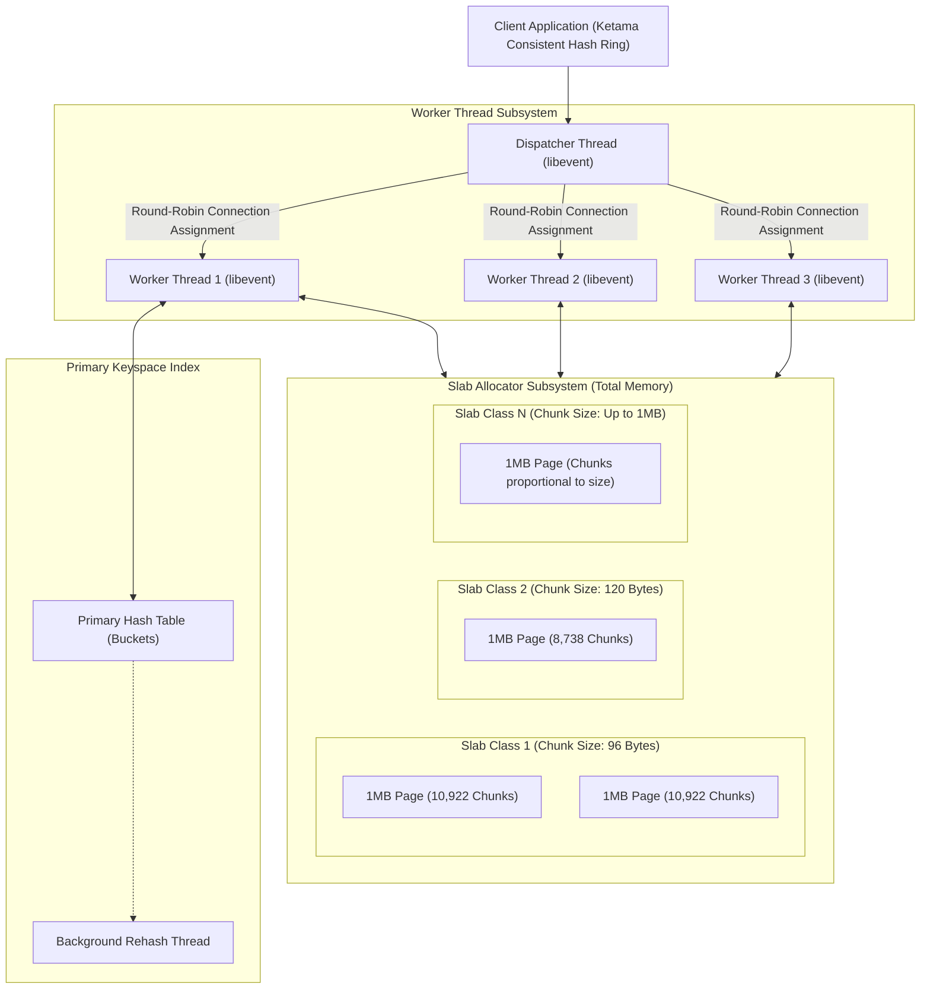

# Memcached Architecture and Slab Allocation

## TL;DR

Memcached is a high-performance, distributed, volatile in-memory key-value caching system designed to accelerate dynamic web applications by mitigating database read load.
Unlike single-threaded engines, Memcached utilizes a multi-threaded architecture driven by a `libevent` event dispatcher thread distributing incoming TCP connections across a fixed pool of worker threads.
To eliminate OS memory fragmentation caused by frequent C `malloc()` and `free()` invocations, Memcached implements a Slab Allocator that pre-allocates memory into 1MB pages divided into fixed-size chunks per slab class.
Clustering is entirely client-side: Memcached servers share zero state and have no inter-node communication, relying on client-side consistent hashing (such as the Ketama algorithm) to distribute keys across the cluster.
Data synchronization supports optimistic concurrency through a 64-bit monotonic Compare-And-Swap (CAS) token.

## Mental Model

Memcached processes client network traffic through a multi-threaded worker pool, organizing physical RAM into rigid, pre-allocated slab classes.



## Architectural Internals and Deep Dive

### 1. The Multi-Threaded Event Model
Memcached maximizes multi-core CPU hardware through a master-worker thread model built on `libevent`:
- **Main Dispatcher Thread**: Listens on the incoming network port (default TCP 11211). When a new client connection arrives, the dispatcher accepts the socket and assigns it to a worker thread via a round-robin pipe notify queue.
- **Worker Threads**: A configurable pool of worker threads (default equal to the number of CPU cores) manage their assigned client TCP sockets independently.
- **Locking Granularity**: Early versions of Memcached utilized a single global cache lock. Modern Memcached utilizes fine-grained item locks and slab locks:
  - Cache reads and writes acquire a granular hash table bucket lock based on the key's Murmur3 hash, allowing concurrent worker threads to read and write non-colliding keys without contention.

### 2. The Slab Allocation Engine
In high-throughput caching environments, allocating and freeing millions of small, variable-sized objects per second causes severe operating system heap fragmentation, degrading kernel performance and leading to premature Out-Of-Memory aborts.
Memcached eliminates this entirely by bypassing standard heap allocation during object creation, using a custom Slab Allocator:
- **Memory Pages**: Physical memory allocated to Memcached (`-m` flag) is pre-partitioned into contiguous 1MB memory blocks called Pages.
- **Slab Classes**: Memory is grouped into Slab Classes based on chunk size.
  - Slab Class 1 has a base chunk size (default 96 bytes).
  - Subsequent slab class chunk sizes grow geometrically according to the Chunk Size Growth Factor (`-f`, default 1.25):

$$\text{ChunkSize}_n = \text{ChunkSize}_{n-1} \times 1.25$$

- **Chunk Allocation**: When a 1MB page is assigned to Slab Class $n$, it is pre-sliced into identical fixed-size chunks. For example, a 1MB page allocated to a 120-byte slab class yields:

$$\text{ChunksPerPage} = \left\lfloor \frac{1,048,576 \text{ bytes}}{120 \text{ bytes}} \right\rfloor = 8,738 \text{ chunks}$$

- **Item Placement**: When a key-value pair arrives, Memcached calculates the total item size (Key length + Value length + 56 bytes item header). It locates the smallest slab class whose chunk size is $\ge \text{TotalItemSize}$ and places the object in a free chunk in that class.
- *Internal Fragmentation*: If an item consumes 100 bytes and is placed into a 120-byte chunk, the remaining 20 bytes within that chunk are unused and cannot be reclaimed until the item is evicted.

### 3. Slab Calcification and Dynamic Rebalancing
Historically, once a 1MB page was assigned to a slab class, it remained permanently bound to that class.
This introduced Slab Calcification (memory ossification):
- If an application initially stores small 100-byte objects, all pages are assigned to Slab Class 1.
- If the application workload later shifts to 500-byte objects, Slab Class 4 exhausts its available memory and triggers constant LRU evictions, even though gigabytes of RAM in Slab Class 1 sit idle.

Modern Memcached resolves this with automated dynamic rebalancing:
- **Slab Automove (`slab_automove=1` or `2`)**: A background maintenance thread detects eviction imbalances across slab classes. If a slab class triggers evictions while another class has had free pages for over 3 minutes, the engine unmaps a 1MB page from the idle class, formats it, and reassigns it to the starving class.

### 4. Segmented LRU (2Q-Style Eviction)
Rather than a naive single Least Recently Used (LRU) doubly linked list, modern Memcached uses a Segmented LRU architecture split into three distinct queues per slab class to combat cache pollution from one-hit wonders:
1. **HOT Queue**: New items are initially inserted into the HOT queue. Items are never promoted within HOT; when they reach the tail, if they were read during their stay, they promote to WARM; otherwise, they descend to COLD.
2. **WARM Queue**: Long-lived items with multiple accesses reside here. Access promotes an item to the head of WARM. Tail items descend to COLD.
3. **COLD Queue**: Items that have not seen recent access reside here. The tail of COLD is where LRU evictions occur when memory is exhausted.
4. **LRU Crawler**: A low-priority background thread periodically walks the tail of LRU queues to reclaim memory from items whose TTL (Time-To-Live) expiration has passed, avoiding lazy expiration lookup penalties.

### 5. Client-Side Consistent Hashing (Ketama)
Memcached servers do not know about each other; there is no gossip, no cluster coordination, and no master.
Cluster scaling is executed entirely within client libraries using Consistent Hashing (the Ketama algorithm):
- The client library hashes the IP/port of all Memcached servers into a 32-bit integer continuum ring (typically 100-160 virtual nodes per physical server).
- When fetching or storing a key, the client hashes the key (`Murmur3` or `MD5`) to a 32-bit integer and finds the first server clockwise on the ring.
- If a server fails or is removed, only $1/N$ of keys are redistributed to adjacent nodes, preventing cache stampedes that would occur with standard modulo hashing ($K \pmod N$).

### 6. Optimistic Concurrency Control: The CAS (Compare-And-Swap) Protocol
To resolve race conditions during concurrent read-modify-write operations without server-side locking, Memcached supports Check-And-Set / Compare-And-Swap (CAS):
- Every stored item contains a 64-bit monotonic version counter (the CAS token).
- When a client reads a key using `gets key`, Memcached returns the value alongside the current CAS token:
  `VALUE key 0 5 10482` (where 10482 is the CAS token).
- When the client writes back the updated value, it issues `cas key flags exptime bytes cas_token`:
  `cas key 0 300 5 10482`
- If another client updated the key in the interim, its CAS token was incremented. The server detects the mismatch, rejects the write with `EXISTS`, and the client retries the transaction.

## Trade-offs and Comparisons

| Dimension | Memcached | Redis |
| :--- | :--- | :--- |
| **Threading Model** | Native multi-threaded (Scales linearly across 32+ cores) | Single-threaded core engine (Multi-threaded socket I/O only) |
| **Data Types** | Opaque byte strings (BLOBs) only | Rich data structures (Strings, Hashes, Lists, ZSets, Bitmaps, HLL) |
| **Memory Allocation** | Rigid pre-allocated Slab Allocator (Zero OS fragmentation) | Dynamic allocation via jemalloc (Subject to memory fragmentation) |
| **Clustering Mechanics** | 100% Client-side consistent hashing (Ketama ring) | Server-side cluster with 16,384 hash slots and master-replica failover |
| **Persistence to Disk** | Zero persistence (Volatile cache only) | RDB point-in-time snapshots and AOF append logging |
| **Max Key and Value Size** | 250 bytes key; 1MB value (configurable via `-I`) | 512MB key; 512MB value |
| **Max Memory Efficiency** | Extremely high for uniform small byte strings | High, but incurs structural metadata overhead per key |

## Failure Modes and Mitigations

### 1. Cache Stampede (Thundering Herd)
- *Root Cause*: A high-demand hot key expires (TTL expiration) or is evicted. Hundreds of concurrent client application threads experience a cache miss simultaneously and attempt to recalculate the value by executing expensive database queries, saturating the database.
- *Mitigation*: Implement client-side probabilistic early expiration (XFetch algorithm) or distributed locks (Mutex on Cache Miss); use stale-while-revalidate patterns where background worker threads refresh keys before expiration.

### 2. Slab Calcification Eviction Storms
- *Root Cause*: Workload shifts to larger object sizes. The slab allocator has committed all 1MB pages to smaller slab classes. Larger objects trigger constant evictions in higher slab classes despite ample idle capacity in lower classes.
- *Mitigation*: Start Memcached with `-o slab_automove=1,slab_reassign=true` to allow the background thread to migrate unutilized 1MB pages across slab classes dynamically.

### 3. Server Eviction Cascades on Cluster Sizing Changes
- *Root Cause*: Adding or removing a Memcached node from a naive client ring that uses modulo hashing (`hash(key) % N`) invalidates up to 100% of cached keys, causing an instantaneous spike in database read queries.
- *Mitigation*: Mandate the use of client libraries implementing Ketama consistent hashing with high virtual node counts (160+ vnodes per physical server).

### 4. Network Socket Buffer Exhaustion
- *Root Cause*: Massive multiget operations (`get key1 key2 ... key1000`) overwhelm TCP socket send buffers on the Memcached host, causing worker thread epoll write queues to back up and latency to spike.
- *Mitigation*: Chunk multiget requests into batches of 50-100 keys; increase Linux socket buffer sizes (`net.ipv4.tcp_wmem`).

## Hands-On Verification

### Multi-OS Diagnostic Commands

#### Linux / macOS (Memcached CLI & Utilities)
```bash
# Start local Memcached instance with 64MB memory, 4 worker threads, verbose logging
memcached -m 64 -p 11211 -u nobody -t 4 -o slab_automove=1 -vv &

# Query server statistics via telnet or netcat
echo "stats" | nc localhost 11211

# Inspect detailed slab class memory distribution and chunk usage
echo "stats slabs" | nc localhost 11211

# Inspect item counts, evictions, and out-of-memory errors per slab class
echo "stats items" | nc localhost 11211

# Linux utility: memcached-tool (Perl diagnostic tool)
memcached-tool localhost:11211 display
```

#### Windows (PowerShell)
```powershell
# Verify if Memcached is running (via Windows port or WSL2)
Test-NetConnection -ComputerName localhost -Port 11211

# Send stats command via TCP socket in PowerShell
$tcpClient = New-Object System.Net.Sockets.TcpClient("localhost", 11211)
$stream = $tcpClient.GetStream()
$writer = New-Object System.IO.StreamWriter($stream)
$reader = New-Object System.IO.StreamReader($stream)
$writer.WriteLine("stats")
$writer.Flush()
for ($i=0; $i -lt 10; $i++) { $reader.ReadLine() }
$tcpClient.Close()
```

### Standalone Slab Allocator, CAS, and Ketama Ring Simulation (Python Standard Library)

The following runnable script requires only the Python standard library.
It models Memcached's core internals: the geometric Slab Allocator (growth factor 1.25, 1MB pages divided into fixed-size chunks, internal fragmentation tracking), dynamic slab automove rebalancing between idle and starving classes, Segmented LRU queue management (`HOT`, `WARM`, `COLD`), 64-bit monotonic Compare-And-Swap (CAS) tokens for optimistic concurrency control, and the Ketama consistent hashing client ring with virtual nodes.

```python
"""
Memcached Slab Allocator, CAS Optimistic Concurrency, and Ketama Ring Simulation
Pure Python 3 standard library implementation.
Demonstrates:
- Geometric Slab Allocator (1MB pages, fixed chunk classes with growth factor 1.25)
- Segmented LRU cache eviction (HOT, WARM, COLD queues)
- Dynamic Slab Automove rebalancing from idle to starving slab classes
- 64-bit monotonic Compare-And-Swap (CAS) tokens and conflict rejection
- Client-side Ketama Consistent Hashing ring with virtual nodes
"""

import bisect
import hashlib
import time
from dataclasses import dataclass
from typing import Any, Dict, List, Optional, Tuple

@dataclass
class Item:
    key: str
    value: bytes
    cas_token: int
    slab_class: int
    access_count: int = 1

class SlabClass:
    def __init__(self, class_id: int, chunk_size: int, page_size: int = 1048576) -> None:
        self.class_id = class_id
        self.chunk_size = chunk_size
        self.page_size = page_size
        self.chunks_per_page = page_size // chunk_size
        self.total_pages = 0
        self.free_chunks = 0
        self.evictions = 0
        self.hot: List[str] = []
        self.warm: List[str] = []
        self.cold: List[str] = []

    def allocate_page(self) -> None:
        self.total_pages += 1
        self.free_chunks += self.chunks_per_page

    def release_page(self) -> bool:
        if self.total_pages > 0 and self.free_chunks >= self.chunks_per_page:
            self.total_pages -= 1
            self.free_chunks -= self.chunks_per_page
            return True
        return False

class SimulatedMemcachedServer:
    def __init__(self, max_memory_mb: int = 4) -> None:
        self.max_memory = max_memory_mb * 1024 * 1024
        self.page_size = 1024 * 1024
        self.max_pages = max_memory_mb
        self.allocated_pages = 0
        self.slab_classes: Dict[int, SlabClass] = {}
        self.items: Dict[str, Item] = {}
        self.cas_counter = 0

        chunk_size = 96
        class_id = 1
        while chunk_size <= self.page_size:
            self.slab_classes[class_id] = SlabClass(class_id, chunk_size, self.page_size)
            chunk_size = int(chunk_size * 1.25)
            class_id += 1

    def _find_slab_class(self, item_size: int) -> int:
        for cid, sc in self.slab_classes.items():
            if sc.chunk_size >= item_size:
                return cid
        raise ValueError("Item size exceeds maximum chunk size (1MB)")

    def set(self, key: str, value: bytes) -> bool:
        item_size = len(key) + len(value) + 56
        cid = self._find_slab_class(item_size)
        sc = self.slab_classes[cid]

        if sc.free_chunks == 0:
            if self.allocated_pages < self.max_pages:
                sc.allocate_page()
                self.allocated_pages += 1
                print(f"[Slab Allocator] Allocated new 1MB page to Slab Class {cid} (chunk size: {sc.chunk_size}B).")
            else:
                if sc.cold:
                    evict_key = sc.cold.pop(0)
                elif sc.hot:
                    evict_key = sc.hot.pop(0)
                else:
                    return False
                del self.items[evict_key]
                sc.free_chunks += 1
                sc.evictions += 1
                print(f"[Segmented LRU Eviction] Evicted item {evict_key!r} from Slab Class {cid}.")

        self.cas_counter += 1
        sc.free_chunks -= 1
        item = Item(key, value, self.cas_counter, cid)
        self.items[key] = item
        sc.hot.append(key)
        return True

    def gets(self, key: str) -> Optional[Tuple[bytes, int]]:
        item = self.items.get(key)
        if not item:
            return None
        item.access_count += 1
        sc = self.slab_classes[item.slab_class]
        if key in sc.hot and item.access_count > 1:
            sc.hot.remove(key)
            sc.warm.append(key)
        elif key in sc.cold:
            sc.cold.remove(key)
            sc.warm.append(key)
        return item.value, item.cas_token

    def cas(self, key: str, value: bytes, token: int) -> bool:
        item = self.items.get(key)
        if not item or item.cas_token != token:
            print(f"[CAS Mismatch] Update rejected for key {key!r}. Expected {token}, found {getattr(item, 'cas_token', None)}.")
            return False
        self.cas_counter += 1
        item.value = value
        item.cas_token = self.cas_counter
        print(f"[CAS Success] Updated key {key!r} with new CAS token {self.cas_counter}.")
        return True

    def automove_slabs(self) -> None:
        starving_cid = None
        for cid, sc in self.slab_classes.items():
            if sc.evictions > 0:
                starving_cid = cid
                break
        if not starving_cid:
            return
        for cid, sc in self.slab_classes.items():
            if cid != starving_cid and sc.release_page():
                self.slab_classes[starving_cid].allocate_page()
                print(f"[Slab Automove] Rebalanced 1MB page from idle Slab Class {cid} to starving Slab Class {starving_cid}.")
                break

class KetamaRing:
    def __init__(self, nodes: List[str], vnodes_per_node: int = 100) -> None:
        self.ring: List[Tuple[int, str]] = []
        for n in nodes:
            for v in range(vnodes_per_node):
                h = int(hashlib.md5(f"{n}:{v}".encode()).hexdigest()[:8], 16)
                self.ring.append((h, n))
        self.ring.sort()
        self.ring_hashes = [r[0] for r in self.ring]

    def get_node(self, key: str) -> str:
        h = int(hashlib.md5(key.encode()).hexdigest()[:8], 16)
        idx = bisect.bisect_right(self.ring_hashes, h)
        if idx == len(self.ring):
            idx = 0
        return self.ring[idx][1]

if __name__ == "__main__":
    mc = SimulatedMemcachedServer(max_memory_mb=2)
    mc.set("session:101", b"initial_auth_payload")
    val, token = mc.gets("session:101")
    mc.cas("session:101", b"concurrent_overwrite", 999)
    mc.cas("session:101", b"verified_update", token)

    ring = KetamaRing(["node1:11211", "node2:11211", "node3:11211"])
    node = ring.get_node("session:101")
    print(f"[Ketama Ring] Routed key 'session:101' -> {node}")
```

### Live Server Integration Script (PyMemcache Driver)

The following runnable script demonstrates Memcached operations, including set, get, TTL expiration, and optimistic concurrency control using Compare-And-Swap (CAS).

```python
"""
Memcached Client and CAS (Compare-And-Swap) Verification Script
Prerequisites: pip install pymemcache
Requires running Memcached server on localhost:11211.
"""

from pymemcache.client.base import Client
import time

def verify_memcached():
    # Connect to Memcached server
    client = Client(('localhost', 11211), connect_timeout=5, timeout=5)
    
    # 1. Basic Set, Get, and Delete
    client.set('user:session:99', 'token_alpha_123', expire=30)
    val = client.get('user:session:99')
    print(f"[Set/Get] Fetched value: {val.decode('utf-8')}")
    
    # 2. Integer Increment / Decrement
    client.set('counter:page_views', '100')
    new_val = client.incr('counter:page_views', 1)
    print(f"[Incr] Page views incremented to: {new_val}")
    
    # 3. CAS (Compare-And-Swap) Optimistic Concurrency Demo
    # Store initial balance
    client.set('account:balance:101', '500')
    
    # Client A reads balance with CAS token (gets)
    val_a, cas_token_a = client.gets('account:balance:101')
    print(f"[Client A] Read balance: {val_a.decode('utf-8')}, CAS Token: {cas_token_a}")
    
    # Client B modifies value behind Client A's back
    client.set('account:balance:101', '600')
    print("[Client B] Modified account balance to 600 directly.")
    
    # Client A attempts to update using its stale CAS token
    updated_balance = str(int(val_a) - 50).encode('utf-8')
    success = client.cas('account:balance:101', updated_balance, cas_token_a)
    
    if not success:
        print("[CAS Result] Conflict Detected! CAS failed because Client B modified the record.")
        # Retry logic: re-read with fresh CAS token
        fresh_val, fresh_token = client.gets('account:balance:101')
        retry_val = str(int(fresh_val) - 50).encode('utf-8')
        retry_success = client.cas('account:balance:101', retry_val, fresh_token)
        print(f"[CAS Retry] Update succeeded: {retry_success}. New balance: {client.get('account:balance:101').decode('utf-8')}")
    else:
        print("[CAS Result] CAS succeeded unexpectedly.")
        
    client.close()
    print("[Complete] Memcached operations verified successfully.")

if __name__ == "__main__":
    try:
        verify_memcached()
    except Exception as exc:
        print(f"[Error] Execution failed: {exc}")
```

## Performance Characteristics and Capacity Planning

### 1. Internal Fragmentation Math
If an application stores uniform serialized JSON documents of size 140 bytes:
- With base chunk size 96 bytes and growth factor $1.25$:
  - Slab 1: 96 bytes
  - Slab 2: 120 bytes
  - Slab 3: 150 bytes
- Total item size = $140\text{ bytes payload} + 56\text{ bytes header} = 196\text{ bytes}$.
- Target Slab Class: Slab 5 (chunk size 234 bytes).
- Unused padding per chunk = $234 - 196 = 38\text{ bytes}$.
- Internal fragmentation percentage:

$$\text{InternalFragmentation} = \frac{38}{234} \times 100 \approx 16.2\%$$

Tuning the growth factor (`-f 1.08`) generates finer-grained slab classes, reducing wasted internal padding to $<5\%$.

### 2. Multi-Core Scaling Throughput
Because Memcached uses fine-grained item locking across distinct hash buckets, throughput scales almost linearly with worker threads up to CPU core count:

$$\text{MaxThroughput} \approx N_{\text{cores}} \times \text{Throughput}_{\text{single\_core}} \times \eta$$

Where $\eta \approx 0.85$ represents thread synchronization efficiency.
On a 32-core server with 10GbE networking, Memcached easily serves over 1,500,000 requests per second.

## In Production: Real-World Case Studies

### 1. Scaling Memcache at Facebook (Meta)
Facebook engineering published the canonical paper *Scaling Memcache at Facebook* detailing how they scaled Memcached to process billions of requests per second:
- **Dedicated Regional Pools**: Deployed thousands of Memcached servers grouped into regional clusters to protect MySQL from read queries.
- **Client-Side Mcrouter**: Engineered `mcrouter`, an intelligent proxy router implementing consistent hashing, connection pooling, and multi-cluster routing.
- **Leases for Thundering Herds**: Implemented cache "leases" to eradicate the thundering herd problem. When a cache miss occurs, Memcached returns a lease token to exactly one client, granting exclusive permission to calculate the value, while other clients wait or receive stale data.

### 2. Netflix Caching Infrastructure (EVCache)
Netflix engineered EVCache, an open-source distributed caching solution wrapping Memcached:
- **AWS Multi-Region Replication**: Wrapped Memcached instances with Java sidecars that replicate mutations asynchronously across AWS Availability Zones and regions.
- **Spall Invalidation**: Integrated with Kafka to consume database change streams and invalidate Memcached entries in near-real-time across all regional caching tiers.

## Staff+ Interview Questions

> [!question]
> How does Memcached's Slab Allocation engine eliminate operating system memory fragmentation, and what is the trade-off of this approach?

> [!success]- Answer
> Standard operating system memory management using `malloc()` and `free()` allocates variable-sized blocks across the heap.
> In high-throughput caching applications with millions of insertions and deletions per second, this creates severe memory fragmentation: contiguous free memory is broken into tiny, unusable holes, causing the application to run out of memory even when total free RAM appears sufficient.
> Memcached eliminates this by pre-allocating its entire memory footprint into contiguous 1MB pages divided into fixed-size chunks per Slab Class.
> When an item is stored or deleted, Memcached simply moves pre-allocated chunks to and from an internal free list without ever calling OS `free()`.
> The trade-off is Internal Fragmentation: because items are placed into the smallest slab class that fits them, any difference between the object size and the chunk size is wasted as empty padding within the chunk.

> [!question]
> What is "Slab Calcification" (memory ossification) in Memcached, and how do modern versions of Memcached resolve it dynamically?

> [!success]- Answer
> Slab Calcification occurs when Memcached assigns all available 1MB pages to specific slab classes based on initial traffic patterns.
> Historically, once a page was assigned to a slab class (e.g., Slab Class 1 with 96-byte chunks), it could never be reassigned to another class.
> If the application workload later shifted to storing larger objects (e.g., 500-byte objects in Slab Class 4), Slab Class 4 would suffer constant LRU evictions despite gigabytes of memory sitting unutilized in Slab Class 1.
> Modern Memcached solves this using dynamic slab rebalancing (`slab_automove`).
> A background thread monitors eviction rates and free chunk counts across all slab classes.
> If it detects that one class is experiencing evictions while another has had unused pages for several minutes, it unmaps a 1MB page from the idle slab class and reassigns it to the starving class.

> [!question]
> How does Memcached implement concurrency across multi-core processors, and why does it scale better across many CPU cores than Redis for simple string caching?

> [!success]- Answer
> Memcached uses a multi-threaded architecture based on `libevent`.
> A main dispatcher thread listens on the network port and distributes accepted client sockets to a pool of worker threads.
> Each worker thread processes commands independently.
> To avoid bottlenecking on a global lock, modern Memcached uses fine-grained locking: item locks are hashed across hash table buckets, allowing multiple worker threads to execute read and write operations concurrently on different keys without contention.
> Redis uses a single execution thread for its core command loop, meaning a single Redis process is bounded by the throughput of one CPU core (~150k QPS).
> Memcached can utilize 32 to 64 physical cores within a single process, achieving well over 1.5 million QPS on a single machine.

> [!question]
> Explain the Compare-And-Swap (CAS) protocol in Memcached, and how does it resolve the "lost update" race condition during concurrent read-modify-write operations?

> [!success]- Answer
> When multiple client threads attempt to update a cached value (such as decrementing an inventory count), a standard read-then-write sequence allows race conditions where Client B overwrites Client A's update.
> Memcached resolves this without server-side locking using CAS.
> Every stored item contains a 64-bit monotonic version counter (CAS token).
> A client reads the item using `gets key`, which returns the value along with the current CAS token.
> The client updates the value locally and sends `cas key <flags> <exptime> <bytes> <token>`.
> Memcached checks whether the provided token matches the item's current token in memory.
> If another client modified the item in the interim, the token changed; Memcached rejects the write with `EXISTS`.
> The client detects the rejection, re-reads the fresh state and token, and retries the operation.

> [!question]
> Why is cluster coordination in Memcached implemented entirely on the client side, and how does the Ketama consistent hashing algorithm prevent cache stampedes when nodes fail?

> [!success]- Answer
> Memcached servers are completely isolated, shared-nothing instances with zero inter-server communication.
> There is no clustering protocol, no gossip, and no replication.
> All clustering logic resides in client libraries via consistent hashing.
> Naive hashing (`hash(key) % N`) causes up to 100% of keys to remap to different servers when a single node is added or removed, invalidating the entire cache and triggering catastrophic cache stampedes on the database.
> Ketama maps server IPs onto a circular 32-bit hash continuum using hundreds of virtual nodes per physical server.
> When a key is hashed, it routes to the next server clockwise on the ring.
> If a server fails or is added, only $1/N$ of keys are remapped (specifically those belonging to the affected ring segments), leaving $(N-1)/N$ of cached items completely undisturbed.

> [!question]
> What is the "Thundering Herd" (Cache Stampede) problem, and how did Facebook solve it using Memcached "Leases"?

> [!success]- Answer
> A thundering herd occurs when a heavily accessed key expires or is deleted.
> Hundreds of concurrent web requests experience a cache miss at the exact same instant, and all concurrently query the database to recalculate the value, overwhelming database resources.
> Facebook solved this by introducing "Leases" into Memcache.
> When a client experiences a cache miss, Memcache issues a 64-bit lease token to that client, granting it exclusive permission to compute and write the value.
> If subsequent clients request the same key while the lease is outstanding, Memcache returns a special flag informing them that a lease has already been issued.
> The subsequent clients back off briefly or return stale data, ensuring that exactly one query hits the database.

> [!question]
> How does Memcached's Segmented LRU (2Q-style) architecture differ from a standard naive LRU queue, and what problem does it address?

> [!success]- Answer
> A standard naive LRU maintains a single doubly linked list where any read moves an item to the head.
> Under this model, a temporary batch job or web scraper reading millions of cold keys will push all valuable, frequently accessed hot items out of the cache ("cache pollution by one-hit wonders").
> Memcached's Segmented LRU splits items in each slab class into four queues: `HOT`, `WARM`, `COLD`, and `TEMP`.
> New items start in `HOT`.
> Items that are never accessed again move from `HOT` directly to `COLD` and are evicted.
> Items that are accessed multiple times are promoted to `WARM`, where they are protected from eviction.
> LRU evictions are drawn strictly from the tail of the `COLD` queue.
> This guarantees that one-hit wonders pass through `HOT` and `COLD` without evicting frequently accessed data in `WARM`.

> [!question]
> Under what workload conditions would you choose Redis over Memcached, and under what conditions is Memcached clearly superior?

> [!success]- Answer
> Choose Redis when: (1) you require complex data structures (lists, sets, sorted sets, hashes, bitmaps, HyperLogLogs) rather than simple byte blobs; (2) you require persistence (RDB/AOF) to survive restarts without cold cache penalty; (3) you require server-side high availability and automated failover (Sentinel/Redis Cluster); or (4) you need pub/sub messaging or streaming.
> Choose Memcached when: (1) your workload consists entirely of simple key-value string/blob reads and writes; (2) you need to maximize hardware efficiency on large multi-core servers (32-64 cores) within a single process; (3) object sizes are uniform and predictable, benefiting from the slab allocator's zero memory fragmentation; and (4) memory is strictly volatile and cache loss has zero correctness impact.

> [!question]
> How does dynamic slab rebalancing (`slab_automove`) function in Memcached, what differences exist between heuristic algorithms `slab_automove=1` and `slab_automove=2`, and what risks arise when pages are unmapped?

> [!success]- Answer
> Dynamic slab automove detects and corrects memory imbalance when changing workloads cause certain slab classes to starve while others retain idle memory.
> Under `slab_automove=1`, a background maintenance thread samples slab statistics every few seconds and moves a 1MB page if the destination class experienced three consecutive evictions while the source class had no allocations or evictions for at least three sampling intervals.
> Under `slab_automove=2` (windowed mode), the algorithm tracks hit, miss, and eviction ratios over a rolling sliding window, prioritizing page moves based on the ratio of eviction rate to memory footprint across competing classes.
> Page moving involves risk: the source page must be evacuated by removing all active item headers from the hash table and LRU lists before the 1MB physical page can be repurposed.
> If an item on that page is pinned or actively held by a worker thread, the move thread must yield, which can cause transient tail-latency spikes if lock contention spikes during rapid slab movement.

> [!question]
> What network and kernel-level performance pathologies arise from large multiget requests (`get k1 k2 ... kn`) in distributed Memcached clusters, and how do production client drivers mitigate them?

> [!success]- Answer
> Multiget operations issue a single query requesting dozens or hundreds of keys, which distributed client drivers scatter across multiple independent Memcached nodes.
> When hundreds of client application threads concurrently query the same set of Memcached servers, responses can arrive simultaneously at the client network interface card, causing TCP Incast Congestion where switch buffers and kernel receive buffers overflow, triggering packet drops and 200ms TCP retransmission timeouts.
> On the server side, constructing a massive multiget response into a single TCP socket buffer can cause socket head-of-line blocking and internal buffer fragmentation in `libevent` output buffers.
> Production client architectures like Meta's `mcrouter` mitigate this by enforcing batch size limits (chunking large multigets into bounded requests of 20 to 50 keys), pipelining requests asynchronously over persistent connection pools, and pacing responses with jittered polling.

## Related Concepts and Wikilinks

- [[Redis-Architecture]] - Direct architectural comparison with single-threaded multi-structure caching.
- [[Consistent-Hashing]] - Deep dive into the Ketama algorithm and virtual node distribution.
- [[Concurrency-Synchronization-and-CAS]] - Compare-and-swap primitives and optimistic concurrency control.
- [[Load-Balancing]] - Client-side vs server-side load distribution strategies.
- [[Optimistic-vs-Pessimistic-Locking]] - Optimistic locking via version tokens.
- [[MySQL-and-InnoDB]] - Mitigating database read amplification through caching layers.

## Further Reading and References

- Nishtala, Rajesh, et al. "Scaling Memcache at Facebook." *Proceedings of the 10th USENIX Conference on Networked Systems Design and Implementation (NSDI)*, 2013.
- Fitzpatrick, Brad. "Distributed Caching with Memcached." *Linux Journal*, 2004.
- Dormando (Alan Kasindorf). *Memcached Internals and Segmented LRU Architecture*. https://github.com/memcached/memcached/wiki.
- Kleppmann, Martin. *Designing Data-Intensive Applications*. O'Reilly Media, 2017. Chapter 3: Storage and Retrieval.
- Karger, David, et al. "Consistent Hashing and Random Trees: Distributed Caching Protocols for Relieving Hot Spots on the World Wide Web." *ACM STOC*, 1997.
