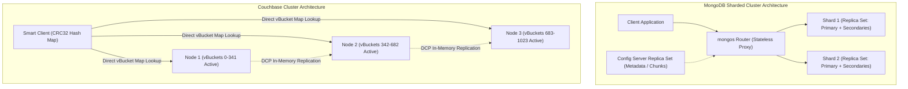

# MongoDB and Couchbase Architecture

## TL;DR

MongoDB and Couchbase represent the leading distributed document-oriented NoSQL databases, storing semi-structured data as flexible BSON or JSON documents with dynamic schemas.
MongoDB organizes clusters into master-worker Replica Sets governed by Raft-like elections, leveraging the WiredTiger storage engine with B-tree indexes, in-memory caching, and horizontal sharding managed by `mongos` query routers and Config Servers.
Couchbase implements a memory-first architecture rooted in an integrated Memcached caching engine paired with append-only Magma/Couchstore disk persistence.
Couchbase partitions data into 1,024 fixed virtual buckets (vBuckets), utilizing client-side cluster topology mapping and the Database Change Protocol (DCP) for ultra-low latency in-memory inter-node replication and streaming.

## Mental Model

MongoDB uses a hierarchical routing architecture for sharding with primary-secondary replica sets, whereas Couchbase uses direct client-to-vBucket hash routing over a memory-first cache tier.



## Architectural Internals and Deep Dive

### 1. MongoDB Document Model and WiredTiger Storage Engine
MongoDB stores records as BSON (Binary JSON), an efficient binary serialization format that encodes data types (e.g., `Date`, `Decimal128`, `ObjectId`), lengths, and field names.
The default storage engine is WiredTiger:
- **In-Memory Cache**: Allocates approximately 50% of system RAM minus 1GB (`(RAM - 1GB) * 0.5`). Caches uncompressed B-tree pages in memory, while disk blocks are compressed using Snappy or Zstandard.
- **Checkpoints**: WiredTiger writes dirty data to disk at regular intervals (default every 60 seconds or 2GB of log data), creating an immutable snapshot checkpoint.
- **Write-Ahead Log (Journal)**: Durability between checkpoints is secured via an append-only WAL called the Journal. Writes flush to the journal based on `commitIntervalMs` (default 100ms).
- **Concurrency & Concurrency Tickets**: WiredTiger implements optimistic concurrency control using hazard pointers and read/write tickets. If read or write ticket queues are exhausted under heavy load, client operations block at the storage engine boundary.

### 2. MongoDB Replica Sets and Consensus Elections
A MongoDB Replica Set consists of a single Primary node and multiple Secondary nodes (recommended size: 3 or 5 members):
- **Oplog (Operations Log)**: The primary records all mutations into a capped collection called the `oplog.rs`. Secondaries pull oplog records asynchronously or via pipelined tailing and replay them to maintain synchronization.
- **Elections**: MongoDB utilizes a Raft-variant consensus protocol. When secondaries miss primary heartbeats for `electionTimeoutMillis` (default 10,000ms), a secondary initiates an election.
- **Arbiters**: Lightweight nodes that hold an election vote but maintain no data. While they allow odd-numbered quorums with fewer servers, arbiters cannot host data, cannot become primary, and can introduce operational split-brain risks under network partitions.

### 3. MongoDB Write Concerns and Read Concerns
MongoDB allows applications to tune ACID trade-offs per operation:
- **Write Concern (`w`)**:
  - `w: 1`: Primary acknowledges the write as soon as it is written to its local memory/journal. Fast, but failover before oplog replication causes data loss.
  - `w: "majority"`: Primary blocks response until a majority of replica set voting members have written the mutation to memory/journal. Guarantees zero data loss across failovers.
  - `j: true`: Forces write to be flushed to persistent on-disk journal before acknowledgment.
- **Read Concern**:
  - `"local"`: Returns the node's most recent data without verifying whether the write was committed to a majority. Susceptible to dirty reads if the primary is rolled back.
  - `"majority"`: Reads from an in-memory snapshot containing data acknowledged by a majority of replica members. Eliminates dirty reads and rollbacks.
  - `"linearizable"`: The primary executes a quorum check with peers before responding, guaranteeing real-time recency at the cost of higher latency.

### 4. MongoDB Sharding Internals
Horizontal scaling divides collections across multiple Shards:
- **`mongos` Routing Tier**: Stateless lightweight query proxies that inspect client queries, consult Config Servers for chunk boundaries, route operations to target shards, and merge results.
- **Config Server Replica Set**: Stores the cluster's authoritative metadata, routing tables, and chunk distributions.
- **Shard Keys**:
  - *Ranged Sharding*: Divides data into contiguous ranges based on shard key values. Efficient for range queries, but sequential keys (e.g., timestamps) cause hot-shard insertion bottlenecks.
  - *Hashed Sharding*: Computes an MD5 hash of the shard key, distributing inserts uniformly across shards at the expense of broadcast queries for range scans.
- **Chunk Balancing**: MongoDB groups contiguous shard key ranges into Chunks (default 64MB). When a chunk reaches 64MB, `mongos` splits it. If shard chunk counts diverge beyond balance thresholds, the cluster Balancer moves chunks across shards in the background.

### 5. Couchbase Memory-First Architecture and vBuckets
Couchbase originated from the merger of CouchDB (document model) and Membase (Memcached distributed caching).
Unlike databases that read from disk into cache, Couchbase operates as an in-memory distributed cache backed by an asynchronous persistence engine:
- **1,024 Fixed vBuckets**: Every Couchbase bucket is statically divided into exactly 1,024 logical partitions called vBuckets (or 128 on macOS/Windows developer builds).
- **Direct Client Hash Routing**: Couchbase clients are "Smart Clients". The client maintains a local copy of the cluster's Cluster Map (vBucket map).
When a key is written, the client computes:

$$\text{vBucket} = \text{CRC32}(\text{Key}) \pmod{1024}$$

The client looks up which physical cluster node owns that active vBucket and opens a direct TCP connection to that node.
This completely eliminates proxy router layers (like MongoDB's `mongos`), achieving sub-millisecond read/write latencies.

### 6. Couchbase Database Change Protocol (DCP)
Couchbase synchronizes nodes and services using the Database Change Protocol (DCP), a high-speed, memory-to-memory streaming protocol:
- **Zero-Disk Replication**: Active vBuckets stream mutations directly from memory to replica vBuckets on peer nodes over TCP, bypassing disk writes.
- **Indexing & Analytics Streaming**: Secondary Global Indexes (GSI) and Search indexes consume mutation streams directly via DCP, keeping indexes up-to-date in near-real-time without querying table storage.
- **Cross-Datacenter Replication (XDCR)**: Uses DCP streams to replicate bucket modifications asynchronously across geographically distributed clusters over WAN links with tunable conflict resolution (timestamp-based or revision-based).

### 7. Couchbase Persistence Engines: Couchstore vs Magma
While mutations are acknowledged in memory, background flushers persist data to disk:
- **Couchstore**: Append-only B-tree file format. Modifications append to the end of the file, requiring periodic auto-compaction to reclaim dead space. Optimal for datasets fitting predominantly in RAM.
- **Magma**: High-density disk-optimized storage engine introduced in Couchbase 7.1. Built on a Log-Structured Merge (LSM) variant, Magma is purpose-built for massive datasets where RAM-to-disk ratios are very small (e.g., 1% RAM, 99% SSD), reducing cloud infrastructure costs.

## Trade-offs and Comparisons

| Dimension | MongoDB | Couchbase |
| :--- | :--- | :--- |
| **Primary Data Representation** | BSON (Binary JSON) | Pure JSON (Stored as string/binary payload) |
| **Routing Architecture** | Centralized proxy tier (`mongos` routing servers) | Smart client-side routing via direct vBucket maps |
| **Caching Model** | WiredTiger cache over OS disk files | Memory-first (Integrated Memcached engine) |
| **Partitioning Granularity** | Dynamic 64MB Chunks; continuous rebalancing | Fixed 1,024 vBuckets mapped across physical nodes |
| **Replication Mechanism** | Disk/memory WAL replay via `oplog.rs` | Memory-to-memory streaming via DCP (Zero-disk) |
| **Query Languages** | MQL (MongoDB Query Language) & Aggregation Pipeline | N1QL (SQL++ standard for querying nested JSON) |
| **Sub-Millisecond Read Latency** | Only if cached in WiredTiger and direct-routed | Native via direct client memory lookup |
| **Operational Simplicity** | High (Requires mongos, config servers, shards) | High (Homogeneous cluster nodes; multi-dimensional scaling) |

## Failure Modes and Mitigations

### 1. MongoDB Unsharded Query Scatter-Gather
- *Root Cause*: Executing queries that do not include the shard key in the query filter forces `mongos` to broadcast the query to every shard in the cluster (scatter-gather), saturating cluster network bandwidth and increasing tail latency.
- *Mitigation*: Ensure high-frequency application queries include the shard key; create targeted compound indexes starting with the shard key.

### 2. WiredTiger Cache Eviction Stalls
- *Root Cause*: Large working sets that exceed available WiredTiger memory force cache eviction threads into aggressive foreground eviction. Read and write tickets drop to zero, freezing all incoming queries.
- *Mitigation*: Monitor `wiredTiger.cache["tracked dirty bytes in the cache"]`; size physical RAM so the active working set fits within cache; tune `eviction_target` and `eviction_trigger` thresholds.

### 3. Couchbase Metadata Ejection and Memory Starvation
- *Root Cause*: In "Value Ejection" mode, key metadata remains in RAM while values are evicted to disk. If the working set contains hundreds of millions of keys, key metadata exhausts available bucket RAM quota, causing Couchbase to reject new writes with `TMPFAIL` / `Memory Quota Exceeded`.
- *Mitigation*: Enable "Full Ejection" mode (ejects keys and values to disk) or migrate large high-density buckets to the Magma storage engine; increase cluster RAM.

### 4. Split-Brain from Arbiters in Network Partitions
- *Root Cause*: A network partition separates a 3-node MongoDB replica set (Primary, Secondary, Arbiter). The arbiter can vote with either partition, potentially electing a new primary while the old primary continues accepting uncommitted writes under `w: 1`.
- *Mitigation*: Avoid replica set arbiters in production; use dedicated, data-bearing secondary nodes; enforce `w: "majority"` on all write operations.

## Hands-On Verification

### Multi-OS Diagnostic Commands

#### Linux / macOS (MongoDB Shell - `mongosh`)
```bash
# Connect to local MongoDB instance
mongosh --eval "db.serverStatus()"

# Inspect WiredTiger cache metrics and ticket availability
mongosh --eval "
const status = db.serverStatus();
print('WiredTiger Concurrent Read Tickets:', status.wiredTiger.concurrentTransactions.readTicketsAvailable);
print('WiredTiger Concurrent Write Tickets:', status.wiredTiger.concurrentTransactions.writeTicketsAvailable);
print('Cache Used (MB):', Math.round(status.wiredTiger.cache['bytes currently in the cache'] / (1024*1024)));
"

# Inspect replica set status and replication lag
mongosh --eval "rs.status()"
```

#### Linux / macOS (Couchbase CLI)
```bash
# Verify Couchbase cluster nodes and bucket status via REST API
curl -u Administrator:password http://localhost:8091/pools/default/buckets

# Query bucket statistics and memory usage
curl -u Administrator:password http://localhost:8091/pools/default/buckets/default/stats | jq '.op.samples["mem_used"][-1]'
```

#### Windows (PowerShell)
```powershell
# Inspect MongoDB service on Windows
Get-Service -Name MongoDB*

# Run mongosh query via PowerShell
mongosh --eval "db.adminCommand({ replSetGetStatus: 1 })"
```

### Standalone Document Store and Smart Client Routing Simulation (Python Standard Library)

The following runnable script requires only the Python standard library.
It models both architectural paradigms: (1) MongoDB WiredTiger in-memory cache, read/write concurrency ticket exhaustion prevention, periodic dirty page checkpoints, and Replica Set oplog replication with tunable write concerns (`w: 1` vs `w: "majority"`) and read concerns (`local` vs `majority` commit point verification); and (2) Couchbase memory-first architecture featuring fixed 1,024 vBuckets, Smart Client direct CRC32 hashing and cluster map lookups without proxy hops, and Database Change Protocol (DCP) memory-to-memory replica streaming.

```python
"""
MongoDB WiredTiger and Couchbase Smart Client vBucket Routing Simulation
Pure Python 3 standard library implementation.
Demonstrates:
- MongoDB WiredTiger cache with read/write concurrency tickets and checkpoint flushes
- Replica Set Oplog replication with majority commit point tracking
- Write Concerns (w: 1 vs w: majority) and Read Concerns (local vs majority)
- Couchbase 1,024 fixed vBuckets and Smart Client direct CRC32 hash routing
- Database Change Protocol (DCP) zero-disk memory-to-memory replication
"""

import binascii
import time
from dataclasses import dataclass, field
from typing import Any, Dict, List, Optional, Set, Tuple

@dataclass
class OplogEntry:
    op_id: int
    op_type: str
    namespace: str
    doc: Dict[str, Any]
    ts: float

class SimulatedWiredTigerCache:
    def __init__(self, max_tickets: int = 128) -> None:
        self.max_tickets = max_tickets
        self.available_tickets = max_tickets
        self.cache_pages: Dict[str, Dict[str, Any]] = {}
        self.dirty_pages: Set[str] = set()

    def acquire_ticket(self) -> bool:
        if self.available_tickets > 0:
            self.available_tickets -= 1
            return True
        return False

    def release_ticket(self) -> None:
        self.available_tickets = min(self.max_tickets, self.available_tickets + 1)

    def write_page(self, key: str, doc: Dict[str, Any]) -> None:
        self.cache_pages[key] = doc
        self.dirty_pages.add(key)

    def checkpoint(self) -> int:
        flushed = len(self.dirty_pages)
        self.dirty_pages.clear()
        print(f"[WiredTiger Checkpoint] Flushed {flushed} dirty pages to disk.")
        return flushed

class SimulatedMongoReplicaSet:
    def __init__(self, members: Optional[List[str]] = None) -> None:
        self.members = members or ["primary", "secondary-1", "secondary-2"]
        self.primary = self.members[0]
        self.secondaries = self.members[1:]
        self.wt = SimulatedWiredTigerCache()
        self.oplog: List[OplogEntry] = []
        self.secondary_applied: Dict[str, int] = {s: 0 for s in self.secondaries}
        self.op_seq = 0
        self.majority_count = (len(self.members) // 2) + 1

    def get_majority_commit_point(self) -> int:
        offsets = sorted([self.op_seq] + list(self.secondary_applied.values()), reverse=True)
        return offsets[self.majority_count - 1]

    def insert(self, coll: str, doc: Dict[str, Any], write_concern: str = "majority") -> bool:
        if not self.wt.acquire_ticket():
            raise RuntimeError("WiredTiger write tickets exhausted!")
        try:
            self.op_seq += 1
            entry = OplogEntry(self.op_seq, "i", coll, doc, time.time())
            self.oplog.append(entry)
            self.wt.write_page(f"{coll}:{doc['_id']}", doc)

            acks = 1
            if write_concern == "majority":
                for s in self.secondaries:
                    self.secondary_applied[s] = self.op_seq
                    acks += 1
                    if acks >= self.majority_count:
                        break
            print(f"[MongoDB Insert] Document {doc['_id']} inserted (w={write_concern!r}, acks={acks}/{self.majority_count})")
            return True
        finally:
            self.wt.release_ticket()

    def find_one(self, coll: str, doc_id: str, read_concern: str = "majority") -> Optional[Dict[str, Any]]:
        key = f"{coll}:{doc_id}"
        if read_concern == "local":
            doc = self.wt.cache_pages.get(key)
            print(f"[MongoDB Read local] Returned {doc_id} directly from primary cache.")
            return doc

        majority_commit = self.get_majority_commit_point()
        for op in reversed(self.oplog):
            if op.namespace == coll and op.doc.get("_id") == doc_id and op.op_id <= majority_commit:
                print(f"[MongoDB Read majority] Returned {doc_id} verified against majority commit point ({majority_commit}).")
                return op.doc
        print(f"[MongoDB Read majority] Document {doc_id} not visible at majority commit point ({majority_commit}).")
        return None

class SimulatedCouchbaseCluster:
    def __init__(self, nodes: Optional[List[str]] = None, total_vbuckets: int = 1024) -> None:
        self.nodes = nodes or ["node-1", "node-2", "node-3", "node-4"]
        self.total_vbuckets = total_vbuckets
        self.vbucket_map: Dict[int, str] = {}
        for vb in range(total_vbuckets):
            self.vbucket_map[vb] = self.nodes[vb % len(self.nodes)]
        self.active_data: Dict[str, Dict[str, Any]] = {n: {} for n in self.nodes}
        self.replica_data: Dict[str, Dict[str, Any]] = {n: {} for n in self.nodes}

    def _hash_key(self, key: str) -> int:
        return (binascii.crc32(key.encode("utf-8")) & 0xffffffff) % self.total_vbuckets

    def set(self, key: str, value: Any) -> Tuple[int, str]:
        vb = self._hash_key(key)
        active_node = self.vbucket_map[vb]
        self.active_data[active_node][key] = value

        node_idx = self.nodes.index(active_node)
        replica_node = self.nodes[(node_idx + 1) % len(self.nodes)]
        self.replica_data[replica_node][key] = value

        print(f"[Couchbase Smart Client Direct SET] key={key!r} -> vBucket {vb} on {active_node} (DCP streamed to {replica_node})")
        return vb, active_node

    def get(self, key: str) -> Tuple[Optional[Any], int, str]:
        vb = self._hash_key(key)
        active_node = self.vbucket_map[vb]
        val = self.active_data[active_node].get(key)
        print(f"[Couchbase Smart Client Direct GET] key={key!r} -> vBucket {vb} on {active_node} (val={val})")
        return val, vb, active_node

if __name__ == "__main__":
    mongo = SimulatedMongoReplicaSet()
    mongo.insert("orders", {"_id": "ORD-100", "item": "Laptop", "status": "PENDING"}, write_concern="majority")
    mongo.find_one("orders", "ORD-100", read_concern="majority")
    mongo.wt.checkpoint()

    cb = SimulatedCouchbaseCluster()
    cb.set("order::ORD-100", {"item": "Laptop", "status": "PENDING"})
    cb.get("order::ORD-100")
```

### Live Cluster Integration Script (PyMongo Driver)

The following runnable script demonstrates connecting to a MongoDB replica set, executing writes under `w: "majority"` and `j: True`, and querying under `readConcern: "majority"`.

```python
"""
MongoDB Write Concern and Read Concern Verification Script
Prerequisites: pip install pymongo
Requires running MongoDB instance on localhost:27017.
"""

from pymongo import MongoClient
from pymongo.write_concern import WriteConcern
from pymongo.read_concern import ReadConcern
from pymongo.read_preferences import ReadPreference
import time

def verify_mongodb_concerns():
    # Connect with a short server selection timeout
    client = MongoClient("mongodb://localhost:27017/", serverSelectionTimeoutMS=5000)
    
    db = client["test_store"]
    
    # 1. Configure strict WriteConcern: majority acknowledgment and durable journal flush
    strict_wc = WriteConcern(w="majority", j=True, wtimeout=5000)
    
    # Configure strict ReadConcern: read only data committed by majority
    strict_rc = ReadConcern(level="majority")
    
    # Get collection configured with specific concerns
    collection = db.get_collection(
        "customer_orders",
        write_concern=strict_wc,
        read_concern=strict_rc,
        read_preference=ReadPreference.PRIMARY
    )
    
    print("[Setup] Configured collection with w='majority', j=True, and readConcern='majority'.")
    
    # 2. Execute Document Insertion
    order_doc = {
        "order_id": "ORD-98231",
        "customer_id": "CUST-412",
        "items": [
            {"sku": "LAPTOP-01", "qty": 1, "price": 1299.99},
            {"sku": "MOUSE-02", "qty": 1, "price": 49.99}
        ],
        "status": "CONFIRMED",
        "created_at": time.time()
    }
    
    insert_result = collection.insert_one(order_doc)
    print(f"[Write Success] Inserted document with _id: {insert_result.inserted_id}")
    
    # 3. Read back with majority read concern
    retrieved_order = collection.find_one({"order_id": "ORD-98231"})
    if retrieved_order:
        print(f"[Read Success] Found Order: {retrieved_order['order_id']} | Status: {retrieved_order['status']}")
    else:
        print("[Read Failure] Order not found.")
        
    client.close()
    print("[Complete] Verification completed successfully.")

if __name__ == "__main__":
    try:
        verify_mongodb_concerns()
    except Exception as exc:
        print(f"[Error] Execution failed: {exc}")
```

## Performance Characteristics and Capacity Planning

### 1. MongoDB Working Set Sizing Math
To avoid severe disk thrashing, the WiredTiger cache must hold all active indexes plus the frequently accessed data working set:

$$\text{RequiredCacheRAM} = \text{ActiveIndexesSize} + \text{WorkingSetDataSize} \times 1.25$$

Since WiredTiger allocates $50\%$ of physical RAM:

$$\text{ServerRAM} = 2 \times \text{RequiredCacheRAM} + 2\text{GB (OS Headroom)}$$

### 2. Couchbase vBucket Memory Math
Couchbase allocates a fixed 1,024 vBuckets per cluster.
If a bucket is allocated 64GB of RAM across a 4-node cluster:
- RAM per node: 16GB.
- Active vBuckets per node:

$$\text{vBucketsPerNode} = \frac{1024}{4} = 256 \text{ active vBuckets}$$

- RAM per vBucket:

$$\text{RAMPerVBucket} = \frac{64 \text{ GB}}{1024} = 62.5 \text{ MB per vBucket}$$

This deterministic mapping allows Couchbase to predict exact memory requirements during node additions or failovers.

## In Production: Real-World Case Studies

### 1. eBay's Massive MongoDB Deployment
eBay operates massive MongoDB clusters to power product catalogs, search suggestions, and buyer personalization:
- **Challenge**: Storing hundreds of millions of semi-structured listings with dynamic seller attributes that do not conform to rigid relational schemas.
- **Solution**: Deployed sharded clusters using hashed shard keys on seller IDs, ensuring writes distribute evenly across underlying hardware while leveraging secondary indexes for localized category searches.

### 2. LinkedIn's Couchbase Session and Caching Platform
LinkedIn utilizes Couchbase clusters to store user session state, profile caches, and real-time feeds:
- **Low Latency Mandate**: Requires strict sub-5ms SLA for profile lookups under hundreds of thousands of queries per second.
- **Smart Client Advantage**: Direct client-to-vBucket routing over memory eliminated intermediate proxy hops, while DCP streaming powered real-time updates to downstream search caches.

## Staff+ Interview Questions

> [!question]
> How does MongoDB's sharding architecture differ from Couchbase's vBucket architecture, and what are the operational latency implications of these designs?

> [!success]- Answer
> MongoDB utilizes a dynamic chunk-based sharding architecture coordinated by a stateless proxy tier (`mongos`) and a metadata cluster (Config Servers). When a client sends a query, it travels to `mongos`, which checks cached routing tables from the Config Servers to locate the appropriate shard, introducing an intermediate network hop. In contrast, Couchbase uses a fixed 1,024 vBucket hashing scheme. Couchbase clients are "Smart Clients" that maintain an internal cluster map directly in application memory. When a client performs a read or write, it hashes the key using CRC32 modulo 1024 locally and connects directly to the node hosting that active vBucket. Couchbase eliminates the proxy routing tier entirely, delivering consistent sub-millisecond latencies, whereas MongoDB requires managing and scaling an external `mongos` routing layer.

> [!question]
> Explain what MongoDB Write Concern `w: "majority"` guarantees and how it prevents data loss during an unexpected primary node crash.

> [!success]- Answer
> When a client writes with `w: 1`, the primary node acknowledges the write as soon as it updates its local in-memory WiredTiger cache and oplog. If the primary crashes before secondaries have fetched the new oplog entry, a secondary will be elected primary that lacks the un-replicated write. When the old primary rejoins, the un-replicated write is rolled back and dumped to a rollback file, resulting in silent data loss from the client's perspective. When configured with `w: "majority"`, the primary blocks acknowledgment until a majority of voting replica set members have received and written the oplog entry. Because a newly elected primary must contain votes from a majority of the replica set, Raft consensus guarantees that the new primary contains all majority-committed writes, ensuring zero data loss across failovers.

> [!question]
> What is the Database Change Protocol (DCP) in Couchbase, and why is memory-to-memory replication superior to disk-based replication?

> [!success]- Answer
> Couchbase's Database Change Protocol (DCP) is a high-throughput, memory-to-memory streaming protocol. When a mutation occurs on an active vBucket, DCP streams the mutation directly from the host's RAM across the network to replica vBuckets on peer nodes and to indexing services, completely bypassing disk I/O. In contrast, traditional databases write mutations to disk (WAL/CommitLog/Oplog), flush them, and have replicas read and replay those disk records. By replicating entirely in memory, Couchbase eliminates disk I/O bottlenecks and write amplification from the replication critical path, achieving replication latencies in the single-digit millisecond range.

> [!question]
> What are MongoDB Concurrency Tickets in the WiredTiger engine, and what happens to application requests when tickets are exhausted?

> [!success]- Answer
> WiredTiger uses a ticket-based queuing mechanism to limit concurrent storage engine execution and prevent CPU thrashing and memory exhaustion. By default, WiredTiger allocates 128 concurrent read tickets and 128 concurrent write tickets. When an operation enters the storage engine, it checks out a ticket; when the operation completes, it returns the ticket. If slow disk I/O, lock contention, or traffic spikes cause operations to linger, available tickets can drop to zero. When tickets are exhausted, subsequent incoming client queries block at the entrance of the WiredTiger engine, rapidly filling application connection pools, spiking latency, and eventually causing client request timeouts.

> [!question]
> Explain the trade-offs between Hashed Sharding and Ranged Sharding in MongoDB. Under what query patterns would hashed sharding cause severe performance degradation?

> [!success]- Answer
> Ranged Sharding partitions data into contiguous chunks based on raw shard key values. It is highly efficient for range-based queries (e.g., `WHERE date >= X AND date <= Y`) because `mongos` can route the query to the specific shard(s) holding that range. However, for monotonically increasing keys, ranged sharding creates extreme write hot-spotting on the single shard holding the max range. Hashed Sharding hashes the shard key (using MD5), distributing inserts uniformly across all shards to eliminate hot spots. The severe performance degradation occurs for range queries: because hashes scatter logically adjacent keys randomly across all shards, a range query cannot be localized and must be broadcast to every single shard in the cluster (a scatter-gather query), multiplying cluster CPU and network overhead.

> [!question]
> Why should production MongoDB replica sets generally avoid using Arbiters, and what failure scenario can arbiters induce?

> [!success]- Answer
> An Arbiter is a lightweight replica set member that does not store data and exists solely to cast a vote during elections to break ties without the cost of a full data node. However, arbiters introduce severe production risks: (1) if an arbiter participates in elections during a network partition, it can vote with an isolated node, electing a primary that cannot satisfy `w: "majority"` writes; (2) arbiters do not store oplog entries, so they cannot assist in replication, meaning the loss of a single data node can eliminate write availability under majority write concerns; and (3) historical versions and majority read concerns stall because arbiters cannot advance majority commit points, causing cache bloat on remaining data nodes.

> [!question]
> What is Couchbase N1QL (SQL++), and how does it execute expressive relational-style queries across nested JSON documents?

> [!success]- Answer
> N1QL is Couchbase's declarative query language conforming to the SQL++ standard, designed specifically to query non-first-normal-form (NF2) nested JSON documents. It provides traditional SQL syntax (SELECT, WHERE, JOIN, GROUP BY) extended with JSON-native operators such as `NEST`, `UNNEST`, and path navigation (`user.address.zipcode`). To execute N1QL efficiently without scanning millions of raw documents, Couchbase decouples querying from data storage using Global Secondary Indexes (GSI). GSIs are maintained independently on dedicated Index nodes via DCP streams, allowing the query engine to evaluate complex indexes, joins, and filters in memory before fetching target document payloads.

> [!question]
> How does MongoDB handle document growth when an `UPDATE` operation adds fields to an existing document, and how does WiredTiger's design differ from the legacy MMAPv1 engine?

> [!success]- Answer
> Under MongoDB's legacy MMAPv1 storage engine, documents were stored in contiguous memory-mapped files. If an update increased a document's size beyond its pre-allocated padding space, MMAPv1 had to physically reallocate and move the entire document to a new disk location, updating all secondary index pointers and causing severe I/O stalls. WiredTiger completely solved this: it does not use in-place padded disk records. Instead, it writes updated documents as new compressed records during checkpoints and journals, decoupling document size from physical disk slots. Updated fields are managed in-memory via MVCC modification chains and written during clean page flushes, eliminating the document relocation penalty entirely.

> [!question]
> Contrast MongoDB's Read Concern levels (`local`, `available`, `majority`, `linearizable`, and `snapshot`), and explain how WiredTiger's storage engine maintains majority commit points.

> [!success]- Answer
> Read Concern `local` returns the queried node's most recent data directly from its local WiredTiger cache without checking whether the write was committed to a majority, making it vulnerable to dirty reads if the primary rolls back.
> Read Concern `available` is identical to `local` on replica sets, but on sharded clusters it does not filter out orphaned chunks undergoing migration, trading isolation for minimal routing overhead.
> Read Concern `majority` reads from an in-memory MVCC snapshot of data that has been acknowledged by a majority of replica set members, completely eliminating dirty reads and rollback vulnerabilities.
> WiredTiger maintains the majority commit point by tracking the cluster's stable timestamp: secondaries continuously report their applied oplog positions to the primary, which calculates the highest oplog entry acknowledged by a quorum ($\lfloor N/2 \rfloor + 1$) and broadcasts this stable timestamp back to all nodes.
> Read Concern `linearizable` guarantees real-time recency by having the primary execute a synchronous quorum heartbeat with peer members during the read call to prove it has not been deposed by a network partition.
> Read Concern `snapshot` provides point-in-time multi-document transaction isolation: it pins a consistent WiredTiger storage snapshot at transaction start, guaranteeing repeatable reads without phantom rows or dirty reads across all accessed collections.

> [!question]
> How does Couchbase execute auto-failover and online cluster rebalancing across its 1,024 fixed vBuckets without incurring downtime?

> [!success]- Answer
> Couchbase's cluster manager continuously monitors node liveness using high-frequency inter-node heartbeats.
> If a physical node fails to heartbeat within the auto-failover timeout window (default 120 seconds), the orchestrator triggers an automated failover: for every active vBucket hosted on the dead node, the orchestrator immediately promotes its corresponding replica vBucket on surviving nodes to active status.
> The orchestrator updates the cluster's global topology map and broadcasts it to all Smart Clients, allowing clients to re-route traffic to the promoted vBuckets within milliseconds without dropped connections.
> When a new node is added or an old node is recovered, Couchbase initiates an Online Rebalance to restore balanced vBucket distribution across nodes.
> The rebalance coordinator moves vBuckets sequentially in the background using the Database Change Protocol (DCP): it streams in-memory mutations for the transferring vBucket from the source node to the target node while the source node continues serving active client read and write traffic.
> Once the target node catches up with the mutation stream, the coordinator executes a microsecond atomic takeover: it switches the vBucket state from active to replica on the source node, activates it on the target node, and pushes the updated vBucket map to clients, achieving zero downtime and zero dropped requests throughout the rebalancing process.

## Related Concepts and Wikilinks

- [[CAP-Theorem-and-PACELC]] - MongoDB and Couchbase classification under partition tolerance.
- [[ACID-vs-BASE]] - Document store transactions and write concern guarantees.
- [[Partitioning-and-Sharding]] - Comparative analysis of dynamic chunks versus fixed vBuckets.
- [[Consistent-Hashing]] - Couchbase vBucket hashing algorithm.
- [[RDBMS-vs-NoSQL]] - Trade-offs between document stores and relational schemas.
- [[Redis-Architecture]] - In-memory key-value caching versus Couchbase memory-first architecture.

## Further Reading and References

- Bradshaw, Shannon, Eoin Brazil, and Kristina Chodorow. *MongoDB: The Definitive Guide* (3rd Edition). O'Reilly Media, 2019.
- Couchbase Engineering. *Couchbase Server Architecture: Under the Hood*. Technical Whitepaper, 2023.
- Kleppmann, Martin. *Designing Data-Intensive Applications*. O'Reilly Media, 2017. Chapter 2: Data Models and Query Languages.
- MongoDB Engineering. *WiredTiger Storage Engine Architecture and Tuning Guide*. MongoDB Documentation.
- eBay Technical Staff. "Scaling MongoDB at eBay: Patterns and Anti-Patterns." eBay Tech Blog, 2020.
