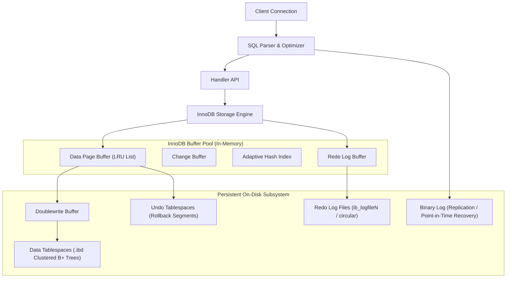

# MySQL and InnoDB Architecture

## TL;DR

MySQL is the world's most widely adopted open-source relational database management system, utilizing a modular pluggable storage engine architecture where InnoDB acts as the default ACID-compliant transactional engine.
InnoDB organizes data around clustered B+ tree indexes, where the primary key physically orders table records on disk.
Concurrency control is governed by Multi-Version Concurrency Control (MVCC) utilizing undo logs, preventing read-write locking conflicts during snapshot reads.
Durability is guaranteed through write-ahead logging via the doublewrite buffer and circular redo logs.
Locking semantics combine record locks, gap locks, and next-key locks to eliminate phantom reads under Repeatable Read isolation.
High availability is achieved through binary log (binlog) replication via asynchronous, semi-synchronous, or Group Replication consensus topologies.

## Mental Model

InnoDB separates in-memory query processing from persistent disk structures through a write-ahead log and a central buffer pool.



## Architectural Internals and Deep Dive

### 1. The Clustered B+ Tree Storage Hierarchy
InnoDB stores all table data inside a clustered index built on the table primary key.
If no primary key is explicitly defined, InnoDB selects the first non-null unique index; if no such index exists, it synthesizes an internal 6-byte monotonic integer (`GEN_CLUST_INDEX`).
Leaf pages of the clustered index contain the complete row data alongside internal transaction identifiers (`DB_TRX_ID`) and rollback pointers (`DB_ROLL_PTR`).
Secondary indexes store the index key columns alongside the primary key value as their leaf pointer, rather than a raw physical disk offset.
As a consequence, secondary index lookups require two traversals: first traversing the secondary B+ tree to retrieve the primary key, followed by a secondary clustered index traversal known as index lookup (index seek) or bookmark lookup, unless resolved entirely via a covering index.

```
Clustered Index Root (Page 3)
      /              \
Internal Node    Internal Node
   /      \         /      \
Leaf     Leaf     Leaf    Leaf Pages (16KB Page containing Full Row Payload)
```

### 2. The InnoDB Buffer Pool Architecture
Disk I/O is mitigated by the InnoDB Buffer Pool, which caches data pages, index pages, undo pages, and change buffer structures.
The buffer pool is subdivided into multiple buffer pool instances to reduce latch contention across CPU cores.
Page eviction follows an augmented Least Recently Used (LRU) algorithm split into two sublists: a Young sublist (default 5/8 of the list) and an Old sublist (default 3/8 of the list).
New pages are initially loaded at the midpoint insertion point between the young and old regions.
A page must remain in the old sublist for a duration exceeding `innodb_old_blocks_time` (default 1000 milliseconds) before access promotes it to the head of the young sublist, protecting cache lines from large table scan pollution.

### 3. Redo Logging and Crash Recovery
Durability conforms to the Write-Ahead Logging (WAL) protocol.
Modifications write changes into the in-memory Redo Log Buffer before dirtying pages in the buffer pool.
The redo log is written sequentially to circular files on disk (`ib_logfile0`, `ib_logfile1` or dynamic redo log files in MySQL 8.0).
Flushing behavior is dictated by `innodb_flush_log_at_trx_commit`:
- Value `1` (Full ACID): The redo log is flushed to disk at every transaction commit (`fsync`).
- Value `0`: The log buffer is written and flushed to disk once per second; crash can lose up to one second of transactions.
- Value `2`: The log buffer is written to OS page cache at commit, but `fsync` occurs once per second; survivable across MySQL daemon crashes, but vulnerable to OS power loss.

Crash recovery executes the ARIES-style algorithm:
1. Analysis phase: Scans the redo log from the last checkpoint to identify dirty pages and active transactions.
2. Redo phase: Replays logged changes forward to restore database state to the exact moment of failure.
3. Undo phase: Rolls back uncommitted transactions active at crash time using undo log records.

### 4. The Doublewrite Buffer
Linux and UNIX file systems typically write data in 4KB blocks, while InnoDB pages are 16KB by default.
A sudden hardware or operating system crash mid-write results in a torn page (partial page write) where only part of a 16KB page is persisted.
Because redo log records contain physical delta operations, they cannot recover a page with corrupted structural checksums.
InnoDB solves this with the Doublewrite Buffer, a contiguous storage area in the system tablespace or dedicated doublewrite files.
Before writing dirty pages to their final tablespace files, InnoDB writes them contiguously to the doublewrite buffer and issues an `fsync`.
If a torn page occurs during tablespace flush, InnoDB restores the intact 16KB page from the doublewrite buffer before applying redo log deltas.

### 5. Multi-Version Concurrency Control (MVCC) and Undo Logs
InnoDB implements MVCC to allow non-blocking concurrent reads and writes.
Each row contains hidden system columns:
- `DB_TRX_ID` (6 bytes): Identifier of the last transaction that inserted or modified the row.
- `DB_ROLL_PTR` (7 bytes): Rollback pointer pointing to an undo log segment containing the historical image of the row.
- `DB_ROW_ID` (6 bytes): Monotonic identifier present only if no primary key exists.

When a transaction executes a consistent read (`SELECT`), InnoDB creates a ReadView.
The ReadView records the low-water mark (`up_limit_id`, lowest active transaction ID) and high-water mark (`low_limit_id`, highest transaction ID allocated + 1), alongside an active transaction list (`trx_ids`).
Rows with `DB_TRX_ID` higher than the ReadView boundary or present in `trx_ids` are invisible to the transaction, causing InnoDB to follow `DB_ROLL_PTR` back through the undo log chain until encountering a visible historical version.

### 6. InnoDB Locking Mechanisms
InnoDB supports fine-grained locking modes:
- **Record Lock**: Locks the index record itself.
- **Gap Lock**: Locks the gap between index records, preventing concurrent transactions from inserting values within that range.
- **Next-Key Lock**: A combination of a record lock on the index record and a gap lock on the gap immediately preceding it.
- **Insert Intention Lock**: A specialized gap lock placed prior to row insertion to permit multiple concurrent non-overlapping inserts within the same gap.

Under the default `REPEATABLE READ` isolation level, InnoDB uses next-key locking during index scans to prevent phantom reads without requiring table-level locks.
Under `READ COMMITTED` isolation, gap locking is disabled (except for foreign key constraint checks and duplicate key validation), and only record locks are taken.

### 7. Binary Log (Binlog) and Replication Topologies
The MySQL Binary Log records statement-level, row-level, or mixed format mutations for replication and point-in-time recovery.
Binlog coordinates with InnoDB redo log via a Two-Phase Commit (2PC) protocol orchestrated by an internal XA transaction coordinator:
1. Prepare: InnoDB writes changes to redo log and marks the transaction state as `PREPARED`.
2. Commit Binlog: MySQL writes the transaction to the binlog and flushes it to disk (`sync_binlog=1`).
3. Commit Engine: InnoDB writes the final `COMMITTED` marker to the redo log.

Replication topologies:
- **Asynchronous Replication**: Primary writes to binlog and responds immediately to the client; replicas pull events via I/O thread and apply them asynchronously via SQL thread. High write throughput, risk of data loss on primary failure.
- **Semi-Synchronous Replication**: Primary blocks transaction commit until at least one replica acknowledges receipt and persistence of the binlog event to its relay log. Eliminates phantom loss on failover.
- **Group Replication (InnoDB Cluster)**: Uses Paxos-based consensus (Group Communication System) across active nodes to provide automated failover, distributed conflict detection, and multi-primary write support.

## Trade-offs and Comparisons

| Dimension | InnoDB (MySQL) | MyISAM (Legacy MySQL) | RocksDB (MyRocks) |
| :--- | :--- | :--- | :--- |
| **Storage Structure** | Clustered B+ Tree | Non-clustered heap tables with separate B-Tree indexes | Log-Structured Merge Tree (LSM) |
| **Transaction Support** | Full ACID (2PC, MVCC, Undo/Redo) | Non-transactional (No rollbacks) | ACID compliant |
| **Locking Granularity** | Row-level, Gap, Next-Key | Table-level locking only | Row-level locking |
| **Write Amplification** | Moderate to High (16KB page rewrites, doublewrite) | High under concurrent write load | Low to Moderate (sequential append-only SSTables) |
| **Space Efficiency** | Moderate (B+ Tree fragmentation, page fill factor) | High (compact heap) | Very High (prefix compression, dictionary encoding) |
| **Crash Recovery** | Automatic via WAL & Doublewrite | Requires explicit `REPAIR TABLE` | Automatic via WAL replay |
| **Primary Use Case** | OLTP, transactional e-commerce, banking | Read-mostly legacy workloads | Hyper-scale write-heavy time-series, log ingestion |

## Failure Modes and Mitigations

### 1. Replication Lag
- *Root Cause*: Heavy primary write concurrency creates parallel binlog streams that single-threaded replica SQL apply threads cannot execute at equal speed, exacerbated by long-running transactions or missing indexes on replicas.
- *Mitigation*: Enable multi-threaded replication workers (`replica_parallel_workers=N` and `replica_parallel_type=LOGICAL_CLOCK`); eliminate table scans on replicas by verifying foreign key and secondary indexing.

### 2. Deadlock Storms
- *Root Cause*: High concurrent write loads executing out-of-order multi-row updates or gap locks across intersecting transaction spaces cause circular wait dependencies.
- *Mitigation*: Ensure all transactions acquire locks in identical alphabetical or primary key ordering; switch transaction isolation from `REPEATABLE READ` to `READ COMMITTED` to eliminate gap locking overhead; set strict `innodb_lock_wait_timeout` limits.

### 3. Redo Log Checkpoint Starvation
- *Root Cause*: Write burst overwhelms the redo log capacity faster than dirty page flushing can advance the checkpoint LSN (Log Sequence Number). The database stalls completely while synchronous flushing forces buffer pool writes.
- *Mitigation*: Increase total redo log capacity (`innodb_redo_log_capacity` in MySQL 8.0); tune page cleaning threads (`innodb_page_cleaners`) and adaptive flushing (`innodb_adaptive_flushing=ON`).

### 4. Buffer Pool Churn and Cold Start Latency
- *Root Cause*: Server reboot flushes memory, causing sudden post-restart query latency spikes as all lookups trigger physical disk reads.
- *Mitigation*: Enable automated buffer pool state dump and load (`innodb_buffer_pool_dump_at_shutdown=ON` and `innodb_buffer_pool_load_at_startup=ON`).

## Hands-On Verification

### Multi-OS Diagnostic Commands

#### Linux (Ubuntu/RHEL)
```bash
# Verify running MySQL status and InnoDB engine metrics
mysql -u root -p -e "SHOW ENGINE INNODB STATUS\G"

# Inspect buffer pool hit ratio and dirty page counts
mysql -u root -p -e "
SELECT 
    variable_name, variable_value 
FROM performance_schema.global_status 
WHERE variable_name IN (
    'Innodb_buffer_pool_read_requests',
    'Innodb_buffer_pool_reads',
    'Innodb_buffer_pool_pages_dirty',
    'Innodb_buffer_pool_pages_total'
);"

# Trace I/O flush operations on the database data directory
sudo iotop -b -n 2 -d 1 -p $(pgrep mysqld)
```

#### macOS (Homebrew MySQL)
```bash
# Check Homebrew MySQL service configuration
brew services list

# Connect and check transaction isolation level and locking status
mysql -u root -e "SELECT @@global.transaction_isolation, @@global.innodb_flush_log_at_trx_commit;"

# Check current active InnoDB transactions and lock waits
mysql -u root -e "
SELECT 
    trx_id, trx_state, trx_started, trx_query, trx_tables_locked 
FROM information_schema.innodb_trx;"
```

#### Windows (PowerShell)
```powershell
# Query MySQL service status
Get-Service -Name MySQL80

# Connect via MySQL CLI and inspect redo log checkpoint progress
mysql -u root -p -e "
SELECT 
    EVENT_NAME, COUNT_STAR, SUM_TIMER_WAIT/1000000000 AS wait_ms 
FROM performance_schema.events_waits_summary_global_by_event_name 
WHERE EVENT_NAME LIKE '%wait/io/file/innodb/innodb_log_file%' 
ORDER BY SUM_TIMER_WAIT DESC LIMIT 5;"
```
### Complete Clustered B+ Tree and Undo Log Simulation (Pure Python Standard Library)

The following standalone script implements a runnable, pure-Python simulation of InnoDB's storage engine architecture without external dependencies.
It models the Clustered B+ Tree hierarchy (where primary key leaves hold complete row data), Secondary Index B+ Trees (leaf nodes hold secondary keys and primary key pointers), the two-step bookmark lookup mechanism versus single-step covering index lookups, and undo log rollback segments (`DB_TRX_ID` and `DB_ROLL_PTR`) for point-in-time snapshot reconstruction.

```python
"""
Simulated MySQL InnoDB Storage Engine (Clustered Index, Secondary Index, Undo Logs)
Executable without external dependencies using pure Python standard library.
Demonstrates:
1. Clustered B+ Tree vs Secondary Index storage structures.
2. Bookmark lookups vs Covering Index optimizations.
3. Undo Log rollback pointer chaining (DB_TRX_ID, DB_ROLL_PTR) for MVCC snapshots.
"""

import time

class ClusteredRow:
    """Represents a leaf node row in the clustered B+ tree."""
    def __init__(self, pk: int, data: dict, trx_id: int, roll_ptr=None):
        self.pk = pk
        self.data = data
        self.trx_id = trx_id
        self.roll_ptr = roll_ptr

    def __repr__(self):
        return f"ClusteredRow(pk={self.pk}, trx_id={self.trx_id}, data={self.data})"

class UndoRecord:
    """Represents an undo log segment entry holding historical row versions."""
    def __init__(self, trx_id: int, old_data: dict, prev_roll_ptr=None):
        self.trx_id = trx_id
        self.old_data = old_data
        self.prev_roll_ptr = prev_roll_ptr

    def __repr__(self):
        return f"UndoRecord(trx_id={self.trx_id}, old_data={self.old_data})"

class SimulatedInnoDBEngine:
    """Simulates InnoDB storage engine with clustered and secondary index lookups."""
    def __init__(self):
        self.clustered_index = {}       # PK -> ClusteredRow
        self.secondary_index_email = {} # email -> PK (points to primary key, not disk offset)
        self.undo_logs = []
        self.current_trx_id = 1000

    def insert(self, pk: int, data: dict):
        self.current_trx_id += 1
        trx = self.current_trx_id
        row = ClusteredRow(pk, dict(data), trx_id=trx)
        self.clustered_index[pk] = row
        if "email" in data:
            self.secondary_index_email[data["email"]] = pk
        return trx

    def update(self, pk: int, new_data: dict):
        """In-place update with Undo Log generation: preserves historical state for MVCC."""
        if pk not in self.clustered_index:
            raise KeyError(f"Row {pk} not found")

        self.current_trx_id += 1
        new_trx = self.current_trx_id
        current_row = self.clustered_index[pk]

        # Record undo entry
        undo = UndoRecord(current_row.trx_id, dict(current_row.data), current_row.roll_ptr)
        self.undo_logs.append(undo)

        # Apply update in-place in clustered index leaf
        current_row.data.update(new_data)
        current_row.trx_id = new_trx
        current_row.roll_ptr = undo

        if "email" in new_data:
            self.secondary_index_email[new_data["email"]] = pk
        return new_trx

    def query_by_email(self, email: str, projection: list):
        """
        Executes query: SELECT <projection> FROM table WHERE email = <email>;
        Demonstrates difference between Covering Index and Bookmark Lookup.
        """
        # 1. Secondary Index Traversal: returns Primary Key
        if email not in self.secondary_index_email:
            return None, "Not Found"

        pk = self.secondary_index_email[email]

        # Check if query is fully covered by the secondary index (columns in index + PK)
        is_covering = all(col in ["email", "id"] for col in projection)

        if is_covering:
            # Resolved directly from secondary index leaf page! Zero clustered index I/O!
            result = {col: (pk if col == "id" else email) for col in projection}
            return result, "Covering Index Scan (Zero Bookmark Lookups)"

        # 2. Bookmark Lookup: Must traverse Clustered B+ Tree using retrieved PK
        clustered_row = self.clustered_index[pk]
        result = {}
        for col in projection:
            if col == "id":
                result["id"] = pk
            else:
                result[col] = clustered_row.data.get(col)
        return result, "Secondary Index Seek + Clustered Index Bookmark Lookup"

    def read_snapshot(self, pk: int, snapshot_trx_id: int):
        """Simulates MVCC snapshot read by traversing undo log rollback pointers."""
        if pk not in self.clustered_index:
            return None

        row = self.clustered_index[pk]
        curr_data = dict(row.data)
        curr_trx = row.trx_id
        curr_undo = row.roll_ptr

        # Traverse undo chain until reaching version committed <= snapshot_trx_id
        while curr_trx > snapshot_trx_id and curr_undo is not None:
            curr_data = dict(curr_undo.old_data)
            curr_trx = curr_undo.trx_id
            curr_undo = curr_undo.prev_roll_ptr

        return curr_data

if __name__ == "__main__":
    print("[InnoDB Simulation] Initializing Clustered B+ Tree and Undo Engine...")
    engine = SimulatedInnoDBEngine()

    # 1. Insert Initial Row under Tx 1001
    tx1 = engine.insert(pk=101, data={"email": "alice@example.com", "name": "Alice", "balance": 500.0})
    print(f"[Insert] Tx {tx1} created record 101 for Alice.")

    # 2. Update Row under Tx 1002
    tx2 = engine.update(pk=101, new_data={"balance": 750.0})
    print(f"[Update] Tx {tx2} updated balance to 750.0 (Undo log record recorded).")

    # 3. Test Covering Index Optimization
    cov_cols = ["id", "email"]
    res1, scan_type1 = engine.query_by_email("alice@example.com", cov_cols)
    print(f"[Query 1] Columns={cov_cols} -> Result={res1} | Plan={scan_type1}")

    # 4. Test Secondary Index with Bookmark Lookup
    non_cov_cols = ["id", "name", "balance"]
    res2, scan_type2 = engine.query_by_email("alice@example.com", non_cov_cols)
    print(f"[Query 2] Columns={non_cov_cols} -> Result={res2} | Plan={scan_type2}")

    # 5. Test MVCC Snapshot Read (Reader at Snapshot Tx 1001 sees historical balance 500.0)
    hist_snapshot = engine.read_snapshot(pk=101, snapshot_trx_id=tx1)
    current_snapshot = engine.read_snapshot(pk=101, snapshot_trx_id=tx2)
    print(f"[MVCC] Reader at Tx {tx1} sees balance: {hist_snapshot['balance']}")
    print(f"[MVCC] Reader at Tx {tx2} sees balance: {current_snapshot['balance']}")
    print("[InnoDB Simulation] Complete: Clustered indexing, covering optimization, and undo MVCC verified successfully.")
```

### Complete Concurrency and MVCC Verification Script (Python with PyMySQL)

The following runnable script demonstrates MVCC non-blocking snapshot reads and detects locking collisions between two parallel worker transactions against a live MySQL server.

```python
"""
InnoDB MVCC and Isolation Level Verification Script
Prerequisites: pip install pymysql
Requires a running MySQL database with test database created.
"""

import threading
import time
import pymysql

DB_CONFIG = {
    "host": "localhost",
    "user": "root",
    "password": "rootpassword",
    "database": "test_db",
    "autocommit": False
}

def setup_database():
    conn = pymysql.connect(**DB_CONFIG)
    cursor = conn.cursor()
    cursor.execute("DROP TABLE IF EXISTS inventory_accounts;")
    cursor.execute("""
        CREATE TABLE inventory_accounts (
            id INT PRIMARY KEY,
            account_name VARCHAR(64) NOT NULL,
            balance DECIMAL(10, 2) NOT NULL
        ) ENGINE=InnoDB;
    """)
    cursor.execute("INSERT INTO inventory_accounts VALUES (1, 'Treasury', 1000.00);")
    conn.commit()
    conn.close()
    print("[Setup] Created table inventory_accounts and inserted initial balance 1000.00.")

def transaction_reader(barrier):
    conn = pymysql.connect(**DB_CONFIG)
    cursor = conn.cursor()
    cursor.execute("SET SESSION TRANSACTION ISOLATION LEVEL REPEATABLE READ;")
    cursor.execute("START TRANSACTION;")
    
    # Initial snapshot read
    cursor.execute("SELECT balance FROM inventory_accounts WHERE id = 1;")
    initial_balance = cursor.fetchone()[0]
    print(f"[Reader T1] Initial Snapshot Read Balance: {initial_balance}")
    
    barrier.wait() # Wait for Writer to modify and commit
    barrier.wait() # Sync after Writer committed
    
    # Read again within same transaction (MVCC verification)
    cursor.execute("SELECT balance FROM inventory_accounts WHERE id = 1;")
    repeat_balance = cursor.fetchone()[0]
    print(f"[Reader T1] Repeatable Read Balance (Should equal initial): {repeat_balance}")
    
    # Close transaction and query again under fresh transaction
    conn.commit()
    cursor.execute("SELECT balance FROM inventory_accounts WHERE id = 1;")
    fresh_balance = cursor.fetchone()[0]
    print(f"[Reader T1 Fresh TX] New Read Balance (Should reflect Writer): {fresh_balance}")
    conn.close()

def transaction_writer(barrier):
    barrier.wait() # Wait for Reader to establish its ReadView
    
    conn = pymysql.connect(**DB_CONFIG)
    cursor = conn.cursor()
    cursor.execute("START TRANSACTION;")
    cursor.execute("UPDATE inventory_accounts SET balance = balance + 500.00 WHERE id = 1;")
    conn.commit()
    print("[Writer T2] Modified balance by +500.00 and committed successfully.")
    conn.close()
    
    barrier.wait() # Release reader

if __name__ == "__main__":
    try:
        setup_database()
        sync_barrier = threading.Barrier(2)
        
        t1 = threading.Thread(target=transaction_reader, args=(sync_barrier,))
        t2 = threading.Thread(target=transaction_writer, args=(sync_barrier,))
        
        t1.start()
        t2.start()
        
        t1.join()
        t2.join()
        print("[Verification Complete] InnoDB MVCC snapshot read isolation confirmed.")
    except Exception as exc:
        print(f"[Notice] Live MySQL server not accessible: {exc}")
        print("[Notice] Refer to simulated pure-Python verification script above.")
```

## Performance Characteristics and Capacity Planning

### 1. Buffer Pool Sizing Formula
On dedicated database instances, InnoDB Buffer Pool should consume between 65% and 80% of total system RAM:

$$\text{BufferPoolSize} = \text{TotalRAM} - (\text{OS\_Overhead} + \text{ConnectionMemory} + \text{BinlogCache})$$

Where connection memory is approximated as:

$$\text{ConnectionMemory} = \text{max\_connections} \times (\text{read\_buffer} + \text{sort\_buffer} + \text{join\_buffer} + \text{thread\_stack})$$

### 2. B+ Tree Fanout and IOPS Math
Assuming a standard 16KB page size:
- Primary key column (`BIGINT` = 8 bytes) + Child Page Pointer (6 bytes) = 14 bytes per pointer entry.
- Pointers per 16KB index page:

$$\text{Fanout} \approx \frac{16384 \text{ bytes}}{14 \text{ bytes}} \approx 1170$$

- Leaf page row size: Assuming 500 bytes per record, a leaf page holds:

$$\text{RowsPerLeaf} \approx \frac{16384 \times 0.90 \text{ (fill factor)}}{500} \approx 29 \text{ rows}$$

- A 3-level B+ Tree (Root, 1 Internal Level, Leaf Level) holds:

$$\text{TotalRows} = 1170^2 \times 29 \approx 39,700,000 \text{ records}$$

- Lookups within a 40M row table require at most 3 page reads. If the top 2 levels are pinned in the buffer pool, physical disk read overhead is strictly 1 IOPS per primary key lookup.

## In Production: Real-World Case Studies

### 1. Uber's Schemaless Architecture on MySQL
During its hypergrowth phase, Uber migrated from PostgreSQL to MySQL/InnoDB as the underlying persistence engine for Schemaless, its fault-tolerant, append-only sharded data store.
Key drivers included:
- **Write Amplification Mitigation**: PostgreSQL's append-only MVCC architecture updates secondary indexes upon row modification even when indexed columns are unchanged, causing heavy I/O churn. InnoDB's clustered B+ tree secondary indexes point to the primary key, avoiding secondary index rewrites for non-indexed column updates.
- **Buffer Pool and Replication Stability**: MySQL's physical-to-logical row replication and deterministic buffer pool management demonstrated superior predictability under massive concurrent driver geolocation ingestion.

### 2. GitHub's Zero-Downtime MySQL High Availability
GitHub serves millions of developers using massive sharded MySQL clusters.
They developed `gh-ost` (GitHub Online Schema Transformations) and orchestrator:
- **Zero-Downtime Migrations**: Rather than using native `ALTER TABLE` locks or trigger-based approaches that cause replication lag spikes, `gh-ost` tails the binlog to apply online schema changes via a ghost table without blocking concurrent production transactions.
- **Failover Automation**: GitHub utilizes `orchestrator` with Raft-consensus topology discovery to execute automated, sub-30-second primary failover with semi-synchronous replication guarantees.

## Staff+ Interview Questions

> [!question]
> Why does InnoDB experience the "phantom read" problem under `READ COMMITTED` isolation, and precisely how does next-key locking prevent it under `REPEATABLE READ`?

> [!success]- Answer
> Under `READ COMMITTED`, InnoDB takes only record locks on matching index records.
> If Transaction A executes `SELECT * FROM orders WHERE status = 'PENDING' FOR UPDATE`, it locks existing records.
> Transaction B can concurrently insert a new order with `status = 'PENDING'` because the space between records (the gap) is unlocked.
> When Transaction A re-executes the query, the new record appears (a phantom read).
> Under `REPEATABLE READ`, InnoDB uses Next-Key Locking (Record Lock + Gap Lock on the preceding gap).
> When scanning the index, InnoDB locks both the records and the intervals between them, preventing concurrent transactions from inserting any row that falls within the evaluated range.

> [!question]
> What is the doublewrite buffer, why can't the redo log alone recover a torn page after a power outage, and in what specific storage environments can the doublewrite buffer be safely disabled?

> [!success]- Answer
> The doublewrite buffer is an intermediate contiguous storage area where dirty 16KB pages are flushed and `fsync`ed before writing to tablespace files.
> The redo log contains physiological logging records (physical page identifier + logical operation delta).
> It assumes the target 16KB page is structurally sound and valid according to its page header checksum.
> If a sudden crash occurs mid-write (a torn page, where e.g. 4KB is written and 12KB is old), the page checksum fails and the page is corrupted.
> Physiological redo logs cannot be applied to garbage or torn pages.
> The doublewrite buffer can be safely disabled (`innodb_doublewrite=0`) only when using hardware or file systems that guarantee atomic 16KB writes, such as certain ZFS configurations, FusionIO atomic write cards, or specific cloud NVMe storage engines with hardware atomic block guarantees.

> [!question]
> Explain the difference between clustered and secondary indexes in InnoDB. What is "covering index optimization" and why does it drastically improve query latency?

> [!success]- Answer
> In InnoDB, the clustered index physically organizes the table data inside its leaf pages keyed by the primary key.
> Secondary indexes do not contain physical disk pointers; instead, their leaf nodes store the secondary index key columns and the row's primary key value.
> A standard secondary index query requires a two-step lookup: first traversing the secondary B+ tree to find the primary key, then traversing the clustered B+ tree to fetch the actual columns (known as bookmark lookup or table lookup).
> A covering index includes all columns requested by the `SELECT`, `WHERE`, and `JOIN` clauses directly within the secondary index structure.
> This allows InnoDB to satisfy the query entirely from the secondary index leaf page, avoiding the second traversal to the clustered index and eliminating secondary disk I/O.

> [!question]
> How does MySQL orchestrate Two-Phase Commit (2PC) between the InnoDB Redo Log and the Binary Log, and what failure scenario does this mechanism prevent?

> [!success]- Answer
> MySQL uses an internal XA two-phase commit protocol coordinated by the server layer.
> Phase 1: InnoDB writes row changes, prepares the transaction, and writes a `PREPARED` state to the redo log.
> Phase 2: MySQL writes and flushes the transaction event to the binary log (`sync_binlog=1`).
> Phase 3: MySQL calls InnoDB to write the `COMMITTED` flag to the redo log.
> If the server crashes after Phase 1 but before Phase 2, crash recovery sees the redo log in `PREPARED` state without a matching binlog entry and rolls it back.
> If the server crashes after Phase 2, crash recovery sees the `PREPARED` redo log and finds the matching transaction in the binlog, committing the transaction forward in InnoDB.
> This prevents inconsistency where replicas that replay the binlog diverge from the primary's internal storage engine state.

> [!question]
> Under high-write concurrency, what is "undo log bloat" and what metric should you monitor to detect historical snapshot garbage collection stalls?

> [!success]- Answer
> When long-running transactions remain open under `REPEATABLE READ`, InnoDB's background Purge Threads cannot delete old undo log records because those older row versions must remain accessible to the open transaction's ReadView.
> As writes continue, undo tablespaces grow aggressively (undo log bloat), causing cache pollution and performance degradation.
> The critical operational metric to monitor is the "History List Length" (HLL) in `SHOW ENGINE INNODB STATUS`.
> A steadily increasing HLL (e.g., millions of records) indicates that purge threads are falling behind due to an active, uncommitted, or abandoned long-running reader.

> [!question]
> Why does `SELECT COUNT(*)` on an InnoDB table require a full table or index scan, whereas in MyISAM it is an instant $O(1)$ operation?

> [!success]- Answer
> MyISAM maintains an exact row count in the table header metadata because it utilizes table-level locking and has no transactions; every connection sees the identical state.
> InnoDB implements MVCC, where the number of rows visible to a given connection depends entirely on the active transaction's ReadView, open transactions, and uncommitted updates.
> Because different concurrent transactions may see different row counts simultaneously, InnoDB cannot store a single global row counter.
> It must scan an index (typically the smallest available secondary index) and verify row visibility against the current transaction's snapshot.

> [!question]
> Explain the trade-offs between Asynchronous, Semi-Synchronous, and Group Replication in MySQL. Under what conditions can semi-synchronous replication degrade into asynchronous mode?

> [!success]- Answer
> Asynchronous replication provides maximum write throughput because the primary responds to clients immediately after writing to its local binlog; however, failover can lose transactions that have not crossed the network.
> Semi-synchronous replication forces the primary to wait until at least one replica has written the event to its relay log before returning success to the client, preventing data loss on failover at the expense of client write latency bounded by network RTT.
> Group Replication uses Paxos consensus to coordinate multi-node agreement, providing active conflict detection and automated failover at higher network coordination cost.
> Semi-synchronous replication can degrade into asynchronous mode if the replica acknowledgment times out (`rpl_semi_sync_master_timeout`); if no replica responds within the timeout window, the primary automatically switches to asynchronous replication to preserve client availability, sacrificing zero-data-loss guarantees.

> [!question]
> How does the InnoDB Adaptive Hash Index (AHI) work, and under what workloads can it actually degrade database performance?

> [!success]- Answer
> The Adaptive Hash Index automatically builds in-memory hash index entries for frequently accessed B+ tree pages in the buffer pool.
> When InnoDB detects that specific page searches follow a consistent search pattern (e.g., prefix lookups on secondary keys), it maps the index key directly to the buffer pool page pointer, bypassing B+ tree branch traversals ($O(1)$ hash lookup instead of $O(\log N)$).
> However, under highly concurrent, write-heavy workloads with frequent updates or deletes to the indexed table, maintaining the AHI causes severe lock contention on the global or partitioned AHI rw-locks (`btr_search_latch`).
> In such scenarios, disabling AHI (`innodb_adaptive_hash_index=OFF`) significantly improves throughput.

> [!question]
> What is the Change Buffer in InnoDB, how does it optimize asynchronous writes to secondary index leaf pages, and under what workloads does it introduce major latency regressions?

> [!success]- Answer
> The Change Buffer (part of the InnoDB Buffer Pool) caches modifications to non-unique secondary index pages when those target pages are not currently cached in memory.
> Because secondary index keys are inserted in random order relative to the clustered index, reading non-cached secondary leaf pages synchronously from disk on every insert, update, or delete causes excessive random I/O and stalls the executing thread.
> Instead, InnoDB buffers the change record in memory.
> When the affected secondary index page is subsequently read into the buffer pool by an unrelated query, or when background master threads run scheduled merge sweeps, the buffered mutations are merged into the physical page in a single consolidated operation.
> However, the change buffer introduces severe performance degradation on workloads with very large, random read patterns where queries immediately read the affected secondary index pages right after writing them, forcing immediate disk reads and synchronous merges on the query path.
> Furthermore, on memory-constrained systems, an oversized change buffer consumes up to 25-50% of the buffer pool, starving the data page cache and causing continuous buffer pool thrashing.

> [!question]
> How does InnoDB handle deadlocks during concurrent transactions, how does the wait-for graph cycle detection algorithm operate, and which transaction does InnoDB choose as the deadlock victim?

> [!success]- Answer
> InnoDB implements automated deadlock detection via an in-memory Wait-For Graph (WFG).
> When a transaction attempts to acquire a lock that is currently held by another transaction, InnoDB checks for deadlocks by traversing the wait-for graph to detect directed cycles.
> If a cycle is detected, InnoDB immediately resolves the deadlock by choosing a victim transaction, aborting its execution, rolling back its changes, and releasing its held locks with an `ER_LOCK_DEADLOCK` error.
> To minimize rollback overhead and system recovery time, InnoDB's deadlock victim selection heuristic picks the transaction with the smallest weight: the transaction that has inserted, updated, or deleted the fewest rows (measured by undo log records generated).
> On extremely high-concurrency systems where hundreds of threads contend for the identical hot rows (such as inventory decrement flash sales), running deadlock cycle detection on every lock wait burns excessive CPU cycles in graph traversal.
> High-performance architectures mitigate this by disabling deadlock detection (`innodb_deadlock_detect=OFF`) and relying instead on low lock wait timeouts (`innodb_lock_wait_timeout = 1`), or by serializing access upstream via application queuing.

## Related Concepts and Wikilinks

- [[ACID-vs-BASE]] - Theoretical ACID transactional guarantees implemented by InnoDB.
- [[Partitioning-and-Sharding]] - Horizontal partitioning strategies across MySQL instances.
- [[Optimistic-vs-Pessimistic-Locking]] - Row-level locking and MVCC concurrency primitives.
- [[Consistency-Models]] - Replication consistency levels and replica read isolation.
- [[PostgreSQL-Architecture]] - Direct architectural comparison with PostgreSQL MVCC and vacuuming.
- [[RDBMS-vs-NoSQL]] - Trade-offs between relational storage engines and distributed NoSQL databases.

## Further Reading and References

- Kleppmann, Martin. *Designing Data-Intensive Applications*. O'Reilly Media, 2017. Chapter 7: Transactions.
- Schwartz, Baron, Peter Zaitsev, and Vadim Tkachenko. *High Performance MySQL: Optimization, Backups, and Replication* (4th Edition). O'Reilly Media, 2021.
- MySQL Official Documentation. *MySQL 8.0 Reference Manual: The InnoDB Storage Engine*. Oracle Corporation.
- Mohan, C., et al. "ARIES: A Transaction Recovery Method Supporting Fine-Granularity Locking and Partial Rollbacks Using Write-Ahead Logging." *ACM Transactions on Database Systems (TODS)*, 1992.
- Matsunobu, Yoshinori. "MyRocks: LSM-Tree Storage Engine for MySQL." Facebook Engineering Blog, 2016.

