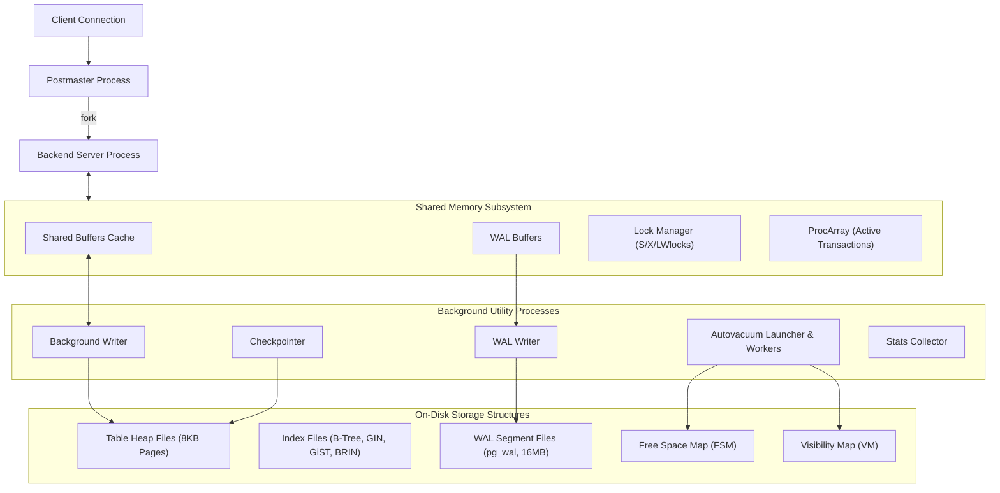

# PostgreSQL Architecture and Internals

## TL;DR

PostgreSQL is an advanced, open-source object-relational database management system engineered around an extensible, process-per-connection architecture coordinated by the Postmaster master process.
Unlike systems that use in-place updates with rollback undo logs, PostgreSQL implements Multi-Version Concurrency Control (MVCC) via an append-only tuple storage model directly in the heap.
Every row modification creates a new physical tuple stamped with transactional visibility identifiers (`xmin` and `xmax`).
Dead tuples are reclaimed asynchronously through background `VACUUM` and `autovacuum` workers to mitigate heap and index bloat and avoid 32-bit transaction ID wraparound failure.
Performance optimizations include Heap-Only Tuples (HOT) to prevent secondary index write amplification, Write-Ahead Logging (WAL) for crash recovery, and rich replication models spanning physical streaming replication to logical publish-subscribe replication.

## Mental Model

PostgreSQL coordinates multi-process client workloads through IPC shared memory, relying on a unified WAL stream to maintain crash safety across disk tablespaces.



## Architectural Internals and Deep Dive

### 1. The Process-Per-Connection Architecture
PostgreSQL does not use a multi-threaded server model; it uses a multi-process architecture rooted in the `postmaster` daemon.
When an incoming client connection arrives, the postmaster invokes `fork()` to spawn a dedicated backend worker process.
Inter-process communication and state synchronization are mediated through a shared memory segment:
- **Shared Buffers**: The primary in-memory cache holding 8KB table and index disk pages.
- **WAL Buffers**: Intermediate buffer holding unwritten write-ahead log records before disk flushing.
- **Lock Manager**: Shared hash table tracking table locks, row locks, advisory locks, and low-level synchronization latches (`LWLock`).
- **ProcArray**: Global array tracking all running transactions, their transaction IDs (`xid`), and their commit statuses.

Because each backend process allocates private memory for execution (`work_mem`, `maintenance_work_mem`, and `temp_buffers`), scaling to thousands of concurrent connections causes extreme memory pressure and context-switching overhead.
Production architectures therefore strictly mandate external connection pooling layers such as PgBouncer or Odyssey.

### 2. The Heap Tuple and MVCC Storage Engine
In PostgreSQL, tables are stored as unordered collections of 8KB disk blocks called heap files.
Inside each 8KB page, items are laid out with an ItemId pointer array growing from the page header forward, while raw tuple data grows from the end of the page backward.
Each row header (`HeapTupleHeaderData`) contains critical MVCC tracking metadata:
- `t_xmin`: The Transaction ID (XID) of the transaction that inserted the row.
- `t_xmax`: The Transaction ID of the transaction that updated or deleted the row. If the row is live and un-updated, `t_xmax` is `0`.
- `t_cid`: The Command ID within the transaction that created or modified the tuple.
- `t_ctid`: The tuple ID (`(block_number, offset)`) pointing to the current tuple or the updated version of this tuple elsewhere in the heap.
- `t_infomask`: Bit flags storing commit and abort states (e.g., `HEAP_XMIN_COMMITTED`, `HEAP_XMAX_INVALID`), bypassing expensive global transaction status lookups.

```
Page Header (PageHeaderData, 24 bytes)
ItemId[1] -> Pointer to Tuple 1
ItemId[2] -> Pointer to Tuple 2
... [Free Space] ...
Tuple 2: [Header: xmin=100, xmax=105, ctid=(0,3)] [Row Data]
Tuple 1: [Header: xmin=100, xmax=0,   ctid=(0,1)] [Row Data]
```

When an `UPDATE` executes, PostgreSQL does not modify the existing tuple in-place.
Instead, it marks `t_xmax` of the old tuple with the current transaction's XID and writes a completely new tuple into an available page with `t_xmin` set to the current XID.
The old tuple's `t_ctid` is updated to point directly to the physical location of the new tuple, creating a version chain.

### 3. Heap-Only Tuples (HOT) Optimization
Because an `UPDATE` generates a new physical row at a new `(block, offset)` location, all secondary indexes pointing to the row would normally require updating, creating severe index write amplification.
The Heap-Only Tuples (HOT) optimization eliminates this penalty under two conditions:
1. The update does not modify any column that is covered by an index on the table.
2. The page containing the old tuple has enough free space to accommodate the new tuple version.

When HOT applies:
- The new tuple is written into the identical 8KB page as the old tuple and marked with the `HEAP_ONLY_TUPLE` flag.
- The existing index pointers continue pointing strictly to the original tuple's ItemId.
- When an index scan reads the original ItemId, PostgreSQL follows the internal page chain to the HOT tuple automatically.
- During subsequent page reads, page pruning collapses the intermediate chain into an ItemId redirect without touching index structures.

### 4. VACUUM and Autovacuum Mechanics
Because updates and deletes leave historical dead tuples in the heap, tables accumulate dead space known as bloat.
The `VACUUM` process scans pages to reclaim this space:
1. **Dead Tuple Sweeping**: Reclaims dead tuples whose `t_xmax` precedes the oldest running transaction's snapshot.
2. **Visibility Map (VM) Updates**: Marks pages where all tuples are committed and visible to all current transactions. Queries can then perform Index-Only Scans, reading data directly from the index without inspecting the heap page.
3. **Free Space Map (FSM) Updates**: Records available byte capacity per page, allowing future inserts to locate partially filled pages rather than appending new blocks to the end of the file.

`VACUUM FULL` performs an exclusive table rewrite, copying live tuples into a fresh physical file to return space to the OS; however, it acquires an `AccessExclusiveLock`, completely blocking concurrent reads and writes.

### 5. Transaction ID (XID) Wraparound Catastrophe
PostgreSQL transaction IDs are 32-bit unsigned integers, providing $2^{32} \approx 4.29 \text{ billion}$ distinct transactions.
To compare whether transaction $A$ happened before transaction $B$, PostgreSQL uses modular circular arithmetic: any XID within the prior 2.14 billion values is in the past, and any XID within the next 2.14 billion values is in the future.
If a database runs past 2.14 billion transactions without freezing old tuples:
- Ancient committed tuples with old `t_xmin` values suddenly appear to be in the future.
- The database becomes unable to determine row visibility, causing historic data to become invisible or deleted from user queries.

To prevent this catastrophe, Autovacuum runs an aggressive Freeze process (`vacuum_freeze_min_age`):
- Tuples older than the freeze age have their `t_infomask` set to `HEAP_XMIN_FROZEN`.
- Frozen tuples are treated as permanently committed and older than all possible current or future transactions.
- If the system approaches `autovacuum_freeze_max_age` (default 200 million transactions before wraparound), PostgreSQL switches autovacuum into emergency failsafe mode, ignoring throttling limits, and eventually forces the server into read-only mode to prevent data corruption.

### 6. Write-Ahead Logging (WAL) and Checkpointing
Durability is governed by sequential append-only WAL records written to 16MB segment files in `$PGDATA/pg_wal`.
- **WAL Writer**: Periodically flushes WAL buffers to disk.
- **Checkpointer**: Periodically flushes all dirty shared buffer pages to disk and writes a checkpoint record to WAL.
Crash recovery starts at the last successful checkpoint and replays WAL forward, restoring page consistency.
PostgreSQL supports Full Page Writes (`full_page_writes=ON`): after each checkpoint, the first modification to an 8KB disk page logs the complete 8KB page image into WAL to protect against torn page corruption caused by OS power crashes.

### 7. Physical vs Logical Replication
- **Physical Streaming Replication**: Replays raw binary WAL records byte-for-byte from the primary to standby instances. Standbys must match the exact major version, operating system architecture, and page layouts. Standby instances are read-only (Hot Standby).
- **Logical Replication**: The primary uses a logical decoding output plugin to translate raw WAL into logical row mutation streams (Insert, Update, Delete) published over an internal replication slot. Subscribers can be different PostgreSQL versions, can filter rows, can run on different architectures, and can write local transactions alongside replicated streams.

## Trade-offs and Comparisons

| Dimension | PostgreSQL | MySQL (InnoDB) |
| :--- | :--- | :--- |
| **Concurrency Process Model** | Multi-process (fork per connection, requires PgBouncer) | Multi-threaded (one thread per connection) |
| **MVCC Implementation** | Append-only in-heap tuples (`xmin`/`xmax`); requires VACUUM | In-place update with separate Undo Log segments |
| **Write Amplification on Update** | High (creates new tuple; mitigated by HOT) | Low (in-place modification; updates undo log only) |
| **Storage Engine Architecture** | Integrated heap tables with independent indexes | Clustered B+ Tree primary index; secondary index bookmark lookups |
| **Index Types Supported** | B-Tree, Hash, GIN, GiST, SP-GiST, BRIN, Bloom | B+ Tree, Hash (Memory engine/AHI), Spatial (R-tree) |
| **Extensibility** | Pluggable types, functions, procedural languages, extensions (`pgvector`, PostGIS) | Pluggable storage engines, limited language extensions |
| **Transaction ID Limit** | 32-bit integer with mandatory freezing/wraparound vacuuming | 48-bit internal transaction IDs; no wraparound failure risk |

## Failure Modes and Mitigations

### 1. Connection Exhaustion and Memory Starvation
- *Root Cause*: Spikes in application traffic spawn hundreds or thousands of backend worker processes. Each process consumes dedicated RAM for buffers and connection overhead, exhausting OS file descriptors and triggering kernel OOM killer terminations.
- *Mitigation*: Deploy PgBouncer in transaction pooling mode directly in front of the database; set `max_connections` to a conservative value (typically $2 \times \text{CPU cores} + \text{Disk Spindles}$).

### 2. Transaction ID Wraparound Outage
- *Root Cause*: Long-running transactions or abandoned replication slots prevent autovacuum from advancing `relfrozenxid`. The database breaches `autovacuum_freeze_max_age`, ultimately shutting down active writes and forcing single-user emergency maintenance mode.
- *Mitigation*: Monitor `datfrozenxid` and `relfrozenxid` age continuously; tune `autovacuum_max_workers`, `autovacuum_vacuum_cost_limit`, and `vacuum_cost_page_hit` to ensure autovacuum runs fast enough; drop stale replication slots.

### 3. Autovacuum Lag and Table Bloat
- *Root Cause*: Default autovacuum settings are too conservative, throttled by aggressive `autovacuum_vacuum_cost_delay`. Tables experiencing thousands of writes per second accumulate dead tuples faster than vacuum can clean them.
- *Mitigation*: Reduce `autovacuum_vacuum_cost_delay` to 0 or 2ms; increase `autovacuum_vacuum_cost_limit` to 2000; configure table-specific autovacuum scale factors (`autovacuum_vacuum_scale_factor = 0.05`) on high-churn tables.

### 4. Query Slowdown from Missing Statistics
- *Root Cause*: Rapid ingestion of bulk data leaves optimizer statistics outdated, causing the cost-based query planner to choose sequential table scans over index scans.
- *Mitigation*: Execute explicit `ANALYZE` immediately following batch operations; verify `autovacuum_analyze_scale_factor` triggers timely statistical sampling.

## Hands-On Verification

### Multi-OS Diagnostic Commands

#### Linux (Ubuntu/Debian)
```bash
# Query active backend connections and states
sudo -u postgres psql -c "
SELECT 
    pid, usename, client_addr, state, wait_event_type, wait_event, query 
FROM pg_stat_activity 
WHERE state != 'idle';"

# Check database transaction ID wraparound distance
sudo -u postgres psql -c "
SELECT 
    datname, age(datfrozenxid), 2147483648 - age(datfrozenxid) AS tx_until_wraparound 
FROM pg_database 
ORDER BY age(datfrozenxid) DESC;"

# Inspect table bloat and live vs dead tuple ratios
sudo -u postgres psql -c "
SELECT 
    relname, n_live_tup, n_dead_tup, 
    round(100.0 * n_dead_tup / nullif(n_live_tup + n_dead_tup, 0), 2) AS dead_tup_pct,
    last_vacuum, last_autovacuum 
FROM pg_stat_user_tables 
ORDER BY n_dead_tup DESC LIMIT 5;"
```

#### macOS (Homebrew PostgreSQL)
```bash
# Verify running service and port
brew services list

# Connect and check buffer pool hit ratio
psql -d postgres -c "
SELECT 
    sum(heap_blks_read) AS heap_read,
    sum(heap_blks_hit)  AS heap_hit,
    round(sum(heap_blks_hit) / nullif(sum(heap_blks_hit) + sum(heap_blks_read), 0) * 100, 2) AS cache_hit_ratio
FROM pg_statio_user_tables;"

# Inspect replication slots and potential lag
psql -d postgres -c "SELECT slot_name, plugin, active, restart_lsn, pg_wal_lsn_diff(pg_current_wal_lsn(), restart_lsn) AS lag_bytes FROM pg_replication_slots;"
```

#### Windows (PowerShell)
```powershell
# Check PostgreSQL Windows Service
Get-Service -Name postgresql*

# Run query via psql to view shared memory and work_mem settings
psql -U postgres -c "SHOW shared_buffers; SHOW work_mem; SHOW max_connections;"
```

### Complete PostgreSQL MVCC and Autovacuum Simulation (Pure Python Standard Library)

The following standalone script implements a runnable, pure-Python simulation of PostgreSQL's in-heap tuple MVCC storage engine without external dependencies.
It models physical tuple creation with `xmin` and `xmax` header metadata, tuple chaining (`ctid`), point-in-time snapshot visibility evaluation, dead tuple accumulation, and an autovacuum reclamation routine that prunes dead versions while updating page visibility maps.

```python
"""
Simulated PostgreSQL MVCC and Heap Tuple Storage Engine
Executable without external dependencies using pure Python standard library.
Demonstrates:
1. Append-only in-heap tuple versioning stamped with xmin and xmax.
2. Snapshot visibility evaluation across concurrent transactions.
3. Dead tuple accumulation and autovacuum heap space reclamation.
"""

import time

class HeapTuple:
    """Simulates an 8KB page heap tuple with MVCC header fields."""
    def __init__(self, xmin: int, xmax: int, ctid: str, data: dict):
        self.xmin = xmin
        self.xmax = xmax
        self.ctid = ctid
        self.data = data

    def __repr__(self):
        return f"Tuple(ctid={self.ctid}, xmin={self.xmin}, xmax={self.xmax}, data={self.data})"

class SimulatedPostgreSQLStorageEngine:
    """Simulates heap file, shared buffer cache, and transaction visibility manager."""
    def __init__(self):
        self.current_xid = 500
        self.heap = []
        self.active_transactions = set()
        self.committed_transactions = set()
        self.page_counter = 0

    def begin_transaction(self) -> int:
        self.current_xid += 1
        xid = self.current_xid
        self.active_transactions.add(xid)
        return xid

    def commit_transaction(self, xid: int):
        if xid in self.active_transactions:
            self.active_transactions.remove(xid)
            self.committed_transactions.add(xid)

    def insert(self, xid: int, row_data: dict) -> str:
        self.page_counter += 1
        ctid = f"(0,{self.page_counter})"
        t = HeapTuple(xmin=xid, xmax=0, ctid=ctid, data=row_data)
        self.heap.append(t)
        return ctid

    def update(self, xid: int, target_id: int, new_balance: float) -> str:
        """PostgreSQL append-only update: stamps old tuple with xmax, appends new tuple."""
        for t in self.heap:
            if t.data.get("id") == target_id and t.xmax == 0:
                # Expire previous tuple
                t.xmax = xid
                # Append updated tuple
                self.page_counter += 1
                new_ctid = f"(0,{self.page_counter})"
                updated_data = dict(t.data)
                updated_data["balance"] = new_balance
                new_tuple = HeapTuple(xmin=xid, xmax=0, ctid=new_ctid, data=updated_data)
                self.heap.append(new_tuple)
                return new_ctid
        raise ValueError(f"Active row with id={target_id} not found")

    def create_snapshot(self, reader_xid: int) -> dict:
        """Captures SnapshotData: lowest active xmin, current xmax, and active xip array."""
        return {
            "snapshot_xmin": min(self.active_transactions) if self.active_transactions else self.current_xid,
            "snapshot_xmax": self.current_xid + 1,
            "active_xip": set(self.active_transactions),
            "reader_xid": reader_xid,
        }

    def scan_visible_tuples(self, snapshot: dict) -> list:
        """Evaluates tuple visibility against transaction snapshot."""
        visible = []
        for t in self.heap:
            # Check tuple creation (xmin)
            if t.xmin not in self.committed_transactions and t.xmin != snapshot["reader_xid"]:
                continue  # Uncommitted or running in another transaction

            # Check tuple deletion/update (xmax)
            if t.xmax != 0:
                if t.xmax in self.committed_transactions and t.xmax < snapshot["snapshot_xmax"]:
                    if t.xmax not in snapshot["active_xip"]:
                        continue  # Already updated/deleted and committed before snapshot

            visible.append(t)
        return visible

    def run_autovacuum(self, oldest_active_xmin: int) -> int:
        """Reclaims dead tuples whose xmax is older than any running snapshot."""
        initial_count = len(self.heap)
        retained = []
        reclaimed_count = 0
        for t in self.heap:
            if t.xmax != 0 and t.xmax in self.committed_transactions and t.xmax < oldest_active_xmin:
                reclaimed_count += 1
            else:
                retained.append(t)
        self.heap = retained
        return reclaimed_count

if __name__ == "__main__":
    print("[PostgreSQL Simulation] Initializing Heap Storage Engine...")
    engine = SimulatedPostgreSQLStorageEngine()

    # 1. Insert Initial Row under Tx 501
    tx1 = engine.begin_transaction()
    c1 = engine.insert(tx1, {"id": 1, "username": "alice", "balance": 100.0})
    engine.commit_transaction(tx1)
    print(f"[Insert] Tx {tx1} inserted Alice at {c1}.")

    # 2. Update Row under Tx 502
    tx2 = engine.begin_transaction()
    c2 = engine.update(tx2, target_id=1, new_balance=150.0)
    engine.commit_transaction(tx2)
    print(f"[Update 1] Tx {tx2} updated Alice to 150.0 at {c2}.")

    # 3. Update Row under Tx 503
    tx3 = engine.begin_transaction()
    c3 = engine.update(tx3, target_id=1, new_balance=200.0)
    engine.commit_transaction(tx3)
    print(f"[Update 2] Tx {tx3} updated Alice to 200.0 at {c3}.")

    print(f"[Heap State] Total physical tuples before VACUUM: {len(engine.heap)}")
    for t in engine.heap:
        print(f"  -> {t}")

    # 4. Reader Snapshot Scan
    reader_tx = engine.begin_transaction()
    snap = engine.create_snapshot(reader_tx)
    visible_rows = engine.scan_visible_tuples(snap)
    engine.commit_transaction(reader_tx)
    print(f"[Snapshot Scan] Visible rows: {[r.data for r in visible_rows]}")

    # 5. Execute Autovacuum
    oldest_active_xmin = engine.current_xid + 1
    reclaimed = engine.run_autovacuum(oldest_active_xmin)
    print(f"[Autovacuum] Reclaimed {reclaimed} dead tuple(s). Total physical tuples remaining: {len(engine.heap)}")
    print("[PostgreSQL Simulation] Complete: MVCC tuple lifecycle and autovacuum verified successfully.")
```

### Complete Tuple Header and MVCC Verification Script (Python with psycopg2)

The following runnable script connects to a live PostgreSQL server, creates a table, queries low-level `xmin`, `xmax`, and `ctid` system columns, and demonstrates physical tuple replacement and HOT updates.

```python
"""
PostgreSQL MVCC System Columns and HOT Update Verification Script
Prerequisites: pip install psycopg2-binary
Requires running PostgreSQL server with a database named 'test_db'.
"""

import psycopg2
import sys

DB_CONFIG = {
    "host": "localhost",
    "port": 5432,
    "user": "postgres",
    "password": "postgrespassword",
    "dbname": "test_db"
}

def run_mvcc_demo():
    try:
        conn = psycopg2.connect(**DB_CONFIG)
        conn.autocommit = False
        cur = conn.cursor()
        
        # Setup table with fillfactor to allow HOT updates
        cur.execute("DROP TABLE IF EXISTS accounts_mvcc_demo;")
        cur.execute("""
            CREATE TABLE accounts_mvcc_demo (
                id INT PRIMARY KEY,
                username VARCHAR(50),
                balance NUMERIC(10, 2)
            ) WITH (fillfactor = 70);
        """)
        conn.commit()
        print("[Setup] Created accounts_mvcc_demo table with fillfactor=70.")
        
        # 1. Insert Initial Row
        cur.execute("INSERT INTO accounts_mvcc_demo VALUES (1, 'alice', 100.00);")
        conn.commit()
        
        # Query internal system columns: xmin, xmax, ctid
        cur.execute("""
            SELECT id, username, balance, xmin, xmax, ctid 
            FROM accounts_mvcc_demo WHERE id = 1;
        """)
        row1 = cur.fetchone()
        print(f"[Insert] id={row1[0]}, balance={row1[2]} | xmin={row1[3]}, xmax={row1[4]}, ctid={row1[5]}")
        
        # 2. Update Row
        cur.execute("UPDATE accounts_mvcc_demo SET balance = 150.00 WHERE id = 1;")
        conn.commit()
        
        cur.execute("""
            SELECT id, username, balance, xmin, xmax, ctid 
            FROM accounts_mvcc_demo WHERE id = 1;
        """)
        row2 = cur.fetchone()
        print(f"[Update 1] id={row2[0]}, balance={row2[2]} | xmin={row2[3]}, xmax={row2[4]}, ctid={row2[5]}")
        print("Notice: xmin changed to current transaction ID, and ctid physical location advanced.")
        
        # 3. Inspect Dead Tuples via pg_stat_user_tables
        cur.execute("""
            SELECT relname, n_live_tup, n_dead_tup 
            FROM pg_stat_user_tables 
            WHERE relname = 'accounts_mvcc_demo';
        """)
        stats = cur.fetchone()
        print(f"[Stats Before Vacuum] Table={stats[0]}, Live={stats[1]}, Dead={stats[2]}")
        
        # 4. Trigger Vacuum
        conn.autocommit = True
        cur.execute("VACUUM accounts_mvcc_demo;")
        
        cur.execute("""
            SELECT relname, n_live_tup, n_dead_tup 
            FROM pg_stat_user_tables 
            WHERE relname = 'accounts_mvcc_demo';
        """)
        stats_after = cur.fetchone()
        print(f"[Stats After Vacuum] Table={stats_after[0]}, Live={stats_after[1]}, Dead={stats_after[2]}")
        
        cur.close()
        conn.close()
        print("[Verification Complete] PostgreSQL MVCC tuple lifecycles successfully verified.")
        
    except psycopg2.Error as err:
        print(f"[Notice] Live PostgreSQL database not accessible: {err}")
        print("[Notice] Refer to simulated pure-Python verification script above.")

if __name__ == "__main__":
    run_mvcc_demo()
```

## Performance Characteristics and Capacity Planning

### 1. Memory Sizing Rules of Thumb
- **Shared Buffers (`shared_buffers`)**: Allocate 25% of total system RAM for Linux systems. Setting this too high (e.g., >40%) degrades performance because it duplicates OS page cache caching and incurs double-buffering penalties during disk writes.
- **Effective Cache Size (`effective_cache_size`)**: Set to 50% - 75% of total system RAM. This does not allocate memory; it informs the query optimizer how much total cache (shared buffers + OS page cache) is available for index scans.
- **Work Memory (`work_mem`)**: Memory budget allocated per sort or hash operation per query:

$$\text{TotalWorkMemEstimate} = \text{max\_connections} \times \text{average\_parallel\_workers} \times \text{work\_mem}$$

Setting `work_mem` too high under high concurrency triggers out-of-memory kernel panics.

### 2. Transaction ID Burn Rate Math
If an application generates an average of 5,000 write transactions per second:

$$\text{XID Rate} = 5000 \text{ XIDs/sec} \times 86400 \text{ sec/day} = 432,000,000 \text{ XIDs/day}$$

- Time to burn through 2.14 billion XIDs:

$$\text{Days to Wraparound} \approx \frac{2,147,483,648}{432,000,000} \approx 4.97 \text{ days}$$

Under this throughput, autovacuum freeze settings must run continuously; any freeze worker stall will trigger catastrophic emergency shutdown within 5 days.

## In Production: Real-World Case Studies

### 1. Instagram's Sharded PostgreSQL Architecture
During its scaling to hundreds of millions of users, Instagram engineered a sharded PostgreSQL architecture rather than moving to NoSQL.
Key architectural decisions:
- **Logical Sharding**: Deployed thousands of logical database shards mapped across dozens of physical PostgreSQL server pairs.
- **Custom 64-Bit ID Generation**: Synthesized primary keys combining 41 bits of millisecond timestamp, 13 bits of logical shard ID, and 10 bits of auto-increment sequence. This eliminated central ID coordination bottlenecks while maintaining time-ordered indexing.
- **PgBouncer at Massive Scale**: Placed PgBouncer connection poolers on application server hosts to multiplex hundreds of thousands of Django web processes into manageable connection pools.

### 2. GitLab's Database Scalability and CI/CD Partitioning
GitLab relies on PostgreSQL as its core datastore.
Facing massive growth in CI/CD pipeline builds and job records:
- **Declarative Table Partitioning**: Range-partitioned massive tables (such as `ci_builds` and `ci_pipeline_chat_data`) by date and ID ranges, preventing single table heap files from exceeding hundreds of gigabytes.
- **Autovacuum Optimization**: Fine-tuned autovacuum cost limits and parallel vacuum workers to prevent vacuum starvation from locking background analytics pipelines.

## Staff+ Interview Questions

> [!question]
> How does PostgreSQL's MVCC implementation fundamentally differ from MySQL's InnoDB, and what are the operational trade-offs of PostgreSQL's approach?

> [!success]- Answer
> PostgreSQL uses an append-only in-heap tuple architecture where row modifications create a new physical tuple stamped with `xmin` and `xmax` in the table heap, while old versions remain in place until reclaimed.
> InnoDB uses an in-place update model where the current row is modified directly in the clustered B+ tree leaf, and previous row versions are written to separate undo log rollback segments.
> The operational trade-off is that PostgreSQL updates suffer from heap and index bloat, write amplification, and require ongoing background `VACUUM` maintenance and transaction ID freezing.
> However, PostgreSQL rollbacks are instantaneous ($O(1)$) because uncommitted tuples are simply left in the heap as aborted, whereas InnoDB rollbacks require traversing undo logs and reconstructing historical state.
> Furthermore, PostgreSQL's append-only model simplifies building pluggable secondary index types (GIN, GiST, BRIN).

> [!question]
> What is the Heap-Only Tuples (HOT) optimization, and under what exact technical conditions does it fail to trigger?

> [!success]- Answer
> The Heap-Only Tuples (HOT) optimization allows PostgreSQL to update a tuple without inserting new entries into secondary indexes.
> When HOT applies, the new row version is placed on the exact same 8KB disk page as the old row, and an internal pointer chain links them, allowing index scans to follow the chain.
> HOT fails to trigger under two conditions: (1) if the update modifies any column that is referenced by an index on that table, because the index must point to the new column key; or (2) if the 8KB disk page containing the old tuple does not have enough free space to hold the new tuple version.
> Developers configure table `fillfactor` (e.g., 70-80%) to reserve empty space in each page specifically to maximize HOT update success rates.

> [!question]
> Explain the 32-bit Transaction ID (XID) wraparound catastrophe in PostgreSQL. What does autovacuum do to prevent it, and what happens if the database breaches `autovacuum_freeze_max_age`?

> [!success]- Answer
> PostgreSQL represents XIDs as 32-bit unsigned integers, providing ~4.29 billion transaction IDs.
> Because transaction visibility uses modulo comparison, past transactions are defined as those within $2^{31}$ backwards.
> Without intervention, once 2.14 billion transactions elapse, historical committed rows would appear to be in the future, rendering them invisible (data loss).
> To prevent this, autovacuum runs aggressive freeze sweeps that set the `HEAP_XMIN_FROZEN` bit on tuples older than `vacuum_freeze_min_age`, treating them as permanently committed in the past.
> If freeze sweeps fall behind and a table's oldest unfrozen XID reaches `autovacuum_freeze_max_age` (default 200 million transactions before wraparound), PostgreSQL switches autovacuum into emergency failsafe mode, ignoring cost throttling.
> If the database reaches 3 million transactions before wraparound without resolving the freeze, it shuts down and enters read-only emergency single-user mode to prevent data corruption.

> [!question]
> Why is an external connection pooler like PgBouncer virtually mandatory in production PostgreSQL deployments, whereas MySQL often runs fine with hundreds of direct client threads?

> [!success]- Answer
> PostgreSQL implements a process-per-connection architecture where every client connection causes `postmaster` to `fork()` an independent OS backend process.
> Each process allocates dedicated memory (`work_mem`, connection state, cached plans) and incurs significant operating system scheduling and context-switching overhead.
> Managing 2,000 active connections in PostgreSQL can exhaust available memory and severely degrade CPU throughput due to cache thrashing and inter-process locking contention.
> MySQL InnoDB utilizes a multi-threaded architecture with lightweight thread pools, which handle concurrency with lower per-connection memory overhead.
> PgBouncer solves PostgreSQL's limitation by pooling thousands of application connections into a compact pool of persistent backend database processes using transaction or session pooling modes.

> [!question]
> What is an Index-Only Scan in PostgreSQL, and how does the Visibility Map enable it without reading the table heap?

> [!success]- Answer
> An Index-Only Scan satisfies a query entirely by reading index pages without fetching data from table heap pages.
> In standard indexes, tuples do not contain MVCC visibility metadata (`xmin`/`xmax`), meaning PostgreSQL would ordinarily need to visit the heap to verify whether the indexed tuple is visible to the current transaction.
> The Visibility Map (VM) solves this by maintaining two bits per heap page; one bit indicates whether all tuples on that page are committed and visible to all current and future transactions ("all-visible").
> When an Index-Only Scan checks an index entry, it inspects the VM for the corresponding heap page.
> If the page is marked all-visible, PostgreSQL returns the data directly from the index without reading the heap.
> If the bit is not set, it must perform a heap fetch to verify MVCC visibility.

> [!question]
> Compare Physical Streaming Replication with Logical Replication in PostgreSQL. When would you choose logical over physical?

> [!success]- Answer
> Physical Streaming Replication streams raw binary WAL records byte-for-byte to a standby instance.
> The standby is an exact byte-level replica, requires the identical PostgreSQL major version and CPU architecture, and is strictly read-only.
> Logical Replication decodes WAL records into logical data modification commands (INSERT, UPDATE, DELETE) using a publish-subscribe model.
> You choose Logical Replication when: (1) performing zero-downtime major version upgrades (e.g., streaming from PG 14 to PG 16); (2) replicating a subset of tables or specific columns rather than the entire cluster; (3) consolidating data from multiple departmental databases into a central analytics database; or (4) replicating between heterogeneous operating systems or hardware architectures.

> [!question]
> What is `full_page_writes` in PostgreSQL, why is it enabled by default, and how does it interact with the checkpointer?

> [!success]- Answer
> `full_page_writes` writes the entire 8KB page image into WAL the first time a page is modified after a checkpoint.
> It prevents torn page corruption: Linux file systems typically write in 4KB blocks, so a sudden power failure while writing an 8KB PostgreSQL page can leave the page partially written and corrupt.
> Since WAL records are physiological deltas that require a structurally sound base page, replay would fail on a torn page.
> With `full_page_writes=ON`, crash recovery restores the complete intact 8KB page from the WAL full-page image before replaying subsequent deltas.
> Subsequent modifications to the same page within the same checkpoint interval log only standard delta records, bounding WAL volume while guaranteeing crash recoverability.

> [!question]
> Under what circumstances would you choose a BRIN (Block Range Index) over a standard B-Tree index in PostgreSQL?

> [!success]- Answer
> BRIN (Block Range Index) is designed for massive tables (hundreds of gigabytes or terabytes) where data is naturally correlated with its physical insertion order on disk, such as time-series data, append-only logs, or monotonic sequential IDs.
> Instead of indexing every row, BRIN stores only the minimum and maximum values for a range of disk blocks (default 128 pages = 1MB).
> While a B-Tree index on a billion rows might consume hundreds of gigabytes of RAM and disk, a BRIN index for the same data consumes mere megabytes.
> If queries filter by date ranges on append-only tables, BRIN provides near-instant range filtering with negligible index maintenance overhead and minimal cache footprint.

> [!question]
> How does PostgreSQL's Multi-Version Concurrency Control (MVCC) cause secondary index write amplification during row updates, and how does the Heap-Only Tuple (HOT) optimization eliminate it?

> [!success]- Answer
> In PostgreSQL, secondary indexes point to physical heap tuple identifiers (`ctid` = `(block_number, offset)`).
> When an `UPDATE` executes without the Heap-Only Tuple (HOT) optimization, PostgreSQL creates a new tuple at a different `ctid` location in the heap, requiring an update to every single secondary index on that table to insert a new entry pointing to the new `ctid`, even for indexes on columns that were untouched by the query.
> On a table with 10 indexes, updating a single non-indexed timestamp column triggers 10 separate index insertions, saturating the write-ahead log (WAL) and memory buffers with write amplification.
> The HOT optimization eliminates this write amplification when two conditions are met: (1) no indexed column is modified by the update, and (2) the current 8KB heap block has enough free space to accommodate the new tuple.
> Under HOT, PostgreSQL places the new tuple on the identical 8KB page and links the old tuple directly to the new tuple via an internal pointer chain.
> The existing secondary index entries continue pointing strictly to the original `ctid`; during index scans, the executor reads the original heap tuple and transparently follows the HOT chain to the latest visible version, requiring zero secondary index insertions.

> [!question]
> How do transaction snapshots differ across PostgreSQL isolation levels (`Read Committed`, `Repeatable Read`, and `Serializable`), and how does Serializable Snapshot Isolation (SSI) prevent write skew anomalies without lock blocking?

> [!success]- Answer
> Transaction visibility in PostgreSQL is governed by a Snapshot (`pg_snapshot` / `SnapshotData`) recording `xmin` (lowest active transaction ID), `xmax` (highest completed transaction ID + 1), and an active transaction list `xip`.
> Under `Read Committed`, PostgreSQL takes a fresh snapshot at the start of every individual SQL statement, allowing the transaction to observe mutations committed by concurrent transactions between statements within the same transaction.
> Under `Repeatable Read`, PostgreSQL takes a single snapshot at the start of the first query in the transaction and preserves it for the entire transaction duration, guaranteeing that subsequent queries observe an identical point-in-time state.
> Under `Serializable`, PostgreSQL uses Serializable Snapshot Isolation (SSI) based on the Cahill, Rohm, and Fekete algorithm.
> Rather than acquiring blocking shared or exclusive row locks that serialize execution and trigger deadlocks, SSI operates optimistically: transactions execute concurrently using standard snapshot isolation, while background tracking records data read dependencies using non-blocking in-memory `SIREAD` locks.
> PostgreSQL constructs a dependency serialization graph and monitors for "rw-antidependencies" (dangerous structures where Transaction A reads data that Transaction B later modifies, and Transaction B reads data that Transaction A modifies).
> If a cycle in the dependency graph is detected, PostgreSQL aborts the latest committer with a `40001 serialization_failure` error, guaranteeing strict serializability without table locks.

## Related Concepts and Wikilinks

- [[MySQL-and-InnoDB]] - Detailed architectural contrast with MySQL's clustered index and undo log model.
- [[ACID-vs-BASE]] - Relational database ACID guarantees and write-ahead logging principles.
- [[Optimistic-vs-Pessimistic-Locking]] - Row-level locking, explicit locks (`FOR UPDATE`), and MVCC isolation.
- [[Partitioning-and-Sharding]] - Declarative range and hash partitioning in PostgreSQL.
- [[Consistency-Models]] - Standby read consistency under synchronous and asynchronous streaming replication.
- [[RDBMS-vs-NoSQL]] - Storage engine trade-offs for relational versus document and columnar stores.

## Further Reading and References

- Suzuki, Hironobu. *The Internals of PostgreSQL for Database Administrators and System Developers*. Open Access Technical Reference, 2023.
- PostgreSQL Global Development Group. *PostgreSQL 16 Documentation: Chapter 54 - Overview of PostgreSQL Internals*.
- Kleppmann, Martin. *Designing Data-Intensive Applications*. O'Reilly Media, 2017. Chapter 3: Storage and Retrieval.
- Stonebraker, Michael, and Lawrence A. Rowe. "The Design of Postgres." *ACM SIGMOD Record*, 1986.
- GitLab Infrastructure Team. "PostgreSQL at Scale: How GitLab Handles High Database Load." GitLab Engineering Blog, 2022.

