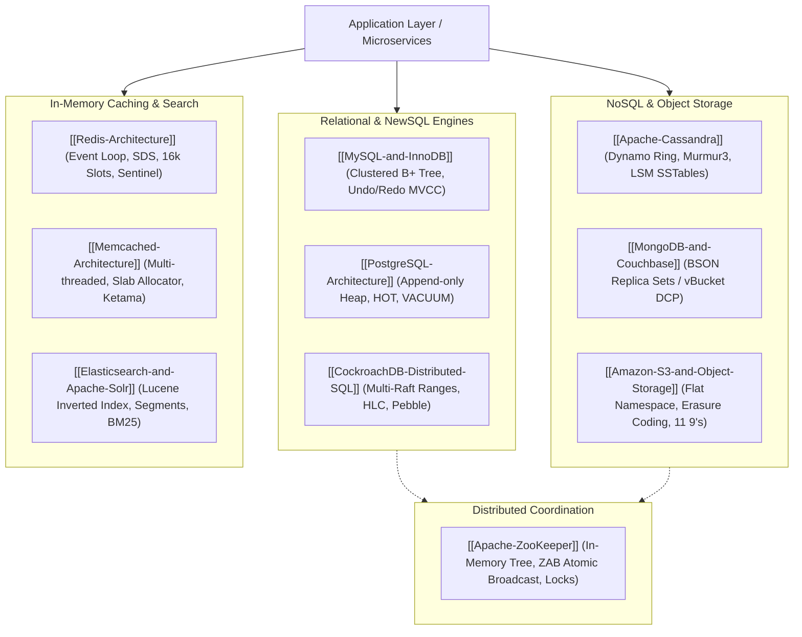

# Distributed Data Stores and Storage Engines

## Map of Content

Data persistence in distributed systems spans distinct engineering trade-offs across relational transactional guarantees, distributed NewSQL consensus, wide-column and document stores, in-memory volatile caches, inverted search indexes, immutable object stores, and consensus coordination engines.
This module covers storage internals, replication topologies, write-ahead logging protocols, memory caching models, and failover mechanics across foundational persistence technologies.

## Core Knowledge Areas

### 1. Relational and Distributed NewSQL Stores
- [[MySQL-and-InnoDB]]: Pluggable storage architecture, InnoDB clustered B+ tree index, doublewrite buffer, undo/redo logs, next-key locking, and binlog replication topologies.
- [[PostgreSQL-Architecture]]: Postmaster process-per-connection model, shared buffers, append-only in-heap tuple MVCC, Heap-Only Tuples (HOT), autovacuum mechanics, transaction ID wraparound prevention, and WAL streaming replication.
- [[CockroachDB-Distributed-SQL]]: Distributed NewSQL architecture, ordered key-value mapping, 64MB Range splitting, Multi-Raft consensus, Range Leaseholders, Hybrid Logical Clocks (HLC), and distributed parallel commit serializability.

### 2. NoSQL and Document Stores
- [[Apache-Cassandra]]: Masterless Dynamo peer-to-peer ring topology, Murmur3 partitioning, vnodes, gossip protocol, LSM-Tree storage (CommitLog, MemTable, SSTables), Bloom filters, tunable consistency ($R+W>N$), and tombstone lifecycles.
- [[MongoDB-and-Couchbase]]: Comparative document storage deep dive covering MongoDB BSON models, WiredTiger B-tree engine, replica sets, `mongos` sharded chunk routing, Couchbase 1,024 fixed vBuckets, Smart Client routing, and in-memory Database Change Protocol (DCP) replication.

### 3. In-Memory Caching Systems
- [[Redis-Architecture]]: Single-threaded event loop execution with non-blocking I/O multiplexing (`epoll`), internal data structures (SDS, quicklists, skiplists, HyperLogLogs), RDB/AOF persistence, Sentinel automated failover, and Redis Cluster 16,384 hash slots.
- [[Memcached-Architecture]]: Multi-threaded `libevent` worker pool architecture, slab allocation engine, chunk size growth factors, slab calcification mitigation, segmented LRU eviction, and client-side Ketama consistent hashing.

### 4. Search and Analytics Engines
- [[Elasticsearch-and-Apache-Solr]]: Apache Lucene core foundations, inverted index construction, Finite State Transducers (FST), postings list compression, immutable disk segments, Near-Real-Time (NRT) refresh vs flush, BM25 relevance ranking, and two-phase Query-Then-Fetch search execution.

### 5. Object Storage and Blob Systems
- [[Amazon-S3-and-Object-Storage]]: Flat namespace object storage, object immutability, strong read-after-write consistency, prefix-based automated partition scaling, multipart uploads, multi-AZ erasure coding for 11 9's durability, and presigned URLs.

### 6. Distributed Coordination Primitives
- [[Apache-ZooKeeper]]: Hierarchical in-memory znode tree, ZAB (ZooKeeper Atomic Broadcast) protocol, Fast Leader Election, reactive Watcher event delivery, and herd-free distributed locking recipes.

## Storage Engine Architecture Matrix

| System | Primary Data Structure | Mutability on Disk | Concurrency Model | High Availability & Consensus | Primary Use Case |
| :--- | :--- | :--- | :--- | :--- | :--- |
| **MySQL (InnoDB)** | Clustered B+ Tree | In-place page updates via WAL & Doublewrite | MVCC (Undo log) + Row/Gap Locks | Semi-sync replication / Group Replication | Core OLTP transactional records |
| **PostgreSQL** | Heap Pages + B-Tree / GIN Indexes | Append-only tuple versions in heap | MVCC (Heap tuple visibility) + Table locks | Streaming Physical WAL Replication | Relational workloads, geospatial, extensibility |
| **CockroachDB** | Pebble LSM-Tree per Range | Append-only SSTables per Range | Distributed MVCC + Write Intents | Multi-Raft per Range + Range Leases | Global multi-region distributed SQL |
| **Apache Cassandra** | LSM-Tree (MemTable + SSTables) | Append-only immutable SSTables | Last-Write-Wins (LWW) timestamps | Masterless Quorum Consensus ($R+W>N$) | High-throughput write ingestion, time-series |
| **MongoDB** | WiredTiger B-Tree | In-place checkpointing via Journal | MVCC (Hazard pointers & tickets) | Raft-style Replica Set Elections | Rapid prototyping, semi-structured documents |
| **Redis** | In-Memory Hash Table / SkipLists | In-memory; optional RDB/AOF append | Single-threaded atomic event loop | Redis Sentinel / Cluster Gossip | High-throughput low-latency caching, sessions |
| **Memcached** | Slab Allocation Memory Chunks | In-memory only (Volatile) | Multi-threaded worker pool + Bucket locks | None (Client-side Ketama hashing) | Raw high-concurrency string/blob caching |
| **Elasticsearch** | Lucene Inverted Index + Doc Values | Immutable Lucene segments | Non-blocking NRT segment readers | Native Master-Node Raft Consensus | Full-text search, logging, ELK analytics |
| **Amazon S3** | Flat Key Index + Erasure Coded Blobs | Immutable binary blobs | Strong Read-After-Write Consistency | Multi-AZ Erasure Coding (11 9's) | Unstructured media, backups, data lakes |
| **Apache ZooKeeper**| In-Memory Znode Tree | In-memory; disk WAL and snapshots | Sequentially consistent primary broadcast | ZAB Atomic Broadcast (Quorum $2F+1$) | Cluster metadata, leader election, locking |

## Study and Interview Roadmap

1. Master the trade-offs between B-Tree storage engines (in-place writes, $O(\log N)$ reads, high write amplification) and LSM-Tree engines (append-only writes, background compactions, multi-SSTable reads).
2. Deeply understand MVCC implementation differences: InnoDB's undo log rollback segments versus PostgreSQL's in-heap `xmin`/`xmax` tuple versioning.
3. Be prepared to design distributed cache layers combining Redis/Memcached with relational databases, addressing cache invalidation, thundering herds, and cache stampedes.
4. Understand when to select distributed NewSQL (CockroachDB) versus sharded NoSQL (Cassandra/MongoDB) for global multi-region deployments.
