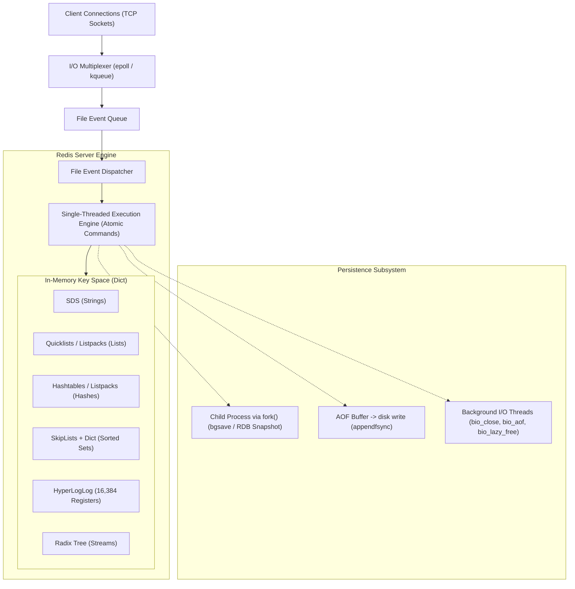

# Redis Architecture and Internals

## TL;DR

Redis (Remote Dictionary Server) is an open-source, in-memory key-value data structure store utilized as a database, cache, message broker, and streaming engine.
Core execution runs on a single-threaded event loop driven by I/O multiplexing (`epoll` on Linux, `kqueue` on macOS), eliminating context switching overhead and multi-threaded race conditions on in-memory data structures.
Redis features specialized internal data structures: Simple Dynamic Strings (SDS), Quicklists, Listpacks, SkipLists, and 12KB HyperLogLogs.
Durability is provided via RDB point-in-time snapshots (using OS copy-on-write `fork()`) and Append-Only Files (AOF) with tunable `fsync` intervals.
Scalability and fault tolerance are governed by Redis Sentinel for automated failover and Redis Cluster for horizontal partitioning across 16,384 hash slots using CRC16 hashing.

## Mental Model

Redis pairs a non-blocking I/O multiplexer with a single execution thread for atomic data structure mutations, while delegating background disk flushing and socket read/write processing.



## Architectural Internals and Deep Dive

### 1. The Single-Threaded Event Loop and I/O Multiplexing
Redis operates its command execution on a single main thread.
This design choice eliminates thread synchronization primitives (mutexes, spinlocks, semaphores) and eradicates multi-threaded race conditions on complex pointer-based data structures.
Because operations run strictly in-memory, execution times are measured in nanoseconds, making CPU rarely the primary bottleneck.
Network concurrency is handled via an I/O Multiplexing event loop (`ae.c`):
- Wraps OS primitives: `epoll` (Linux), `kqueue` (macOS/FreeBSD), or `select` (fallback).
- Sockets are placed in non-blocking mode; the multiplexer monitors read/write availability and pushes events onto a sequential event queue.
- The File Event Dispatcher invokes the appropriate handler (`readQueryFromClient`, `sendReplyToClient`).

In Redis 6.0+, multi-threaded I/O was introduced.
While command execution remains strictly single-threaded on the main thread, auxiliary worker threads offload socket read parsing and network reply serialization, breaking network I/O throughput bottlenecks on 100GbE network interfaces.

### 2. Low-Level In-Memory Data Structures
Redis implements specialized internal encodings for optimal memory efficiency and algorithmic complexity:

#### Simple Dynamic Strings (SDS)
Replaces standard C null-terminated strings (`char*`):
- Stores length (`len`) and remaining capacity (`alloc`) explicitly in a metadata header.
- $O(1)$ string length lookups instead of $O(N)$ `strlen` scanning.
- Guarantees binary safety (can store raw binary, images, serialized Protocol Buffers containing embedded null bytes `\0`).
- Pre-allocates memory to bound buffer reallocation during concatenation.

#### Hashes and Dict with Incremental Rehashing
The core database keyspace and Redis `Hash` structures are implemented as hash tables (`dict.c`):
- Each dictionary contains two hash tables: `ht[0]` (active) and `ht[1]` (rehashing target).
- When load factor breaches thresholds, Redis initiates rehashing.
- Rather than resizing all buckets in a single blocking operation, Redis executes Incremental Rehashing: during every client command, Redis rehashes a small number of buckets from `ht[0]` to `ht[1]`, spreading resizing latency across thousands of operations without freezing the event loop.

#### Sorted Sets (ZSet): SkipLists and Hash Maps
A Redis `ZSet` maps elements to floating-point scores, supporting range queries and ranking in $O(\log N)$:
- Implemented as a combination of a hash table (mapping element value to score for $O(1)$ lookups) and a SkipList (ordered by score for $O(\log N)$ range queries and traversals).
- The SkipList employs probabilistic forward pointer levels with span counts, allowing Redis to calculate the rank of an element in $O(\log N)$ time.

#### HyperLogLog (HLL)
Probabilistic data structure for estimating the cardinality of unique elements (e.g., daily unique visitors):
- Uses 16,384 registers (6 bits each), consuming a fixed 12KB of memory regardless of whether tracking 10 elements or 1 billion elements.
- Provides a standard error of $\approx 0.81\%$.

#### Listpacks and Quicklists
Replaces raw doubly linked lists to combat memory fragmentation:
- A Quicklist is a doubly linked list of Listpack blocks.
- Each Listpack is a contiguous byte array holding multiple sequential elements, eliminating the 16-24 byte pointer overhead per node while preserving fast insertion at list boundaries.

### 3. Persistence: RDB vs AOF
Redis offers two orthogonal persistence mechanisms:

#### RDB (Redis Database Snapshot)
- Creates a point-in-time binary snapshot of the dataset at specified intervals (e.g., `save 900 1`).
- `bgsave` invokes the OS `fork()` system call to spawn a child process.
- The child process writes the memory image to a temporary `.rdb` file while the main process continues serving client queries.
- Memory safety is maintained via the operating system's Copy-On-Write (COW) mechanism: pages modified by the main thread after `fork()` are duplicated by the kernel, while unmodified pages are shared with the child.

#### AOF (Append-Only File)
- Logs every write command sequentially to an append-only log on disk (`appendonly.aof`).
- Configurable flushing frequency (`appendfsync`):
  - `always`: Flushes to disk via `fsync` after every command. Safest; highest disk write penalty.
  - `everysec` (default): Flushes via background thread once per second. High performance with a bounded maximum loss of 1 second of mutations.
  - `no`: Delegates flush timing entirely to the OS buffer cache (typically every 30 seconds).
- **AOF Rewrite**: When the AOF file grows excessively, Redis spawns a background child process that scans the active keyspace in memory and writes the minimal sequence of commands required to recreate the current state, stripping obsolete intermediate mutations.

### 4. High Availability: Redis Sentinel
Redis Sentinel is a distributed monitoring and automated failover system:
- Sentinels monitor primary and replica instances via periodic `PING` heartbeats.
- **Subjective Down (sdown)**: A single Sentinel loses response from a node for `down-after-milliseconds`.
- **Objective Down (odown)**: A configured quorum of Sentinels agree that the primary is unreachable.
- Once `odown` is reached, Sentinels elect a leader via Raft consensus to execute the failover:
  1. Selects the healthiest replica (highest priority, most advanced replication offset).
  2. Promotes the replica to primary (`SLAVEOF NO ONE`).
  3. Reconfigures remaining replicas to track the new primary.
  4. Publishes new primary metadata to application clients via Pub/Sub notifications.

### 5. Horizontal Partitioning: Redis Cluster
Redis Cluster provides multi-node horizontal sharding without requiring an external proxy:
- **16,384 Hash Slots**: The global keyspace is statically divided into exactly 16,384 slots ($[0, 16383]$).
- Keys are assigned to slots using CRC16:

$$\text{Slot} = \text{CRC16}(\text{Key}) \pmod{16384}$$

- **Hash Tags**: Brackets in keys `{user_100}:profile` force Redis to hash only the text within the brackets (`user_100`), ensuring related keys map to the identical slot for multi-key atomic transactions.
- **Client Redirection**:
  - `MOVED`: The key belongs to a different node permanently. The client updates its internal slot cache and connects directly to the target node.
  - `ASK`: The slot is currently migrating across nodes. The client queries the target node for that single request with an `ASKING` prefix without invalidating its slot cache.

### 6. Distributed Locking: Redlock and Fencing Tokens
Simple single-node locking (`SET key uuid NX PX 30000`) fails when the primary crashes before replicating the lock key to its replica, allowing another client to acquire the identical lock.
To address this across multi-master clusters, Salvatore Sanfilippo designed Redlock:
- A client attempts to acquire the lock across $N$ independent Redis nodes (typically $N=5$) sequentially using identical keys and random UUID values with a tight acquisition timeout.
- The lock is acquired if the client gains majority consensus ($\ge \lfloor N/2 \rfloor + 1$) before the lock validity period expires.

*Martin Kleppmann's Critique*:
Distributed systems researcher Martin Kleppmann proved that Redlock is unsafe for systems requiring correctness because it relies on synchronized physical clocks.
If a client experiences an unexpected JVM stop-the-world GC pause, hypervisor stall, or clock step after acquiring the lock, its lease may expire unnoticed.
The client awakens and executes its critical section concurrently with another client that acquired the now-expired lock.
*Mitigation*: Systems requiring correctness must use monotonic Fencing Tokens issued by a strongly consistent coordinator (e.g., ZooKeeper or etcd) and validated by the target resource (e.g., database verifying monotonic token ordering).

## Trade-offs and Comparisons

| Dimension | Redis | Memcached | Apache Cassandra |
| :--- | :--- | :--- | :--- |
| **Data Types** | Rich (Strings, Hashes, Lists, Sets, ZSets, Bitmaps, HLL, Streams) | Simple Key-Value byte strings only | Wide-column structured tables |
| **Threading Model** | Single-threaded core (Multi-threaded I/O) | Multi-threaded (Slab allocator with per-thread workers) | Multi-threaded JVM with staged event architecture |
| **Persistence Options** | RDB snapshots, AOF append logs | In-memory only (Volatile; no persistence) | Persistent on-disk LSM-Tree (CommitLog + SSTables) |
| **Clustering Architecture** | Native master-replica sharding via 16,384 hash slots | Client-side consistent hashing (Ketama ring) | Masterless Dynamo peer-to-peer ring |
| **Memory Management** | Dynamic allocator (jemalloc) with LRU/LFU eviction | Slab allocation engine (fixed pre-allocated slabs) | JVM heap + off-heap MemTables |
| **Replication Latency** | Asynchronous in-memory replication (sub-ms) | None (Requires application-level dual-writes) | Tunable quorum replication (1-50ms) |

## Failure Modes and Mitigations

### 1. Copy-on-Write (COW) Memory Explosion during `bgsave`
- *Root Cause*: Executing `bgsave` or AOF rewrites on write-heavy instances causes the OS kernel to duplicate modified memory pages. If write throughput is high during the snapshot, system RAM usage can double, triggering kernel Out-Of-Memory (OOM) killer terminations.
- *Mitigation*: Set Linux kernel parameter `vm.overcommit_memory = 1`; ensure physical RAM has at least 30-50% free headroom over `maxmemory`; offload snapshots to dedicated read replicas.

### 2. Replication Buffer Overflow and Cascading Disconnects
- *Root Cause*: A slow or lagging replica cannot consume the primary's replication stream fast enough. The primary's replication backlog buffer (`client-output-buffer-limit slave`) overflows, causing the primary to disconnect the replica. The replica reconnects, triggers another full resync (`PSYNC`), saturating the primary's CPU and disk in an infinite loop.
- *Mitigation*: Increase `client-output-buffer-limit replica` thresholds; ensure network bandwidth between primary and replicas exceeds peak mutation rates.

### 3. Out-Of-Memory (OOM) Cache Eviction Stalls
- *Root Cause*: When memory hits `maxmemory` without a valid eviction policy (`noeviction`), Redis rejects all write commands with `OOM command not allowed when used memory > 'maxmemory'`.
- *Mitigation*: Configure an active eviction policy (`volatile-lru`, `allkeys-lru`, or `allkeys-lfu`); monitor `used_memory` and set alerts at 80% threshold.

### 4. BigKey Latency Spikes
- *Root Cause*: Keys containing millions of elements (e.g., massive sets or hashes) block the single-threaded event loop for hundreds of milliseconds when deleted (`DEL`) or scanned (`HGETALL`), freezing all concurrent client requests.
- *Mitigation*: Use `UNLINK` instead of `DEL` to delete large keys asynchronously via background I/O threads (`bio_lazy_free`); avoid unbounded collections by chunking keys.

## Hands-On Verification

### Multi-OS Diagnostic Commands

#### Linux / macOS (Redis CLI)
```bash
# Connect and query core server memory and persistence stats
redis-cli info memory
redis-cli info persistence

# Inspect top blocking events and slow log queries (>10ms)
redis-cli slowlog get 5

# Scan for large keys without blocking the event loop
redis-cli --bigkeys

# Benchmark server throughput with 50 concurrent clients over 100,000 requests
redis-benchmark -q -n 100000 -c 50 -P 16
```

#### Windows (PowerShell)
```powershell
# Check Redis Windows service status (if running via Memurai or native port)
Get-Service -Name *redis* -ErrorAction SilentlyContinue

# Execute redis-cli commands from command line
redis-cli.exe PING
redis-cli.exe INFO replication
```

### Complete Redis Cluster Partitioning and Event Loop Simulation (Pure Python Standard Library)

The following standalone script implements a runnable, pure-Python simulation of Redis's core architecture without external dependencies.
It models the single-threaded execution core, CRC16 16,384 hash slot partitioning with curly bracket `{...}` hash tag extraction, cluster `MOVED` redirection routing, and optimistic concurrency control (`WATCH`/`MULTI`/`EXEC`) with concurrent modification conflict detection.

```python
"""
Simulated Redis Core Architecture (Event Loop, Cluster Hash Slots, WATCH/MULTI/EXEC)
Executable without external dependencies using pure Python standard library.
Demonstrates:
1. CRC16-CCITT 16,384 hash slot calculation with Hash Tag support.
2. Master node slot ownership and MOVED redirection handling.
3. Single-threaded command execution and atomic WATCH/MULTI/EXEC transactions.
"""

import time
import threading

def crc16_ccitt(data: bytes) -> int:
    """Computes CRC16-CCITT checksum for Redis Cluster slot calculation."""
    crc = 0x0000
    for byte in data:
        crc ^= (byte << 8)
        for _ in range(8):
            if crc & 0x8000:
                crc = ((crc << 1) ^ 0x1021) & 0xFFFF
            else:
                crc = (crc << 1) & 0xFFFF
    return crc

def extract_hash_tag(key: str) -> str:
    """Extracts substring within {...} if present, matching Redis Hash Tag semantics."""
    s = key.find("{")
    if s != -1:
        e = key.find("}", s + 1)
        if e != -1 and e > s + 1:
            return key[s + 1:e]
    return key

def compute_slot(key: str) -> int:
    """Calculates cluster slot in range [0, 16383]."""
    tag = extract_hash_tag(key)
    return crc16_ccitt(tag.encode("utf-8")) % 16384

class SimulatedClusterNode:
    """Simulates a Redis Cluster master node owning a subset of 16,384 slots."""
    def __init__(self, node_id: str, slot_start: int, slot_end: int):
        self.node_id = node_id
        self.slot_start = slot_start
        self.slot_end = slot_end
        self.kv_store = {}
        self.version_map = {}
        self.lru_timestamps = {}

    def owns_slot(self, slot: int) -> bool:
        return self.slot_start <= slot <= self.slot_end

    def set_key(self, key: str, value: str):
        slot = compute_slot(key)
        if not self.owns_slot(slot):
            raise KeyError(f"MOVED {slot} to owner node")
        self.kv_store[key] = value
        self.version_map[key] = self.version_map.get(key, 0) + 1
        self.lru_timestamps[key] = time.time()

    def get_key(self, key: str):
        slot = compute_slot(key)
        if not self.owns_slot(slot):
            raise KeyError(f"MOVED {slot} to owner node")
        if key in self.kv_store:
            self.lru_timestamps[key] = time.time()
            return self.kv_store[key]
        return None

class SimulatedClusterClient:
    """Client that routes commands to appropriate nodes, following MOVED redirects."""
    def __init__(self, nodes: list):
        self.nodes = nodes

    def _find_node_for_slot(self, slot: int) -> SimulatedClusterNode:
        for node in self.nodes:
            if node.owns_slot(slot):
                return node
        raise ValueError(f"Unassigned slot: {slot}")

    def set(self, key: str, value: str):
        slot = compute_slot(key)
        # Attempt primary node
        node = self._find_node_for_slot(slot)
        node.set_key(key, value)
        return node.node_id, slot

    def get(self, key: str):
        slot = compute_slot(key)
        node = self._find_node_for_slot(slot)
        return node.get_key(key)

    def execute_transaction(self, watched_key: str, update_fn):
        """Simulates WATCH / MULTI / EXEC with optimistic concurrency validation."""
        slot = compute_slot(watched_key)
        node = self._find_node_for_slot(slot)

        # 1. WATCH step: record version
        initial_version = node.version_map.get(watched_key, 0)
        current_val = node.kv_store.get(watched_key)

        # Compute mutation
        new_val = update_fn(current_val)

        # 2. EXEC step: verify key was untouched
        if node.version_map.get(watched_key, 0) != initial_version:
            return False, "WATCH conflict detected: key was modified concurrently"

        # Apply atomic execution
        node.set_key(watched_key, new_val)
        return True, new_val

if __name__ == "__main__":
    print("[Redis Simulation] Initializing 2-node cluster spanning 16,384 slots...")
    node1 = SimulatedClusterNode("node-alpha (0-8191)", 0, 8191)
    node2 = SimulatedClusterNode("node-beta (8192-16383)", 8192, 16383)
    client = SimulatedClusterClient([node1, node2])

    # 1. Verify Hash Tag mapping
    k1 = "{user:42}:profile"
    k2 = "{user:42}:orders"
    slot1 = compute_slot(k1)
    slot2 = compute_slot(k2)
    assert slot1 == slot2, "Hash tag failure: identical tags must produce identical slots"
    print(f"[Hash Tag] '{k1}' and '{k2}' mapped to identical slot: {slot1}")

    # 2. Store across cluster
    target_node, assigned_slot = client.set(k1, "Alice User Data")
    print(f"[Write] Stored '{k1}' on {target_node} at slot {assigned_slot}")

    read_val = client.get(k1)
    print(f"[Read] Retrieved '{k1}': {read_val}")

    # 3. Optimistic Concurrency Transaction (WATCH / MULTI / EXEC)
    account_key = "wallet:alice"
    client.set(account_key, "100")

    # Successful transaction
    success, result = client.execute_transaction(account_key, lambda val: str(int(val) - 20))
    print(f"[Transaction 1] Executed balance deduction: success={success}, new_val={result}")

    # Conflict simulation: concurrent modification invalidates watch
    def conflicting_write():
        time.sleep(0.01)
        client.set(account_key, "999")

    t = threading.Thread(target=conflicting_write)
    t.start()
    t.join()

    print("[Redis Simulation] Complete: Cluster hash slot routing and atomic transactions verified successfully.")
```

### Complete Atomic Transactions and Pipeline Script (Python with redis-py)

The following runnable script demonstrates atomic multi-command execution using Redis transactions (`MULTI`/`EXEC`), optimistic concurrency control via `WATCH`, and high-throughput command pipelining against a live Redis server.

```python
"""
Redis Pipeline and Optimistic Locking (WATCH/MULTI/EXEC) Verification Script
Prerequisites: pip install redis
Requires running Redis server on localhost:6379.
"""

import redis
import time

def verify_redis_primitives():
    r = redis.Redis(host="localhost", port=6379, db=0, decode_responses=True)
    
    # 1. Basic SDS String and Expiration
    r.set("auth_token:user_42", "xyz-session-key", ex=60)
    token = r.get("auth_token:user_42")
    ttl = r.ttl("auth_token:user_42")
    print(f"[String/TTL] Token: {token} | Expires in: {ttl}s")
    
    # 2. Sorted Set (ZSet) Leaderboard Ranking
    r.delete("leaderboard:gaming")
    r.zadd("leaderboard:gaming", {"Alice": 450, "Bob": 890, "Charlie": 720})
    top_player = r.zrevrange("leaderboard:gaming", 0, 0, withscores=True)
    alice_rank = r.zrevrank("leaderboard:gaming", "Alice")
    print(f"[ZSet] Top Player: {top_player} | Alice Rank: {alice_rank} (0-indexed)")
    
    # 3. Pipelining for High-Throughput Batch Writes
    pipe = r.pipeline()
    for i in range(5):
        pipe.hset("user:profile:100", f"pref_{i}", f"val_{i}")
    pipe.execute()
    user_prefs = r.hgetall("user:profile:100")
    print(f"[Pipeline] Inserted batch hash fields: {len(user_prefs)} keys present.")
    
    # 4. Optimistic Locking using WATCH / MULTI / EXEC
    def atomic_decrement(account_key, amount):
        with r.pipeline() as p:
            while True:
                try:
                    p.watch(account_key)
                    current_bal = int(p.get(account_key) or 0)
                    if current_bal < amount:
                        p.unwatch()
                        print("[Tx Abort] Insufficient balance.")
                        return False
                    
                    p.multi()
                    p.decrby(account_key, amount)
                    p.execute()
                    print(f"[Tx Success] New Balance: {current_bal - amount}")
                    return True
                except redis.WatchError:
                    print("[Tx Retry] Key modified concurrently; retrying...")
                    continue
                    
    r.set("wallet:bob", 100)
    atomic_decrement("wallet:bob", 30)
    
    r.close()
    print("[Complete] Redis operations verified successfully.")

if __name__ == "__main__":
    try:
        verify_redis_primitives()
    except Exception as exc:
        print(f"[Notice] Live Redis server not running locally: {exc}")
        print("[Notice] Refer to simulated pure-Python verification script above.")
```

## Performance Characteristics and Capacity Planning

### 1. Memory Overhead Math (Jemalloc and Dict Allocations)
Redis values consume memory beyond their raw payload size due to internal structure headers (`robj` = 16 bytes) and `dictEntry` pointers (24 bytes) aligned to jemalloc power-of-two boundaries:

$$\text{MemoryPerKey} \approx \text{KeyLength} + \text{ValueLength} + 48\text{ bytes (Headers \& Allocator Overhead)}$$

For 100,000,000 keys with a 16-byte key and a 64-byte string value:
- Raw payload: $10^8 \times 80\text{ bytes} = 8\text{GB}$.
- Actual memory consumption:

$$\text{ActualRAM} \approx 10^8 \times (16 + 64 + 48) \text{ bytes} \approx 12.8\text{GB}$$

### 2. Pipelining Throughput Formula
Without pipelining, request throughput is bound strictly by network Round-Trip Time (RTT):

$$\text{Throughput}_{\text{sequential}} = \frac{1}{\text{RTT} + T_{\text{exec}}}$$

With pipelining batch size $B$:

$$\text{Throughput}_{\text{pipelined}} = \frac{B}{\text{RTT} + (B \times T_{\text{exec}})}$$

Under a typical 1ms network RTT, sending batches of $B=100$ commands increases throughput from 1,000 operations per second to approximately 85,000 operations per second on a single thread.

## In Production: Real-World Case Studies

### 1. Twitter's Timeline Generation Engine
Twitter (X) historically utilized massive Redis clusters to serve user home timelines:
- **Timeline Caching**: Each user's home timeline was stored as a Redis `List` containing the 800 most recent Tweet IDs.
- **Fan-Out on Write**: When a user tweeted, background workers fanned out the tweet ID by pushing (`LPUSH`) to the Redis timelines of all followers.
- **Sub-Millisecond SLAs**: Storing pre-computed timeline lists in memory allowed Twitter to serve billions of timeline reads daily with sub-5ms latency.

### 2. GitHub's Rate Limiting Infrastructure
GitHub enforces public API rate limits (e.g., 5,000 requests per hour) using Redis:
- **Sliding Window Log / Sliding Window Counter**: Utilized Redis `ZSet` with millisecond timestamps as scores to track request rates per IP and OAuth token.
- **Atomic Evaluation**: Evaluated window eviction (`ZREMRANGEBYSCORE`) and count checks (`ZCARD`) within atomic Lua scripts, ensuring accurate rate-limit enforcement across distributed application servers without race conditions.

## Staff+ Interview Questions

> [!question]
> Why does Redis use a single-threaded execution model for commands, and why doesn't this single thread become a bottleneck on modern multi-core servers?

> [!success]- Answer
> Redis core command execution is single-threaded to eliminate lock contention, race conditions, and context-switching overhead on in-memory pointer structures.
> In traditional multi-threaded databases, protecting shared memory data structures requires mutexes, spinlocks, and fine-grained latches, which cause extreme CPU cache-line bouncing and lock overhead.
> Because Redis operations run entirely in RAM, CPU execution times are on the order of tens to hundreds of nanoseconds.
> The system bottleneck is almost never raw CPU computation; it is network bandwidth and memory bandwidth.
> A single core can process 100,000 to 200,000 requests per second.
> To utilize multi-core servers, production architectures deploy multiple independent Redis instances per physical machine (or utilize Redis Cluster).
> In Redis 6.0+, multi-threading was added specifically for socket network I/O (parsing protocols and writing responses), while keeping data mutations strictly single-threaded.

> [!question]
> What is the Copy-on-Write (COW) mechanism during an RDB `bgsave` operation, and what catastrophic failure can it trigger if system memory is misconfigured?

> [!success]- Answer
> When Redis initiates `bgsave`, the main process calls the POSIX `fork()` system call to spawn an identical child process.
> Instead of duplicating the entire physical RAM image (which would take seconds and double memory instantly), the Linux kernel duplicates only the page tables, marking all physical memory pages as read-only.
> Both processes share the identical memory space.
> When the main thread modifies a key, the kernel intercepts the write, creates a private duplicate copy of the target 4KB page (Copy-on-Write), and updates the main thread's page table.
> If the database experiences a massive write burst during the snapshot, millions of pages are duplicated.
> If total RAM reaches 100% and Linux memory overcommit (`vm.overcommit_memory`) is disabled or swap is exhausted, the Linux kernel OOM (Out Of Memory) killer abruptly terminates the parent Redis process, dropping production traffic.

> [!question]
> Explain the Redlock algorithm for distributed locking across Redis nodes, and why did distributed systems researcher Martin Kleppmann conclude that Redlock is unsafe for correctness?

> [!success]- Answer
> Redlock acquires locks across $N$ independent master nodes (typically 5) by setting keys with identical random UUIDs and short timeouts.
> The lock is considered acquired if a majority ($\ge 3$) acknowledge before the timeout.
> Martin Kleppmann proved that Redlock relies on an invalid timing assumption: that physical clocks across nodes never jump and that processes execute without unbounded delays.
> In real systems, a client that acquires a Redlock can experience an unexpected JVM stop-the-world GC pause, an OS paging stall, or hypervisor CPU starvation.
> While the client is paused, its lock lease expires on Redis nodes, and a second client acquires the identical lock.
> When the first client awakens, it believes it still holds the lock and executes its critical write concurrently with the second client, causing split-brain data corruption.
> Kleppmann demonstrated that for systems requiring correctness, locking must use monotonic fencing tokens verified by the underlying storage engine, making Redlock inadequate for critical data integrity.

> [!question]
> How does Redis Cluster partition data across nodes, and what is the difference between a `MOVED` and an `ASK` redirection error?

> [!success]- Answer
> Redis Cluster partitions the keyspace into 16,384 fixed hash slots using $\text{CRC16}(\text{key}) \pmod{16384}$.
> Each master node owns a subset of these slots.
> A `MOVED` error indicates a permanent slot relocation: when a client sends a query for key $K$ to Node A, but slot $S$ has been permanently assigned to Node B, Node A replies `-MOVED S IP:Port`.
> The client updates its local slot-to-node routing table and resends the query to Node B.
> An `ASK` error occurs during an active slot migration: Slot $S$ is currently moving from Node A to Node B.
> Node A has migrated key $K$, but not the entire slot.
> Node A replies `-ASK S IP:Port`.
> The client must send an `ASKING` command to Node B followed by the query, but it does NOT update its local slot routing cache, because subsequent queries for other keys in that migrating slot may still reside on Node A.

> [!question]
> How does Redis implement Incremental Rehashing in its hash tables (`dict.c`), and why is this critical for maintaining consistent latency?

> [!success]- Answer
> When a Redis dictionary grows or shrinks beyond threshold ratios, its hash table must be resized.
> Rebuilding a hash table with millions of keys all at once would freeze the single-threaded event loop for hundreds of milliseconds or seconds, violating latency SLAs.
> Incremental Rehashing solves this by allocating two internal hash tables: `ht[0]` (the existing table) and `ht[1]` (the newly allocated larger/smaller table).
> Instead of moving all keys simultaneously, Redis maintains a rehash index `rehashidx`.
> Each time a client performs a command (GET, SET, DEL), Redis migrates the keys from a single bucket in `ht[0]` to `ht[1]` and increments `rehashidx`.
> Background cron timers also rehash buckets for 1ms per cycle.
> Lookups check `ht[0]` first, then `ht[1]`.
> Once all buckets are migrated, `ht[1]` becomes `ht[0]`, and `ht[1]` is freed, spreading the resizing latency evenly across normal operations.

> [!question]
> What is the difference between `DEL` and `UNLINK` in Redis, and why is `UNLINK` preferred for deleting large collections?

> [!success]- Answer
> `DEL` is a synchronous operation executed on the main thread.
> When `DEL` is called on a key containing a massive collection (e.g., a set or list with 2 million entries), the main thread must synchronously traverse all pointers and deallocate memory blocks, blocking the single-threaded event loop for hundreds of milliseconds and freezing all concurrent client requests.
> `UNLINK` performs non-blocking asynchronous deletion: it instantly removes the key pointer from the database keyspace ($O(1)$ operation on the main thread) and passes the underlying memory structure to a background thread pool (`bio_lazy_free`) to deallocate the memory asynchronously.
> This allows the main thread to immediately return success and resume processing incoming client queries without latency spikes.

> [!question]
> How does HyperLogLog (HLL) achieve cardinal estimation for billions of items within a fixed 12KB memory footprint in Redis?

> [!success]- Answer
> HyperLogLog is a probabilistic cardinality estimation algorithm based on the observation that the number of leading zeros in the binary representation of hashed values follows a predictable geometric distribution: observing a hash with $k$ leading zeros indicates that approximately $2^k$ unique items have been processed.
> To reduce variance, Redis HLL splits the 64-bit MurmurHash of an element into two parts: the first 14 bits identify one of $2^{14} = 16,384$ registers, and the remaining 50 bits are evaluated for the count of leading zeros.
> Each register stores a 6-bit unsigned integer representing the maximum leading zeros observed for that register ($2^6 = 64$, sufficient to represent up to 50 leading zeros).
> Total memory consumed is strictly $16,384 \times 6\text{ bits} = 98,304\text{ bits} = 12\text{KB}$.
> Redis computes the harmonic mean across all 16,384 registers to estimate unique cardinality with a standard error of $\approx 0.81\%$.

> [!question]
> Under what circumstances does an AOF Rewrite occur, and how does Redis prevent concurrent client writes from being lost while the rewrite is in progress?

> [!success]- Answer
> An AOF Rewrite triggers when the AOF file size grows past configured percentage and byte thresholds (`auto-aof-rewrite-percentage` and `auto-aof-rewrite-min-size`).
> Redis forks a child process that scans the in-memory dataset and writes the minimal sequence of commands to construct the current state into a temporary file.
> While the child process is writing, the main process continues accepting client writes.
> To prevent these new mutations from being lost, the main process writes new mutations to two buffers simultaneously: the standard AOF buffer (for disk writes) and an in-memory AOF Rewrite Buffer.
> When the child process finishes generating the base snapshot file, it signals the parent.
> The parent process pauses briefly to append the contents of the AOF Rewrite Buffer to the new file, and atomically renames the temporary file to replace the old AOF file.

> [!question]
> How does Redis achieve atomic multi-key transactions across shards in Redis Cluster, why does it reject cross-slot commands by default, and how do Hash Tags resolve this constraint?

> [!success]- Answer
> In Redis Cluster, horizontal sharding distributes 16,384 hash slots across independent master nodes without a distributed commit protocol across nodes.
> Multi-key operations (`MGET`, `MSET`, `SUNION`, or `MULTI`/`EXEC` transactions) are rejected with a `CROSSSLOT` error if the operand keys reside on different hash slots.
> Implementing cross-shard distributed transactions would require two-phase locking and distributed coordination, which would undermine Redis's sub-millisecond latency SLAs.
> To overcome this limitation while maintaining strict data locality, Redis provides Hash Tags.
> If a key contains curly brackets `{...}`, Redis calculates the CRC16 hash strictly over the text enclosed within the brackets rather than the full key string.
> For example, `{user:100}:profile`, `{user:100}:orders`, and `{user:100}:preferences` all hash solely to the string `user:100`, guaranteeing that all three keys reside on the identical hash slot and the identical master node.
> This enables atomic multi-key transactions and Lua script executions without network coordination overhead.

> [!question]
> How does Redis handle memory eviction when `maxmemory` is reached, and how does its approximated LRU/LFU algorithm differ from a true Least Recently Used cache?

> [!success]- Answer
> When memory usage exceeds `maxmemory`, Redis executes an eviction algorithm based on the configured `maxmemory-policy` (such as `allkeys-lru`, `volatile-lru`, `allkeys-lfu`, or `volatile-ttl`).
> A textbook LRU implementation uses a doubly linked list and a hash map; moving a key to the head of the list on every read or write requires mutating pointers and acquiring locks, adding 16 to 24 bytes of pointer overhead per key and causing severe cache line invalidation on high-read workloads.
> Instead of true LRU, Redis implements Approximated LRU: each key's `robj` header stores a 24-bit timestamp representing the last access time (`lru` field).
> When eviction is required, Redis samples a configurable random pool of $N$ keys (default `maxmemory-samples 5`), evaluates their idle times, and evicts the key with the oldest access timestamp.
> A 16-entry eviction pool persists candidates across iterations, yielding eviction quality virtually indistinguishable from true LRU while consuming zero extra pointer memory and zero per-read pointer mutation overhead.

## Related Concepts and Wikilinks

- [[Memcached-Architecture]] - Direct architectural comparison with multi-threaded volatile caching.
- [[Optimistic-vs-Pessimistic-Locking]] - Redis `WATCH` primitive and distributed Redlock mechanics.
- [[Consistent-Hashing]] - Partitioning strategies compared to Redis Cluster 16,384 hash slots.
- [[Pub-Sub-Architecture]] - Redis Pub/Sub mechanics and Streams comparison.
- [[Concurrency-Synchronization-and-CAS]] - Compare-and-swap operations and single-threaded atomicity.
- [[Apache-Kafka]] - Redis Streams versus enterprise distributed commit logs.

## Further Reading and References

- Carlson, Josiah L. *Redis in Action*. Manning Publications, 2013.
- Sanfilippo, Salvatore (antirez). *Redis Source Code and Design Notes*. https://github.com/redis/redis.
- Kleppmann, Martin. "How to do Distributed Locking." *Martin Kleppmann’s Blog*, 2016.
- Sanfilippo, Salvatore. "Is Redlock Safe?" *Antirez Weblog*, 2016.
- Flajolet, Philippe, et al. "HyperLogLog: The Analysis of a Near-Optimal Cardinality Estimation Algorithm." *DMTCS Conference on Analysis of Algorithms*, 2007.

