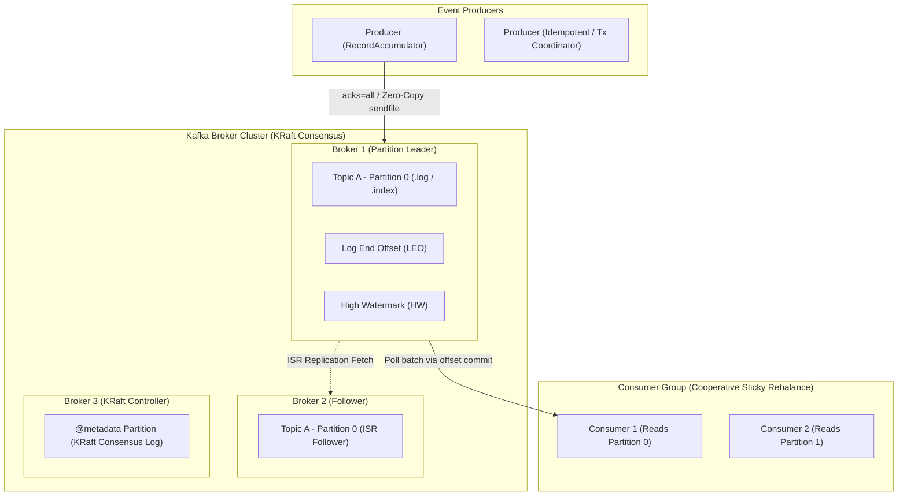

# Apache Kafka Architecture and Event Streaming

## TL;DR

Apache Kafka is an open-source distributed event streaming platform and partitioned append-only commit log system engineered for high-throughput, low-latency, and fault-tolerant event processing.
Rather than operating as a transient message queue that erases messages upon consumption, Kafka retains immutable sequential logs organized into Topics and horizontally scaled across Partitions.
Throughput is maximized via operating system page caching and the Linux `sendfile()` zero-copy network transfer system call, transferring raw disk pages directly to network sockets without user-space buffer copies.
Durability and high availability are governed by In-Sync Replica (ISR) quorums coordinated by leader brokers.
Consumer scalability is achieved through Consumer Groups utilizing Cooperative Sticky Rebalance protocols, while message delivery guarantees span at-most-once, at-least-once, and exactly-once processing (EOS) via idempotent producers and transactional coordinators.

## Mental Model

Kafka decouples high-throughput event ingestion from parallel consumer consumption through partitioned, disk-backed sequential commit logs.



## Architectural Internals and Deep Dive

### 1. Topics, Partitions, and the Append-Only Commit Log
Kafka structures streams of events into Topics.
Each topic is divided into one or more Partitions, which serve as the fundamental unit of parallelism, storage, and replication:
- **Append-Only Sequential Log**: Within a partition, incoming records are appended sequentially to the end of the log and assigned a strictly increasing 64-bit integer called an Offset.
- **Record Immutability**: Once written to a partition, an event is strictly immutable. It cannot be edited or deleted in-place.
- **Log Segments**: On disk, a partition is broken into segment files (default 1GB each, configured via `log.segment.bytes`):
  - `.log`: The raw binary message payloads containing headers, keys, values, and CRC checksums.
  - `.index`: A memory-mapped sparse index mapping logical message offsets to physical byte positions in the `.log` file.
  - `.timeindex`: A sparse index mapping message timestamps to physical byte offsets, enabling time-based seeking.
- **Sparse Indexing**: Kafka does not index every message. It writes an index entry every 4KB of data (`index.interval.bytes`). Locating an offset requires a binary search over the memory-mapped `.index` file, followed by a sequential scan over at most 4KB of raw log data.

```
Partition Log Directory: /var/lib/kafka/data/orders-0/
00000000000000000000.log        (Raw Message Payloads)
00000000000000000000.index      (Offset -> Byte Offset Sparse Index)
00000000000000000000.timeindex  (Timestamp -> Byte Offset Index)
leader-epoch-checkpoint         (Leader Epoch Recovery Tracking)
```

### 2. Zero-Copy Network Data Transfer
Traditional message brokers consume significant CPU overhead copying data between kernel buffers and user-space memory:
1. Disk read to OS Page Cache (Kernel Space).
2. Page Cache copy to Application Memory Buffer (User Space).
3. Application Buffer copy to Socket Buffer (Kernel Space).
4. Socket Buffer copy to Network Interface Card (NIC) Buffer.

Kafka achieves massive network throughput by bypassing user space entirely using the Linux `sendfile()` system call (Zero-Copy Transfer):
- Data is read from disk directly into the OS Page Cache.
- `sendfile()` instructs the kernel to transfer data directly from the Page Cache into the Network Interface Card (NIC) buffer via DMA (Direct Memory Access).
- Kafka avoids allocating user-space heap buffers for message payloads, completely eliminating JVM garbage collection pauses for data transfer and saturating 10GbE / 100GbE network interfaces at line rate.

### 3. In-Sync Replicas (ISR) and High Watermark (HW)
Replication ensures fault tolerance across broker failures:
- Each partition has one designated Leader broker and zero or more Follower brokers.
- **In-Sync Replicas (ISR)**: The set of replicas that are actively caught up with the leader. A follower is dropped from the ISR if it fails to send fetch requests within `replica.lag.time.max.ms` (default 30,000ms).
- **Log End Offset (LEO)**: The offset of the next record to be written to a partition (the absolute tip of the log on a given replica).
- **High Watermark (HW)**: The offset of the latest record that has been replicated to all members of the ISR.
- Consumers can read only up to the High Watermark. Messages past the High Watermark are invisible to consumers until fully acknowledged by the ISR, preventing phantom reads if an un-replicated leader crashes.

### 4. Producer Internals: Batching, Idempotence, and Transactions

#### RecordAccumulator and Batching
Producers do not send messages across the network individually:
- Incoming records pass through an optional Partitioner and are grouped by topic-partition into memory buffers inside the `RecordAccumulator`.
- The background `Sender` I/O thread dispatches batches across the network when either `batch.size` (e.g., 64KB) is reached or `linger.ms` (e.g., 10-50ms) expires, trading negligible milliseconds of latency for massive network throughput.

#### Idempotent Producer
Under transient network timeouts, a producer retrying a send can cause duplicate messages on the broker.
Enabling `enable.idempotence=true` guarantees exact deduplication:
- The broker assigns each producer a unique 64-bit Producer ID (PID).
- The producer attaches a monotonically increasing Sequence Number to each batch per partition.
- The broker tracks the highest sequence number processed for each PID; if it receives a batch with a sequence number $\le \text{LastSeenSequence}$, it accepts the write but discards the duplicate payload without error.

#### Transactional Producer and Exactly-Once Semantics (EOS)
Enables atomic writes across multiple topics and partitions (e.g., in stream processing consume-transform-produce loops):
- Coordinated by a central Transaction Coordinator broker managing a dedicated internal transaction log topic (`__transaction_state`).
- Follows a Two-Phase Commit (2PC) protocol:
  1. Producer begins transaction and registers target topic-partitions with coordinator.
  2. Producer writes messages tagged with transactional markers.
  3. Producer commits transaction: coordinator writes a `PREPARE_COMMIT` marker, flushes, and writes control markers (`COMMIT` or `ABORT`) into the user partitions.
- Consumers configured with `isolation.level=read_committed` buffer uncommitted messages and return records only up to the Last Stable Offset (LSO), discarding aborted transactions.

### 5. Consumer Groups and Cooperative Sticky Rebalance
A Consumer Group allows multiple consumer processes to divide partition processing dynamically:
- Each partition in a topic is consumed by exactly one consumer within a given consumer group.
- If consumers outnumber partitions, excess consumers sit idle.
- **Group Coordinator**: One broker acts as the coordinator for the group, tracking consumer heartbeats (`heartbeat.interval.ms`).
- **Eager Rebalance (Legacy)**: When a consumer joins or crashes, all consumers stop processing, revoke all assigned partitions, and wait for the coordinator to reassign all partitions, causing global processing stalls.
- **Cooperative Sticky Rebalance (Modern)**: Introduced in Kafka 2.4+. Instead of revoking all partitions, consumers continue processing unaffected partitions while only the specific migrating partitions are reassigned across two collaborative rounds, eliminating stop-the-world rebalance pauses.

### 6. Cluster Metadata: ZooKeeper vs KRaft (KIP-500)
- **Legacy ZooKeeper Architecture**: Kafka relied on external ZooKeeper ensembles to manage broker discovery, topic configurations, partition leader election, and quotas. A single broker was elected the Kafka Controller, translating ZooKeeper watch events into broker RPCs. This introduced a scaling limit of ~200,000 partitions and multi-minute controller failovers.
- **KRaft Mode (Kafka Raft Metadata)**: Removes ZooKeeper entirely. Metadata is managed directly inside Kafka as an internal single-partition event-driven topic (`@metadata`). A dedicated quorum of Controller brokers executes the Raft consensus protocol, enabling Kafka clusters to scale to tens of millions of partitions with sub-second controller failovers.

## Trade-offs and Comparisons

| Dimension | Apache Kafka | RabbitMQ | Apache Pulsar |
| :--- | :--- | :--- | :--- |
| **Architectural Model** | Distributed Append-Only Commit Log | Smart broker, dumb consumer AMQP queue | Tiered storage (Brokers + BookKeeper segments) |
| **Message Consumption** | Pull-based (Consumers pull batches via offset) | Push-based (Broker pushes to consumers) | Dual model (Streaming log + Queuing interfaces) |
| **Message Deletion** | Time- or size-based retention (Replayable log) | Deleted immediately upon consumer ACK | Deleted on ACK (or retained via ledger policies) |
| **Throughput Capacity** | Millions of msgs/sec (Zero-copy, sequential I/O) | Tens of thousands of msgs/sec | Millions of msgs/sec |
| **Ordering Guarantees** | Strict per-partition ordering | FIFO per queue (Order breaks on retries) | Strict per-partition ordering |
| **Routing Flexibility** | Topic/Partition hash key routing only | Complex routing (Direct, Fanout, Topic, Headers) | Topic-based routing with namespaces |
| **Storage Architecture** | Direct local filesystem via OS Page Cache | Erlang mnesia / Khepri + disk queue files | Apache BookKeeper distributed ledger log |

## Failure Modes and Mitigations

### 1. Consumer Group Rebalance Storms
- *Root Cause*: A consumer takes longer to process a batch of records than `max.poll.interval.ms` (default 300,000ms = 5 minutes). The broker assumes the consumer crashed, kicks it out of the group, and triggers a rebalance. When the consumer finishes and attempts to commit offsets, it is rejected, triggering another rebalance in an infinite loop.
- *Mitigation*: Reduce `max.poll.records` so batches finish well within the polling window; offload long-running compute tasks to background thread pools; configure `cooperative-sticky` partition assignor.

### 2. Replica Dropping from ISR and Under-Replicated Partitions
- *Root Cause*: High network saturation or slow disk I/O on a follower causes it to fall behind the leader by more than `replica.lag.time.max.ms`. The leader drops the follower from the ISR. If ISR falls below `min.insync.replicas`, future producer writes with `acks=all` fail with `NotEnoughReplicasException`.
- *Mitigation*: Monitor `UnderReplicatedPartitions` JMX metric; ensure network bandwidth between brokers exceeds peak ingest rates; use dedicated NVMe storage for log directories.

### 3. Page Cache Pollution by Cold Historical Consumers
- *Root Cause*: An analytical batch job or backfill reads events from 14 days ago. Reading cold segments forces the operating system to evict hot, recent pages from the OS Page Cache to read cold data from physical disk, causing real-time consumers to experience sudden disk I/O latency spikes.
- *Mitigation*: Isolate real-time clusters from historical analytics consumers; use tiered storage (offloading cold segments to Amazon S3); tune Linux dirty page ratios.

### 4. Controller Failover Metadata Freezes (ZooKeeper Legacy)
- *Root Cause*: Controller broker crashes on large clusters with 100,000+ partitions. The newly elected controller must read all partition znodes from ZooKeeper, causing the cluster to reject topic creation and partition reassignments for 2-5 minutes.
- *Mitigation*: Migrate cluster to KRaft mode (KIP-500) where metadata is cached in-memory and replicated continuously via Raft.

## Hands-On Verification

### Multi-OS Diagnostic Commands

#### Linux / macOS (Kafka CLI Scripts)
```bash
# List all topics and cluster partition layout
kafka-topics.sh --bootstrap-server localhost:9092 --list

# Inspect detailed partition, leader, and ISR status for a topic
kafka-topics.sh --bootstrap-server localhost:9092 --describe --topic production-events

# Monitor consumer group lag, current offset, and log end offset (LEO)
kafka-consumer-groups.sh --bootstrap-server localhost:9092 --describe --group analytics-group

# Dump raw log segment file and inspect internal records and headers
kafka-run-class.sh kafka.tools.DumpLogSegments \
  --files /var/lib/kafka/data/production-events-0/00000000000000000000.log \
  --print-data-log --verify-index-only
```

#### Windows (PowerShell)
```powershell
# Query Kafka port connectivity (9092)
Test-NetConnection -ComputerName localhost -Port 9092

# Execute consumer group check via Windows batch wrapper
cmd /c "kafka-consumer-groups.bat --bootstrap-server localhost:9092 --list"
```

### Complete Idempotent Producer and Manual Commit Consumer Script (Python)

The following runnable script demonstrates producing messages using an idempotent producer and consuming messages with explicit manual offset commits and consumer group tracking.

```python
"""
Kafka Idempotent Producer and Manual Offset Commit Consumer Script
Prerequisites: pip install confluent-kafka
Requires running Kafka broker on localhost:9092.
"""

from confluent_kafka import Producer, Consumer, KafkaError
import json
import time

BOOTSTRAP_SERVERS = "localhost:9092"
TOPIC_NAME = "telemetry-stream"

def run_producer():
    # Producer configured with idempotence and strict durability
    conf = {
        'bootstrap.servers': BOOTSTRAP_SERVERS,
        'enable.idempotence': True,      # PID + monotonic sequence numbers
        'acks': 'all',                  # Wait for full ISR acknowledgment
        'retries': 5,
        'linger.ms': 10,                # Micro-batching window
        'compression.type': 'snappy'
    }
    
    producer = Producer(conf)
    
    def delivery_report(err, msg):
        if err is not None:
            print(f"[Delivery Failure] Message delivery failed: {err}")
        else:
            print(f"[Delivery Success] Topic: {msg.topic()} | Partition: {msg.partition()} | Offset: {msg.offset()}")

    print("[Producer] Sending batch of 5 telemetry events...")
    for i in range(5):
        payload = {"device_id": f"dev_{i}", "temperature": 20.0 + i, "timestamp": time.time()}
        producer.produce(
            topic=TOPIC_NAME,
            key=f"dev_{i}".encode('utf-8'),
            value=json.dumps(payload).encode('utf-8'),
            callback=delivery_report
        )
        
    producer.flush()
    print("[Producer] All records flushed successfully.")

def run_consumer():
    # Consumer configured with manual offset commit
    conf = {
        'bootstrap.servers': BOOTSTRAP_SERVERS,
        'group.id': 'telemetry-processing-group',
        'auto.offset.reset': 'earliest',
        'enable.auto.commit': False,    # Explicit manual commit
        'partition.assignment.strategy': 'cooperative-sticky'
    }
    
    consumer = Consumer(conf)
    consumer.subscribe([TOPIC_NAME])
    print("[Consumer] Subscribed to topic. Polling for messages...")
    
    messages_processed = 0
    try:
        while messages_processed < 5:
            msg = consumer.poll(timeout=3.0)
            if msg is None:
                break
            if msg.error():
                if msg.error().code() == KafkaError._PARTITION_EOF:
                    continue
                print(f"[Consumer Error] {msg.error()}")
                break
                
            data = json.loads(msg.value().decode('utf-8'))
            print(f"[Consumer Received] Partition {msg.partition()} | Offset {msg.offset()} | Data: {data}")
            
            # Manually commit synchronous offset after processing
            consumer.commit(message=msg, asynchronous=False)
            messages_processed += 1
            
    finally:
        consumer.close()
        print("[Consumer] Closed consumer group session.")

if __name__ == "__main__":
    try:
        run_producer()
        time.sleep(1.0)
        run_consumer()
    except Exception as exc:
        print(f"[Fatal] Execution failed: {exc}")
```

## Performance Characteristics and Capacity Planning

### 1. In-Sync Replica Write Latency Formula
Write latency for a producer writing with `acks=all` is bounded by network RTT to the slowest replica in the active ISR:

$$\text{Latency}_{\text{write}} \approx \text{RTT}_{\text{Client}\to\text{Leader}} + \max_{f \in \text{ISR}}(\text{RTT}_{\text{Leader}\to\text{Follower}_f}) + T_{\text{PageCacheAppend}}$$

Because Kafka relies on OS Page Cache and asynchronous disk flushes, $T_{\text{PageCacheAppend}}$ is strictly memory-speed ($\approx 10\text{-}50\mu\text{s}$).

### 2. Disk Storage and Retention Sizing Formula
To dimension disk storage across $B$ brokers for a topic with $P$ partitions, replication factor $R$, retention period $T_{\text{days}}$, and daily ingress rate $D_{\text{GB}}$:

$$\text{TotalClusterDiskRequired} = D_{\text{GB}} \times R \times T_{\text{days}} \times 1.25\text{ (Index \& Compaction Headroom)}$$

$$\text{StoragePerBroker} = \frac{\text{TotalClusterDiskRequired}}{B}$$

For an application ingesting 2,000GB (2TB) per day, $R=3$, retention of 7 days, across 6 brokers:
- Total Disk: $2000 \times 3 \times 7 \times 1.25 \approx 52,500\text{GB} \approx 52.5\text{TB}$.
- Disk per Broker: $52.5\text{TB} / 6 \approx 8.75\text{TB}$ per broker.

## In Production: Real-World Case Studies

### 1. LinkedIn's Trillion-Event Scale
LinkedIn, the birthplace of Apache Kafka, processes over 7 trillion messages daily:
- **Architecture**: Operates over 100,000 Kafka brokers spanning multiple global datacenters.
- **MirrorMaker and Brooklin**: Engineered automated cross-datacenter replication pipelines (Brooklin) to stream data across geo-distributed clusters while avoiding cross-cluster loops.
- **Tracking Everything**: Serves as the central nervous system connecting online services, distributed metrics, and offline Hadoop/data lake processing pipelines.

### 2. Uber's Real-Time Marketplace Analytics
Uber processes petabytes of real-time geospatial telemetry events through Kafka:
- **Tiered Storage Architecture**: Offloads closed log segments to Amazon S3, freeing local broker NVMe drives to serve hot real-time ingest without disk saturation.
- **Microservice Decoupling**: Connects thousands of microservices via event-driven pub-sub topics, allowing driver location updates to fan out to ETA calculation, pricing, and fraud detection systems independently.

## Staff+ Interview Questions

> [!question]
> How does Kafka achieve massive network throughput using the Linux `sendfile()` system call, and why does this eliminate JVM garbage collection overhead?

> [!success]- Answer
> Traditional messaging systems transfer data by copying records from disk to OS page cache, copying from page cache to application user-space memory, copying from user space to socket buffers, and finally copying to the network interface card (NIC) buffer (requiring 4 buffer copies and 4 context switches). Kafka uses the Linux `sendfile()` system call to execute Zero-Copy data transfer: `sendfile()` instructs the OS kernel to transfer data directly from the OS page cache to the NIC buffer via Direct Memory Access (DMA), requiring only 2 context switches and 0 CPU data copies. Because data never enters user-space memory, Kafka does not allocate Java heap objects to hold message payloads. This completely eliminates JVM heap allocations, avoids CPU memory bus saturation, and prevents stop-the-world garbage collection pauses, allowing Kafka to saturate multi-gigabit network links at line rate.

> [!question]
> What is the exact difference between `acks=0`, `acks=1`, and `acks=all` (or `acks=-1`), and how does `min.insync.replicas` affect `acks=all`?

> [!success]- Answer
> `acks=0` means the producer considers the write successful as soon as it sends the network packet, without waiting for broker acknowledgment. It provides maximum throughput but guarantees no durability (packets lost in flight cause silent data loss). `acks=1` means the producer waits for the partition Leader broker to write the message to its local log/page cache before responding. If the leader crashes before replicas fetch the record, data is permanently lost. `acks=all` means the leader responds only after all active members of the In-Sync Replica (ISR) set have replicated the message up to their High Watermark. However, if all followers fail and the ISR shrinks to just the leader, `acks=all` degenerates into `acks=1`. To prevent this, operators configure `min.insync.replicas=2`. When configured, if the ISR size drops below 2, the leader rejects producer writes with a `NotEnoughReplicasException`, ensuring zero data loss across leader failovers.

> [!question]
> Explain what the High Watermark (HW) and Log End Offset (LEO) represent in a Kafka partition. Why are messages past the High Watermark invisible to consumers?

> [!success]- Answer
> The Log End Offset (LEO) is the offset of the next record to be written to a partition on a specific replica (the absolute tip of that replica's local log). The High Watermark (HW) is the lowest LEO across all replicas in the In-Sync Replica (ISR) set. It represents the latest message that has been successfully replicated across all in-sync replicas. Messages between the HW and the leader's LEO are present on the leader but have not yet been acknowledged by all followers. Kafka makes messages past the High Watermark strictly invisible to consumers: if a consumer were allowed to read past the HW and the leader subsequently crashed before replication completed, the newly elected leader would not contain that message. The consumer would have observed an event that vanished from the database (a phantom read). Restricting reads to the HW guarantees that consumers observe only permanently committed, durable data.

> [!question]
> How does Kafka guarantee Exactly-Once Semantics (EOS) using Idempotent Producers and Transactional Coordinators?

> [!success]- Answer
> Kafka achieves EOS through two distinct layers. First, the Idempotent Producer prevents duplicate writes caused by network retry timeouts: the broker assigns the producer a 64-bit Producer ID (PID), and the producer attaches a monotonically increasing Sequence Number to each batch per partition. The broker tracks sequence numbers and silently deduplicates any batch already processed. Second, for atomic multi-partition stream processing (consume-transform-produce loops), Kafka provides the Transactional Producer. Coordinated by a central Transaction Coordinator broker managing the `__transaction_state` topic, the producer writes transactional markers across partitions using a Two-Phase Commit protocol. Consumers configured with `isolation.level=read_committed` buffer messages and read only up to the Last Stable Offset (LSO), exposing messages only after the coordinator appends a `COMMIT` marker, and filtering out aborted transaction messages.

> [!question]
> What is the difference between Eager Rebalance and Cooperative Sticky Rebalance in Kafka Consumer Groups?

> [!success]- Answer
> In legacy Eager Rebalancing, whenever a consumer joined, left, or failed, all consumers in the group were forced to revoke 100% of their assigned partitions and stop processing immediately. The group entered a global "stop-the-world" pause while the coordinator recalculated assignments, after which consumers re-established connections and re-read state. In large clusters, this caused multi-minute processing stalls. Cooperative Sticky Rebalancing (introduced in Kafka 2.4+) replaces this with a two-phase non-blocking protocol. In round 1, consumers report their current assignments, and the coordinator identifies only the minimal subset of partitions that must migrate. Consumers continue processing all unaffected partitions without interruption, while only the migrating partitions are revoked and reassigned in round 2. This completely eliminates stop-the-world processing pauses and preserves local state caches during rebalances.

> [!question]
> What causes a "Consumer Rebalance Storm", and what configuration parameters should you tune to prevent it?

> [!success]- Answer
> A Consumer Rebalance Storm occurs when a consumer's processing logic takes longer to execute than `max.poll.interval.ms` (default 5 minutes). When the consumer fails to invoke `poll()` within this window, the broker assumes the consumer has hung or died and evicts it from the consumer group, triggering a group-wide rebalance. When the consumer finally completes its processing and attempts to commit offsets or call `poll()`, the broker rejects it because the consumer is no longer a member. The consumer rejoins, triggering another rebalance. Because other consumers may also experience processing delays handling re-routed partitions, the entire cluster enters a continuous cascading loop of rebalances where zero progress is made. To mitigate this: (1) reduce `max.poll.records` (e.g., from 500 down to 50) so each batch finishes well within the time limit; (2) increase `max.poll.interval.ms`; (3) offload heavy computation to background worker threads; and (4) enable `cooperative-sticky` partitioning.

> [!question]
> Why did Kafka migrate from Apache ZooKeeper to KRaft (Kafka Raft Metadata Mode), and how does KRaft store cluster metadata?

> [!success]- Answer
> In the ZooKeeper architecture, Kafka suffered from severe architectural limitations: (1) cluster scale was capped at ~200,000 partitions because managing millions of znodes in ZooKeeper caused memory bloat and slow state synchronization; (2) Controller failovers took minutes because the new controller had to synchronously read all topic and partition metadata znodes from ZooKeeper; and (3) operators had to manage and scale two distinct distributed systems. KRaft (KIP-500) eliminates ZooKeeper entirely. Cluster metadata is stored directly inside Kafka within an internal event-driven topic called `@metadata`. A small quorum of designated Controller brokers runs an event-driven implementation of the Raft consensus protocol. State changes are replicated as log entries, and the active controller keeps metadata materialized in memory, allowing Kafka to scale to millions of partitions and reducing controller failover latency to under 500 milliseconds.

> [!question]
> How does Kafka's Sparse Index work, and why doesn't Kafka maintain an index entry for every single message offset?

> [!success]- Answer
> In a partition segment, Kafka maintains two primary files: the `.log` file containing raw binary messages and the `.index` file. If Kafka maintained an index entry for every single offset, the index file would consume significant memory and disk storage. Instead, Kafka uses a Sparse Index: it writes an index entry only once every 4KB of data written to the log (`index.interval.bytes`). An index entry consists of 8 bytes: a 4-byte relative offset and a 4-byte physical byte position in the `.log` file. Because the index file is small, the operating system can keep it entirely memory-mapped in RAM. When a consumer requests offset $X$, Kafka performs an $O(\log N)$ binary search in the memory-mapped `.index` file to find the largest indexed offset $\le X$, seeks directly to that physical byte offset in the `.log` file, and sequentially scans at most 4KB of raw data to locate the exact record.

> [!question]
> What is Log Compaction in Kafka, and how does Kafka clean tombstones without violating consumer retention guarantees?

> [!success]- Answer
> Rather than deleting records strictly by time or size retention (`log.cleanup.policy=delete`), Log Compaction (`cleanup.policy=compact`) guarantees that Kafka retains at least the latest state for every message key within a topic partition. The partition log is bifurcated into two sections: the clean head (already compacted) and the dirty tail (appended recently). The background Log Cleaner thread scans the dirty log, populates an in-memory `SkimpyOffsetMap` hash table mapping 8-byte key hashes to their latest 8-byte offsets, and rewrites the log segments, copying only records whose offsets match the latest recorded key offset and discarding superseded values. To delete a key entirely, a producer writes a Tombstone record: a message containing the target key with a `null` payload. During compaction, the cleaner retains the tombstone marker across an initial compaction pass so downstream consumers can observe the deletion. The tombstone is purged from disk only after `delete.retention.ms` (default 24 hours) has elapsed, ensuring slow or recovering consumer groups have adequate time to observe the tombstone and invalidate their local caches before the key is permanently erased.

> [!question]
> Explain Kafka Tiered Storage (KIP-405). How does offloading cold log segments to remote object storage alter the economics and operational scaling of large Kafka clusters?

> [!success]- Answer
> Historically, Kafka tightly coupled compute (broker CPU and network bandwidth) with storage (local attached NVMe SSDs). Retaining weeks or months of event streams for backfilling or analytics forced enterprises to over-provision expensive broker instances solely for disk capacity. Furthermore, adding new brokers or recovering dead nodes required massive partition reassignments, saturating network interfaces as terabytes of historical logs were replicated peer-to-peer across local broker disks. Kafka Tiered Storage (KIP-405) breaks this coupling by establishing a two-tier storage hierarchy: Tier 1 (Local Storage) retains only hot, active log segments on local fast NVMe drives, serving latency-critical real-time consumers with zero-copy `sendfile()`; and Tier 2 (Remote Storage) asynchronously offloads closed, inactive log segments to cost-effective cloud object storage (Amazon S3, Google Cloud Storage, or Azure Blob Storage). Brokers retain lightweight index metadata pointing to remote chunks. Consumers reading cold historical data stream bytes directly from object storage via ranged HTTP GET requests. This architecture reduces total cost of ownership (TCO) by up to 70%, supports virtually infinite retention periods, and enables near-instantaneous partition rebalancing because newly launched brokers do not need to copy gigabytes of cold history over the cluster network.

## Related Concepts and Wikilinks

- [[Pub-Sub-Architecture]] - Theoretical pub-sub and event streaming foundations.
- [[Synchronous-vs-Asynchronous-Communication]] - Asynchronous decoupled event-driven architectures.
- [[Apache-ZooKeeper]] - Historical Kafka metadata coordination and KRaft consensus comparison.
- [[RabbitMQ]] - Direct comparison with broker-centric AMQP message queues.
- [[ZeroMQ]] - Brokerless socket-level streaming versus central commit logs.
- [[Elasticsearch-and-Apache-Solr]] - Real-time indexing pipelines fed by Kafka topics.

## Further Reading and References

- Kreps, Jay, Neha Narkhede, and Jun Rao. "Kafka: A Distributed Messaging System for Log Processing." *Proceedings of NetDB*, 2011.
- Shapira, Gwen, et al. *Kafka: The Definitive Guide* (2nd Edition). O'Reilly Media, 2021.
- Kleppmann, Martin. *Designing Data-Intensive Applications*. O'Reilly Media, 2017. Chapter 11: Stream Processing.
- Apache Kafka PMC. "KIP-500: Replace ZooKeeper with a Self-Managed Metadata Quorum." *Kafka Improvement Proposals*, 2019.
- LinkedIn Engineering. "How LinkedIn Customizes and Scales Apache Kafka to 7 Trillion Messages Daily." LinkedIn Engineering Blog, 2021.
