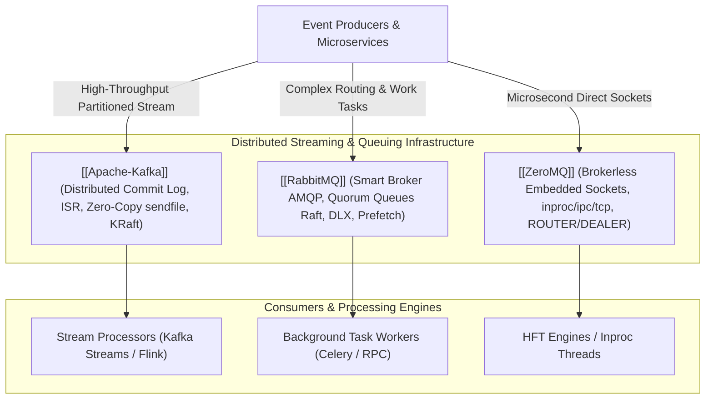

# Messaging and Event Streaming Infrastructure

## Map of Content

Asynchronous communication architectures decouple distributed microservices, absorb burst traffic spikes, and power event-driven stream processing pipelines.
This module covers the architectural trade-offs across partitioned distributed commit logs, broker-centric AMQP task queues, and ultra-low-latency brokerless socket topologies.

## Core Knowledge Areas

### 1. Partitioned Commit Logs
- [[Apache-Kafka]]: Distributed append-only commit logs, topic partitioning, in-sync replicas (ISR), high watermark (HW), OS page cache zero-copy data transfer (`sendfile`), consumer group cooperative sticky rebalances, idempotent producers, and KRaft consensus metadata architecture.

### 2. Enterprise Message Queues
- [[RabbitMQ]]: Erlang OTP actor model, AMQP 0-9-1 messaging standard, exchanges (direct, fanout, topic, headers), Quorum Queues (Raft consensus replication), publisher confirms, consumer prefetch QoS, Dead Letter Exchanges (DLX), and memory flow control alarms.

### 3. Brokerless Socket Messaging
- [[ZeroMQ]]: Brokerless embedded socket architecture, transport protocol abstractions (`inproc://`, `ipc://`, `tcp://`, `pgm://`), socket patterns (REQ/REP, PUB/SUB, PUSH/PULL, ROUTER/DEALER), lock-free `ypipe` queues, High Water Mark (HWM) buffer management, and sub-microsecond latency execution.

## Architectural Comparison Matrix

| Dimension | Apache Kafka | RabbitMQ | ZeroMQ |
| :--- | :--- | :--- | :--- |
| **Core Architecture** | Distributed append-only commit log | Centralized smart message broker | Embedded smart socket library (Brokerless) |
| **Persistence** | Persistent disk logs (Configurable retention) | Disk-backed Quorum Queues (Raft consensus) | Volatile in-memory only (Zero persistence) |
| **Message Consumption** | Pull-based (Batch offset polling) | Push-based (Broker pushes to workers) | Pull/Push (Socket topology dependent) |
| **Message Deletion** | Time- or size-based retention (Replayable) | Purged immediately upon consumer ACK | Discarded immediately after socket read |
| **Throughput Capacity** | Millions of msgs/sec | Tens of thousands of msgs/sec | Millions of msgs/sec per CPU core |
| **Latency SLA** | 2ms - 15ms | 1ms - 10ms | Sub-microsecond to single-digit $\mu\text{s}$ |
| **Routing Granularity** | Partition hash key routing | Complex exchanges, wildcards, headers | Topologies wired directly in application code |
| **Primary Use Cases** | Event sourcing, metrics, clickstreams | Work queues, banking RPC, complex routing | High-frequency trading, inter-thread IPC |

## Study and Interview Roadmap

1. Understand the architectural difference between a commit log (Kafka) and a message queue (RabbitMQ), specifically around message retention, ordering, and deletion.
2. Master how Kafka achieves line-rate throughput via the Linux `sendfile()` zero-copy system call and sequential disk I/O.
3. Be prepared to explain Quorum Queues in RabbitMQ and why they replaced legacy Mirrored Queues.
4. Know when brokerless architectures like ZeroMQ are appropriate and how to handle its lack of persistence and delivery guarantees.
