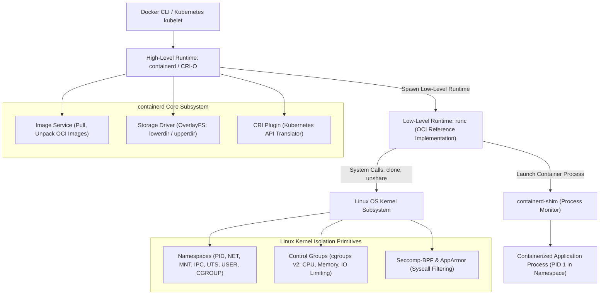

# Docker and Container Runtime Architecture

## TL;DR

Containers are not lightweight virtual machines; they are standard operating system processes isolated by Linux kernel primitives: Namespaces for visibility isolation and Control Groups (cgroups) for resource constraint and accounting.
The container ecosystem is governed by the Open Container Initiative (OCI), separating High-Level Runtimes (Docker daemon, containerd, CRI-O) that manage image pulling, unpackaging, and API routing, from Low-Level Runtimes (`runc`, `crun`) that configure kernel namespaces and execute container processes.
The `containerd-shim` process acts as an intermediary, decoupling running container processes from the daemon runtime to permit zero-downtime container engine restarts.
Storage layers utilize Copy-on-Write (CoW) union file systems like OverlayFS (combining read-only `lowerdir` image layers with a read-write `upperdir`), while BuildKit parallelizes multi-stage image builds with granular layer caching.

## Mental Model

Container engines coordinate image distribution and API requests down to low-level runtimes that instantiate kernel isolation primitives directly on the host.



## Architectural Internals and Deep Dive

### 1. Linux Kernel Isolation Primitives: Namespaces and cgroups
A container is simply a standard Linux process running with restricted kernel visibility and bounded resource quotas:

#### Linux Namespaces (Visibility Boundaries)
Namespaces govern what a process can see:
- `pid`: Isolates Process IDs; the container process views itself as PID 1, while on the host it is assigned a standard PID (e.g., PID 8492).
- `net`: Isolates network interfaces, IP routing tables, port bindings, and firewall iptables rules (creating `veth` virtual ethernet pairs).
- `mnt`: Isolates filesystem mount points; constructs a private root filesystem (`pivot_root`).
- `ipc`: Isolates System V IPC and POSIX message queues and shared memory.
- `uts`: Isolates the host hostname and domain name.
- `user`: Maps container root (UID 0) to an unprivileged user (UID 100000) on the host for defense-in-depth security.
- `cgroup`: Isolates the visibility of control group paths.

#### Control Groups (cgroups v2 - Resource Governance)
Control groups govern what a process can use:
- **cgroups v2 Single Hierarchy**: Unifies the disparate subsystem hierarchies of cgroups v1 into a single unified directory tree (`/sys/fs/cgroup`).
- **Memory Enforcement**: Tracks physical RAM and swap usage (`memory.max`). When a container exceeds its memory limit, the Linux kernel Out-Of-Memory (OOM) killer immediately terminates the offending process.
- **CPU Quota Enforcement**: Governed by Completely Fair Scheduler (CFS) bandwidth quotas (`cpu.max = $QUOTA $PERIOD`). Setting `cpu.max = 50000 100000` grants the process 50ms of CPU time per 100ms wall-clock window (0.5 CPU core).

### 2. The Open Container Initiative (OCI) and Runtimes
To prevent proprietary lock-in, the container ecosystem standardized on two core OCI specifications:
1. **OCI Image Specification**: Defines the format of container image manifests, configuration JSON, and tarball layer blobs.
2. **OCI Runtime Specification**: Defines the execution configuration (`config.json`) and lifecycle commands (`create`, `start`, `stop`, `delete`) for container execution.

#### Runtime Separation
- **High-Level Runtimes (containerd, CRI-O)**: Manage the lifecycle of images, networking, storage mounting, and API communication with Docker or Kubernetes kubelet.
- **Low-Level Runtimes (`runc`, `crun`)**: Lightweight command-line tools that read the OCI `config.json` bundle, call the kernel `unshare()` or `clone()` system calls with namespace flags, configure cgroups, and invoke `execve()` to launch the target process.

### 3. The `containerd-shim` Architecture
When `runc` finishes configuring namespaces and launching the container process, `runc` exits immediately.
This leaves the `containerd-shim` process running alongside the container:
- **Daemon Decoupling**: Acts as the parent process to the container's PID 1. If `containerd` or `dockerd` is stopped, upgraded, or crashes, the running containers do not terminate; their TCP connections remain open and their state persists.
- **I/O and Exit Handling**: Keeps standard I/O (stdin, stdout, stderr) file descriptors open, collecting container exit status codes without holding daemon memory.

### 4. Storage Engines: OverlayFS and Layer Caching
Container images are composed of immutable, content-addressable layers stacked using the OverlayFS union file system:
- **`lowerdir`**: Stack of read-only image layers containing the base OS and application binaries.
- **`upperdir`**: A writable directory unique to the running container instance.
- **`merged`**: The unified virtual mount directory presented to the container process.
- **`workdir`**: An internal directory used by OverlayFS to execute atomic file preparation.

```
+-------------------------------------------------------+
|  Merged View (/): Read-Write Virtual Presentation     |
+-------------------------------------------------------+
|  upperdir: Container Writable Layer (Delta Writes)    |
+-------------------------------------------------------+
|  lowerdir Layer 3: Application JAR (Read-Only)        |
|  lowerdir Layer 2: OpenJDK Runtime (Read-Only)        |
|  lowerdir Layer 1: Debian Base OS (Read-Only)         |
+-------------------------------------------------------+
```

When a container modifies an existing file from an image layer, OverlayFS executes Copy-on-Write (CoW): it copies the entire file from `lowerdir` into `upperdir` before applying the modification, leaving the base image layer completely intact and shared across other containers.

### 5. Multi-Stage Builds and BuildKit
Legacy Docker builds executed linear Dockerfile commands, producing bloated images containing compilers and build tools.
Modern BuildKit introduces:
- **Directed Acyclic Graph (DAG) Execution**: Analyzes Dockerfiles into an intermediate representation (LLB - Low-Level Build), parallelizing independent build stages.
- **Multi-Stage Builds**: Compiles artifacts in a heavyweight builder stage (e.g., `golang:alpine`), copying only the compiled static binary into a minimal distroless runtime stage, reducing image sizes from 1GB+ down to $<20\text{MB}$.
- **Cache Mounts (`--mount=type=cache`)**: Persists compiler cache directories (e.g., `/root/.cache/go-build` or `~/.m2`) across builds without baking them into intermediate layers.

### 6. Container Security Boundaries: Seccomp, Capabilities, and Rootless
Running containers securely requires multi-layered defense-in-depth:
- **Linux Capabilities (`cap_drop=ALL`)**: Divides root privileges into granular units (`CAP_CHOWN`, `CAP_NET_BIND_SERVICE`, `CAP_SYS_ADMIN`). Dropping unnecessary capabilities prevents a compromised container process from modifying system clocks or mounting filesystems.
- **Seccomp-BPF Profiles**: Filters allowed system calls. Default Docker seccomp profiles block over 40 dangerous system calls (such as `reboot`, `ptrace`, `sys_chroot`).
- **Rootless Containers**: Runs the container engine and low-level runtime entirely as an unprivileged host user via User Namespaces, ensuring that even if a process achieves a complete container breakout, it holds zero root privileges on the underlying host operating system.

## Trade-offs and Comparisons

| Dimension | Containers (runc / containerd) | MicroVMs (Firecracker / Kata) | Traditional Virtual Machines (KVM / VMware) |
| :--- | :--- | :--- | :--- |
| **Isolation Boundary** | Shared Linux kernel namespaces + cgroups | Dedicated minimalist Linux guest kernel via KVM | Full guest OS + virtualized hardware (QEMU) |
| **Startup Latency** | 50ms - 200ms (Process fork) | 5ms - 50ms (Ultra-fast kernel boot) | 15s - 60s (Full hardware BIOS/boot) |
| **Memory Footprint** | Negligible (~5MB per container + app) | Minimal (~5MB - 10MB per MicroVM) | High (Hundreds of MBs for guest OS) |
| **Security Tenancy** | Soft isolation; vulnerable to kernel 0-days | Hard virtualization boundary (Multi-tenant safe) | Hard virtualization boundary |
| **Hardware Emulation** | Zero emulation; native CPU execution | Minimal virtio device emulation | Heavy emulation (PCI, ACPI, IDE, SCSI) |
| **Resource Density** | Hundreds of containers per host | Thousands of MicroVMs per host | Dozens of VMs per host |

## Failure Modes and Mitigations

### 1. Out-Of-Memory (OOM) Killer Container Eviction
- *Root Cause*: Application allocates memory past `cgroups` `memory.max` (e.g., JVM heap exceeding container quota). The Linux kernel terminates the container process immediately with exit code 137 (`SIGKILL`).
- *Mitigation*: Configure JVM container-aware memory flags (`-XX:+UseContainerSupport -XX:MaxRAMPercentage=75.0`); size container memory limits with at least 25% buffer above peak application heap requirements.

### 2. Disk Exhaustion via Zombie OverlayFS Writable Layers
- *Root Cause*: Applications write logs, cache files, or temporary data directly into the container's root filesystem instead of ephemeral volumes. When containers churn, unpruned writable layers exhaust host disk space.
- *Mitigation*: Mount temporary files to `tmpfs` volumes (`--tmpfs /tmp`); stream application logs strictly to stdout/stderr; automate image and volume garbage collection (`docker system prune`).

### 3. Privilege Escalation via Docker Socket Exposure
- *Root Cause*: Mounting the host Docker socket (`/var/run/docker.sock`) into a container (often for CI/CD runners). Any process inside that container can control the host Docker daemon, mount the host root filesystem (`-v /:/host`), and achieve complete host root compromise.
- *Mitigation*: Never mount the Docker socket into untrusted containers; use rootless Docker, Kaniko, or Podman for containerized image builds; enforce Kubernetes Pod Security Standards (Restricted profile).

### 4. CPU Throttling via Misconfigured CFS Quotas
- *Root Cause*: Setting strict CPU quotas (`--cpus=0.5` or `cpu.max`) causes multi-threaded applications to exhaust their millisecond CFS quotas prematurely, freezing thread execution until the next 100ms period begins and spiking $p99$ response latencies.
- *Mitigation*: Monitor `cpu.stat` throttling metrics (`nr_throttled`); set realistic CPU limits or rely strictly on CPU requests/shares for scheduling without hard quotas in latency-sensitive services.

## Hands-On Verification

### Multi-OS Diagnostic Commands

#### Linux (Inspecting Namespaces and cgroups Directly)
```bash
# List all running Linux namespaces across host processes
lsns -t pid,net,mnt

# Inspect low-level cgroups v2 resource limits for a running container
cat /sys/fs/cgroup/system.slice/docker-<CONTAINER_ID>.scope/memory.max
cat /sys/fs/cgroup/system.slice/docker-<CONTAINER_ID>.scope/cpu.max

# Trace underlying system calls executed by runc during container creation
strace -f -e trace=clone,unshare,pivot_root,setns docker run --rm alpine true
```

#### macOS (Docker Desktop / Colima Diagnostics)
```bash
# Inspect container resource limits and runtime configuration
docker inspect <CONTAINER_ID> --format '{{json .HostConfig.NanoCpus}}'
docker inspect <CONTAINER_ID> --format '{{json .HostConfig.Memory}}'

# Check real-time resource utilization across all running containers
docker stats --no-stream
```

#### Windows (PowerShell)
```powershell
# Verify running Docker engine service
Get-Service -Name *docker*

# Query container details via PowerShell
docker inspect <CONTAINER_ID> | ConvertFrom-Json | Select-Object -ExpandProperty HostConfig
```

### Complete Multi-Stage Dockerfile with Security Hardening

The following production-ready Dockerfile demonstrates multi-stage building, distroless minimal base image utilization, non-root user enforcement, and granular security capability dropping.

```dockerfile
# Stage 1: Build Environment (Discarded in final image)
FROM golang:1.22-alpine AS builder

# Install build dependencies
RUN apk add --no-cache git ca-certificates

WORKDIR /build

# Leverage Docker layer caching for Go modules
COPY go.mod go.sum ./
RUN go mod download

# Copy source code and build statically linked binary
COPY . .
RUN CGO_ENABLED=0 GOOS=linux GOARCH=amd64 go build \
    -ldflags="-w -s" \
    -o /build/api-server .

# Stage 2: Minimal Distroless Runtime Environment
FROM gcr.io/distroless/static-debian12:nonroot

WORKDIR /app

# Copy binary from builder stage
COPY --from=builder /build/api-server /app/api-server

# Non-root execution: nonroot user UID is 65532
USER nonroot:nonroot

EXPOSE 8080

ENTRYPOINT ["/app/api-server"]
```

Run command enforcing security profiles:
```bash
docker run -d \
  --name secure-service \
  --read-only \
  --cap-drop=ALL \
  --security-opt=no-new-privileges:true \
  --pids-limit=100 \
  --memory=256m \
  --cpus=0.5 \
  -p 8080:8080 \
  secure-service:latest
```

### Complete Standalone Simulation: OverlayFS and Copy-on-Write (CoW)

The following runnable Python script simulates how the Linux OverlayFS union filesystem coordinates multiple read-only image layers (`lowerdir`), an ephemeral writable container layer (`upperdir`), and Copy-on-Write mutation mechanics.

```python
#!/usr/bin/env python3
"""
Simulates Linux OverlayFS union mount mechanics and Copy-on-Write (CoW).
Demonstrates:
- Multiple read-only image layers (lowerdir)
- Ephemeral writable container layer (upperdir)
- Unified view (merged) with priority lookup
- Copy-on-Write (CoW) mechanics preserving underlying image layers
"""

import os
import tempfile
import shutil
from typing import List, Optional

class SimulatedOverlayFS:
    def __init__(self, lower_dirs: List[str], upper_dir: str):
        self.lower_dirs = lower_dirs
        self.upper_dir = upper_dir

    def read_file(self, rel_path: str) -> str:
        # Check writable upper layer first (most recent delta)
        upper_path = os.path.join(self.upper_dir, rel_path)
        if os.path.exists(upper_path):
            with open(upper_path, "r", encoding="utf-8") as f:
                return f.read()

        # Traverse lower layers from topmost to base
        for lower in reversed(self.lower_dirs):
            lower_path = os.path.join(lower, rel_path)
            if os.path.exists(lower_path):
                with open(lower_path, "r", encoding="utf-8") as f:
                    return f.read()

        raise FileNotFoundError(f"File not found in any layer: {rel_path}")

    def write_file(self, rel_path: str, new_content: str):
        # Copy-on-Write: target writes strictly to upperdir
        upper_path = os.path.join(self.upper_dir, rel_path)
        os.makedirs(os.path.dirname(upper_path), exist_ok=True)
        with open(upper_path, "w", encoding="utf-8") as f:
            f.write(new_content)

def main():
    with tempfile.TemporaryDirectory() as base_temp:
        layer1_os = os.path.join(base_temp, "layer1_os")
        layer2_deps = os.path.join(base_temp, "layer2_deps")
        layer3_app = os.path.join(base_temp, "layer3_app")
        upper_container = os.path.join(base_temp, "upper_container")

        for d in [layer1_os, layer2_deps, layer3_app, upper_container]:
            os.makedirs(d)

        # Populate read-only base layers
        with open(os.path.join(layer1_os, "os-release.txt"), "w") as f:
            f.write("Debian GNU/Linux 12")
        with open(os.path.join(layer2_deps, "python.version"), "w") as f:
            f.write("Python 3.12.2")
        with open(os.path.join(layer3_app, "config.json"), "w") as f:
            f.write('{"env": "production", "debug": false}')

        overlay = SimulatedOverlayFS([layer1_os, layer2_deps, layer3_app], upper_container)

        # 1. Read files through union presentation
        print("Read from Base OS:", overlay.read_file("os-release.txt"))
        print("Initial App Config:", overlay.read_file("config.json"))

        # 2. Mutate file (triggers Copy-on-Write to upper layer)
        overlay.write_file("config.json", '{"env": "production", "debug": true}')
        print("Mutated App Config (Merged View):", overlay.read_file("config.json"))

        # 3. Verify underlying image layer remains completely unaltered
        with open(os.path.join(layer3_app, "config.json"), "r") as f:
            base_app_content = f.read()
        print("Original Layer 3 Content (Unaltered):", base_app_content)
        assert base_app_content == '{"env": "production", "debug": false}'
        print("OverlayFS CoW Simulation Verified Successfully!")

if __name__ == "__main__":
    main()
```

## Performance Characteristics and Capacity Planning

### 1. Memory Density and Overhead Math
Containers add virtually zero CPU virtualization tax compared to bare metal:
- **Process Memory Overhead**: $\approx 0\text{MB}$ hypervisor overhead. Each container consumes only the memory allocated by its application code and shared libraries in memory.
- **`containerd-shim` Footprint**: Each container runs one shim process consuming $\approx 3\text{MB}$ to $5\text{MB}$ of resident set size (RSS).
- For a host running 200 containers:

$$\text{TotalShimOverhead} \approx 200 \times 4\text{MB} \approx 800\text{MB of host RAM}$$

This enables order-of-magnitude higher packing densities compared to traditional Virtual Machines.

### 2. OverlayFS I/O Write Amplification
When an application modifies a 500MB file residing in an image layer (`lowerdir`), OverlayFS must copy all 500MB into `upperdir` before executing the first write (Copy-on-Write latency):

$$T_{\text{FirstWriteLatency}} = \frac{\text{FileSize}}{\text{DiskWriteBandwidth}} + T_{\text{Seek}}$$

For write-heavy workloads (databases, message queues), developers must mount external Docker Volumes, which write directly to native host block storage, bypassing OverlayFS CoW amplification entirely.

## In Production: Real-World Case Studies

### 1. Google's Borg and the Origin of Linux Containers
Google runs all its global production workloads (Search, YouTube, Gmail) inside containers managed by Borg:
- **Cgroups Genesis**: Google engineers originally authored and merged `cgroups` (initially Process Containers) into the Linux kernel in 2007 specifically to partition compute resources across Borg batch and latency-sensitive jobs.
- **Extreme Scale**: Spawns over 2 billion containers weekly, demonstrating the scalability of Linux kernel namespaces over physical hardware virtualization.

### 2. Netflix Titus: Container Management at Global Scale
Netflix engineered Titus, an open-source container management platform built on top of AWS EC2 instances:
- **Container Isolation on Cloud VMs**: Wrapped Docker containers inside AWS EC2 instances with native AWS VPC ENI networking, allowing every individual container to hold its own AWS security group and VPC IP address.
- **Microsecond Job Dispatch**: Dispatches millions of batch media transcoding and machine learning containers daily, scaling compute instantly without waiting for VM hypervisors to boot.

## Staff+ Interview Questions

> [!question]
> Why is the statement "a container is a lightweight virtual machine" technically incorrect, and what is a container from the perspective of the Linux operating system kernel?

> [!success]- Answer
> A container is fundamentally NOT a virtual machine. In a virtual machine, a hypervisor (Type 1 or Type 2) emulates physical hardware (CPU, memory, disks, NICs), and a complete guest operating system kernel boots inside the virtualized environment. From the perspective of the Linux operating system kernel, a container is simply a standard, unprivileged Linux process running directly on the host kernel. There is no hypervisor, no guest kernel, and no virtual hardware emulation. What makes it a "container" is that the process's view of the system is restricted by Linux Namespaces (which isolate process visibility for PIDs, networking, and mount points) and its resource consumption is constrained by Control Groups (cgroups, which enforce CPU, memory, and I/O quotas). The container process executes instructions natively on the physical CPU, achieving bare-metal performance and sub-second startup times.

> [!question]
> What is the role of `containerd-shim` in the container runtime hierarchy, and why was it introduced between `containerd` and the container process?

> [!success]- Answer
> In the OCI runtime architecture, `containerd` invokes `runc` to configure namespaces and spawn the container process. However, `runc` exits immediately after launching the container. If `containerd` acted as the direct parent process of the container, any restart, crash, or upgrade of `containerd` would cause the Linux kernel to send `SIGHUP`/`SIGTERM` to all running containers, killing production workloads. The `containerd-shim` solves this by acting as an independent, lightweight intermediary process: (1) It remains as the parent process of the container's PID 1, decoupling container execution from the container engine daemon; (2) It allows `containerd` and `dockerd` to be restarted or upgraded with zero downtime to running containers; and (3) It keeps open file descriptors for standard I/O (stdin, stdout, stderr) and collects exit codes, reporting them when `containerd` reconnects.

> [!question]
> Explain how OverlayFS constructs a unified root filesystem for a container using `lowerdir`, `upperdir`, and `merged` layers. What is the Copy-on-Write (CoW) penalty?

> [!success]- Answer
> OverlayFS is a union mount filesystem that combines multiple directory layers into a single virtual presentation. The `lowerdir` consists of a stack of read-only image layers containing the base OS, dependencies, and application binaries. The `upperdir` is a writable directory created specifically for that container instance. The `merged` directory is the unified mount point presented to the container process. When a container reads a file, OverlayFS searches `upperdir` first; if absent, it traverses the `lowerdir` stack. When a container modifies an existing file residing in a read-only `lowerdir`, OverlayFS executes Copy-on-Write (CoW): it copies the entire file from the lower layer into the `upperdir` before executing the modification. The CoW penalty occurs when an application modifies a very large file (e.g., a 10GB database file): the container must copy all 10GB to the upper layer before writing a single byte, causing severe I/O latency spikes.

> [!question]
> What are the differences between cgroups v1 and cgroups v2, and why does cgroups v2 provide superior memory and I/O control for containers?

> [!success]- Answer
> In cgroups v1, each resource controller (cpu, memory, blkio, pids) operated in an independent, disjointed hierarchy. This created major architectural flaws: controllers could not coordinate properly (for example, buffered I/O writes could not be throttled because the `memory` controller tracked page cache allocations while the `blkio` controller tracked disk writes, meaning memory-backed disk writes escaped I/O throttling). In cgroups v2, the Linux kernel implemented a Unified Hierarchy: all controllers are attached to a single process tree under `/sys/fs/cgroup`. This enables true unified resource accounting: memory-backed writeback I/O is accurately tracked and throttled, out-of-memory killing is coordinated across all threads in a container group simultaneously (`memory.oom.group`), and rootless container resource isolation is fully supported.

> [!question]
> Why should production container images avoid running as the default `root` user, and what does the OCI User Namespace accomplish?

> [!success]- Answer
> By default, the root user (UID 0) inside a container has the identical UID as the root user on the host system. While namespaces, cgroups, and capabilities restrict what container root can do, any container breakout vulnerability (such as a kernel privilege escalation or runc exploit) grants the attacker full root access over the host machine. Running as an unprivileged user (e.g., `USER nonroot`) ensures that a compromised process cannot write to system directories, bind to privileged ports, or exploit host root permissions. User Namespaces take this further: they map UID 0 inside the container to an unprivileged high-numbered UID on the host (e.g., UID 100000). Even if a process escapes the container while holding root privileges within its namespace, the host kernel treats the attacker as an unprivileged user with zero administrative power.

> [!question]
> How does Docker BuildKit improve upon legacy `docker build`, and what is the Low-Level Build (LLB) intermediate representation?

> [!success]- Answer
> Legacy `docker build` parsed Dockerfiles linearly line-by-line, executing each instruction sequentially and creating intermediate container snapshots, unable to parallelize independent steps. BuildKit replaces this with an execution graph architecture: it compiles the Dockerfile into a directed acyclic graph (DAG) of binary operations called Low-Level Build (LLB). BuildKit inspects the graph to identify independent stages (e.g., in multi-stage builds) and executes them concurrently across CPU cores. It provides advanced caching mechanisms, including persistent cache mounts (`--mount=type=cache`), secret mounts that avoid leaking credentials into image layers (`--mount=type=secret`), and skips executing unused build stages entirely if their outputs are not referenced in the final target stage.

> [!question]
> What is the difference between a high-level container runtime (CRI-O / containerd) and a low-level container runtime (`runc` / `crun`)?

> [!success]- Answer
> A High-Level Runtime (such as containerd or CRI-O) manages cluster-level concerns and image distribution: it exposes the Kubernetes Container Runtime Interface (CRI) gRPC API, pulls OCI container images from remote registries, verifies cryptographic checksums, unpacks tarball layers onto the local filesystem via OverlayFS, configures network interfaces (CNI), and manages container lifecycle policies. A Low-Level Runtime (such as `runc` in Go or `crun` in C) has a strictly bounded responsibility: it implements the OCI Runtime Specification. Given an unpacked root filesystem directory and an OCI `config.json` bundle, it calls the Linux kernel system calls (`clone`, `unshare`, `pivot_root`, `setns`) to configure the namespaces and cgroups, applies seccomp profiles, and executes the container binary directly.

> [!question]
> When should an engineering team choose a MicroVM runtime like AWS Firecracker or Kata Containers instead of standard `runc` containers?

> [!success]- Answer
> Standard `runc` containers share the host Linux operating system kernel. While namespaces, cgroups, and seccomp provide strong boundaries, the shared kernel means any kernel-level zero-day vulnerability (e.g., Dirty COW, kernel privilege escalations) allows an attacker to compromise the entire physical server and all other tenant workloads running on it. Standard containers are therefore considered "soft multi-tenancy" and unsafe for untrusted code execution. Teams should choose MicroVM runtimes (such as AWS Firecracker or Kata Containers) when executing untrusted multi-tenant workloads (e.g., serverless functions like AWS Lambda, continuous integration runners, untrusted user code execution platforms). MicroVMs boot an isolated minimalist Linux guest kernel in under 10 milliseconds via hardware-assisted KVM virtualization, providing hard hardware virtualization boundaries with container-like startup speeds.

> [!question]
> How does the Linux Virtual Ethernet (`veth`) pair and network bridge architecture connect a container in an isolated network namespace to the physical host and external networks?

> [!success]- Answer
> When a container runtime initializes a container network namespace (`netns`), it constructs a virtual point-to-point network tunnel using a Linux `veth` (virtual ethernet) pair. One end of the pair is moved inside the container network namespace and renamed to `eth0`, while the peer end remains in the host's root network namespace (named e.g. `vethXXXX`). The host-side interface is attached to a virtual Layer 2 software switch (such as the default `docker0` bridge). The container's `eth0` is assigned an IP address from the bridge subnet, with the bridge IP configured as the container's default gateway. For outbound external internet traffic, the host Linux kernel executes IP forwarding (`sysctl net.ipv4.ip_forward=1`) and applies Netfilter SNAT / IP MASQUERADE rules, translating the container private IP to the host public IP. For inbound traffic directed to exposed ports (`-p 8080:80`), `dockerd` configures DNAT rules in the `PREROUTING` iptables chain, rewriting destination traffic arriving on host port 8080 to the container private IP and internal port.

> [!question]
> Explain the security mechanics of Linux Capabilities and Seccomp-BPF filters in container defense-in-depth. How does dropping `CAP_SYS_ADMIN` prevent container breakouts even if a process runs as root?

> [!success]- Answer
> In traditional UNIX systems, process privilege is binary: a process either executes with non-root UID or full root UID (UID 0), granting unrestricted kernel authority. Linux Capabilities divide this monolithic root authority into 41 distinct privileges (`CAP_CHOWN`, `CAP_NET_BIND_SERVICE`, `CAP_SYS_ADMIN`, `CAP_SYS_RAWIO`). By default, container runtimes drop approximately 27 capabilities, most crucially `CAP_SYS_ADMIN` - the umbrella capability required for mounting filesystems, configuring namespaces, loading eBPF programs, and modifying kernel parameters. Even if a malicious attacker compromises a container running as root, the lack of `CAP_SYS_ADMIN` prevents them from calling `mount()`, altering host hardware, or breaking chroot boundaries via `pivot_root`. Seccomp-BPF (Secure Computing with Berkeley Packet Filter) reinforces this boundary by acting as a system call firewall: before the Linux kernel processes any syscall from the container process, the compiled BPF filter program evaluates the syscall number and arguments. If the syscall is prohibited by the profile (such as `ptrace`, `sys_chroot`, or `reboot`), the kernel immediately halts the execution and returns `EPERM` or sends `SIGSYS`, completely blocking kernel attack surfaces.

## Related Concepts and Wikilinks

- [[Virtual-Machines-vs-Containers]] - Foundational conceptual comparison of virtualization models.
- [[Kubernetes-Architecture]] - Container orchestration via kubelet and CRI runtimes.
- [[NGINX-Architecture]] - Deploying containerized ingress proxies.
- [[HAProxy-Architecture]] - Load balancing containerized microservice backends.
- [[Concurrency-Synchronization-and-CAS]] - Kernel scheduling primitives and multi-threading models.
- [[API-Authentication-and-Authorization]] - Defense-in-depth security principles.

## Further Reading and References

- Poulton, Nigel. *Docker Deep Dive*. Independently Published, 2023.
- Kerrisk, Michael. "Namespaces in Operation." *Linux Weekly News (LWN.net)*, 2013.
- Open Container Initiative. *OCI Runtime Specification (v1.1)*. https://opencontainers.org.
- Agache, Alexandru, et al. "Firecracker: Lightweight Virtualization for Serverless Applications." *USENIX NSDI*, 2020.
- Verma, Abhishek, et al. "Large-Scale Cluster Management at Google with Borg." *Proceedings of the European Conference on Computer Systems (EuroSys)*, 2015.
