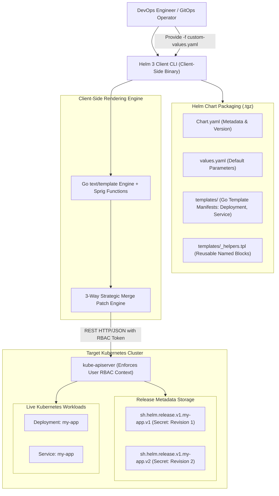

# Helm Package Manager Architecture

## TL;DR

Helm is the de-facto package manager for Kubernetes, automating the templating, packaging, distribution, installation, versioning, and lifecycle management of complex cloud-native applications.
Applications are packaged as Charts: directory trees containing declarative Go templates (`templates/`), default configuration values (`values.yaml`), and semantic metadata (`Chart.yaml`).
The architectural evolution from Helm 2 to Helm 3 eliminated the server-side Tiller daemon, transitioning Helm to an entirely client-side binary that operates strictly within the user's local Kubernetes RBAC security context.
Release state and revision history are stored securely within the cluster as versioned Kubernetes Secrets.
Deployments use a 3-way strategic merge patch algorithm to reconcile live cluster state against template changes, supporting atomic rollbacks (`helm rollback`) and automated lifecycle hooks.

## Mental Model

Helm renders parameter-driven Go templates against user configuration values on the client side, submitting computed manifests directly to `kube-apiserver` while recording release history in versioned Secrets.



## Architectural Internals and Deep Dive

### 1. Chart Structure and Anatomical Layout
A Helm Chart is an organized directory containing all resource definitions required to run an application on Kubernetes:
- `Chart.yaml`: Contains chart metadata (name, version, API version `v2`, description, appVersion, and dependencies).
- `values.yaml`: Contains the default configuration values for the chart. Users override these defaults via CLI (`--set key=value`) or custom YAML files (`-f production-values.yaml`).
- `templates/`: Contains Go templates that generate Kubernetes manifest YAML files when evaluated against values.
- `templates/_helpers.tpl`: Stores shared template partials and named templates invoked via the `include` function.
- `templates/NOTES.txt`: Plaintext instructions rendered and displayed to the user immediately following installation.
- `charts/`: Contains packaged dependency charts (subcharts).
- `crds/`: Contains Custom Resource Definitions installed before template rendering.

```
my-service-chart/
├── Chart.yaml              # Chart metadata and dependencies
├── values.yaml             # Default configuration values
├── values.schema.json      # JSON Schema for values validation
├── templates/
│   ├── _helpers.tpl        # Shared template macros
│   ├── deployment.yaml     # Parametrized Kubernetes Deployment
│   ├── service.yaml        # Parametrized Kubernetes Service
│   └── NOTES.txt           # Post-install output instructions
└── charts/                 # Subcharts directory
```

### 2. The Architectural Revolution: Helm 2 vs Helm 3 (Removal of Tiller)
The transition from Helm 2 to Helm 3 resolved the platform's most severe operational and security liabilities:

#### Helm 2 Architecture (Tiller Daemon)
- Required a centralized in-cluster server-side component called Tiller running in the `kube-system` namespace.
- **Security Vulnerability**: To install arbitrary resources across any namespace, Tiller was typically granted full `cluster-admin` RBAC privileges. Any developer with access to the Helm CLI could instruct Tiller to deploy privileged pods or extract secrets, completely bypassing the developer's personal Kubernetes RBAC restrictions.
- **State Storage**: Tiller stored release state in ConfigMaps, which lacked encryption and had a 1MB size limit.

#### Helm 3 Architecture (Client-Only)
- **Tiller Completely Removed**: Helm 3 is a pure client-side binary. It authenticates directly against `kube-apiserver` using the operator's personal `kubeconfig` context. All operations are strictly evaluated against the user's specific RBAC permissions.
- **Secrets-Backed State**: Release manifests and state metadata are stored as gzip-compressed, base64-encoded Kubernetes Secrets in the target release's own namespace (`sh.helm.release.v1.<release-name>.v<revision>`).

### 3. The Template Engine and Rendering Mechanics
Helm processes templates using the Go `text/template` library augmented by over 70 utility functions from the Sprig library:
- **Variable Injection**: Direct value interpolation via `{{ .Values.replicaCount }}` or built-in objects (`{{ .Release.Name }}`, `{{ .Chart.Version }}`).
- **Template Functions**:
  - `toYaml`: Serializes a Go data structure into a formatted YAML string.
  - `nindent <N>`: Indents a multi-line string by $N$ spaces, preserving YAML indentation alignment.
  - `include`: Executes a named template partial from `_helpers.tpl`, capturing output as a string.
  - `required`: Halts template rendering if a mandatory parameter is omitted by the user:
    `{{ required "A valid database password is required!" .Values.db.password }}`
- **Values Precedence Hierarchy**: Helm resolves conflicting values using a strict cascading precedence:
  1. Parameters set via CLI `--set` (Highest precedence).
  2. Custom files passed via `-f custom-values.yaml`.
  3. Parent chart values (overriding subcharts).
  4. Default `values.yaml` in the chart directory (Lowest precedence).

### 4. 3-Way Strategic Merge Patch and Rollback Mechanics
When upgrading or modifying a release, Helm 3 utilizes a 3-Way Strategic Merge Patch algorithm:
- Evaluates three distinct states:
  1. **Old Manifest**: The manifest generated during the previous Helm release revision.
  2. **Live State**: The current live object state in Kubernetes (including fields injected dynamically by controllers, such as HPA replicas or mutating webhooks).
  3. **New Manifest**: The newly rendered manifest generated by the current Helm chart templates.
- **Why 3-Way Merge Matters**: In legacy Helm 2 (2-way merge), Helm compared only the Old Manifest against the New Manifest. If an external operator or Kubernetes controller (e.g., an HPA scaling replicas from 3 to 10) modified a live resource, Helm 2 would overwrite the live modification back to the template default. Helm 3's 3-way merge observes external live mutations and preserves them unless explicitly overridden by the new manifest.
- **Atomic Execution (`--atomic`)**: If any resource fails to become ready within the configured timeout (`--timeout 5m`), Helm automatically rolls back the entire release to the previous working revision.

### 5. Release Lifecycles and Hooks
Helm allows operators to inject out-of-band jobs into specific phases of a release lifecycle via Annotations:
- `helm.sh/hook`: Declares the hook phase:
  - `pre-install`: Runs before any templates are rendered and applied (e.g., running database schema migrations).
  - `post-install`: Runs after all resources are applied and healthy (e.g., executing a Slack notification webhook).
  - `pre-upgrade` / `post-upgrade`: Runs before/after rolling upgrade executions.
  - `pre-delete` / `post-delete`: Runs before/after release uninstallation.
- `helm.sh/hook-weight`: Enforces ordered execution across multiple hooks (lower weights execute first).
- `helm.sh/hook-delete-policy`: Automatically cleans up hook resources (`hook-succeeded`, `hook-failed`, `before-hook-creation`).

### 6. Chart Distribution: Repositories and OCI Registries
- **Classic HTTP Repositories**: An HTTP server hosting an `index.yaml` file pointing to packaged `.tgz` chart archives. Managing large index files becomes slow as thousands of chart versions accumulate.
- **OCI (Open Container Initiative) Registries**: Modern Helm 3 can push and pull charts directly to and from standard OCI container registries (Docker Hub, AWS ECR, GCP Artifact Registry, GitHub Container Registry) as OCI artifacts:
  ```bash
  helm package my-service-chart/
  helm push my-service-chart-1.0.0.tgz oci://registry.example.com/charts
  helm install my-release oci://registry.example.com/charts/my-service-chart --version 1.0.0
  ```

## Trade-offs and Comparisons

| Dimension | Helm | Kustomize | Jsonnet (Tanka) |
| :--- | :--- | :--- | :--- |
| **Architectural Model** | Template-driven parametrization (Go templates) | Template-free declarative overlays (Pure YAML) | Programmable configuration language (Data templating) |
| **Packaging & Distribution**| Native versioned archives (.tgz, OCI artifacts) | Git repository directory trees / Base-overlay folders | Git libraries and Jsonnet bundler packages |
| **Lifecycle & Rollbacks** | Native release history with automated rollback | None (Relies entirely on Git commit history) | None (Relies entirely on Git history) |
| **Secret Management** | Encrypted via plugins (Helm Secrets / SOPS) | SecretGenerator (hash suffixes) | Native integration with Vault / SealedSecrets |
| **Learning Curve** | Moderate (Go templating syntax, whitespace formatting)| Very Low (Pure standard Kubernetes YAML) | High (Learning full Jsonnet programming language) |
| **Kubernetes Native** | External CNCF project | Built directly into `kubectl` (`kubectl apply -k`) | External CLI (Grafana Tanka) |
| **Dynamic Capabilities** | Turing-complete loops, conditionals, calculations | Strictly deterministic patching (JSONPatch / strategic merge) | Full programmatic functions and object inheritance |

## Failure Modes and Mitigations

### 1. Release Stuck in `pending-install` or `pending-upgrade`
- *Root Cause*: A network failure, client Ctrl+C abort, or timeout occurs while Helm is applying resources. The release Secret remains marked in a `pending-*` state, causing future `helm upgrade` commands to fail with `Error: another operation is in progress`.
- *Mitigation*: Inspect the latest release Secret (`kubectl get secrets -n <ns> -l owner=helm`); delete the stuck pending Secret to roll back state to the previous successful revision, or run `helm rollback <release> <revision>`.

### 2. YAML Indentation Bugs via `toYaml`
- *Root Cause*: Misconfiguring whitespace indentation when piping YAML blocks (e.g., using `{{ toYaml .Values.resources }}` without `nindent 12`). The rendered YAML contains misaligned indentation, causing `kube-apiserver` to reject the manifest with syntax errors.
- *Mitigation*: Run `helm template` or `helm lint` in CI/CD pipelines to validate YAML formatting; always pipe multi-line objects to `nindent`: `{{ toYaml .Values.resources | nindent 12 }}`.

### 3. Orphaned Resources on Release Deletion
- *Root Cause*: Resources created by lifecycle hooks without deletion policies (`helm.sh/hook-delete-policy`) or resources created by subcharts whose parent chart was deleted continue running as orphaned workloads in the cluster.
- *Mitigation*: Ensure all hook manifests define `helm.sh/hook-delete-policy: hook-succeeded,before-hook-creation`; verify releases with `helm status`.

### 4. CRD Upgrade Limitations
- *Root Cause*: Helm installs Custom Resource Definitions located in `crds/` strictly during the initial `helm install`. By design, Helm refuses to update or delete CRDs during subsequent `helm upgrade` operations to prevent accidental cascading data loss.
- *Mitigation*: Manage CRD upgrades out-of-band via dedicated GitOps pipelines or manual `kubectl apply -f crds/` commands before running chart upgrades.

## Hands-On Verification

### Multi-OS Diagnostic Commands

#### Linux / macOS (Helm CLI Workflows)
```bash
# Lint chart syntax and evaluate values schema
helm lint ./my-service-chart

# Render templates locally to stdout without connecting to a cluster (Dry Run)
helm template my-release ./my-service-chart --debug -f custom-values.yaml

# List deployed releases across all namespaces
helm list -A

# Inspect revision history for a release
helm history my-release -n production

# Execute an atomic rollback to a previous revision
helm rollback my-release 2 -n production
```

#### Windows (PowerShell)
```powershell
# Verify Helm version and connectivity
helm version

# Inspect underlying Helm release Secrets stored in Kubernetes
kubectl get secrets -n production -l "owner=helm" | Format-Table Name, Type, Age
```

### Complete Production Helm Chart Template

The following production-ready template illustrates parameterization, helper macros, resource requests, probes, and `toYaml` indentation formatting.

#### `my-service-chart/templates/deployment.yaml`
```yaml
apiVersion: apps/v1
kind: Deployment
metadata:
  name: {{ include "my-service.fullname" . }}
  labels:
    {{- include "my-service.labels" . | nindent 4 }}
spec:
  {{- if not .Values.autoscaling.enabled }}
  replicas: {{ .Values.replicaCount }}
  {{- end }}
  selector:
    matchLabels:
      {{- include "my-service.selectorLabels" . | nindent 6 }}
  template:
    metadata:
      labels:
        {{- include "my-service.selectorLabels" . | nindent 8 }}
    spec:
      serviceAccountName: {{ include "my-service.serviceAccountName" . }}
      securityContext:
        {{- toYaml .Values.podSecurityContext | nindent 8 }}
      containers:
        - name: {{ .Chart.Name }}
          securityContext:
            {{- toYaml .Values.securityContext | nindent 12 }}
          image: "{{ .Values.image.repository }}:{{ .Values.image.tag | default .Chart.AppVersion }}"
          imagePullPolicy: {{ .Values.image.pullPolicy }}
          ports:
            - name: http
              containerPort: {{ .Values.service.port }}
              protocol: TCP
          livenessProbe:
            httpGet:
              path: /healthz
              port: http
            initialDelaySeconds: 10
            periodSeconds: 15
          readinessProbe:
            httpGet:
              path: /ready
              port: http
            initialDelaySeconds: 5
            periodSeconds: 10
          resources:
            {{- toYaml .Values.resources | nindent 12 }}
```

#### `my-service-chart/values.yaml`
```yaml
replicaCount: 3

image:
  repository: gcr.io/my-org/api-service
  pullPolicy: IfNotPresent
  tag: "1.2.0"

service:
  type: ClusterIP
  port: 8080

resources:
  limits:
    cpu: 500m
    memory: 512Mi
  requests:
    cpu: 100m
    memory: 128Mi

autoscaling:
  enabled: false

podSecurityContext:
  runAsNonRoot: true
  runAsUser: 10001

securityContext:
  allowPrivilegeEscalation: false
  readOnlyRootFilesystem: true
  capabilities:
    drop:
      - ALL
```

### Complete Standalone Simulation: Helm 3-Way Strategic Merge Patch Engine

The following runnable Python script simulates Helm 3's 3-Way Strategic Merge Patch algorithm.
It demonstrates why Helm 3 compares the original manifest (base), the live cluster state (which may contain dynamic controller mutations like HPA replica autoscaling), and the user's newly rendered chart manifest, preventing accidental rollbacks of live autoscaled states during application upgrades.

```python
#!/usr/bin/env python3
"""
Simulates Helm 3's 3-Way Strategic Merge Patch algorithm.
Demonstrates:
- Base manifest (original chart release)
- Live cluster state (mutated dynamically by HPA)
- Target manifest (user updated chart with new image tag)
- 3-Way Strategic Merge preserving live autoscaler mutations
"""

from typing import Any, Dict

class HelmThreeWayMergeEngine:
    @staticmethod
    def patch(base: Dict[str, Any], live: Dict[str, Any], target: Dict[str, Any]) -> Dict[str, Any]:
        result = dict(live)

        # Iterate through target attributes
        for key, target_val in target.items():
            base_val = base.get(key)
            live_val = live.get(key)

            if key not in base:
                # New field added by user in target manifest
                result[key] = target_val
            elif target_val != base_val:
                # User explicitly changed this field in the new chart
                result[key] = target_val
            else:
                # User did not modify this field in target chart.
                # If live cluster controller modified it (e.g., HPA), preserve live value.
                result[key] = live_val

        # Handle fields deleted in target manifest that were present in base
        for key in list(result.keys()):
            if key in base and key not in target:
                del result[key]

        return result

def main():
    # 1. Base manifest deployed in Revision 1
    base_manifest = {
        "apiVersion": "apps/v1",
        "kind": "Deployment",
        "name": "payment-api",
        "image": "gcr.io/org/payment:1.0.0",
        "replicas": 3,
        "env": "production"
    }

    # 2. Live cluster state: HPA autoscaler detected traffic and scaled replicas to 12
    live_cluster_state = {
        "apiVersion": "apps/v1",
        "kind": "Deployment",
        "name": "payment-api",
        "image": "gcr.io/org/payment:1.0.0",
        "replicas": 12,  # Mutated dynamically by in-cluster HPA controller
        "env": "production"
    }

    # 3. Target manifest: Developer bumps image version to 1.1.0 in values.yaml
    # Note: Developer still has default replicas: 3 in values.yaml
    target_manifest = {
        "apiVersion": "apps/v1",
        "kind": "Deployment",
        "name": "payment-api",
        "image": "gcr.io/org/payment:1.1.0",  # Updated by developer
        "replicas": 3,                       # Unchanged in chart values
        "env": "production"
    }

    # Execute Helm 3 Three-Way Merge
    engine = HelmThreeWayMergeEngine()
    merged_output = engine.patch(base_manifest, live_cluster_state, target_manifest)

    print("Live State Before Upgrade (HPA Scaled):", live_cluster_state)
    print("New Chart Values Provided by User:", target_manifest)
    print("Computed 3-Way Strategic Merge Patch:", merged_output)

    # Assertions verifying Helm 3 correctness
    assert merged_output["image"] == "gcr.io/org/payment:1.1.0", "Image tag should update"
    assert merged_output["replicas"] == 12, "Live HPA replica count must be preserved!"
    print("\nHelm 3-Way Strategic Merge Patch Engine Verified Successfully!")

if __name__ == "__main__":
    main()
```

## Performance Characteristics and Capacity Planning

### 1. Release History Secret Sizing Math
Each Helm release revision creates a gzipped, base64-encoded Secret in the target namespace:
- Average compressed secret size: $\approx 20\text{KB}$ to $100\text{KB}$ depending on manifest size.
- Kubernetes `etcd` performance degrades if tens of thousands of large Secrets accumulate across namespaces.
- By default, Helm retains up to 10 historical revisions (`--history-max 10`).
- For a cluster with 500 microservices retaining 10 revisions each:

$$\text{TotalHelmSecrets} = 500 \times 10 = 5,000 \text{ Secrets}$$

$$\text{TotalEtcdFootprint} \approx 5,000 \times 50\text{KB} \approx 250\text{MB of etcd database space}$$

To protect `etcd`, always configure a strict history ceiling (e.g., `--history-max 5`).

### 2. Template Rendering CPU Latency
Helm template rendering occurs strictly in memory on the client machine:
- A large chart with 50 resources and extensive Sprig text functions renders in $\approx 20\text{ms} - 50\text{ms}$.
- Because rendering is client-side, Helm imposes zero CPU or memory load on the Kubernetes control plane during template calculation.

## In Production: Real-World Case Studies

### 1. GitOps Continuous Delivery with ArgoCD and Helm
Modern enterprise deployments rarely invoke `helm install` manually from developer workstations; they use GitOps operators like ArgoCD:
- **Declarative Source of Truth**: ArgoCD monitors a Git repository holding custom `values.yaml` files and Helm chart references.
- **Client-Side Rendering**: ArgoCD runs `helm template` internally to generate pure Kubernetes manifests, diffs them against live cluster state, and applies changes via `kube-apiserver`, combining Helm's templating flexibility with GitOps auditability.

### 2. Intuit's Enterprise Application Delivery
Intuit operates thousands of production microservices across hundreds of Kubernetes clusters using Helm:
- **Standardized Core Templates**: Authored a single central "Golden Service Chart" shared across all engineering teams.
- **Developer Velocity**: Individual development teams manage only small, 15-line `values.yaml` files, while the centralized Golden Chart enforces enterprise security contexts, logging sidecars, and network policies automatically.

## Staff+ Interview Questions

> [!question]
> Why was the Tiller component completely removed in Helm 3, and what specific security and operational challenges did this architectural change resolve?

> [!success]- Answer
> In Helm 2, Tiller was an in-cluster server daemon running in the `kube-system` namespace. Because Tiller had to install arbitrary resources across any namespace on behalf of any user, it was almost universally assigned full `cluster-admin` RBAC privileges. This represented a severe security vulnerability: any user who had access to communicate with Tiller (or access to the Helm CLI) could leverage Tiller's cluster-admin credentials to create privileged pods, mount host filesystems, or extract cluster secrets, completely bypassing the user's personal Kubernetes RBAC restrictions. Furthermore, Tiller was a single point of failure and state synchronization bottleneck. Helm 3 eliminated Tiller entirely, converting Helm into a pure client-side binary. When Helm 3 runs, it uses the operator's personal `kubeconfig` token to authenticate directly with `kube-apiserver`. All actions are evaluated strictly against the user's personal RBAC permissions, and release state is stored as versioned Secrets within the release's own namespace.

> [!question]
> How does Helm 3's 3-Way Strategic Merge Patch algorithm differ from Helm 2's 2-Way Merge, and why is this critical for applications using Kubernetes HorizontalPodAutoscalers (HPA)?

> [!success]- Answer
> Helm 2 used a 2-Way Merge Patch: during an upgrade, it compared the old manifest generated by the chart against the newly rendered manifest. If an object property was not specified in the new manifest, Helm 2 assumed it should revert to default. Critically, Helm 2 completely ignored the live cluster state. If an HPA controller dynamically scaled a Deployment from 3 replicas to 10 replicas in response to traffic, running `helm upgrade` under Helm 2 would compare the new manifest (`replicas: 3`) against the old manifest, conclude that replicas had changed, and violently overwrite the live cluster state back to 3 replicas, degrading production capacity. Helm 3 uses a 3-Way Strategic Merge Patch: it compares the old manifest, the live cluster state, and the new manifest. If a field was modified by a live cluster controller (like HPA modifying `replicas`), Helm 3 recognizes the mutation as a live-state change and preserves it, applying updates only to fields explicitly modified by the developer in the new manifest.

> [!question]
> What is the difference between `{{ template "name" . }}` and `{{ include "name" . }}` in Helm templates, and why is `include` preferred when piping output to formatting functions?

> [!success]- Answer
> Both functions invoke named template blocks defined in `_helpers.tpl`. However, `template` is a native Go template action that writes its rendered output directly to the template output stream; it cannot return a string value. Because it does not return a value, the output of `template` cannot be piped into functions. If you write `{{ template "mychart.labels" . | indent 4 }}`, the template engine throws a compilation syntax error. In contrast, `include` is a custom function introduced by Helm that renders the named template and captures the output as an in-memory string. Because it returns a string, its output can be cleanly piped to downstream transformation functions: `{{ include "mychart.labels" . | nindent 4 }}`. This makes `include` the mandatory standard for rendering nested YAML structures with accurate indentation.

> [!question]
> How does Helm manage release state and revision history in Kubernetes, and where are release records physically stored?

> [!success]- Answer
> Helm 3 stores all release state and revision history directly inside the target Kubernetes cluster as versioned Secrets (or ConfigMaps if explicitly configured) within the release's own target namespace. Each release revision creates a dedicated Secret named `sh.helm.release.v1.<release-name>.v<revision>` (e.g., `sh.helm.release.v1.my-service.v3` for revision 3). The data payload inside the Secret contains a gzip-compressed, base64-encoded JSON release object that stores the complete chart archive, the user-supplied values, and the final rendered Kubernetes manifest. Because release state is stored in standard Kubernetes Secrets, release history is automatically backed up during cluster etcd snapshots, requires zero external database dependencies, and is protected by native Kubernetes RBAC.

> [!question]
> What is an atomic Helm release (`helm install --atomic`), and how does Helm determine whether an installation has succeeded or failed?

> [!success]- Answer
> When the `--atomic` flag is specified during a `helm install` or `helm upgrade`, Helm monitors the rollout of all created resources until they achieve their ready state, bounded by `--timeout` (default 5 minutes). For a Deployment, this means waiting until the declared number of replicas are updated, available, and have passed their readiness probes. If any container crashes (`CrashLoopBackOff`), fails its readiness probe, or if the timeout expires before all resources become healthy, Helm immediately marks the release as failed and automatically triggers a rollback to the previous working revision (or completely uninstalls the release if it was a new installation). This prevents partially deployed, broken application states from remaining in production.

> [!question]
> What are Helm Lifecycle Hooks, and what is the function of the `helm.sh/hook-delete-policy` annotation?

> [!success]- Answer
> Lifecycle Hooks allow developers to execute specific Kubernetes resources (typically Jobs or Pods) at designated stages of a release lifecycle outside the standard declarative reconciliation order. Defined via annotations such as `helm.sh/hook: pre-upgrade`, a hook job can run database migrations before new application pods are deployed. The `helm.sh/hook-delete-policy` annotation controls when the completed hook resource is deleted from the cluster. Accepted values are: (1) `hook-succeeded`: deletes the Job as soon as it exits successfully; (2) `hook-failed`: deletes the Job if it fails; and (3) `before-hook-creation`: deletes any existing hook Job before creating the new one. Without configuring a delete policy, hook Jobs remain in the cluster indefinitely, preventing future upgrades from creating a Job with the identical name.

> [!question]
> Compare Helm with Kustomize. Under what engineering scenarios would you choose Helm over Kustomize, and vice versa?

> [!success]- Answer
> Helm is a package manager based on parameter-driven templating (Go templates): it packages applications into versioned, shareable archives (.tgz, OCI) and manages release lifecycles and rollbacks via etcd Secrets. Choose Helm when: (1) building reusable, third-party software intended to be shared across multiple organizations (e.g., deploying Prometheus, Redis, or Kafka); (2) applications require complex conditional logic, loops, or calculated defaults; and (3) you need built-in versioned release rollbacks. Kustomize is a template-free declarative configuration customizer built natively into `kubectl`: it uses base-and-overlay directory structures with strategic merge patches. Choose Kustomize when: (1) managing internal, organization-specific microservices deployed via GitOps; (2) you want to avoid template syntax errors and keep all manifests as 100% valid, lintable plain Kubernetes YAML; and (3) environment divergence (dev, staging, prod) consists of simple parameter overrides (image tags, replica counts) without complex branching logic.

> [!question]
> What is the purpose of the `crds/` directory in a Helm chart, and why does Helm intentionally refuse to update or delete CRDs during `helm upgrade`?

> [!success]- Answer
> The `crds/` directory holds Custom Resource Definitions that must be registered with `kube-apiserver` before any custom resources in `templates/` can be evaluated. When a chart is first installed via `helm install`, Helm installs any CRDs in `crds/` first, waits for the apiserver to register the new schema, and then renders the templates. However, Helm intentionally refuses to update or delete CRDs during `helm upgrade` or `helm uninstall`. This is a deliberate design decision to prevent catastrophic, irreversible data loss: in Kubernetes, deleting or modifying a CRD causes the API server to immediately delete all live Custom Resource instances of that type across the entire cluster. Because CRD upgrades can introduce breaking schema changes that destroy production data, Helm forces operators to manage CRD migrations explicitly out-of-band.

> [!question]
> Explain Helm 3's OCI Registry integration. How does packaging Helm charts as OCI artifacts in container registries like GitHub Container Registry (ghcr.io) or Amazon ECR eliminate dedicated ChartMuseum infrastructure?

> [!success]- Answer
> Legacy Helm 2 and early Helm 3 repositories relied on static HTTP web servers hosting an `index.yaml` file pointing to packaged `.tgz` tarballs. As an enterprise accumulated thousands of chart versions, the monolithic `index.yaml` file grew to dozens of megabytes, causing client downloads to time out, corrupting index caches, and requiring teams to host and maintain complex stateful repository proxies (such as ChartMuseum). Helm 3.8+ standardized on the Open Container Initiative (OCI) Artifact specification, treating Helm charts as first-class citizens alongside Docker container images. Charts are packaged and pushed directly to standard container registries using the `oci://` URI scheme (`helm package` -> `helm push my-chart-1.0.0.tgz oci://ghcr.io/my-org/charts`). OCI charts utilize distinct media types (`application/vnd.cncf.helm.config.v1+json` for metadata and `application/vnd.cncf.helm.chart.content.v1.tar+gzip` for the chart layer). This eliminates `index.yaml` entirely, unifies IAM security policies and RBAC permissions across images and charts, unlocks automated image vulnerability scanning, and enables geo-replicated chart distribution via enterprise container registries.

> [!question]
> How does the Helm Subchart dependency mechanism work, and what is the difference between global values (`global:`) and parent chart value propagation down to subcharts?

> [!success]- Answer
> Subcharts represent modular dependencies declared in `Chart.yaml` under `dependencies` and stored in the `charts/` directory (e.g., an application chart depending on a Bitnami Redis subchart). Crucially, subcharts are completely autonomous: a subchart has its own isolated `values.yaml` and cannot access values defined in the parent chart unless explicitly overridden. To override values within a child subchart, the parent chart's `values.yaml` must explicitly scope the configuration under a top-level key matching the child subchart's exact name (e.g., `redis: auth: password: "secret"`). The single exception to this encapsulation boundary is the `global:` values namespace: any key-value pair declared under `global` in the root parent chart's `values.yaml` is automatically propagated into `.Values.global` across every subchart and nested sub-subchart in the dependency tree. This allows platform architects to share ubiquitous environment configurations (e.g., domain names, image pull secrets, or corporate registry URLs) across dozens of decoupled microservice charts without duplicating parameters.

## Related Concepts and Wikilinks

- [[Kubernetes-Architecture]] - Underlying orchestration platform, API server, and etcd storage.
- [[Docker-and-Container-Runtimes]] - OCI image specifications and packaging standards.
- [[NGINX-Architecture]] - Deploying NGINX Ingress controllers via Helm charts.
- [[HAProxy-Architecture]] - Deploying HAProxy ingress controllers via Helm.
- [[Apache-Mesos]] - Legacy two-level scheduling compared to Kubernetes package delivery.
- [[API-Fundamentals]] - Declarative API schemas and versioning contracts.

## Further Reading and References

- Butcher, Matt, Matt Farina, and Josh Dolitsky. *Learning Helm: Managing Apps on Kubernetes*. O'Reilly Media, 2021.
- Helm Project. *Helm 3 Documentation and Architecture Overview*. https://helm.sh/docs/.
- Cloud Native Computing Foundation. *Helm Project Journey Report*. CNCF Research, 2022.
- Argo Project. *ArgoCD Application Management with Helm and Kustomize*. ArgoCD Documentation.
- Intuit Engineering. "Standardizing Cloud-Native Application Delivery at Intuit with Helm." Intuit Tech Blog, 2022.
