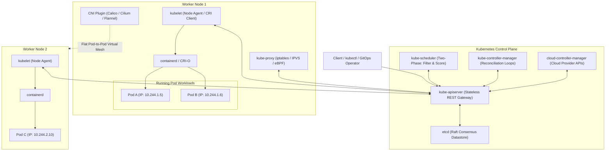

# Kubernetes Architecture and Distributed Orchestration

## TL;DR

Kubernetes (K8s) is an open-source distributed container orchestration platform engineered for automated application deployment, horizontal scaling, service discovery, and declarative self-healing across server clusters.
The control plane utilizes a declarative reconciliation loop pattern where controllers continuously drive the observed cluster state toward the declared desired state stored in an external strongly consistent `etcd` consensus cluster.
The `kube-apiserver` acts as the stateless central gateway, enforcing admission control, authentication, and optimistic locking (`resourceVersion`), while `kube-scheduler` assigns Pods to nodes using two-phase filter and score algorithms.
Worker nodes run the `kubelet` agent communicating with low-level runtimes via the Container Runtime Interface (CRI), `kube-proxy` for Layer 4 network packet manipulation (iptables, IPVS, or eBPF), and Container Network Interface (CNI) plugins delivering a flat IP-per-Pod network topology.
Storage is abstracted through the out-of-tree Container Storage Interface (CSI) with topology-aware dynamic volume provisioning, while custom workload automation is delivered via Custom Resource Definitions (CRDs) and the Operator Pattern using client-go informers.

## Mental Model

Kubernetes couples a stateless declarative control plane backed by etcd with autonomous node agents executing continuous state reconciliation loops.



## Architectural Internals and Deep Dive

### 1. Control Plane Architecture and Reconciliation Loops
The Kubernetes control plane enforces declarative desired state through distributed components:

#### `kube-apiserver`
- The central communication hub; no component communicates with `etcd` except `kube-apiserver`.
- All inter-component interactions occur via REST HTTP/JSON over mutual TLS (mTLS).
- Request pipeline: Authentication (x509 Certificates / OIDC Bearer Tokens) -> Authorization (RBAC / Node Authorizer / Webhook) -> Mutating Admission Webhooks -> Object Schema Validation -> Validating Admission Webhooks -> Persistence to `etcd`.
- **Optimistic Concurrency Control**: Objects maintain a monotonic `metadata.resourceVersion` populated from etcd's global 64-bit revision.
Conflicting simultaneous updates fail with HTTP `409 Conflict`, requiring clients to re-read the latest object and retry.
- **Watch Streams**: Provides HTTP/2 streaming chunked responses (`Transfer-Encoding: chunked`) enabling controllers to observe mutations in real time without polling.

#### `etcd` Consensus Datastore
- Distributed, strongly consistent key-value store governed by the Raft consensus protocol.
- Stores the entire cluster's authoritative state under the `/registry/...` key prefix.
- Uses a multi-version concurrency control (MVCC) data model backed by a bbolt B+tree storage engine.
- Every mutating write increments a global 64-bit transaction counter (`revision`).
- Historical revisions are retained until purged by the compaction controller, followed by disk defragmentation.
- Raft quorums mandate that a cluster of $2F + 1$ nodes survives at most $F$ simultaneous node failures without losing write availability.

#### `kube-controller-manager` (KCM)
- Embeds dozens of autonomous control loops running the Reconciliation Pattern:
  $$\text{Reconcile}() : \text{ActualState} \longrightarrow \text{DesiredState}$$
- Includes the `DeploymentController`, `ReplicaSetController`, `NodeController`, `NamespaceController`, and `EndpointSliceController`.
- If a node crashes, the `NodeController` marks it `NotReady` after `node-monitor-grace-period` (default 40s) and evicts Pods, while the `ReplicaSetController` notices missing replicas and instructs `kube-apiserver` to create replacement Pods.

#### `kube-scheduler`
Assigns unscheduled Pods (`spec.nodeName: ""`) to optimal nodes using a two-phase pipeline:
1. **Filtering (Predicates)**: Discards infeasible nodes (insufficient CPU/memory requests, port conflicts, node selector mismatches, taints lacking matching tolerations).
2. **Scoring (Priorities)**: Ranks surviving candidate nodes based on weighted scoring plugins (image locality, Pod topology spread constraints, resource bin-packing vs spreading).
3. **Binding**: Writes the selected `nodeName` to the Pod object in `kube-apiserver` via a `Binding` sub-resource.

### 2. Node Plane Architecture: Kubelet and Kube-Proxy

#### `kubelet`
- The primary agent executing on every physical or virtual worker node.
- Registers the node with the control plane and reports node health, memory pressure, and disk capacity.
- Watches `kube-apiserver` for Pods assigned to its node.
- Interacts with container runtimes via the Container Runtime Interface (CRI) over a local UNIX domain socket (`/run/containerd/containerd.sock`).
- Enforces container health probes:
  - `startupProbe`: Determines when a legacy, slow-starting application has initialized.
  - `livenessProbe`: Determines if a container has deadlocked; failure triggers container restart.
  - `readinessProbe`: Determines if a Pod is ready to accept network traffic; failure removes the Pod from Service `EndpointSlices`.

#### `kube-proxy`
- Implements the Kubernetes Service virtual IP (ClusterIP) abstraction on each node:
  - **`iptables` Mode**: Generates packet-filtering rules in the Linux kernel `nat` table, using random probability matching to balance traffic across backend Pod IPs.
  Large clusters ($>5,000$ services) experience severe kernel latency because iptables evaluates rules sequentially ($O(N)$).
  - **`IPVS` Mode**: Utilizes Linux IP Virtual Server kernel hash tables ($O(1)$ lookup), scaling efficiently to tens of thousands of services with advanced balancing algorithms (least-connection, weighted round-robin).
  - **`eBPF` Mode (Cilium)**: Completely replaces `kube-proxy` using eBPF programs attached directly to Linux socket layers and network interfaces (XDP), routing packets at bare-metal line rate without traversing kernel iptables stacks.

### 3. Kubernetes Networking and Service Discovery

#### The Pod-to-Pod Network Invariant
Kubernetes mandates three foundational networking invariants:
1. All Pods can communicate with all other Pods on any node without NAT.
2. All agents on a node (e.g., `kubelet`) can communicate with all Pods on that same node.
3. The IP that a Pod sees as its own IP address is the exact same IP that every other Pod observes.

Container Network Interface (CNI) plugins (Calico, Cilium, AWS VPC CNI) implement these invariants using overlay networks (VXLAN, Geneve) or direct routed BGP meshes.

#### Service Types
- **ClusterIP** (default): Allocates a stable, virtual private IP reachable only within the cluster.
- **NodePort**: Allocates a high-numbered port ($30000 - 32767$) on every worker node's physical IP, forwarding traffic to the backend Service.
- **LoadBalancer**: Integrates with cloud providers (`cloud-controller-manager`) to provision external cloud load balancers (AWS NLB, GCP Cloud Load Balancer) pointing to NodePorts.
- **Headless Service (`clusterIP: None`)**: Allocates no virtual IP.
CoreDNS returns multiple `A` records containing the direct IP addresses of matching backend Pods, enabling direct client-side load balancing.

#### DNS and Service Discovery (CoreDNS)
- Runs as an internal deployment in the `kube-system` namespace.
- Dynamically resolves Services to ClusterIPs using standardized FQDNs:
  `<service-name>.<namespace>.svc.cluster.local`

### 4. Storage Architecture: CSI, PVCs, and Topology-Aware Provisioning

Storage in Kubernetes abstracts underlying block devices, filesystems, and network shares:
- **PersistentVolume (PV)**: A piece of physical storage provisioned in the cluster (e.g., AWS EBS volume, GCE Persistent Disk, Ceph RBD).
- **PersistentVolumeClaim (PVC)**: A user's request for storage, specifying size, access mode (`ReadWriteOnce`, `ReadOnlyMany`, `ReadWriteMany`), and `StorageClass`.
- **StorageClass**: Defines the dynamic storage provisioner and parameters (e.g., volume type, IOPS tier, filesystem format).
- **Container Storage Interface (CSI)**: An out-of-tree specification separating storage vendor code from core Kubernetes binaries.
  - Controller components (`csi-provisioner`, `csi-attacher`, `csi-resizer`) watch PVCs and interact with cloud storage APIs.
  - Node components (`csi-node-driver-registrar`, daemonset) mount block devices into the host filesystem and attach them to container namespaces via `NodeStageVolume` and `NodePublishVolume` gRPC calls.
- **Topology-Aware Volume Scheduling (`volumeBindingMode: WaitForFirstConsumer`)**: Defers dynamic volume provisioning until `kube-scheduler` selects a node for the Pod.
This guarantees that the provisioned cloud volume resides in the exact Availability Zone where the Pod is placed, eliminating cross-AZ volume attachment failures.

### 5. The Operator Pattern, Custom Resource Definitions (CRDs), and client-go Architecture

Kubernetes can be extended arbitrarily to manage domain-specific state machines:
- **Custom Resource Definition (CRD)**: Defines a new declarative schema registered dynamically with `kube-apiserver` via OpenAPI v3 validation.
- **Operator Pattern**: Combines custom CRDs with a custom controller embedding domain knowledge (e.g., Prometheus Operator, Kafka Strimzi Operator, PostgreSQL Zalando Operator).
- **client-go Informer Architecture**:
  - **Reflector**: Executes an initial HTTP `List` request to establish base state, followed by long-lived HTTP/2 `Watch` streams tracking incremental deltas via `resourceVersion`.
  - **DeltaFIFO**: A queue storing incremental update events (`Sync`, `Added`, `Updated`, `Deleted`).
  - **SharedIndexInformer**: Distributes events from the DeltaFIFO to a local in-memory cache (`Indexer` backed by a thread-safe store) and registers user callbacks (`ResourceEventHandler`).
  - **RateLimitingWorkqueue**: Decouples event handling from reconciliation workers.
  Workers pull lightweight object keys (`<namespace>/<name>`), query the local indexed cache, execute idempotent reconciliation, and re-enqueue failed keys with exponential backoff.
  - **Leader Election**: Uses the Kubernetes Coordination API (`coordination.k8s.io/v1` Leases) to ensure only one active replica runs the reconciliation worker while standbys stay hot.

### 6. Cluster Security, Admission Control, and Network Policies

Securing Kubernetes clusters relies on multi-layer defense-in-depth:
- **Authentication**: Mutual TLS (mTLS) for system components, OpenID Connect (OIDC) JWT tokens for developers, and Short-Lived Bound Service Account Tokens (projected volume tokens) for Pods.
- **Authorization (RBAC)**: Role and ClusterRole definitions bound to subjects via RoleBinding or ClusterRoleBinding, enforcing least-privilege API access.
- **Node Authorization**: Restricts `kubelet` API access to only objects (Pods, Secrets, ConfigMaps) scheduled on its specific physical node.
- **Admission Webhooks**:
  - *Mutating Admission Webhooks*: Modify resource payloads prior to persistence (e.g., injecting sidecar proxies, setting default security contexts).
  - *Validating Admission Webhooks*: Reject illegal or non-compliant resource definitions (e.g., blocking images without cryptographic signatures or rejecting privileged security contexts).
- **Pod Security Standards (PSS)**: Replaces legacy PodSecurityPolicies with three built-in profiles: `Privileged` (unrestricted), `Baseline` (prevents known privilege escalations), and `Restricted` (enforces non-root, read-only root filesystems, drops capabilities).
- **NetworkPolicies**: Declarative Layer 3 and Layer 4 firewall specifications enforced by CNI agents (Calico, Cilium).
By default, Pod networking is non-isolated; applying a default-deny NetworkPolicy blocks all unauthorized cross-namespace and egress traffic.

### 7. Advanced Autoscaling Architecture
Kubernetes automates multi-dimensional elasticity:
- **Horizontal Pod Autoscaler (HPA)**: Evaluates metrics every 15 seconds via the Metrics Server or Prometheus Custom Metrics API, scaling `spec.replicas` using the formula:
  $$\text{DesiredReplicas} = \left\lceil \text{CurrentReplicas} \times \frac{\text{CurrentMetricValue}}{\text{TargetMetricValue}} \right\rceil$$
- **Vertical Pod Autoscaler (VPA)**: Automatically adjusts CPU and memory requests and limits based on historical container utilization patterns.
- **Cluster Autoscaler & Karpenter**: Provision or terminate underlying cloud compute instances when Pods fail to schedule due to resource starvation or when nodes sit underutilized.

## Trade-offs and Comparisons

| Dimension | Kubernetes | Docker Swarm | HashiCorp Nomad |
| :--- | :--- | :--- | :--- |
| **Architecture Model** | Declarative state machine with pluggable APIs | Built-in manager/worker consensus | Lightweight single-binary scheduler |
| **Ecosystem & Community** | De-facto enterprise standard (CNCF ecosystem) | Deprecated / Minimal enterprise adoption | Strong HashiCorp ecosystem (Consul/Vault) |
| **Operational Complexity** | High (Requires dedicated platform engineers) | Very low (Zero operational learning curve) | Moderate (Clean single binary, simple operations) |
| **Storage & CSI** | Rich Container Storage Interface (CSI) ecosystem | Basic volume drivers | CSI plugin support |
| **Extensibility** | Infinite (Custom Resource Definitions - CRDs, Operators) | Minimal | Flexible task drivers |
| **Workload Types** | Container-centric (MicroVMs via Kata) | Containers only | Containers, raw binaries, Java JARs, Windows |
| **Network Fabric** | Plug-and-play CNI (eBPF, VXLAN, BGP) | Simple built-in overlay network | Relies on external networks (Consul Connect) |

## Failure Modes and Mitigations

### 1. `CrashLoopBackOff` Container Failure
- *Root Cause*: Application container process exits immediately after startup due to unhandled configuration errors, missing environment variables, or database connection failures.
The `kubelet` restarts the container with exponential backoff delays.
- *Mitigation*: Inspect container exit codes via `kubectl describe pod` and logs via `kubectl logs --previous`; configure a `startupProbe` to grant slow initialization tasks adequate time before `livenessProbe` triggers a restart.

### 2. Node NotReady and Pod Eviction Storms
- *Root Cause*: Network partitions, hardware failure, or kernel memory panics cause a worker node to stop sending heartbeats.
After `node-monitor-grace-period` (default 40s), the control plane marks the node `NotReady` and evicts Pods, flooding remaining nodes with concurrent reschedule requests.
- *Mitigation*: Ensure remaining nodes have spare compute capacity; configure Pod Disruption Budgets (`PDB`) to guarantee minimum available replicas during maintenance; deploy multi-AZ worker topologies.

### 3. `etcd` Disk I/O Latency Stalls
- *Root Cause*: Slow physical disk storage or co-locating etcd with high-I/O applications causes etcd fsync operations to exceed 10ms.
Raft leader election heartbeats drop, triggering frequent leader re-elections and freezing all cluster API transactions.
- *Mitigation*: Mandate dedicated, high-speed NVMe SSDs mounted exclusively for etcd (`/var/lib/etcd`); tune `quota-backend-bytes` and automate scheduled compaction and defragmentation.

### 4. CoreDNS Saturation and 5-Second DNS Lookups
- *Root Cause*: Linux glibc sends `A` and `AAAA` DNS queries concurrently.
Kernel conntrack race conditions drop UDP packets, forcing glibc to wait for a 5-second timeout.
CoreDNS pods exhaust CPU handling massive query volumes.
- *Mitigation*: Deploy NodeLocal DNSCache on worker nodes; configure `ndots: 2` in application pod `dnsConfig` to reduce recursive internal search path domain lookups.

### 5. Multi-AZ PersistentVolume Scheduling Deadlock
- *Root Cause*: A StorageClass configured with `volumeBindingMode: Immediate` provisions an AWS EBS volume in `us-east-1a`.
However, due to node resource constraints, `kube-scheduler` places the corresponding Pod on a worker node in `us-east-1b`.
AWS EBS volumes cannot attach across Availability Zones, leaving the Pod indefinitely stuck in `ContainerCreating` with `FailedMount` errors.
- *Mitigation*: Enforce `volumeBindingMode: WaitForFirstConsumer` across all topological StorageClasses, delaying volume provisioning until node placement is locked.

## Hands-On Verification

### Multi-OS Diagnostic Commands

#### Linux / macOS (Kubectl CLI Diagnostics)
```bash
# Verify cluster control plane health and component status
kubectl get nodes -o wide
kubectl cluster-info

# Inspect Pod events, scheduling decisions, and failure reasons
kubectl describe pod <POD_NAME>

# Check previous container logs for a crashed Pod
kubectl logs <POD_NAME> --previous

# Inspect real-time CPU and memory metrics across nodes and pods
kubectl top nodes
kubectl top pods -A

# Check CoreDNS query metrics and logs
kubectl logs -n kube-system -l k8s-app=kube-dns --tail=50
```

#### Windows (PowerShell)
```powershell
# Verify kubectl connectivity and display current context
kubectl config current-context

# Query all running pods across namespaces formatted as JSON
kubectl get pods -A -o json | ConvertFrom-Json | Select-Object -ExpandProperty items | Select-Object -Property @{N="Name";E={$_.metadata.name}}, @{N="Status";E={$_.status.phase}}
```

### Complete Standalone Simulation: Kubernetes Controller Reconciliation Loop

The following production-grade Python script simulates the internal architecture of a Kubernetes controller: an in-memory API Server with monotonic `resourceVersion` optimistic concurrency control, an Informer event stream, a Rate-Limiting Workqueue, and an autonomous Reconciliation Loop that self-heals cluster divergence.

```python
#!/usr/bin/env python3
"""
Simulates the Kubernetes Controller Reconciliation Pattern and client-go Workqueue.
Demonstrates:
- In-memory API Server with optimistic locking via resourceVersion
- Informer event delivery to a Workqueue
- Autonomous reconcile loop: Actual State -> Desired State
- Exponential backoff retry on HTTP 409 Conflict
"""

import time
import queue
import threading
import random
from dataclasses import dataclass, field
from typing import Dict, Optional, List

@dataclass
class ObjectMeta:
    name: str
    namespace: str
    resource_version: int = 1

@dataclass
class DeploymentSpec:
    replicas: int

@dataclass
class DeploymentStatus:
    available_replicas: int = 0

@dataclass
class Deployment:
    metadata: ObjectMeta
    spec: DeploymentSpec
    status: DeploymentStatus = field(default_factory=DeploymentStatus)

class SimulatedAPIServer:
    def __init__(self):
        self._lock = threading.Lock()
        self._store: Dict[str, Deployment] = {}
        self._global_revision = 1

    def put(self, deployment: Deployment) -> bool:
        key = f"{deployment.metadata.namespace}/{deployment.metadata.name}"
        with self._lock:
            existing = self._store.get(key)
            if existing and existing.metadata.resource_version != deployment.metadata.resource_version:
                return False  # HTTP 409 Conflict (Optimistic Concurrency Failure)
            self._global_revision += 1
            deployment.metadata.resource_version = self._global_revision
            self._store[key] = Deployment(
                metadata=ObjectMeta(deployment.metadata.name, deployment.metadata.namespace, deployment.metadata.resource_version),
                spec=DeploymentSpec(deployment.spec.replicas),
                status=DeploymentStatus(deployment.status.available_replicas)
            )
            return True

    def get(self, key: str) -> Optional[Deployment]:
        with self._lock:
            d = self._store.get(key)
            if not d:
                return None
            return Deployment(
                metadata=ObjectMeta(d.metadata.name, d.metadata.namespace, d.metadata.resource_version),
                spec=DeploymentSpec(d.spec.replicas),
                status=DeploymentStatus(d.status.available_replicas)
            )

class DeploymentReconciliationController:
    def __init__(self, api_server: SimulatedAPIServer):
        self.api_server = api_server
        self.workqueue: queue.Queue[str] = queue.Queue()
        self.running = True

    def enqueue(self, key: str):
        self.workqueue.put(key)

    def reconcile(self, key: str) -> bool:
        deployment = self.api_server.get(key)
        if not deployment:
            return True

        desired = deployment.spec.replicas
        actual = deployment.status.available_replicas

        if desired == actual:
            return True

        # Simulate scaling operation
        if actual < desired:
            actual += 1
        else:
            actual -= 1

        deployment.status.available_replicas = actual
        success = self.api_server.put(deployment)
        return success

    def run_worker(self):
        while self.running:
            try:
                key = self.workqueue.get(timeout=0.2)
            except queue.Empty:
                continue

            success = self.reconcile(key)
            if not success:
                # HTTP 409 Conflict: re-enqueue with retry
                self.workqueue.put(key)
            else:
                d = self.api_server.get(key)
                if d and d.spec.replicas != d.status.available_replicas:
                    self.workqueue.put(key)
            self.workqueue.task_done()

def main():
    api = SimulatedAPIServer()
    initial_deployment = Deployment(
        metadata=ObjectMeta(name="order-api", namespace="prod"),
        spec=DeploymentSpec(replicas=3),
        status=DeploymentStatus(available_replicas=0)
    )
    api.put(initial_deployment)

    controller = DeploymentReconciliationController(api)
    worker_thread = threading.Thread(target=controller.run_worker, daemon=True)
    worker_thread.start()

    controller.enqueue("prod/order-api")
    time.sleep(0.5)

    final_state = api.get("prod/order-api")
    assert final_state is not None
    assert final_state.status.available_replicas == 3
    print(f"Controller Reconciled Successfully: Available Replicas = {final_state.status.available_replicas}")

if __name__ == "__main__":
    main()
```

### Complete Production Kubernetes Manifest: Deployment, Service, HPA, and PDB

The following production-grade declarative manifest demonstrates resource limits, readiness/liveness probes, anti-affinity for multi-AZ scheduling, security contexts, a Pod Disruption Budget, and an automated HorizontalPodAutoscaler.

```yaml
# production-workload.yaml
apiVersion: apps/v1
kind: Deployment
metadata:
  name: order-service
  namespace: production
  labels:
    app.kubernetes.io/name: order-service
spec:
  replicas: 3
  revisionHistoryLimit: 5
  strategy:
    type: RollingUpdate
    rollingUpdate:
      maxSurge: 25%
      maxUnavailable: 0
  selector:
    matchLabels:
      app: order-service
  template:
    metadata:
      labels:
        app: order-service
    spec:
      affinity:
        podAntiAffinity:
          preferredDuringSchedulingIgnoredDuringExecution:
            - weight: 100
              podAffinityTerm:
                labelSelector:
                  matchExpressions:
                    - key: app
                      operator: In
                      values: ["order-service"]
                topologyKey: "kubernetes.io/hostname"
      securityContext:
        runAsNonRoot: true
        runAsUser: 65532
        fsGroup: 65532
      containers:
        - name: service-runtime
          image: gcr.io/distroless/static-debian12:nonroot
          imagePullPolicy: IfNotPresent
          ports:
            - containerPort: 8080
              name: http
          resources:
            requests:
              cpu: 100m
              memory: 128Mi
            limits:
              cpu: 500m
              memory: 256Mi
          securityContext:
            readOnlyRootFilesystem: true
            allowPrivilegeEscalation: false
            capabilities:
              drop: ["ALL"]
          readinessProbe:
            httpGet:
              path: /healthz/ready
              port: 8080
            initialDelaySeconds: 5
            periodSeconds: 10
            timeoutSeconds: 2
            failureThreshold: 3
          livenessProbe:
            httpGet:
              path: /healthz/live
              port: 8080
            initialDelaySeconds: 15
            periodSeconds: 20
            timeoutSeconds: 3
            failureThreshold: 3
---
apiVersion: v1
kind: Service
metadata:
  name: order-service
  namespace: production
spec:
  type: ClusterIP
  selector:
    app: order-service
  ports:
    - name: http
      port: 80
      targetPort: 8080
---
apiVersion: autoscaling/v2
kind: HorizontalPodAutoscaler
metadata:
  name: order-service-hpa
  namespace: production
spec:
  scaleTargetRef:
    apiVersion: apps/v1
    kind: Deployment
    name: order-service
  minReplicas: 3
  maxReplicas: 15
  metrics:
    - type: Resource
      resource:
        name: cpu
        target:
          type: Utilization
          averageUtilization: 70
---
apiVersion: policy/v1
kind: PodDisruptionBudget
metadata:
  name: order-service-pdb
  namespace: production
spec:
  minAvailable: 2
  selector:
    matchLabels:
      app: order-service
```

## Performance Characteristics and Capacity Planning

### 1. Cluster Scalability Limits
Official CNCF scalability bounds for a single production Kubernetes cluster (v1.30):
- **Max Nodes**: 5,000 nodes.
- **Max Total Pods**: 150,000 pods.
- **Max Pods per Node**: 110 pods (configurable up to 250 with appropriate CNI subnet sizing).
- **Control Plane API Latency SLA**: $p99 \le 1\text{ second}$ for non-streaming mutating API calls.

### 2. etcd Latency and Consensus Bounds
etcd transactions require Raft log persistence via the `fsync` syscall:
- An etcd cluster tolerates disk write latencies up to $10\text{ms}$.
- If $T_{\text{fsync}} > 10\text{ms}$, heartbeat timeouts occur, triggering cascading leader elections.
- Recommended disk configuration: Dedicated NVMe drives delivering at least $3,000\text{ IOPS}$ at $0.5\text{ms}$ latency.
- Database quota: Default maximum DB size is $2\text{ GB}$; can be configured up to $8\text{ GB}$ with frequent compaction.

### 3. Node Subnet CNI Sizing Math
Under standard CNI implementations (allocating a `/24` subnet per node):
- Total IP addresses per node: $2^{32 - 24} = 256$ IPs.
- Reserving 10 IPs for host routing, each node supports at most $246$ concurrent Pods.
- To size a cluster VPC CIDR for $N = 100$ nodes with `/24` per node:

$$\text{RequiredSubnetBits} = 32 - (\log_2(100) + 8) \approx 32 - (7 + 8) = 17 \implies \text{Allocate a } /17 \text{ VPC CIDR}$$

### 4. Packet Routing Complexity Scaling
Packet forwarding through Service ClusterIPs exhibits distinct computational complexities:
- **`iptables`**: Evaluates sequentially via Netfilter chains, resulting in $O(N)$ CPU latency where $N$ is total endpoints.
- **`IPVS`**: Evaluates via kernel hash tables, resulting in $O(1)$ lookup latency.
- **`eBPF` (Cilium)**: Bypasses Netfilter entirely via socket-level redirection (sockops) and XDP, resulting in $O(1)$ line-rate routing with minimal context switching.

## In Production: Real-World Case Studies

### 1. Spotify's Migration from Helios to Kubernetes
Spotify migrated its entire backend architecture from its proprietary orchestration engine (Helios) to Kubernetes:
- **Challenge**: Scaling compute for thousands of heterogeneous microservices serving over 500 million active music streaming users.
- **Microservices Deployment**: Migrated over 1,500 services to Kubernetes across multi-region Google Kubernetes Engine (GKE) clusters.
- **Custom Operator Ecosystem**: Authored custom Kubernetes Operators and CRDs to manage service ownership, canary analysis, and continuous delivery pipelines at scale.

### 2. Airbnb's 100% Kubernetes Compute Platform
Airbnb migrated from monolithic EC2 virtualization to a unified Kubernetes platform:
- **Compute Efficiency**: Achieved massive cost reductions by bin-packing container workloads across shared EC2 compute pools via `kube-scheduler`.
- **Dynamic Autoscaling**: Deployed custom metrics autoscaling combined with Karpenter, automatically spinning up hundreds of cloud compute instances during sudden global holiday booking surges.

### 3. Datadog's Large-Scale eBPF Networking
Datadog operates Kubernetes clusters running tens of thousands of Pods per cluster:
- **Challenge**: Standard `kube-proxy` iptables rules exceeded 50,000 entries, consuming over 30% of node kernel CPU just evaluating routing rules.
- **Solution**: Completely replaced `kube-proxy` with Cilium eBPF, eliminating iptables overhead and reducing inter-service network latency by over 40%.

## Staff+ Interview Questions

> [!question]
> Explain what the "Reconciliation Loop" (Control Loop) is in Kubernetes, and why declarative state machines are superior to imperative infrastructure scripts.

> [!success]- Answer
> The Reconciliation Loop is the core architectural pattern of Kubernetes controllers: it is a continuous, idempotent evaluation loop that executes the function $\text{Reconcile}() : \text{Observe Actual State} \longrightarrow \text{Compare with Desired State} \longrightarrow \text{Take Corrective Action}$. Imperative scripts (e.g., "deploy 3 VMs, install Docker, start container") fail in production because they assume linear, uninterrupted execution: if a network drop or crash occurs mid-script, the system is left in an unknown, partially configured state, and re-running the script causes duplicate resource errors. Declarative state machines specify only the target desired outcome (`spec: replicas: 3`). The controller queries the current cluster state from `etcd`, computes the delta, and executes only the minimal operations required to eliminate the divergence. If a node crashes and reduces replicas to 2, the controller detects the deviation and automatically spawns a replacement Pod without operator intervention, achieving autonomous self-healing.

> [!question]
> What is the exact role of `etcd` in the Kubernetes control plane, and why is `etcd` disk I/O latency the primary bottleneck for cluster performance?

> [!success]- Answer
> `etcd` is the distributed, strongly consistent key-value store that holds the complete authoritative state of the Kubernetes cluster. It implements the Raft consensus algorithm, meaning every mutating state change (creating a Pod, updating an endpoint, acquiring a lease) requires the Raft leader to append a write-ahead log record to disk and obtain a majority quorum of acknowledgments. If the physical disks hosting etcd experience latency spikes (exceeding 10ms for `fsync`), Raft heartbeat timers time out, triggering repeated leader re-elections and freezing all cluster API transactions. Because `kube-apiserver` is stateless and caches nothing permanently, all cluster components, controllers, and schedulers depend on etcd for immediate state changes. If etcd stalls, the entire cluster plane halts, which is why etcd mandates dedicated high-performance NVMe SSDs.

> [!question]
> How does `kube-scheduler` select a node for an unscheduled Pod, and what is the difference between Filtering and Scoring?

> [!success]- Answer
> `kube-scheduler` watches for Pods with an empty `nodeName` and assigns them to nodes using a two-phase algorithm. Phase 1 is Filtering (Predicates): it evaluates all cluster nodes against hard constraints, discarding any node that cannot physically run the Pod. Checks include available CPU/memory against Pod `requests`, volume binding compatibility, node selector rules, and verifying that the node possesses matching tolerations for any configured taints. Phase 2 is Scoring (Priorities): for all nodes that passed the filtering phase, the scheduler applies a series of weighted priority scoring plugins (scoring from 0 to 100). Plugins evaluate criteria such as NodeResourcesBalancedAllocation (bin-packing), ImageLocality (favoring nodes that already have container images cached), and PodTopologySpread (spreading pods across failure zones). The scheduler sums the weighted scores and binds the Pod to the highest-scoring node.

> [!question]
> Explain how `kube-proxy` routes traffic to Service ClusterIPs. What are the performance limitations of `iptables` mode, and how do `IPVS` and eBPF resolve them?

> [!success]- Answer
> `kube-proxy` maintains the virtual ClusterIP abstraction by configuring packet routing rules on each worker node. In `iptables` mode, `kube-proxy` generates sequential Netfilter rules in the Linux kernel `nat` table, using random probability matches to load balance traffic across backend Pod IPs. The performance bottleneck is that iptables rules are evaluated sequentially in an $O(N)$ linear scan: in large clusters with 5,000+ services and 20,000 endpoints, every incoming packet must evaluate thousands of firewall rules, spiking kernel CPU utilization and packet processing latency. `IPVS` mode resolves this by implementing Linux IP Virtual Server kernel hash tables, providing $O(1)$ lookup complexity regardless of service count. Modern eBPF implementations (such as Cilium) bypass `kube-proxy` entirely: eBPF programs are injected directly into kernel socket layers and network drivers (XDP), rewriting packet headers and forwarding traffic at wire speed without traversing Netfilter or iptables.

> [!question]
> What is the difference between `readinessProbe`, `livenessProbe`, and `startupProbe` in a Kubernetes Pod lifecycle?

> [!success]- Answer
> A `livenessProbe` checks if the application container is healthy and actively executing; if the liveness probe fails, `kubelet` terminates the container and initiates a restart according to its `restartPolicy` (used to recover from deadlocks). A `readinessProbe` checks if the container is currently prepared to accept incoming network traffic; if the readiness probe fails, `kubelet` does NOT restart the container, but instead strips the Pod's IP address from all matching Service `EndpointSlices`, stopping incoming traffic until the probe succeeds (used during temporary overload or cache warming). A `startupProbe` is designed for slow-starting applications: when configured, it disables both liveness and readiness checks until the startup probe succeeds, preventing aggressive liveness probes from prematurely killing legacy applications while they initialize heavy frameworks or databases.

> [!question]
> Why are Kubernetes Pod `requests` used by `kube-scheduler` while `limits` are enforced by Linux kernel `cgroups`?

> [!success]- Answer
> Resource `requests` are scheduling hints used strictly by `kube-scheduler` to place workloads. When deciding if a Pod fits on a node, the scheduler computes the sum of existing Pod requests and verifies that the node has enough capacity to satisfy the new Pod's request. Once placed, `requests` establish minimum guaranteed resources (e.g., CPU shares). Resource `limits` define hard upper ceilings enforced by the node's local Linux kernel Control Groups (cgroups). For CPU limits, the kernel CFS bandwidth controller throttles the container's CPU time if it attempts to consume more than its limit within a 100ms window. For memory limits, if the container attempts to allocate physical RAM exceeding its memory limit, the Linux kernel Out-Of-Memory (OOM) killer immediately terminates the container with exit code 137 (`SIGKILL`).

> [!question]
> How does Kubernetes guarantee optimistic concurrency control during simultaneous resource updates on `kube-apiserver`?

> [!success]- Answer
> Kubernetes implements optimistic locking using the `metadata.resourceVersion` field present on every object. The `resourceVersion` is a string integer that maps directly to the underlying 64-bit monotonically increasing transaction revision assigned by `etcd`. When a client reads an object (e.g., a Deployment), the client receives the object alongside its current `resourceVersion` (e.g., "10482"). When the client sends an update via HTTP `PUT`, `kube-apiserver` compares the provided `resourceVersion` against the live version currently stored in `etcd`. If another controller or client modified the object in the interim, the version in etcd was incremented (e.g., to "10483"). The apiserver detects the conflict, rejects the client's write with HTTP `409 Conflict`, and refuses to persist the mutation. The client must re-read the fresh object state, re-apply its business logic, and retry the update.

> [!question]
> What is the Kubernetes Gateway API, and what architectural limitations of the legacy Ingress resource does it resolve?

> [!success]- Answer
> The legacy Ingress resource is an over-simplified declarative abstraction designed in early Kubernetes versions. It suffered from major design flaws: (1) Monolithic Role Separation: developers and cluster operators had to edit the exact same Ingress YAML file, creating permission conflicts; (2) Lack of Advanced Routing: features like traffic splitting (canary rollouts), header rewrites, request mirroring, and path regexes were not standardized, forcing vendors to invent hundreds of proprietary, non-portable annotations (`nginx.ingress.kubernetes.io/...`); and (3) Protocol Restrictions: Ingress only supported HTTP/HTTPS, lacking native gRPC, TCP, and UDP support. The modern Gateway API completely solves this using role-oriented, expressive CRDs: `GatewayClass` (managed by infrastructure providers), `Gateway` (managed by cluster platform operators), and `HTTPRoute` / `GRPCRoute` / `TLSRoute` / `TCPRoute` (managed by application developers). It provides native cross-namespace routing, standardized canary traffic splitting, and comprehensive protocol support without vendor-locked annotations.

> [!question]
> How does the Container Storage Interface (CSI) decouple storage vendors from Kubernetes core, and what is the exact operational sequence when a Pod requests a dynamically provisioned PersistentVolume?

> [!success]- Answer
> Prior to CSI, storage volume drivers were embedded directly inside the Kubernetes core binary ("in-tree"), meaning any storage bug or update required recompiling and releasing Kubernetes itself. CSI establishes an out-of-tree, gRPC-based standard dividing responsibilities: (1) Control Plane Controllers (`csi-provisioner`, `csi-attacher`): watch PVC objects. When a PVC referencing a StorageClass appears, `csi-provisioner` calls the storage provider's `CreateVolume` gRPC endpoint to allocate the physical cloud disk (e.g., AWS EBS or GCP PD), creating a matching `PersistentVolume` (PV) object in `kube-apiserver`. When a Pod is scheduled to a node, `csi-attacher` issues `ControllerPublishVolume` to attach the block device to the cloud VM. (2) Node Agent (`csi-node-driver-registrar` and daemonset): `kubelet` interacts with the local CSI driver via UNIX socket. It executes `NodeStageVolume` to format the raw block device with a filesystem (ext4/xfs) and mount it to a global staging directory on the node. Finally, `kubelet` calls `NodePublishVolume` to bind-mount the staged directory into the container's private mount namespace (`/var/lib/kubelet/pods/<pod-id>/volumes/...`). Configuring `volumeBindingMode: WaitForFirstConsumer` prevents scheduling deadlocks by delaying `CreateVolume` until `kube-scheduler` determines the target node's Availability Zone.

> [!question]
> Explain the internal architecture of a Kubernetes Operator and the Client-go Informer framework. Why is polling `kube-apiserver` an anti-pattern, and how do SharedInformers, DeltaFIFOs, and RateLimitingWorkqueues prevent thundering herds?

> [!success]- Answer
> Direct polling of `kube-apiserver` by hundreds of controllers or microservices introduces catastrophic $O(N)$ CPU load and memory exhaustion on etcd. The Client-go Informer framework resolves this through a multi-stage event caching pipeline: (1) `Reflector`: executes an initial HTTP `List` query to obtain a baseline snapshot, followed by an infinite HTTP/2 chunked `Watch` stream passing the latest `resourceVersion`. Only mutations (Add, Update, Delete) are streamed over the wire. (2) `DeltaFIFO`: incoming mutation events are pushed to an in-memory DeltaFIFO queue that collapses multiple rapid modifications for the same object to prevent redundant processing. (3) `SharedIndexInformer` & `Indexer`: pops events from DeltaFIFO and updates a local, thread-safe in-memory cache (`Indexer`). Controllers execute read queries locally against RAM instead of hitting `kube-apiserver`. (4) `RateLimitingWorkqueue`: when an event occurs, event handlers do not execute business logic directly; they push only the object key (e.g., `"production/my-app"`) onto a workqueue. Worker goroutines pop keys, read the latest object state from the local indexer, and execute the idempotent reconciliation function. If reconciliation fails (e.g., downstream network timeout or 409 conflict), the key is re-enqueued using token bucket rate limiting and exponential backoff, shielding both downstream systems and the control plane from thundering herd avalanches.

## Related Concepts and Wikilinks

- [[Docker-and-Container-Runtimes]] - Container runtimes, OCI, runc, and containerd foundations.
- [[Helm-Package-Manager]] - Package management and templated deployment generation for Kubernetes.
- [[NGINX-Architecture]] - Reverse proxying and Ingress controller architectures.
- [[HAProxy-Architecture]] - Ingress routing and Layer 4 load balancing for Kubernetes clusters.
- [[Apache-ZooKeeper]] - Coordination systems compared to etcd Raft consensus.
- [[Virtual-Machines-vs-Containers]] - Virtualization models powering cloud nodes.

## Further Reading and References

- Lukša, Marko. *Kubernetes in Action* (2nd Edition). Manning Publications, 2024.
- Hausenblas, Michael, and Stefan Schimanski. *Programming Kubernetes: Developing Cloud-Native Applications*. O'Reilly Media, 2019.
- Burns, Brendan, et al. "Borg, Omega, and Kubernetes." *Communications of the ACM*, 2016.
- Cloud Native Computing Foundation. *Kubernetes Official Documentation and API Reference*. https://kubernetes.io/docs/.
- Spotify Engineering. "Spotify’s Journey to Kubernetes: Managing Compute for Millions of Users." Spotify R&D Blog, 2021.
