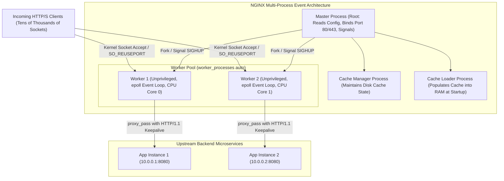

# NGINX Architecture and Reverse Proxy Internals

## TL;DR

NGINX is an open-source, high-performance HTTP web server, reverse proxy, load balancer, and content cache engineered to solve the C10K concurrency challenge.
Unlike process-per-connection or thread-per-connection web servers like Apache HTTP Server, NGINX utilizes an event-driven, asynchronous, non-blocking architecture.
A single Master process manages privileged lifecycle tasks (reading configuration, binding network ports, coordinating zero-downtime upgrades) while spawning a fixed pool of unprivileged Worker processes pinned to CPU cores.
Each worker runs an independent, non-blocking event loop driven by operating system kernel primitives (`epoll` on Linux, `kqueue` on macOS), allowing each worker to sustain tens of thousands of concurrent HTTP connections with minimal memory and CPU context-switching overhead.
Advanced capabilities include upstream connection pooling, layer 7 reverse proxying, microcaching, SSL/TLS termination, and rate limiting.

## Mental Model

NGINX isolates administrative lifecycle tasks in a master process while distributing non-blocking client connection processing across CPU-pinned worker event loops.



## Architectural Internals and Deep Dive

### 1. The Master-Worker Process Model
NGINX strictly separates privileged system administration from unprivileged network socket processing:
- **Master Process**: Runs as the root user. It parses and validates configuration files (`nginx -t`), binds to privileged low-numbered network ports (80, 443), and orchestrates worker lifecycles. It does not handle client network traffic directly.
- **Worker Processes**: Spawned by the master process, dropping privileges to an unprivileged user (e.g., `www-data` or `nobody`). The number of worker processes is configured via `worker_processes auto`, matching the number of physical CPU cores.
- **CPU Pinning (`worker_cpu_affinity`)**: Binds each worker process to a dedicated CPU core. This eliminates OS thread context switching and preserves CPU L1/L2 cache locality.
- **Specialized Cache Processes**:
  - `Cache Loader`: Runs once at startup to scan the on-disk cache directory structure and load metadata into shared memory.
  - `Cache Manager`: Runs periodically to prune expired cache items and enforce disk size thresholds (`max_size`).

### 2. Event-Driven Non-Blocking Event Loops
Traditional web servers (like Apache MPM Prefork) allocate a dedicated thread or process per incoming connection.
When a client requests data or experiences network latency, that thread blocks, consuming 2MB-8MB of stack memory and triggering expensive OS kernel context switches when thousands of clients connect simultaneously.
NGINX eliminates thread-per-connection bottlenecks:
- **Single Thread per Worker**: Each worker runs a single-threaded infinite event loop.
- **Kernel I/O Multiplexing**: Sockets are configured in non-blocking mode. NGINX delegates socket monitoring to OS kernel notification systems:
  - Linux: `epoll` (`epoll_create`, `epoll_ctl`, `epoll_wait`).
  - macOS / FreeBSD: `kqueue` (`kevent`).
  - Solaris: `eventport`.
- When an event occurs (a client connects, data arrives on a socket, or an upstream server responds), the kernel wakes the worker process, which processes the event immediately via a callback and returns to monitoring other sockets.
- A single worker process with a few megabytes of memory easily handles 50,000 concurrent idle keep-alive connections.

### 3. HTTP Request Processing Phases
Inside each worker, an incoming HTTP request traverses an internal state machine consisting of 11 sequential processing phases:
1. `NGX_HTTP_POST_READ_PHASE`: Reads raw client request headers.
2. `NGX_HTTP_SERVER_REWRITE_PHASE`: Executes URI rewrite directives defined at the `server` block level.
3. `NGX_HTTP_FIND_CONFIG_PHASE`: Matches the request URI to a `location` configuration block.
4. `NGX_HTTP_REWRITE_PHASE`: Executes URI rewrite directives defined at the matched `location` level.
5. `NGX_HTTP_POST_REWRITE_PHASE`: Resolves internal redirections resulting from rewrite directives.
6. `NGX_HTTP_PREACCESS_PHASE`: Enforces connection and rate limits (`limit_req`, `limit_conn`).
7. `NGX_HTTP_ACCESS_PHASE`: Validates client authorization (`allow`, `deny`, HTTP Basic Auth).
8. `NGX_HTTP_POST_ACCESS_PHASE`: Verifies access phase results.
9. `NGX_HTTP_PRECONTENT_PHASE`: Evaluates content filters (e.g., try_files).
10. `NGX_HTTP_CONTENT_PHASE`: Generates the response payload (via static file handler, FastCGI, or `proxy_pass`).
11. `NGX_HTTP_LOG_PHASE`: Records transaction metrics to access logs after response transmission.

### 4. Zero-Downtime Configuration Reloads and Binary Upgrades
NGINX supports zero-downtime operations without dropping active TCP connections:
- **Configuration Reload (`nginx -s reload` / `kill -HUP <master_pid>`)**:
  1. Master process re-reads and validates the new configuration file.
  2. Master spawns a new pool of worker processes running the new configuration.
  3. Master sends a `SIGQUIT` (graceful shutdown) signal to the old worker processes.
  4. Old workers stop accepting new connections; they finish servicing existing in-flight connections and terminate cleanly.
- **Binary Upgrade (`kill -USR2 <master_pid>`)**:
  1. Master renames its `.pid` file to `.pid.oldbin`.
  2. Master executes the new NGINX binary, spawning a brand new master process with its own worker pool.
  3. Both NGINX versions run concurrently sharing the bound listen sockets.
  4. Once the new binary is verified, the operator signals the old master with `SIGWINCH` (stops old workers) and `SIGQUIT` (terminates old master).

### 5. Upstream Load Balancing and Connection Pooling
NGINX proxies traffic to upstream server pools defined in `upstream` blocks:
- **Load Balancing Algorithms**:
  - `round-robin` (default): Distributes requests sequentially across backends with optional weights.
  - `least_conn`: Routes requests to the backend with the fewest active connections.
  - `ip_hash`: Hashes the client IPv4/IPv6 address to pin clients to specific backends (session persistence).
  - `hash <key> [consistent]`: Consistent hashing over arbitrary keys (e.g., `$request_uri` or cookie values).
- **Upstream Keepalive Tuning**: By default, NGINX uses HTTP/1.0 without keepalives for upstream connections, opening and closing a new TCP socket per proxied request. To enable upstream connection pooling:
  ```nginx
  upstream backend_nodes {
      server 10.0.0.1:8080;
      server 10.0.0.2:8080;
      keepalive 64; # Maintain up to 64 idle keepalive connections per worker
  }
  
  server {
      location /api/ {
          proxy_pass http://backend_nodes;
          proxy_http_version 1.1;
          proxy_set_header Connection ""; # Clear Connection header to enable keepalive
      }
  }
  ```

### 6. Buffer Management and Microcaching
- **Proxy Buffering**: When `proxy_buffering on;` is enabled, NGINX reads the response from the upstream server as fast as possible and buffers it in memory (`proxy_buffers`). This frees the upstream application server thread instantly, while NGINX handles slowly trickling the response to a high-latency mobile client.
- **Microcaching**: Caching dynamic API responses for brief windows (e.g., 1 to 5 seconds):
  ```nginx
  proxy_cache_path /var/cache/nginx levels=1:2 keys_zone=api_cache:10m max_size=1g inactive=60m;
  
  location /products/ {
      proxy_cache api_cache;
      proxy_cache_valid 200 1s;
      proxy_cache_use_stale error timeout updating http_500 http_502;
  }
  ```
  Microcaching collapses thousands of duplicate database queries during traffic spikes into a single upstream request per second, increasing backend capacity by orders of magnitude.

## Trade-offs and Comparisons

| Dimension | NGINX | HAProxy | Envoy Proxy |
| :--- | :--- | :--- | :--- |
| **Primary Focus** | Web Server, Reverse Proxy, Static Content, Cache | Dedicated Layer 4 & Layer 7 Load Balancer | Cloud-Native Service Mesh Sidecar / Gateway |
| **Process Architecture** | Multi-process (Master + Workers) | Multi-threaded (Single process, thread-per-core) | Multi-threaded (Event-driven worker threads) |
| **Static File Serving** | High performance (`sendfile`, direct I/O) | Incapable (Does not serve local disk files) | Minimal (Optimized for dynamic proxying) |
| **Dynamic Configuration** | Requires reload (`nginx -s reload`) or NGINX Plus API | Runtime CLI (socat) / Dataplane API | Dynamic gRPC Discovery APIs (xDS) native |
| **HTTP/3 (QUIC) Support** | Supported in modern releases (1.25+) | Supported in modern releases (2.6+) | Native HTTP/3 support |
| **Content Caching** | Native disk-backed reverse proxy cache | Basic small response caching | External cache filter integrations |
| **Configuration Syntax** | Declarative block-structured config files | Structured sections (`frontend`, `backend`) | Complex JSON / YAML (Protobuf-defined) |

## Failure Modes and Mitigations

### 1. File Descriptor Exhaustion (`24: Too many open files`)
- *Root Cause*: High concurrent client traffic exhausts available operating system file descriptors for worker processes. Because each proxied connection consumes two file descriptors (one for the client, one for upstream), workers reject connections.
- *Mitigation*: Increase `worker_rlimit_nofile` in `nginx.conf` (e.g., `worker_rlimit_nofile 65535;`); increase OS system limits in `/etc/security/limits.conf` (`nofile 65535`).

### 2. Upstream Connection Thrashing (Ephemeral Port Exhaustion)
- *Root Cause*: Omitting `proxy_http_version 1.1` and `proxy_set_header Connection ""` forces NGINX to establish a brand-new TCP handshake for every proxied request. High QPS exhausts the Linux ephemeral port range, saturating sockets in `TIME_WAIT` and causing `Cannot assign requested address` errors.
- *Mitigation*: Configure upstream `keepalive` directive; set `proxy_http_version 1.1;`; set `proxy_set_header Connection "";`; enable Linux kernel parameter `net.ipv4.tcp_tw_reuse = 1`.

### 3. Buffer Overflow to Temporary Disk Files
- *Root Cause*: Upstream server generates massive responses (e.g., large JSON payloads or reports) exceeding `proxy_buffers` and `proxy_buffer_size`. NGINX writes the excess data to temporary files on disk (`/var/lib/nginx/tmp/proxy`), spiking disk I/O and increasing request latency.
- *Mitigation*: Tune `proxy_buffers 16 32k;` and `proxy_buffer_size 64k;`; stream massive responses or offload downloads directly to Amazon S3 via presigned URLs.

### 4. Worker Thread Blocking via Long-Running Operations
- *Root Cause*: Third-party modules, custom Lua scripts, or blocking disk reads execute inside the worker event loop, freezing the single worker thread and stalling all tens of thousands of concurrent client sockets managed by that worker.
- *Mitigation*: Enable asynchronous file I/O (`aio threads;`); offload blocking operations to dedicated NGINX thread pools (`thread_pool`); ensure Lua code uses non-blocking cosocket APIs.

## Hands-On Verification

### Multi-OS Diagnostic Commands

#### Linux / macOS (NGINX CLI & Process Checks)
```bash
# Test configuration syntax and validity without restarting
nginx -t

# Reload configuration gracefully with zero dropped connections
nginx -s reload

# Inspect master and worker processes, CPU affinity, and parent PIDs
ps -eo pid,ppid,user,%cpu,%mem,command | grep nginx

# Check active NGINX open file descriptors per worker process
ls -l /proc/$(pgrep -f "nginx: worker" | head -n1)/fd | wc -l

# Query NGINX status module for active connections (requires stub_status)
curl -s http://localhost/nginx_status
```

#### Windows (PowerShell)
```powershell
# Verify running NGINX Windows processes
Get-Process -Name nginx -ErrorAction SilentlyContinue

# Test configuration and send stop signal
nginx.exe -t
nginx.exe -s stop
```

### Complete Production NGINX Reverse Proxy Configuration

The following production-grade configuration demonstrates multi-process tuning, security headers, rate limiting, and an upstream keep-alive proxy with microcaching.

```nginx
# /etc/nginx/nginx.conf
user www-data;
worker_processes auto;
worker_cpu_affinity auto;
worker_rlimit_nofile 65535;
pid /run/nginx.pid;

events {
    worker_connections 16384;
    use epoll;
    multi_accept on;
}

http {
    include /etc/nginx/mime.types;
    default_type application/octet-stream;

    # Performance I/O tuning
    sendfile on;
    tcp_nopush on;
    tcp_nodelay on;
    keepalive_timeout 65;
    types_hash_max_size 2048;

    # Rate Limiting Zones (Token Bucket Algorithm)
    limit_req_zone $binary_remote_addr zone=api_limit:10m rate=100r/s;
    limit_conn_zone $binary_remote_addr zone=addr_limit:10m;

    # Microcache Path Setup
    proxy_cache_path /var/cache/nginx/api levels=1:2 keys_zone=microcache:10m max_size=500m inactive=10m;

    # Upstream Backend Pool with Connection Pooling
    upstream backend_api {
        least_conn;
        server 127.0.0.1:8081 max_fails=3 fail_timeout=10s;
        server 127.0.0.1:8082 max_fails=3 fail_timeout=10s;
        keepalive 64; # Keep up to 64 idle HTTP/1.1 connections per worker
    }

    server {
        listen 80;
        server_name api.example.com;

        # Connection Limit: Max 20 concurrent sockets per IP
        limit_conn addr_limit 20;

        location /api/ {
            # Rate limiting with burst buffer
            limit_req zone=api_limit burst=20 nodelay;

            # Reverse proxy directives
            proxy_pass http://backend_api;
            proxy_http_version 1.1;
            proxy_set_header Connection ""; # Mandatory for upstream keepalive
            proxy_set_header Host $host;
            proxy_set_header X-Real-IP $remote_addr;
            proxy_set_header X-Forwarded-For $proxy_add_x_forwarded_for;
            proxy_set_header X-Forwarded-Proto $scheme;

            # Buffer Tuning
            proxy_buffering on;
            proxy_buffer_size 16k;
            proxy_buffers 8 32k;
            proxy_busy_buffers_size 64k;

            # 2-second Microcache for read queries
            proxy_cache microcache;
            proxy_cache_valid 200 2s;
            proxy_cache_use_stale error timeout updating http_500 http_502;
            add_header X-Cache-Status $upstream_cache_status;
        }

        # Stub status for Prometheus metrics scraping
        location /nginx_status {
            stub_status on;
            allow 127.0.0.1;
            deny all;
        }
    }
}
```

### Complete Standalone Simulation: NGINX Non-Blocking Event Loop

The following runnable Python script simulates an NGINX non-blocking event-driven worker using operating system I/O multiplexing (`selectors` module wrapping `epoll` on Linux and `kqueue` on macOS/BSD).
It demonstrates how a single thread accepts concurrent HTTP connections, maintains persistent keepalive states, and processes client requests asynchronously without spawning threads or blocking.

```python
#!/usr/bin/env python3
"""
Simulates the NGINX non-blocking, event-driven worker architecture.
Demonstrates:
- Kernel I/O multiplexing (epoll on Linux / kqueue on macOS)
- Single-threaded event loop handling concurrent HTTP clients
- Asynchronous non-blocking socket state transitions
- Zero-thread concurrency scaling
"""

import selectors
import socket
import threading
import time
from typing import Dict

class SimulatedNGINXWorker:
    def __init__(self, host: str = "127.0.0.1", port: int = 0):
        self.selector = selectors.DefaultSelector()
        self.listen_sock = socket.socket(socket.AF_INET, socket.SOCK_STREAM)
        self.listen_sock.setsockopt(socket.SOL_SOCKET, socket.SO_REUSEADDR, 1)
        self.listen_sock.bind((host, port))
        self.listen_sock.listen(128)
        self.listen_sock.setblocking(False)
        self.port = self.listen_sock.getsockname()[1]

        # Register server listening socket for incoming connection events
        self.selector.register(self.listen_sock, selectors.EVENT_READ, self._accept_callback)
        self.running = True
        self.requests_served = 0

    def _accept_callback(self, sock: socket.socket, mask: int):
        conn, addr = sock.accept()
        conn.setblocking(False)
        # Register new client socket for non-blocking read readiness
        self.selector.register(conn, selectors.EVENT_READ, self._read_callback)

    def _read_callback(self, conn: socket.socket, mask: int):
        try:
            data = conn.recv(4096)
            if data:
                self.requests_served += 1
                # Format minimal HTTP/1.1 keepalive response
                payload = b"HTTP/1.1 200 OK\r\nContent-Type: text/plain\r\nContent-Length: 14\r\nConnection: close\r\n\r\nHello from NGINX!"
                conn.sendall(payload)
        except ConnectionResetError:
            pass
        finally:
            self.selector.unregister(conn)
            conn.close()

    def process_events(self, timeout: float = 0.05):
        events = self.selector.select(timeout=timeout)
        for key, mask in events:
            callback = key.data
            callback(key.fileobj, mask)

def main():
    worker = SimulatedNGINXWorker()
    print(f"NGINX Worker Event Loop initialized on port {worker.port} using {type(worker.selector).__name__}")

    # Run worker event loop in background thread for verification test
    worker_thread = threading.Thread(
        target=lambda: [worker.process_events() for _ in range(30)],
        daemon=True
    )
    worker_thread.start()

    # Simulate 5 concurrent non-blocking client requests
    for i in range(5):
        client = socket.socket(socket.AF_INET, socket.SOCK_STREAM)
        client.connect(("127.0.0.1", worker.port))
        client.sendall(b"GET / HTTP/1.1\r\nHost: localhost\r\n\r\n")
        response = client.recv(1024)
        assert b"200 OK" in response
        client.close()

    time.sleep(0.2)
    print(f"Verification Successful: Handled {worker.requests_served} concurrent HTTP requests with 0 worker threads spawned.")

if __name__ == "__main__":
    main()
```

## Performance Characteristics and Capacity Planning

### 1. Connection Capacity Sizing Formula
Total simultaneous connection capacity across an NGINX server is bounded by worker processes and worker connection limits:

$$\text{MaxClientConnections} = \frac{\text{worker\_processes} \times \text{worker\_connections}}{\text{ConnectionsPerRequest}}$$

In reverse proxy mode, each client request consumes 2 connections (1 client-facing socket + 1 upstream socket):

$$\text{MaxConcurrentProxiedClients} = \frac{\text{worker\_processes} \times \text{worker\_connections}}{2}$$

For a server with 16 CPU cores (`worker_processes 16`) and `worker_connections 16384`:

$$\text{MaxProxiedClients} = \frac{16 \times 16384}{2} = 131,072 \text{ concurrent clients}$$

### 2. Operating System Socket Buffer RAM Math
Each active TCP connection consumes kernel memory for receive and send buffers:
- With default buffer allocations ($\approx 16\text{KB}$ receive, $16\text{KB}$ send = $32\text{KB}$ per socket):
- For 100,000 active reverse proxied connections (200,000 total sockets):

$$\text{KernelSocketRAM} = 200,000 \times 32\text{KB} \approx 6.4\text{GB of physical RAM}$$

Ensure server physical memory accounts for kernel TCP buffer allocations alongside application memory.

## In Production: Real-World Case Studies

### 1. Cloudflare's Edge Proxy Architecture
Cloudflare historically deployed NGINX across tens of thousands of edge edge nodes worldwide:
- **Custom Lua Ecosystem**: Embedded OpenResty (LuaJIT) inside NGINX worker loops to execute dynamic WAF rules, DDoS mitigation, and SSL termination directly within the `NGX_HTTP_ACCESS_PHASE`.
- **Epoll at Massive Scale**: Single bare-metal edge servers sustained hundreds of thousands of concurrent TLS handshakes simultaneously using NGINX non-blocking event loops before eventually migrating to their internal Rust proxy (Pingora).

### 2. Netflix Zero-Downtime TLS Infrastructure
Netflix utilizes NGINX reverse proxies to terminate TLS traffic for millions of concurrent streaming video clients:
- **Session Ticket Caching**: Configured shared-memory TLS session ticket caching across workers to maximize TLS resumption rates and reduce CPU cryptographic handshake overhead.
- **Microcaching Manifests**: Cached video streaming manifest files (`.mpd` / `.m3u8`) for 1-second intervals, absorbing traffic spikes during global prime-time viewership surges.

## Staff+ Interview Questions

> [!question]
> Why does NGINX's event-driven architecture handle concurrent connections with vastly less memory and CPU overhead than Apache's MPM Prefork or Worker models?

> [!success]- Answer
> Apache MPM Prefork allocates an entire OS process per incoming connection, and MPM Worker allocates a dedicated OS thread per connection. When thousands of connections are open (such as slow clients or keepalive connections), Apache allocates dedicated stack memory (2MB-8MB per thread) and forces the Linux kernel to continuously context-switch across thousands of threads, saturating CPU caches and exhausting memory. NGINX utilizes a single-threaded event loop per worker process based on OS I/O multiplexing (`epoll` on Linux, `kqueue` on macOS). Sockets are non-blocking: when a client connects or waits, NGINX registers the file descriptor with `epoll` and consumes zero CPU cycles and zero thread stack space. The worker awakens only when data is ready on a socket, processes the request via an internal state machine callback, and immediately handles the next event. A single NGINX worker process with a few megabytes of memory easily sustains 50,000 concurrent connections.

> [!question]
> How does NGINX achieve zero-downtime configuration reloads (`nginx -s reload`), and what happens to active in-flight requests during the reload?

> [!success]- Answer
> When `nginx -s reload` is executed, the CLI sends a `SIGHUP` signal to the Master process. The master process re-reads and parses the configuration file. If a syntax or validation error occurs, the master logs the error and aborts, leaving existing workers running undisturbed. If the new configuration is valid, the master spawns a brand new pool of worker processes running the new configuration. The master then sends a `SIGQUIT` signal (graceful shutdown) to the old worker processes. Upon receiving `SIGQUIT`, the old workers immediately close their listening sockets (so they accept zero new connections), but continue servicing existing active, in-flight connections. Once an old worker finishes servicing all its pending client requests, it exits cleanly. This guarantees zero dropped connections and seamless configuration cutover.

> [!question]
> Why does NGINX use HTTP/1.0 by default for upstream connections, and what specific directives are required to enable persistent connection pooling to backend microservices?

> [!success]- Answer
> By default, NGINX's `ngx_http_proxy_module` communicates with upstream servers using HTTP/1.0 and sets the `Connection: close` header. This design originated historically when backends were local FastCGI or single-threaded CGI scripts that could not handle persistent connections. In modern microservice architectures, this causes NGINX to open and close a new TCP connection for every single proxied request, causing TCP handshake latency spikes and ephemeral port exhaustion. To enable persistent upstream connection pooling, two configurations are mandatory: (1) configure an `upstream` block with the `keepalive` directive (e.g., `keepalive 64;`) to maintain an idle connection pool per worker; and (2) inside the `location` block, explicitly specify `proxy_http_version 1.1;` and clear the connection header using `proxy_set_header Connection "";`. This allows NGINX to reuse persistent HTTP/1.1 TCP connections across multiple client requests.

> [!question]
> What is `worker_cpu_affinity` in NGINX, and why does pinning worker processes to specific CPU cores improve network throughput?

> [!success]- Answer
> `worker_cpu_affinity` instructs the operating system scheduler to bind each NGINX worker process to a dedicated physical CPU core (e.g., Worker 1 to Core 0, Worker 2 to Core 1). In standard multi-core systems, the OS scheduler frequently migrates running processes across different CPU cores to balance load. Every time a worker process migrates to a different core, the data stored in the processor's L1 and L2 CPU caches becomes cold, forcing expensive cache invalidations and memory bus reloads. Pinning workers to specific cores ensures that CPU caches remain hot, eliminates inter-core context switching overhead, and maximizes instruction pipeline efficiency, improving network packet processing throughput by 15-30% under heavy load.

> [!question]
> How does Proxy Buffering work in NGINX (`proxy_buffering on`), and why does it protect upstream application servers from slow mobile clients?

> [!success]- Answer
> When Proxy Buffering is enabled, NGINX reads the entire HTTP response generated by the upstream application server as quickly as the backend can produce it, buffering the payload in memory (`proxy_buffers`) and writing to temporary disk files if the response exceeds buffer limits. As soon as NGINX reads the complete response, it closes the upstream connection or returns it to the keepalive pool, freeing the upstream application thread (e.g., Python Gunicorn worker or Java thread) to service the next request. NGINX then takes over the task of slowly transmitting the response data over high-latency, packet-loss-prone mobile client connections. Without proxy buffering, the upstream application thread would remain blocked in a send loop for seconds waiting for the slow client to acknowledge TCP packets, bottlenecking backend application capacity.

> [!question]
> Explain the Token Bucket rate-limiting algorithm implemented by NGINX's `limit_req` module. What is the difference between `burst` and `nodelay`?

> [!success]- Answer
> NGINX implements the Leaky Bucket / Token Bucket rate-limiting algorithm via `limit_req_zone`. When configured with `rate=10r/s`, NGINX allows one request every 100 milliseconds. If a client sends 5 requests simultaneously: without `burst`, NGINX processes the first request and immediately rejects the remaining 4 with HTTP 503 (Too Many Requests). The `burst` parameter (e.g., `burst=20`) allocates a buffer queue: excess requests are accepted and queued rather than dropped. By default, queued burst requests are delayed and dispatched strictly at the configured rate (1 every 100ms), increasing client latency. Adding the `nodelay` flag changes this: NGINX processes all burst requests immediately without artificial delays, but still tracks the rate window in memory; any subsequent request arriving before the burst bucket drains is rejected with HTTP 503.

> [!question]
> What is NGINX "Microcaching", and how does it protect backend database infrastructure during sudden viral traffic surges?

> [!success]- Answer
> Microcaching is the technique of caching dynamic, frequently changing API responses or web pages for extremely brief intervals (typically 1 to 5 seconds) via `proxy_cache_valid 200 1s;`. When a massive viral traffic surge hits (e.g., 50,000 requests per second targeting the identical breaking news article or product page), without caching, all 50,000 requests hit the backend application and database simultaneously, causing connection exhaustion and cascading outages. With a 1-second microcache, NGINX sends exactly 1 request per second to the backend server to populate the cache, and serves the remaining 49,999 requests directly from in-memory cache with sub-millisecond latency. To ensure backends are never overwhelmed during cache refreshes, configuring `proxy_cache_use_stale updating;` instructs NGINX to continue serving the stale cached response while a single background worker fetches the update.

> [!question]
> Under what conditions does NGINX log error code `24: Too many open files`, and what two configuration layers must be adjusted to resolve it?

> [!success]- Answer
> Error code `24: Too many open files` occurs when an NGINX worker process attempts to open a network socket or file descriptor, but exceeds the maximum allowable file descriptor limit set by the operating system kernel or process configuration. In a reverse proxy, each active connection requires two file descriptors (client socket + upstream socket), plus open handles for logs and disk cache files. To resolve this error, changes are required at two layers: (1) NGINX Configuration: set `worker_rlimit_nofile` in the main block of `nginx.conf` (e.g., `worker_rlimit_nofile 65535;`), which instructs the master process to raise the soft/hard limits for worker processes via `setrlimit()`; and (2) Operating System Configuration: raise the system-wide limits in `/etc/security/limits.conf` (`* soft nofile 65535`, `* hard nofile 65535`) and verify kernel limits via `sysctl -w fs.file-max=2097152`.

> [!question]
> What is the Linux kernel `SO_REUSEPORT` socket option, and how does it eliminate the classic NGINX worker "thundering herd" and lock contention problem?

> [!success]- Answer
> Historically, all NGINX worker processes shared a single listening socket file descriptor inherited from the root master process. When a new incoming TCP connection arrived, the Linux kernel woke up all worker processes monitoring that descriptor via `epoll_wait`, but only one worker could successfully execute `accept()`, while all other workers received `EAGAIN` - a classic thundering herd that wasted CPU cycles and degraded performance. NGINX initially mitigated this with an application-level mutex (`accept_mutex`), forcing workers to take turns acquiring the socket, which introduced severe serialization lock contention under high connection velocity. The `SO_REUSEPORT` socket option (introduced in Linux 3.9) resolves this fundamentally at the kernel level: it allows each NGINX worker process to bind its own independent listening socket to the exact same IP address and port. The Linux kernel network stack computes a 4-tuple hash of incoming SYN packets and distributes new connections directly to the specific worker socket without lock contention or cross-worker awakening, increasing connection establishment throughput linearly with CPU core count.

> [!question]
> Explain the internal mechanics of TLS session resumption in NGINX. What is the difference between SSL Session IDs (`ssl_session_cache`) and SSL Session Tickets (`ssl_session_tickets`), and what are the security trade-offs of distributed ticket rotation?

> [!success]- Answer
> Full TLS handshakes require 2 round trips and expensive asymmetric cryptographic operations (RSA/ECDHE), consuming significant CPU. Session resumption shortens subsequent handshakes to 1 RTT (or 0-RTT in TLS 1.3). SSL Session IDs cache the negotiated symmetric encryption keys and session parameters in an NGINX shared memory zone (`ssl_session_cache shared:SSL:50m`). The server returns a 32-byte Session ID to the client. On reconnection, the client presents the Session ID, and NGINX resumes the session from RAM without asymmetric crypto. However, Session IDs cannot be shared across multiple server machines without external shared caches. SSL Session Tickets (RFC 5077) shift state storage to the client: the server encrypts the session state with a secret Session Ticket Encryption Key (STEK) and sends it to the client as an opaque ticket. On reconnection, the client sends the ticket back; any NGINX server in the cluster sharing the same STEK decrypts the ticket and resumes the session without maintaining server-side state. The security danger: if an attacker compromises the static STEK, they can decrypt all historical TLS sessions (violating forward secrecy). Production systems must configure automated STEK key rotation (e.g., rotating active encryption keys every 1-6 hours and retaining old decryption keys for 24 hours).

## Related Concepts and Wikilinks

- [[HAProxy-Architecture]] - Direct architectural comparison with HAProxy dedicated load balancer.
- [[Load-Balancing]] - Core layer 4 and layer 7 load balancing algorithms.
- [[HTTP-Evolution-HTTP1-HTTP2-HTTP3]] - HTTP protocol parsing, multiplexing, and TLS termination.
- [[Docker-and-Container-Runtimes]] - Deploying NGINX as ingress and reverse proxy in container runtimes.
- [[Kubernetes-Architecture]] - NGINX Ingress Controller and Gateway API implementations.
- [[API-Fundamentals]] - Reverse proxy gateways, rate limiting, and SSL termination.

## Further Reading and References

- Aivaliotis, Dimitri. *Mastering NGINX* (2nd Edition). Packt Publishing, 2016.
- Sysoev, Igor. *The Architecture of Open Source Applications: NGINX*. 2012.
- Reese, Will. "NGINX: The High-Performance Reverse Proxy." *Linux Journal*, 2008.
- NGINX Inc. *NGINX Tuning For Best Performance*. F5 Technical Whitepaper, 2023.
- Graham-Cumming, John. "How Cloudflare Configures NGINX for Scale." Cloudflare Engineering Blog, 2018.
