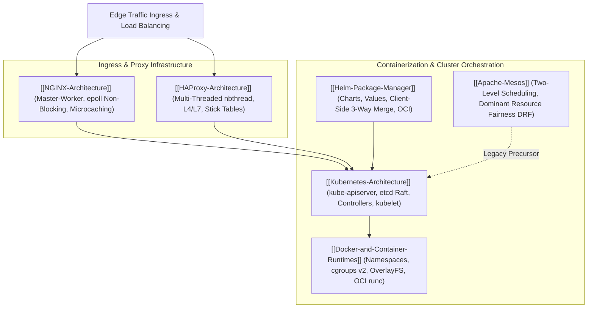

# Infrastructure and Container Orchestration

## Map of Content

Modern distributed infrastructure coordinates thousands of containerized workloads, routes network traffic through low-latency reverse proxies, and enforces declarative self-healing across cluster environments.
This module covers edge routing engines, container isolation runtimes, declarative control planes, package management, and multi-tenant resource schedulers.

## Core Knowledge Areas

### 1. Ingress and Load Balancing Proxies
- [[NGINX-Architecture]]: Master-worker multi-process architecture, non-blocking I/O event loops (`epoll`/`kqueue`), HTTP request processing state machine, upstream connection pooling, proxy buffering, and microcaching.
- [[HAProxy-Architecture]]: Multi-threaded event-driven engine (`nbthread`), Layer 4 TCP stream forwarding vs Layer 7 HTTP inspection, in-memory Stick Tables for real-time tracking and DDoS mitigation, active/passive health checks, and seamless master-worker socket migration.

### 2. Containerization and Low-Level Runtimes
- [[Docker-and-Container-Runtimes]]: Linux kernel namespaces (PID, NET, MNT, USER), cgroups v2 resource accounting, Copy-on-Write OverlayFS union mounts, OCI runtime specifications, `containerd-shim` process decoupling, and BuildKit DAG image construction.

### 3. Container Orchestration and Declarative Control Planes
- [[Kubernetes-Architecture]]: Control plane architecture (`kube-apiserver`, `etcd`, `kube-scheduler`, `kube-controller-manager`), node agents (`kubelet`, `kube-proxy`), flat Pod-to-Pod CNI networking, CoreDNS service discovery, Services (ClusterIP, NodePort, LoadBalancer), and Horizontal Pod Autoscaling (HPA).
- [[Helm-Package-Manager]]: Kubernetes package management, Chart anatomy, removal of Tiller in Helm 3, Go template rendering with Sprig functions, Secrets-backed release revisions, 3-way strategic merge patch rollbacks, and lifecycle hooks.
- [[Apache-Mesos]]: Two-level resource offer scheduling architecture, Dominant Resource Fairness (DRF) multi-resource allocation algorithm, framework ecosystems (Marathon, Chronos, Spark), ZooKeeper master election, and the architectural postmortem on why Kubernetes eclipsed Mesos.

## Orchestration & Infrastructure Comparison Matrix

| Technology | Primary Purpose | Architectural Model | State Storage | Core Isolation / Execution Primitive |
| :--- | :--- | :--- | :--- | :--- |
| **NGINX** | Web server, reverse proxy, cache | Master-Worker multi-process event loop | In-memory shared zones, disk cache | epoll / kqueue non-blocking socket multiplexing |
| **HAProxy** | Dedicated L4/L7 load balancer | Single process multi-threaded (`nbthread`)| In-memory Stick Tables (Zero disk I/O) | Lock-free task scheduler across CPU cores |
| **Docker / containerd** | Container packaging & local runtime | High-level daemon (`containerd`) + `runc` | Disk image layers (OverlayFS) | Linux Namespaces, cgroups v2, Seccomp profiles |
| **Kubernetes** | Declarative container orchestration | Stateless apiserver + autonomous controllers | Distributed consensus (`etcd` via Raft) | Pods (Shared network and IPC namespaces) |
| **Helm** | Kubernetes package manager | Client-side template rendering CLI | Versioned Kubernetes Secrets per namespace | Go template engine (`text/template` + Sprig) |
| **Apache Mesos** | Datacenter kernel / multi-framework | Two-level scheduling via Resource Offers | Soft state (Rebuilt from agents dynamically) | Linux cgroups via native Mesos Containerizer |

## Study and Interview Roadmap

1. Understand the exact mechanism by which non-blocking event loops (`epoll`) allow NGINX and HAProxy to handle 100,000 concurrent sockets without thread-per-connection memory bloat.
2. Master the difference between Linux Namespaces (visibility boundaries) and Control Groups (resource limits), and explain the role of `containerd-shim`.
3. Be prepared to explain the complete lifecycle of a Kubernetes Pod from `kubectl apply` through `etcd` persistence, scheduler filtering/scoring, and `kubelet` CRI execution.
4. Understand why Helm 3 eliminated Tiller and how the 3-Way Strategic Merge Patch algorithm preserves live cluster modifications.
