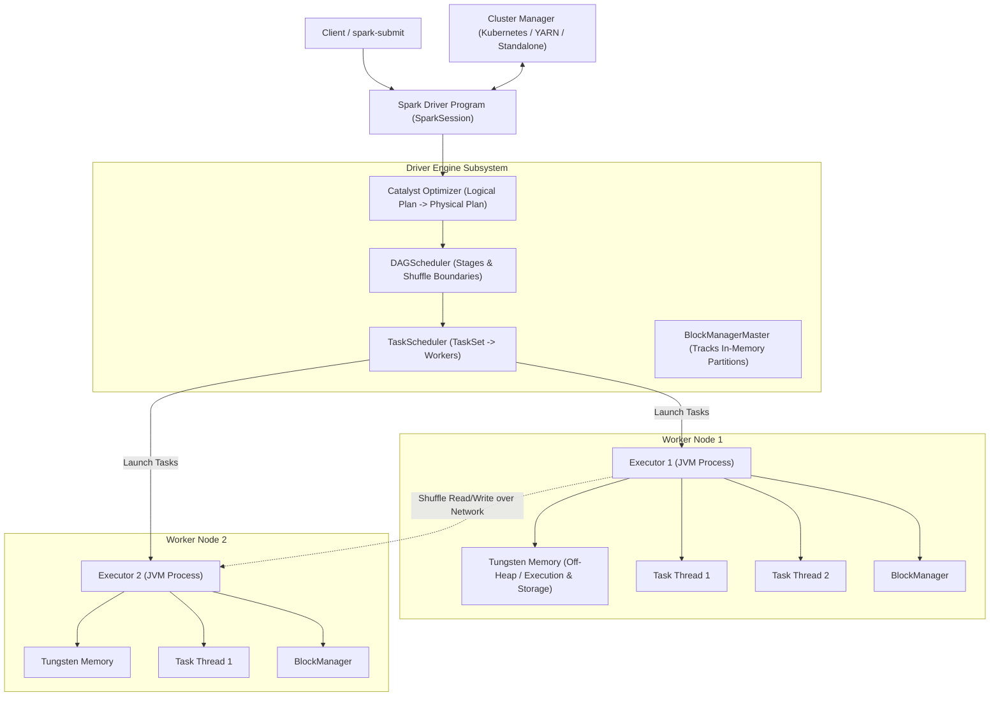

# Apache Spark Architecture and In-Memory Computing

## TL;DR

Apache Spark is an open-source, distributed general-purpose cluster computing engine engineered for high-throughput, in-memory data analytics, SQL processing, machine learning, and stream processing.
Spark solves the fundamental I/O bottleneck of classic Hadoop MapReduce by retaining intermediate computation state in RAM across iterations using Resilient Distributed Datasets (RDDs).
Fault tolerance is achieved through RDD Lineage graphs (Directed Acyclic Graphs - DAGs), which allow lost partitions to be reconstructed on-demand from upstream parents without requiring expensive disk replication.
The execution pipeline is coordinated by the Driver program, which compiles high-level code through the Catalyst Optimizer and Project Tungsten into optimized native Java bytecode.
Workloads execute across worker node Executors in parallel, communicating shuffle partitions across stage boundaries.

## Mental Model

Spark compiles high-level declarative transformations into an in-memory execution DAG, scheduling pipelined task stages across distributed worker executors.



## Architectural Internals and Deep Dive

### 1. The Core Distributed Runtime: Driver, Cluster Manager, and Executors
Spark executes as an independent set of processes coordinated by the central Driver program:
- **Driver Program**: The central controller running the `SparkSession` / `SparkContext`.
  - Analyzes user code, constructs the execution graph, converts transformations into physical stages, schedules tasks, and coordinates fault recovery.
- **Cluster Manager**: Pluggable resource negotiator (Kubernetes, Hadoop YARN, Apache Mesos, or Spark Standalone) that provisions compute instances and launches executor containers.
- **Executors**: Distributed worker processes running inside JVM containers on cluster nodes.
  - Execute assigned tasks in multi-threaded thread pools.
  - Maintain the in-memory storage for cached RDDs and DataFrames (`BlockManager`).
  - Read and write shuffle files to local disk during wide transformations.

### 2. Resilient Distributed Datasets (RDD) and Lineage DAGs
The core programming abstraction in Spark is the Resilient Distributed Dataset (RDD):
- **Immutable and Partitioned**: A collection of data records partitioned across cluster nodes that cannot be modified once created.
- **Lazy Evaluation**: Transformations (e.g., `map()`, `filter()`, `flatMap()`) are lazy; they do not compute data immediately.
  They simply record the operation in an internal execution graph.
- **Actions Trigger Execution**: Only an Action (e.g., `count()`, `collect()`, `saveAsTextFile()`) forces Spark to compile the lineage graph and execute cluster computation.
- **Fault Tolerance via Lineage**: Rather than replicating gigabytes of data across multiple servers (like HDFS), Spark records the exact mathematical sequence of transformations that created each partition (the Lineage DAG).
  If a worker node crashes and loses Partition 4, the Driver simply re-executes the upstream transformations for Partition 4 alone on an available worker, recovering state without cluster-wide checkpointing.

```
+---------------+     map()      +---------------+    filter()    +---------------+
| Input Data    | -------------> | RDD 1         | -------------> | RDD 2         |
| (HDFS / S3)   | (Narrow Dep)   | (In-Memory)   | (Narrow Dep)   | (In-Memory)   |
+---------------+                +---------------+                +---------------+
                                                                          |
                                                                   groupByKey() (Wide Dep)
                                                                          | Shuffle Boundary
                                                                          v
                                                                  +---------------+
                                                                  | RDD 3         |
                                                                  | (Stage 2)     |
                                                                  +---------------+
```

### 3. Dependencies and Stage Boundaries: Narrow vs Wide
The `DAGScheduler` divides the execution graph into distinct Stages based on dependency types:
- **Narrow Dependencies**: Each partition of the parent RDD is used by at most one partition of the child RDD (e.g., `map()`, `filter()`).
  - Can be pipelined together: Spark collapses all consecutive narrow transformations into a single execution task running in memory without disk I/O or network transfers.
- **Wide Dependencies (Shuffle Dependencies)**: Multiple child partitions depend on data distributed across multiple parent partitions (e.g., `groupByKey()`, `reduceByKey()`, `join()`).
  - Requires a full data Shuffle: executors must write intermediate data to local disk, sort by key, and transfer data across the network to downstream executors.
  - Represents a hard Stage Boundary: Stage 2 cannot begin until all tasks in Stage 1 have completed their shuffle writes.

### 4. Catalyst Optimizer: Declarative Query Optimization
Spark SQL and DataFrames utilize the Catalyst Optimizer to compile declarative queries into high-performance physical plans through four sequential phases:
1. **Analysis**: Resolves table names, column types, and relations against the internal metadata Catalog.
2. **Logical Optimization**: Applies rule-based optimizations, including:
   - *Predicate Pushdown*: Pushes `WHERE` filters directly to the storage layer (Parquet/ORC) so non-matching row groups are skipped before loading into RAM.
   - *Projection Pruning*: Drops unused columns from disk reads, eliminating memory allocations.
3. **Physical Planning**: Generates multiple candidate physical execution strategies (e.g., evaluating Broadcast Hash Join vs Sort-Merge Join) and selects the lowest-cost plan via a Cost-Based Optimizer (CBO).
4. **Code Generation**: Compiles the winning physical plan into native Java bytecode using Janino.

### 5. Project Tungsten: Hardware-Level Execution Efficiency
In early Spark versions, processing millions of JVM objects incurred severe performance bottlenecks:
- Java object headers consumed 16 bytes per record.
- Garbage Collection (GC) sweeps caused frequent multi-second stop-the-world pauses.
- CPU caches experienced severe L1/L2 misses due to pointer-chasing across scattered heap memory.

Project Tungsten overhauled Spark's execution engine around hardware-level efficiency:
- **Off-Heap Memory Management (Unsafe)**: Bypasses the JVM garbage collector entirely.
  Spark manages memory manually as raw binary byte arrays using `sun.misc.Unsafe`.
  Data is stored in compact, C-style binary row formats, eliminating 80% of JVM memory overhead and eradicating GC pauses.
- **Cache-Aware Computation**: Formats binary records contiguously in CPU L1/L2/L3 cache lines, maximizing hardware memory bandwidth.
- **Whole-Stage Code Generation**: Collapses entire multi-operator query pipelines into a single tight, unrolled loop in synthesized Java bytecode.
  Instead of using virtual function calls between operators, the loop processes millions of rows entirely within CPU registers.

### 6. Shuffle Service and Memory Layout
Executor memory is dynamically shared between Execution and Storage:
- **Unified Memory Manager**: Memory is divided into Storage Memory (caching DataFrames and broadcast variables) and Execution Memory (shuffle buffers, joins, aggregations).
- If execution memory requires space, it can evict cached storage blocks to disk, ensuring queries do not fail with OOM during heavy shuffles.
- **External Shuffle Service**: Runs as an independent auxiliary daemon on worker nodes.
  During a shuffle, downstream executors fetch shuffle files from the External Shuffle Service rather than the producing Executor JVM.
  This allows the producing Executor to be killed or garbage-collected during dynamic resource allocation without losing its shuffle data.

### 7. Structured Streaming
Spark Structured Streaming provides unified batch and stream processing built on the Catalyst engine:
- Treats live streaming data as an Unbounded Table where incoming records are appended continuously.
- **Watermarking**: Bounded event-time tracking that drops data arriving later than a configured delay threshold (`withWatermark("timestamp", "10 minutes")`), preventing state stores from growing infinitely.
- **Triggers**: Supports Micro-Batching (default: processes batches every few hundred milliseconds) and Continuous Processing (sub-millisecond streaming using low-latency pipelining).

## Trade-offs and Comparisons

| Dimension | Apache Spark | Hadoop MapReduce | Apache Flink |
| :--- | :--- | :--- | :--- |
| **Execution Model** | In-Memory DAG pipeline | Multi-stage disk-spilling batch | True event-by-event streaming engine |
| **Processing Speed** | 10x - 100x faster than MapReduce | Slow (Disk I/O and serialization bound) | Faster than Spark for sub-second streaming |
| **Streaming Latency** | 100ms - 500ms (Micro-batching default)| Incapable (Batch processing only) | Single-digit milliseconds (Native event streaming) |
| **Memory Management** | Tungsten off-heap memory + JVM heap | Standard JVM heap | Custom off-heap managed memory |
| **Language Support** | Scala, Python (PySpark), Java, SQL, R | Java, Streaming (any language) | Java, Scala, Python, SQL |
| **Fault Recovery** | RDD Lineage recomputation | Replays map/reduce tasks from disk splits | Distributed Chandy-Lamport state checkpoints |
| **Ecosystem Integration** | Spark SQL, MLlib, GraphX, Streaming | Hive, Pig, Mahout | Flink SQL, CEP (Complex Event Processing) |

## Failure Modes and Mitigations

### 1. Data Skew in Joins and Groupings
- *Root Cause*: Uneven data distribution (e.g., 90% of web events belong to a null user ID or celebrity account).
  During a `join` or `groupByKey`, all skewed records hash to a single partition, forcing a single executor task to process gigabytes of data while all other executors idle, causing severe job run-time inflation.
- *Mitigation*: Enable Adaptive Query Execution (`spark.sql.adaptive.enabled = true` and `spark.sql.adaptive.skewJoin.enabled = true`), which automatically splits skewed shuffle partitions into smaller sub-partitions; manually salt join keys with random integer suffixes.

### 2. Executor Out-Of-Memory (OOM) Errors (`Container killed by YARN/K8s for exceeding memory limits`)
- *Root Cause*: Heavy shuffles or broad partition scans cause off-heap memory or Python runner processes (PySpark) to exceed the allocated container memory boundary (`spark.executor.memory + spark.executor.memoryOverhead`).
- *Mitigation*: Increase off-heap overhead (`spark.executor.memoryOverhead = 1024m` or 20% of executor memory); increase shuffle partition count (`spark.sql.shuffle.partitions = 500`); avoid calling `collect()` on large datasets on the Driver.

### 3. Disk Space Exhaustion via Shuffle Spills
- *Root Cause*: High data volume during wide transformations exceeds available execution RAM, forcing executors to spill intermediate partitions to local worker disk (`/tmp` or scratch volumes), filling disk drives and crashing nodes.
- *Mitigation*: Re-partition data across more partitions (`repartition()`); configure dedicated fast NVMe scratch drives for `spark.local.dir`; monitor `Spill (Memory)` and `Spill (Disk)` in the Spark UI.

### 4. PySpark Serialization Bottlenecks
- *Root Cause*: Using raw Python user-defined functions (UDFs) forces Spark to serialize data back and forth between the JVM executor and a separate Python worker process over local sockets, destroying Tungsten whole-stage code generation.
- *Mitigation*: Use native Spark SQL functions; use vectorized Pandas UDFs / PyArrow (`@pandas_udf`), which serialize data in Apache Arrow columnar memory format, reducing serialization overhead by $10\times$.

## Hands-On Verification

### Multi-OS Diagnostic Commands

#### Linux / macOS (Spark CLI & UI)
```bash
# Submit a Spark application to a local cluster with 4 executor threads
spark-submit \
  --master local[4] \
  --driver-memory 2g \
  --executor-memory 2g \
  --conf spark.sql.shuffle.partitions=8 \
  my_analytics_job.py

# Inspect live Spark execution DAG and stage metrics (Spark UI default port)
curl -s http://localhost:4040/api/v1/applications

# Inspect stage-level task completion and shuffle read/write bytes
curl -s http://localhost:4040/api/v1/applications/<APP_ID>/stages | jq .
```

#### Windows (PowerShell)
```powershell
# Verify PySpark or Spark submit script execution
spark-submit.cmd --version

# Query Spark Web UI port status
Test-NetConnection -ComputerName localhost -Port 4040
```

### Pure Python 3 Standard-Library Spark & Catalyst Simulation

The following self-contained script simulates Spark's execution engine without external dependencies:
- **Tungsten Binary Layout**: Encodes rows into contiguous byte arrays using `struct.pack`, eliminating JVM object overhead.
- **Catalyst Optimizer**: Implements rule-based AST transformations (Predicate Pushdown and Column Pruning).
- **RDD Lineage DAG**: Models Narrow (`map`, `filter`) and Wide (`reduce_by_key`) dependencies with Map-Side Combining.
- **Lineage-Based Fault Tolerance**: Simulates a worker crash by destroying cached partition data and deterministically reconstructing it from parent RDD lineage.

```python
"""
Simulated Apache Spark Cluster and Catalyst Engine Architecture
Pure Python 3 standard library simulation demonstrating:
1. Tungsten-style binary row packing (compact off-heap memory representation)
2. Catalyst rule-based optimization (Predicate Pushdown and Column Pruning)
3. RDD Lineage DAG with Narrow vs Wide dependencies and Map-Side Combiner
4. Lineage-based fault-tolerance recomputing lost partition state
"""

import struct
from typing import List, Dict, Any, Callable, Optional


# --- 1. Project Tungsten: Binary Row Layout ---
class TungstenBinaryRow:
    """
    Simulates Tungsten off-heap compact binary row format.
    Instead of Python object headers (dict/class overhead), records are packed
    into contiguous byte arrays with fixed-width fields and variable-length offsets.
    Format:
    [null_bitmask: 1 byte][order_id: 8 bytes (int64)][amount: 8 bytes (double)][category_len: 2 bytes][category_bytes: N]
    """
    __slots__ = ("data",)

    def __init__(self, order_id: int, amount: float, category: str):
        cat_bytes = category.encode("utf-8")
        fmt = f"<BqdH{len(cat_bytes)}s"
        null_mask = 0
        self.data = struct.pack(fmt, null_mask, order_id, amount, len(cat_bytes), cat_bytes)

    @property
    def order_id(self) -> int:
        return struct.unpack_from("<q", self.data, 1)[0]

    @property
    def amount(self) -> float:
        return struct.unpack_from("<d", self.data, 9)[0]

    @property
    def category(self) -> str:
        cat_len = struct.unpack_from("<H", self.data, 17)[0]
        cat_bytes = struct.unpack_from(f"<{cat_len}s", self.data, 19)[0]
        return cat_bytes.decode("utf-8")

    def byte_size(self) -> int:
        return len(self.data)


# --- 2. RDD Lineage and Distributed DAG ---
class SimulatedRDD:
    _id_counter = 0

    def __init__(self, parents: Optional[List["SimulatedRDD"]] = None, dep_type: str = "narrow", name: str = "RDD"):
        SimulatedRDD._id_counter += 1
        self.id = SimulatedRDD._id_counter
        self.name = f"{name}_{self.id}"
        self.parents = parents or []
        self.dep_type = dep_type  # "narrow" or "wide"
        self._cached_partitions: Optional[Dict[int, List[Any]]] = None

    def get_partitions(self) -> List[int]:
        raise NotImplementedError

    def compute(self, partition_id: int) -> List[Any]:
        if self._cached_partitions is not None and partition_id in self._cached_partitions:
            return self._cached_partitions[partition_id]
        return self._compute_internal(partition_id)

    def _compute_internal(self, partition_id: int) -> List[Any]:
        raise NotImplementedError

    def cache(self):
        self._cached_partitions = {}
        for pid in self.get_partitions():
            self._cached_partitions[pid] = self._compute_internal(pid)
        return self

    def invalidate_partition(self, partition_id: int):
        """Simulate worker memory failure or cache eviction."""
        if self._cached_partitions is not None and partition_id in self._cached_partitions:
            del self._cached_partitions[partition_id]

    def map(self, func: Callable[[Any], Any]) -> "MappedRDD":
        return MappedRDD(self, func)

    def filter(self, predicate: Callable[[Any], bool]) -> "FilteredRDD":
        return FilteredRDD(self, predicate)

    def reduce_by_key(self, reduce_func: Callable[[Any, Any], Any], num_partitions: int = 2) -> "ReducedByKeyRDD":
        return ReducedByKeyRDD(self, reduce_func, num_partitions)

    def collect(self) -> List[Any]:
        results = []
        for pid in self.get_partitions():
            results.extend(self.compute(pid))
        return results

    def count(self) -> int:
        return sum(len(self.compute(pid)) for pid in self.get_partitions())


class ParallelCollectionRDD(SimulatedRDD):
    def __init__(self, data: List[Any], num_partitions: int = 2):
        super().__init__(parents=[], dep_type="none", name="ParallelCollection")
        self.num_partitions = num_partitions
        self._partition_data: Dict[int, List[Any]] = {i: [] for i in range(num_partitions)}
        for idx, item in enumerate(data):
            self._partition_data[idx % num_partitions].append(item)

    def get_partitions(self) -> List[int]:
        return list(range(self.num_partitions))

    def _compute_internal(self, partition_id: int) -> List[Any]:
        return list(self._partition_data.get(partition_id, []))


class MappedRDD(SimulatedRDD):
    def __init__(self, parent: SimulatedRDD, func: Callable[[Any], Any]):
        super().__init__(parents=[parent], dep_type="narrow", name="Map")
        self.func = func

    def get_partitions(self) -> List[int]:
        return self.parents[0].get_partitions()

    def _compute_internal(self, partition_id: int) -> List[Any]:
        parent_records = self.parents[0].compute(partition_id)
        return [self.func(r) for r in parent_records]


class FilteredRDD(SimulatedRDD):
    def __init__(self, parent: SimulatedRDD, predicate: Callable[[Any], bool]):
        super().__init__(parents=[parent], dep_type="narrow", name="Filter")
        self.predicate = predicate

    def get_partitions(self) -> List[int]:
        return self.parents[0].get_partitions()

    def _compute_internal(self, partition_id: int) -> List[Any]:
        parent_records = self.parents[0].compute(partition_id)
        return [r for r in parent_records if self.predicate(r)]


class ReducedByKeyRDD(SimulatedRDD):
    """
    Wide dependency transformation.
    Simulates Map-Side Combining followed by Shuffle partitioning and final reduction.
    """
    def __init__(self, parent: SimulatedRDD, reduce_func: Callable[[Any, Any], Any], num_partitions: int = 2):
        super().__init__(parents=[parent], dep_type="wide", name="ReduceByKey")
        self.reduce_func = reduce_func
        self.num_partitions = num_partitions

    def get_partitions(self) -> List[int]:
        return list(range(self.num_partitions))

    def _compute_internal(self, partition_id: int) -> List[Any]:
        shuffled_bucket: Dict[Any, Any] = {}
        for parent_pid in self.parents[0].get_partitions():
            parent_records = self.parents[0].compute(parent_pid)
            local_combined: Dict[Any, Any] = {}
            for k, v in parent_records:
                if k in local_combined:
                    local_combined[k] = self.reduce_func(local_combined[k], v)
                else:
                    local_combined[k] = v
            for k, v in local_combined.items():
                if (hash(k) % self.num_partitions) == partition_id:
                    if k in shuffled_bucket:
                        shuffled_bucket[k] = self.reduce_func(shuffled_bucket[k], v)
                    else:
                        shuffled_bucket[k] = v
        return list(shuffled_bucket.items())


# --- 3. Catalyst Optimizer: Rule-Based Optimization ---
class LogicalPlanNode:
    pass

class TableScan(LogicalPlanNode):
    def __init__(self, table_name: str, schema: List[str]):
        self.table_name = table_name
        self.schema = schema
        self.pushed_predicates: List[str] = []
        self.pruned_columns: List[str] = list(schema)

    def __repr__(self):
        return f"TableScan(table={self.table_name}, pushed_filters={self.pushed_predicates}, columns={self.pruned_columns})"

class FilterNode(LogicalPlanNode):
    def __init__(self, child: LogicalPlanNode, condition: str):
        self.child = child
        self.condition = condition

    def __repr__(self):
        return f"Filter(condition='{self.condition}', child={self.child})"

class ProjectNode(LogicalPlanNode):
    def __init__(self, child: LogicalPlanNode, projections: List[str]):
        self.child = child
        self.projections = projections

    def __repr__(self):
        return f"Project(columns={self.projections}, child={self.child})"

class CatalystOptimizer:
    """
    Applies logical rule-based transformations:
    1. Predicate Pushdown: pushes FilterNode down into TableScan.
    2. Column Pruning: restricts TableScan columns to only those needed by ProjectNode.
    """
    @staticmethod
    def optimize(plan: LogicalPlanNode) -> LogicalPlanNode:
        plan = CatalystOptimizer._push_down_predicates(plan)
        plan = CatalystOptimizer._prune_columns(plan)
        return plan

    @staticmethod
    def _push_down_predicates(plan: LogicalPlanNode) -> LogicalPlanNode:
        if isinstance(plan, ProjectNode):
            plan.child = CatalystOptimizer._push_down_predicates(plan.child)
            return plan
        if isinstance(plan, FilterNode):
            if isinstance(plan.child, TableScan):
                scan = plan.child
                scan.pushed_predicates.append(plan.condition)
                return scan
            elif isinstance(plan.child, ProjectNode):
                project = plan.child
                sub = CatalystOptimizer._push_down_predicates(FilterNode(project.child, plan.condition))
                project.child = sub
                return project
        return plan

    @staticmethod
    def _prune_columns(plan: LogicalPlanNode) -> LogicalPlanNode:
        if isinstance(plan, ProjectNode):
            required = plan.projections
            curr = plan.child
            while curr:
                if isinstance(curr, TableScan):
                    curr.pruned_columns = [c for c in curr.schema if c in required]
                    break
                curr = getattr(curr, "child", None)
        return plan


def run_spark_simulation():
    print("=== 1. Tungsten Binary Row Memory Efficiency ===")
    tungsten_row = TungstenBinaryRow(1001, 149.99, "electronics")
    print(f"Raw binary row byte size: {tungsten_row.byte_size()} bytes")
    print(f"Decoded fields: order_id={tungsten_row.order_id}, amount={tungsten_row.amount}, category={tungsten_row.category}")

    print("\n=== 2. Catalyst Rule-Based Optimization ===")
    raw_scan = TableScan("orders", ["order_id", "category", "amount", "user_address", "credit_card"])
    unoptimized_plan = ProjectNode(
        FilterNode(raw_scan, "amount > 100.0"),
        ["order_id", "amount"]
    )
    print(f"Unoptimized Plan:\n  {unoptimized_plan}")
    optimized_plan = CatalystOptimizer.optimize(unoptimized_plan)
    print(f"Optimized Plan (Predicate Pushdown + Column Pruning):\n  {optimized_plan}")

    print("\n=== 3. RDD Lineage DAG & Fault Tolerance Simulation ===")
    raw_data = [
        ("electronics", 300),
        ("books", 25),
        ("electronics", 150),
        ("clothing", 80),
        ("books", 45),
        ("electronics", 50),
    ]
    rdd0 = ParallelCollectionRDD(raw_data, num_partitions=2)
    rdd1 = rdd0.filter(lambda kv: kv[1] >= 40)
    rdd2 = rdd1.map(lambda kv: (kv[0], kv[1] * 1.1))
    rdd3 = rdd2.reduce_by_key(lambda a, b: a + b, num_partitions=2).cache()

    print(f"RDD Lineage Graph: {rdd3.name} (Wide) <- {rdd2.name} (Narrow) <- {rdd1.name} (Narrow) <- {rdd0.name}")
    initial_result = rdd3.collect()
    print(f"Initial Computation Result: {initial_result}")

    print("\n[Fault Injection] Worker node holding Partition 0 crashes. Cache destroyed.")
    rdd3.invalidate_partition(0)
    print("Re-evaluating partition 0 via deterministic Lineage DAG recomputation...")
    recovered_partition_0 = rdd3.compute(0)
    print(f"Recovered Partition 0: {recovered_partition_0}")
    print("[Verification] Lineage recomputation produced exact match without disk checkpointing.")


if __name__ == "__main__":
    run_spark_simulation()
```

### Live PySpark Driver Script (Requires PySpark)

The following runnable script demonstrates creating an optimized DataFrame pipeline, inspecting the physical Catalyst execution plan, executing predicate pushdown, and demonstrating caching.

```python
"""
Apache Spark In-Memory Analytics and Catalyst Plan Verification Script
Prerequisites: pip install pyspark
Executes in local mode without requiring a cluster installation.
"""

from pyspark.sql import SparkSession
from pyspark.sql.functions import col, avg, count

def run_spark_pipeline():
    # 1. Initialize SparkSession (Driver and Local Executors)
    spark = SparkSession.builder \
        .appName("SystemDesignSparkDemo") \
        .master("local[2]") \
        .config("spark.sql.shuffle.partitions", "2") \
        .config("spark.sql.adaptive.enabled", "true") \
        .getOrCreate()
        
    print("[Init] SparkSession initialized successfully in local[2] mode.")

    # 2. Synthesize In-Memory Transaction Dataset
    data = [
        ("ORD-101", "electronics", 299.99, "US"),
        ("ORD-102", "clothing", 49.50, "US"),
        ("ORD-103", "electronics", 1200.00, "EU"),
        ("ORD-104", "books", 19.99, "US"),
        ("ORD-105", "electronics", 450.00, "US"),
        ("ORD-106", "clothing", 85.00, "EU"),
        ("ORD-107", "books", 35.00, "EU"),
        ("ORD-108", "electronics", 89.99, "US"),
    ]
    columns = ["order_id", "category", "amount", "region"]
    
    df = spark.createDataFrame(data, columns)
    print("[Data] Created in-memory DataFrame with 8 records.")

    # 3. Declarative Transformations (Lazy Evaluation)
    # Filter for US transactions and aggregate by category
    transformed_df = df.filter(col("region") == "US") \
                       .groupBy("category") \
                       .agg(
                           count("order_id").alias("total_orders"),
                           avg("amount").alias("average_spend")
                       )

    # 4. Inspect Catalyst Optimizer Physical Plan
    print("\n--- Catalyst Optimizer Physical Execution Plan ---")
    transformed_df.explain(extended=False)
    # Notice: WholeStageCodegen wraps operators, Filter is pushed before HashAggregate

    # 5. Cache Intermediate Results
    transformed_df.cache()

    # 6. Action Execution (Eagerly triggers DAG compilation and computation)
    print("\n--- Aggregation Execution Output (Action: show) ---")
    transformed_df.show()

    spark.stop()
    print("[Complete] Spark verification pipeline finished cleanly.")

if __name__ == "__main__":
    try:
        run_spark_pipeline()
    except Exception as exc:
        print(f"[Error] Spark verification failed: {exc}")
```

## Performance Characteristics and Capacity Planning

### 1. Broadcast Hash Join Threshold Math
In distributed joins, a standard Sort-Merge Join requires shuffling both datasets across the network.
If one dataset is smaller than `spark.sql.autoBroadcastJoinThreshold` (default 10MB, configurable to 100MB+):
- Spark executes a Broadcast Hash Join (BHJ): the Driver downloads the small table and broadcasts it via BitTorrent/HTTP to every executor.
- Executors build an in-memory hash table and stream the large table locally:

$$T_{\text{BHJ}} = \text{BroadcastTime} + T_{\text{LocalScan}}$$

$$T_{\text{SortMergeJoin}} = 2 \times T_{\text{ShuffleNetwork}} + 2 \times T_{\text{DiskSpill}} + T_{\text{MergeSort}}$$

BHJ completely eliminates shuffle I/O on the massive table, accelerating joins by $5\times - 20\times$.

### 2. Executor Sizing Rule of Thumb
- **Cores per Executor**: Allocate 4 to 5 CPU cores per executor (`--executor-cores 5`). Allocating $>5$ cores causes JVM garbage collection stalls on large heaps; allocating 1 core wastes multi-threading caching benefits.
- **Memory per Executor**: Allocate 16GB to 32GB RAM per executor (`--executor-memory 24g`).
- Leave 1 core and 1GB per node for OS and cluster manager daemons.

## In Production: Real-World Case Studies

### 1. Netflix Recommendation Personalization
Netflix utilizes massive Apache Spark clusters to compute personalized movie recommendations:
- **Tungsten and MLlib**: Executes distributed collaborative filtering and matrix factorization models across billions of user viewing events.
- **In-Memory Iterative Learning**: Training machine learning models requires dozens of successive iterations over the identical dataset.
  Spark keeps feature matrices cached in RAM, completing training in minutes compared to days on legacy MapReduce.

### 2. Databricks Unified Lakehouse Analytics
Databricks, founded by the creators of Apache Spark, processes exabytes of data daily:
- **Delta Lake Integration**: Layered ACID transaction capabilities on top of parquet files stored in Amazon S3 and Google Cloud Storage.
- **Adaptive Query Execution (AQE)**: Dynamically adjusts shuffle partition counts and converts sort-merge joins into broadcast joins at runtime based on actual stage data statistics.

## Staff+ Interview Questions

> [!question]
> How does Apache Spark achieve fault tolerance through RDD Lineage graphs without replicating intermediate data to persistent disk?

> [!success]- Answer
> Traditional distributed systems achieve fault tolerance through active data replication (such as HDFS storing 3 copies of every block on disk).
> Spark eliminates this massive storage and network overhead using Resilient Distributed Datasets (RDD) and Lineage DAGs.
> An RDD is an immutable collection of partitions across cluster nodes.
> When transformations are applied (`map`, `filter`, `join`), Spark does not replicate the resulting data; it records a Directed Acyclic Graph (DAG) documenting the exact lineage of parent-child dependencies and mathematical functions used to derive the data.
> If a worker node crashes and loses Partition 7 of an intermediate RDD, the Spark Driver inspects the lineage graph.
> Because the operations are deterministic and immutable, the Driver schedules a task to recompute Partition 7 from its immediate parent partition on another available worker.
> Fault tolerance is achieved through computational recomputation rather than physical disk replication.

> [!question]
> What is the architectural difference between a Narrow Dependency and a Wide Dependency in Spark, and how does this define Stage boundaries?

> [!success]- Answer
> A Narrow Dependency occurs when each partition of the parent RDD is consumed by at most one partition of the child RDD (e.g., `map()`, `flatMap()`, `filter()`).
> Narrow dependencies do not require network shuffling; data can be processed locally in memory, allowing Spark to pipeline multiple transformations into a single execution task.
> A Wide Dependency (Shuffle Dependency) occurs when multiple child partitions depend on data distributed across multiple parent partitions (e.g., `groupByKey()`, `reduceByKey()`, `join()`).
> Wide dependencies require an all-to-all network Shuffle: parent executors must partition and write intermediate records to disk, and child executors must fetch their partition slices over the network.
> The `DAGScheduler` uses wide dependencies as hard Stage Boundaries: execution cannot cross a wide dependency until all tasks in the upstream stage complete their shuffle write operations.

> [!question]
> Explain how Project Tungsten optimizes CPU and memory performance by bypassing the Java Virtual Machine (JVM) garbage collector.

> [!success]- Answer
> Project Tungsten improves hardware execution efficiency through three core innovations.
> First, Off-Heap Memory Management: instead of creating millions of Java objects (which incur 16 bytes of object header overhead and string encoding bloat), Tungsten allocates memory outside the JVM heap using `sun.misc.Unsafe`.
> Data is stored as compact, raw C-style binary byte arrays, eliminating 80% of memory bloat and completely eradicating JVM stop-the-world garbage collection pauses.
> Second, Cache-Aware Computation: Tungsten designs sorting and hashing algorithms with memory layouts that align with CPU L1, L2, and L3 cache lines, maximizing hardware memory bandwidth and eliminating CPU cache-line bouncing.
> Third, Whole-Stage Code Generation: Tungsten synthesizes bytecode at runtime that collapses an entire multi-operator pipeline into a single unrolled Java loop, processing millions of rows within CPU registers and eliminating virtual function call overhead.

> [!question]
> How does the Catalyst Optimizer optimize declarative SQL and DataFrame queries, and what is the difference between rule-based and cost-based optimization?

> [!success]- Answer
> The Catalyst Optimizer translates high-level declarative queries into optimized physical execution plans through four phases: Analysis, Logical Optimization, Physical Planning, and Code Generation.
> Rule-Based Optimization (RBO) applies deterministic heuristics that are universally beneficial.
> For example, Predicate Pushdown pushes `WHERE` filters directly down to Parquet/ORC storage readers to avoid reading non-matching row groups into RAM, and Projection Pruning drops unreferenced columns from table scans.
> Cost-Based Optimization (CBO) uses collected table and column statistics (cardinality, histograms) to estimate the physical resource cost of alternative execution plans.
> For instance, CBO decides whether to execute a Broadcast Hash Join (if one side is small) or a Sort-Merge Join, and dynamically determines the optimal join order across multiple tables to minimize intermediate shuffle data.

> [!question]
> What is Adaptive Query Execution (AQE) in Spark 3+, and how does it dynamically resolve data skew and partition sizing at runtime?

> [!success]- Answer
> Historically, Spark determined query execution plans statically before execution began, using compile-time estimates that were frequently inaccurate.
> Adaptive Query Execution (AQE) re-optimizes query plans dynamically at runtime based on actual stage execution metrics collected at shuffle boundaries.
> AQE provides three major runtime optimizations.
> First, Dynamically Coalescing Shuffle Partitions: if `spark.sql.shuffle.partitions` is set to 200 but intermediate stage data is tiny, AQE automatically merges small partitions into a few larger partitions, eliminating task scheduling overhead.
> Second, Dynamically Converting Sort-Merge Join to Broadcast Join: if filtering reduces a large table below the broadcast threshold, AQE switches the physical plan to a Broadcast Hash Join at runtime, eliminating the shuffle phase.
> Third, Dynamic Skew Join Optimization: if AQE detects that a single partition is significantly larger than the median (data skew), it automatically splits the skewed partition into smaller chunks and replicates the corresponding keys from the other table, preventing single-task stragglers.

> [!question]
> Why is `reduceByKey()` vastly superior to `groupByKey()` in Apache Spark when aggregating large datasets?

> [!success]- Answer
> `groupByKey()` causes all key-value pairs across the entire cluster to be transmitted across the network during the shuffle phase without any pre-aggregation.
> If a key has 10 million occurrences, all 10 million raw records are streamed over the network to a single executor, causing extreme network saturation and frequent Out-Of-Memory crashes.
> In contrast, `reduceByKey()` performs Map-Side Combining: on each executor, Spark applies the reduction function locally in memory to pre-aggregate values for each key before the shuffle occurs.
> Only the single combined result per key per executor is transmitted across the network.
> If an executor processes 1 million records for a key, `reduceByKey()` reduces them to a single scalar value before network transmission, reducing network shuffle volume and memory pressure by orders of magnitude.

> [!question]
> What is the role of the External Shuffle Service in Apache Spark, and why is it critical for clusters using Dynamic Allocation?

> [!success]- Answer
> In standard Spark, shuffle files are written to local disk and served by the producing Executor's JVM process over Netty.
> In dynamic allocation environments (where Spark scales executor count up and down based on workload), when an executor finishes its compute tasks and sits idle, the cluster manager would terminate the executor to reclaim resources.
> However, if that executor is terminated, its local JVM shuts down and its intermediate shuffle files become inaccessible to downstream stages, forcing Spark to recompute the entire stage.
> The External Shuffle Service solves this: it runs as an independent, persistent auxiliary daemon on each worker node outside the executor JVMs.
> Executors write shuffle files and register them with the External Shuffle Service.
> Downstream executors fetch shuffle data from the service daemon, allowing idle Executor JVMs to be safely deallocated without losing intermediate shuffle results.

> [!question]
> How does Watermarking work in Spark Structured Streaming, and why is it mandatory for stateful streaming aggregations?

> [!success]- Answer
> In stateful streaming operations (such as counting events within 10-minute tumbling windows based on event time), Spark must maintain intermediate state in memory for every open time window.
> Because real-world events can arrive out-of-order due to network delays, without a cutoff mechanism, Spark would have to maintain state for every historical window indefinitely, eventually exhausting all available memory.
> A Watermark defines a moving threshold of late data tolerance: `withWatermark("eventTime", "10 minutes")` specifies that Spark will accept data that is up to 10 minutes late relative to the maximum event time observed so far.
> As the watermark advances, Spark determines that no further data will arrive for windows ending before the watermark.
> Spark emits the final aggregate results for those expired windows and purges their state from memory, bounding the state store's memory footprint and preventing out-of-memory crashes.

> [!question]
> What is Speculative Execution in Apache Spark (`spark.speculation`), how does the TaskScheduler detect stragglers, and what risks arise when outputting to non-idempotent sinks?

> [!success]- Answer
> In large distributed clusters, hardware degradation, bad network switches, or localized JVM garbage collection pauses can cause a single task to run an order of magnitude slower than identical sibling tasks, acting as a straggler that holds up the entire stage.
> When `spark.speculation = true`, the `TaskScheduler` continuously tracks the completion time distribution of tasks across the stage.
> If a task has run longer than a configured threshold (such as `spark.speculation.multiplier * median(completed_tasks)`), Spark launches an identical duplicate speculative copy of that task on a different executor.
> Whichever task finishes first commits its output, and the slower copy is killed via thread interruption.
> However, speculative execution introduces severe hazards if tasks write directly to non-idempotent sinks (such as external REST APIs, messaging queues, or databases without upsert capabilities).
> Because both tasks execute concurrently before one finishes, non-idempotent writes will be duplicated, producing corrupt or duplicate external records unless guarded by atomic, two-phase directory commits or transactional sinks.

> [!question]
> How does the Spark Unified Memory Manager partition RAM between Execution Memory and Storage Memory, what borrowing rules govern them, and how does eviction priority operate under memory pressure?

> [!success]- Answer
> Spark divides the usable JVM heap and off-heap memory into two main pools: Execution Memory (used for shuffles, joins, sorts, and aggregations) and Storage Memory (used for caching RDDs, DataFrames, and broadcast variables).
> Rather than enforcing static boundaries, the Unified Memory Manager allows Execution and Storage to dynamically borrow memory from each other when free space exists.
> Crucially, eviction priority is asymmetrical: if Execution borrows memory from Storage, and Storage later requires space, Storage cannot evict Execution blocks.
> Storage must wait or drop to disk because interrupting an active in-flight execution sort or hash aggregation would cause task failure.
> Conversely, if Storage borrows memory from Execution, and Execution later requires memory, Execution is granted immediate priority: it forcibly evicts cached Storage blocks from RAM to disk or drops them based on the storage level.
> If Execution memory itself is completely exhausted and cannot acquire additional memory, it spills its intermediate sort and hash buffers to local worker disks (`spark.local.dir`).

## Related Concepts and Wikilinks

- [[Hadoop-and-HDFS]] - Distributed storage and legacy MapReduce execution engine.
- [[MapReduce-Architecture]] - Theoretical foundations of distributed map, shuffle, and reduce.
- [[Amazon-S3-and-Object-Storage]] - Cloud-native object storage backing modern Spark data lakes.
- [[Apache-Kafka]] - Real-time event streaming pipelines feeding Spark Structured Streaming.
- [[Apache-Mesos]] - Historical cluster manager for distributed Spark execution.
- [[Kubernetes-Architecture]] - Modern containerized execution substrate for Spark on K8s.

## Further Reading and References

- Zaharia, Matei, et al. "Resilient Distributed Datasets: A Fault-Tolerant Abstraction for In-Memory Cluster Computing." *Proceedings of the 9th USENIX Symposium on Networked Systems Design and Implementation (NSDI)*, 2012.
- Damji, Jules S., et al. *Learning Spark: Lightning-Fast Data Analytics* (2nd Edition). O'Reilly Media, 2020.
- Armbrust, Michael, et al. "Spark SQL: Relational Data Processing in Spark." *Proceedings of the 2015 ACM SIGMOD International Conference on Management of Data*, 2015.
- Kleppmann, Martin. *Designing Data-Intensive Applications*. O'Reilly Media, 2017. Chapter 10: Batch Processing.
- Databricks Engineering. "Adaptive Query Execution in Apache Spark 3.0." Databricks Tech Blog, 2020.
